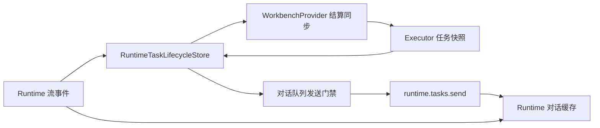
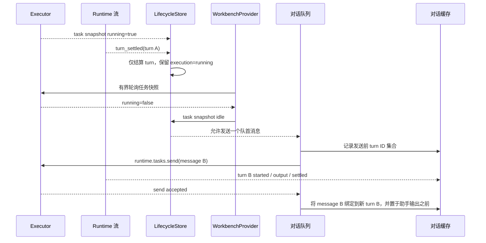

# Runtime 对话队列与执行结算

## 范围

约束 Wework 如何区分 turn 终态与 Executor 执行空闲、串行发送后续消息，并在流事件早于发送响应时保持用户消息与 Codex turn 的正确归属。

## 连线图

## 时序图

## 代码归属

| 职责                          | 代码                                                                                                                              |
| ----------------------------- | --------------------------------------------------------------------------------------------------------------------------------- |
| Runtime 执行、turn 与快照归并 | `wework/src/features/workbench/runtimeTaskLifecycle/`                                                                             |
| 终态后的 Executor 空闲同步    | `wework/src/features/workbench/WorkbenchProvider.tsx`                                                                             |
| 队列门禁与发送                | `wework/src/components/layout/useWorkbenchPaneSession.ts`、`wework/src/components/layout/workspace-panels/TemporaryChatPanel.tsx` |
| turn 归并和消息投影           | `wework/src/features/workbench/runtimeConversationTurns.ts`                                                                       |
| 按任务共享的对话缓存          | `wework/src/features/workbench/runtimeConversationCache.ts`                                                                       |

## 必要不变量

- `turn_settled` 只证明当前 turn 已终止；当权威任务快照仍为 `running=true` 时，不得把 Executor 执行投影为空闲。
- 终态流事件后必须通过有界快照同步等待 Executor 结算；只有权威快照为 `running=false` 时，普通队列才能发送。
- 每个任务同一时间最多有一个队列消息处于发送中；下一条消息还必须等待已接受消息的新 turn 被确认。
- Executor 返回 busy 时保留原队列项及客户端消息 ID，不做盲目定时重试，也不提前渲染为已发送。
- 发送请求前记录已有 turn ID。发送被接受后，用户消息优先绑定到发送期间出现且尚无用户消息的新 turn，即使该 turn 已在响应返回前结束。
- 已接受用户消息必须投影在所属 turn 的助手内容之前，并通过客户端消息 ID 去重。
