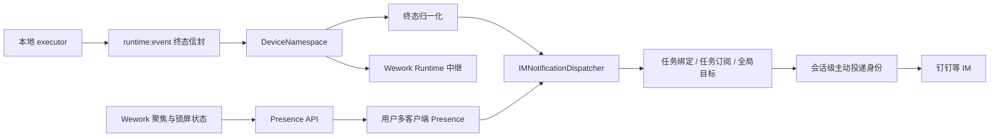
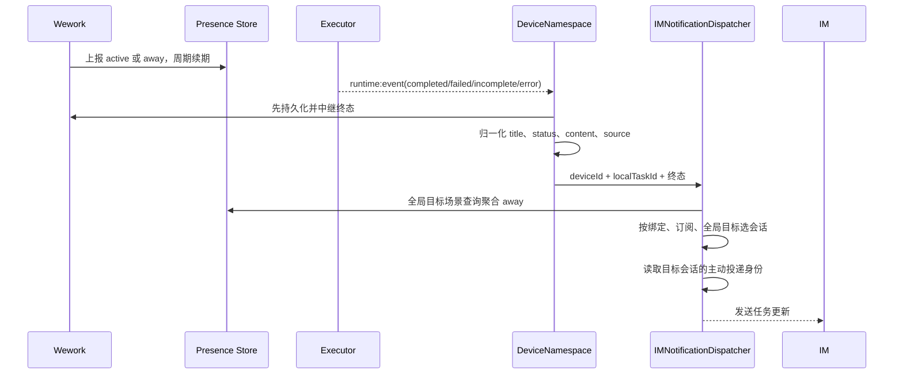

# Runtime 任务 IM 通知

范围：Wework 离开电脑后，本地 Runtime 任务终态如何投递到已配置的 IM 会话。不含 IM 发起的续聊卡片流式回传。

| 边界                    | 代码归属                                                       |
| ----------------------- | -------------------------------------------------------------- |
| 聚焦、锁屏与心跳上报    | `wework/src/features/workbench/awayImNotificationPresence.ts` |
| Presence 与通知目标状态 | `backend/app/services/im/session_service.py`                   |
| Runtime 终态信封        | `executor/src/runtime_work/events.rs`、Runtime handler         |
| 终态归一化与中继        | `backend/app/api/ws/device_namespace.py`                       |
| 会话选择与通道发送      | `backend/app/services/im/notification_dispatcher.py`           |
| 会话级主动投递身份      | `backend/app/models/im_session.py`、通道 Handler                |

不变量：`runtime:event` 是新 executor 的终态通知主链路，`runtime.tasks.updated` 只保留旧 executor 兼容；通知入口只接受 `response.completed`、`response.failed`、`response.incomplete` 和 `error` 四类终态；通知身份恒为 `deviceId + localTaskId`，不使用 `workspacePath`；任务当前绑定会话优先于任务订阅，任务订阅优先于全局目标；只有全局目标受聚合 away 状态限制，任一新鲜客户端 active 时不得发送全局提醒；`source.source == "im"` 的回合不得回声通知；用户映射方式只决定 Wegent 用户归属，不决定出站接收人；钉钉私聊会话必须单独保存并使用自己的 `sender_staff_id`，不得把会话 `sender_id` 当作 staffId，也不得从同一 Wegent 用户的其他会话借用 staffId；已有会话仅可在用户 IM 绑定的 `last_conversation_id` 与会话完全一致时回填 staffId；成功终态必须有非空回答，失败和取消终态允许没有回答正文；IM 发送失败不得阻断 Runtime 持久化和 Wework 中继；日志不得记录回答正文、令牌或通道密钥。
