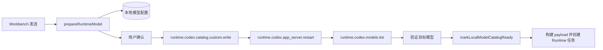
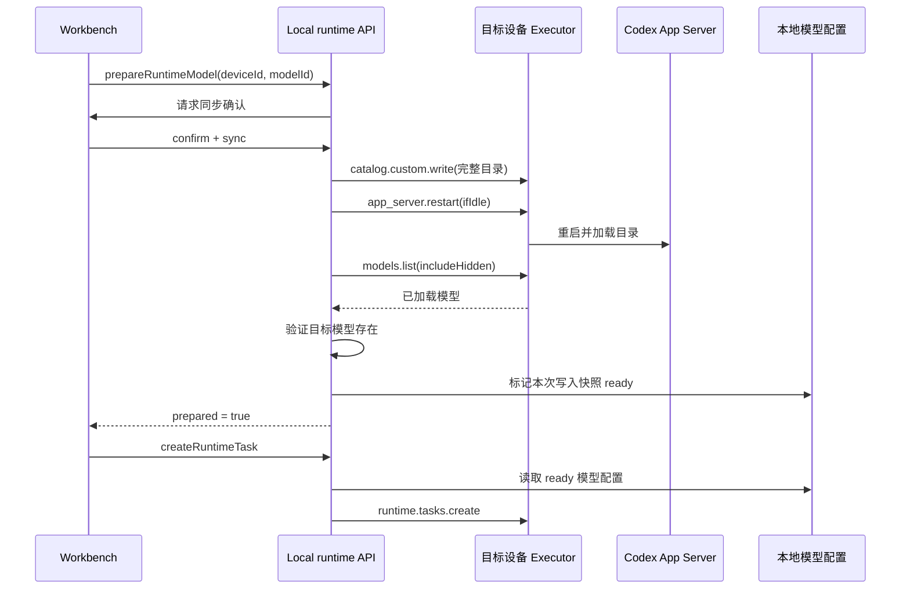

# Runtime 模型目录同步

范围：Wework 将本地配置的模型同步到目标设备的 Codex 目录，并在同步完成后立即创建 Runtime 任务。

| 边                             | 代码归属                                                        |
| ------------------------------ | --------------------------------------------------------------- |
| Workbench 发送前模型准备       | `wework/src/features/workbench/useWorkbenchRuntimeMessaging.ts` |
| 目录写入、重启、验证和任务创建 | `wework/src/api/local/localServices.ts`                         |
| 模型配置版本与 ready 状态      | `wework/src/features/model-settings/localModelSettings.ts`      |
| 云设备 Runtime RPC 转发        | `backend/app/services/device/runtime_rpc_service.py`            |
| 真实桌面协议矩阵回归           | `wework/e2e/desktop/modules/desktop-build-flows.mjs`            |

不变量：模型目录按设备串行同步并按目录版本去重；只有目录写入成功、Codex 重启成功且目标模型可查询后，当前写入快照才能标记为 ready；ready 更新必须使用 `id + updatedAt`，不得覆盖同步期间产生的新配置；任务 payload 只能读取已 ready 的本地模型；同步失败或取消时不得创建 Runtime 任务。
