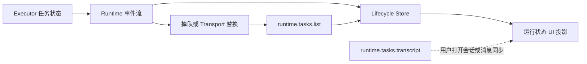
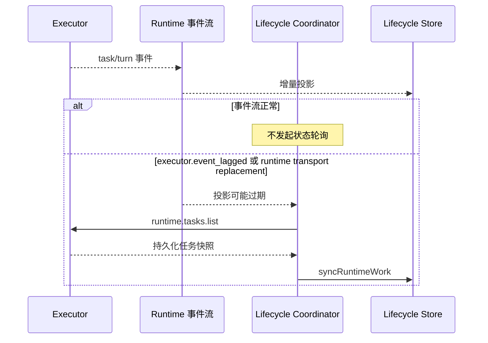

# Runtime 任务生命周期对账

## 范围

约束 Wework 如何消费 Runtime 任务事件、检测本地投影可能过期，并在不轮询 transcript 的前提下恢复权威任务状态。

## 连线图

## 时序图

## 代码归属

| 职责                             | 代码                                                                                           |
| -------------------------------- | ---------------------------------------------------------------------------------------------- |
| 本地 Executor 事件解析           | `wework/src/api/runtime/runtimeChatStream.ts`                                                  |
| Hybrid stream handler 路由       | `wework/src/api/hybrid/hybridServices.ts`                                                      |
| 异常对账协调                     | `wework/src/features/workbench/runtimeTaskLifecycle/RuntimeTaskLifecycleStreamCoordinator.tsx` |
| 生命周期真值投影                 | `wework/src/features/workbench/runtimeTaskLifecycle/RuntimeTaskLifecycleStore.ts`              |
| Executor task list 与 transcript | `executor/src/runtime_work/handler/queries.rs`                                                 |

## 必要不变量

- 正常生命周期只消费事件流，不得按时间周期读取 task list 或 transcript。
- 只有明确表示本地投影可能过期的异常信号才能触发一次 `runtime.tasks.list` 对账。
- 并发异常信号必须共享同一个在途对账请求；在途期间的新信号最多合并成一次串行尾随对账，不得形成并发请求突发或定时重试循环。
- 任务终态由 Executor 持久化状态字段投影，不得从 transcript、turn items 或 rollout JSONL 推导。
- Transcript 读取只服务于用户查看会话或明确的消息同步，不承担生命周期心跳职责。
