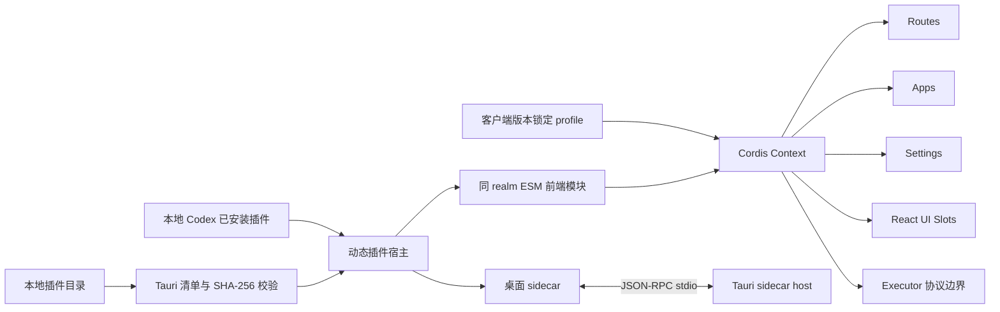
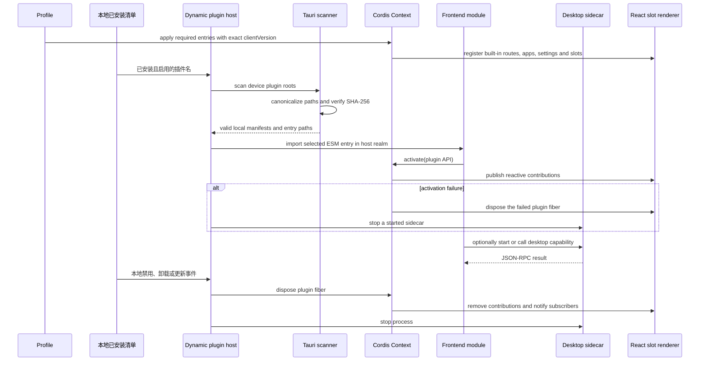

# Wework 宿主插件运行时

范围：Wework React 与 Tauri 中除 Executor 实现之外的本地产品功能装配、插件生命周期、UI 贡献、桌面 sidecar 和故障恢复。本流程不依赖 Backend，也不处理云端插件分发。

| 边                                              | 代码归属                                                  |
| ----------------------------------------------- | --------------------------------------------------------- |
| Context、service 和插件 fiber                   | 固定版本的 `@deepseek-ai/cordis`                          |
| Wework routes、apps、settings、slots 和 SDK     | `wework/src/plugin-runtime/`                              |
| React slot 合同和 React 19 renderer             | `wework/src/plugin-runtime/slots.tsx`                     |
| 内置 required profile 和产品插件入口            | `wework/src/plugins/`                                     |
| 清单扫描、路径与 SHA-256 校验、sidecar 生命周期 | `wework/src-tauri/src/workbench_plugins.rs`               |
| 本地安装清单与插件变更事件                      | Wework local Codex plugin API 和插件工作区                 |
| Executor 的启动和协议传输                       | 现有 Executor bridge；Executor 内部不属于本流程           |

不变量：产品入口只加载 profile，不枚举具体功能；所有注册必须属于一个 Cordis effect，插件卸载后不得残留 route、slot、settings、app、listener 或进程；React、ReactDOM、Cordis 和 Wework Plugin SDK 在所有前端插件中只有一个宿主实例；required 插件必须随客户端 profile 锁定到完全一致的 `clientVersion`；可选插件同时满足本地已安装且启用、设备存在有效清单、内容哈希匹配才会加载；本地安装、禁用、卸载或更新必须触发重新扫描；动态注册和卸载必须通知 React 订阅者；没有 `.wework-plugin/plugin.json` 的旧包仍是合法 Executor capability plugin；前端插件在同一 JS realm 运行，拥有宿主页面权限，SHA-256 只证明内容完整性，不构成发布者身份或权限隔离；sidecar 只能从包根目录内的已校验文件启动，插件 ID 必须与清单一致；本流程不读取云端期望态，也不由 Backend 加载或执行插件代码。
