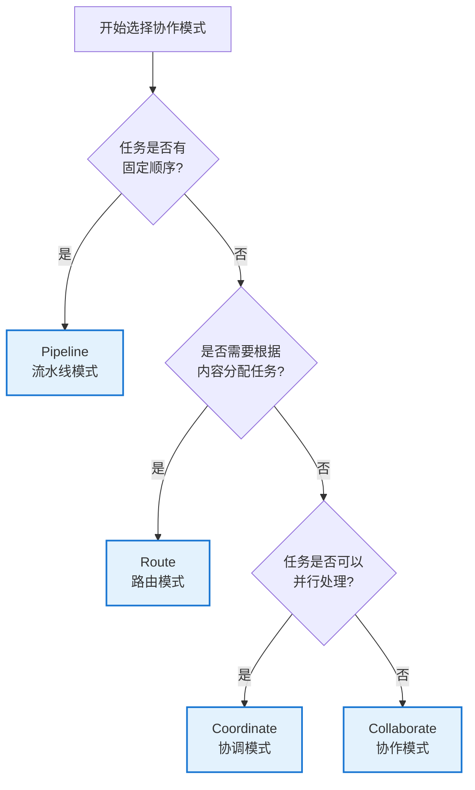
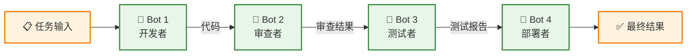
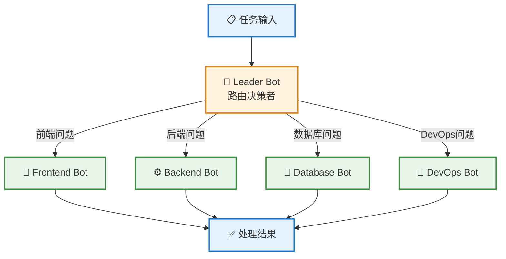
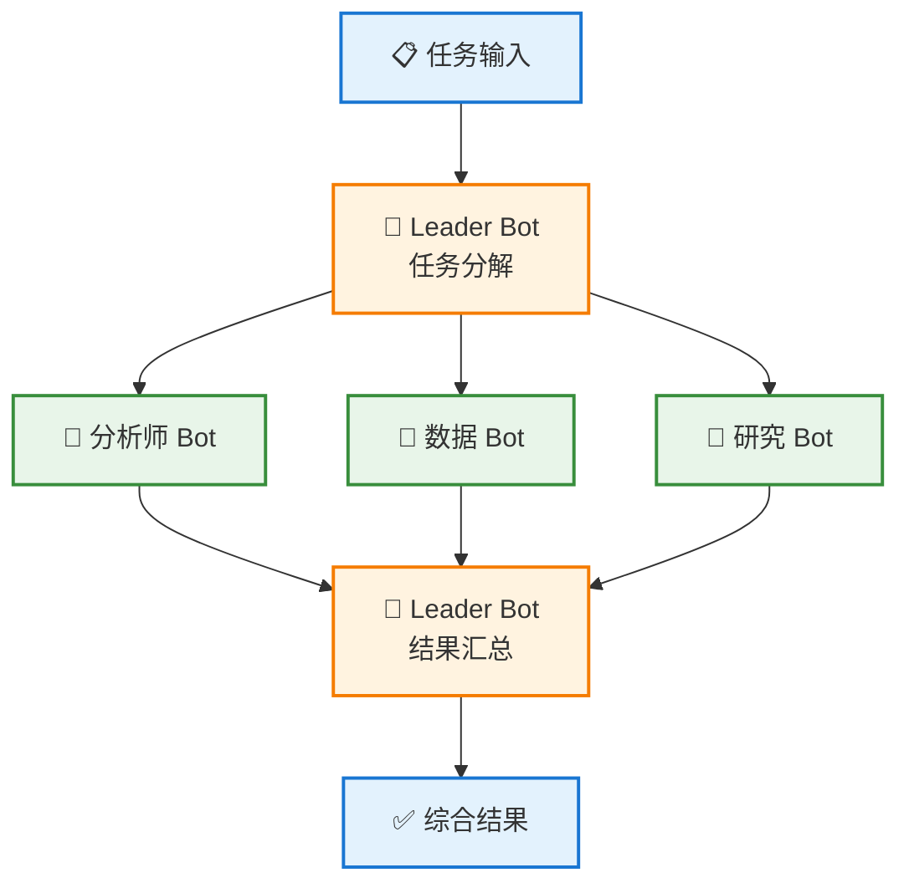
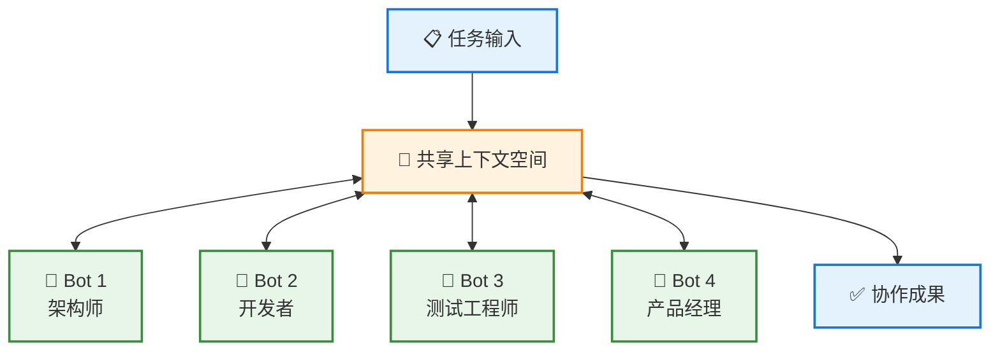
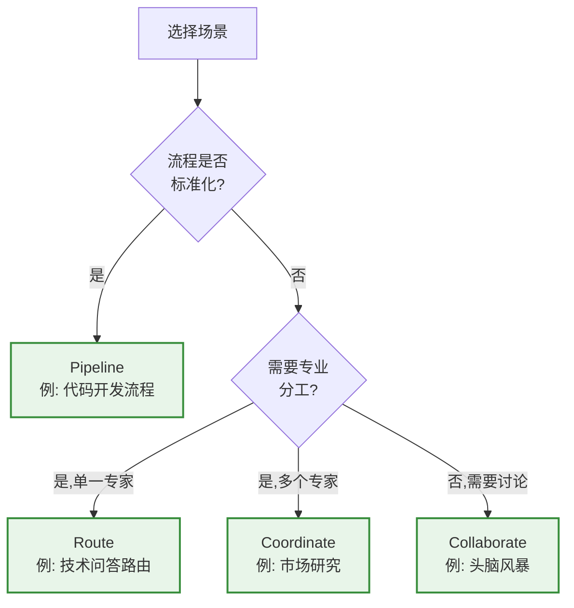

# 🤝 协作模式详解

本文档深入介绍 Wegent 平台中的四种协作模式，帮助您选择最适合的模式来构建智能体团队。

---

## 📋 目录

- [协作模式概览](#协作模式概览)
- [Pipeline（流水线）](#pipeline流水线)
- [Route（路由）](#route路由)
- [Coordinate（协调）](#coordinate协调)
- [Collaborate（协作）](#collaborate协作)
- [模式对比](#模式对比)
- [最佳实践](#最佳实践)

---

## 🌐 协作模式概览

协作模式定义了 Team 中多个 Bot 之间的交互方式和工作流程。选择合适的协作模式可以显著提高团队效率和任务完成质量。

### 四种协作模式

| 模式 | 图标 | 特点 | 适用场景 |
|------|------|------|----------|
| **Pipeline** | 🔄 | 顺序执行，线性流程 | 代码开发流程、内容生产流水线 |
| **Route** | 🎯 | 智能路由，按需分配 | 客户服务、问题分类处理 |
| **Coordinate** | 👥 | 并行协调，结果汇总 | 多角度分析、并行任务处理 |
| **Collaborate** | 💬 | 自由协作，共享上下文 | 头脑风暴、复杂问题解决 |

### 选择决策树



---

## 🔄 Pipeline（流水线）

### 概述

Pipeline 模式是最简单直观的协作模式，Bot 按照预定义的顺序依次执行，前一个 Bot 的输出作为下一个 Bot 的输入，形成一条完整的处理流水线。

### 工作流程图



### 核心特性

- ✅ **顺序执行**: 严格按照定义的顺序执行
- ✅ **数据传递**: 前一个 Bot 的输出自动传递给下一个
- ✅ **简单清晰**: 逻辑简单，易于理解和维护
- ✅ **错误隔离**: 某一环节失败可以快速定位

### 适用场景

#### 1. 软件开发流程
```
需求分析 → 设计方案 → 编码实现 → 代码审查 → 测试验证 → 部署上线
```

#### 2. 内容生产流水线
```
内容创作 → 内容编辑 → 格式排版 → 质量审核 → 发布推送
```

#### 3. 数据处理管道
```
数据采集 → 数据清洗 → 数据转换 → 数据分析 → 报告生成
```

### 完整 YAML 配置示例

```yaml
apiVersion: agent.wecode.io/v1
kind: Team
metadata:
  name: dev-pipeline-team
  namespace: default
spec:
  # 协作模式：流水线
  collaborationModel: "pipeline"

  # 团队成员（按执行顺序定义）
  members:
    # 第一步：开发者
    - name: "developer"
      role: "leader"
      botRef:
        name: developer-bot
        namespace: default
      prompt: |
        You are a senior software developer.
        Your task is to implement the feature based on the requirements.
        Write clean, well-documented code following best practices.

    # 第二步：代码审查者
    - name: "reviewer"
      role: "member"
      botRef:
        name: reviewer-bot
        namespace: default
      prompt: |
        You are a code reviewer.
        Review the code for:
        - Code quality and style
        - Potential bugs and security issues
        - Performance optimization opportunities
        Provide constructive feedback.

    # 第三步：测试工程师
    - name: "tester"
      role: "member"
      botRef:
        name: tester-bot
        namespace: default
      prompt: |
        You are a QA engineer.
        Create comprehensive tests including:
        - Unit tests
        - Integration tests
        - Edge case scenarios
        Execute tests and report results.

    # 第四步：部署专家
    - name: "deployer"
      role: "member"
      botRef:
        name: deployer-bot
        namespace: default
      prompt: |
        You are a DevOps engineer.
        Prepare the deployment:
        - Build the application
        - Create deployment configuration
        - Document deployment steps
```

### 实际案例

#### 案例 1: 博客文章生产流水线

```yaml
apiVersion: agent.wecode.io/v1
kind: Team
metadata:
  name: blog-production-pipeline
  namespace: default
spec:
  collaborationModel: "pipeline"
  members:
    - name: "writer"
      role: "leader"
      botRef:
        name: content-writer-bot
        namespace: default
      prompt: "Write an engaging blog post on the given topic with proper structure and flow."

    - name: "editor"
      role: "member"
      botRef:
        name: content-editor-bot
        namespace: default
      prompt: "Edit the content for grammar, clarity, and readability. Improve sentence structure and flow."

    - name: "seo-optimizer"
      role: "member"
      botRef:
        name: seo-bot
        namespace: default
      prompt: "Optimize the content for SEO: add meta descriptions, keywords, and improve headings."

    - name: "publisher"
      role: "member"
      botRef:
        name: publisher-bot
        namespace: default
      prompt: "Format the content for publication and create a publishing checklist."
```

**执行流程**:
1. Writer Bot 创作初稿
2. Editor Bot 编辑优化文章
3. SEO Optimizer Bot 进行 SEO 优化
4. Publisher Bot 准备发布

---

## 🎯 Route（路由）

### 概述

Route 模式由一个 Leader Bot 根据任务内容智能地将任务路由到最合适的专家 Bot 进行处理。适合需要根据不同情况选择不同处理路径的场景。

### 工作流程图



### 核心特性

- ✅ **智能路由**: Leader Bot 分析任务并选择最合适的专家
- ✅ **专业分工**: 每个 Bot 专注于特定领域
- ✅ **灵活高效**: 根据实际需求动态选择执行路径
- ✅ **可扩展**: 易于添加新的专家 Bot

### 适用场景

#### 1. 智能客服系统
```
客户问题 → 分类识别 → {技术支持|售后服务|销售咨询|投诉处理}
```

#### 2. 技术支持平台
```
技术问题 → 问题分析 → {前端专家|后端专家|数据库专家|运维专家}
```

#### 3. 内容分发系统
```
内容提交 → 内容分类 → {新闻|科技|娱乐|体育} 频道
```

### 完整 YAML 配置示例

```yaml
apiVersion: agent.wecode.io/v1
kind: Team
metadata:
  name: tech-support-route-team
  namespace: default
spec:
  # 协作模式：路由
  collaborationModel: "route"

  # 团队成员
  members:
    # Leader：路由决策者
    - name: "router"
      role: "leader"
      botRef:
        name: router-bot
        namespace: default
      prompt: |
        You are a technical support router.
        Analyze the user's question and route it to the appropriate specialist:
        - Frontend issues → frontend-expert
        - Backend issues → backend-expert
        - Database issues → database-expert
        - DevOps/Infrastructure issues → devops-expert

        Provide a brief analysis of why you chose this specialist.

    # 专家 1：前端专家
    - name: "frontend-expert"
      role: "member"
      botRef:
        name: frontend-specialist-bot
        namespace: default
      prompt: |
        You are a frontend development expert specializing in:
        - React, Vue, Angular
        - HTML, CSS, JavaScript/TypeScript
        - UI/UX best practices
        - Browser compatibility

        Provide detailed, actionable solutions to frontend problems.

    # 专家 2：后端专家
    - name: "backend-expert"
      role: "member"
      botRef:
        name: backend-specialist-bot
        namespace: default
      prompt: |
        You are a backend development expert specializing in:
        - Python, Java, Node.js
        - RESTful API design
        - Microservices architecture
        - Performance optimization

        Provide detailed, actionable solutions to backend problems.

    # 专家 3：数据库专家
    - name: "database-expert"
      role: "member"
      botRef:
        name: database-specialist-bot
        namespace: default
      prompt: |
        You are a database expert specializing in:
        - SQL and NoSQL databases
        - Query optimization
        - Database design and normalization
        - Indexing strategies

        Provide detailed, actionable solutions to database problems.

    # 专家 4：运维专家
    - name: "devops-expert"
      role: "member"
      botRef:
        name: devops-specialist-bot
        namespace: default
      prompt: |
        You are a DevOps expert specializing in:
        - Docker and Kubernetes
        - CI/CD pipelines
        - Cloud infrastructure (AWS, GCP, Azure)
        - Monitoring and logging

        Provide detailed, actionable solutions to DevOps problems.
```

### 实际案例

#### 案例 1: 多语言技术问答平台

```yaml
apiVersion: agent.wecode.io/v1
kind: Team
metadata:
  name: programming-qa-route-team
  namespace: default
spec:
  collaborationModel: "route"
  members:
    - name: "language-router"
      role: "leader"
      botRef:
        name: language-router-bot
        namespace: default
      prompt: |
        Analyze the programming question and route to the appropriate language expert:
        - Python questions → python-expert
        - JavaScript/TypeScript → js-expert
        - Java/Kotlin → jvm-expert
        - Go → go-expert

    - name: "python-expert"
      role: "member"
      botRef:
        name: python-bot
        namespace: default
      prompt: "You are a Python expert. Answer Python-related questions with code examples and best practices."

    - name: "js-expert"
      role: "member"
      botRef:
        name: javascript-bot
        namespace: default
      prompt: "You are a JavaScript/TypeScript expert. Provide modern ES6+ solutions and TypeScript types."

    - name: "jvm-expert"
      role: "member"
      botRef:
        name: java-bot
        namespace: default
      prompt: "You are a JVM expert. Answer Java and Kotlin questions with attention to performance."

    - name: "go-expert"
      role: "member"
      botRef:
        name: go-bot
        namespace: default
      prompt: "You are a Go expert. Provide idiomatic Go solutions emphasizing concurrency."
```

---

## 👥 Coordinate（协调）

### 概述

Coordinate 模式由 Leader Bot 将任务分解并分配给多个 Bot 并行处理，然后收集和汇总所有 Bot 的结果，形成最终的综合输出。

### 工作流程图



### 核心特性

- ✅ **并行处理**: 多个 Bot 同时工作，提高效率
- ✅ **任务分解**: Leader 负责将复杂任务分解
- ✅ **结果汇总**: Leader 整合多个视角的输出
- ✅ **全面深入**: 从多个角度分析问题

### 适用场景

#### 1. 市场研究分析
```
市场调研任务 → {竞争对手分析|用户调研|趋势分析|数据统计} → 综合报告
```

#### 2. 代码审查
```
代码审查任务 → {安全审查|性能审查|代码质量|测试覆盖率} → 审查报告
```

#### 3. 内容创作
```
文章主题 → {资料收集|案例研究|数据分析|专家观点} → 完整文章
```

### 完整 YAML 配置示例

```yaml
apiVersion: agent.wecode.io/v1
kind: Team
metadata:
  name: market-research-coordinate-team
  namespace: default
spec:
  # 协作模式：协调
  collaborationModel: "coordinate"

  # 团队成员
  members:
    # Leader：协调者
    - name: "coordinator"
      role: "leader"
      botRef:
        name: coordinator-bot
        namespace: default
      prompt: |
        You are a market research coordinator.

        PHASE 1 - Task Decomposition:
        Break down the market research task into parallel workstreams:
        1. Competitor analysis
        2. Customer sentiment analysis
        3. Market trend analysis
        4. Data collection and statistics

        Assign each workstream to the appropriate specialist.

        PHASE 2 - Result Synthesis:
        After receiving all reports, synthesize them into a comprehensive
        market research report with:
        - Executive summary
        - Key findings from each area
        - Strategic recommendations
        - Data visualizations and insights

    # 专家 1：竞争分析师
    - name: "competitor-analyst"
      role: "member"
      botRef:
        name: competitor-analyst-bot
        namespace: default
      prompt: |
        You are a competitor analysis specialist.
        Analyze:
        - Main competitors and market share
        - Competitor strategies and positioning
        - Strengths and weaknesses
        - Competitive advantages

        Provide a detailed competitor analysis report.

    # 专家 2：客户洞察分析师
    - name: "customer-analyst"
      role: "member"
      botRef:
        name: customer-analyst-bot
        namespace: default
      prompt: |
        You are a customer insights specialist.
        Analyze:
        - Customer demographics and segments
        - Customer pain points and needs
        - Customer satisfaction and feedback
        - Buying behavior patterns

        Provide a detailed customer analysis report.

    # 专家 3：趋势分析师
    - name: "trend-analyst"
      role: "member"
      botRef:
        name: trend-analyst-bot
        namespace: default
      prompt: |
        You are a market trend specialist.
        Analyze:
        - Industry trends and future outlook
        - Emerging technologies and innovations
        - Regulatory and policy changes
        - Market opportunities and threats

        Provide a detailed trend analysis report.

    # 专家 4：数据分析师
    - name: "data-analyst"
      role: "member"
      botRef:
        name: data-analyst-bot
        namespace: default
      prompt: |
        You are a data analytics specialist.
        Analyze:
        - Market size and growth rates
        - Statistical trends and patterns
        - Revenue forecasts
        - Key performance indicators

        Provide a detailed data analysis report with visualizations.
```

### 实际案例

#### 案例 1: 全面代码审查团队

```yaml
apiVersion: agent.wecode.io/v1
kind: Team
metadata:
  name: comprehensive-code-review-team
  namespace: default
spec:
  collaborationModel: "coordinate"
  members:
    - name: "review-coordinator"
      role: "leader"
      botRef:
        name: review-coordinator-bot
        namespace: default
      prompt: |
        Coordinate a comprehensive code review:
        1. Distribute code to specialized reviewers
        2. Collect all review feedback
        3. Synthesize into a final review report with prioritized action items

    - name: "security-reviewer"
      role: "member"
      botRef:
        name: security-bot
        namespace: default
      prompt: "Review code for security vulnerabilities, injection risks, and authentication issues."

    - name: "performance-reviewer"
      role: "member"
      botRef:
        name: performance-bot
        namespace: default
      prompt: "Review code for performance issues, optimization opportunities, and scalability."

    - name: "quality-reviewer"
      role: "member"
      botRef:
        name: quality-bot
        namespace: default
      prompt: "Review code quality, maintainability, design patterns, and best practices."

    - name: "test-reviewer"
      role: "member"
      botRef:
        name: test-bot
        namespace: default
      prompt: "Review test coverage, test quality, and identify missing test scenarios."
```

---

## 💬 Collaborate（协作）

### 概述

Collaborate 模式允许所有 Bot 在共享上下文中自由讨论和协作，没有固定的执行顺序或明确的角色划分。所有 Bot 可以看到彼此的发言，并基于整体对话进行响应。

### 工作流程图



### 核心特性

- ✅ **共享上下文**: 所有 Bot 看到完整的对话历史
- ✅ **自由发言**: 没有固定顺序，Bot 可以随时参与
- ✅ **集思广益**: 促进创意和多角度思考
- ✅ **动态交互**: Bot 可以回应其他 Bot 的观点

### 适用场景

#### 1. 头脑风暴会议
```
创意主题 → [产品经理 ↔ 设计师 ↔ 工程师 ↔ 营销专家] → 创意方案
```

#### 2. 技术方案设计
```
技术挑战 → [架构师 ↔ 开发者 ↔ DBA ↔ 运维工程师] → 技术方案
```

#### 3. 复杂问题诊断
```
系统问题 → [后端工程师 ↔ 前端工程师 ↔ DBA ↔ 运维] → 问题根因
```

### 完整 YAML 配置示例

```yaml
apiVersion: agent.wecode.io/v1
kind: Team
metadata:
  name: product-brainstorm-team
  namespace: default
spec:
  # 协作模式：协作
  collaborationModel: "collaborate"

  # 团队成员（所有成员平等参与）
  members:
    # 产品经理视角
    - name: "product-manager"
      role: "member"
      botRef:
        name: pm-bot
        namespace: default
      prompt: |
        You are a product manager participating in a brainstorming session.
        Focus on:
        - User needs and market fit
        - Feature prioritization
        - Business value and ROI
        - User experience

        Engage actively with other team members' ideas and build upon them.

    # 技术架构师视角
    - name: "architect"
      role: "member"
      botRef:
        name: architect-bot
        namespace: default
      prompt: |
        You are a software architect participating in a brainstorming session.
        Focus on:
        - Technical feasibility
        - System design and scalability
        - Integration challenges
        - Technical debt considerations

        Provide technical insights and collaborate with the team.

    # UX 设计师视角
    - name: "ux-designer"
      role: "member"
      botRef:
        name: ux-bot
        namespace: default
      prompt: |
        You are a UX designer participating in a brainstorming session.
        Focus on:
        - User interface and interaction design
        - User journey and experience
        - Accessibility and usability
        - Visual design principles

        Contribute design perspectives and iterate on ideas.

    # 数据分析师视角
    - name: "data-analyst"
      role: "member"
      botRef:
        name: data-bot
        namespace: default
      prompt: |
        You are a data analyst participating in a brainstorming session.
        Focus on:
        - Data-driven insights
        - Metrics and KPIs
        - User behavior analysis
        - A/B testing opportunities

        Provide analytical perspective and support decisions with data.

    # 营销专家视角
    - name: "marketing-expert"
      role: "member"
      botRef:
        name: marketing-bot
        namespace: default
      prompt: |
        You are a marketing expert participating in a brainstorming session.
        Focus on:
        - Market positioning
        - Target audience
        - Go-to-market strategy
        - Competitive differentiation

        Contribute marketing insights and collaborate on strategy.
```

### 实际案例

#### 案例 1: 系统故障诊断团队

```yaml
apiVersion: agent.wecode.io/v1
kind: Team
metadata:
  name: incident-response-team
  namespace: default
spec:
  collaborationModel: "collaborate"
  members:
    - name: "backend-engineer"
      role: "member"
      botRef:
        name: backend-sre-bot
        namespace: default
      prompt: |
        You are a backend engineer responding to a system incident.
        Check: API services, application logs, error rates, service dependencies.
        Share findings and collaborate to identify root cause.

    - name: "database-admin"
      role: "member"
      botRef:
        name: dba-bot
        namespace: default
      prompt: |
        You are a database administrator responding to a system incident.
        Check: Database performance, query performance, connections, locks, replication status.
        Share findings and collaborate to identify root cause.

    - name: "frontend-engineer"
      role: "member"
      botRef:
        name: frontend-sre-bot
        namespace: default
      prompt: |
        You are a frontend engineer responding to a system incident.
        Check: Client-side errors, network requests, browser console, CDN status.
        Share findings and collaborate to identify root cause.

    - name: "devops-engineer"
      role: "member"
      botRef:
        name: devops-bot
        namespace: default
      prompt: |
        You are a DevOps engineer responding to a system incident.
        Check: Infrastructure health, container status, network connectivity, resource usage.
        Share findings and collaborate to identify root cause.
```

#### 案例 2: 创新产品设计工作坊

```yaml
apiVersion: agent.wecode.io/v1
kind: Team
metadata:
  name: innovation-workshop-team
  namespace: default
spec:
  collaborationModel: "collaborate"
  members:
    - name: "creative-thinker"
      role: "member"
      botRef:
        name: creative-bot
        namespace: default
      prompt: "Generate innovative and out-of-the-box ideas. Challenge assumptions and explore possibilities."

    - name: "practical-analyst"
      role: "member"
      botRef:
        name: analyst-bot
        namespace: default
      prompt: "Evaluate ideas for feasibility, cost, and practicality. Provide realistic assessments."

    - name: "customer-advocate"
      role: "member"
      botRef:
        name: customer-bot
        namespace: default
      prompt: "Represent the customer perspective. Ensure ideas truly solve user problems."

    - name: "tech-innovator"
      role: "member"
      botRef:
        name: tech-bot
        namespace: default
      prompt: "Explore cutting-edge technologies that could enable innovative solutions."
```

---

## 📊 模式对比

### 功能对比表

| 特性 | Pipeline | Route | Coordinate | Collaborate |
|------|----------|-------|------------|-------------|
| **执行顺序** | 固定顺序 | 动态选择单一路径 | 并行执行 | 无固定顺序 |
| **Bot 交互** | 单向传递 | Leader → 专家 | Leader 协调 | 全员互动 |
| **上下文共享** | 部分（前后） | 独立上下文 | Leader 汇总 | 完全共享 |
| **适合团队规模** | 3-6 个 Bot | 1 Leader + N 专家 | 1 Leader + 3-5 专家 | 3-8 个 Bot |
| **执行效率** | 中等（串行） | 高（单一路径） | 高（并行） | 中等（讨论） |
| **结果复杂度** | 线性累积 | 单一专家输出 | 综合报告 | 共识结果 |
| **易用性** | ⭐⭐⭐⭐⭐ | ⭐⭐⭐⭐ | ⭐⭐⭐ | ⭐⭐⭐ |
| **灵活性** | ⭐⭐ | ⭐⭐⭐⭐ | ⭐⭐⭐⭐ | ⭐⭐⭐⭐⭐ |

### 使用场景对比



### 性能对比

| 模式 | 平均耗时 | 并行度 | 资源消耗 | 可预测性 |
|------|----------|--------|----------|----------|
| **Pipeline** | N × T | 低（串行） | 低 | 高 |
| **Route** | T + 路由时间 | 低（单路径） | 低 | 高 |
| **Coordinate** | T + 汇总时间 | 高（并行） | 高 | 中 |
| **Collaborate** | 不确定 | 高（并发） | 高 | 低 |

*注: N = Bot 数量, T = 单个 Bot 平均处理时间*

---

## 💡 最佳实践

### 1. Pipeline 最佳实践

#### ✅ 推荐做法
- 每个阶段职责单一明确
- 控制流水线长度（建议不超过 6 个步骤）
- 每个 Bot 的 prompt 清晰定义输入输出期望
- 添加错误处理和验证步骤

#### ❌ 避免做法
- 过长的流水线（超过 8 个步骤）
- 步骤之间职责重叠
- 缺少中间验证环节
- Bot 顺序不合理

#### 示例：优化的流水线设计
```yaml
members:
  - name: "validator"        # 首先验证输入
  - name: "processor"        # 然后处理
  - name: "quality-check"    # 质量检查
  - name: "finalizer"        # 最后完成
```

### 2. Route 最佳实践

#### ✅ 推荐做法
- Leader Bot 的路由逻辑清晰准确
- 专家 Bot 领域划分明确，避免重叠
- 为 Leader 提供详细的路由规则
- 包含默认路由处理未知情况

#### ❌ 避免做法
- 路由规则模糊不清
- 专家领域重叠导致选择困难
- 缺少默认处理路径
- 路由决策过于复杂

#### 示例：清晰的路由规则
```yaml
- name: "router"
  prompt: |
    Route questions based on clear criteria:
    - If about UI/UX/styling → frontend-expert
    - If about API/database/server → backend-expert
    - If about deployment/infrastructure → devops-expert
    - If unclear or mixed → general-expert (default)
```

### 3. Coordinate 最佳实践

#### ✅ 推荐做法
- Leader 明确任务分解策略
- 专家 Bot 职责不重叠
- Leader 需要强大的汇总能力
- 控制并行 Bot 数量（3-5 个最佳）

#### ❌ 避免做法
- 任务分解不均衡
- 过多并行 Bot（超过 7 个）
- Leader 缺少汇总指导
- 专家输出格式不统一

#### 示例：结构化的协调
```yaml
- name: "coordinator"
  prompt: |
    STEP 1: Decompose task into 4 parallel workstreams
    STEP 2: Assign to specialists
    STEP 3: Collect all reports in structured format
    STEP 4: Synthesize into unified report with:
      - Executive summary
      - Key findings per specialist
      - Recommendations
```

### 4. Collaborate 最佳实践

#### ✅ 推荐做法
- 定义清晰的协作目标
- 每个 Bot 有明确的视角/角色
- 设置讨论轮次或停止条件
- 鼓励 Bot 相互引用和回应

#### ❌ 避免做法
- 缺少明确目标导致发散
- 角色定义模糊
- 没有讨论终止条件
- Bot 各说各话不互动

#### 示例：有效的协作设置
```yaml
members:
  - name: "architect"
    prompt: |
      Role: Technical Architect
      Goal: Design scalable solution
      Interaction: Build on others' ideas, raise technical concerns

  - name: "product"
    prompt: |
      Role: Product Manager
      Goal: Ensure user value
      Interaction: Connect features to user needs, prioritize

  # Include facilitation instructions
  - name: "facilitator"
    role: "leader"
    prompt: |
      Guide discussion towards concrete action items.
      Summarize when reaching consensus.
      Keep discussion focused on the goal.
```

### 5. 通用最佳实践

#### Prompt 设计
```yaml
prompt: |
  # 好的 Prompt 结构：
  1. 角色定义：You are a [role]...
  2. 职责说明：Your responsibilities include...
  3. 输入说明：You will receive...
  4. 输出要求：Provide output in the format...
  5. 质量标准：Ensure [quality criteria]...
```

#### 团队规模建议
- **Pipeline**: 3-6 个 Bot
- **Route**: 1 Leader + 3-8 专家
- **Coordinate**: 1 Leader + 3-5 专家
- **Collaborate**: 3-8 个 Bot

#### 性能优化
- 对于简单任务，优先选择 Pipeline 或 Route
- 对于需要深度的任务，选择 Coordinate
- 对于需要创造性的任务,选择 Collaborate
- 避免过度设计，从简单模式开始

---

## 🎓 实战案例库

### 案例 1: 新闻洞察平台（Coordinate）

```yaml
apiVersion: agent.wecode.io/v1
kind: Team
metadata:
  name: news-insight-team
  namespace: default
spec:
  collaborationModel: "coordinate"
  members:
    - name: "coordinator"
      role: "leader"
      botRef: {name: coordinator-bot, namespace: default}
      prompt: "Coordinate news analysis: assign data collection, sentiment analysis, and trend identification. Synthesize comprehensive news report."

    - name: "news-collector"
      role: "member"
      botRef: {name: collector-bot, namespace: default}
      prompt: "Collect news from multiple sources on the given topic. Provide summaries with sources and timestamps."

    - name: "sentiment-analyzer"
      role: "member"
      botRef: {name: sentiment-bot, namespace: default}
      prompt: "Analyze sentiment and tone of news articles. Identify positive, negative, and neutral coverage."

    - name: "trend-identifier"
      role: "member"
      botRef: {name: trend-bot, namespace: default}
      prompt: "Identify emerging trends and patterns in news coverage. Highlight key themes and developments."
```

### 案例 2: 全栈开发团队（Pipeline）

```yaml
apiVersion: agent.wecode.io/v1
kind: Team
metadata:
  name: fullstack-dev-team
  namespace: default
spec:
  collaborationModel: "pipeline"
  members:
    - name: "requirements-analyst"
      role: "leader"
      botRef: {name: analyst-bot, namespace: default}
      prompt: "Analyze requirements and create detailed technical specifications."

    - name: "backend-developer"
      role: "member"
      botRef: {name: backend-bot, namespace: default}
      prompt: "Implement backend API based on specifications. Use Python FastAPI."

    - name: "frontend-developer"
      role: "member"
      botRef: {name: frontend-bot, namespace: default}
      prompt: "Build frontend interface using React. Integrate with backend API."

    - name: "integration-tester"
      role: "member"
      botRef: {name: tester-bot, namespace: default}
      prompt: "Test full-stack integration. Report any issues or bugs."
```

---

## 🔗 相关资源

- [核心概念](./core-concepts.md) - 理解 Bot、Team 等核心概念
- [系统架构](./architecture.md) - 了解 Wegent 的架构设计
- [YAML 配置规范](../reference/yaml-specification.md) - 完整的配置格式说明
- [创建 Team 指南](../guides/user/creating-teams.md) - 逐步创建团队的指南

---

<p align="center">选择合适的协作模式是成功的关键! 🚀</p>
