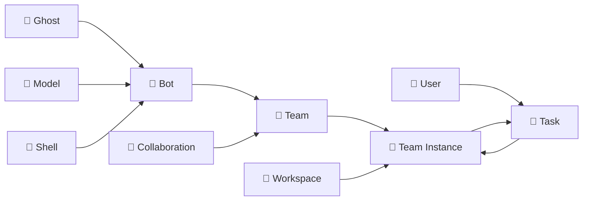

# 🧠 核心概念

本文档详细介绍 Wegent 平台的核心概念，帮助您理解各个组件及其关系。

---

## 🚀 平台功能概览

Wegent 是一个开源的 AI 原生操作系统，提供五大核心功能模块：

### 💬 对话 - AI 聊天

一个完全开源的聊天 Agent，支持：

- **多模型兼容**：DeepSeek、GLM、GPT、Claude 等各种协议兼容的模型
- **对话历史**：支持新建对话和多轮对话，支持对话历史的保存和分享
- **多人对话**：支持 AI 群聊，AI 可以根据群聊历史进行回复
- **附件解析**：可在单聊、群聊中给 AI 发送 txt、pdf、ppt、doc、图片格式的附件
- **追问模式**：模型通过启发式问题帮你澄清思路
- **纠错模式**：自动调用多个模型矫正回答
- **长期记忆**：支持集成 mem0 实现对话的长期记忆
- **运行沙箱**：支持通过沙箱执行命令或修改文件，兼容 E2B 协议
- **自定义配置**：可通过配置的方式自定义提示词、MCP 和 Skill（自带绘制图表技能）

### 💻 编码 - 云端编码引擎

一个云端的 Claude Code 编码执行引擎，支持：

- **模型配置**：配置各种兼容 Claude 协议的模型
- **并行执行**：可在云端同时执行多个编码任务
- **需求澄清**：支持需求澄清模式，AI 会结合代码和提问，帮你梳理需求后生成规格文档
- **Git 集成**：支持与 GitHub/GitLab/Gitea/Gerrit 进行集成，直接从代码仓库克隆、修改后创建 PR
- **MCP/Skill 集成**：支持通过配置为 Agent 集成 MCP/Skill
- **多轮对话**：支持多轮对话追问

### 📡 关注 - AI 任务触发器

一个云端的 AI 任务触发器，支持：

- **全部能力**：任务可以使用对话和编码的全部能力
- **定时/事件触发**：设定定时或基于事件执行 AI 任务，如每天 9 点汇总今天的 AI 新闻
- **信息流展示**：展示基于 AI 任务生成的信息流
- **事件过滤**：支持事件过滤，如"只有明天要下雨了才通知我"

### 📚 知识 - AI 文档仓库

一个云端 AI 文档仓库，支持：

- **文档管理**：上传、管理 txt/doc/ppt/xls 等等格式的文档到知识库
- **导入来源**：支持导入网页、钉钉多维表到知识库
- **NotebookLM 模式**：支持在笔记本里直接选择文档进行提问
- **在线编辑**：笔记本模式支持在线编辑文本文件
- **知识引用**：支持在单聊、群聊中让 AI 引用知识库进行回答

### ⚙️ 定制化 - 全面可配置

上面的所有功能都是可定制的：

- **网页创建智能体**：支持在网页中创建自定义智能体，可直接在页面上配置提示词、MCP、Skill 和多智能体协作
- **智能体向导**：支持智能体创建向导，可根据需求自动生成和微调提示词
- **组内共享**：支持人员创建和加入组，组内可共享智能体、模型、Skill 等等

---

## 🔗 功能与 CRD 映射

| 功能 | 相关 CRD | 说明 |
|------|----------|------|
| **对话** | Chat Shell + Team | 通过 Chat Shell 直接与 LLM 对话 |
| **编码** | ClaudeCode Shell + Team + Workspace | 云端编码执行，支持 Git 集成 |
| **关注** | Subscription + Team | 定时/事件触发的 AI 任务 |
| **知识** | KnowledgeBase + Retriever | 文档存储和 RAG 检索 |
| **定制化** | Ghost + Bot + Team | 配置提示词、工具和协作模式 |

---

## ⚠️ 术语说明：Team vs Bot

> **重要提示：** 为避免混淆，请注意代码层面的术语与用户界面显示名称的区别。

| 代码/CRD 层面 | 用户界面 (中文) | 说明 |
|--------------|----------------|------|
| **Team** | **智能体** | 用户直接使用的 AI 智能体，执行任务的主体 |
| **Bot** | **机器人** | 组成智能体的基础组件，是智能体的"工人单元" |

**简单理解：**
- **机器人 (Bot)** = 一个配置好的 AI 工人（包含提示词、运行环境、模型）
- **智能体 (Team)** = 由一个或多个机器人组成的"工作团队"，用户通过智能体来执行任务

---

## 📋 CRD 架构概览

Wegent 基于 Kubernetes 风格的声明式 API 和 CRD (Custom Resource Definition) 设计模式，提供了一套标准化的框架来创建和管理 AI 智能体生态系统。

### 核心资源类型

| 图标 | 代码名称 | 说明 | 类比 |
|------|----------|------|------|
| 👻 | **Ghost** | 智能体的"灵魂" | 定义个性和能力 |
| 🧠 | **Model** | AI 模型配置 | 大脑的配置参数 |
| 🐚 | **Shell** | 运行时环境 | 可执行程序容器 |
| 🤖 | **Bot** | 完整智能体实例 | Ghost + Shell + Model |
| 👥 | **Team** | 协作团队 | 多个 Bot 的协作组合 |
| 🤝 | **Collaboration** | 协作模式 | Bot 之间的交互模式 |
| 💼 | **Workspace** | 工作环境 | 隔离的代码工作空间 |
| 🎯 | **Task** | 任务 | 分配给 Team 的工作单元 |

---

## 👻 Ghost - 智能体的灵魂

Ghost 代表智能体的"灵魂"，定义了智能体的个性、能力和行为模式。

### YAML 配置示例

```yaml
apiVersion: agent.wecode.io/v1
kind: Ghost
metadata:
  name: developer-ghost
  namespace: default
spec:
  systemPrompt: "You are a professional software developer, skilled in using TypeScript and React to develop frontend applications."
  mcpServers:
    github:
      env:
        GITHUB_PERSONAL_ACCESS_TOKEN: ghp_xxxxx
      command: docker
      args:
        - run
        - -i
        - --rm
        - -e
        - GITHUB_PERSONAL_ACCESS_TOKEN
        - ghcr.io/github/github-mcp-server
status:
  state: "Available"
```

---

## 🧠 Model - AI 模型配置

Model 定义了 AI 模型的配置，包括环境变量、模型参数等。

### YAML 配置示例

```yaml
apiVersion: agent.wecode.io/v1
kind: Model
metadata:
  name: claude-model
  namespace: default
spec:
  modelConfig:
    env:
      ANTHROPIC_MODEL: "openrouter,anthropic/claude-sonnet-4"
      ANTHROPIC_AUTH_TOKEN: "sk-xxxxxx"
      ANTHROPIC_BASE_URL: "http://xxxxx"
      ANTHROPIC_DEFAULT_HAIKU_MODEL: "openrouter,anthropic/claude-haiku-4.5"
status:
  state: "Available"
```

---

## 🐚 Shell - 运行时环境

Shell 是智能体运行的容器，指定了运行时环境和支持的模型类型。

### Shell 类型

| 类型 | 说明 | 使用场景 |
|------|------|----------|
| **Chat** | 直接 LLM API（无 Docker） | 轻量级对话 |
| **ClaudeCode** | Docker 中的 Claude Code SDK | 云端编码任务 |
| **Agno** | Docker 中的 Agno 框架 | 多智能体协作 |
| **Dify** | 外部 Dify API 代理 | Dify 工作流集成 |

### YAML 配置示例

```yaml
apiVersion: agent.wecode.io/v1
kind: Shell
metadata:
  name: claude-shell
  namespace: default
spec:
  runtime: "ClaudeCode"
  supportModel:
    - "openai"
    - "anthropic"
status:
  state: "Available"
```

---

## 🤖 Bot - 机器人（智能体的基础组件）

> **术语说明：** Bot 在用户界面中显示为"**机器人**"，是组成智能体(Team)的基础组件。

Bot 是一个完整的智能体实例，结合了 Ghost (灵魂)、Shell (容器) 和 Model (配置)。

### YAML 配置示例

```yaml
apiVersion: agent.wecode.io/v1
kind: Bot
metadata:
  name: developer-bot
  namespace: default
spec:
  ghostRef:
    name: developer-ghost
    namespace: default
  shellRef:
    name: claude-shell
    namespace: default
  modelRef:
    name: claude-model
    namespace: default
status:
  state: "Available"
```

---

## 👥 Team - 智能体（用户直接使用的 AI 助手）

> **术语说明：** Team 在用户界面中显示为"**智能体**"，是用户直接交互和使用的 AI 助手实体。用户创建任务时选择的就是 Team（智能体）。

Team 定义了多个 Bot（机器人）的协作组合，指定了成员角色和协作模式。

### YAML 配置示例

```yaml
apiVersion: agent.wecode.io/v1
kind: Team
metadata:
  name: dev-team
  namespace: default
spec:
  members:
    - name: "developer"
      botRef:
        name: developer-bot
        namespace: default
      prompt: "You are the developer in the team, responsible for implementing features..."
      role: "leader"
    - name: "reviewer"
      botRef:
        name: reviewer-bot
        namespace: default
      prompt: "You are the code reviewer in the team, responsible for reviewing code quality..."
      role: "member"
  collaborationModel: "pipeline"
status:
  state: "Available"
```

---

## 🤝 Collaboration - 协作模式

Collaboration 定义了 Team 中 Bot 之间的交互模式，类似于工作流。

### 四种协作模式

#### 1. **Pipeline (流水线)**
顺序执行，前一个 Bot 的输出作为下一个 Bot 的输入。
```
Developer Bot → Reviewer Bot → Tester Bot → Deployer Bot
```

#### 2. **Route (路由)**
由 Leader 根据任务内容分配给合适的 Bot。
```
User Query → Leader Bot → {Frontend Bot | Backend Bot | DB Bot}
```

#### 3. **Coordinate (协调)**
Leader 协调多个 Bot 并行工作，汇总结果。
```
Leader Bot → [Analyst Bot, Data Bot, Report Bot] → Leader Bot (汇总)
```

#### 4. **Collaborate (协作)**
所有 Bot 共享上下文，自由讨论和协作。
```
[Bot A ↔ Bot B ↔ Bot C] (共享上下文)
```

---

## 💼 Workspace - 工作环境

Workspace 定义了团队的工作环境，包括代码仓库、分支等信息。

### YAML 配置示例

```yaml
apiVersion: agent.wecode.io/v1
kind: Workspace
metadata:
  name: project-workspace
  namespace: default
spec:
  repository:
    gitUrl: "https://github.com/user/repo.git"
    gitRepo: "user/repo"
    gitRepoId: 12345
    branchName: "main"
    gitDomain: "github.com"
status:
  state: "Available"
```

---

## 🎯 Task - 任务

Task 是分配给 Team 的可执行工作单元，关联了 Team 和 Workspace。

### YAML 配置示例

```yaml
apiVersion: agent.wecode.io/v1
kind: Task
metadata:
  name: implement-feature
  namespace: default
spec:
  title: "Implement new feature"
  prompt: "Please implement a user authentication feature with JWT tokens"
  teamRef:
    name: dev-team
    namespace: default
  workspaceRef:
    name: project-workspace
    namespace: default
status:
  state: "Available"
  status: "PENDING"
  progress: 0
```

---

## 🔄 概念关系图



---

## 💡 最佳实践

### 1. Ghost 设计
- ✅ 明确定义智能体的专业领域
- ✅ 提供清晰的行为指南
- ✅ 配置必要的 MCP 工具

### 2. Bot 组合
- ✅ 为不同任务创建专门的 Bot
- ✅ 复用 Ghost 和 Model 配置
- ✅ 合理选择 Shell 类型

### 3. Team 构建
- ✅ 选择合适的协作模式
- ✅ 明确成员角色和职责
- ✅ 为每个成员提供清晰的任务提示

---

## 🔗 相关资源

- [YAML 配置详解](../reference/yaml-specification.md) - 完整的 YAML 配置格式说明
- [协作模式详解](./collaboration-models.md) - 四种协作模式的详细说明
- [创建 Bot 指南](../guides/user/creating-bots.md) - 如何创建和配置 Bot
- [创建 Team 指南](../guides/user/creating-teams.md) - 如何构建协作团队

---

<p align="center">理解这些核心概念是使用 Wegent 的基础! 🚀</p>
