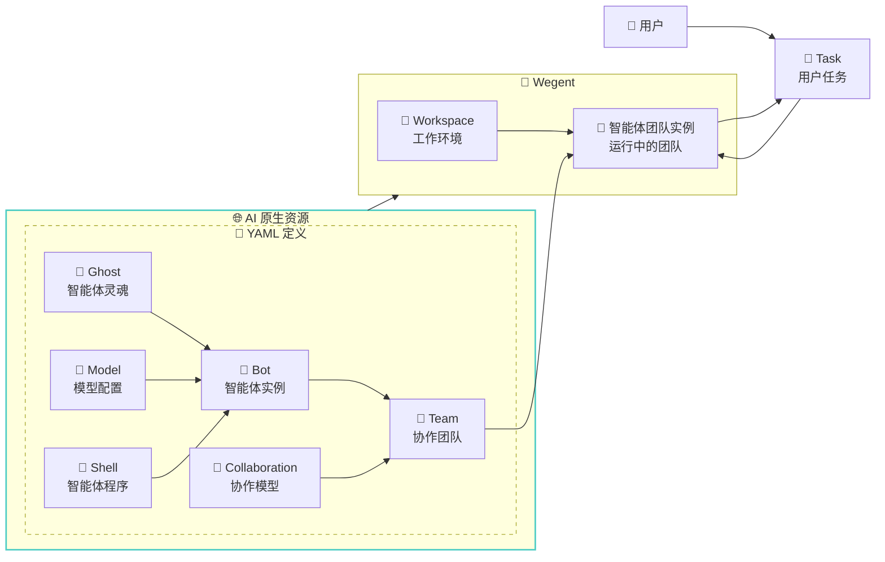

# 🧠 核心概念

本文档详细介绍 Wegent 平台的核心概念,帮助您理解各个组件及其关系。

---

## ⚠️ 术语说明：Team vs Bot

> **重要提示：** 为避免混淆，请注意代码层面的术语与用户界面显示名称的区别。

| 代码/CRD 层面 | 用户界面 (中文) | 说明 |
|--------------|----------------|------|
| **Team** | **智能体** | 用户直接使用的 AI 智能体，执行任务的主体 |
| **Bot** | **机器人** | 组成智能体的基础组件，是智能体的"工人单元" |

**简单理解：**
- **机器人 (Bot)** = 一个配置好的 AI 工人（包含提示词、运行环境、模型）
- **智能体 (Team)** = 由一个或多个机器人组成的"工作团队"，用户通过智能体来执行任务

---

## 📋 概念总览

Wegent 基于 Kubernetes 风格的声明式 API 和 CRD (Custom Resource Definition) 设计模式,提供了一套标准化的框架来创建和管理 AI 智能体生态系统。

### 核心资源类型

| 图标 | 代码名称 | UI 名称 | 说明 | 类比 |
|------|----------|---------|------|------|
| 👻 | **Ghost** | - | 智能体的"灵魂" | 定义个性和能力 |
| 🧠 | **Model** | 模型 | AI 模型配置 | 大脑的配置参数 |
| 🐚 | **Shell** | 执行器 | 运行时环境 | 可执行程序容器 |
| 🤖 | **Bot** | **机器人** | 完整智能体实例 | Ghost + Shell + Model |
| 👥 | **Team** | **智能体** | 协作团队 | 多个 Bot 的协作组合 |
| 🤝 | **Collaboration** | 协作模式 | 协作模式 | Bot 之间的交互模式 |
| 💼 | **Workspace** | 工作空间 | 工作环境 | 隔离的代码工作空间 |
| 🎯 | **Task** | 任务 | 任务 | 分配给 Team(智能体) 的工作单元 |

---

## 👻 Ghost - 智能体的灵魂

Ghost 代表智能体的"灵魂",定义了智能体的个性、能力和行为模式。

### 核心特性

- **系统提示词 (System Prompt)**: 定义智能体的角色、个性和专业领域
- **MCP 服务器配置**: 定义智能体可以使用的工具和能力

### YAML 配置示例

```yaml
apiVersion: agent.wecode.io/v1
kind: Ghost
metadata:
  name: developer-ghost
  namespace: default
spec:
  # 系统提示词,定义智能体的个性和能力
  systemPrompt: "You are a professional software developer, skilled in using TypeScript and React to develop frontend applications."

  # MCP 服务器配置,定义智能体的工具能力
  mcpServers:
    github:
      env:
        GITHUB_PERSONAL_ACCESS_TOKEN: ghp_xxxxx
      args:
        - run
        - -i
        - --rm
        - -e
        - GITHUB_PERSONAL_ACCESS_TOKEN
        - ghcr.io/github/github-mcp-server
      command: docker
status:
  state: "Available"
```

### 使用场景

- **专业开发者 Ghost**: 精通特定编程语言和框架
- **代码审查者 Ghost**: 专注于代码质量和最佳实践
- **测试工程师 Ghost**: 专门编写和执行测试
- **文档撰写者 Ghost**: 善于编写技术文档

---

## 🧠 Model - AI 模型配置

Model 定义了 AI 模型的配置,包括环境变量、模型参数等。

### 核心特性

- **环境变量**: API 密钥、模型名称、基础 URL 等
- **模型参数**: 温度、最大 Token 数等配置

### YAML 配置示例

```yaml
apiVersion: agent.wecode.io/v1
kind: Model
metadata:
  name: claude-model
  namespace: default
spec:
  modelConfig:
    env:
      ANTHROPIC_MODEL: "openrouter,anthropic/claude-sonnet-4"
      ANTHROPIC_AUTH_TOKEN: "sk-xxxxxx"
      ANTHROPIC_BASE_URL: "http://xxxxx"
      ANTHROPIC_DEFAULT_HAIKU_MODEL: "openrouter,anthropic/claude-haiku-4.5"
status:
  state: "Available"
```

### 支持的模型类型

- **Claude**: Anthropic 的 Claude 系列模型
- **GPT**: OpenAI 的 GPT 系列模型
- **自定义模型**: 通过配置支持其他兼容 API

---

## 🐚 Shell - 运行时环境

Shell 是智能体运行的容器,指定了运行时环境和支持的模型类型。

### 核心特性

- **运行时类型**: ClaudeCode、Agno 等
- **支持的模型**: 指定兼容的模型类型

### YAML 配置示例

```yaml
apiVersion: agent.wecode.io/v1
kind: Shell
metadata:
  name: claude-shell
  namespace: default
spec:
  runtime: "ClaudeCode"
  supportModel:
    - "openai"
    - "anthropic"
status:
  state: "Available"
```

### 可用的 Shell 类型

- **ClaudeCode**: 基于 Claude Agent SDK 的代码智能体
- **Agno**: 基于 Agno 框架的对话智能体 (实验性)

---

## 🤖 Bot - 机器人（智能体的基础组件）

> **术语说明：** Bot 在用户界面中显示为"**机器人**"，是组成智能体(Team)的基础组件。

Bot 是一个完整的智能体实例,结合了 Ghost (灵魂)、Shell (容器) 和 Model (配置)。

### 核心特性

- **引用其他资源**: 通过 Ref 引用 Ghost、Shell、Model
- **独立配置**: 每个 Bot 可以有自己的配置组合

### YAML 配置示例

```yaml
apiVersion: agent.wecode.io/v1
kind: Bot
metadata:
  name: developer-bot
  namespace: default
spec:
  # 引用 Ghost
  ghostRef:
    name: developer-ghost
    namespace: default
  # 引用 Shell
  shellRef:
    name: claude-shell
    namespace: default
  # 引用 Model
  modelRef:
    name: claude-model
    namespace: default
status:
  state: "Available"
```

### 组合示例

```
Bot = Ghost (个性) + Shell (运行环境) + Model (AI 模型)
```

---

## 👥 Team - 智能体（用户直接使用的AI助手）

> **术语说明：** Team 在用户界面中显示为"**智能体**"，是用户直接交互和使用的 AI 助手实体。用户创建任务时选择的就是 Team（智能体）。

Team 定义了多个 Bot（机器人）的协作组合,指定了成员角色和协作模式。

### 核心特性

- **团队成员**: 多个 Bot 实例及其角色
- **成员提示词**: 每个成员的特定任务说明
- **协作模式**: 定义成员之间的交互方式

### YAML 配置示例

```yaml
apiVersion: agent.wecode.io/v1
kind: Team
metadata:
  name: dev-team
  namespace: default
spec:
  # 团队成员
  members:
    - name: "developer"
      botRef:
        name: developer-bot
        namespace: default
      prompt: "You are the developer in the team, responsible for implementing features..."
      role: "leader"

    - name: "reviewer"
      botRef:
        name: reviewer-bot
        namespace: default
      prompt: "You are the code reviewer in the team, responsible for reviewing code quality..."
      role: "member"

  # 协作模式
  collaborationModel: "pipeline"
status:
  state: "Available"
```

---

## 🤝 Collaboration - 协作模式

Collaboration 定义了 Team 中 Bot 之间的交互模式,类似于工作流。

### 四种协作模式

#### 1. **Pipeline (流水线)**
- **特点**: 顺序执行,前一个 Bot 的输出作为下一个 Bot 的输入
- **适用场景**: 代码开发 → 代码审查 → 测试 → 部署
- **示例**:
  ```
  Developer Bot → Reviewer Bot → Tester Bot → Deployer Bot
  ```

#### 2. **Route (路由)**
- **特点**: 由 Leader 根据任务内容分配给合适的 Bot
- **适用场景**: 根据问题类型分配给专家 Bot
- **示例**:
  ```
  User Query → Leader Bot → {Frontend Bot | Backend Bot | DB Bot}
  ```

#### 3. **Coordinate (协调)**
- **特点**: Leader 协调多个 Bot 并行工作,汇总结果
- **适用场景**: 多角度分析、并行任务处理
- **示例**:
  ```
  Leader Bot → [Analyst Bot, Data Bot, Report Bot] → Leader Bot (汇总)
  ```

#### 4. **Collaborate (协作)**
- **特点**: 所有 Bot 共享上下文,自由讨论和协作
- **适用场景**: 头脑风暴、复杂问题解决
- **示例**:
  ```
  [Bot A ↔ Bot B ↔ Bot C] (共享上下文)
  ```

---

## 💼 Workspace - 工作环境

Workspace 定义了团队的工作环境,包括代码仓库、分支等信息。

### YAML 配置示例

```yaml
apiVersion: agent.wecode.io/v1
kind: Workspace
metadata:
  name: project-workspace
  namespace: default
spec:
  repository:
    gitUrl: "https://github.com/user/repo.git"
    gitRepo: "user/repo"
    gitRepoId: 12345
    branchName: "main"
    gitDomain: "github.com"
status:
  state: "Available"
```

---

## 🎯 Task - 任务

Task 是分配给 Team 的可执行工作单元,关联了 Team 和 Workspace。

### YAML 配置示例

```yaml
apiVersion: agent.wecode.io/v1
kind: Task
metadata:
  name: implement-feature
  namespace: default
spec:
  title: "Implement new feature"
  prompt: "Please implement a user authentication feature with JWT tokens"
  teamRef:
    name: dev-team
    namespace: default
  workspaceRef:
    name: project-workspace
    namespace: default
status:
  state: "Available"
  status: "PENDING"  # PENDING, RUNNING, COMPLETED, FAILED, CANCELLED
  progress: 0
  result: null
  errorMessage: null
```

---

## 🔄 概念关系图

以下 Mermaid 图展示了各个概念之间的关系:



---

## 💡 最佳实践

### 1. Ghost 设计
- ✅ 明确定义智能体的专业领域
- ✅ 提供清晰的行为指南
- ✅ 配置必要的 MCP 工具

### 2. Bot 组合
- ✅ 为不同任务创建专门的 Bot
- ✅ 复用 Ghost 和 Model 配置
- ✅ 合理选择 Shell 类型

### 3. Team 构建
- ✅ 选择合适的协作模式
- ✅ 明确成员角色和职责
- ✅ 为每个成员提供清晰的任务提示

### 4. 任务管理
- ✅ 提供详细的任务描述
- ✅ 选择合适的 Workspace
- ✅ 监控任务执行状态

---

## 🔗 相关资源

- [YAML 配置详解](../reference/yaml-specification.md) - 完整的 YAML 配置格式说明
- [协作模式详解](./collaboration-models.md) - 四种协作模式的详细说明
- [创建 Bot 指南](../guides/user/creating-bots.md) - 如何创建和配置 Bot
- [创建 Team 指南](../guides/user/creating-teams.md) - 如何构建协作团队

---

<p align="center">理解这些核心概念是使用 Wegent 的基础! 🚀</p>
