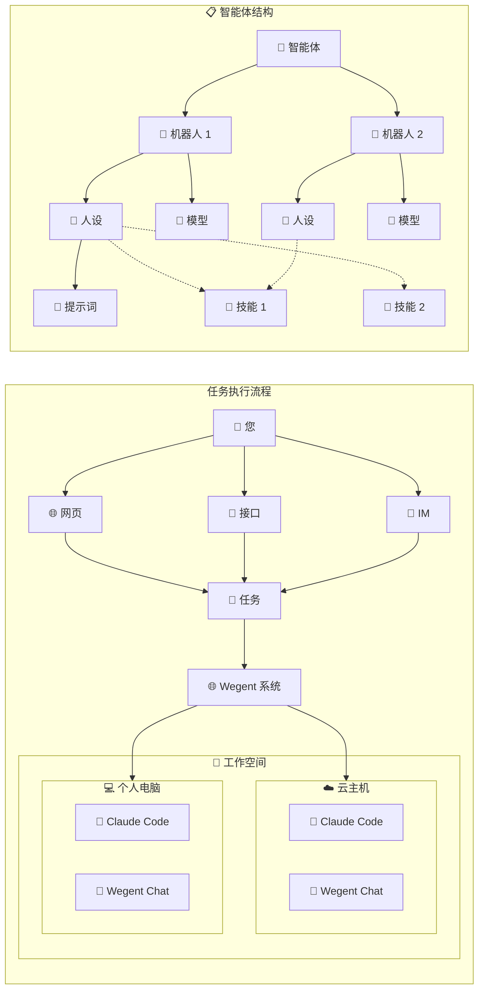

# 核心概念

本文档介绍 Wegent 平台的核心概念，帮助您理解各个组件及其关系。

---

## 🚀 平台功能概览

Wegent 是一个开源的 AI 原生操作系统，提供五大核心功能模块：

### 💬 对话 - AI 聊天

一个完全开源的聊天 Agent，支持：

- **多模型兼容**：DeepSeek、GLM、GPT、Claude 等各种协议兼容的模型
- **对话历史**：支持新建对话和多轮对话，支持对话历史的保存和分享
- **多人对话**：支持 AI 群聊，AI 可以根据群聊历史进行回复
- **附件解析**：可在单聊、群聊中给 AI 发送 txt、pdf、ppt、doc、图片格式的附件
- **追问模式**：模型通过启发式问题帮你澄清思路
- **纠错模式**：自动调用多个模型矫正回答
- **长期记忆**：支持集成 mem0 实现对话的长期记忆
- **运行沙箱**：支持通过沙箱执行命令或修改文件，兼容 E2B 协议
- **自定义配置**：可通过配置的方式自定义提示词、MCP 和 Skill（自带绘制图表技能）

### 💻 编码 - 云端编码引擎

一个云端的 Claude Code 编码执行引擎，支持：

- **模型配置**：配置各种兼容 Claude 协议的模型
- **并行执行**：可在云端同时执行多个编码任务
- **需求澄清**：支持需求澄清模式，AI 会结合代码和提问，帮你梳理需求后生成规格文档
- **Git 集成**：支持与 GitHub/GitLab/Gitea/Gerrit 进行集成，直接从代码仓库克隆、修改后创建 PR
- **MCP/Skill 集成**：支持通过配置为 Agent 集成 MCP/Skill
- **多轮对话**：支持多轮对话追问

### 📡 关注 - AI 任务触发器

一个云端的 AI 任务触发器，支持：

- **全部能力**：任务可以使用对话和编码的全部能力
- **定时/事件触发**：设定定时或基于事件执行 AI 任务，如每天 9 点汇总今天的 AI 新闻
- **信息流展示**：展示基于 AI 任务生成的信息流
- **事件过滤**：支持事件过滤，如"只有明天要下雨了才通知我"

### 📚 知识 - AI 文档仓库

一个云端 AI 文档仓库，支持：

- **文档管理**：上传、管理 txt/doc/ppt/xls 等等格式的文档到知识库
- **导入来源**：支持导入网页、钉钉多维表到知识库
- **NotebookLM 模式**：支持在笔记本里直接选择文档进行提问
- **在线编辑**：笔记本模式支持在线编辑文本文件
- **知识引用**：支持在单聊、群聊中让 AI 引用知识库进行回答

### ⚙️ 定制化 - 全面可配置

上面的所有功能都是可定制的：

- **网页创建智能体**：支持在网页中创建自定义智能体，可直接在页面上配置提示词、MCP、Skill 和多智能体协作
- **智能体向导**：支持智能体创建向导，可根据需求自动生成和微调提示词
- **组内共享**：支持人员创建和加入组，组内可共享智能体、模型、Skill 等等

---

## 🤖 理解智能体和机器人

### 什么是智能体？

**智能体**是您直接交互的 AI 助手。当您创建任务或开始对话时，您就是在与智能体协作。可以把它想象成您的个人 AI 团队，能够帮助您完成各种任务。

### 什么是机器人？

**机器人**是组成智能体的基础组件。每个机器人都配置了：
- **人设**：定义机器人的个性、专业领域和可用工具
- **执行器**：机器人执行任务的引擎（对话、编码等）
- **模型**：驱动机器人的 AI 模型（GPT、Claude 等）

### 它们如何协作

```
机器人 = 人设 + 执行器 + 模型
智能体 = 一个或多个机器人协同工作
任务 = 智能体 + 您的请求
```

**示例：**
- 一个简单的聊天智能体可能只有一个机器人
- 一个开发智能体可能有多个机器人：一个负责编码，一个负责代码审查，一个负责测试

---

## 🔄 概念关系图



> **说明：**
> - 用户可以通过网页、接口或 IM 提交任务。
> - 任务提交给 Wegent 系统，Wegent 可将任务派发到工作空间（云主机或个人电脑）执行。
> - 工作空间上运行 Claude Code 或 Wegent Chat 执行器。
> - 智能体由多个机器人组成，每个机器人包含人设和模型。技能（虚线）按需加载。

---

## 🎯 关键组件详解

### 👻 人设 (Ghost)

**人设**定义了您的 AI 助手的"灵魂"——它知道什么、如何行为以及能使用哪些工具。它包括：
- 系统提示词（例如："你是一个有帮助的编码助手"）
- 可用的 MCP 服务器和工具
- 可加载的技能列表
- 行为准则

### 🐚 执行器 (Shell)

**执行器**决定了您的 AI 在哪里以及如何执行任务。它包括：

| 执行器 | 最适合 |
|--------|--------|
| **对话 (Chat)** | 快速对话、问答 |
| **编码 (ClaudeCode)** | 编程任务、代码生成 |
| **Agno** | 多智能体协作 |
| **Dify** | 工作流自动化 |

### 🧠 模型

**模型**是驱动您助手的 AI 大脑：
- 配置 API 密钥和端点
- 从各种提供商中选择（OpenAI、Anthropic 等）
- 调整模型参数

### 💼 工作空间

对于编码任务，**工作空间**将您的智能体连接到代码仓库：
- 从 GitHub/GitLab/Gitea/Gerrit 克隆
- 进行更改并创建拉取请求
- 在特定分支上工作

### 🎯 技能 (Skill)

**技能**是可以按需添加到 AI 助手的特殊能力。与一次性加载所有指令不同，技能只在需要时才会加载。

**为什么使用技能？**
- **高效**：只在需要时加载详细指令
- **模块化**：将相关能力打包在一起
- **可扩展**：无需更改核心智能体即可添加新能力

**技能示例：**
- **图表绘制**：使用 Mermaid.js 生成图表和图形
- **代码分析**：专业的代码审查能力
- **数据处理**：处理特定数据格式

**技能如何工作：**
1. 您配置智能体可用的技能
2. 在对话过程中，AI 决定何时需要某个技能
3. 技能按需加载，提供专业的指令和工具

> 📖 有关技能的详细信息，请参阅 [技能系统](./skill-system.md)

---

## 🤝 协作模式

当一个智能体有多个机器人时，它们可以以不同的方式协作：

### 流水线模式
机器人按顺序工作，每个将结果传递给下一个。
```
开发者 → 审查者 → 测试者
```

### 路由模式
领导机器人将任务分配给最合适的机器人。
```
领导者 → {前端机器人 | 后端机器人 | 数据库机器人}
```

### 协调模式
领导机器人协调并行工作并汇总结果。
```
领导者 → [分析师, 数据, 报告] → 领导者 (汇总)
```

### 协作模式
所有机器人共享上下文并自由讨论。
```
[机器人 A ↔ 机器人 B ↔ 机器人 C]
```

---

## 🔗 相关资源

- [协作模式详解](./collaboration-models.md) - 四种协作模式的详细说明
- [快速开始](../getting-started/quick-start.md) - 开始使用 Wegent

---

<p align="center">理解这些核心概念是使用 Wegent 的基础! 🚀</p>
