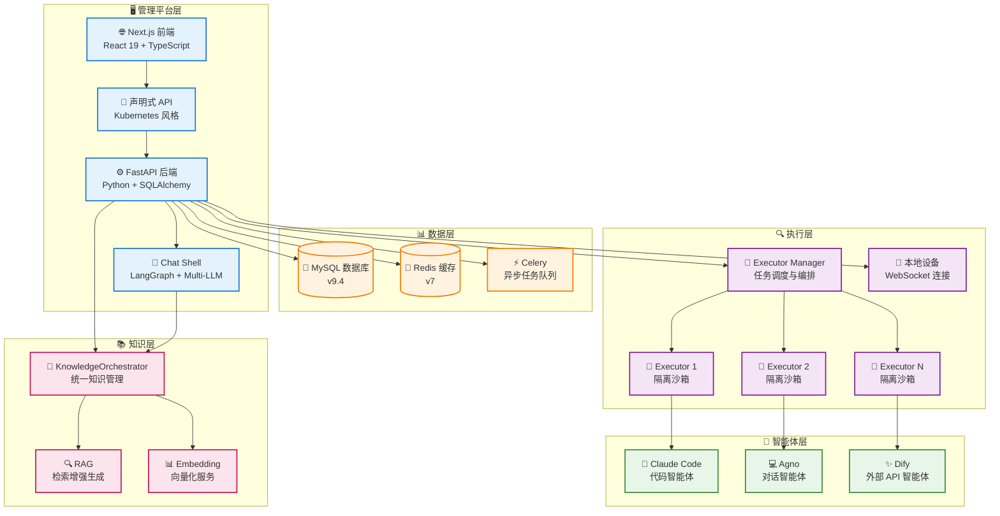
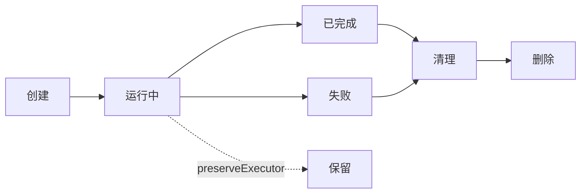
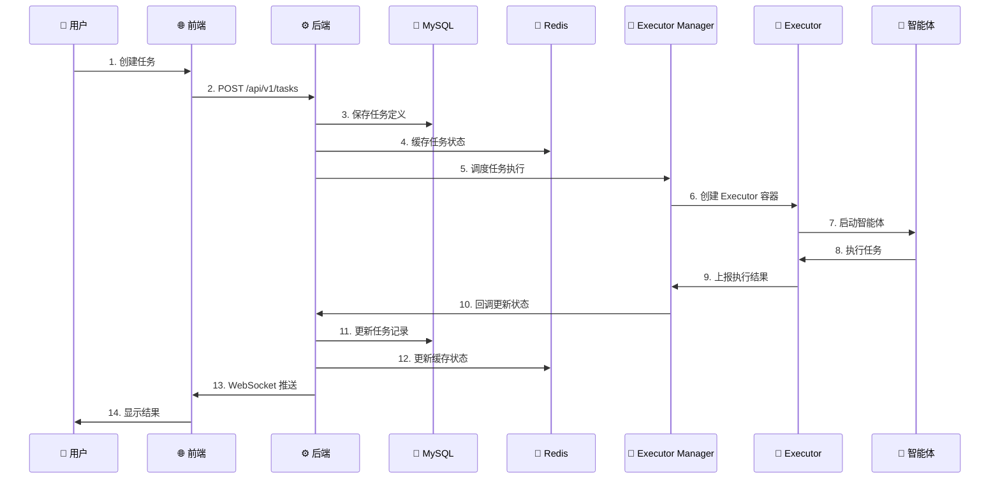

# 🏗️ 系统架构

本文档详细介绍 Wegent 平台的系统架构、组件设计和技术栈。

---

## 📋 目录

- [架构概览](#架构概览)
- [核心组件](#核心组件)
- [数据流与通信模式](#数据流与通信模式)
- [技术栈](#技术栈)
- [设计原则](#设计原则)
- [扩展性与部署](#扩展性与部署)

---

## 🌐 架构概览

Wegent 采用现代化的分层架构设计，基于 Kubernetes 风格的声明式 API 和 CRD (Custom Resource Definition) 设计模式，提供了一套标准化的框架来创建和管理 AI 智能体生态系统。

### 系统架构图



### 架构层次说明

| 层次 | 职责 | 核心技术 |
|------|------|----------|
| **管理平台层** | 用户交互、资源管理、API 服务、对话处理 | Next.js 15, FastAPI, React 19, Chat Shell |
| **数据层** | 数据持久化、缓存管理、异步任务调度 | MySQL 9.4, Redis 7, Celery |
| **执行层** | 任务调度、容器编排、资源隔离、本地设备管理 | Docker, Python, WebSocket |
| **智能体层** | AI 能力提供、代码执行、对话处理、外部 API 集成 | Claude Code, Agno, Dify |
| **知识层** | 知识库管理、RAG 检索、向量化服务 | KnowledgeOrchestrator, Embedding |

---

## 🔧 核心组件

### 1. 🌐 前端 (Frontend)

**职责**：
- 提供用户界面，支持资源定义和管理
- 实现任务创建、监控和结果展示
- 提供实时交互和状态更新
- 管理本地设备和执行器

**技术栈**：
- **框架**: Next.js 15 (App Router)
- **UI 库**: React 19, shadcn/ui
- **样式**: Tailwind CSS 3.4
- **状态管理**: React Context + Hooks
- **国际化**: i18next 25.5
- **图标**: Heroicons, Tabler Icons, Lucide React

**核心特性**：
- 🎨 配置驱动的 UI，支持 YAML 可视化编辑
- 🔄 实时任务状态更新（WebSocket）
- 🌍 多语言支持（中文/英文）
- 📱 响应式设计（移动端/桌面端组件分离）
- 📱 本地设备管理界面
- 💭 思考过程可视化

**关键文件结构**：
```
frontend/src/
├── app/              # Next.js App Router
│   ├── (tasks)/     # 任务相关页面
│   ├── (settings)/  # 设置相关页面
│   └── admin/       # 管理员页面
├── features/        # 功能模块
│   ├── admin/       # 管理后台
│   ├── devices/     # 设备管理（新）
│   ├── feed/        # 发现与订阅
│   ├── knowledge/   # 知识库管理
│   ├── settings/    # 代理配置
│   └── tasks/       # 任务核心功能
├── components/      # 通用组件
│   ├── ui/          # shadcn/ui 基础组件
│   └── common/      # 业务通用组件
└── hooks/           # 自定义 Hooks
```

**功能模块**：

| 模块 | 用途 |
|------|------|
| **tasks** | 任务创建、聊天、群聊、工作台 |
| **devices** | 本地设备管理、执行器指南 |
| **knowledge** | 知识库、文档、权限管理 |
| **settings** | 智能体、模型、Shell、技能配置 |
| **feed** | 订阅市场、触发器管理 |

---

### 2. ⚙️ 后端 (Backend)

**职责**：
- 实现声明式 API，处理资源 CRUD 操作
- 管理用户认证和授权
- 协调执行层进行任务调度
- 提供 WebSocket 支持实时聊天通信（Socket.IO）
- 统一知识管理（KnowledgeOrchestrator）
- 管理本地设备连接

**技术栈**：
- **框架**: FastAPI 0.68+
- **ORM**: SQLAlchemy 2.0
- **数据库驱动**: PyMySQL
- **认证**: JWT (PyJWT), OAuth (Authlib), OIDC
- **异步支持**: asyncio, aiohttp
- **缓存**: Redis 客户端
- **实时通信**: Socket.IO (python-socketio) 配合 Redis 适配器
- **异步任务**: Celery

**核心特性**：
- 🚀 高性能异步 API
- 🔒 基于 JWT 的认证机制
- 📝 完整的 CRUD 操作支持
- 🔄 实时状态同步
- 🛡️ 数据加密（AES-256-CBC）
- 👥 基于角色的访问控制（管理员/普通用户）
- 🎼 统一知识管理（KnowledgeOrchestrator）
- 📱 本地设备管理（Device Provider）

**API 设计**：
```
/api/v1/
├── /ghosts          # Ghost 资源管理
├── /models          # Model 资源管理
├── /shells          # Shell 资源管理
├── /bots            # Bot 资源管理
├── /teams           # Team 资源管理
├── /workspaces      # Workspace 资源管理
├── /tasks           # Task 资源管理
├── /devices         # Device 设备管理（新）
├── /knowledge       # 知识库管理
├── /groups          # 组织/组管理
├── /share           # 分享链接管理
└── /admin           # 管理员操作（用户管理、公共模型）
```

**服务层架构**：

| 服务 | 职责 |
|------|------|
| **KindService** | CRD 资源统一管理 |
| **KnowledgeOrchestrator** | 知识管理统一入口（REST API + MCP 工具） |
| **DeviceService** | 本地设备管理 |
| **ChatService** | 聊天处理和 RAG |
| **SubtaskService** | 子任务管理 |
| **GroupService** | 多租户分组管理 |
| **UserService** | 用户管理 |

**关键依赖**：
```python
FastAPI >= 0.68.0      # Web 框架
SQLAlchemy >= 2.0.28   # ORM
PyJWT >= 2.8.0         # JWT 认证
Redis >= 4.5.0         # 缓存
httpx >= 0.19.0        # HTTP 客户端
python-socketio >= 5.0 # Socket.IO 服务端
celery >= 5.0          # 异步任务
```

---

### 3. 💬 Chat Shell（对话引擎）

**职责**：
- 提供轻量级 AI 对话引擎
- 支持多种 LLM 模型（Anthropic、OpenAI、Google）
- 管理对话上下文和会话存储
- 集成 MCP 工具和技能系统
- 支持知识库检索增强（RAG）

**技术栈**：
- **框架**: FastAPI
- **代理框架**: LangGraph + LangChain
- **LLM**: Anthropic, OpenAI, Google Gemini
- **存储**: SQLite, Remote API
- **可观测性**: OpenTelemetry

**三种部署模式**：

| 模式 | 描述 | 使用场景 |
|------|------|----------|
| **HTTP** | 独立 HTTP 服务 `/v1/response` | 生产环境 |
| **Package** | Python 包，被 Backend 导入 | 单体部署 |
| **CLI** | 命令行交互界面 | 开发测试 |

**核心特性**：
- 🤖 多 LLM 支持（Anthropic、OpenAI、Google）
- 🛠️ MCP 工具集成（Model Context Protocol）
- 📚 技能动态加载
- 💾 多存储后端（SQLite、Remote）
- 📊 消息压缩（超出上下文限制时自动压缩）
- 📈 OpenTelemetry 集成

**模块结构**：
```
chat_shell/chat_shell/
├── main.py           # FastAPI 应用入口
├── agent.py          # ChatAgent 代理创建
├── interface.py      # 统一接口定义
├── agents/           # LangGraph 代理构建
├── api/              # REST API 端点
│   └── v1/          # V1 版本 API
├── services/         # 业务逻辑层
│   ├── chat_service.py
│   └── streaming/   # 流式响应
├── tools/            # 工具系统
│   ├── builtin/     # 内置工具（WebSearch 等）
│   ├── mcp/         # MCP 工具集成
│   └── sandbox/     # 沙箱执行环境
├── storage/          # 会话存储
│   ├── sqlite/      # SQLite 存储
│   └── remote/      # 远程存储
├── models/           # LLM 模型工厂
├── messages/         # 消息处理
├── compression/      # 上下文压缩
└── skills/           # 技能加载
```

---

### 4. 💯 Executor Manager (执行管理器)

**职责**：
- 管理 Executor 生命周期
- 任务队列和调度
- 资源分配和限流
- 回调处理
- 支持多种部署模式

**技术栈**：
- **语言**: Python
- **容器管理**: Docker SDK
- **网络**: Docker 网络桥接
- **调度**: APScheduler

**部署模式**：

| 模式 | 描述 | 使用场景 |
|------|------|----------|
| **Docker** | 使用 Docker SDK 管理本地容器 | 标准部署 |
| **Local Device** | 连接本地设备执行 | 开发环境 |

**核心特性**：
- 🎯 最大并发任务数控制（默认 5）
- 🔧 动态端口分配（10001-10100）
- 🐳 Docker 容器编排
- 📊 任务状态追踪
- 📱 本地设备支持

**配置参数**：
```yaml
MAX_CONCURRENT_TASKS: 5              # 最大并发任务数
EXECUTOR_PORT_RANGE_MIN: 10001      # 端口范围起始
EXECUTOR_PORT_RANGE_MAX: 10100      # 端口范围结束
NETWORK: wegent-network              # Docker 网络
EXECUTOR_IMAGE: wegent-executor:latest # 执行器镜像
```

---

### 5. 🚀 Executor (执行器)

**职责**：
- 提供隔离的沙箱环境
- 执行智能体任务
- 管理工作空间和代码仓库
- 上报执行结果

**技术栈**：
- **容器**: Docker
- **运行时**: Claude Code, Agno, Dify
- **版本控制**: Git

**Agent 类型**：

| Agent | 类型 | 说明 |
|-------|------|------|
| **ClaudeCode** | local_engine | Claude Code SDK，支持 Git、MCP、技能 |
| **Agno** | local_engine | 多代理协作，SQLite 会话管理 |
| **Dify** | external_api | 代理到 Dify 平台 |
| **ImageValidator** | validator | 自定义基础镜像验证 |

**核心特性**：
- 🔒 完全隔离的执行环境
- 💼 独立的工作空间
- 🔄 自动清理机制（可通过 `preserveExecutor` 保留）
- 📝 实时日志输出
- 🛠️ MCP 工具支持
- 📚 技能动态加载

**生命周期**：


---

### 6. 💾 数据库 (MySQL)

**职责**：
- 持久化存储所有资源定义
- 管理用户数据和认证信息
- 记录任务执行历史

**版本**: MySQL 9.4

**核心表结构**：
```
wegent_db/
├── kinds            # CRD 资源（Ghost, Model, Shell, Bot, Team, Skill, Device）
├── tasks            # Task 和 Workspace 资源（独立表）
├── skill_binaries   # 技能二进制包
├── users            # 用户信息（含角色字段）
├── groups           # 组织/组
├── namespace_members # 命名空间成员
├── knowledge_bases  # 知识库
├── documents        # 文档
└── public_models    # 系统级公共模型
```

**数据模型特点**：
- 使用 SQLAlchemy ORM
- 支持事务和关联查询
- 自动时间戳管理
- 软删除支持
- CRD 资源通过 (namespace, name, user_id) 三元组唯一标识

---

### 7. 🔴 缓存 (Redis)

**职责**：
- 任务状态缓存
- 会话管理
- 实时数据临时存储
- 任务过期管理
- Socket.IO 多实例适配器

**版本**: Redis 7

**使用场景**：
- 🔄 对话任务上下文缓存（2小时过期）
- 💻 代码任务状态缓存（2小时过期）
- 🎯 执行器删除延迟控制
- 📊 实时状态更新
- 🔌 Socket.IO Redis 适配器（多实例通信）

---

### 8. ⚡ Celery（异步任务）

**职责**：
- 知识库文档索引（异步）
- 文档摘要生成
- 长时间运行任务处理

**核心任务**：

| 任务 | 用途 |
|------|------|
| `index_document_task` | 文档向量化索引 |
| `generate_document_summary_task` | 文档摘要生成 |

---

### 9. 🎼 KnowledgeOrchestrator（知识编排器）

**职责**：
- 统一 REST API 和 MCP 工具的知识管理
- 自动选择 retriever、embedding model、summary model
- 协调 Celery 异步任务

**架构**：
```
Entry Layer (REST/MCP)
    ↓
KnowledgeOrchestrator
    ↓
Service Layer (knowledge_service.py)
    ↓
Celery Tasks (异步处理)
```

**核心特性**：
- 🔗 统一入口：REST API 和 MCP 工具共享相同的业务逻辑
- 🤖 自动模型选择：Task → Team → Bot → Model 链式解析
- 📚 多作用域支持：个人、组、组织三级知识库
- ⚡ 异步索引：通过 Celery 处理大文档

---

## 🔄 数据流与通信模式

### 任务执行流程



### 通信协议

| 通信类型 | 协议 | 用途 |
|----------|------|------|
| **前端 ↔ 后端** | HTTP/HTTPS, WebSocket (Socket.IO) | API 调用、实时聊天流式传输 |
| **后端 ↔ 数据库** | MySQL 协议 | 数据持久化 |
| **后端 ↔ Redis** | Redis 协议 | 缓存操作、Socket.IO 适配器 |
| **后端 ↔ Executor Manager** | HTTP | 任务调度 |
| **Executor Manager ↔ Executor** | Docker API | 容器管理 |
| **Executor ↔ 智能体** | 进程调用 | 任务执行 |

### WebSocket 架构（Socket.IO）

聊天系统使用 Socket.IO 进行双向实时通信：

**命名空间**: `/chat`
**路径**: `/socket.io`

**客户端 → 服务器事件**:
| 事件 | 用途 |
|------|------|
| `chat:send` | 发送聊天消息 |
| `chat:cancel` | 取消正在进行的流式响应 |
| `chat:resume` | 重连后恢复流式响应 |
| `task:join` | 加入任务房间 |
| `task:leave` | 离开任务房间 |
| `history:sync` | 同步消息历史 |

**服务器 → 客户端事件**:
| 事件 | 用途 |
|------|------|
| `chat:start` | AI 开始生成响应 |
| `chat:chunk` | 流式内容片段 |
| `chat:done` | AI 响应完成 |
| `chat:error` | 发生错误 |
| `chat:cancelled` | 流式响应被取消 |
| `chat:message` | 非流式消息（群聊） |
| `task:created` | 新任务创建 |
| `task:status` | 任务状态更新 |

**基于房间的消息路由**:
- 用户房间: `user:{user_id}` - 用于个人通知
- 任务房间: `task:{task_id}` - 用于聊天流式传输和群聊

**Redis 适配器**: 支持多工作进程水平扩展

---

## 🛠️ 技术栈

### 前端技术栈

```typescript
{
  "framework": "Next.js 15",
  "runtime": "React 19",
  "language": "TypeScript 5.7",
  "ui": [
    "shadcn/ui",
    "Tailwind CSS 3.4",
    "Lucide React",
    "Heroicons 2.2"
  ],
  "i18n": "i18next 25.5",
  "markdown": "react-markdown",
  "realtime": "socket.io-client",
  "devTools": [
    "ESLint 9.17",
    "Prettier 3.4",
    "Husky 9.1"
  ]
}
```

### 后端技术栈

```python
{
    "framework": "FastAPI >= 0.68.0",
    "language": "Python 3.10+",
    "orm": "SQLAlchemy >= 2.0.28",
    "database": "PyMySQL 1.1.0",
    "auth": [
        "PyJWT >= 2.8.0",
        "python-jose 3.3.0",
        "passlib 1.7.4",
        "authlib"  # OIDC 支持
    ],
    "async": [
        "asyncio >= 3.4.3",
        "aiohttp >= 3.8.0",
        "httpx >= 0.19.0"
    ],
    "cache": "redis >= 4.5.0",
    "realtime": "python-socketio >= 5.0",
    "tasks": "celery >= 5.0",
    "security": [
        "cryptography >= 41.0.5",
        "pycryptodome >= 3.20.0"
    ],
    "telemetry": "opentelemetry-*",
    "testing": [
        "pytest >= 7.4.0",
        "pytest-asyncio >= 0.21.0"
    ]
}
```

### Chat Shell 技术栈

```python
{
    "framework": "FastAPI",
    "agent": "LangGraph + LangChain",
    "llm": [
        "langchain-anthropic",
        "langchain-openai",
        "langchain-google-genai"
    ],
    "storage": "SQLite / Remote API",
    "telemetry": "opentelemetry-*"
}
```

### 基础设施

```yaml
database:
  mysql: "9.4"

cache:
  redis: "7"

container:
  docker: "latest"
  docker-compose: "latest"

task_queue:
  celery: "5.0+"
  broker: "redis"

executor_engines:
  - "Claude Code (Anthropic)"
  - "Agno"
  - "Dify"
```

---

## 🎯 设计原则

### 1. 声明式 API 设计

遵循 Kubernetes CRD 设计模式：
- ✅ 资源以 YAML 声明式定义
- ✅ 清晰的资源层次关系
- ✅ 统一的 API 版本管理
- ✅ 状态与期望分离

**示例**：
```yaml
apiVersion: agent.wecode.io/v1
kind: Bot
metadata:
  name: developer-bot
  namespace: default
spec:
  # 期望状态
  ghostRef:
    name: developer-ghost
status:
  # 实际状态
  state: "Available"
```

### 2. 关注点分离

- 🎨 **前端**：专注于用户交互和展示
- ⚙️ **后端**：专注于业务逻辑和数据管理
- 🚀 **执行层**：专注于任务调度和资源隔离
- 🤖 **智能体层**：专注于 AI 能力提供

### 3. 微服务架构

- 🔧 每个组件独立部署
- 📦 容器化打包
- 🔄 服务间松耦合
- 📊 独立扩展能力

### 4. 安全优先

- 🔒 JWT 认证机制
- 🛡️ AES-256-CBC 加密敏感数据
- 🔐 沙箱环境隔离
- 🚫 最小权限原则
- 👥 基于角色的访问控制（管理员/普通用户）
- 🔑 OIDC 企业单点登录支持

### 5. 可观测性

- 📝 结构化日志（structlog）
- 📊 状态追踪和监控
- 🔍 详细的错误信息
- 📈 性能指标收集
- 🔭 OpenTelemetry 集成（分布式追踪）

---

## 📈 扩展性与部署

### 水平扩展

#### 前端扩展
```yaml
# 多实例部署
frontend:
  replicas: 3
  load_balancer: nginx
```

#### 后端扩展
```yaml
# 无状态设计，支持多实例
backend:
  replicas: 5
  session: redis
  socket_adapter: redis  # Socket.IO 多实例支持
```

#### Chat Shell 扩展
```yaml
# 独立服务，支持多实例
chat_shell:
  replicas: 2
  storage: remote  # 远程存储支持多实例
```

#### 执行器扩展
```yaml
# 动态创建和销毁
executor_manager:
  max_concurrent_tasks: 20
  auto_scaling: true
```

### 垂直扩展

#### 数据库优化
- 读写分离
- 索引优化
- 查询缓存

#### Redis 优化
- 内存优化
- 持久化策略
- 集群模式

### 部署模式

#### 1. 单机部署（开发/测试）
```bash
docker-compose up -d
```

**适用场景**：
- 本地开发
- 功能测试
- 小规模使用

#### 2. 分布式部署（生产）
```yaml
architecture:
  frontend: "多实例 + Nginx 负载均衡"
  backend: "多实例 + API 网关"
  mysql: "主从复制 + 读写分离"
  redis: "Redis Cluster"
  executor: "动态扩展"
```

**适用场景**：
- 生产环境
- 高并发需求
- 大规模团队

```yaml
architecture:
  frontend: "多实例 + Nginx 负载均衡"
  backend: "多实例 + API 网关 + Redis Socket.IO 适配器"
  chat_shell: "多实例 + 远程存储"
  mysql: "主从复制 + 读写分离"
  redis: "Redis Cluster"
  celery: "多 Worker"
  executor: "动态扩展"
```

#### 3. 云原生部署（Kubernetes）
```yaml
apiVersion: apps/v1
kind: Deployment
metadata:
  name: wegent-backend
spec:
  replicas: 3
  template:
    spec:
      containers:
      - name: backend
        image: wegent-backend:latest
```

**适用场景**：
- 云环境
- 自动扩展
- 高可用需求

### 性能指标

| 指标 | 目标值 | 说明 |
|------|--------|------|
| **API 响应时间** | < 200ms | P95 延迟 |
| **任务启动时间** | < 5s | 从创建到执行 |
| **并发任务数** | 5-100 | 可配置 |
| **数据库连接池** | 20 | 默认配置 |
| **WebSocket 连接** | 1000+ | 同时在线 |

### 监控与告警

#### 关键指标
- 📊 任务成功率
- ⏱️ 任务执行时间
- 💾 数据库性能
- 🔴 Redis 缓存命中率
- 🐳 容器资源使用

#### 日志收集
```python
import structlog

logger = structlog.get_logger()
logger.info("task.created",
    task_id=task.id,
    team=task.team_ref.name)
```

---

## 🔗 相关资源

- [核心概念](../concepts/core-concepts.md) - 理解 Wegent 的核心概念
- [协作模式详解](../concepts/collaboration-models.md) - 深入了解协作模式
- [YAML 配置规范](../reference/yaml-specification.md) - 完整的配置说明
- [CRD 架构](./crd-architecture.md) - CRD 设计详情
- [技能系统](../concepts/skill-system.md) - 技能开发和集成
- [本地设备架构](./local-device-architecture.md) - 本地设备支持

---

<p align="center">了解架构是深入使用 Wegent 的关键! 🚀</p>
