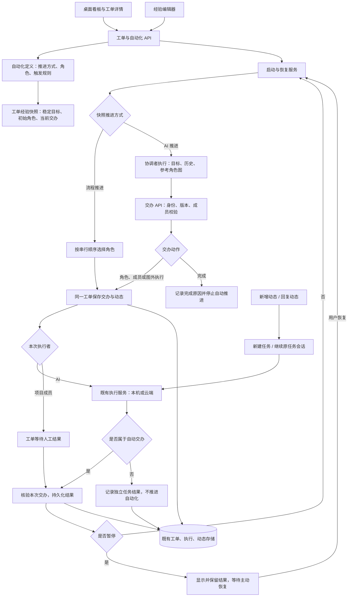
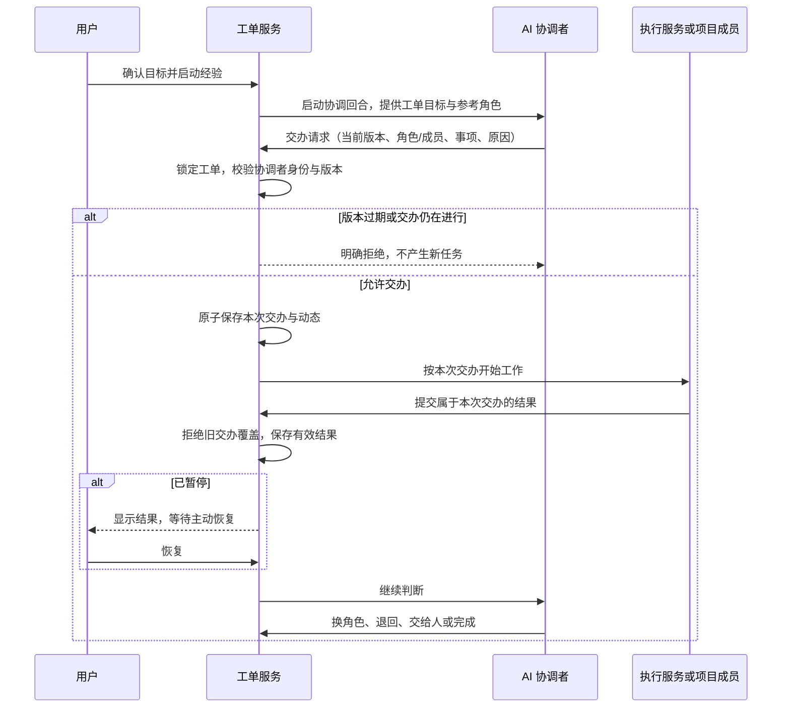
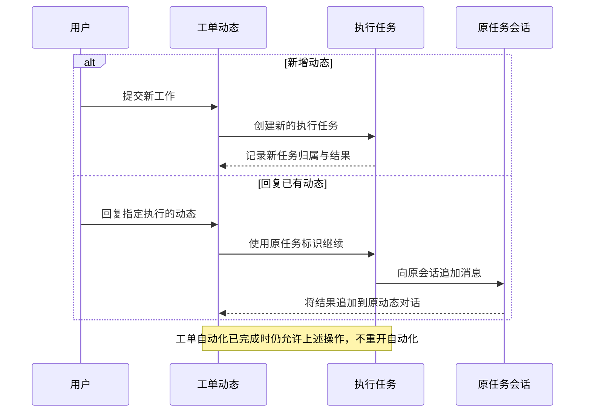
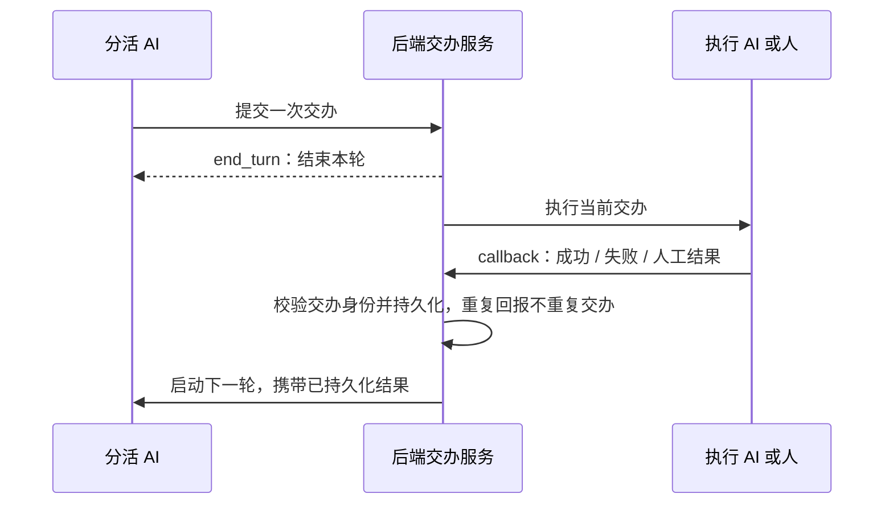

# 看板自动化：交互与验收

验收对象是看板工单、经验配置、自动交办、人工结果和任务对话的完整闭环。核心宗旨见[做事经验与工单分派](../user-guide/board-automation.md)。本页是持续更新的验收契约；未附对应运行证据的项目不视为完成。

## 交付清单

最终交付必须包含测试通过报告、逐步交互报告、每步实际界面截图、架构图和时序图。测试报告记录命令、代码状态、环境、运行时间、退出结果和证据目录。交互报告逐步说明入口、操作、可见结果、保存状态和下一步。截图必须来自实际应用，并与步骤一一对应，不能用示意图代替运行证据。

## 验收矩阵

| 编号 | 用户目的与步骤 | 必须观察到的结果 | 必须覆盖的边界与恢复 | 当前证据与缺口 |
| --- | --- | --- | --- | --- |
| A01 | 打开看板自动化，创建经验 | 两种平级推进方式；明确保存状态 | 无服务、无权限、加载失败、草稿离开与恢复 | 编辑器单测；真实后端只读权限与 Electron 检查；交互报告步骤 01–06、27–28、32–33 |
| A02 | 选择流程推进，配置多个角色并保存 | 串行顺序明确；角色有职责和执行人/环境 | 插入、删除、顺序调整、配置不完整、重新加载 | 配置保存与重新加载单测、真实桌面验证；交互报告步骤 01–05、16–19 |
| A03 | 选择 AI 推进，配置协调者与参考角色图 | 协调者属于整条经验；图内角色独立配置 | 无模型、无工作空间、模式切换、旧嵌套定义 | AI 协调者配置、模式切换与执行参数测试；真实桌面步骤 04–05 |
| A04 | 从空白工单开始，选择经验与启动方式 | 目标明确；选择经验后只启动一次 | 创建即启动、开始处理启动、无可用经验 | 创建/状态触发真实后端矩阵、唯一规则绑定；交互报告步骤 07 |
| A05 | 流程推进交给 AI，再交给人，再继续 | 一个工单；只有当前角色开工；最终进入待确认 | 人工角色无成员、执行失败、交付物未满足 | 节点顺序与自动续接服务测试；真实桌面角色执行、人工交办与末尾待确认；步骤 10–19 |
| A06 | AI 跳过设计，交给上线，再退回开发 | 每次分派真实启动；初始角色不变；历史保留 | 迟到结果、重复请求、并发分派 | 状态、数据库与真实执行 E2E：跳过 design → release → develop；步骤 09–10 展示其后交办状态 |
| A07 | AI 交给图内或图外成员，成员提交结果 | 显示负责人和本次事项；只有负责人可提交 | 空输入、重复提交、请求失败、切换工单/交办时草稿隔离 | 负责人校验、失败保留和交办草稿隔离单测；图外成员真实回报；步骤 10–14 |
| A08 | AI 选择图外直接执行，再返回图内 | 图外工作不显示旧角色；结果归属正确 | 图外执行配置不足、执行失败 | issue_assignment_state 与 issue_assignments 测试验证无节点交办、配置解析和原工单执行归属；真实 Electron 完成图外 AI 执行并显示结果；步骤 09 |
| A09 | 暂停自动化，当前工作回报，再恢复 | 结果保存；暂停不启动下一轮；恢复只启动一次 | 人工等待、执行中暂停、迟到回报、重复恢复 | 真实 Electron 暂停 → 人工回报 → 恢复 → 完成；步骤 11–14；迟到结果及重复请求由状态/服务测试覆盖 |
| A10 | 执行或协调失败，查看原因并重试 | 能定位失败工作；恢复后继续同一工单 | 离线设备、无模型、请求失败、不重复执行 | 运行状态、配置缺失、失败投影、重新决策与恢复的服务/API 测试；编辑器失败重试单测；真实 Electron 协调失败后原工单重试，步骤 08；未单独截取所有执行故障界面 |
| A11 | 达到目标后完成工单 | AI 无需走完全部节点；停止自动推进 | 完成后重试/恢复不得重开；仍可新建独立任务 | 真实后端判定完成与本地已完成工单新增任务；步骤 14、24–25 |
| A12 | 新增动态开始任务，回复动态继续聊天 | 新动态是新任务；回复保留原任务与会话 | 运行中回复、排队回复、结束后回复、发送失败 | 本地任务/会话标识保持和云端排队续聊真实 E2E；步骤 20–25；失败保留有单测 |
| A13 | 旧工单选择已审阅经验并确认目标 | 保留旧历史；在原工单重新交办 | 未选择、空目标、迁移失败、恢复接口绕过迁移 | Alembic 升降级、服务、真实后端迁移与人工回报；步骤 15–19；项目旧定义改为显式审阅保存 |
| A14 | 配置定时或事件触发、暂停规则、查看运行记录 | 触发来源明确；记录能回到工单与执行 | 标签不匹配、禁用、重复触发、无运行记录 | 真实后端事件与定时矩阵、启停和运行记录；步骤 26 |
| A15 | 使用亮/暗主题、中/英文及窄窗口 | 内容可读，主操作可达，不暴露翻译键 | 长名称、长目标、空状态、滚动/画布遮挡 | 真实 Electron 亮/暗、中/英核心文案、1024×768 窗口；步骤 27–31；已有面板的历史中文未全量翻译，未验收 200% 文本缩放 |
| A16 | 升级、重启与并发回报 | 复用既有表；持久结果可恢复；旧结果不能覆盖新交办 | 数据迁移回滚、迁移后回滚保护、扫描失败隔离 | 340 项后端测试包含元数据迁移、隔离恢复、重复/迟到拒绝；新旧工单快照隔离 API 测试；SQLite 升降级通过，未对生产 MySQL 执行迁移 |

## 架构与数据归属

工单存储位置、代码工作空间、执行设备与会话生命周期是不同维度。云端工单的 AI 可以在本机或云端执行；回复动态继续其原执行会话。完成后的工单允许新建独立任务，该任务不重新启动已完成的自动化。

## 交办与回报时序

## 当前审计结论

主体行为已经通过状态、数据库、API、运行时和真实桌面分层验证。交互报告包含 33 步实际截图，覆盖经验配置、分工、人工回报、暂停恢复、历史采用、动态会话、完成后新任务、权限和显示。

验收边界如上表所列：图外 AI 执行和协调失败重试已有实际截图；全部故障界面组合、200% 文本缩放尚未逐项验收；英文截图证明本次新增核心文案切换，不能代表旧界面已经全面英文化。没有在生产数据库上执行迁移。不得把自动测试通过报告扩大解释为所有环境、所有界面组合均已人工验证。

本地交付目录：`wework/test-results/experience-assignment/delivery/`，包含测试报告、逐步交互与截图、架构/时序及对应运行日志。持续集成入口为已有的 `project-automation` 与 `offline-local-project-space` desktop checkpoints。

## 事件中心验收计划（2026-09-09）

环境：隔离的 Electron、真实 FastAPI/SQLite/Redis、独立 Runtime；模型服务使用确定性响应，通过真实 MCP 调用提交决策。事件中心及工单存储在后端，执行设备独立选择。除 CI 桌面回归外，使用 `scripts/ai-verify.mjs` 单独启动真实 Electron 复核界面。

| 场景 | 前置与步骤 | 预期 | 验证方式 |
| --- | --- | --- | --- |
| E01 待配置 | 新建看板，未启用事件中心，提交任务 | 留存事件，不提前创建工单，显示等待配置 | API、独立 Electron |
| E02 澄清 | 启用 Runtime，提交含糊目标，回答问题 | 问答保留，澄清前无工单，回答后继续路由 | CI 真实 Runtime、独立 Electron |
| E03 专属流程 | 看板没有已有经验，提交明确目标 | 仅当前工单保存角色图并执行；自动化列表仍为空 | 数据库测试、CI 真实 Runtime |
| E04 回到原工单 | 在已完成工单登记外部事项，再接收后续 Webhook | 原目标与历史保留，事件交给同一工单，不重复建工单 | 数据库测试、CI 真实 Runtime |
| E05 去重与身份 | 重复 delivery；过期执行或其他看板提交决策 | 重复投递只留一条；越权与过期操作被拒绝 | API、Rust MCP、CI |
| E06 失败恢复 | Runtime 无法启动，恢复配置后重试；回复请求失败 | 事件和回复不丢失；重试保持事件与工单身份 | 服务与组件测试 |
| E07 只读与布局 | Reporter 查看事件，窄窗口打开界面 | 可查看与打开工单，不能提交/配置；关键操作可达 | 组件、独立 Electron |
| E08 模板隔离 | 临时流程运行后再获取经验目录；编辑已有分派型经验 | 临时流程不可供其他工单复用；已有模板保存不变为全局触发 | 服务、编辑器测试 |

清理：关闭隔离 Electron 与 Runtime，停止测试后端和 Redis；验收数据仅在隔离数据库中保留为证据。

### 事件中心实际验收结果

2026-09-09，在当前工作区未提交代码上完成以下验证，未部署到生产环境：

- `pnpm --filter wework e2e:desktop --segment event-center` 退出码 0，耗时 3 分 57 秒。使用当前打包的 Electron/Executor，真实后端与 MCP；验证澄清、工单专属流程执行、角色登记外部事项、完成工单接收后续事件及投递去重，自动化目录始终为空。证据：`wework/test-results/desktop-e2e/2026-09-09T03-36-59-769Z-51037/`。
- 独立 `scripts/ai-verify.mjs` Electron 验证完成上述主流程，截图 `event-center-01-clarification.png` 至 `event-center-03-existing-issue.png` 位于 `wework/test-results/desktop-e2e/2026-09-09T03-23-38-997Z-97826/`。该辅助脚本随后在额外场景的看板导航夹具上失败，不能将整段脚本记为退出码 0；已修正正式回归为刷新侧栏后实际点击新看板。
- 另一次独立 Electron 验证退出码 0，覆盖未配置时提交留存、Reporter 只读、1024×768 窄窗口及英文文案。截图 04–07 位于 `wework/test-results/desktop-e2e/2026-09-09T03-36-58-244Z-50570/`。
- 服务/API、组件和 Rust MCP 测试覆盖失败留存、重试身份、过期执行拒绝、权限及模板隔离；失败界面的全部组合没有逐一做人工视觉验收。确定性模型验证实际工具链与状态流转，不代表所有真实模型都会作出相同决策。

CI 沿用 `project-automation` 入口，展开为 `project-automation-workflow` 和 `event-center`；两者各自建立最小夹具，事件中心也可单独执行。检查点组合定义由运行器和 CI 覆盖校验共用。

### 交办 callback 回归计划（2026-09-09）

现场：`PRJ9755FA-2` 的执行 507 使用 Anthropic 模型，但 Runtime 将缺失的协议信息默认成 Responses；上游拒绝字符串 `tool_choice`。随后失败回报插入空 `client_message_id`，触发部署库 `uq_project_chat_client_message`，事务回滚，协调者继续看到运行中状态。

修正规则：交办成功即返回 `coordinator_handoff.end_turn`；协调者结束当前轮次，后端持有工作状态。成功、失败、人工结果由既有回报事务落库，再触发下一轮协调；下一轮明确携带 assignment ID、执行状态与结果。动态使用独立消息身份，重复回报由交办状态去重。云模型编译从同一 Model CRD 解析上游协议，不以调用方快照中的协议提示为准。

| 场景 | 环境、步骤 | 预期 |
| --- | --- | --- |
| C01 失败回报持久化 | 在隔离库添加现场同名唯一索引；交办后回报失败，再重放 | 两条独立动态；失败保留；重放不改变版本 |
| C02 协议一致 | 公有 Model 配置为 Anthropic/OpenAI；请求不带或带过期协议提示 | 编译协议与服务端 Model 一致，提供方凭据不暴露给设备 |
| C03 真实 callback | 独立 `event-center` CI 检查点；第一角色执行故意失败，下一轮重派并成功 | 协调者收到明确 callback 结果；三次决策分别交办、重派、完成 |
| C04 独立桌面复核 | `scripts/ai-verify.mjs` 隔离 Electron 执行 C03 并截图 | 与 CI 相同的实际状态转移，停止所有隔离测试进程 |

实现边界：`end_turn` 是工具回执和协调提示词的约定，不是 Runtime 强制终止指令；下一轮由服务端结果回报触发，复用现有协调启动、去重和恢复机制。没有新增数据表。

### 交办 callback 实际验收结果

- 后端协议、交办、Runtime 和自动化测试 149 项通过；交办、动态投影和流程启动测试组 117 项通过（两组包含重复的交办测试）。Rust MCP 测试 27 项通过。
- 使用部署库中执行 507 的原始 Runtime 请求进行只读编译验证，输出协议为 `anthropic-messages`。未更新部署库、重启或替换 `Test-Wegent` 服务。
- 修正首次交办失败注入夹具后，CI `event-center` 检查点退出码 0，耗时 5 分钟；证据：`wework/test-results/desktop-e2e/2026-09-09T07-04-04-198Z-50119/`。
- 同期独立 Electron 已验证失败持久化、callback 重派和最终完成，截图位于 `wework/test-results/desktop-e2e/2026-09-09T07-04-01-423Z-48950/`；最后检查外部事件列表时，页面仍处于工单详情，辅助脚本退出码 1。验收步骤现已明确返回看板事件中心后检查事件，不能将该次辅助脚本记录为全部通过。
- 完成导航步骤修正后，两套验证均完整通过：CI 检查点证据为 `wework/test-results/desktop-e2e/2026-09-09T07-10-21-984Z-71857/`，独立真实 Electron 证据为 `wework/test-results/desktop-e2e/2026-09-09T07-10-20-161Z-71655/`。验证包含失败动态、结果 callback、重派成功、工单完成、后续事件回到原工单和投递去重；截图 03 确认事件列表可见且指向原工单。
