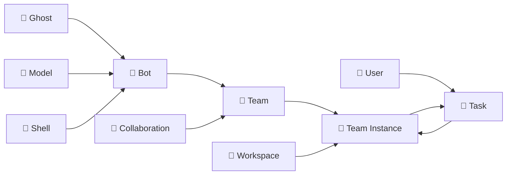

# 📋 CRD 架构

本文档为开发者提供 Wegent CRD（自定义资源定义）架构的详细技术参考，帮助理解内部结构和实现细节。

---

## ⚠️ 术语说明：Team vs Bot

> **重要提示：** 为避免混淆，请注意代码层面的术语与用户界面显示名称的区别。

| 代码/CRD 层面 | 用户界面 (中文) | 说明 |
|--------------|----------------|------|
| **Team** | **智能体** | 用户直接使用的 AI 智能体，执行任务的主体 |
| **Bot** | **机器人** | 组成智能体的基础组件，是智能体的"工人单元" |

**简单理解：**
- **机器人 (Bot)** = 一个配置好的 AI 工人（包含提示词、运行环境、模型）
- **智能体 (Team)** = 由一个或多个机器人组成的"工作团队"，用户通过智能体来执行任务

---

## 🔗 功能与 CRD 映射

| 功能 | 相关 CRD | 说明 |
|------|----------|------|
| **对话** | Chat Shell + Team | 通过 Chat Shell 直接与 LLM 对话 |
| **编码** | ClaudeCode Shell + Team + Workspace | 云端编码执行，支持 Git 集成 |
| **关注** | Subscription + Team | 定时/事件触发的 AI 任务 |
| **知识** | KnowledgeBase + Retriever | 文档存储和 RAG 检索 |
| **定制化** | Ghost + Bot + Team | 配置提示词、工具和协作模式 |

---

## 📋 CRD 架构概览

Wegent 基于 Kubernetes 风格的声明式 API 和 CRD (Custom Resource Definition) 设计模式，提供了一套标准化的框架来创建和管理 AI 智能体生态系统。

### 核心资源类型

| 图标 | 代码名称 | 说明 | 类比 |
|------|----------|------|------|
| 👻 | **Ghost** | 智能体的"灵魂" | 定义个性和能力 |
| 🧠 | **Model** | AI 模型配置 | 大脑的配置参数 |
| 🐚 | **Shell** | 运行时环境 | 可执行程序容器 |
| 🤖 | **Bot** | 完整智能体实例 | Ghost + Shell + Model |
| 👥 | **Team** | 协作团队 | 多个 Bot 的协作组合 |
| 🤝 | **Collaboration** | 协作模式 | Bot 之间的交互模式 |
| 💼 | **Workspace** | 工作环境 | 隔离的代码工作空间 |
| 🎯 | **Task** | 任务 | 分配给 Team 的工作单元 |
| 📱 | **Device** | 本地设备 | 本地执行器连接（新） |
| 🧩 | **Skill** | 技能 | 按需加载的能力包 |

### 资源层级关系

```
Ghost (系统提示词 + MCP 服务器 + 技能)
   ↓
Bot (Ghost + Shell + 可选 Model)           ← UI: 机器人
   ↓
Team (多个 Bot 及其角色)                    ← UI: 智能体
   ↓
Task (Team + Workspace) → 子任务
   ↓
Device (可选，本地执行器)                   ← UI: 本地设备
```

### Kind 资源唯一标识

⚠️ **关键：** 一个 Kind 资源由三个字段唯一标识：`namespace`、`name` 和 `user_id`。

```python
# ✅ 正确：使用三个字段唯一标识
kind = db.query(Kind).filter(
    Kind.namespace == namespace,
    Kind.name == name,
    Kind.user_id == user_id
).first()

# ❌ 错误：缺少 user_id，可能返回错误的资源
kind = db.query(Kind).filter(
    Kind.namespace == namespace,
    Kind.name == name
).first()
```

### 数据库表映射

⚠️ **重要：** Task 和 Workspace 资源存储在**单独的 `tasks` 表**中，而不是 `kinds` 表。

| CRD Kind | 数据库表 | 模型类 |
|----------|----------|--------|
| Ghost, Model, Shell, Bot, Team, Skill, Device | `kinds` | `Kind` |
| **Task, Workspace** | **`tasks`** | **`TaskResource`** |
| **Skill Binary** | **`skill_binaries`** | **`SkillBinary`** |

**代码使用示例：**
```python
# 对于 Task/Workspace - 使用 TaskResource 模型
from app.models.task import TaskResource
task = db.query(TaskResource).filter(TaskResource.kind == "Task", ...).first()

# 对于其他 CRD (Ghost, Model, Shell, Bot, Team) - 使用 Kind 模型
from app.models.kind import Kind
team = db.query(Kind).filter(Kind.kind == "Team", ...).first()
```

---

## 👻 Ghost - 智能体的灵魂

Ghost 代表智能体的"灵魂"，定义了智能体的个性、能力和行为模式。

### YAML 配置示例

```yaml
apiVersion: agent.wecode.io/v1
kind: Ghost
metadata:
  name: developer-ghost
  namespace: default
spec:
  systemPrompt: "You are a professional software developer, skilled in using TypeScript and React to develop frontend applications."
  mcpServers:
    github:
      env:
        GITHUB_PERSONAL_ACCESS_TOKEN: ghp_xxxxx
      command: docker
      args:
        - run
        - -i
        - --rm
        - -e
        - GITHUB_PERSONAL_ACCESS_TOKEN
        - ghcr.io/github/github-mcp-server
status:
  state: "Available"
```

---

## 🧠 Model - AI 模型配置

Model 定义了 AI 模型的配置，包括环境变量、模型参数等。

### YAML 配置示例

```yaml
apiVersion: agent.wecode.io/v1
kind: Model
metadata:
  name: claude-model
  namespace: default
spec:
  modelConfig:
    env:
      ANTHROPIC_MODEL: "openrouter,anthropic/claude-sonnet-4"
      ANTHROPIC_AUTH_TOKEN: "sk-xxxxxx"
      ANTHROPIC_BASE_URL: "http://xxxxx"
      ANTHROPIC_DEFAULT_HAIKU_MODEL: "openrouter,anthropic/claude-haiku-4.5"
status:
  state: "Available"
```

---

## 🐚 Shell - 运行时环境

Shell 是智能体运行的容器，指定了运行时环境和支持的模型类型。

### Shell 类型

| 类型 | 说明 | 使用场景 |
|------|------|----------|
| **Chat** | 直接 LLM API（无 Docker） | 轻量级对话 |
| **ClaudeCode** | Docker 中的 Claude Code SDK | 云端编码任务 |
| **Agno** | Docker 中的 Agno 框架 | 多智能体协作 |
| **Dify** | 外部 Dify API 代理 | Dify 工作流集成 |

### YAML 配置示例

```yaml
apiVersion: agent.wecode.io/v1
kind: Shell
metadata:
  name: claude-shell
  namespace: default
spec:
  runtime: "ClaudeCode"
  supportModel:
    - "openai"
    - "anthropic"
  # 可选：基础镜像配置
  baseImage: "wegent-executor:latest"
status:
  state: "Available"
```

---

## 🤖 Bot - 机器人（智能体的基础组件）

> **术语说明：** Bot 在用户界面中显示为"**机器人**"，是组成智能体(Team)的基础组件。

Bot 是一个完整的智能体实例，结合了 Ghost (灵魂)、Shell (容器) 和 Model (配置)。

### YAML 配置示例

```yaml
apiVersion: agent.wecode.io/v1
kind: Bot
metadata:
  name: developer-bot
  namespace: default
spec:
  ghostRef:
    name: developer-ghost
    namespace: default
  shellRef:
    name: claude-shell
    namespace: default
  modelRef:
    name: claude-model
    namespace: default
status:
  state: "Available"
```

---

## 👥 Team - 智能体（用户直接使用的 AI 助手）

> **术语说明：** Team 在用户界面中显示为"**智能体**"，是用户直接交互和使用的 AI 助手实体。用户创建任务时选择的就是 Team（智能体）。

Team 定义了多个 Bot（机器人）的协作组合，指定了成员角色和协作模式。

### YAML 配置示例

```yaml
apiVersion: agent.wecode.io/v1
kind: Team
metadata:
  name: dev-team
  namespace: default
spec:
  members:
    - name: "developer"
      botRef:
        name: developer-bot
        namespace: default
      prompt: "You are the developer in the team, responsible for implementing features..."
      role: "leader"
    - name: "reviewer"
      botRef:
        name: reviewer-bot
        namespace: default
      prompt: "You are the code reviewer in the team, responsible for reviewing code quality..."
      role: "member"
  collaborationModel: "pipeline"
status:
  state: "Available"
```

---

## 🤝 Collaboration - 协作模式

Collaboration 定义了 Team 中 Bot 之间的交互模式，类似于工作流。

### 四种协作模式

#### 1. **Pipeline (流水线)**
顺序执行，前一个 Bot 的输出作为下一个 Bot 的输入。
```
Developer Bot → Reviewer Bot → Tester Bot → Deployer Bot
```

#### 2. **Route (路由)**
由 Leader 根据任务内容分配给合适的 Bot。
```
User Query → Leader Bot → {Frontend Bot | Backend Bot | DB Bot}
```

#### 3. **Coordinate (协调)**
Leader 协调多个 Bot 并行工作，汇总结果。
```
Leader Bot → [Analyst Bot, Data Bot, Report Bot] → Leader Bot (汇总)
```

#### 4. **Collaborate (协作)**
所有 Bot 共享上下文，自由讨论和协作。
```
[Bot A ↔ Bot B ↔ Bot C] (共享上下文)
```

---

## 💼 Workspace - 工作环境

Workspace 定义了团队的工作环境，包括代码仓库、分支等信息。

### YAML 配置示例

```yaml
apiVersion: agent.wecode.io/v1
kind: Workspace
metadata:
  name: project-workspace
  namespace: default
spec:
  repository:
    gitUrl: "https://github.com/user/repo.git"
    gitRepo: "user/repo"
    gitRepoId: 12345
    branchName: "main"
    gitDomain: "github.com"
status:
  state: "Available"
```

---

## 🎯 Task - 任务

Task 是分配给 Team 的可执行工作单元，关联了 Team 和 Workspace。

### YAML 配置示例

```yaml
apiVersion: agent.wecode.io/v1
kind: Task
metadata:
  name: implement-feature
  namespace: default
  labels:
    preserveExecutor: "true"  # 可选：保留执行器，不自动清理
spec:
  title: "Implement new feature"
  prompt: "Please implement a user authentication feature with JWT tokens"
  teamRef:
    name: dev-team
    namespace: default
  workspaceRef:
    name: project-workspace
    namespace: default
  deviceRef:  # 可选：指定本地设备执行
    name: my-local-device
    namespace: default
status:
  state: "Available"
  status: "PENDING"
  progress: 0
```

### Task 新增功能

| 功能 | 说明 |
|------|------|
| **preserveExecutor** | 标签，设置为 "true" 时保留执行器容器不自动清理 |
| **deviceRef** | 可选引用，指定使用本地设备执行任务 |

---

## 📱 Device - 本地设备（新）

Device 是本地执行器的 CRD 表示，允许用户连接本地开发环境来执行任务。

### 设备类型

| 类型 | 说明 | 连接方式 |
|------|------|----------|
| **local** | 本地设备 | WebSocket |
| **cloud** | 云端设备（未来扩展） | API |

### YAML 配置示例

```yaml
apiVersion: agent.wecode.io/v1
kind: Device
metadata:
  name: my-local-device
  namespace: default
spec:
  deviceType: "local"
  connectionMode: "websocket"
  isDefault: true  # 是否为默认设备（每个用户只能有一个默认设备）
  displayName: "My MacBook Pro"
  description: "Local development machine"
status:
  state: "Connected"
  lastHeartbeat: "2024-01-15T10:30:00Z"
```

### Device 提供者模式

Device 使用策略模式实现，支持未来扩展新的设备类型：

```python
# 基础提供者接口
class BaseDeviceProvider:
    async def connect(self, device: Device) -> bool
    async def disconnect(self, device: Device) -> bool
    async def execute(self, device: Device, task: Task) -> Result

# 本地设备提供者
class LocalDeviceProvider(BaseDeviceProvider):
    # WebSocket 连接实现

# 工厂类
class DeviceProviderFactory:
    def get_provider(self, device_type: str) -> BaseDeviceProvider
```

### 核心特性

- 📱 本地开发环境执行任务
- 🔌 WebSocket 实时连接
- 🎯 默认设备单例控制（每用户一个默认设备）
- 🔄 心跳检测和自动重连
- 🔐 安全认证

---

## 🔄 概念关系图



---

## 💡 最佳实践

### 1. Ghost 设计
- ✅ 明确定义智能体的专业领域
- ✅ 提供清晰的行为指南
- ✅ 配置必要的 MCP 工具
- ✅ 引用相关技能（skills）

### 2. Bot 组合
- ✅ 为不同任务创建专门的 Bot
- ✅ 复用 Ghost 和 Model 配置
- ✅ 合理选择 Shell 类型

### 3. Team 构建
- ✅ 选择合适的协作模式
- ✅ 明确成员角色和职责
- ✅ 为每个成员提供清晰的任务提示

### 4. Device 使用
- ✅ 本地开发时使用 Device 加速迭代
- ✅ 合理设置默认设备
- ✅ 确保设备连接稳定

### 5. Task 管理
- ✅ 复杂任务使用 `preserveExecutor` 保留执行器
- ✅ 本地开发时指定 `deviceRef`

---

## 🔗 相关资源

- [YAML 配置详解](../reference/yaml-specification.md) - 完整的 YAML 配置格式说明
- [协作模式详解](../concepts/collaboration-models.md) - 四种协作模式的详细说明
- [核心概念](../concepts/core-concepts.md) - 平台概览和功能介绍
- [技能系统](../concepts/skill-system.md) - 技能开发和使用指南
- [本地设备架构](./local-device-architecture.md) - 本地设备详细设计
