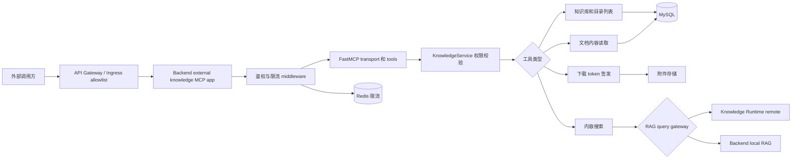
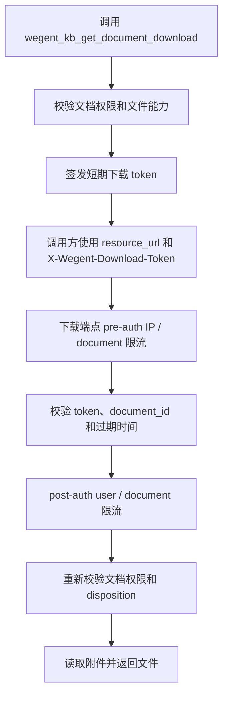
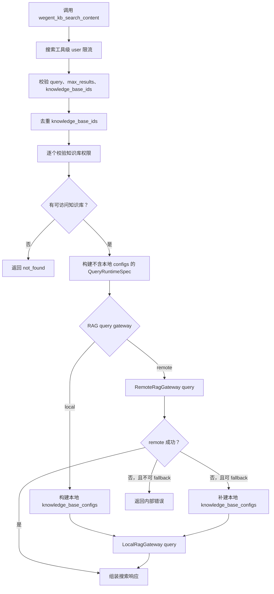

# 外部知识库 MCP

[English](../../en/developer-guide/external-knowledge-mcp.md) | 简体中文

外部知识库 MCP 为受信任的外部系统提供知识库列表、目录节点列表、文档解析内容读取、原文件下载凭证和内容检索能力。它面向业务方集成场景：先查询当前用户可访问的知识库，再浏览目录、读取文档内容或指定知识库搜索内容。

## 端点

外部知识库 MCP 默认不暴露。部署方必须显式开启：

```env
EXTERNAL_KNOWLEDGE_MCP_ENABLED=true
```

开启后挂载在 Backend：

| 路径 | 用途 |
| --- | --- |
| `/mcp/knowledge-external` | 服务元信息 |
| `/mcp/knowledge-external/health` | 健康检查 |
| `/mcp/knowledge-external/sse` | Streamable HTTP MCP transport |
| `/mcp/knowledge-external/documents/{document_id}/file` | 文档原文件下载 |

如果配置了 `API_PREFIX=/api`，Backend 也会注册 `/api/mcp/knowledge-external`。Backend 主应用 lifespan 只会在外部知识库 MCP 开启时启动 `external_knowledge_mcp_server.session_manager.run()`。如果只创建挂载应用而没有进入 session manager，Streamable HTTP 并发请求会出现 task group 未初始化问题。

## 架构概览

外部知识库 MCP 是 Backend 内的独立挂载应用，入口、鉴权、限流、工具执行和数据访问分层如下：



## 访问控制和限流

外部知识库 MCP 面向受信任系统，不能公网裸露。部署时应通过 API Gateway、Nginx 或 Ingress 对 `/mcp/knowledge-external` 和 `/api/mcp/knowledge-external` 做来源 allowlist，例如只允许内网网段或业务方固定出口 IP。

代码层对 external MCP transport 提供 Redis-backed 基础限流，使用 `REDIS_URL` 作为存储。该限流由 external MCP 自己的开关控制，不受全局 OpenAPI `RATE_LIMIT_ENABLED` 影响：

| 配置 | 默认值 | 说明 |
| --- | --- | --- |
| `EXTERNAL_KNOWLEDGE_MCP_RATE_LIMIT_ENABLED` | `true` | 是否开启 external MCP transport 限流 |
| `EXTERNAL_KNOWLEDGE_MCP_RATE_LIMIT_REQUESTS` | `120` | 每个窗口允许的请求数 |
| `EXTERNAL_KNOWLEDGE_MCP_RATE_LIMIT_WINDOW_SECONDS` | `60` | 限流窗口秒数 |
| `EXTERNAL_KNOWLEDGE_MCP_SEARCH_RATE_LIMIT_ENABLED` | `true` | 是否开启搜索工具级限流 |
| `EXTERNAL_KNOWLEDGE_MCP_SEARCH_RATE_LIMIT_REQUESTS` | `30` | 搜索工具每个窗口允许的请求数 |
| `EXTERNAL_KNOWLEDGE_MCP_SEARCH_RATE_LIMIT_WINDOW_SECONDS` | `60` | 搜索工具限流窗口秒数 |
| `EXTERNAL_KNOWLEDGE_MCP_DOWNLOAD_RATE_LIMIT_ENABLED` | `true` | 是否开启文档文件下载限流 |
| `EXTERNAL_KNOWLEDGE_MCP_DOWNLOAD_PREAUTH_IP_RATE_LIMIT_REQUESTS` | `300` | token 校验前每个客户端 IP hash 窗口允许的下载请求数 |
| `EXTERNAL_KNOWLEDGE_MCP_DOWNLOAD_PREAUTH_IP_RATE_LIMIT_WINDOW_SECONDS` | `60` | token 校验前客户端 IP hash 限流窗口秒数 |
| `EXTERNAL_KNOWLEDGE_MCP_DOWNLOAD_PREAUTH_DOCUMENT_RATE_LIMIT_REQUESTS` | `60` | token 校验前每个客户端 IP hash 和文档 ID 窗口允许的下载请求数 |
| `EXTERNAL_KNOWLEDGE_MCP_DOWNLOAD_PREAUTH_DOCUMENT_RATE_LIMIT_WINDOW_SECONDS` | `60` | token 校验前客户端 IP hash 和文档 ID 限流窗口秒数 |
| `EXTERNAL_KNOWLEDGE_MCP_DOWNLOAD_RATE_LIMIT_REQUESTS` | `20` | token 校验后每个窗口允许的下载请求数 |
| `EXTERNAL_KNOWLEDGE_MCP_DOWNLOAD_RATE_LIMIT_WINDOW_SECONDS` | `60` | token 校验后下载限流窗口秒数 |

transport 限流同时检查客户端 IP 和 `Authorization` token hash 两个维度，任一维度超限都会返回 `rate_limited`。搜索工具额外按认证用户 ID 限流。文档文件下载 endpoint 使用独立限流：token 校验前先按客户端 IP hash 做整体限流，再按客户端 IP hash 和文档 ID 做单文档限流，token 校验后按认证用户 ID 和文档 ID 限流。限流开启但 Redis 不可用时，请求会返回 `rate_limit_unavailable`，不会继续执行昂贵的检索或文件读取操作。原始 token 不会写入 Redis key。生产环境仍应保留网关层 allowlist 和限流，用于在请求进入应用前拦截异常流量。

## 鉴权

所有非公开 MCP transport 请求都必须先解析出外部知识库认证用户，才能进入 MCP server。根元信息和健康检查是公开路径。文档文件下载不使用 Bearer 鉴权，而是使用 `wegent_kb_get_document_download` 返回的短期文档下载 token。

默认鉴权只接受用户自己生成的 API token：

```http
Authorization: Bearer <wg-...>
```

鉴权通过后，默认使用 API token 关联的用户作为认证用户。`X-User-Name` 不参与默认鉴权，只作为扩展信号预留给内部部署替换鉴权 handler 时使用。

默认实现不接受 `X-API-Key`。如果外部调用方传入 `X-API-Key`，不会建立外部知识库 MCP 用户上下文。

部署方可以通过 `set_external_knowledge_auth_handler()` 替换鉴权逻辑。替换 handler 会收到可选的 Bearer token 和 Starlette `Request`，认证成功时返回 `ExternalKnowledgeUser`，认证失败时返回 `None`。handler 可以忽略 Bearer token，并从受信任网关透传的 header（例如 `X-User-Name`）解析用户。

文档文件端点要求调用方在请求头携带 `X-Wegent-Download-Token`。该 token 由 `wegent_kb_get_document_download` 返回，默认有效期为 300 秒，并绑定认证用户、文档 ID 和 `disposition`。文件端点在 token 校验通过后仍会重新校验文档权限和文件可用性。

```python
from app.mcp_server import ExternalKnowledgeUser, set_external_knowledge_auth_handler


def enterprise_auth_handler(token, request):
    employee_id = request.headers.get("X-User-Name")
    if not employee_id:
        return None
    user = resolve_user_from_employee_id(employee_id)
    if user is None:
        return None
    return ExternalKnowledgeUser(id=user.id, user_name=user.user_name)


set_external_knowledge_auth_handler(enterprise_auth_handler)
```

## 工具

### `wegent_kb_list_knowledge_bases`

返回当前认证用户可访问的知识库列表。

参数：

| 名称 | 类型 | 默认值 | 说明 |
| --- | --- | --- | --- |
| `scope` | `string` | `all` | 可见范围，取值与内部知识库列表一致，例如 `all`、`personal`、`group` |
| `group_name` | `string \| null` | `null` | 可选的空间或分组名称。`scope=group` 时必填，空字符串会被视为缺失 |
| `query` | `string \| null` | `null` | 可选关键字，按知识库名称和描述做大小写不敏感过滤 |
| `limit` | `int` | `50` | 返回数量，范围 `1..100` |
| `offset` | `int` | `0` | 偏移量，必须大于等于 `0` |

行为：

- 结果按 `created_at` 倒序排序，业务方展示时不需要再次排序。
- `document_count` 统计知识库下的全部文档，包括 inactive 文档，保持与内部知识库列表口径一致。
- 只对当前页知识库统计 `document_count`，避免一次请求放大成大量统计查询。
- 响应中的 `total` 表示过滤后的总知识库数量，`total_returned` 表示当前页返回数量，`has_more` 表示是否还有下一页。调用方应使用 `limit`/`offset` 翻页。

### `wegent_kb_list_nodes`

返回指定知识库下的文件夹和文档节点。

参数：

| 名称 | 类型 | 默认值 | 说明 |
| --- | --- | --- | --- |
| `knowledge_base_id` | `int` | required | 知识库 ID |
| `folder_id` | `int` | `0` | 文件夹 ID，`0` 表示根目录 |
| `recursive` | `bool` | `false` | 是否递归返回子树 |
| `include_inactive` | `bool` | `true` | 是否返回 inactive 文档 |
| `limit` | `int` | `100` | 非递归模式返回数量，范围 `1..500` |
| `offset` | `int` | `0` | 非递归模式偏移量，必须大于等于 `0` |

行为：

- 同一层级内先返回文件夹，再返回文档；同类型节点按 `created_at` 倒序排序。
- `recursive` 和 `include_inactive` 必须是严格 boolean；字符串 `"false"` 不会被接受。
- `include_inactive` 默认是 `true`，因此 inactive 文档会展示给业务方，与内部 MCP 保持一致。调用方可根据返回的 `index_status` 判断文档是否可用于搜索。
- 非递归模式返回 `total_available` 和 `has_more`，调用方应使用 `limit`/`offset` 翻页。
- `total_returned` 统计响应树中的全部节点，包括嵌套 children。
- 根目录递归会先统计候选文件夹和文档数量，超过 `MAX_RECURSIVE_NODES` 时直接返回 `result_too_large`，避免先加载整棵大树。
- 非根目录递归只遍历目标文件夹子树，不受同一知识库中无关根节点数量影响。
- 根目录递归会处理孤儿节点和异常循环组件，并通过 `warnings` 返回降级信息。

### `wegent_kb_get_document_content`

读取可访问文档的解析文本内容。

参数：

| 名称 | 类型 | 默认值 | 说明 |
| --- | --- | --- | --- |
| `document_id` | `int` | required | 文档 ID |
| `offset` | `int` | `0` | 字符偏移量，必须大于等于 `0` |
| `limit` | `int` | `MAX_DOCUMENT_READ_LIMIT` | 返回字符数，范围 `1..MAX_DOCUMENT_READ_LIMIT` |

行为：

- 返回内容来自文档附件解析后的文本，不直接返回原始二进制文件。
- `content_available` 表示当前文档是否有可读解析文本。
- `has_more` 表示后续还有更多文本，调用方应使用 `offset`/`limit` 分页读取。
- 返回 `index_status`，调用方可据此判断文档索引状态。

### `wegent_kb_get_document_download`

获取可访问文档的短期原文件下载凭证。

参数：

| 名称 | 类型 | 默认值 | 说明 |
| --- | --- | --- | --- |
| `document_id` | `int` | required | 文档 ID |
| `disposition` | `string` | `inline` | 文件响应方式，只能是 `inline` 或 `attachment` |

行为：

- 返回 `resource_url` 和请求头 `headers`。调用方应使用返回的 `X-Wegent-Download-Token` 请求 `resource_url`。
- token 默认有效期为 300 秒，并绑定认证用户、文档 ID 和 `disposition`。
- `inline` 只支持可预览 MIME 类型；不可预览文件应使用 `attachment`。
- 文件端点会重新校验权限；token 签发后权限被撤销时，下载会返回 `forbidden`。
- 文件端点有独立限流；超限返回 `rate_limited`，Redis 不可用时返回 `rate_limit_unavailable`。

下载分为凭证签发和文件读取两段。文件端点在 token 校验前后分别限流，并在读取文件前重新校验权限：



### `wegent_kb_search_content`

在指定知识库中检索内容。

参数：

| 名称 | 类型 | 默认值 | 说明 |
| --- | --- | --- | --- |
| `query` | `string` | required | 检索问题，最多 `2000` 个字符 |
| `knowledge_base_ids` | `list[int]` | required | 指定知识库 ID 列表，去重后最多 `100` 个，必须非空 |
| `max_results` | `int` | `10` | 返回结果数量，范围 `1..50` |

行为：

- `knowledge_base_ids` 必须显式传入，且不能为空。外部调用方应先调用 `wegent_kb_list_knowledge_bases`，再指定知识库搜索。
- `knowledge_base_ids` 会先去重再校验数量上限，重复 ID 不会放大权限查询。
- `max_results` 必须是严格整数，字符串 `"10"` 不会被接受。
- 不可访问的 `knowledge_base_ids` 会被忽略，并通过 `ignored_knowledge_base_ids` 和 `warnings` 返回；如果没有任何可访问知识库，返回 `not_found`。
- 搜索结果优先读取顶层 `document_id`，如果不存在则兼容读取 `metadata.document_id`、顶层 `doc_ref` 或 `metadata.doc_ref`。

搜索路径会按当前 RAG query gateway 执行。remote 正常路径只发送基础 runtime spec，不构建本地 `knowledge_base_configs`；只有 local 模式或 remote fallback 到 local 时才补建本地检索配置：



## 错误返回

工具以 JSON 字符串返回错误：

```json
{
  "error": "max_results must be between 1 and 50",
  "code": "bad_request"
}
```

常见 `code`：

| 错误码 | 含义 |
| --- | --- |
| `bad_request` | 参数非法 |
| `unauthorized` | 未建立认证用户上下文 |
| `not_found` | 知识库不存在或不可访问 |
| `forbidden` | 无权访问目标知识库或文档 |
| `file_unavailable` | 文档原文件不可用 |
| `unsupported_media_type` | 文件不支持 inline 预览 |
| `rate_limited` | transport、搜索或文件下载请求超过限流 |
| `rate_limit_unavailable` | 限流服务不可用，已拒绝请求 |
| `result_too_large` | 递归结果超过上限 |
| `internal_error` | 内部异常 |
