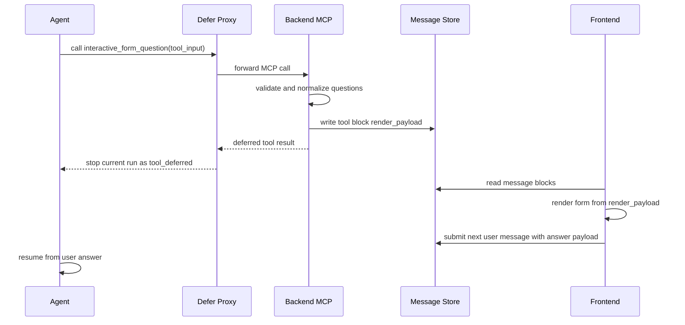

# 交互表单 Defer 流程

本文档说明 `interactive_form_question` MCP 工具的标准渲染和恢复流程。该流程用于让 Agent 在执行过程中向用户展示结构化表单，并在用户提交后通过后续消息继续执行。

## 设计目标

交互表单必须满足以下约束：

- MCP 仍然是唯一工具入口，参数校验、去重和表单规范化都在 MCP 服务端完成。
- 前端不能直接根据原始 tool input 渲染表单，只能渲染后端写入消息块的 `render_payload`。
- 表单展示后当前 Agent run 应终止，不把“等待用户输入”伪造成用户消息。
- 用户提交表单后，通过下一条用户消息携带 answer payload 恢复任务。
- 同一个 subtask 只能成功展示一次 `interactive_form_question` 表单。

## 标准流程



## MCP 输出契约

`interactive_form_question` 成功展示表单时，MCP 服务端必须写入 tool block 的 `render_payload`：

```json
{
  "type": "interactive_form_question",
  "ask_id": "ask_123",
  "task_id": 1,
  "subtask_id": 2,
  "questions": []
}
```

同时，tool result 只用于通知运行时终止当前 run：

```json
{
  "__deferred_user_input__": true,
  "success": true,
  "status": "waiting_for_user_response",
  "ask_id": "ask_123"
}
```

前端渲染时必须同时满足：

- block 是 `interactive_form_question` tool block。
- block 上存在合法的 `render_payload`。
- `render_payload.type` 为 `interactive_form_question`。
- `render_payload.questions` 是非空数组。

前端不得读取 raw tool input 来渲染表单。raw input 可能包含模型生成的错误字段，只有 MCP 规范化后的 payload 才是可信 UI schema。

## Chat Shell 行为

Chat Shell 调用工具后，如果 tool result 满足 defer 条件：

- 发送 tool done 事件，让消息块保持完整。
- 抛出内部 deferred exit，停止当前 ReAct 运行。
- 等待用户提交下一条消息。

不要把 deferred result 写成用户内容，也不要把“pending user input”放进模型上下文。

## Claude Code 行为

Claude Code 通过 `deferred_mcp_proxy` 只代理 `interactive_form_question` 这一类 MCP 工具。其他 MCP 工具仍按 Claude Code SDK 的原生方式调用。

代理逻辑是：

1. SDK hook 捕获 `interactive_form_question` tool call。
2. 代理把原始参数转发给 Backend MCP。
3. Backend MCP 完成校验、写入 `render_payload` 并返回 deferred result。
4. response processor 发出 tool done，并用 `stop_reason=tool_deferred` 结束本轮。

## 用户提交后的校验

Backend 在接收后续用户消息前会检查当前 task 是否存在未完成的交互表单：

- 没有 pending form 时，不允许提交 form answer。
- 有 pending form 时，普通文本消息会被拒绝，用户必须先提交或取消表单。
- answer payload 必须包含 `type=interactive_form_question` 和匹配的 `tool_use_id`。

这样可以避免用户普通聊天内容被误认为表单结果，也避免错误表单结果进入模型上下文。

## Skill 发布认证

Skill 创建脚本在任务运行时使用 `WEGENT_SKILL_IDENTITY_TOKEN` 发布生成的 Skill。该 token 是 Skill runtime identity，不是通用登录 token。

Skill 发布相关 API 必须支持该 token：

- `GET /api/v1/kinds/skills`：用于发布脚本检查同名 Skill，尤其是 `exact_match=true` 场景。
- `POST /api/v1/kinds/skills/upload`：创建 Skill。
- `PUT /api/v1/kinds/skills/{skill_id}`：覆盖已有 Skill。

普通业务接口不应默认接受 `WEGENT_SKILL_IDENTITY_TOKEN`，避免把 Skill runtime identity 扩大成通用用户凭证。
