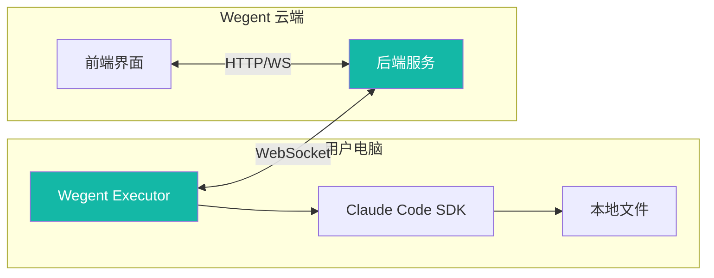
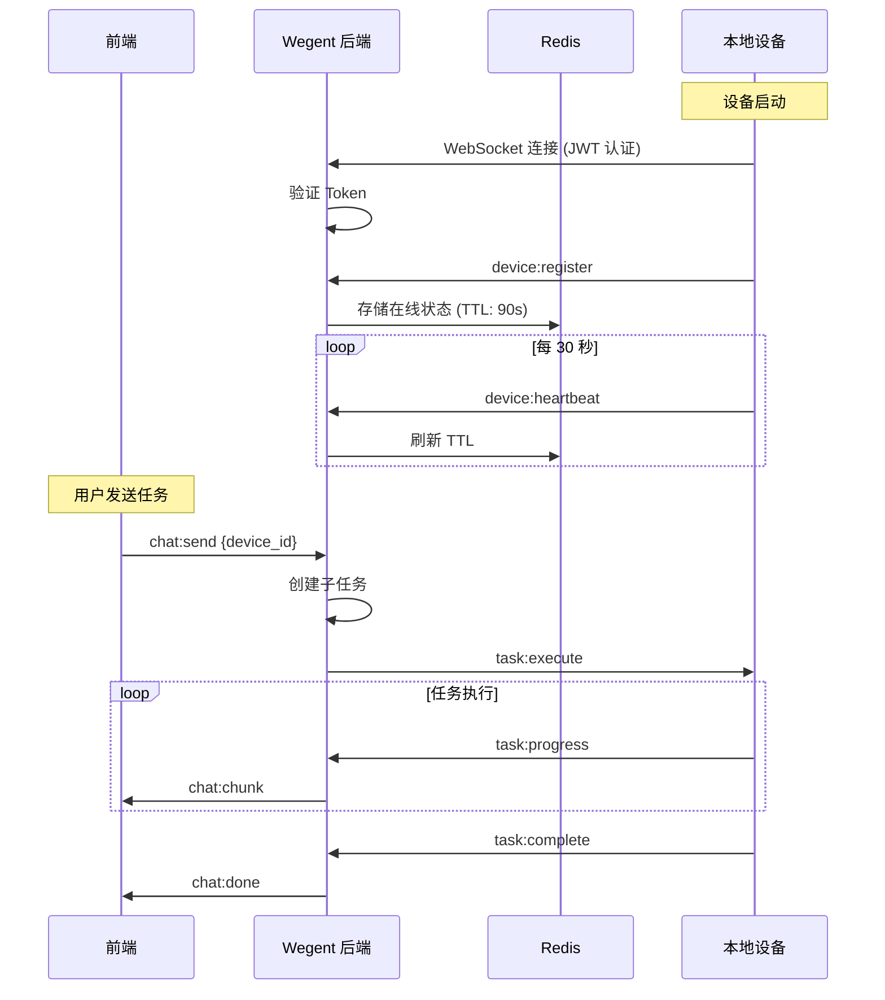
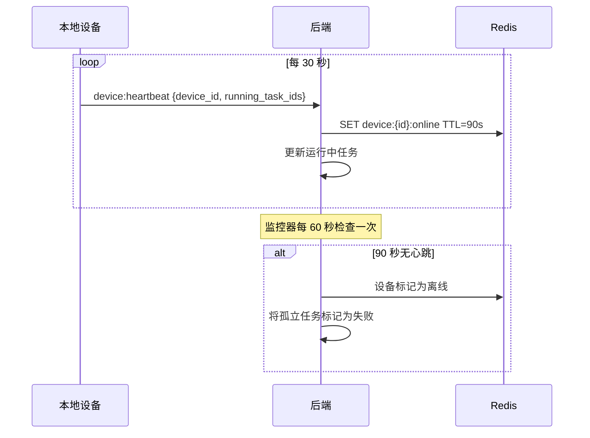
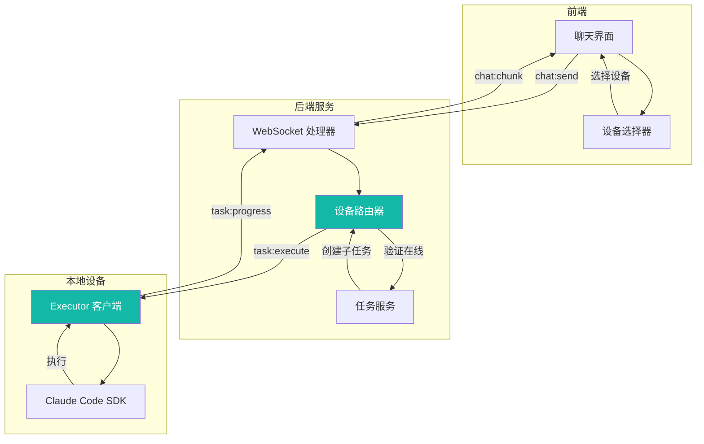
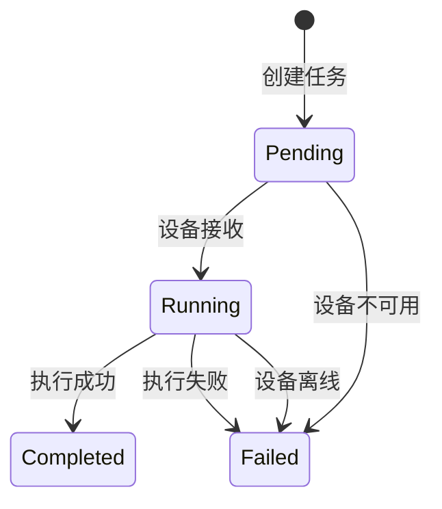
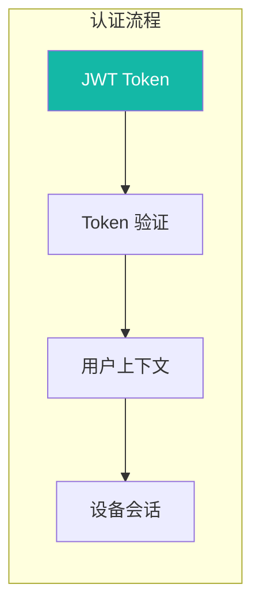
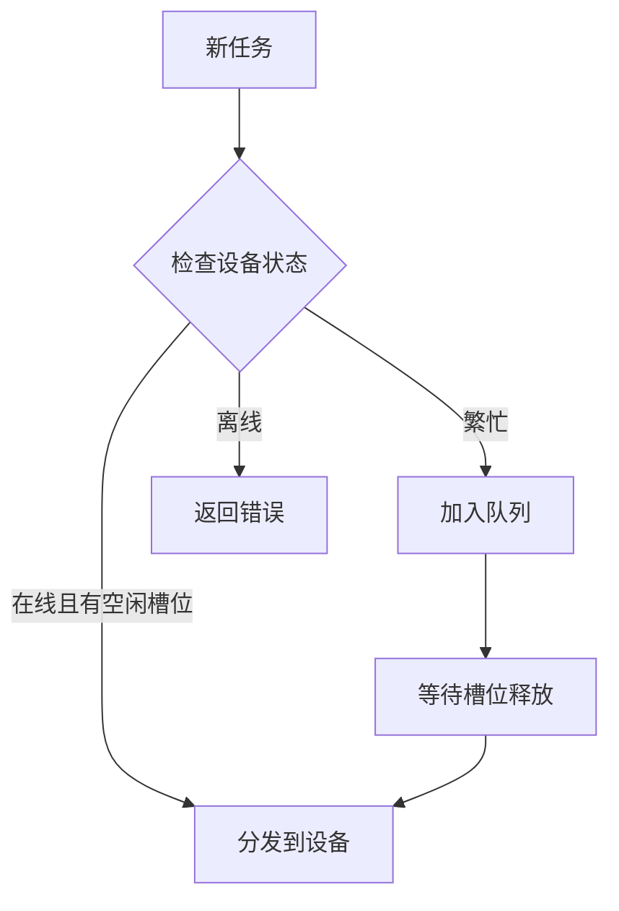

# 本地设备架构

本文档介绍本地设备支持的技术架构，包括通信协议、心跳机制和安全设计。

---

## 🏗 架构概述

### 系统组件



### 通信架构

下图展示了本地设备如何与 Wegent 系统通信：



---

## 📡 WebSocket 协议

### 事件类型

| 事件 | 方向 | 描述 |
|------|------|------|
| `device:register` | 设备 → 后端 | 设备注册 |
| `device:heartbeat` | 设备 → 后端 | 心跳保活 |
| `task:execute` | 后端 → 设备 | 下发任务 |
| `task:progress` | 设备 → 后端 | 任务进度 |
| `task:complete` | 设备 → 后端 | 任务完成 |

### 消息格式

```json
// device:register
{
  "event": "device:register",
  "data": {
    "device_id": "uuid-xxx",
    "name": "Darwin - MacBook-Pro.local",
    "max_slots": 5
  }
}

// device:heartbeat
{
  "event": "device:heartbeat",
  "data": {
    "device_id": "uuid-xxx",
    "running_task_ids": ["task-1", "task-2"]
  }
}

// task:execute
{
  "event": "task:execute",
  "data": {
    "subtask_id": "subtask-xxx",
    "prompt": "用户消息",
    "context": {}
  }
}
```

---

## 💓 心跳机制

### 时序图



### 时间参数

| 参数 | 值 | 描述 |
|------|-----|------|
| **心跳间隔** | 30 秒 | 设备发送心跳 |
| **在线 TTL** | 90 秒 | Redis 键过期时间 |
| **监控间隔** | 60 秒 | 后端检查过期设备 |
| **离线阈值** | 3 次心跳缺失 | 设备标记为离线 |

### 运行任务追踪

每次心跳包含当前运行的任务 ID，用于：

- 实时槽位使用追踪
- 孤立任务检测
- 断开连接时自动清理

---

## 🔄 任务执行流程



### 任务状态流转



---

## 🔐 安全机制

### 认证流程



### 安全特性

| 特性 | 描述 |
|------|------|
| **JWT 认证** | WebSocket 连接需要有效 token |
| **Token 有效期** | 7 天过期，需定期刷新 |
| **用户隔离** | 设备只能执行其所有者的任务 |
| **硬件绑定** | 设备 ID 基于硬件标识生成 |

### 用户隔离

每个设备会话绑定到用户：

- 设备只能接收其注册所有者的任务
- 防止跨用户任务执行
- 子任务根据用户命名空间进行验证

### 数据隐私

使用本地设备时：

- **代码留在本地**：源代码不会上传到云端
- **本地执行**：所有处理在用户机器上进行
- **结果流式传输**：只有输出文本被传输
- **无持久存储**：云端不存储本地文件

---

## 🔧 设备 ID 生成

Executor 自动生成稳定的设备 ID，基于以下优先级：

1. **缓存 ID**：存储在 `~/.wegent-executor/device_id`（如存在）
2. **硬件 UUID**：
   - macOS：系统硬件 UUID
   - Linux：`/etc/machine-id`
   - Windows：注册表中的 `MachineGuid`
3. **后备方案**：MAC 地址或随机 UUID

这确保设备在重启后保持一致的身份标识。

---

## 📊 并发控制

### 槽位管理

每个设备支持最多 **5 个并发任务**：

- 槽位使用通过心跳实时追踪
- 所有槽位被占用时设备显示"繁忙"
- 如果选择繁忙设备，任务会排队等待

### 负载均衡



---

## 🔗 相关文档

- [本地设备使用指南](../user-guide/ai-devices/local-device-support.md) - 用户操作指南
- [系统架构](./architecture.md) - 整体架构设计
- [WebSocket API](../reference/websocket-api.md) - API 参考

---

## 💬 获取帮助

需要帮助？

- 📖 查看 [常见问题](../faq.md)
- 🐛 提交 [GitHub Issue](https://github.com/wecode-ai/wegent/issues)
- 💬 加入社区讨论
