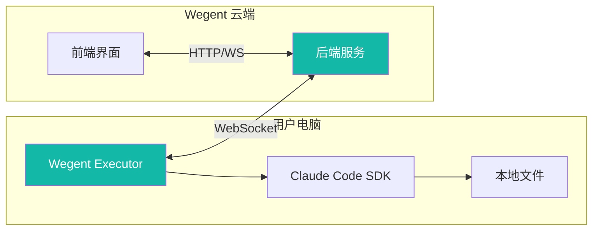
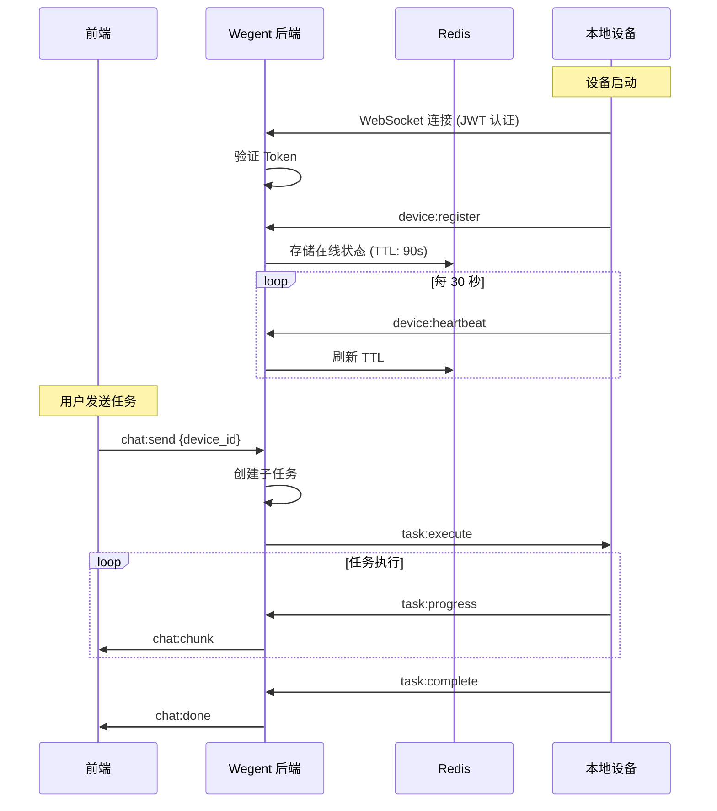
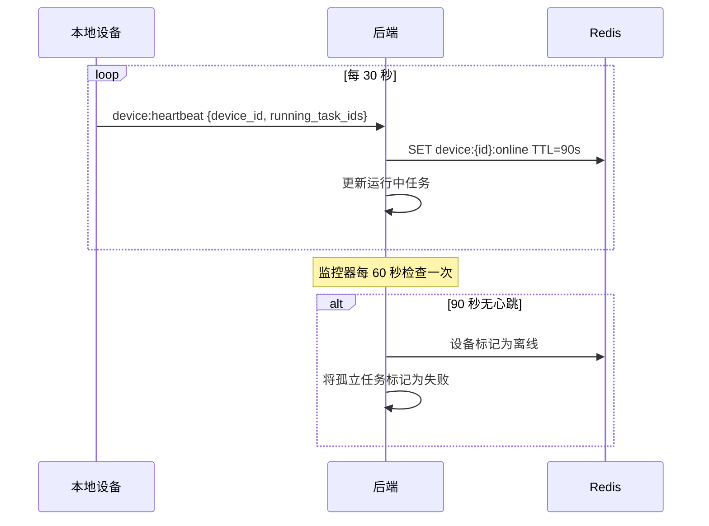
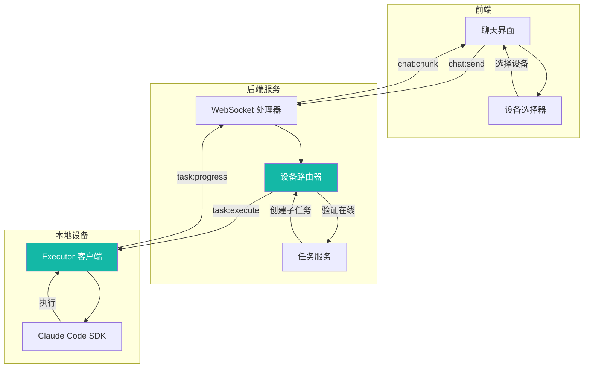
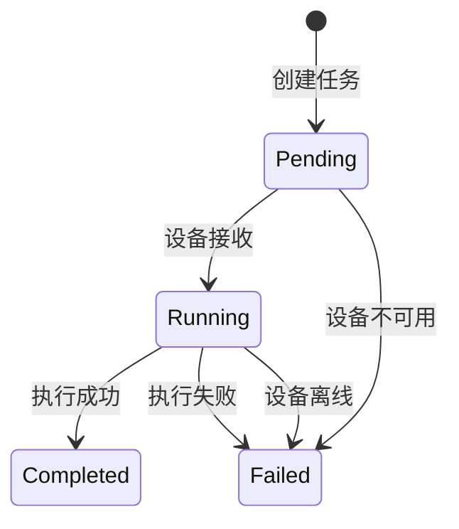
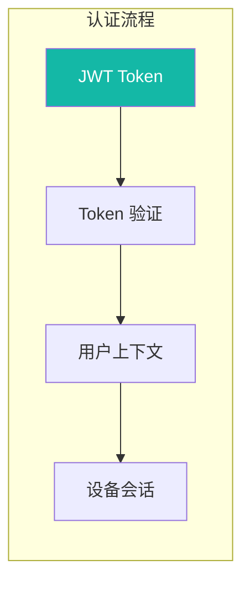
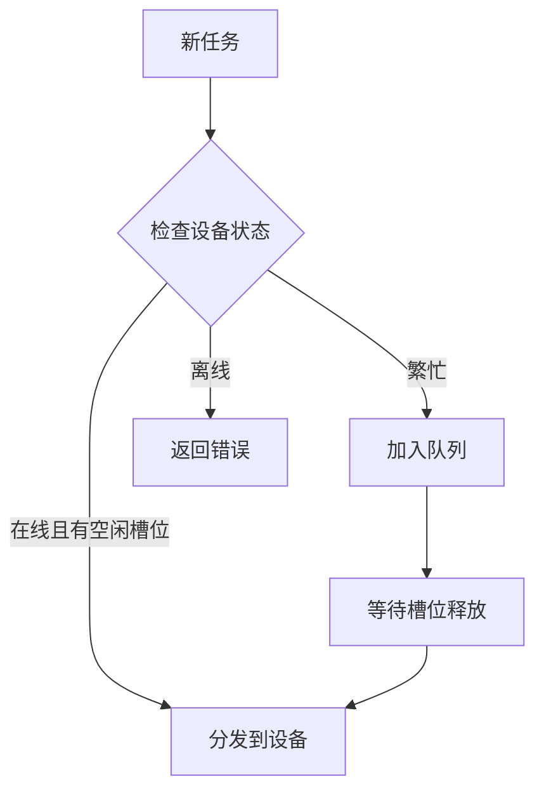

# 本地设备架构

本文档介绍本地设备支持的技术架构，包括通信协议、心跳机制和安全设计。

---

## 🏗 架构概述

### 系统组件


```mermaid
flowchart LR
    subgraph "用户电脑"
        EX[Wegent Executor]
        CC[Claude Code SDK]
        FS[本地文件]
    end

    subgraph "Wegent 云端"
        BE[后端服务]
        FE[前端界面]
    end

    EX <-->|WebSocket| BE
    FE <-->|HTTP/WS| BE
    EX --> CC
    CC --> FS

    style EX fill:#14B8A6,color:#fff
    style BE fill:#14B8A6,color:#fff
```

### 通信架构

下图展示了本地设备如何与 Wegent 系统通信：


```mermaid
sequenceDiagram
    participant FE as 前端
    participant BE as Wegent 后端
    participant RD as Redis
    participant EX as 本地设备

    Note over EX: 设备启动
    EX->>BE: WebSocket 连接 (JWT 认证)
    BE->>BE: 验证 Token
    EX->>BE: device:register
    BE->>RD: 存储在线状态 (TTL: 90s)

    loop 每 30 秒
        EX->>BE: device:heartbeat
        BE->>RD: 刷新 TTL
    end

    Note over FE: 用户发送任务
    FE->>BE: chat:send {device_id}
    BE->>BE: 创建子任务
    BE->>EX: task:execute

    loop 任务执行
        EX->>BE: task:progress
        BE->>FE: chat:chunk
    end

    EX->>BE: task:complete
    BE->>FE: chat:done
```

### 设备类型

设备 CRD 使用 `spec.deviceType` 区分生命周期归属和前端能力入口：

| 类型     | 生命周期归属                   | 连接方式  | 典型入口                            |
| -------- | ------------------------------ | --------- | ----------------------------------- |
| `local`  | 用户本机 executor              | WebSocket | 本地安装脚本或手动启动 executor     |
| `cloud`  | Wegent 云设备服务              | WebSocket | 云设备创建、重启、释放流程          |
| `remote` | 用户自管 Docker 容器或远端主机 | WebSocket | Wework 连接设置中的远程 Docker 命令 |

`remote` 设备复用本地 executor 的 WebSocket 注册、心跳、任务执行和 command RPC 通道，但由 `RemoteDeviceProvider` 独立列出和返回 `remoteConfig`。Backend 不保存生成命令中的 `WEGENT_AUTH_TOKEN`；Device CRD 只保存 provider、image、deviceId、deviceName、backendUrl、publicBaseUrl 和 createdAt 等非敏感元数据。

远程 Docker 设备启动后会发送 `device:register`，payload 中的 `device_type=remote` 会更新同名 Device CRD。在线状态仍存储在 Redis 的设备在线键中，因此任务调度、slot 统计、terminal/code-server session RPC 与本地设备保持同一套协议。前端不会对 `remote` 设备展示云设备生命周期操作；停止、重启、删除容器由用户在 Docker 主机上完成。

---

## 📡 WebSocket 协议

### 事件类型

| 事件               | 方向        | 描述     |
| ------------------ | ----------- | -------- |
| `device:register`  | 设备 → 后端 | 设备注册 |
| `device:heartbeat` | 设备 → 后端 | 心跳保活 |
| `task:execute`     | 后端 → 设备 | 下发任务 |
| `task:progress`    | 设备 → 后端 | 任务进度 |
| `task:complete`    | 设备 → 后端 | 任务完成 |

### 消息格式

```json
// device:register
{
  "event": "device:register",
  "data": {
    "device_id": "uuid-xxx",
    "name": "Darwin - MacBook-Pro.local",
    "max_slots": 5
  }
}

// device:heartbeat
{
  "event": "device:heartbeat",
  "data": {
    "device_id": "uuid-xxx",
    "running_task_ids": ["task-1", "task-2"]
  }
}

// task:execute
{
  "event": "task:execute",
  "data": {
    "subtask_id": "subtask-xxx",
    "prompt": "用户消息",
    "context": {}
  }
}
```

---

## 💓 心跳机制

### 时序图


```mermaid
sequenceDiagram
    participant EX as 本地设备
    participant BE as 后端
    participant RD as Redis

    loop 每 30 秒
        EX->>BE: device:heartbeat {device_id, running_task_ids}
        BE->>RD: SET device:{id}:online TTL=90s
        BE->>BE: 更新运行中任务
    end

    Note over BE: 监控器每 60 秒检查一次
    alt 90 秒无心跳
        BE->>RD: 设备标记为离线
        BE->>BE: 将孤立任务标记为失败
    end
```

### 时间参数

| 参数         | 值           | 描述             |
| ------------ | ------------ | ---------------- |
| **心跳间隔** | 30 秒        | 设备发送心跳     |
| **在线 TTL** | 90 秒        | Redis 键过期时间 |
| **监控间隔** | 60 秒        | 后端检查过期设备 |
| **离线阈值** | 3 次心跳缺失 | 设备标记为离线   |

### 运行任务追踪

每次心跳包含当前运行的任务 ID，用于：

- 实时槽位使用追踪
- 孤立任务检测
- 断开连接时自动清理

### 全局能力状态上报

本地设备还会通过心跳上报 Claude Code 全局能力状态。完整上报包含：

- `capabilities.revision`：本地 Wegent 管理清单版本
- `capabilities.digest`：`skills`、`plugins`、`mcps` 的内容摘要
- `capabilities.skills`：`~/.claude/skills` 中可用的 Skill
- `capabilities.plugins`：`~/.claude/plugins/installed_plugins.json` 中已安装的 Plugin
- `capabilities.mcps`：Wegent 管理的全局 MCP 配置

Plugin 上报必须包含其内部 Skill 列表。Executor 会扫描每个 Plugin 安装目录下的 `SKILL.md`，并在 `plugins[].skills[]` 中返回：

```json
{
  "name": "context7",
  "marketplace": "claude-plugins-official",
  "version": "1057d02c5307",
  "source": "wegent",
  "installed_plugin_id": 301,
  "skills": [
    {
      "name": "context7",
      "description": "Look up version-specific documentation.",
      "path": "skills/context7"
    }
  ]
}
```

后端只在 `capabilities.full = true` 时保存完整能力状态；后续心跳如果只有相同 `digest`，只刷新在线状态，不重复写入完整列表。

Codex 本地设备还会在 `runtime_auth_files.codex_auth_json` 中上报 `~/.codex/auth.json` 的存在状态、路径、SHA-256 摘要和文件修改时间。后端用这些元数据判断用户设置的主设备是否拥有更新版本；主设备只作为来源不会被覆盖，从设备会在同步时直接覆盖本机 auth 文件。

### 全局能力同步

后端可以通过 `device:sync_capabilities` 向在线本地设备下发全局能力期望状态。当前同步内容包括：

- `skills`：通过 backend 解析后的 `InstalledSkill` / `Skill`，由 executor 下载到 `~/.claude/skills`
- `plugins`：通过 backend 解析后的 `InstalledPlugin`，由 executor 写入 `~/.claude/plugins/installed_plugins.json`
- `mcps`：通过 backend 解析后的 `InstalledMCP`，由 executor 写入 Wegent 管理清单

`replace` 模式只会清理由 Wegent manifest 标记为 `managed` 且不在期望状态中的能力。用户直接在本机安装的 plugin 不会因为一次 Wegent 同步被删除。

项目任务使用本地 executor 执行时，任务级 `CLAUDE_CONFIG_DIR` 会同时暴露全局 `skills` 和 `plugins` 目录，并从本机 `~/.claude/settings.json` 继承 `enabledPlugins`、`extraKnownMarketplaces` 等非敏感插件配置，使 Claude Code 能加载全局 Skill 以及 Plugin 内部提供的 Skill。模型、Token 等敏感配置仍通过运行时环境变量注入，不会从全局 settings 写入任务目录。

项目模式下访问 Claude 或 Codex 模型 API 时，executor 会在直接启动的运行时上下文中加入 `wecode-project: <project_id>` 请求头，并补齐 `wecode-action: wegent`、`wecode-source: wegent-local`、`wecode-executor: <runtime>` 来源标识，其中 Claude Code 使用 `claudecode`，Codex 使用 `codex`。Claude Code 本地模式会先合并 executor 启动进程环境和运行时环境里已有的 `ANTHROPIC_CUSTOM_HEADERS`，再追加 project 标识，并同时写入 `ANTHROPIC_CUSTOM_HEADERS` 与 `DEFAULT_HEADERS`/`default_headers` 环境变量，保证直接 Claude Code 子进程和下游模型网关读取到一致的 header 集合；Codex 在 Wegent 管理 provider 配置时写入 provider 的 `http_headers`，使用个人 Codex 配置且显式指定 provider 时也会对该 provider 注入同一 project 请求头。

---

## 🔄 任务执行流程


```mermaid
flowchart TB
    subgraph "前端"
        UI[聊天界面]
        DS[设备选择器]
    end

    subgraph "后端服务"
        DR[设备路由器]
        TS[任务服务]
        WS[WebSocket 处理器]
    end

    subgraph "本地设备"
        EX[Executor 客户端]
        SDK[Claude Code SDK]
    end

    UI --> DS
    DS -->|选择设备| UI
    UI -->|chat:send| WS
    WS --> DR
    DR -->|验证在线| TS
    TS -->|创建子任务| DR
    DR -->|task:execute| EX
    EX --> SDK
    SDK -->|执行| EX
    EX -->|task:progress| WS
    WS -->|chat:chunk| UI

    style DR fill:#14B8A6,color:#fff
    style EX fill:#14B8A6,color:#fff
```

### 任务状态流转


```mermaid
stateDiagram-v2
    [*] --> Pending: 创建任务
    Pending --> Running: 设备接收
    Running --> Completed: 执行成功
    Running --> Failed: 执行失败
    Running --> Failed: 设备离线
    Pending --> Failed: 设备不可用
```

---

## 🔐 安全机制

### 认证流程


```mermaid
flowchart LR
    subgraph "认证流程"
        T[JWT Token] --> V[Token 验证]
        V --> U[用户上下文]
        U --> D[设备会话]
    end

    style T fill:#14B8A6,color:#fff
```

### 安全特性

| 特性             | 描述                         |
| ---------------- | ---------------------------- |
| **JWT 认证**     | WebSocket 连接需要有效 token |
| **Token 有效期** | 7 天过期，需定期刷新         |
| **用户隔离**     | 设备只能执行其所有者的任务   |
| **硬件绑定**     | 设备 ID 基于硬件标识生成     |

### 本地执行器连接配置

本地执行器启动时按“环境变量、`~/.wegent-executor/device-config.json`、默认值”的顺序解析配置。其中 `mode` 决定启动模式，`connection.backend_url` 和 `connection.auth_token` 分别用于连接 Backend 和完成设备认证。

`EXECUTOR_MODE` 覆盖 `mode`，`WEGENT_BACKEND_URL` 覆盖 `connection.backend_url`，`WEGENT_AUTH_TOKEN` 覆盖 `connection.auth_token`。因此常规启动脚本不需要强制传入这些环境变量；只要设备配置文件中已有有效模式和连接信息，executor 就可以直接启动。

### 云设备启动身份变量

云设备通过 user data 启动脚本自动安装并运行 executor。启动脚本会注入以下身份相关环境变量：

| 变量                    | 来源                                  | 用途                                               |
| ----------------------- | ------------------------------------- | -------------------------------------------------- |
| `WEGENT_AUTH_TOKEN`     | 后端为云设备自动生成的 API Key        | executor 连接后端并注册设备                        |
| `WEGENT_USER_JWT_TOKEN` | 创建云设备请求中的当前用户 Bearer JWT | 云设备内需要以当前用户身份访问后端能力的脚本或集成 |
| `WEGENT_USER_NAME`      | 当前登录用户名                        | 云设备内需要识别当前用户的脚本或集成               |

`WEGENT_AUTH_TOKEN` 与 `WEGENT_USER_JWT_TOKEN` 不能混用：前者代表设备认证身份，后者代表创建云设备时的用户身份。

### 云设备启动系统配置

创建云设备时，后端会生成 `ubuntu` 用户的初始化登录密码，并存储在 Device CRD 的 `spec.cloudConfig.ubuntuInitialPassword` 字段中。user data 启动脚本会使用该密码执行 `chpasswd`，完成 `ubuntu` 用户密码初始化。

同一个 user data 启动脚本还会创建 `/etc/systemd/system/fstrim.timer.d/override.conf`，将 `fstrim.timer` 配置为每天运行，并重新加载、重启、启用该 timer。

### 用户隔离

每个设备会话绑定到用户：

- 设备只能接收其注册所有者的任务
- 防止跨用户任务执行
- 子任务根据用户命名空间进行验证

### 数据隐私

使用本地设备时：

- **代码留在本地**：源代码不会上传到云端
- **本地执行**：所有处理在用户机器上进行
- **结果流式传输**：只有输出文本被传输
- **无持久存储**：云端不存储本地文件

---

## 🔧 设备 ID 生成

Executor 自动生成稳定的设备 ID，基于以下优先级：

1. **缓存 ID**：存储在 `~/.wegent-executor/device_id`（如存在）
2. **硬件 UUID**：
   - macOS：系统硬件 UUID
   - Linux：`/etc/machine-id`
   - Windows：注册表中的 `MachineGuid`
3. **后备方案**：MAC 地址或随机 UUID

这确保设备在重启后保持一致的身份标识。

---

## 📊 并发控制

### 槽位管理

每个设备支持最多 **5 个并发任务**：

- 槽位使用通过心跳实时追踪
- 所有槽位被占用时设备显示"繁忙"
- 如果选择繁忙设备，任务会排队等待

### 负载均衡


```mermaid
flowchart TB
    T[新任务] --> C{检查设备状态}
    C -->|在线且有空闲槽位| D[分发到设备]
    C -->|繁忙| Q[加入队列]
    C -->|离线| F[返回错误]
    Q --> W[等待槽位释放]
    W --> D
```

---

## 🔗 相关文档

- [本地设备使用指南](../user-guide/ai-devices/local-device-support.md) - 用户操作指南
- [系统架构](./architecture.md) - 整体架构设计
- [WebSocket API](../reference/websocket-api.md) - API 参考

---

## 💬 获取帮助

需要帮助？

- 📖 查看 [常见问题](../faq.md)
- 🐛 提交 [GitHub Issue](https://github.com/wecode-ai/wegent/issues)
- 💬 加入社区讨论
