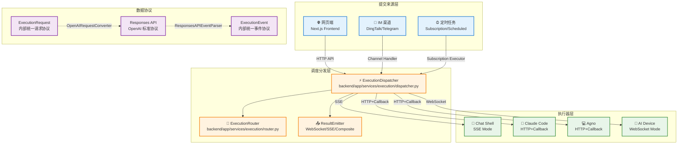
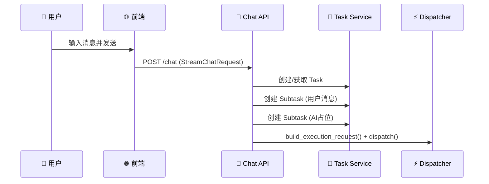
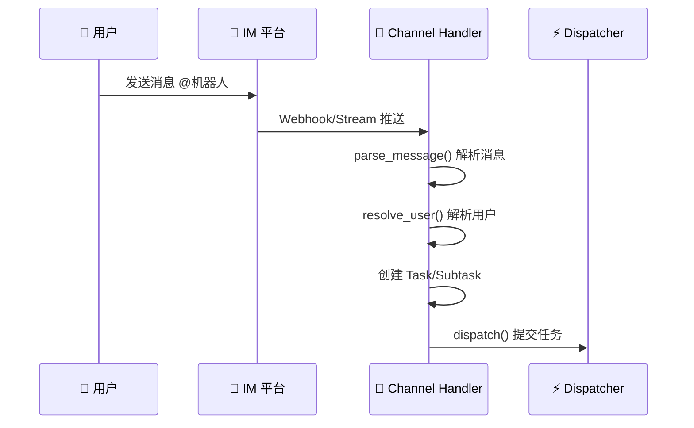
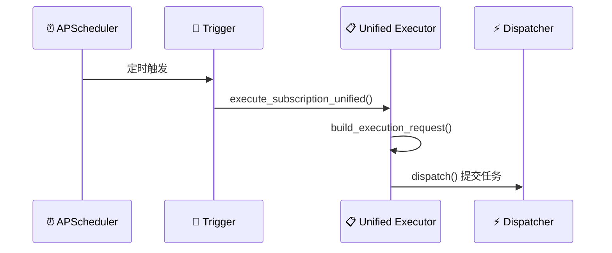
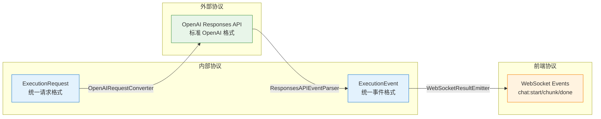
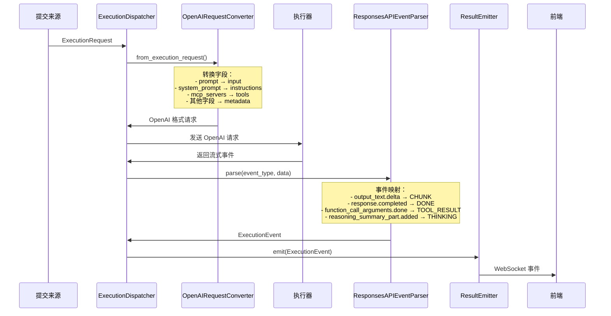
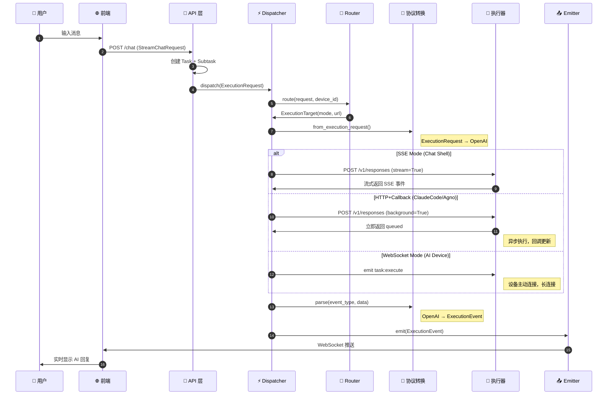

# 任务提交与分发链路设计

本文档详细描述 Wegent 平台中从任务提交到执行完成的完整链路，以 `dispatcher.py` 为核心，涵盖正常流程（happy path）的全流程设计。

---

## 📋 目录

- [整体架构概览](#整体架构概览)
- [提交来源层](#提交来源层)
- [调度分发层](#调度分发层)
- [执行器层](#执行器层)
- [数据协议与转换](#数据协议与转换)

---

## 整体架构概览

### 架构全景图



### 三层架构说明

| 层次 | 职责 | 核心组件 |
|------|------|----------|
| **提交来源层** | 接收用户请求，构造任务数据 | 网页端、IM 渠道、定时任务 |
| **调度分发层** | 路由决策、协议转换、事件分发 | `ExecutionDispatcher`、`ExecutionRouter`、`ResultEmitter` |
| **执行器层** | 实际执行 AI 任务 | Chat Shell、Claude Code、Agno、AI Device |

---

## 提交来源层

### 1. 网页（Web）提交

#### 入口代码位置
- **API 端点**: `backend/app/api/endpoints/adapter/chat.py`
- **任务创建**: `backend/app/api/endpoints/adapter/tasks.py`
- **核心处理**: `backend/app/services/chat/trigger/unified.py::build_execution_request()`

#### 调用链路



#### 关键代码路径

**1. API 入口** (`backend/app/api/endpoints/adapter/chat.py`):
```python
class StreamChatRequest(BaseModel):
    message: str
    team_id: int
    task_id: Optional[int] = None
    model_id: Optional[str] = None
    # ... 其他字段
```

**2. 构造 ExecutionRequest** (`backend/app/services/chat/trigger/unified.py`):
```python
async def build_execution_request(
    task: TaskResource,
    assistant_subtask: Subtask,
    team: Kind,
    user: User,
    message: str,
    # ...
) -> ExecutionRequest:
    # 构建统一的 ExecutionRequest
    request = ExecutionRequest(
        task_id=task.id,
        subtask_id=assistant_subtask.id,
        user=user_dict,
        bot=bot_configs,
        model_config=model_config,
        prompt=message,
        # ...
    )
    return request
```

**3. 提交到 Dispatcher**:
```python
from app.services.execution import execution_dispatcher

await execution_dispatcher.dispatch(
    request=execution_request,
    device_id=device_id,  # 可选，指定本地设备
    emitter=emitter,  # 可选，自定义 emitter
)
```

---

### 2. IM（即时通讯）提交

#### 入口代码位置
- **钉钉处理器**: `backend/app/services/channels/dingtalk/handler.py::DingTalkChannelHandler`
- **Telegram 处理器**: `backend/app/services/channels/telegram/handler.py`
- **抽象基类**: `backend/app/services/channels/handler.py::BaseChannelHandler`

#### 调用链路



#### 关键代码路径

**1. 消息解析** (`backend/app/services/channels/handler.py`):
```python
@dataclass
class MessageContext:
    content: str           # 消息文本
    sender_id: str         # 发送者 ID
    sender_name: str       # 发送者名称
    conversation_id: str   # 会话 ID
    conversation_type: str # "private" 或 "group"
    is_mention: bool       # 是否被 @
    raw_message: Any       # 原始消息对象
```

**2. 处理器实现** (`backend/app/services/channels/dingtalk/handler.py`):
```python
class DingTalkChannelHandler(BaseChannelHandler):
    def parse_message(self, raw_data: Any) -> MessageContext:
        # 解析钉钉消息格式
        message: ChatbotMessage = raw_data
        content = message.text.content.strip()
        # ...
        return MessageContext(...)

    async def resolve_user(self, db: Session, context: MessageContext) -> Optional[User]:
        # 将钉钉用户映射到 Wegent 用户
        resolver = DingTalkUserResolver(...)
        return await resolver.resolve_user(...)
```

**3. 任务提交**:
```python
# Channel handler 内部调用 dispatcher
from app.services.execution import execution_dispatcher

await execution_dispatcher.dispatch(
    request=execution_request,
    device_id=device_id,  # 可能根据用户选择
)
```

---

### 3. 定时任务（Subscription/Scheduled）提交

#### 入口代码位置
- **统一执行器**: `backend/app/services/subscription/unified_executor.py`
- **执行数据**: `backend/app/services/subscription/unified_executor.py::SubscriptionExecutionData`

#### 调用链路



#### 关键代码路径

**1. 执行数据容器** (`backend/app/services/subscription/unified_executor.py`):
```python
@dataclass
class SubscriptionExecutionData:
    subscription_id: int
    execution_id: int
    task_id: int
    subtask_id: int
    prompt: str
    model_override_name: Optional[str]
    # ...
```

**2. 统一执行入口**:
```python
async def execute_subscription_unified(
    db: Session,
    task: TaskResource,
    assistant_subtask: Subtask,
    team: Kind,
    user: User,
    execution_data: SubscriptionExecutionData,
) -> None:
    # 构建 ExecutionRequest
    request = await build_execution_request(
        task=task,
        assistant_subtask=assistant_subtask,
        team=team,
        user=user,
        message=execution_data.prompt,
        is_subscription=True,  # 标记为订阅任务
        # ...
    )

    # 路由决策
    router = ExecutionRouter()
    target = router.route(request, device_id=None)

    # 根据模式选择执行方式
    if target.mode == CommunicationMode.SSE:
        await _execute_sse_sync(request, execution_data)
    else:
        await _execute_http_callback(request, execution_data)
```

---

## 调度分发层

### ExecutionDispatcher 核心设计

**文件位置**: `backend/app/services/execution/dispatcher.py`

#### 核心职责

1. **统一入口**: 所有任务执行的唯一入口
2. **路由决策**: 通过 `ExecutionRouter` 确定执行目标
3. **协议转换**: 内部 `ExecutionRequest` ↔ OpenAI Responses API
4. **事件分发**: 通过 `ResultEmitter` 向前端推送事件

#### 主入口方法

```python
class ExecutionDispatcher:
    async def dispatch(
        self,
        request: ExecutionRequest,
        device_id: Optional[str] = None,
        emitter: Optional[ResultEmitter] = None,
    ) -> None:
        """统一任务分发入口。

        Args:
            request: 统一的执行请求
            device_id: 可选的设备 ID（使用 WebSocket 模式）
            emitter: 可选的自定义事件发射器
        """
        # 1. 路由决策
        target = self.router.route(request, device_id)

        # 2. 创建默认 emitter（如果未提供）
        if emitter is None:
            emitter = WebSocketResultEmitter(...)

        # 3. 包装状态更新 emitter
        wrapped_emitter = StatusUpdatingEmitter(wrapped=emitter, ...)

        # 4. 更新子任务状态为 RUNNING
        await self._update_subtask_to_running(request.subtask_id)

        # 5. 根据通信模式分发
        if target.mode == CommunicationMode.SSE:
            await self._dispatch_sse(request, target, wrapped_emitter)
        elif target.mode == CommunicationMode.WEBSOCKET:
            await self._dispatch_websocket(request, target, wrapped_emitter)
        else:
            await self._dispatch_http_callback(request, target, wrapped_emitter)
```

### ExecutionRouter 路由规则

**文件位置**: `backend/app/services/execution/router.py`

#### 通信模式

```python
class CommunicationMode(str, Enum):
    SSE = "sse"              # Server-Sent Events，长连接流式
    WEBSOCKET = "websocket"  # WebSocket，本地设备
    HTTP_CALLBACK = "http_callback"  # HTTP + 回调，异步
```

#### 路由配置

```python
EXECUTION_SERVICES = {
    "Chat": {
        "mode": "sse",
        "url": settings.CHAT_SHELL_URL,  # http://127.0.0.1:8100
    },
    "ClaudeCode": {
        "mode": "http_callback",
        "url": settings.EXECUTOR_MANAGER_URL + "/executor-manager",
    },
    "Agno": {
        "mode": "http_callback",
        "url": settings.EXECUTOR_MANAGER_URL + "/executor-manager",
    },
    "Dify": {
        "mode": "http_callback",
        "url": settings.EXECUTOR_MANAGER_URL + "/executor-manager",
    },
}
```

#### 路由优先级

1. **Priority 1**: 如果指定了 `device_id`，使用 **WebSocket 模式**
2. **Priority 2**: 根据 `shell_type` 查找配置（Chat/ClaudeCode/Agno/Dify）
3. **Priority 3**: 默认使用 **HTTP+Callback 模式**

---

## 执行器层

### 1. Chat Shell（SSE 模式）

**入口**: `chat_shell/chat_shell/api/v1/response.py`

#### 特点
- **通信模式**: SSE（Server-Sent Events）
- **协议**: OpenAI Responses API
- **适用场景**: 直接对话，无需代码执行

#### 调用流程
```python
# dispatcher.py::_dispatch_sse()
client = AsyncOpenAI(
    base_url=f"{target.url}/v1",
    api_key="dummy",
)

# 转换请求格式
openai_request = OpenAIRequestConverter.from_execution_request(request)

# 发送流式请求
stream = await client.responses.create(
    model=openai_request.get("model"),
    input=openai_request.get("input"),
    instructions=openai_request.get("instructions"),
    tools=tools if tools else None,
    stream=True,
    extra_body={...},
)

# 处理流式事件
async for event in stream:
    parsed_event = self.event_parser.parse(...)
    if parsed_event:
        await emitter.emit(parsed_event)
```

---

### 2. Claude Code（HTTP+Callback 模式）

**入口**: `executor/agents/claude_code/claude_code_agent.py::ClaudeCodeAgent`

#### 特点
- **通信模式**: HTTP + Callback
- **执行环境**: Docker 容器
- **适用场景**: 代码任务，支持 Git、MCP、Skills

#### 调用流程
```python
# dispatcher.py::_dispatch_http_callback()
response = await client.responses.create(
    model=openai_request.get("model"),
    input=openai_request.get("input"),
    instructions=openai_request.get("instructions"),
    tools=tools if tools else None,
    stream=False,  # 非流式
    extra_body={
        "background": True,  # 后台执行
        "metadata": {...},
    },
)

# 后续事件通过 /internal/callback 接收
```

---

### 3. Agno（HTTP+Callback 模式）

**入口**: `executor/agents/agno/agno_agent.py::AgnoAgent`

#### 特点
- **通信模式**: HTTP + Callback
- **执行环境**: Docker 容器
- **适用场景**: 多智能体协作（coordinate/collaborate/route 模式）

---

### 4. AI Device（WebSocket 模式）

**入口**: 本地设备通过 WebSocket 接收任务

#### 特点
- **通信模式**: WebSocket（Socket.IO）
- **命名空间**: `/local-executor`
- **事件**: `task:execute`
- **适用场景**: 本地开发环境，使用用户本地资源

#### 调用流程
```python
# dispatcher.py::_dispatch_websocket()
await sio.emit(
    "task:execute",
    request.to_dict(),
    room=f"device:{user_id}:{device_id}",
    namespace="/local-executor",
)

# 设备执行后通过 on_task_progress/on_task_complete 回调
```

---

## 数据协议与转换

### 协议概览



---

### 1. ExecutionRequest（内部请求协议）

**定义位置**: `shared/models/execution.py::ExecutionRequest`

#### 核心字段

```python
@dataclass
class ExecutionRequest:
    # === 任务标识 ===
    task_id: int = 0
    subtask_id: int = 0
    team_id: int = 0

    # === 用户信息 ===
    user: dict = field(default_factory=dict)
    user_id: int = 0

    # === Bot 配置 ===
    bot: list = field(default_factory=list)  # 包含 shell_type
    bot_name: str = ""

    # === 模型配置 ===
    model_config: dict = field(default_factory=dict)

    # === 提示词 ===
    system_prompt: str = ""
    prompt: str = ""  # 用户消息

    # === 功能开关 ===
    enable_tools: bool = True
    enable_web_search: bool = False

    # === Skill 配置 ===
    skill_names: list = field(default_factory=list)
    mcp_servers: list = field(default_factory=list)

    # === 工作空间 ===
    workspace: dict = field(default_factory=dict)

    # === Git 配置 ===
    git_domain: Optional[str] = None
    git_repo: Optional[str] = None
    branch_name: Optional[str] = None

    # === 会话配置 ===
    history: list = field(default_factory=list)
    is_group_chat: bool = False

    # === 订阅任务标记 ===
    is_subscription: bool = False
```

---

### 2. ExecutionEvent（内部事件协议）

**定义位置**: `shared/models/execution.py::ExecutionEvent`

#### 事件类型

```python
class EventType(str, Enum):
    START = "start"           # 开始生成
    CHUNK = "chunk"           # 内容片段
    THINKING = "thinking"     # 思考过程
    TOOL_START = "tool_start" # 工具调用开始
    TOOL_RESULT = "tool_result" # 工具调用结果
    DONE = "done"             # 完成
    ERROR = "error"           # 错误
    CANCELLED = "cancelled"   # 取消
```

#### 核心字段

```python
@dataclass
class ExecutionEvent:
    type: str              # EventType 值
    task_id: int
    subtask_id: int
    content: str = ""      # 文本内容
    offset: int = 0        # 流式偏移量
    result: Optional[dict] = None  # 结果数据
    error: Optional[str] = None
    tool_name: Optional[str] = None
    tool_use_id: Optional[str] = None
    tool_input: Optional[dict] = None
    tool_output: Optional[Any] = None
```

---

### 3. Responses API（OpenAI 标准协议）

**定义位置**: `shared/models/responses_api.py`

#### 事件类型

```python
class ResponsesAPIStreamEvents(Enum):
    # 响应生命周期
    RESPONSE_CREATED = "response.created"
    RESPONSE_IN_PROGRESS = "response.in_progress"
    RESPONSE_COMPLETED = "response.completed"
    RESPONSE_INCOMPLETE = "response.incomplete"

    # 内容输出
    OUTPUT_ITEM_ADDED = "response.output_item.added"
    OUTPUT_ITEM_DONE = "response.output_item.done"
    CONTENT_PART_ADDED = "response.content_part.added"
    CONTENT_PART_DONE = "response.content_part.done"
    OUTPUT_TEXT_DELTA = "response.output_text.delta"
    OUTPUT_TEXT_DONE = "response.output_text.done"

    # 函数调用
    FUNCTION_CALL_ARGUMENTS_DELTA = "response.function_call_arguments.delta"
    FUNCTION_CALL_ARGUMENTS_DONE = "response.function_call_arguments.done"

    # 推理
    RESPONSE_PART_ADDED = "response.reasoning_summary_part.added"

    # 错误
    ERROR = "error"
```

---

### 4. 协议转换流程

#### 完整时序图



#### 请求转换（ExecutionRequest → OpenAI）

**转换器**: `shared/models/openai_converter.py::OpenAIRequestConverter`

| 内部字段 | OpenAI 字段 | 说明 |
|----------|-------------|------|
| `prompt` | `input` | 用户输入 |
| `system_prompt` | `instructions` | 系统提示词 |
| `mcp_servers` | `tools` | MCP 工具列表 |
| `model_config.model_id` | `model` | 模型标识 |
| 其他字段 | `metadata` | 自定义元数据 |
| `model_config` | `model_config` | 模型配置（extra_body） |

```python
@staticmethod
def from_execution_request(request: ExecutionRequest) -> dict[str, Any]:
    openai_request = {
        "model": request.model_config.get("model_id", ""),
        "input": request.prompt,
        "stream": True,
    }

    if request.system_prompt:
        openai_request["instructions"] = request.system_prompt

    # MCP servers 转换为 tools
    tools = []
    if request.mcp_servers:
        for server in request.mcp_servers:
            tool = {
                "type": "mcp",
                "server_label": server.get("name", ""),
                "server_url": server.get("url", ""),
            }
            tools.append(tool)

    if tools:
        openai_request["tools"] = tools

    # 其他字段放入 metadata
    openai_request["metadata"] = {
        "task_id": request.task_id,
        "subtask_id": request.subtask_id,
        "user": request.user,
        # ...
    }

    return openai_request
```

#### 事件转换（OpenAI → ExecutionEvent）

**转换器**: `backend/app/services/execution/dispatcher.py::ResponsesAPIEventParser`

| OpenAI 事件 | 内部事件 | 说明 |
|-------------|----------|------|
| `response.output_text.delta` | `CHUNK` | 文本片段 |
| `response.completed` | `DONE` | 完成 |
| `response.incomplete` | `CANCELLED` | 取消/不完整 |
| `response.output_item.added` (function_call) | `TOOL_START` | 工具调用开始 |
| `response.function_call_arguments.done` | `TOOL_RESULT` | 工具调用结果 |
| `response.reasoning_summary_part.added` | `THINKING` | 思考过程 |
| `error` | `ERROR` | 错误 |

```python
@staticmethod
def parse(task_id, subtask_id, message_id, event_type, data) -> Optional[ExecutionEvent]:
    if event_type == ResponsesAPIStreamEvents.OUTPUT_TEXT_DELTA.value:
        return ExecutionEvent(
            type=EventType.CHUNK,
            task_id=task_id,
            subtask_id=subtask_id,
            content=data.get("delta", ""),
            offset=data.get("offset", 0),
        )

    elif event_type == ResponsesAPIStreamEvents.RESPONSE_COMPLETED.value:
        return ExecutionEvent(
            type=EventType.DONE,
            task_id=task_id,
            subtask_id=subtask_id,
            result={
                "value": extracted_text,
                "usage": response_data.get("usage"),
                "sources": response_data.get("sources"),
            },
        )

    elif event_type == ResponsesAPIStreamEvents.FUNCTION_CALL_ARGUMENTS_DONE.value:
        return ExecutionEvent(
            type=EventType.TOOL_RESULT,
            task_id=task_id,
            subtask_id=subtask_id,
            tool_use_id=data.get("call_id"),
            tool_output=data.get("output"),
        )

    # ... 其他事件类型
```

---

## 完整流程时序图



---

## 关键文件索引

| 组件 | 文件路径 | 说明 |
|------|----------|------|
| **Dispatcher** | `backend/app/services/execution/dispatcher.py` | 统一调度入口 |
| **Router** | `backend/app/services/execution/router.py` | 路由决策 |
| **ExecutionRequest** | `shared/models/execution.py` | 内部请求协议 |
| **OpenAI 转换器** | `shared/models/openai_converter.py` | 协议转换 |
| **Responses API** | `shared/models/responses_api.py` | OpenAI 事件定义 |
| **WebSocket Emitter** | `backend/app/services/execution/emitters/websocket.py` | 前端事件推送 |
| **Chat API** | `backend/app/api/endpoints/adapter/chat.py` | 网页端入口 |
| **Task API** | `backend/app/api/endpoints/adapter/tasks.py` | 任务管理 API |
| **Channel Handler** | `backend/app/services/channels/handler.py` | IM 渠道基类 |
| **Subscription Executor** | `backend/app/services/subscription/unified_executor.py` | 定时任务执行 |

---

<p align="center">理解任务分发链路是掌握 Wegent 执行机制的关键！🚀</p>
