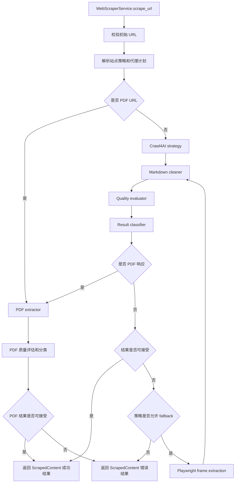
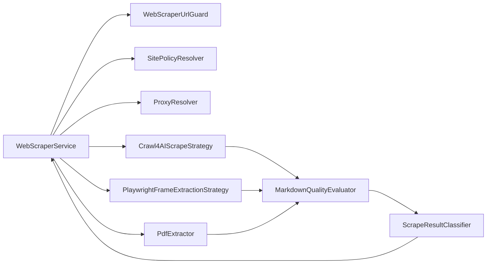

# 网页抓取服务

## 适用范围

网页抓取服务用于知识库 URL 文档创建、网页文档刷新，以及后端内部需要把网页内容转换为 Markdown 的流程。

对外调用方应继续通过 `WebScraperService.scrape_url()` 使用服务，并依赖 `ScrapedContent` 返回结构。服务内部的抓取策略、PDF 解析和 Playwright fallback 可以调整，但不应破坏以下 public contract：

- `ScrapedContent`
- `WebScraperService.scrape_url(url: str)`
- `get_web_scraper_service()`

## 抓取流程

服务按内容类型和质量结果选择抓取路径：

1. 先校验初始 URL，拒绝非 HTTP(S)、本地地址、私有网段和不安全重定向。
2. PDF URL 使用 PDF extractor 下载并提取文本，同时校验最终响应 URL。
3. 普通网页优先使用 Crawl4AI strategy 抓取并转换为 Markdown。
4. 当主抓取结果为空或质量过低，且策略允许 fallback 时，才启用 Playwright frame extraction。主抓取虽失败但服务器仍返回 2xx（页面可达，仅主策略无法提取内容，例如内容位于嵌套 iframe）时，同样按空内容处理并允许 fallback。
5. fallback 结果仍会经过 Markdown cleaner、classifier 和 quality evaluator。



Playwright fallback 优先提取 frame 的 `innerHTML` 并转换为 Markdown。只有结构化 HTML 不可用时，才退化使用 `innerText`。多 frame 内容会保留 frame 标题和来源 URL，便于知识库索引和排查。

## 模块关系

`WebScraperService` 是唯一对外入口，内部负责解析策略、选择抓取路径，并把各策略结果统一转换成 `ScrapedContent`。



## Markdown 输出要求

网页内容会尽量输出适合知识库索引和阅读的结构化 Markdown：

- 保留标题、段落、列表、链接和基础表格。
- 清理导航、页脚、按钮、表单、登录页、验证码、Access Denied、Too Many Requests 和重复文本。
- cleaner 应保持保守，避免仅凭 class name 或中文关键词删除正文中的操作说明、字段名和产品文档内容。
- 当只能获得纯文本时，结果会标记为 degraded，而不是伪装成结构化 Markdown。

## 代理配置

代理由 `WEBSCRAPER_PROXY` 和 `WEBSCRAPER_PROXY_MODE` 控制。

`WEBSCRAPER_PROXY` 是代理 URL，支持 HTTP、HTTPS 和 SOCKS5。例如：

```env
WEBSCRAPER_PROXY=http://proxy.example.com:8080
WEBSCRAPER_PROXY_MODE=fallback
```

`WEBSCRAPER_PROXY_MODE` 支持：

| 模式 | 行为 |
| --- | --- |
| `none` | 永不使用代理 |
| `fallback` | 先直连，直连因网络错误、超时、403、429 或 5xx 失败后再使用代理 |
| `proxy` | 所有请求直接使用代理，必须配置 `WEBSCRAPER_PROXY` |
| `direct` | 历史别名，语义等同于 `proxy` |

新配置应优先使用 `proxy` 表示强制代理。`direct` 只用于兼容旧环境变量含义，不建议继续新增。

## 站点配置

站点配置通过 `WEB_SCRAPER_SITE_CONFIG` 提供 JSON 对象，key 是域名或 URL pattern，value 是允许的抓取参数。

示例：

```env
WEB_SCRAPER_SITE_CONFIG={"example.com":{"wait_until":"networkidle","page_timeout_ms":30000,"delay_before_return_html":3.0}}
```

站点配置只解析白名单字段。未知字段会记录 warning，并被忽略，不会继续透传到 Crawl4AI 或 Playwright。

当前支持的常用字段包括：

- `wait_until`
- `wait_for`
- `delay_before_return_html`
- `page_timeout_ms`
- `process_iframes`
- `locale`
- `timezone_id`
- `user_agent`
- `user_agent_mode`
- `fallback_enabled`
- `fallback_on_empty`
- `fallback_on_blocked`
- `deep_iframe_extraction`

## fallback 策略

`fallback_enabled` 是总开关。关闭后，即使内容为空、质量低或启用了 deep iframe extraction，也不会启用 Playwright fallback。

在 `fallback_enabled=true` 时：

- `fallback_on_empty=true` 时，空内容可以触发 fallback。
- `deep_iframe_extraction=true` 时，空内容或低质量内容可以触发 fallback。
- 主抓取失败但 HTTP 状态码为 2xx 时，按页面可达、仅主策略未提取到内容处理（归类为空内容），按 `fallback_on_empty` 触发 fallback。这样可以覆盖内容位于嵌套 iframe、或主策略误判为反爬的 SPA shell 等情况。
- 真正的传输失败（没有 HTTP 响应，如连接被拒绝、DNS 失败）归类为网络失败，不会触发 fallback，因为重新渲染也无法改善。
- 被认证、限流、SSRF 等明确不可通过渲染改善的状态不会因为 deep iframe extraction 自动 fallback。
- blocked 页面是否 fallback 由 `fallback_on_blocked` 控制。

## 安全边界

所有抓取路径都必须遵守 SSRF 防护：

- 初始 URL 和最终响应 URL 都要校验。
- PDF 下载不能只校验请求前 URL，必须校验 redirect 后的 `response.url`。
- Playwright fallback 必须启用 request interception，拒绝不安全 scheme、本地地址和私有网段请求。
- WebSocket URL 也必须经过同一类 SSRF 校验。
- Browser、context 和 page 资源必须在异常路径释放。

新增抓取策略或 extractor 时，应先补充 focused tests，再接入编排器。
