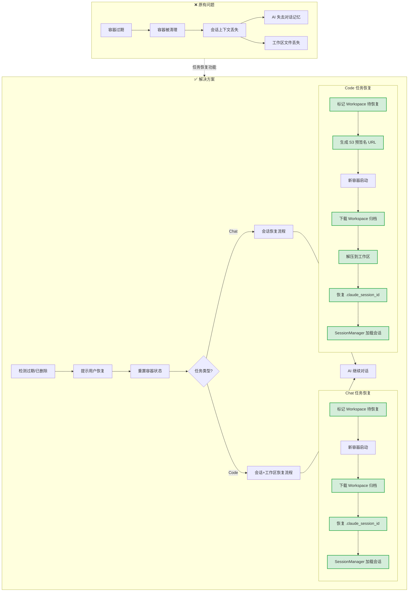
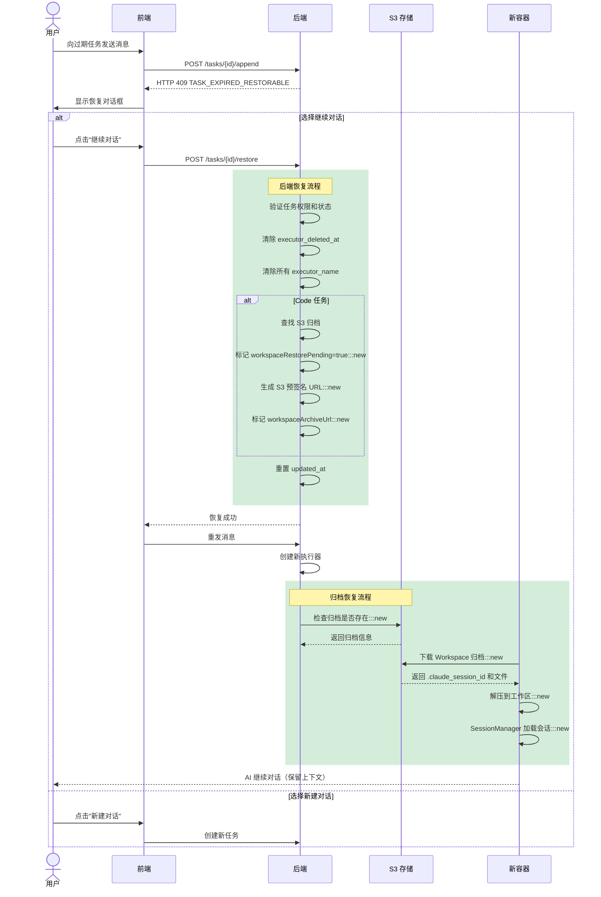
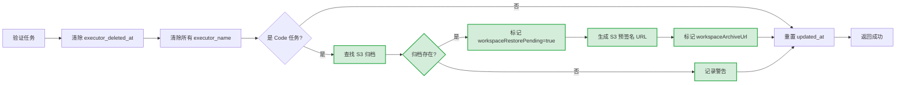
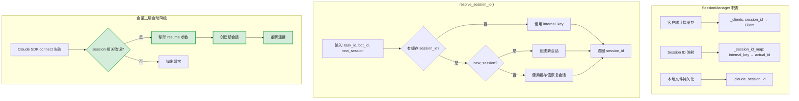
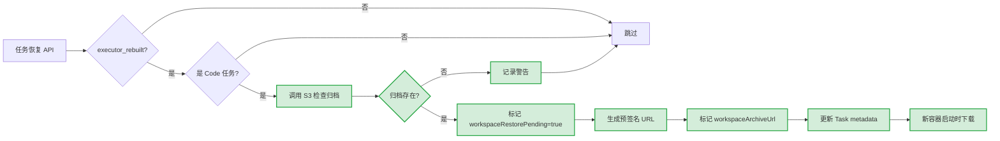
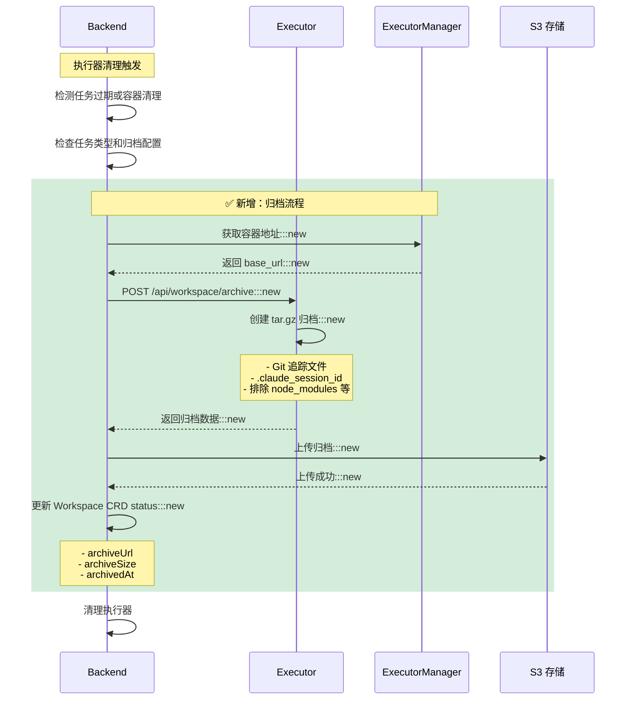
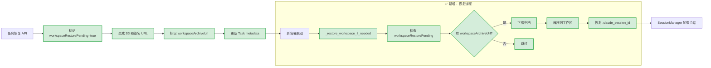
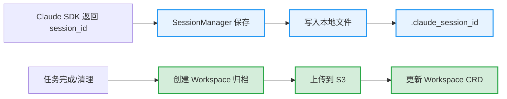
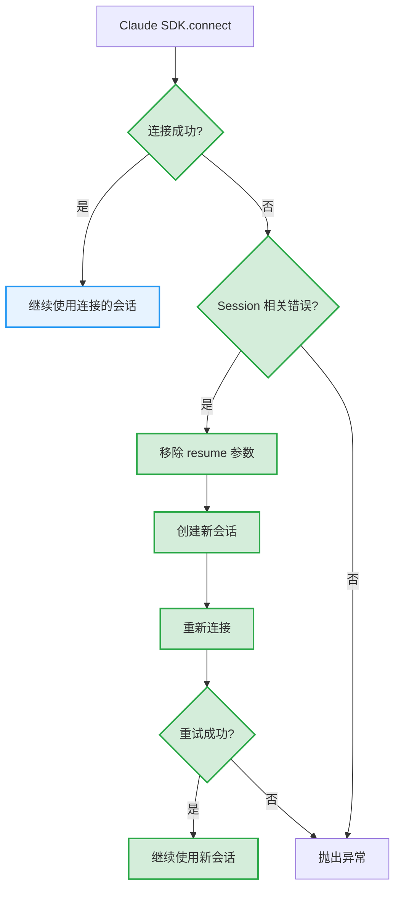

# 任务恢复功能

## 概述

任务恢复功能允许用户在任务过期或执行器容器被清理后继续对话，同时保留完整的会话上下文。

本次实现包含两个核心功能：
1. **Task Restoration（任务恢复）** - 允许过期任务继续对话
2. **Workspace Archive（工作区归档）** - 为 Code 任务提供文件备份和恢复

## 问题背景

在 Wegent 中，任务使用 Docker 容器（执行器）来处理 AI 对话。这些容器有生命周期限制：

| 任务类型 | 过期时间 | 场景 |
|---------|---------|------|
| Chat | 2 小时 | 日常对话 |
| Code | 24 小时 | 代码开发 |

当容器过期被清理后，用户尝试继续对话会遇到两个问题：

1. **容器不存在** - 原执行器容器已被删除
2. **会话上下文丢失** - Claude SDK 的 session ID 和工作区文件随容器一起丢失

## 解决方案概览



> 💡 **图例**：绿色节点为新增功能实现

## 用户操作流程



> 💡 **图例**：绿色标注为新增的 Workspace 归档相关操作

## 核心机制

### 1. 过期检测

后端在处理消息追加请求时，检查以下条件：

| 检查项 | 条件 | 结果 |
|-------|------|------|
| executor_deleted_at | 最后一个 ASSISTANT subtask 标记为 true | 返回 409 |
| 过期时间 | 超过配置的过期小时数 | 返回 409 |

**错误响应格式**：

```json
{
  "code": "TASK_EXPIRED_RESTORABLE",
  "task_id": 123,
  "task_type": "chat",
  "expire_hours": 2,
  "last_updated_at": "2024-01-01T12:00:00Z",
  "message": "chat task has expired but can be restored",
  "reason": "expired"
}
```

**容器不存在检测** (`executor_kinds.py`):
```python
# 当收到 "container not found" 错误时，标记 executor_deleted_at
if (
    subtask_update.status == SubtaskStatus.FAILED
    and subtask_update.error_message
):
    error_msg = subtask_update.error_message.lower()
    if "container" in error_msg and "not found" in error_msg:
        logger.info(
            f"Container not found error detected, "
            f"marking executor_deleted_at=True"
        )
        subtask.executor_deleted_at = True  # ✅ 新增
```

### 2. 任务恢复 API

**端点**: `POST /api/v1/tasks/{task_id}/restore`

**请求/响应类型**：

```typescript
// 请求
interface RestoreTaskRequest {
  message?: string  // 恢复后发送的消息（可选）
}

// 响应
interface RestoreTaskResponse {
  success: boolean
  task_id: number
  task_type: string
  executor_rebuilt: boolean
  workspace_restore_pending: boolean  // ✅ 新增：Workspace 待恢复标记
  message: string
}
```

恢复操作执行以下步骤：



| 步骤 | 说明 |
|------|------|
| 验证任务 | 检查任务存在、用户权限、任务状态可恢复 |
| 清除 executor_deleted_at | 允许任务接收新消息 |
| 清除 executor_name | 清除**所有** ASSISTANT subtask 的 executor_name，强制创建新容器 |
| 查找 S3 归档 | ✅ Code 任务：检查 S3 中是否存在归档 |
| 标记待恢复 | ✅ Code 任务：在元数据中标记 `workspaceRestorePending=true` 和 `workspaceArchiveUrl` |
| 生成预签名 URL | ✅ 生成 S3 预签名 URL 供 Executor 下载 |

**可恢复的任务状态**：`COMPLETED`、`FAILED`、`CANCELLED`、`PENDING_CONFIRMATION`

### 3. Session Manager 模块

Executor 端使用 `SessionManager` 统一管理会话：



> 💡 **图例**：绿色节点为新增的会话过期处理逻辑

**Session ID 解析优先级**：

| 优先级 | 来源 | 说明 |
|-------|------|------|
| 1 | 本地文件 `.claude_session_id` | 从 Workspace 归档恢复，用于跨容器恢复 |
| 2 | internal_key | 格式为 `task_id:bot_id`，同容器内标识 |
| 3 | 新建会话 | 无历史记录时创建新会话 |

**会话过期自动降级** (`claude_code_agent.py`):
```python
# ✅ 新增：Session 过期自动降级处理
try:
    await self.client.connect()
except Exception as e:
    error_msg = str(e).lower()
    # 检测 session 相关错误
    session_error_keywords = ["session", "expired", "invalid", "resume"]
    if any(keyword in error_msg for keyword in session_error_keywords):
        logger.warning(
            f"Session error detected, creating new session. "
            f"Original error: {e}"
        )
        # 移除 resume 参数，创建新会话
        self.options.pop("resume", None)
        if self.options:
            code_options = ClaudeAgentOptions(**self.options)
            self.client = ClaudeSDKClient(options=code_options)
        else:
            self.client = ClaudeSDKClient()
        await self.client.connect()
    else:
        raise
```

### 4. Workspace 归档恢复

对于 Code 任务，恢复时需要同时恢复工作区文件：



**实现位置**：`backend/app/services/adapters/workspace_archive.py` 中的 `mark_for_restore()` 方法

## 数据流详解

### Workspace 归档流程（清理前）



**归档内容**：
- Git 追踪的代码文件（`git ls-files`）
- `.claude_session_id` 会话 ID 文件

**排除的目录**：
- `node_modules`, `__pycache__`, `.venv`, `venv`
- `.env`, `.git`, `dist`, `build`, `.next`, `.nuxt`
- `target`, `vendor`, `.cache`, `.npm`, `.yarn`

### Workspace 恢复流程（任务恢复时）



**实现位置**：
- Backend: `backend/app/services/adapters/workspace_archive.py::mark_for_restore()`
- Executor: `executor/agents/base.py::_restore_workspace_if_needed()`
- Executor: `executor/services/workspace_service.py::restore_workspace_from_archive()`

### 任务完成时（Session ID 保存）



> 💡 **图例**：蓝色为原有逻辑，绿色为新增的归档逻辑

**代码示例**（SessionManager）：

```python
# 保存 session ID 到本地文件
SessionManager.save_session_id(self.task_id, session_id)

# 从本地文件加载 session ID
saved_session_id = SessionManager.load_saved_session_id(self.task_id)
if saved_session_id:
    self.options["resume"] = saved_session_id
```

## Session 过期处理

当尝试恢复会话失败时，系统自动降级处理：



**可重试错误类型**：包含 `session`, `expired`, `invalid`, `resume` 等关键词

## 配置

| 环境变量 | 说明 | 默认值 |
|---------|------|-------|
| `APPEND_CHAT_TASK_EXPIRE_HOURS` | Chat 任务过期小时数 | 2 |
| `APPEND_CODE_TASK_EXPIRE_HOURS` | Code 任务过期小时数 | 24 |

### Workspace Archive 配置 ✅ 新增

| 环境变量 | 说明 | 默认值 |
|---------|------|-------|
| `WORKSPACE_ARCHIVE_ENABLED` | 启用/禁用工作区归档功能 | `False` |
| `WORKSPACE_ARCHIVE_MAX_SIZE_MB` | 归档最大大小（MB），超过则跳过 | `500` |
| `WORKSPACE_ARCHIVE_S3_ENDPOINT` | S3 兼容存储端点 | 空 |
| `WORKSPACE_ARCHIVE_S3_BUCKET` | S3 存储桶名称 | `workspace-archives` |
| `WORKSPACE_ARCHIVE_S3_ACCESS_KEY` | S3 访问密钥 | 空 |
| `WORKSPACE_ARCHIVE_S3_SECRET_KEY` | S3 访问密钥 | 空 |
| `WORKSPACE_ARCHIVE_S3_REGION` | S3 区域 | `us-east-1` |
| `WORKSPACE_ARCHIVE_S3_USE_SSL` | 是否使用 SSL | `True` |

## 相关文件

### 后端

| 文件 | 职责 | 状态 |
|------|------|------|
| `backend/app/api/endpoints/adapter/task_restore.py` | 恢复 API 端点 | ✅ 新增 |
| `backend/app/services/adapters/task_restore.py` | 恢复服务逻辑、验证、状态重置 | ✅ 新增 |
| `backend/app/services/adapters/workspace_archive.py` | Workspace 归档和恢复服务 | ✅ 新增 |
| `backend/app/services/adapters/executor_kinds.py` | 执行器调度、过期检测、executor_name 继承 | 🔧 修改 |
| `backend/app/services/adapters/task_kinds/operations.py` | 消息追加前过期检测 | 🔧 修改 |
| `backend/app/services/adapters/executor_job.py` | 执行器清理前归档调用 | 🔧 修改 |

### Executor

| 文件 | 职责 | 状态 |
|------|------|------|
| `executor/services/workspace_service.py` | Workspace 归档创建、S3 下载、解压 | ✅ 新增 |
| `executor/app.py` | POST /api/workspace/archive 端点 | 🔧 修改 |
| `executor/agents/base.py` | `_restore_workspace_if_needed()` 方法 | 🔧 修改 |
| `executor/agents/claude_code/claude_code_agent.py` | Session 过期自动降级 | 🔧 修改 |

### 前端

| 文件 | 职责 | 状态 |
|------|------|------|
| `frontend/src/features/tasks/components/chat/TaskRestoreDialog.tsx` | 恢复对话框 UI | ✅ 新增 |
| `frontend/src/features/tasks/components/chat/useChatStreamHandlers.tsx` | 恢复流程处理 | 🔧 修改 |
| `frontend/src/utils/errorParser.ts` | 解析 TASK_EXPIRED_RESTORABLE 错误 | 🔧 修改 |
| `frontend/src/apis/tasks.ts` | restoreTask API 客户端 | 🔧 修改 |
| `frontend/src/i18n/locales/en/chat.json` | 英文翻译 | 🔧 修改 |
| `frontend/src/i18n/locales/zh-CN/chat.json` | 中文翻译 | 🔧 修改 |

### Shared

| 文件 | 职责 | 状态 |
|------|------|------|
| `shared/utils/s3_client.py` | S3 兼容存储客户端 | ✅ 新增 |
| `shared/models/db/subtask.py` | Subtask 模型 | 🗑️ 删除 claude_session_id 列 |

### Executor Manager

| 文件 | 职责 | 状态 |
|------|------|------|
| `executor_manager/routers/routers.py` | POST /executor/address 端点 | 🔧 修改 |

## 测试

### 单元测试

| 测试文件 | 覆盖内容 |
|---------|----------|
| `shared/tests/utils/test_s3_client.py` | S3 客户端上传、下载、删除操作 |
| `executor/tests/services/test_workspace_service.py` | Workspace 归档创建、Git 文件获取、排除逻辑 |

### 集成测试场景

1. **任务完整生命周期**
   - 创建任务 → 发送消息 → 过期 → 恢复 → 继续对话

2. **Workspace 归档恢复**
   - Code 任务 → 归档 → 清理 → 恢复 → 验证文件

3. **Session ID 恢复**
   - Chat 任务 → 保存 session → 过期 → 恢复 → 验证上下文

4. **Session 过期降级**
   - 恢复会话失败 → 自动创建新会话 → 继续对话
