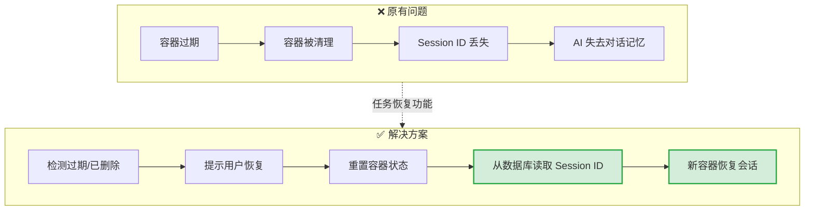
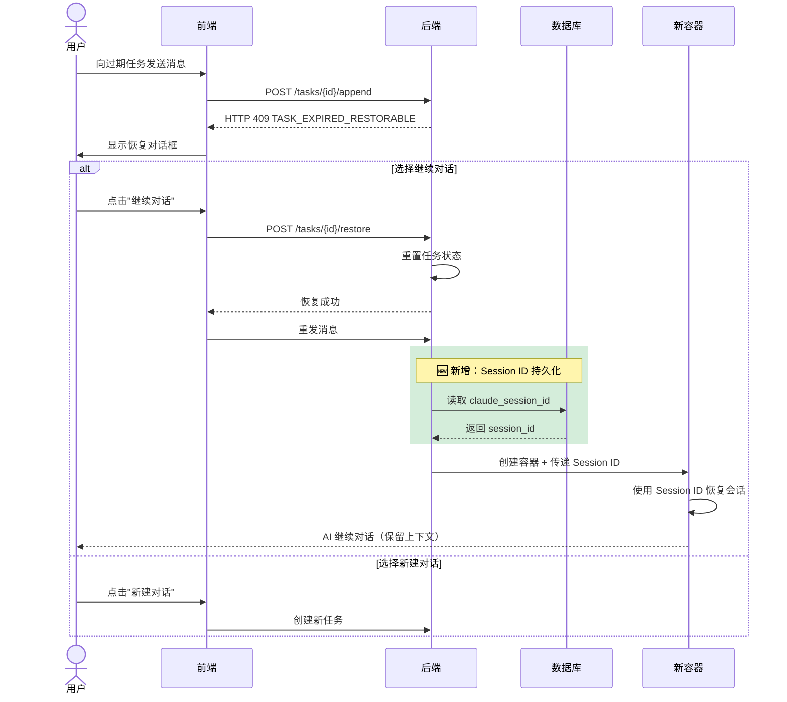
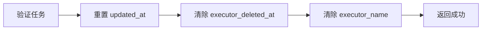
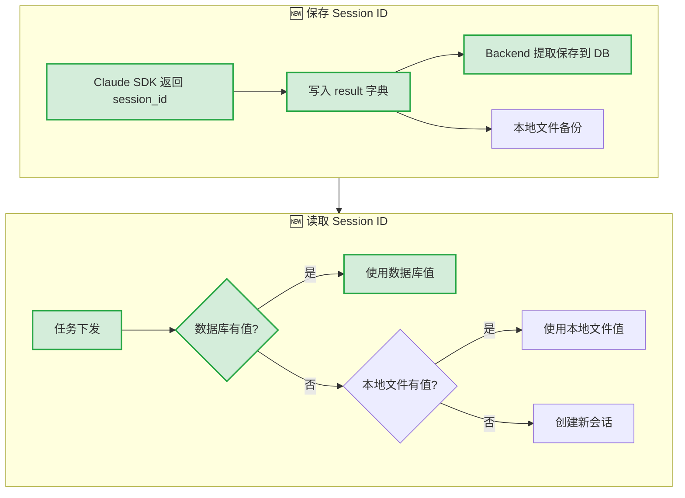
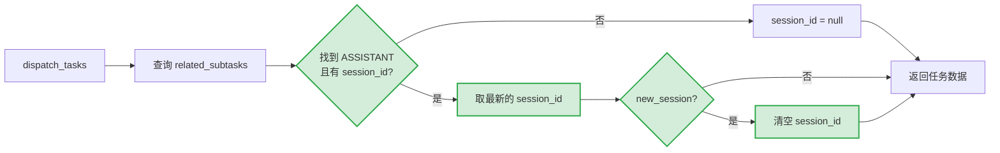
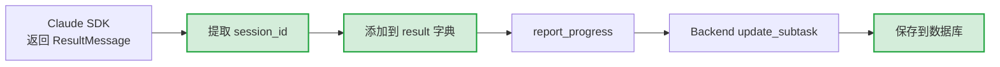
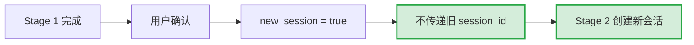
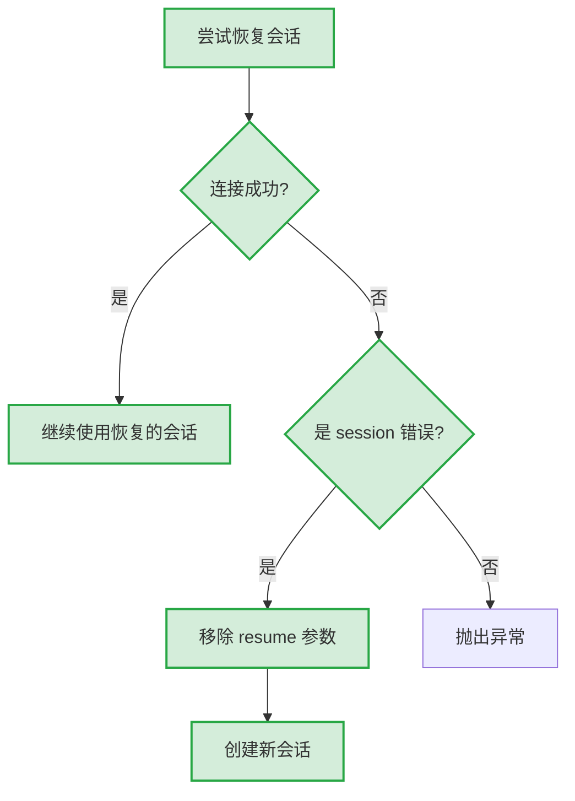

# 任务恢复功能

## 概述

任务恢复功能允许用户在任务过期或执行器容器被清理后继续对话，同时保留完整的会话上下文。

## 问题背景

在 Wegent 中，任务使用 Docker 容器（执行器）来处理 AI 对话。这些容器有生命周期限制：

| 任务类型 | 过期时间 | 场景 |
|---------|---------|------|
| Chat | 2 小时 | 日常对话 |
| Code | 24 小时 | 代码开发 |

当容器过期被清理后，用户尝试继续对话会遇到两个问题：

1. **容器不存在** - 原执行器容器已被删除
2. **会话上下文丢失** - Claude SDK 的 session ID 保存在容器内，随容器一起丢失

## 解决方案概览

> 💡 **图例**：绿色节点为新增功能（Session ID 持久化）

## 用户操作流程

## 核心机制

### 1. 过期检测

后端在处理消息追加请求时，检查以下条件：

| 检查项 | 条件 | 结果 |
|-------|------|------|
| executor_deleted_at | 最后一个 ASSISTANT subtask 标记为 true | 返回 409 |
| 过期时间 | 超过配置的过期小时数 | 返回 409 |

### 2. 任务恢复 API

**端点**: `POST /api/v1/tasks/{task_id}/restore`

恢复操作执行以下步骤：

| 步骤 | 说明 |
|------|------|
| 清除 executor_deleted_at | 允许任务接收新消息 |
| 清除 executor_name | 强制创建新容器（不复用旧容器名） |

### 3. Claude Session ID 持久化 🆕

> ⚠️ **新增功能**：本节描述的是新增的 Session ID 持久化机制

为了让新容器能恢复之前的会话上下文，Session ID 被持久化到数据库：

> 💡 **图例**：绿色节点为新增逻辑，白色节点为原有逻辑（本地文件备份）

**存储策略**：

| 存储位置 | 用途 | 优先级 | 状态 |
|---------|------|-------|------|
| 数据库 `subtasks.claude_session_id` | 主存储，支持跨容器恢复 | 高 | 🆕 新增 |
| 本地文件 `.claude_session_id` | 备份，同容器内快速读取 | 低 | 已有 |

## 数据流详解

### 任务下发时（Backend → Executor）

> 💡 **图例**：绿色节点为新增的 Session ID 查找和处理逻辑

### 任务完成时（Executor → Backend）

> 💡 **图例**：绿色节点为新增的 Session ID 传递和保存逻辑

## Pipeline 模式处理 🆕

> ⚠️ **新增功能**：Pipeline 模式下的 Session ID 隔离处理

在 Pipeline 模式下，当用户确认进入下一阶段时：

**原因**：每个 Pipeline 阶段可能使用不同的 Bot，需要独立的会话上下文。

## Session 过期处理 🆕

> ⚠️ **新增功能**：Session 过期时的自动降级处理

当 Claude SDK 返回 session 相关错误时，自动降级：

**检测关键词**：`session`, `expired`, `invalid`, `resume`

## 配置

| 环境变量 | 说明 | 默认值 |
|---------|------|-------|
| `APPEND_CHAT_TASK_EXPIRE_HOURS` | Chat 任务过期小时数 | 2 |
| `APPEND_CODE_TASK_EXPIRE_HOURS` | Code 任务过期小时数 | 24 |

## 相关文件

### 后端

| 文件 | 职责 | 状态 |
|------|------|------|
| `backend/app/api/endpoints/adapter/task_restore.py` | 恢复 API 端点 | 已有 |
| `backend/app/services/adapters/task_restore.py` | 恢复服务逻辑 | 已有 |
| `backend/app/services/adapters/executor_kinds.py` | Session ID 读取/保存，executor_deleted_at 标记 | 🆕 修改 |
| `backend/app/services/adapters/task_kinds/operations.py` | 追加前过期检查 | 已有 |
| `backend/alembic/versions/x4y5z6a7b8c9_*.py` | 数据库迁移（添加 claude_session_id） | 🆕 新增 |

### Executor

| 文件 | 职责 | 状态 |
|------|------|------|
| `executor/agents/claude_code/claude_code_agent.py` | Session ID 读取，过期处理 | 🆕 修改 |
| `executor/agents/claude_code/response_processor.py` | Session ID 添加到结果 | 🆕 修改 |

### 前端

| 文件 | 职责 | 状态 |
|------|------|------|
| `frontend/src/features/tasks/components/chat/TaskRestoreDialog.tsx` | 恢复对话框 | 已有 |
| `frontend/src/features/tasks/components/chat/useChatStreamHandlers.tsx` | 恢复流程处理 | 已有 |
| `frontend/src/utils/errorParser.ts` | 解析 TASK_EXPIRED_RESTORABLE 错误 | 已有 |

### Shared

| 文件 | 职责 | 状态 |
|------|------|------|
| `shared/models/db/subtask.py` | Subtask 模型（含 claude_session_id 字段） | 🆕 修改 |
