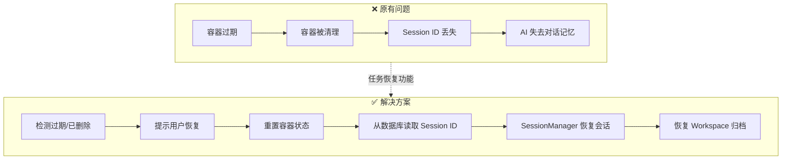
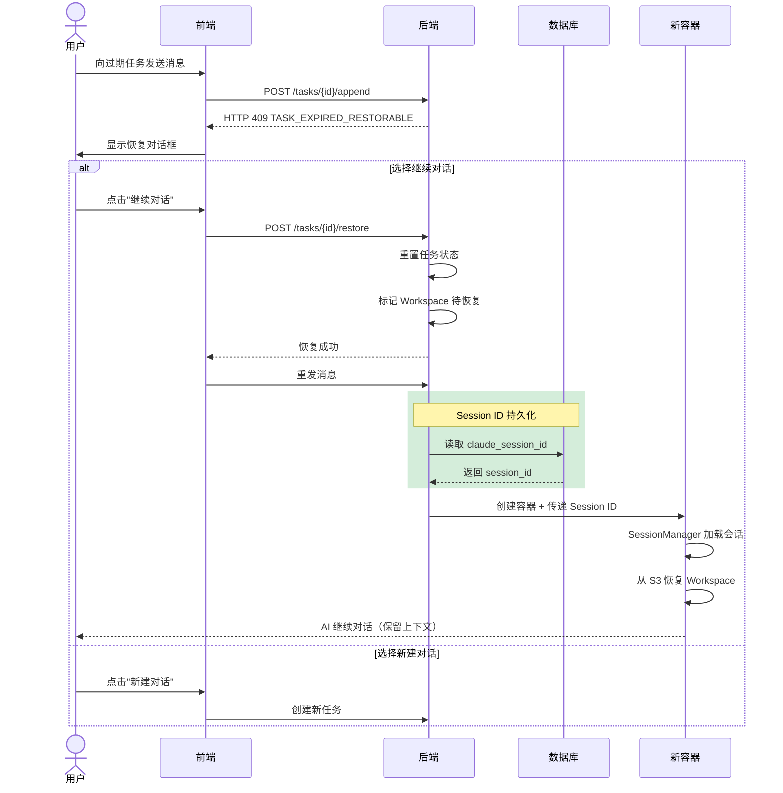
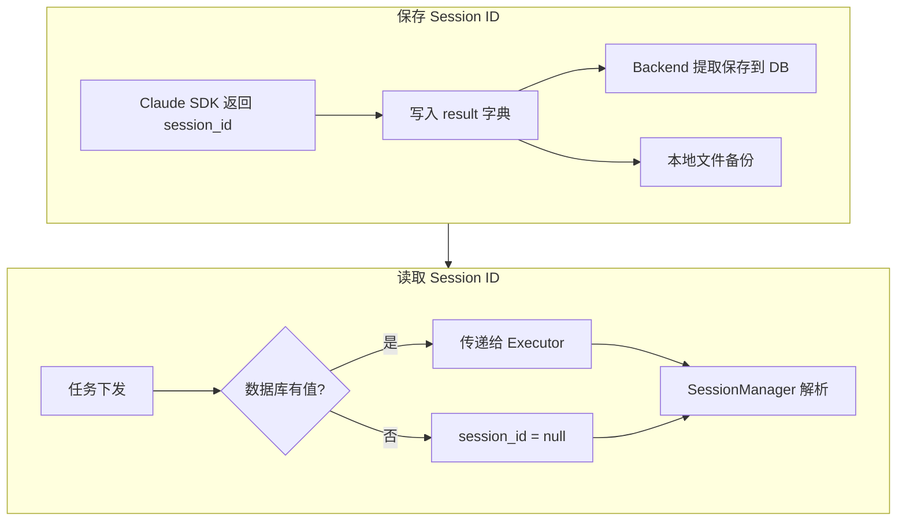
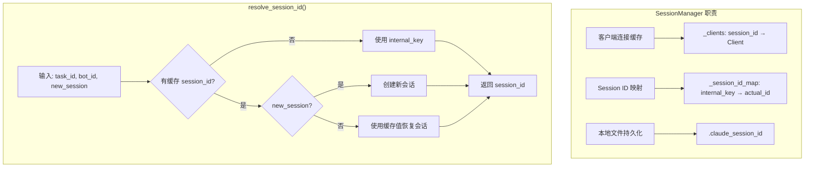
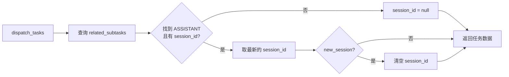
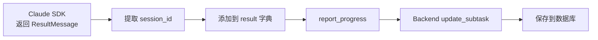
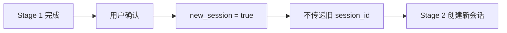

# 任务恢复功能

## 概述

任务恢复功能允许用户在任务过期或执行器容器被清理后继续对话，同时保留完整的会话上下文。

## 问题背景

在 Wegent 中，任务使用 Docker 容器（执行器）来处理 AI 对话。这些容器有生命周期限制：

| 任务类型 | 过期时间 | 场景 |
|---------|---------|------|
| Chat | 2 小时 | 日常对话 |
| Code | 24 小时 | 代码开发 |

当容器过期被清理后，用户尝试继续对话会遇到两个问题：

1. **容器不存在** - 原执行器容器已被删除
2. **会话上下文丢失** - Claude SDK 的 session ID 保存在容器内，随容器一起丢失

## 解决方案概览



## 用户操作流程



## 核心机制

### 1. 过期检测

后端在处理消息追加请求时，检查以下条件：

| 检查项 | 条件 | 结果 |
|-------|------|------|
| executor_deleted_at | 最后一个 ASSISTANT subtask 标记为 true | 返回 409 |
| 过期时间 | 超过配置的过期小时数 | 返回 409 |

**错误响应格式**：

```json
{
  "code": "TASK_EXPIRED_RESTORABLE",
  "task_id": 123,
  "task_type": "chat",
  "expire_hours": 2,
  "last_updated_at": "2024-01-01T12:00:00Z",
  "message": "chat task has expired but can be restored",
  "reason": "expired"
}
```

### 2. 任务恢复 API

**端点**: `POST /api/v1/tasks/{task_id}/restore`

**请求/响应类型**：

```typescript
// 请求
interface RestoreTaskRequest {
  message?: string  // 恢复后发送的消息（可选）
}

// 响应
interface RestoreTaskResponse {
  success: boolean
  task_id: number
  task_type: string
  executor_rebuilt: boolean
  message: string
}
```

恢复操作执行以下步骤：


| 步骤 | 说明 |
|------|------|
| 验证任务 | 检查任务存在、用户权限、任务状态可恢复 |
| 清除 executor_deleted_at | 允许任务接收新消息 |
| 清除 executor_name | 清除**所有** ASSISTANT subtask 的 executor_name，强制创建新容器 |
| 标记 Workspace 待恢复 | Code 任务：在元数据中标记 S3 归档 URL |

**可恢复的任务状态**：`COMPLETED`、`FAILED`、`CANCELLED`、`PENDING_CONFIRMATION`

### 3. Claude Session ID 持久化

为了让新容器能恢复之前的会话上下文，Session ID 被持久化到数据库：



**存储策略**：

| 存储位置 | 用途 | 优先级 |
|---------|------|-------|
| 数据库 `subtasks.claude_session_id` | 主存储，支持跨容器恢复 | 高 |
| 本地文件 `.claude_session_id` | 备份，同容器内快速读取 | 低 |

### 4. Session Manager 模块

Executor 端使用 `SessionManager` 统一管理会话：



**Session ID 解析三级优先级**：

| 优先级 | 来源 | 说明 |
|-------|------|------|
| 1 | 缓存的 session_id | 从数据库传递，用于跨容器恢复 |
| 2 | internal_key | 格式为 `task_id:bot_id`，同容器内标识 |
| 3 | 新建会话 | 无历史记录时创建新会话 |

### 5. Workspace 归档恢复

对于 Code 任务，恢复时需要同时恢复工作区文件：


**实现位置**：`backend/app/services/adapters/workspace_archive.py` 中的 `mark_for_restore()` 方法

## 数据流详解

### 任务下发时（Backend → Executor）



### 任务完成时（Executor → Backend）



**代码示例**（response_processor.py）：

```python
# 将 session_id 添加到结果中
if session_id:
    result_dict["claude_session_id"] = session_id
```

## Pipeline 模式处理

在 Pipeline 模式下，当用户确认进入下一阶段时：



**原因**：每个 Pipeline 阶段可能使用不同的 Bot，需要独立的会话上下文。

**实现代码**：

```python
# Pipeline 新阶段不继承旧 session_id
if new_session:
    latest_claude_session_id = None
```

## Session 过期处理

当尝试恢复会话失败时，系统自动降级处理：


**可重试错误类型**：通过 `is_retryable_error_subtype()` 函数判断

**重试限制**：`MAX_ERROR_SUBTYPE_RETRIES` 次

## 配置

| 环境变量 | 说明 | 默认值 |
|---------|------|-------|
| `APPEND_CHAT_TASK_EXPIRE_HOURS` | Chat 任务过期小时数 | 2 |
| `APPEND_CODE_TASK_EXPIRE_HOURS` | Code 任务过期小时数 | 24 |

## 相关文件

### 后端

| 文件 | 职责 |
|------|------|
| `backend/app/api/endpoints/adapter/task_restore.py` | 恢复 API 端点 |
| `backend/app/services/adapters/task_restore.py` | 恢复服务逻辑、验证、状态重置 |
| `backend/app/services/adapters/executor_kinds.py` | Session ID 读取/保存 |
| `backend/app/services/adapters/task_kinds/operations.py` | 追加前过期检查 |
| `backend/app/services/adapters/workspace_archive.py` | Workspace 归档恢复标记 |
| `backend/alembic/versions/x4y5z6a7b8c9_*.py` | 数据库迁移（添加 claude_session_id） |

### Executor

| 文件 | 职责 |
|------|------|
| `executor/agents/claude_code/session_manager.py` | Session 管理、缓存、持久化 |
| `executor/agents/claude_code/claude_code_agent.py` | Session ID 初始化、resolve_session_id 调用 |
| `executor/agents/claude_code/response_processor.py` | Session ID 添加到结果、重试逻辑 |

### 前端

| 文件 | 职责 |
|------|------|
| `frontend/src/features/tasks/components/chat/TaskRestoreDialog.tsx` | 恢复对话框 UI |
| `frontend/src/features/tasks/components/chat/useChatStreamHandlers.tsx` | 恢复流程处理 |
| `frontend/src/utils/errorParser.ts` | 解析 TASK_EXPIRED_RESTORABLE 错误 |
| `frontend/src/apis/tasks.ts` | restoreTask API 客户端 |

### Shared

| 文件 | 职责 |
|------|------|
| `shared/models/db/subtask.py` | Subtask 模型（含 claude_session_id 字段） |
