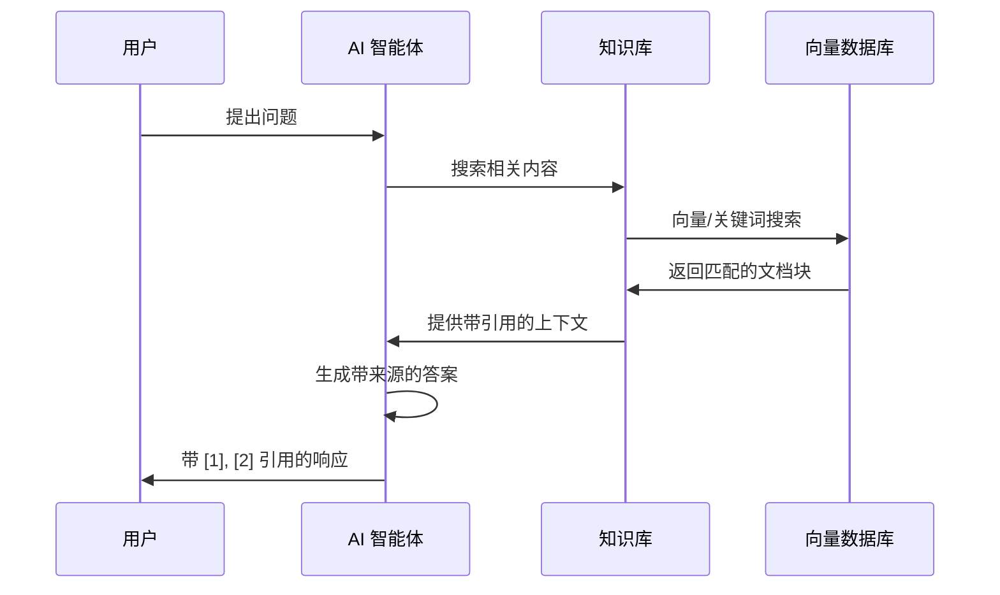
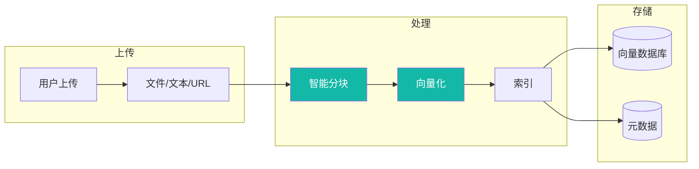
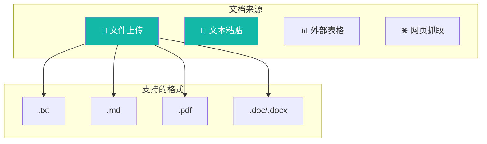
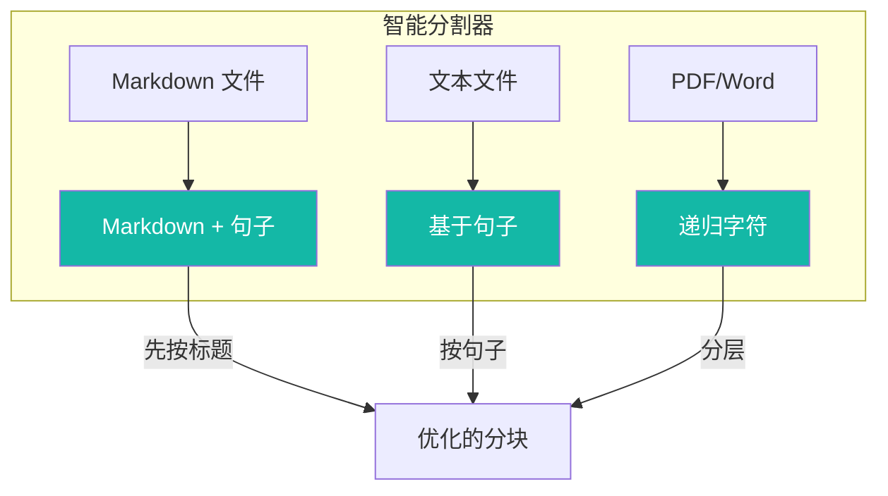
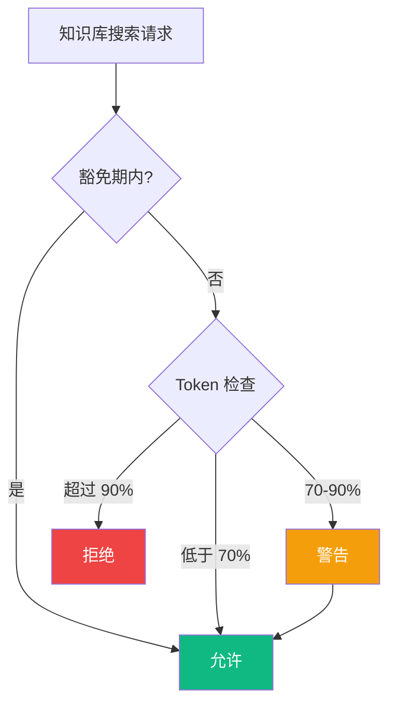

# 📚 知识库使用指南

知识库支持存储、组织和检索文档，实现 RAG（检索增强生成），让 AI 智能体能够基于您的特定文档回答问题，而非仅依赖通用知识。

---

## 📋 目录

- [概述](#-概述)
- [架构说明](#-架构说明)
- [创建知识库](#-创建知识库)
- [文档管理](#-文档管理)
- [智能分块](#-智能分块)
- [与智能体集成](#-与智能体集成)
- [引用机制](#-引用机制)
- [摘要功能](#-摘要功能)
- [使用限制](#-使用限制)
- [常见问题](#-常见问题)
- [相关资源](#-相关资源)

---

## 🎯 概述

### 什么是知识库？

知识库是一个文档存储和检索系统，支持 RAG（检索增强生成）。它允许 AI 智能体搜索您的文档，并提供基于您特定内容的答案。

### 核心价值

| 价值 | 描述 |
|------|------|
| **有据可依的回答** | AI 基于您的文档回答，而非仅靠通用知识 |
| **来源引用** | 每个答案都包含对源文档的引用 |
| **智能分块** | 针对检索优化的自动文档分割 |
| **灵活检索** | 向量、关键词或混合搜索模式 |

### 知识库类型

| 类型 | 描述 | 文档限制 | 适用场景 |
|------|------|----------|----------|
| **笔记本** | 三栏布局，支持对话 + 文档管理 | 50 个文档 | 交互式研究、问答会话 |
| **经典** | 仅文档列表视图 | 无限制 | 大型文档集合、档案 |

---

## 🏗 架构说明

### RAG 流程

下图展示了 RAG（检索增强生成）的工作原理：



### 文档处理流程



### 关键组件

| 组件 | 用途 |
|------|------|
| **知识库** | 包含文档和检索配置的容器 |
| **文档** | 单个文件或内容项 |
| **文档块** | 为检索优化的文档片段 |
| **检索器** | 搜索后端服务（Elasticsearch/Qdrant） |
| **嵌入模型** | 将文本转换为向量用于相似度搜索 |

---

## 🆕 创建知识库

### 步骤 1：导航到知识库

1. 登录 Wegent
2. 在侧边栏导航到 **知识库** 部分
3. 点击 **创建知识库**

### 步骤 2：配置基本设置

| 字段 | 描述 | 示例 |
|------|------|------|
| **名称** | 显示名称（1-100 字符） | "产品文档" |
| **描述** | 可选描述（最多 500 字符） | "内部产品文档和指南" |
| **类型** | 笔记本或经典 | 笔记本 |

### 步骤 3：配置检索设置

#### 检索器选择

选择已配置的检索器（后端搜索服务）：

| 检索器类型 | 描述 |
|------------|------|
| **Elasticsearch** | 支持向量的全文搜索 |
| **Qdrant** | 专用向量数据库 |

#### 嵌入模型

选择用于向量转换的嵌入模型：

| 模型 | 维度 | 适用场景 |
|------|------|----------|
| `text-embedding-3-small` | 1536 | 通用场景，性价比高 |
| `text-embedding-3-large` | 3072 | 更高准确度 |

#### 检索模式

| 模式 | 描述 | 适用场景 |
|------|------|----------|
| **向量** | 语义相似度搜索 | 自然语言查询 |
| **关键词** | 传统 BM25 文本搜索 | 精确词条匹配 |
| **混合** | 向量 + 关键词组合 | 综合最佳效果 |

#### 检索参数

| 参数 | 范围 | 默认值 | 描述 |
|------|------|--------|------|
| **top_k** | 1-10 | 5 | 返回结果数量 |
| **score_threshold** | 0.0-1.0 | 0.7 | 最低相关度分数 |
| **vector_weight** | 0.0-1.0 | 0.7 | 向量搜索权重（仅混合模式） |
| **keyword_weight** | 0.0-1.0 | 0.3 | 关键词搜索权重（仅混合模式） |

### 配置示例

```yaml
apiVersion: agent.wecode.io/v1
kind: KnowledgeBase
metadata:
  name: product-docs
  namespace: default
spec:
  name: 产品文档
  description: 内部产品文档和用户指南
  kbType: notebook
  retrievalConfig:
    retriever_name: elasticsearch-retriever
    retriever_namespace: default
    embedding_config:
      model_name: text-embedding-model
      namespace: default
    retrieval_mode: hybrid
    top_k: 5
    score_threshold: 0.7
    hybrid_weights:
      vector_weight: 0.7
      keyword_weight: 0.3
  summaryEnabled: true
  summaryModelRef:
    name: gpt-4-model
    namespace: default
  maxCallsPerConversation: 10
```

---

## 📄 文档管理

### 支持的文档来源



### 添加文档

#### 文件上传

1. 点击 **添加文档** → **上传文件**
2. 从电脑选择文件
3. 配置分块设置（可选）
4. 点击 **上传**

支持的格式：
- `.txt` - 纯文本文件
- `.md` - Markdown 文件
- `.pdf` - PDF 文档
- `.doc`, `.docx` - Word 文档

#### 文本粘贴

1. 点击 **添加文档** → **粘贴文本**
2. 输入文档标题
3. 粘贴或输入内容
4. 点击 **保存**

#### 外部表格

1. 点击 **添加文档** → **外部表格**
2. 输入表格 URL（钉钉/飞书）
3. 配置同步设置
4. 点击 **导入**

#### 网页抓取

1. 点击 **添加文档** → **网页 URL**
2. 输入网页地址
3. 系统抓取并处理内容
4. 点击 **导入**

### 文档状态

| 状态 | 描述 |
|------|------|
| **已启用** | 文档已索引且可搜索 |
| **已禁用** | 文档存在但不参与搜索 |
| **处理中** | 文档正在索引 |
| **错误** | 索引失败 |

### 管理文档

| 操作 | 描述 |
|------|------|
| **启用/禁用** | 切换文档是否参与搜索 |
| **重新索引** | 使用新设置重新处理文档 |
| **删除** | 永久移除文档 |
| **查看分块** | 检查文档如何被分割 |

---

## 🔪 智能分块

### 什么是智能分块？

智能分块自动将文档分割成适合检索的最佳片段。不同文件类型使用不同策略以保留上下文和含义。

### 分块策略



| 文件类型 | 策略 | 描述 |
|----------|------|------|
| `.md` | Markdown + 句子 | 先按标题分割，再按句子分割 |
| `.txt` | 基于句子 | 按句子边界分割 |
| `.pdf`, `.doc`, `.docx` | 递归字符 | 分层字符分割 |

### 分块参数

| 参数 | 范围 | 默认值 | 描述 |
|------|------|--------|------|
| **chunk_size** | 128-8192 | 1024 | 每个分块最大字符数 |
| **chunk_overlap** | 0-2048 | 50 | 分块之间的重叠字符数 |

### 选择分块大小

| 内容类型 | 推荐大小 | 原因 |
|----------|----------|------|
| 技术文档 | 512-1024 | 精确检索 |
| 长文章 | 1024-2048 | 保留上下文 |
| 问答内容 | 256-512 | 聚焦答案 |
| 法律/合同 | 512-1024 | 精确条款 |

### 查看分块

1. 在知识库中打开文档
2. 点击 **查看分块** 标签
3. 浏览分块信息：
   - 索引编号
   - 内容预览
   - Token 数量
   - 在原文档中的位置

---

## 🤖 与智能体集成

### 在对话中选择知识库

与智能体对话时：

1. 点击聊天输入框附近的 **上下文选择器**
2. 从选项中选择 **知识库**
3. 选择您想使用的知识库
4. 发送您的问题

智能体会搜索知识库并提供有据可依的答案。

### 知识库提示模式

#### 严格模式

当您明确选择知识库时：

- AI **必须** 仅基于知识库内容回答
- 不能使用通用知识
- 如果找不到信息会明确说明

```
用户：我们的退款政策是什么？
AI：根据您的文档 [1]，退款政策规定...
```

#### 宽松模式

当知识库从任务上下文继承时：

- AI 将知识库作为 **可选资源**
- 如果知识库为空可以回退到通用知识
- 会明确说明知识来源

```
用户：我们的退款政策是什么？
AI：我在您的知识库中找到了相关信息 [1]。
    此外，根据通用最佳实践...
```

### 配置智能体集成

在您的 Ghost 或 Bot 配置中引用知识库：

```yaml
# 带知识库工具的 Ghost
apiVersion: agent.wecode.io/v1
kind: Ghost
metadata:
  name: support-agent-ghost
spec:
  systemPrompt: |
    你是一个客户支持智能体。
    在回答问题之前始终搜索知识库。
    使用 [1], [2] 格式引用来源。
```

---

## 📑 引用机制

### 引用格式

AI 响应包含链接到源文档的编号引用：

```
根据您的产品文档 [1]，该功能的工作方式是...
此外，故障排除指南 [2] 建议...

来源：
[1] product-overview.pdf（第 3 节）
[2] troubleshooting-guide.md（分块 15）
```

### 引用信息

每个引用包含：

| 字段 | 描述 |
|------|------|
| **索引** | 引用编号 [1], [2] 等 |
| **文档名称** | 源文档文件名 |
| **分块索引** | 在文档中的位置 |

### 查看源内容

1. 点击响应中的引用编号
2. 查看原始分块内容
3. 查看周围上下文
4. 如需要可导航到完整文档

### 引用流程

```mermaid
flowchart LR
    Q[用户问题] --> S[搜索知识库]
    S --> R[检索分块]
    R --> C[分配引用索引]
    C --> G[生成响应]
    G --> A[带 [1], [2]... 的答案]

    style S fill:#14B8A6,color:#fff
    style C fill:#14B8A6,color:#fff
```

---

## 📝 摘要功能

### 文档摘要

启用后，系统会自动为每个文档生成摘要：

1. 文档上传并索引
2. 摘要模型处理内容
3. 摘要与文档元数据一起存储
4. 可用于快速参考

### 知识库摘要

整个知识库的聚合摘要：

1. 导航到知识库设置
2. 点击 **生成摘要**
3. 查看所有文档的综合摘要

### 配置摘要

```yaml
spec:
  summaryEnabled: true
  summaryModelRef:
    name: gpt-4-model
    namespace: default
```

| 设置 | 描述 |
|------|------|
| **summaryEnabled** | 启用/禁用自动摘要 |
| **summaryModelRef** | 用于摘要的模型 |

---

## 📊 使用限制

### 调用限制

为防止过度 API 使用，知识库实现了调用限制：

| 参数 | 范围 | 默认值 | 描述 |
|------|------|--------|------|
| **maxCallsPerConversation** | 2-50 | 10 | 每对话最大知识库搜索次数 |
| **exemptCallsBeforeCheck** | 0-49 | 2 | 限制生效前的免费调用次数 |

### 限制工作原理



### Token 追踪

- 系统估算约 4 个字符/token（ASCII）
- 约 1-2 个字符/token（中日韩字符）
- **警告阈值**：限制的 70%
- **拒绝阈值**：限制的 90%

---

## ❓ 常见问题

### 上传问题

#### 文件上传失败

**可能原因：**
1. 文件超过大小限制
2. 不支持的文件格式
3. 文件已损坏

**解决方案：**
1. 检查文件大小限制（通常 50MB）
2. 转换为支持的格式
3. 尝试重新导出文档

#### 文档卡在"处理中"

**可能原因：**
1. 嵌入服务不可用
2. 大文档需要时间
3. 后端处理错误

**解决方案：**
1. 检查检索器服务状态
2. 等待大文档处理（可能需要几分钟）
3. 尝试重新上传文档

### 检索问题

#### 没有返回结果

**可能原因：**
1. 查询与文档内容不匹配
2. 分数阈值太高
3. 文档未启用

**解决方案：**
1. 尝试不同的查询措辞
2. 降低 score_threshold（如 0.5）
3. 验证文档状态为"已启用"

#### 结果不相关

**可能原因：**
1. 分块大小太大
2. 检索模式不正确
3. 分数阈值太低

**解决方案：**
1. 减小 chunk_size 以获得更精确的检索
2. 尝试混合模式而非仅向量模式
3. 提高 score_threshold

### 引用问题

#### 引用与内容不匹配

**可能原因：**
1. 文档已更新但未重新索引
2. 索引后分块策略改变

**解决方案：**
1. 重新索引文档
2. 清除缓存后重试

---

## 💡 最佳实践

### 文档组织

| 实践 | 描述 |
|------|------|
| **有意义的名称** | 使用描述性的文档名称 |
| **一致的格式** | 标准化文档格式 |
| **定期更新** | 文档变更时重新索引 |
| **清洁内容** | 移除无关的页眉/页脚 |

### 分块优化

| 内容类型 | 分块大小 | 重叠 |
|----------|----------|------|
| FAQ | 256-512 | 50 |
| 技术文档 | 512-1024 | 100 |
| 长文章 | 1024-2048 | 200 |
| 代码文档 | 512-768 | 50 |

### 检索调优

| 场景 | 模式 | top_k | 阈值 |
|------|------|-------|------|
| 精确答案 | 向量 | 3-5 | 0.8 |
| 广泛搜索 | 混合 | 8-10 | 0.6 |
| 精确匹配 | 关键词 | 5 | 0.7 |

---

## 🔗 相关资源

### 文档
- [核心概念](../../concepts/core-concepts.md) - 了解 Wegent 的架构
- [配置检索器](./configuring-retrievers.md) - 设置向量数据库
- [创建 Ghost](./creating-ghosts.md) - 配置具有知识库访问权限的智能体

### 技术参考
- [YAML 规范](../../reference/yaml-specification.md) - CRD 定义

---

## 💬 获取帮助

需要帮助？

- 📖 查看 [常见问题](../../faq.md)
- 🐛 提交 [GitHub Issue](https://github.com/wecode-ai/wegent/issues)
- 💬 加入社区讨论

---

<p align="center">用您自己的知识赋能 AI 智能体！ 📚</p>
