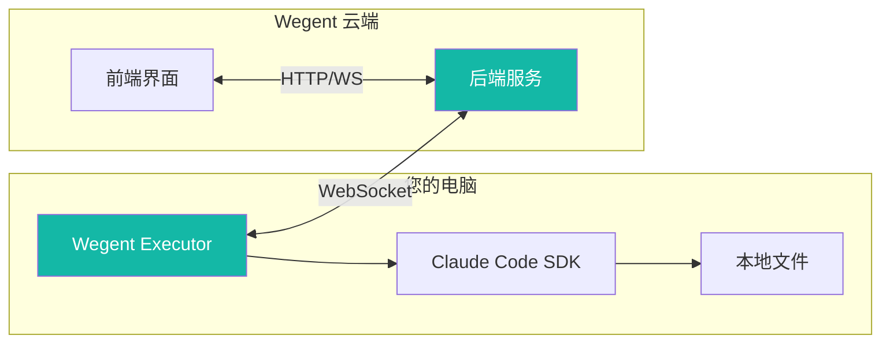
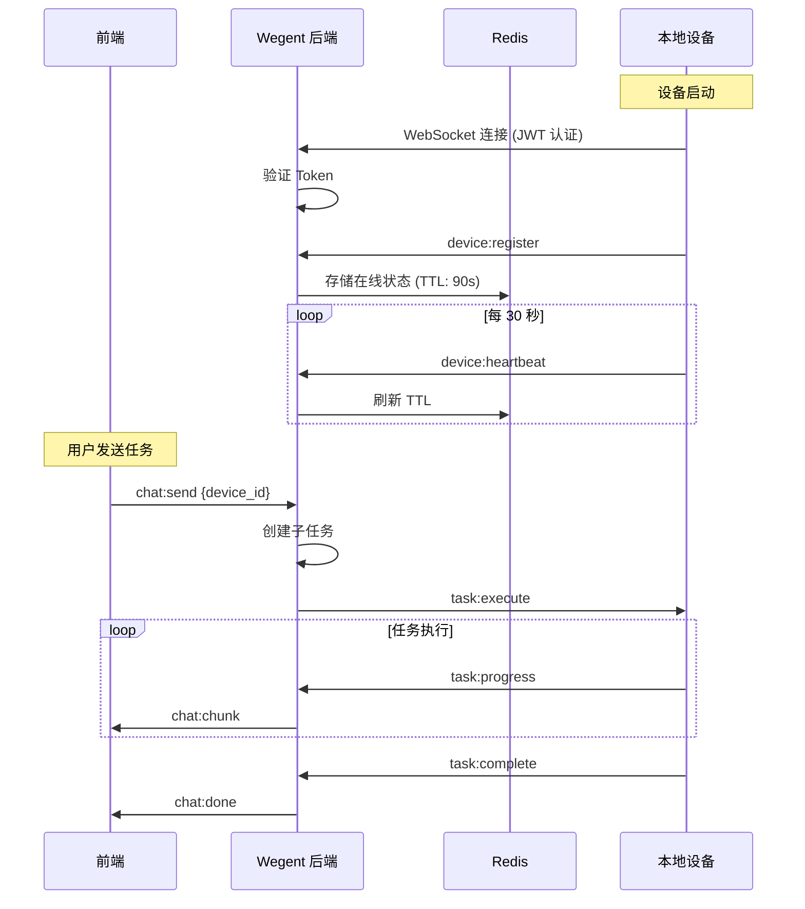
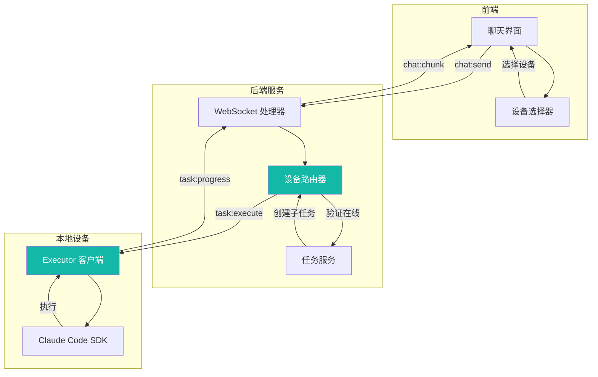
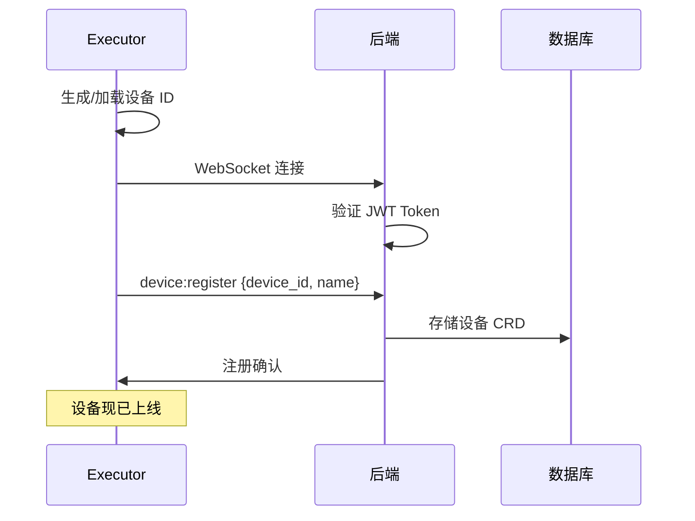
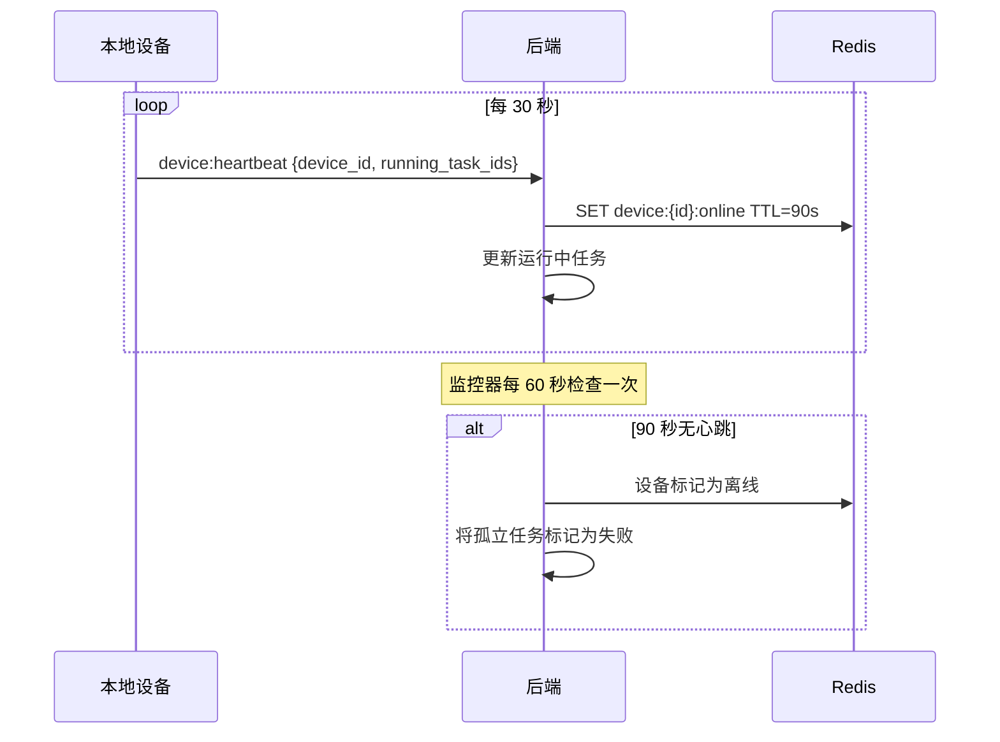
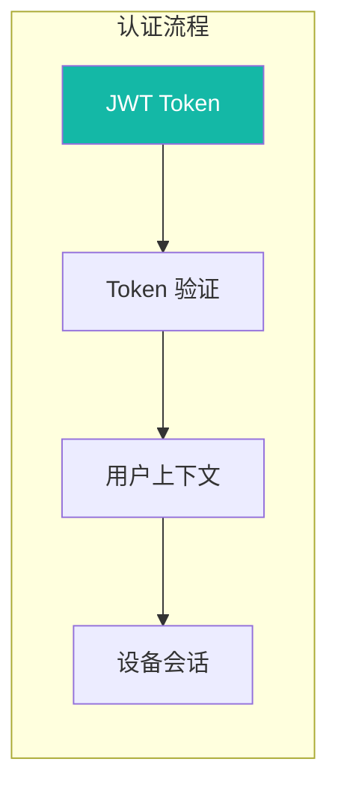

# 💻 本地设备支持指南

本地设备支持允许您使用个人电脑（Mac、Linux 或 Windows）作为任务执行器，让 AI 任务直接在本地机器上运行，而非使用云端基础设施。

---

## 📋 目录

- [概述](#-概述)
- [架构说明](#-架构说明)
- [设备注册](#-设备注册)
- [使用本地设备](#-使用本地设备)
- [设备管理](#-设备管理)
- [心跳与监控](#-心跳与监控)
- [安全机制](#-安全机制)
- [常见问题](#-常见问题)
- [相关资源](#-相关资源)

---

## 🎯 概述

### 什么是本地设备支持？

本地设备支持允许您的个人电脑作为 Wegent 的任务执行器。任务不再在云端基础设施上运行，而是直接在您的本地机器上执行，并提供实时流式反馈。

### 核心价值

| 优势 | 描述 |
|------|------|
| **更低延迟** | 本地直接执行，无需网络传输延迟 |
| **数据隐私** | 您的代码和数据永远不会离开本地机器 |
| **环境控制** | 使用本地安装的工具、依赖和配置 |
| **成本节约** | 减少云端执行资源消耗 |
| **自定义设置** | 访问本地凭证、自定义工具和专业软件 |

### 工作原理



---

## 🏗 架构说明

### 通信架构

下图展示了本地设备如何与 Wegent 系统通信：



### 任务执行流程



---

## 📲 设备注册

### 前置条件

在注册本地设备之前，请确保您具备：

- [ ] 有效凭证的 Wegent 账号
- [ ] 在您的机器上安装了 Wegent Executor
- [ ] 能够连接到 Wegent 后端的网络
- [ ] 已配置 Claude Code SDK（用于 ClaudeCode shell 类型）

### 安装 Wegent Executor

1. 克隆或下载 Wegent Executor 包
2. 安装依赖：

```bash
cd executor
pip install -e .
```

### 启动 Executor

以本地设备模式运行 executor：

```bash
# 使用默认设置启动
wegent-executor --mode local --token YOUR_JWT_TOKEN

# 或使用环境变量
export WEGENT_TOKEN=your_jwt_token
export WEGENT_BACKEND_URL=https://your-wegent-instance.com
wegent-executor --mode local
```

### 设备 ID 生成

Executor 会自动生成稳定的设备 ID，基于：

1. **缓存 ID**：存储在 `~/.wegent-executor/device_id`（如存在）
2. **硬件 UUID**：
   - macOS：系统硬件 UUID
   - Linux：`/etc/machine-id`
   - Windows：注册表中的 `MachineGuid`
3. **后备方案**：MAC 地址或随机 UUID

这确保您的设备在重启后保持一致的身份标识。

### 注册流程

当 executor 启动时：



---

## 🖥 使用本地设备

### 选择设备

在聊天界面中，您会看到设备选择器下拉菜单：

1. 点击聊天输入框附近的 **设备选择器** 图标
2. 查看可用设备及其状态：
   - 🟢 **在线**：设备已连接且就绪
   - 🔴 **离线**：设备未连接
   - 🟡 **繁忙**：设备已达最大容量
3. 选择您想使用的设备
4. 像往常一样发送消息

### 设备状态指示

| 状态 | 图标 | 描述 |
|------|------|------|
| **在线** | 🟢 | 设备已连接，有可用槽位 |
| **离线** | 🔴 | 设备未连接 |
| **繁忙** | 🟡 | 所有 5 个并发槽位均被占用 |
| **默认** | ⭐ | 您的新任务默认设备 |

### 并发任务槽位

每个设备支持最多 **5 个并发任务**：

- 查看槽位使用情况："2/5 槽位使用中"
- 所有槽位被占用时设备显示"繁忙"
- 如果选择繁忙设备，任务会排队等待

### 云端与本地切换

您可以动态选择执行位置：

| 选择 | 行为 |
|------|------|
| **云端**（默认） | 任务在 Wegent 云端基础设施上执行 |
| **本地设备** | 任务在您选择的本地机器上执行 |

只需在发送每条消息之前更改设备选择即可。

### 设置默认设备

1. 在选择器中打开设备列表
2. 点击您首选设备旁边的 **星号图标**
3. 该设备将在新对话中被预先选中

---

## ⚙️ 设备管理

### 查看已注册设备

通过以下方式访问您的设备：

1. **设备选择器**：聊天界面中快速访问
2. **API**：`GET /devices` 用于程序化访问

### 设备信息

每个设备显示：

| 字段 | 描述 |
|------|------|
| **名称** | 设备主机名（如 "Darwin - MacBook-Pro.local"） |
| **状态** | 在线/离线指示器 |
| **槽位** | 并发任务容量（X/5） |
| **默认** | 如果设为默认则显示星号 |

### 管理设备

| 操作 | 方法 |
|------|------|
| **设为默认** | 点击星号图标或 `PUT /devices/{id}/default` |
| **取消默认** | 再次点击当前默认设备的星号 |
| **删除设备** | 点击删除图标或 `DELETE /devices/{id}` |

> **注意**：删除设备只是移除注册记录。如果设备重新连接，它会自动重新注册。

### 离线设备处理

当设备离线时：

1. 运行中的任务自动标记为 **失败**
2. 错误消息指示设备断开连接
3. 任务槽位立即释放
4. 设备在选择器中显示为灰色

---

## 💓 心跳与监控

### 心跳机制

本地设备通过心跳维持连接：



### 时间参数

| 参数 | 值 | 描述 |
|------|-----|------|
| **心跳间隔** | 30 秒 | 设备发送心跳 |
| **在线 TTL** | 90 秒 | Redis 键过期时间 |
| **监控间隔** | 60 秒 | 后端检查过期设备 |
| **离线阈值** | 3 次心跳缺失 | 设备标记为离线 |

### 运行任务追踪

每次心跳包含当前运行的任务 ID，用于：

- 实时槽位使用追踪
- 孤立任务检测
- 断开连接时自动清理

---

## 🔒 安全机制

### 认证

本地设备使用 JWT token 进行认证：



| 安全特性 | 描述 |
|----------|------|
| **JWT 认证** | WebSocket 连接需要 token |
| **Token 有效期** | 7 天过期 |
| **用户隔离** | 设备只能执行其所有者的任务 |
| **硬件绑定** | 设备 ID 基于硬件标识 |

### 用户隔离

每个设备会话绑定到用户：

- 设备只能接收其注册所有者的任务
- 防止跨用户任务执行
- 子任务根据用户命名空间进行验证

### 数据隐私

使用本地设备时：

- **代码留在本地**：源代码不会上传到云端
- **本地执行**：所有处理在您的机器上进行
- **结果流式传输**：只有输出文本被传输
- **无持久存储**：云端不存储您的本地文件

### Token 管理

```bash
# 生成新 token（有效期 7 天）
# 通过 Wegent UI：设置 → API Token → 生成

# 使用 token 启动 executor
export WEGENT_TOKEN=your_jwt_token
wegent-executor --mode local
```

---

## ❓ 常见问题

### 连接问题

#### 设备无法连接

**可能原因：**
1. JWT token 无效或已过期
2. 网络连接问题
3. 后端 URL 配置错误

**解决方案：**
1. 从 Wegent UI 生成新的 JWT token
2. 检查到 Wegent 后端的网络连接
3. 验证 `WEGENT_BACKEND_URL` 环境变量

#### 设备连接后立即显示离线

**可能原因：**
1. Token 验证失败
2. 防火墙阻止 WebSocket
3. 后端服务问题

**解决方案：**
1. 检查 token 有效性和权限
2. 确保允许 WebSocket 连接
3. 检查 Wegent 后端日志中的错误

### 任务执行问题

#### 任务立即失败

**可能原因：**
1. Claude Code SDK 未安装
2. 本地机器缺少依赖
3. 权限不足

**解决方案：**
1. 安装并配置 Claude Code SDK
2. 安装所需依赖
3. 检查文件系统权限

#### 任务挂起无进展

**可能原因：**
1. Claude Code SDK 卡住
2. 执行期间网络中断
3. 本地机器资源耗尽

**解决方案：**
1. 重启 executor
2. 检查网络连接
3. 监控本地资源使用（CPU、内存）

### 设备管理问题

#### 多个设备显示相同名称

这是正常的，如果您有多台主机名相似的机器。每个设备有基于硬件的唯一 ID。

#### 无法删除设备

如果设备在删除后不断重新出现，说明 executor 仍在运行并重新注册。请先停止 executor，然后再删除。

### 性能问题

#### 本地执行仍有高延迟

**可能原因：**
1. 大型响应流式传输
2. 后端处理开销
3. 结果传输的网络问题

**解决方案：**
1. 对于非常大的输出，这是预期行为
2. 检查后端性能
3. 确保网络连接稳定

---

## 💡 最佳实践

### 何时使用本地设备

| 使用场景 | 建议 |
|----------|------|
| **敏感代码库** | ✅ 本地设备 |
| **快速迭代** | ✅ 本地设备 |
| **自定义工具需求** | ✅ 本地设备 |
| **批量处理** | 云端（更大容量） |
| **团队协作** | 云端（共享访问） |
| **移动/远程访问** | 云端（无需本地设置） |

### 多设备设置

如果您有多台机器：

1. 分别注册每台设备
2. 使用描述性主机名便于识别
3. 将主要工作站设为默认
4. 设备离线时使用云端作为后备

### 资源管理

- 任务执行期间监控本地资源使用
- 关闭不必要的应用程序以获得更好性能
- 考虑使用 SSD 存储以加快文件操作
- 确保有足够的 RAM 供 Claude Code SDK 使用

---

## 🔗 相关资源

### 文档
- [核心概念](../../concepts/core-concepts.md) - 了解 Wegent 的架构
- [管理任务](./managing-tasks.md) - 了解任务执行
- [配置 Shell](./configuring-shells.md) - Shell 配置选项

### 技术参考
- [YAML 规范](../../reference/yaml-specification.md) - CRD 定义

---

## 💬 获取帮助

需要帮助？

- 📖 查看 [常见问题](../../faq.md)
- 🐛 提交 [GitHub Issue](https://github.com/wecode-ai/wegent/issues)
- 💬 加入社区讨论

---

<p align="center">在本地机器上执行 AI 任务，完全掌控！ 🚀</p>
