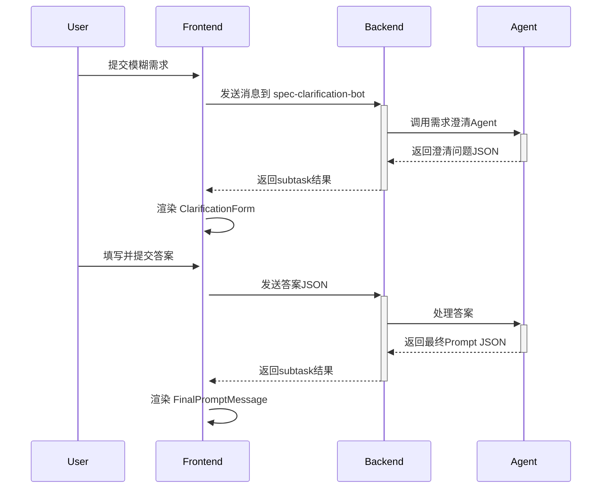

# 需求规范澄清(Spec Clarification)使用指南

## 功能概述

需求规范澄清(Spec Clarification)是 Wegent 系统的交互式需求澄清模式，帮助用户通过结构化问答将模糊需求精炼为清晰的开发任务。

## 快速开始

### 1. 系统初始化

系统首次启动时会自动创建以下实体：

- **spec-clarification-ghost**: 需求澄清系统提示词
- **spec-clarification-bot**: 需求澄清Bot
- **spec-clarification-team**: 需求澄清团队

### 2. 在前端选择团队

1. 进入 Code 页面
2. 在 Team 选择器中选择 **spec-clarification-team**
3. 输入模糊需求，例如："我想添加一个用户登录功能"

### 3. 交互流程

#### 步骤 1: 提交初始需求
```
用户输入: "我想添加一个登录功能"
```

#### 步骤 2: 回答澄清问题
系统会展示 3-5 个澄清问题，例如：
- 需要支持哪些登录方式？（多选）
- 是否需要"记住我"功能？（单选）
- 登录失败后如何处理？（单选）

每个问题都支持：
- **预设选项选择**: 点击单选/多选框
- **自定义输入**: 点击"自定义输入"按钮切换到文本输入模式

#### 步骤 3: 提交答案
填写完所有问题后，点击"提交答案"按钮。

#### 步骤 4: 获取最终 Prompt
系统会根据你的回答生成精炼的需求描述，你可以：
- **复制 Prompt**: 点击"复制提示词"按钮
- **创建新任务**: 点击"使用此提示词创建新任务"直接创建 Code 任务

## 技术架构

### 前端组件

```
MessagesArea.tsx
├── ClarificationForm.tsx        # 澄清问题表单容器
│   └── ClarificationQuestion.tsx # 单个问题渲染
└── FinalPromptMessage.tsx       # 最终 Prompt 展示
```

### 数据流



### 数据结构

**重要更新**: 从 2025年 起，系统已从 JSON 格式迁移到 Markdown 格式，以提高可读性和容错性。即使解析失败，用户也能看到可读的 Markdown 内容。

#### 澄清问题格式 (Agent → Frontend)

Agent 输出 Markdown 格式的澄清问题：

```markdown
## 🤔 需求澄清问题 (Clarification Questions)

### Q1: 需要支持哪些登录方式？
**Type**: multiple_choice
**Options**:
- [✓] `email` - 邮箱/密码 (recommended)
- [ ] `oauth` - OAuth (Google, GitHub等)
- [ ] `phone` - 手机号+短信验证码

### Q2: 是否需要"记住我"功能？
**Type**: single_choice
**Options**:
- [✓] `yes` - 是 (recommended)
- [ ] `no` - 否

### Q3: 其他特殊需求？
**Type**: text_input
```

**问题类型说明**:
- `single_choice`: 单选（Radio）
- `multiple_choice`: 多选（Checkbox）
- `text_input`: 文本输入（TextArea）

**选项格式**:
- `[✓]` 表示推荐/默认选项，会被自动选中
- `[ ]` 表示普通选项
- 反引号 `` `value` `` 包裹技术值
- ` - ` 后面是人类可读的标签文本

#### 用户答案格式 (Frontend → Agent)

用户提交 Markdown 格式的答案：

```markdown
## 📝 我的回答 (My Answers)

### Q1: 需要支持哪些登录方式？
**Answer**:
- `email` - 邮箱/密码
- `oauth` - OAuth (Google, GitHub等)

### Q2: 是否需要"记住我"功能？
**Answer**: `yes` - 是

### Q3: 其他特殊需求？
**Answer**: 登录页面需要支持深色模式
```

#### 最终 Prompt 格式 (Agent → Frontend)

Agent 输出 Markdown 格式的最终需求提示词：

```markdown
## ✅ 最终需求提示词 (Final Requirement Prompt)

实现用户登录功能，具体要求如下：

**认证方式**:
- 邮箱/密码认证（主要方式）
- OAuth 集成（支持 Google 和 GitHub）

**用户体验**:
- 包含"记住我"复选框，保持用户登录状态
- 登录页面支持深色模式

**安全要求**:
- 使用 bcrypt 或类似算法加密密码
- OAuth token 安全存储
- 实现速率限制防止暴力破解
```

#### 向后兼容性

前端同时支持解析 Markdown 格式和旧的 JSON 格式，确保向后兼容。如果 Agent 仍然输出 JSON，系统会自动识别并正确处理。

## 自定义 Bot

### 修改 system_prompt

如果需要调整澄清问题的风格或逻辑，可以修改 `spec-clarification-ghost` 的 `systemPrompt`：

1. 在设置页面找到 "spec-clarification-ghost"
2. 编辑 system_prompt
3. 保存更改

### 创建新的需求澄清 Bot

1. 创建新的 Ghost，参考 `spec-clarification-ghost` 的 system_prompt 结构
2. 创建新的 Bot，引用新的 Ghost
3. 创建新的 Team，引用新的 Bot
4. 在前端选择新的 Team 使用

## 最佳实践

### Agent 端（编写 system_prompt）

1. **问题设计**:
   - 每轮 3-5 个问题，避免过多
   - 使用 `[✓]` 标记推荐选项，引导用户
   - 优先使用选择题，减少用户输入成本

2. **输出规范**:
   - 严格输出 Markdown，使用规定的标题格式
   - 问题使用 `## 🤔 需求澄清问题` 标题
   - 最终 Prompt 使用 `## ✅ 最终需求提示词` 标题
   - 不要在 Markdown 结构外添加额外说明文本
   - `question_id` 使用简单的标识符（如 q1, q2）

3. **追问策略**:
   - 根据答案判断是否需要继续澄清
   - 不要无限追问，3-5轮后生成最终 Prompt
   - 最终 Prompt 应详细、可执行

### 前端使用

1. **选择合适的 Team**:
   - 需求澄清阶段：选择 `spec-clarification-team`
   - 代码生成阶段：切换到 `dev-team`

2. **回答技巧**:
   - 优先选择推荐选项，除非有特殊需求
   - 善用"自定义输入"补充细节
   - 确保所有问题都已回答再提交

3. **使用最终 Prompt**:
   - 复制 Prompt 可用于其他工具
   - 直接创建新任务可无缝切换到开发流程

## 故障排查

### 问题1: 澄清问题没有显示

**可能原因**:
- Agent 没有输出符合格式的 Markdown
- Markdown 标题不是 `## 🤔 需求澄清问题` 或 `## 🤔 Clarification Questions`

**解决方案**:
- 检查 Agent 的 system_prompt，确保使用了正确的 Markdown 标题
- 查看浏览器控制台是否有解析错误
- 即使解析失败，Markdown 内容也应该可读

### 问题2: 提交答案后没有响应

**可能原因**:
- 网络问题
- Agent 处理答案时出错

**解决方案**:
- 刷新页面重新尝试
- 检查后端日志

### 问题3: 最终 Prompt 没有特殊样式

**可能原因**:
- Agent 输出的 Markdown 标题不是 `## ✅ 最终需求提示词` 或 `## ✅ Final Requirement Prompt`

**解决方案**:
- 确认 Agent system_prompt 中最终输出格式正确
- 检查 emoji 图标是否正确（🤔 和 ✅）

## 后续增强方向

- [ ] 支持问题之间的依赖关系（如根据 q1 的答案决定是否显示 q2）
- [ ] 支持更多问题类型（日期选择、数字输入、文件上传等）
- [ ] 添加澄清历史记录，可查看和复用之前的澄清结果
- [ ] 支持导出澄清过程为文档

## 参考资料

- [架构设计](../../concepts/architecture.md)
- [核心概念](../../concepts/core-concepts.md)
- [YAML 规范](../../reference/yaml-specification.md)
