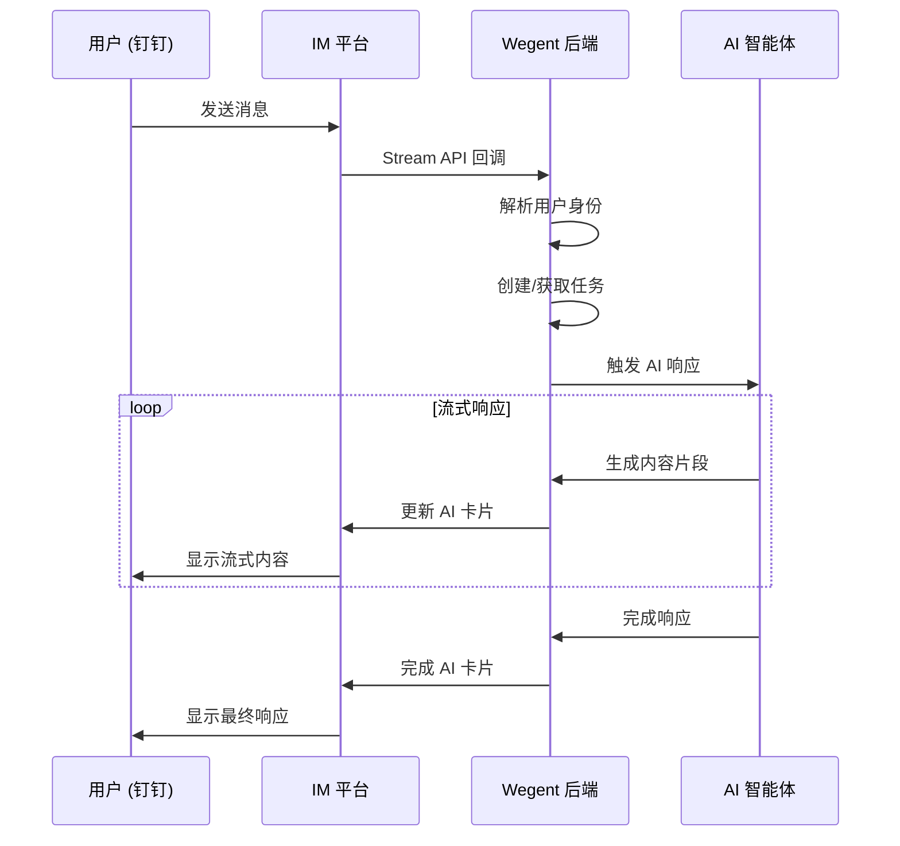
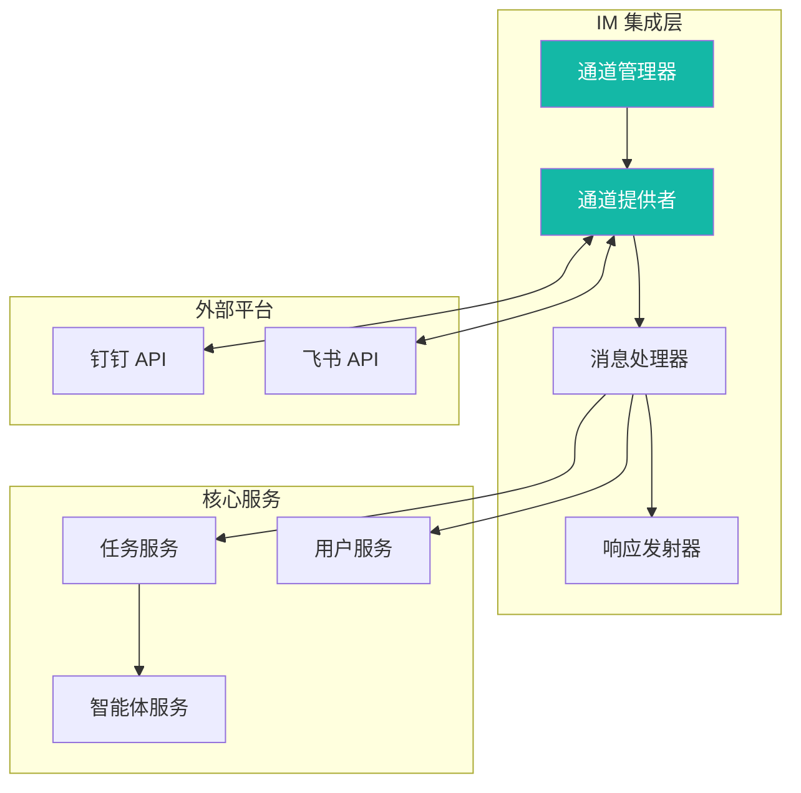
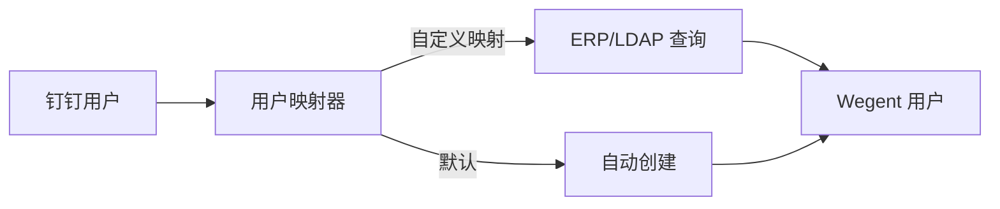

# 📱 IM 通道集成指南

IM 通道集成允许您将 Wegent 智能体连接到即时通讯平台（如钉钉），让用户可以在熟悉的聊天工具中直接与 AI 智能体对话。

---

## 📋 目录

- [概述](#-概述)
- [架构说明](#-架构说明)
- [钉钉集成配置](#-钉钉集成配置)
- [使用说明](#-使用说明)
- [管理功能](#-管理功能)
- [用户映射机制](#-用户映射机制)
- [常见问题](#-常见问题)
- [相关资源](#-相关资源)

---

## 🎯 概述

### 什么是 IM 通道集成？

IM 通道集成将 Wegent 智能体连接到即时通讯平台，让用户无需访问 Wegent 网页界面，即可在日常使用的聊天软件中直接与 AI 智能体对话。

### 核心价值

| 价值 | 描述 |
|------|------|
| **熟悉的环境** | 在您每天使用的聊天工具中使用 AI 智能体 |
| **实时响应** | 通过 AI 卡片技术获得流式 AI 响应 |
| **多轮对话** | 在多条消息之间保持上下文连贯 |
| **团队协作** | 与整个组织共享 AI 能力 |

### 支持的平台

| 平台 | 状态 | 功能 |
|------|------|------|
| **钉钉** | ✅ 已支持 | 流模式、AI 卡片流式响应、多轮对话 |
| **飞书** | 🔜 规划中 | 即将推出 |
| **企业微信** | 🔜 规划中 | 即将推出 |

---

## 🏗 架构说明

### 消息流转

下图展示了消息在 IM 集成系统中的流转过程：



### 关键组件



| 组件 | 用途 |
|------|------|
| **通道管理器 (Channel Manager)** | 管理所有 IM 通道连接的生命周期 |
| **通道提供者 (Channel Provider)** | 平台特定的连接处理器（钉钉、飞书等） |
| **消息处理器 (Message Handler)** | 处理传入消息并路由到智能体 |
| **响应发射器 (Response Emitter)** | 将 AI 响应发送回 IM 平台（同步或流式） |

---

## 🔧 钉钉集成配置

### 前置条件

在设置钉钉集成之前，请确保您具备：

- [ ] 具有管理员权限的钉钉企业账号
- [ ] 访问[钉钉开放平台](https://open.dingtalk.com)的权限
- [ ] 具有管理员权限的 Wegent 实例
- [ ] 在 Wegent 中至少配置了一个智能体（Team）

### 步骤 1：创建钉钉应用

1. 登录[钉钉开放平台](https://open.dingtalk.com)
2. 导航至 **应用开发** → **企业内部应用**
3. 点击 **创建应用**
4. 填写应用信息：
   - **应用名称**：您的机器人名称（如 "Wegent AI 助手"）
   - **应用描述**：机器人用途的简要描述
   - **应用图标**：上传合适的图标

### 步骤 2：配置应用权限

为您的应用启用以下权限：

**机器人权限：**
- `qyapi_robot_sendmsg` - 发送机器人消息
- `qyapi_chat_manage` - 管理群聊

**用户信息权限：**
- `Contact.User.Read` - 读取用户信息
- `Contact.User.mobile` - 访问用户手机号（可选）

### 步骤 3：获取应用凭证

1. 在应用设置中，导航至 **凭证与基础信息**
2. 复制以下值：
   - **Client ID** (AppKey)
   - **Client Secret** (AppSecret)

> ⚠️ **安全提示**：请妥善保管您的 Client Secret。切勿分享或提交到版本控制系统。

### 步骤 4：启用消息流模式

1. 在应用设置中，进入 **机器人配置**
2. 启用 **消息接收模式**：Stream 模式
3. 这允许 Wegent 通过 WebSocket 接收消息，无需配置回调 URL

### 步骤 5：在 Wegent 中配置 IM 通道

1. 以管理员身份登录 Wegent
2. 导航至 **管理后台** → **IM 渠道**
3. 点击 **添加渠道**
4. 填写配置：

| 字段 | 描述 | 示例 |
|------|------|------|
| **通道名称** | 此通道的显示名称 | "钉钉机器人" |
| **通道类型** | 选择平台 | 钉钉 |
| **Client ID** | 来自步骤 3 | `dingxxxxxxxx` |
| **Client Secret** | 来自步骤 3 | `xxxxxxxxxxxxxxxx` |
| **默认智能体** | 处理消息的智能体 | 从列表中选择 |
| **默认模型** | 覆盖模型（可选） | 留空使用智能体默认模型 |
| **启用 AI 卡片** | 使用流式 AI 卡片 | ✅ 推荐启用 |

5. 点击 **保存** 创建通道
6. 切换 **启用** 开关激活通道

### 步骤 6：验证连接

1. 在 IM 渠道列表中检查通道状态
2. 状态应显示 **已连接**（绿色指示器）
3. 查看运行时长和最近错误信息（如有）

### 步骤 7：测试集成

1. 打开钉钉并找到您的机器人
2. 发送测试消息："你好"
3. 验证是否收到 AI 响应

---

## 💬 使用说明

### 基本对话

像在任何聊天中一样向机器人发送消息：

```
用户：你能帮我做什么？
机器人：我是由 Wegent 驱动的 AI 助手。我可以帮助您...
```

### 多轮对话

机器人在同一聊天会话中保持对话上下文：

```
用户：我正在开发一个 React 项目
机器人：很好！我很乐意帮助您的 React 项目...

用户：如何优化性能？
机器人：对于您的 React 项目，这里有一些性能优化建议...
```

### 开始新对话

要清除上下文并重新开始，使用 `/new` 命令：

```
用户：/new
机器人：已开始新对话。有什么可以帮助您的？
```

### AI 卡片流式响应

启用 AI 卡片流式响应后，您将看到响应实时出现：

1. 机器人显示"思考中..."指示器
2. 响应文本逐步流式显示
3. 最终响应以格式化形式呈现

---

## ⚙️ 管理功能

### 通道状态监控

在管理面板中查看通道健康状态：

| 状态 | 指示器 | 描述 |
|------|--------|------|
| **已连接** | 🟢 绿色 | 通道活跃并正在接收消息 |
| **已断开** | 🔴 红色 | 通道离线或遇到错误 |
| **已禁用** | ⚪ 灰色 | 通道被手动禁用 |

### 通道操作

| 操作 | 描述 |
|------|------|
| **启用/禁用** | 在不删除配置的情况下切换通道状态 |
| **重启** | 重新连接到 IM 平台（网络问题后有用） |
| **编辑** | 修改通道设置（密钥留空保持现有值） |
| **删除** | 移除通道配置 |

### 更新配置

编辑通道时：

- **敏感字段**（Client Secret）以 `***` 显示
- **留空**敏感字段以保留现有值
- 输入新值以更新凭证

### 监控指标

每个通道可用的指标：

- **运行时长**：通道已连接的时间
- **最近错误**：最近的错误消息（如有）
- **连接时间**：通道最后连接的时间

---

## 👥 用户映射机制

### 自动用户创建

当钉钉用户首次与机器人交互时：

1. 系统尝试查找现有的 Wegent 用户
2. 如果未找到，自动创建新用户账号
3. 用户与其钉钉身份关联

**默认用户创建：**
- **用户名**：钉钉员工 ID
- **邮箱**：`{staff_id}@dingtalk.com`
- **认证来源**：`dingtalk`

### 企业用户映射

对于拥有现有用户目录（ERP、LDAP）的组织，可以配置自定义用户映射器：



请联系您的系统管理员配置企业用户映射。

---

## ❓ 常见问题

### 连接问题

#### 通道显示"已断开"

**可能原因：**
1. Client ID 或 Client Secret 无效
2. 网络连接问题
3. 钉钉 API 服务中断

**解决方案：**
1. 在钉钉开放平台验证凭证
2. 检查 Wegent 服务器的网络连接
3. 尝试重启通道
4. 检查钉钉服务状态

#### 消息未被接收

**可能原因：**
1. 钉钉中未启用 Stream 模式
2. 机器人权限未配置
3. Wegent 中通道未启用

**解决方案：**
1. 验证钉钉应用设置中已启用 Stream 模式
2. 检查所有必需权限已授予
3. 确保通道已启用（开关已打开）

### 响应问题

#### 机器人无响应

**可能原因：**
1. 默认智能体未配置
2. 智能体未分配模型
3. 速率限制

**解决方案：**
1. 验证通道已选择默认智能体
2. 确保智能体有可用的模型配置
3. 检查通道状态中的速率限制错误

#### 响应缓慢或不完整

**可能原因：**
1. AI 卡片流式传输问题
2. 网络延迟
3. 响应内容过大

**解决方案：**
1. 尝试临时禁用 AI 卡片流式传输
2. 检查网络连接
3. 系统会在流式传输失败时回退到同步模式

### 用户问题

#### 用户未被识别

**可能原因：**
1. 用户映射配置问题
2. 钉钉用户信息不可访问

**解决方案：**
1. 检查钉钉应用中的用户权限
2. 验证用户映射配置
3. 联系管理员配置企业用户映射

---

## 🔗 相关资源

### 文档
- [核心概念](../../concepts/core-concepts.md) - 了解 Wegent 的架构
- [智能体设置](../settings/agent-settings.md) - 为 IM 通道配置智能体
- [配置模型](../settings/configuring-models.md) - 设置 AI 模型

### 外部资源
- [钉钉开放平台文档](https://open.dingtalk.com/document/)
- [钉钉 Stream 模式指南](https://open.dingtalk.com/document/orgapp/receive-message)

---

## 💬 获取帮助

需要帮助？

- 📖 查看 [常见问题](../../faq.md)
- 🐛 提交 [GitHub Issue](https://github.com/wecode-ai/wegent/issues)
- 💬 加入社区讨论

---

<p align="center">将您的 AI 智能体连接到钉钉，赋能您的团队！ 🚀</p>
