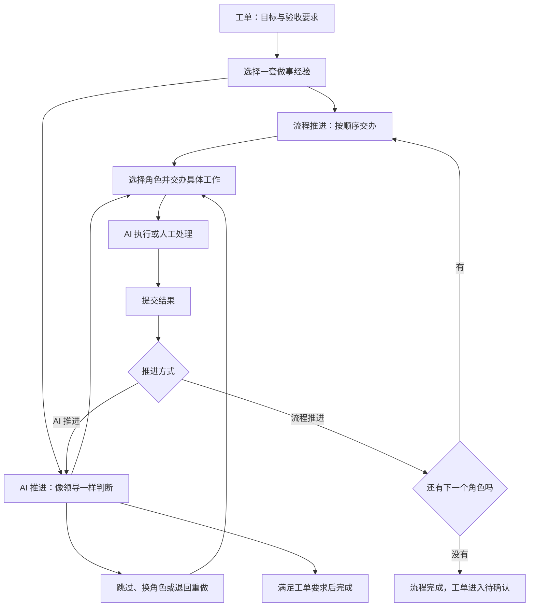
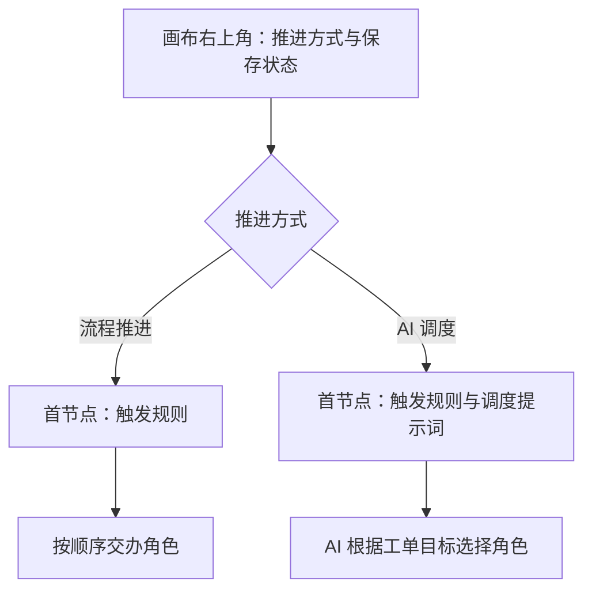
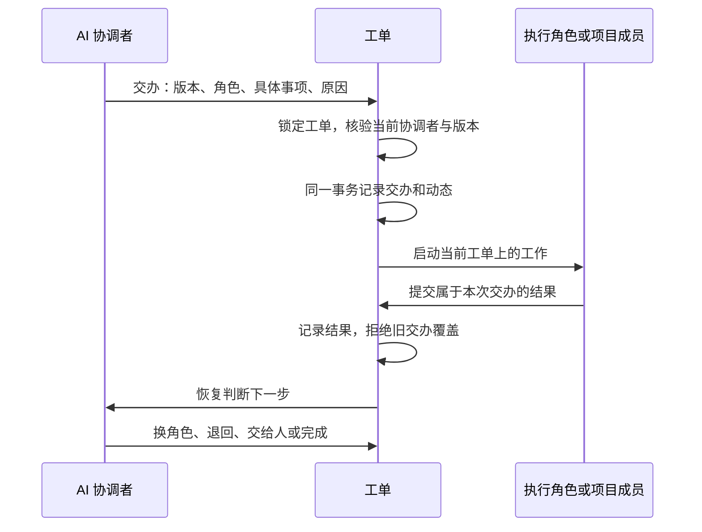
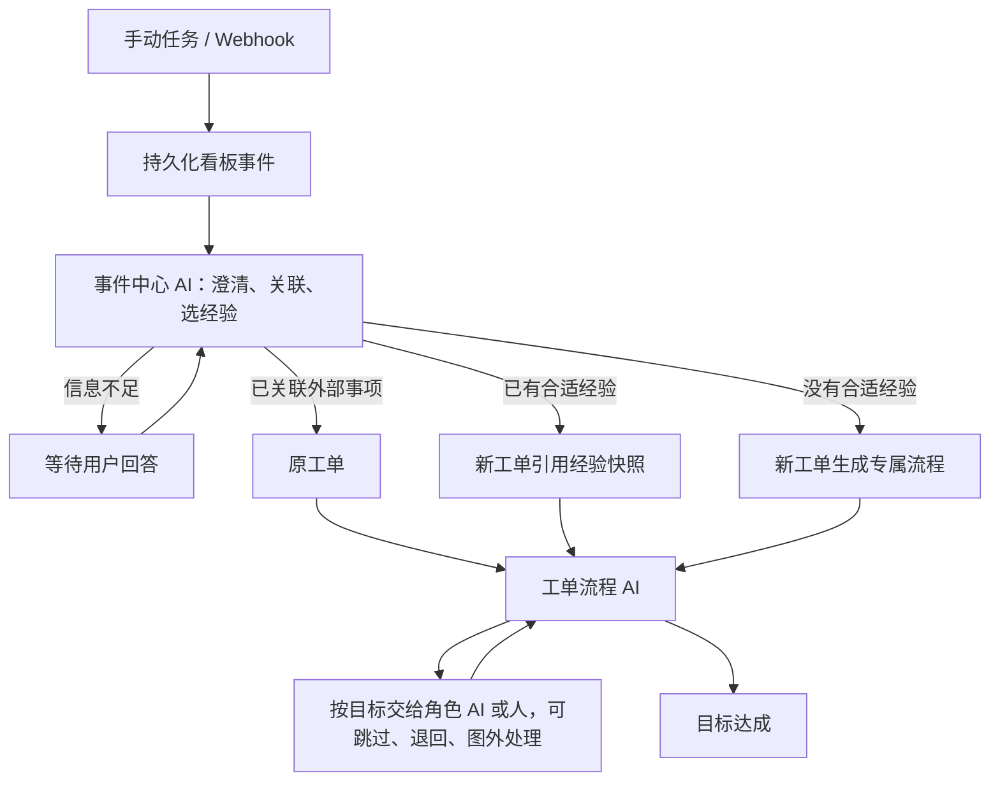

# 看板自动化：做事经验与工单分派

自动化是一套由不同角色组成的做事经验，AI 像领导一样按工单目标分活，让对应节点开工，按需跳过或退回，直到满足要求。

## 核心概念

- **看板是工单系统**：Issue 承载要解决的问题、目标和验收要求，不等同于一次 AI 执行任务。
- **自动化是经验**：保存角色职责、参考协作顺序和执行配置，不是要求每次完整走完的检查清单。
- **节点是角色**：例如产品、页面设计、开发、上线。节点描述谁能做什么，并配置实际执行方式；可由 AI 执行，也可由项目成员处理。它不是单纯的阶段标签，也不要求创建机器人资源。
- **分派就是交办**：把工单交给节点时，同时给出这次具体要做的事并启动执行，不能只改变图上的高亮。
- **AI 是协调者**：根据目标、已有结果和当前困难选择执行角色；流程图提供经验，工单要求决定是否完成。

## 两种平级推进方式

**流程推进**严格按配置的串行顺序交办，一个节点完成后交给下一个节点。

**AI 推进**自主选择角色、跳过不需要的工作、退回重做或交给人。参考图可选；没有合适节点时也允许直接处理或交办图外工作。图上的顺序不是 AI 的权限边界。

## 在画布上配置推进方式

画布右上角将“流程推进 / AI 调度”和保存状态放在一起，表示推进方式属于整条自动化。关闭节点详情后，仍可直接切换。

选择 AI 调度会打开首节点的“触发与 AI 调度”设置，先填写调度提示词，再配置执行环境和模型。选择流程推进时，首节点只显示触发规则，不提供调度提示词；两种模式下，后续角色都可以由 AI 或项目成员执行。在同一草稿里来回切换模式会保留已填写的调度配置。

## 工单状态与历史

工单分别记录稳定的意图目标与可选初始角色、当前主角色、当前交办事项和负责人。首次交办到图内角色时记录初始角色，此后保持不变；初始绑定不是必须到达的终点，当前角色也不是全部执行任务的统一归属。

一个工单只有一个当前主角色；任务可以有自己的角色归属。图外工作不保留误导性的旧角色。转交人时直接转交当前工单，等待人提交结果后按所选推进方式继续：流程推进交给下一个角色，AI 推进由协调者决定下一步。

跳过不等于做完，退回不抹掉旧结果。每次交办保留原因、角色、具体事项和结果；较早执行的迟到回报不能覆盖新的交办。

工单是否完成以目标和验收要求为准，AI 推进不以“所有节点完成”为条件。

## 软件交付示例

经验中可以包含需求设计、页面设计、产品明确、需求开发和需求上线。一个需求可能依次经过全部角色；另一个需求只需要页面设计、需求开发和需求上线。上线发现缺陷时，可以重新交给开发，再交给上线；无需新建工单或修改经验图。

## 对话与数据边界

同一件事在原评论下盖楼：补充需求、回答追问、修改意见和反馈结果都留在同一讨论；原任务结束后仍可继续修改。只有新增可独立执行、独立交付的目标，才新开动态和执行任务。工单完成后仍可创建任务，不自动重开已结束的自动化。

AI 向人提问时，卡片和通知直接定位到该楼的回复框。普通“回复”只发布评论；负责人点击“回复并继续推进”才提交本次交办结果、交回 AI。已发布的回复可以直接提交，无需重复输入。AI 后续追问仍留在原楼，调度员也继续原协调会话：自定义 Runtime 复用原 task ID，Wegent 复用原 Task 并在其中新开一轮 Subtask；系统为每次继续建立独立的协调和执行记录，上一轮结果不会被改写。原协调会话不存在时明确失败，不能静默新建任务。对于已关联执行任务的普通动态，回复继续原任务会话。

复用现有工单、自动化、执行任务和动态存储，不新增业务表。推进方式与交办状态放入现有元数据；旧定义显式迁移，不能猜测并行流程的串行顺序，也不能伪造历史意图。

## 旧流程如何继续

升级时暂停旧工单的自动化、禁用旧自动化规则，保留原配置、子工单和动态历史。旧子工单的结果仍属于它自己的历史，不再驱动父工单。

先在自动化编辑器里明确选择流程推进或 AI 推进，并保存角色配置。对于旧并行流程，必须明确整理为串行顺序，或者选择 AI 推进；嵌套的旧 AI 节点需要重新配置，系统不会猜测。

然后在原工单里选择保存后的经验，确认当前要达成的目标并继续。这是一次明确的新交办，旧历史保持可追溯。完成后的工单仍可以新增独立任务。

## 执行一致性

协调者发起的每次交办都有独立标识和版本；重复请求不会重复开工。结果回报先持久化，再恢复协调者；进程中断后可由调度扫描继续。暂停期间允许保留当前工作的结果，但不会自动推进。

## 事件中心与工单专属流程

看板的事件中心统一接收手动任务和 Webhook。路由 AI 先判断是否属于已有工单；有可靠的外部事项关联时，优先把事件和意见交回原工单。目标不清楚则提问，收到回答再继续。

明确的新任务可以选择已有自动化经验；没有合适经验时，AI 为当前工单编排专属角色图。**专属流程只属于这个工单，不新增自动化模板，不出现在自动化列表，也不供其他工单复用。** 工单会保存流程、目标、交办与结果，以便后续继续处理。

事件中心在看板设置中选择 Runtime 和路由提示词，路由会话使用独立工作区。专属流程继承配置的 Runtime 和工作区；已有工单沿用自己的执行配置。模板、工单、代码工作区和执行设备各自独立。

执行任务创建 MR、PR 或其他外部事项后，需通过 `register_external_reference` 登记提供方和规范 URL / 稳定事项标识。Webhook 的投递 ID 只用于事件去重，不能代替外部事项标识。后续意见因此可以回到原工单，即使上次已经完成；运行中事件保留为新上下文，并使旧版本的调度决策失效。

未启用事件中心时，收到的事件显示“等待配置”。启动失败会保留事件及错误；重试继续处理同一事件。流程接管失败也保留已创建的工单，重试不会再建一个。只读成员可查看事件，Developer 可提交和回答，Maintainer 可设置事件中心。

存储复用既有 `loop_items` 中的看板、事件、工单与执行记录，不新增业务表。
