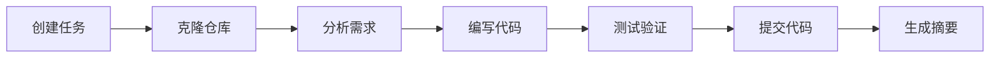

# 管理代码任务

本指南详细介绍如何在 Wegent 中创建、执行和管理代码类型的任务。

---

## 目录

- [什么是代码任务](#什么是代码任务)
- [创建代码任务](#创建代码任务)
- [任务执行流程](#任务执行流程)
- [任务状态管理](#任务状态管理)
- [高级功能](#高级功能)
- [常见问题](#常见问题)

---

## 什么是代码任务

代码任务是 Wegent 中专门用于软件开发的任务类型。与普通聊天任务不同，代码任务会连接到 Git 仓库，AI 智能体可以直接在仓库中进行代码修改。

**核心概念**：
```
代码任务 = 用户提示词 + 代码智能体 + Git 仓库 + 分支
```

### 代码任务 vs 聊天任务

| 特性 | 代码任务 | 聊天任务 |
|------|----------|----------|
| **Git 仓库** | 必需 | 可选 |
| **代码执行** | 在 Docker 容器中执行 | 无代码执行 |
| **工作台** | 显示文件变更、提交历史 | 不显示 |
| **分支管理** | 自动创建功能分支 | 无 |
| **适用场景** | 代码开发、重构、修复 | 问答、分析、文档 |

---

## 创建代码任务

### 步骤 1：进入 Code 页面

1. 点击左侧导航栏的 **"Code"**
2. 系统显示代码任务列表和输入区域

### 步骤 2：选择代码智能体

在输入区域上方，点击智能体选择器：

1. **点击智能体下拉菜单** - 显示可用的智能体列表
2. **选择代码类型智能体** - 选择配置了 ClaudeCode 或 Agno Shell 的智能体

> ⚠️ 只有配置了代码类型 Shell 的智能体才能执行代码任务

### 步骤 3：选择代码仓库

1. **点击仓库选择器** - 显示您有权访问的仓库列表
2. **选择目标仓库** - 选择要进行代码修改的仓库
3. **选择分支** - 选择基础分支（AI 会基于此分支创建新分支）

### 步骤 4：配置任务选项（可选）

#### 模型选择

点击模型选择器可以覆盖智能体的默认模型：

- **选择模型**：从下拉列表中选择
- **强制覆盖**：启用后，即使智能体已配置模型也使用您选择的模型

#### 知识库上下文

点击上下文按钮添加知识库：

1. **点击 "#" 按钮** - 打开上下文选择器
2. **选择知识库** - 勾选要添加的知识库
3. **确认选择** - 知识库显示为标签

#### 技能选择

如果智能体支持技能：

1. **点击技能按钮** - 打开技能选择器
2. **选择技能** - 勾选需要的技能
3. **或使用 "/" 命令** - 在输入框中输入 `/` 触发技能选择

### 步骤 5：输入任务描述并发送

1. **在输入框中输入任务描述** - 清晰描述您的需求
2. **按 Enter 发送** - 或点击发送按钮
3. **等待响应** - 智能体开始处理并流式返回结果

---

## 任务执行流程

### 执行阶段



### 1. 任务初始化

- 系统创建任务记录
- 分配执行容器
- 克隆目标仓库到容器中

### 2. 代码分析

- AI 分析仓库结构
- 理解现有代码模式
- 规划实现方案

### 3. 代码实现

- AI 使用工具读取、编辑、创建文件
- 执行必要的命令（如安装依赖、运行测试）
- 实时在工作台显示进度

### 4. 代码提交

- AI 创建功能分支
- 提交代码变更
- 生成提交信息

### 5. 任务完成

- 生成任务摘要
- 显示文件变更统计
- 提供创建 PR 的选项

---

## 任务状态管理

### 任务状态

| 状态 | 描述 | 操作 |
|------|------|------|
| **PENDING** | 等待执行 | 可取消 |
| **RUNNING** | 正在执行 | 可停止 |
| **COMPLETED** | 执行完成 | 可查看结果、创建 PR |
| **FAILED** | 执行失败 | 可重试 |
| **CANCELLED** | 已取消 | 可重新创建 |

### 停止任务

如果需要停止正在运行的任务：

1. **点击停止按钮** - 在输入区域或任务详情中
2. **确认停止** - 任务将被标记为已取消
3. **查看部分结果** - 已完成的代码变更会保留

### 重试任务

如果任务失败：

1. **查看错误信息** - 了解失败原因
2. **点击重试按钮** - 重新执行任务
3. **或修改后重试** - 调整任务描述后重新发送

---

## 高级功能

### 继续对话

任务完成后，您可以继续与智能体对话：

1. **在同一任务中发送新消息** - 智能体会基于之前的上下文继续工作
2. **请求修改** - 如 "请把函数名改成 createUser"
3. **请求补充** - 如 "请添加单元测试"

### 查看执行详情

在工作台中查看详细的执行信息：

- **执行时间线**：查看 AI 使用的工具和执行顺序
- **提交历史**：查看所有代码提交
- **文件变更**：查看每个文件的具体修改

### 创建 Pull Request

任务完成后，可以直接创建 PR：

1. **点击 "创建 PR" 按钮** - 在工作台或任务菜单中
2. **填写 PR 信息** - 标题、描述等
3. **提交 PR** - 系统会在 GitHub/GitLab 中创建 PR

### 导出任务

导出任务的对话历史和代码变更：

1. **点击导出按钮** - 在任务菜单中
2. **选择格式** - Markdown 或 JSON
3. **下载文件** - 保存到本地

---

## 常见问题

### Q1：任务一直处于 PENDING 状态？

**可能原因**：
1. 没有可用的执行容器
2. 仓库访问权限问题
3. Git 令牌过期

**解决方案**：
- 检查系统资源是否充足
- 验证 Git 令牌是否有效
- 检查仓库访问权限

### Q2：代码提交失败？

**可能原因**：
1. 分支保护规则
2. 权限不足
3. 网络问题

**解决方案**：
- 检查目标分支的保护规则
- 确认 Git 令牌有写入权限
- 重试任务

### Q3：AI 修改了错误的文件？

**解决方案**：
1. 在任务中明确指定要修改的文件路径
2. 提供更详细的上下文信息
3. 使用知识库提供项目结构说明

### Q4：如何让 AI 遵循项目的编码规范？

**解决方案**：
1. 在仓库根目录添加 `.cursorrules` 或 `.windsurfrules` 文件
2. 在任务描述中明确说明编码规范
3. 使用知识库提供编码规范文档

### Q5：任务执行时间过长？

**可能原因**：
1. 任务范围过大
2. 需要安装大量依赖
3. 网络延迟

**解决方案**：
- 将大任务拆分成小任务
- 使用预配置的基础镜像
- 检查网络连接

---

## 相关资源

- [概述](./README.md) - AI 编码功能概述
- [需求澄清模式](./spec-clarification-guide.md) - 需求澄清功能
- [智能体设置](../settings/agent-settings.md) - 配置代码智能体

---

<p align="center">高效管理您的代码任务，让 AI 成为您的编程助手！🚀</p>
