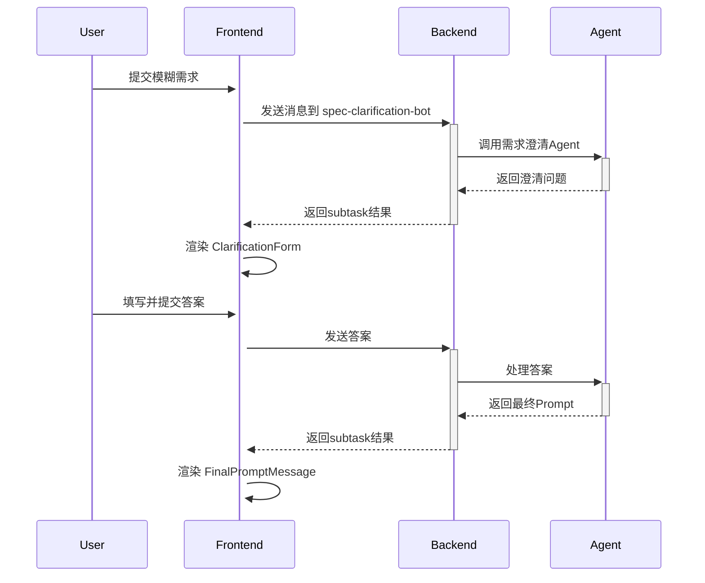

# 需求澄清模式

## 功能概述

需求规范澄清(Spec Clarification)是 Wegent 系统的交互式需求澄清模式，帮助用户通过结构化问答将模糊需求精炼为清晰的开发任务。

## 快速开始

### 1. 系统初始化

系统首次启动时会自动创建以下实体：

- **spec-clarification-ghost**: 需求澄清系统提示词
- **spec-clarification-bot**: 需求澄清Bot
- **spec-clarification-team**: 需求澄清团队

### 2. 在前端选择团队

1. 进入 Code 页面
2. 在 Team 选择器中选择 **spec-clarification-team**
3. 输入模糊需求，例如："我想添加一个用户登录功能"

### 3. 交互流程

#### 步骤 1: 提交初始需求
```
用户输入: "我想添加一个登录功能"
```

#### 步骤 2: 回答澄清问题
系统会展示 3-5 个澄清问题，例如：
- 需要支持哪些登录方式？（多选）
- 是否需要"记住我"功能？（单选）
- 登录失败后如何处理？（单选）

每个问题都支持：
- **预设选项选择**: 点击单选/多选框
- **自定义输入**: 点击"自定义输入"按钮切换到文本输入模式

#### 步骤 3: 提交答案
填写完所有问题后，点击"提交答案"按钮。

#### 步骤 4: 获取最终 Prompt
系统会根据你的回答生成精炼的需求描述，你可以：
- **复制 Prompt**: 点击"复制提示词"按钮
- **创建新任务**: 点击"使用此提示词创建新任务"直接创建 Code 任务

## 技术架构

### 前端组件

```
MessagesArea.tsx
├── ClarificationForm.tsx        # 澄清问题表单容器
│   └── ClarificationQuestion.tsx # 单个问题渲染
└── FinalPromptMessage.tsx       # 最终 Prompt 展示
```

### 数据流




## 参考资料

- [架构设计](../../concepts/architecture.md)
- [核心概念](../../concepts/core-concepts.md)
- [YAML 规范](../../reference/yaml-specification.md)
