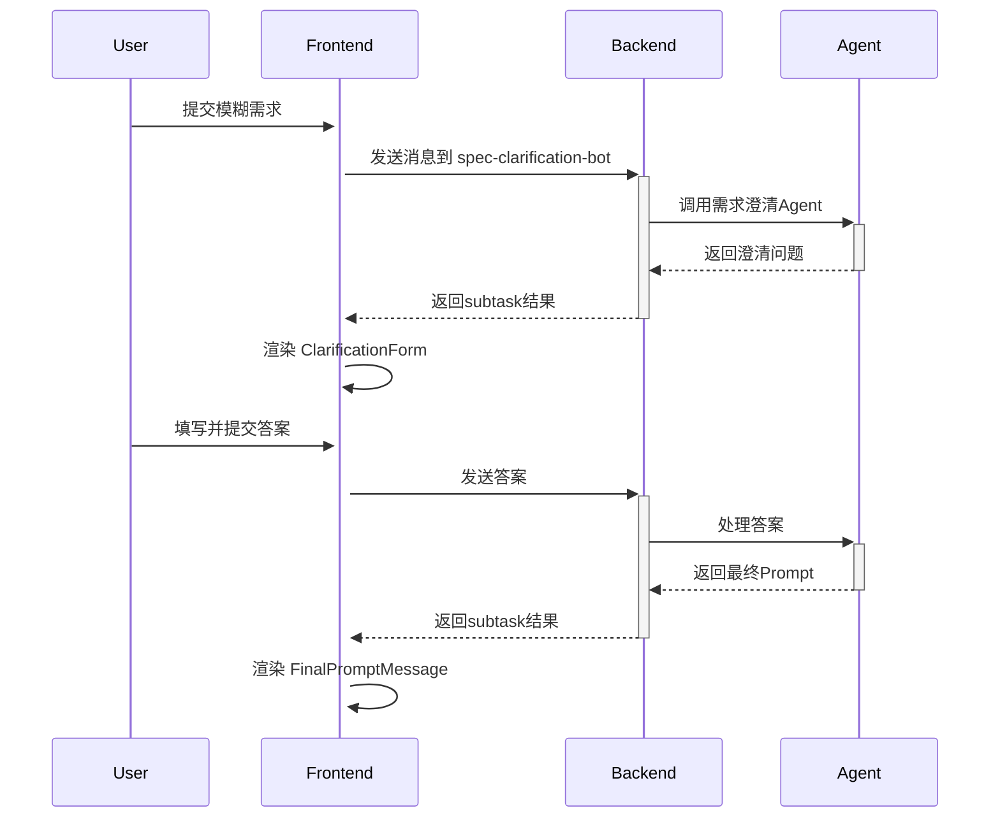
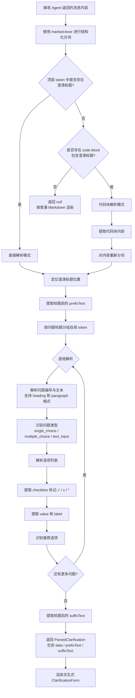

# 需求澄清模式

## 功能概述

需求规范澄清(Spec Clarification)是 Wegent 系统的交互式需求澄清模式，帮助用户通过结构化问答将模糊需求精炼为清晰的开发任务。

## 快速开始

### 1. 系统初始化

系统首次启动时会自动创建以下实体：

- **spec-clarification-ghost**: 需求澄清系统提示词
- **spec-clarification-bot**: 需求澄清Bot
- **spec-clarification-team**: 需求澄清团队

### 2. 在前端选择团队

1. 进入 Code 页面
2. 在 Team 选择器中选择 **spec-clarification-team**
3. 输入模糊需求，例如："我想添加一个用户登录功能"

### 3. 交互流程

#### 步骤 1: 提交初始需求
```
用户输入: "我想添加一个登录功能"
```

#### 步骤 2: 回答澄清问题
系统会展示 3-5 个澄清问题，例如：
- 需要支持哪些登录方式？（多选）
- 是否需要"记住我"功能？（单选）
- 登录失败后如何处理？（单选）

每个问题都支持：
- **预设选项选择**: 点击单选/多选框
- **自定义输入**: 点击"自定义输入"按钮切换到文本输入模式

#### 步骤 3: 提交答案
填写完所有问题后，点击"提交答案"按钮。

#### 步骤 4: 获取最终 Prompt
系统会根据你的回答生成精炼的需求描述，你可以：
- **复制 Prompt**: 点击"复制提示词"按钮
- **创建新任务**: 点击"使用此提示词创建新任务"直接创建 Code 任务

## 技术架构

### 前端组件

```
MessagesArea.tsx
├── ClarificationForm.tsx        # 澄清问题表单容器
│   └── ClarificationQuestion.tsx # 单个问题渲染
└── FinalPromptMessage.tsx       # 最终 Prompt 展示
```

### 数据流


```mermaid
sequenceDiagram
    User->>+Frontend: 提交模糊需求
    Frontend->>+Backend: 发送消息到 spec-clarification-bot
    Backend->>+Agent: 调用需求澄清Agent
    Agent-->>-Backend: 返回澄清问题
    Backend-->>-Frontend: 返回subtask结果
    Frontend->>Frontend: 渲染 ClarificationForm
    User->>+Frontend: 填写并提交答案
    Frontend->>+Backend: 发送答案
    Backend->>+Agent: 处理答案
    Agent-->>-Backend: 返回最终Prompt
    Backend-->>-Frontend: 返回subtask结果
    Frontend->>Frontend: 渲染 FinalPromptMessage
```


## Markdown 解析机制

Agent 返回的 Markdown 内容会被自动解析为交互式表单。解析基于 AST 分词（marked.lexer）实现。

### 解析流程


```mermaid
flowchart TD
    A[接收 Agent 返回的消息内容] --> B[使用 marked.lexer 进行结构化分词]
    B --> C{顶层 token 中是否存在<br/>澄清标题?}
    C -->|是| D[直接解析模式]
    C -->|否| E{是否存在 code block<br/>包含澄清标题?}
    E -->|是| F[代码块解析模式]
    E -->|否| G[返回 null<br/>按普通 Markdown 渲染]

    D --> H[定位澄清标题位置]
    F --> F1[提取代码块内容]
    F1 --> F2[对内容重新分词]
    F2 --> H

    H --> I[提取标题前的 prefixText]
    I --> J[按问题标题分组后续 token]
    J --> K{逐组解析}

    K --> L[解析问题编号与文本<br/>支持 heading 和 paragraph 格式]
    L --> M[识别问题类型<br/>single_choice / multiple_choice / text_input]
    M --> N[解析选项列表]
    N --> N1[提取 checkbox 标记 ✓ / x / *]
    N1 --> N2[提取 value 和 label]
    N2 --> N3[识别推荐选项]
    N3 --> O{还有更多问题?}
    O -->|是| K
    O -->|否| P[提取标题后的 suffixText]
    P --> Q[返回 ParsedClarification<br/>包含 data / prefixText / suffixText]
    Q --> R[渲染交互式 ClarificationForm]
```

### 标准 Markdown 格式

澄清问题的格式由 `spec-ghost` 的系统提示词定义（参见 `backend/init_data/02-public-resources.yaml` 中 `kind: Ghost, name: spec-ghost`）：

```markdown
## 🤔 Clarification Questions

### Q1: 是否需要支持移动端？
**Type**: single_choice
- [✓] `yes` - 是 (recommended)
- [ ] `no` - 否

### Q2: 需要支持哪些认证方式？
**Type**: multiple_choice
- [✓] `email` - 邮箱/密码 (recommended)
- [ ] `oauth` - OAuth (Google, GitHub 等)
- [ ] `phone` - 手机号 + 短信验证

### Q3: 还有其他补充需求吗？
**Type**: text_input
```

### 格式容错

#### 标题识别

| 格式变体 | 示例 | 是否支持 |
|----------|------|---------|
| 标准格式 | `## 🤔 Clarification Questions` | ✅ |
| 中文标题 | `## 🤔 需求澄清问题` | ✅ |
| 旧版标题 | `## 💬 智能追问` | ✅ |
| 省略 emoji | `## Clarification Questions` | ✅ |
| 不同标题层级 | `# 澄清问题` / `### 澄清问题` | ✅ |
| 简写形式 | `## 澄清` / `## Clarification` | ✅ |

#### 问题格式

| 格式变体 | 示例 | 是否支持 |
|----------|------|---------|
| heading 格式 | `### Q1: 问题文本` | ✅ |
| 加粗 paragraph | `**Q1:** 问题文本` | ✅ |
| 省略 Q 前缀 | `### 1: 问题文本` | ✅ |
| 句号分隔 | `### Q1. 问题文本` | ✅ |

#### 选项格式

| 格式变体 | 示例 | 是否支持 |
|----------|------|---------|
| 推荐选项 | ``- [✓] `value` - Label (recommended)`` | ✅ |
| 普通选项 | ``- [ ] `value` - Label`` | ✅ |
| x 标记推荐 | ``- [x] `value` - Label`` | ✅ |
| * 标记推荐 | ``- [*] `value` - Label`` | ✅ |
| 尾部推荐标记 | ``- [ ] `value` - Label (推荐)`` | ✅ |

#### 代码块包裹

Agent 的输出有时会被包裹在 ` ```markdown ` 代码块中，解析器会自动提取内容并重新解析，同时保留代码块前后的文本作为 `prefixText` 和 `suffixText`。

### 解析结果

解析成功后返回三部分：

| 字段 | 说明 |
|------|------|
| `data` | 结构化澄清问题数据，包含 `type: "clarification"` 和 `questions` 数组 |
| `prefixText` | 澄清标题之前的内容（如 Agent 的分析说明） |
| `suffixText` | 最后一个问题之后的内容（如 Agent 的补充说明） |

`prefixText` 和 `suffixText` 作为普通 Markdown 渲染在表单上下方，确保 Agent 的完整输出不丢失。

### 降级策略

解析失败时（返回 `null`），整段内容按普通 Markdown 渲染，用户仍可阅读问题内容，但无法使用交互式表单。常见原因：

- Agent 未使用可识别的澄清标题关键词
- 标题下方没有 `Q{n}:` 格式的问题
- 问题中没有可解析的选项列表

## 参考资料

- [架构设计](../../developer-guide/architecture.md)
- [核心概念](../../concepts/core-concepts.md)
- [YAML 规范](../../reference/yaml-specification.md)
