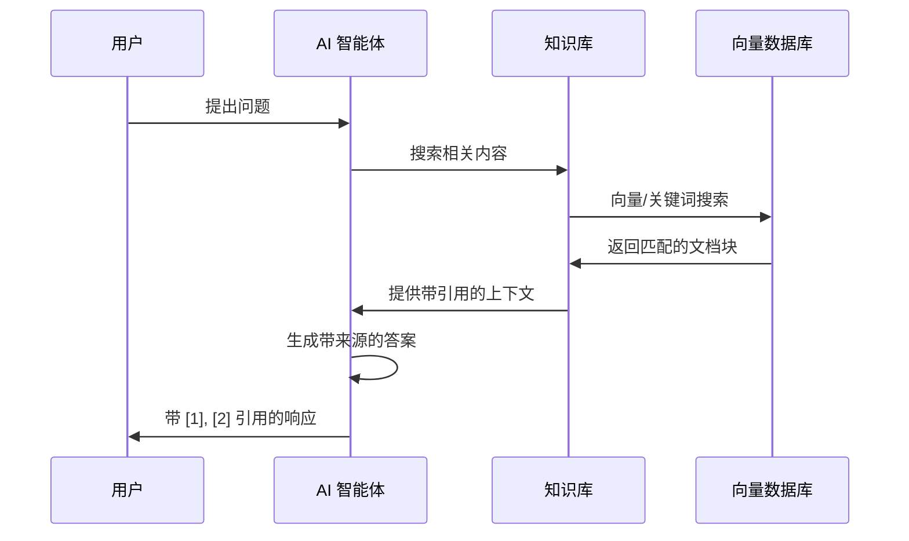

# 使用指南

知识库支持存储、组织和检索文档，实现 RAG（检索增强生成），让 AI 智能体能够基于您的特定文档回答问题。

---

## 📋 目录

- [概述](#-概述)
- [架构说明](#-架构说明)
- [创建知识库](#-创建知识库)
- [知识库类型](./knowledge-base-types.md) - 笔记本模式与经典模式
- [文档管理](./document-management.md) - 上传、编辑、批量操作
- [分块策略](./chunking-strategies.md) - 智能分块、句子分块、语义分块
- [检索配置](#-检索配置)
- [检索测试](#-检索测试)
- [与智能体集成](#-与智能体集成)
- [引用机制](#-引用机制)
- [摘要功能](#-摘要功能)
- [使用限制](#-使用限制)
- [常见问题](#-常见问题)
- [相关资源](#-相关资源)

---

## 🎯 概述

### 什么是知识库？

知识库是一个文档存储和检索系统，支持 RAG（检索增强生成）。它允许 AI 智能体搜索您的文档，并提供基于您特定内容的答案。

### 核心价值

| 价值 | 描述 |
|------|------|
| **有据可依的回答** | AI 基于您的文档回答，而非仅靠通用知识 |
| **来源引用** | 每个答案都包含对源文档的引用 |
| **智能分块** | 针对检索优化的自动文档分割 |
| **灵活检索** | 向量、关键词或混合搜索模式 |

---

## 🏗 架构说明

### RAG 流程

下图展示了 RAG（检索增强生成）的工作原理：



### 关键组件

| 组件 | 用途 |
|------|------|
| **知识库** | 包含文档和检索配置的容器 |
| **文档** | 单个文件或内容项 |
| **文档块** | 为检索优化的文档片段 |
| **检索器** | 搜索后端服务（Elasticsearch/Qdrant） |
| **嵌入模型** | 将文本转换为向量用于相似度搜索 |

---

## 🆕 创建知识库

### 步骤 1：导航到知识库

1. 登录 Wegent
2. 在侧边栏导航到 **知识库** 部分
3. 点击 **创建知识库**

### 步骤 2：配置基本设置

| 字段 | 描述 | 示例 |
|------|------|------|
| **名称** | 显示名称（1-100 字符） | "产品文档" |
| **描述** | 可选描述（最多 500 字符） | "内部产品文档和指南" |
| **类型** | [笔记本或经典](./knowledge-base-types.md) | 笔记本 |

### 步骤 3：配置检索设置

#### 检索器选择

选择已配置的检索器（后端搜索服务）：

| 检索器类型 | 描述 |
|------------|------|
| **Elasticsearch** | 支持向量的全文搜索 |
| **Qdrant** | 专用向量数据库 |

#### 嵌入模型

选择用于向量转换的嵌入模型：

| 模型 | 维度 | 适用场景 |
|------|------|----------|
| `text-embedding-3-small` | 1536 | 通用场景，性价比高 |
| `text-embedding-3-large` | 3072 | 更高准确度 |

#### 检索模式

| 模式 | 描述 | 适用场景 |
|------|------|----------|
| **向量** | 语义相似度搜索 | 自然语言查询 |
| **关键词** | 传统 BM25 文本搜索 | 精确词条匹配 |
| **混合** | 向量 + 关键词组合 | 综合最佳效果 |

#### 检索参数

| 参数 | 范围 | 默认值 | 描述 |
|------|------|--------|------|
| **top_k** | 1-10 | 5 | 返回结果数量 |
| **score_threshold** | 0.0-1.0 | 0.7 | 最低相关度分数 |

---

## ⚙️ 检索配置

### 配置说明

检索配置决定如何从知识库中查找信息：

1. **检索器**：选择后端搜索服务
2. **嵌入模型**：选择文本向量化模型
3. **检索模式**：向量、关键词或混合
4. **参数调整**：top_k、score_threshold 等

### 无 RAG 模式

您可以在不配置检索器的情况下创建和使用知识库。在此模式下，AI 使用浏览工具（`kb_ls`、`kb_head`）来查看文档内容，而不是语义搜索。

---

## 🧪 检索测试

检索测试功能允许您在保存配置前测试检索效果。

### 使用检索测试

1. 在知识库页面点击 **检索测试** 按钮
2. 输入测试查询
3. 选择检索模式（向量/关键词/混合）
4. 调整参数：
   - **score_threshold**：相关度阈值
   - **top_k**：返回结果数量
5. 查看检索结果和相关度分数

---

## 🤖 与智能体集成

### 在对话中选择知识库

与智能体对话时：

1. 点击聊天输入框附近的 **上下文选择器**
2. 从选项中选择 **知识库**
3. 选择您想使用的知识库
4. 发送您的问题

智能体会搜索知识库并提供有据可依的答案。

### 知识库提示模式

#### 严格模式

当您明确选择知识库时，AI **必须** 仅基于知识库内容回答，不能使用通用知识。

#### 宽松模式

当知识库从任务上下文继承时，AI 将知识库作为 **可选资源**，可以回退到通用知识。

---

## 📑 引用机制

### 引用格式

AI 响应包含链接到源文档的编号引用：

```
根据您的产品文档 [1]，该功能的工作方式是...
此外，故障排除指南 [2] 建议...

来源：
[1] product-overview.pdf（第 3 节）
[2] troubleshooting-guide.md（分块 15）
```

### 查看源内容

1. 点击响应中的引用编号
2. 查看原始分块内容
3. 查看周围上下文

---

## 📝 摘要功能

### 文档摘要

启用后，系统会自动为每个文档生成摘要，与文档元数据一起存储，可用于快速参考。

### 知识库摘要

整个知识库的聚合摘要：

- 导航到知识库设置
- 查看所有文档的综合摘要
- 包含核心主题标签
- 支持手动刷新

---

## 📊 使用限制

### 调用限制

为防止过度 API 使用，知识库实现了调用限制：

| 参数 | 范围 | 默认值 | 描述 |
|------|------|--------|------|
| **maxCallsPerConversation** | 2-50 | 10 | 每对话最大知识库搜索次数 |
| **exemptCallsBeforeCheck** | 0-49 | 2 | 限制生效前的免费调用次数 |

---

## ❓ 常见问题

### 上传问题

#### 文件上传失败

**可能原因：** 文件超过大小限制、不支持的文件格式、文件已损坏

**解决方案：** 检查文件大小限制（通常 50MB）、转换为支持的格式、尝试重新导出文档

### 检索问题

#### 没有返回结果

**可能原因：** 查询与文档内容不匹配、分数阈值太高、文档未启用

**解决方案：** 尝试不同的查询措辞、降低 score_threshold、验证文档状态

---

## 🔗 相关资源

- [知识库类型](./knowledge-base-types.md) - 了解笔记本和经典模式的区别
- [文档管理](./document-management.md) - 学习如何管理文档
- [分块策略](./chunking-strategies.md) - 优化文档分块
- [配置检索器](./configuring-retrievers.md) - 设置向量数据库
- [智能体设置](../settings/agent-settings.md) - 配置具有知识库访问权限的智能体

---

<p align="center">用您自己的知识赋能 AI 智能体！ 📚</p>
