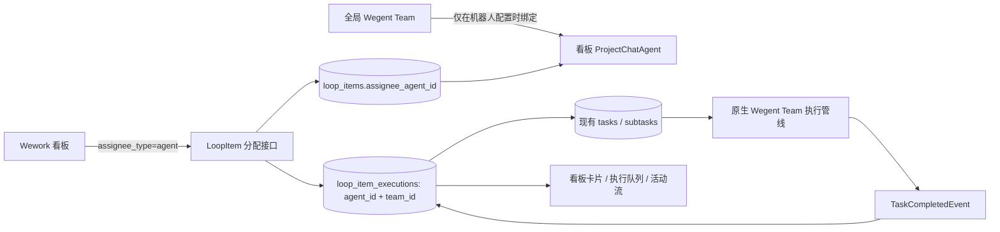
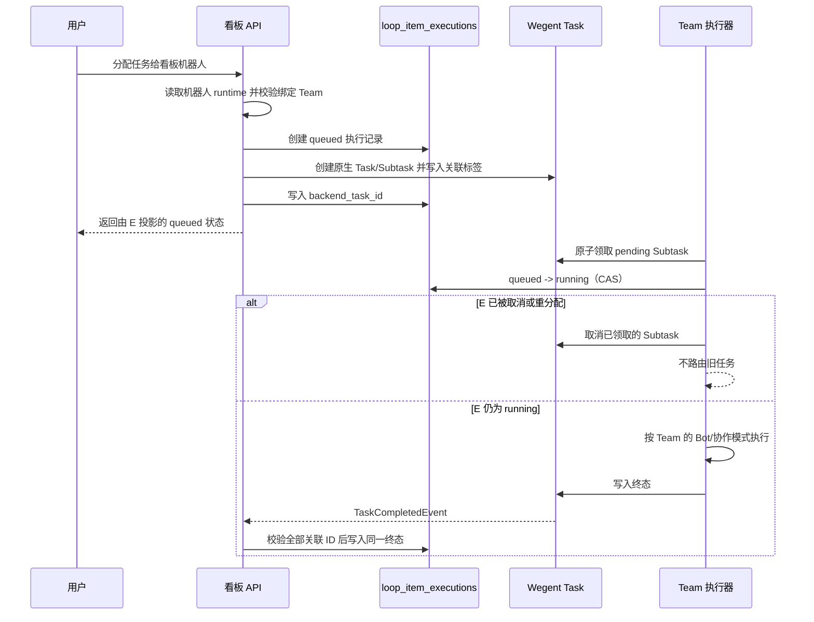

# 云项目协作架构

> UI 与交互实现以 `/Users/hongyu9/Downloads/wework-delivery-v4-TODO.pen` 为当前 V4 设计源，不根据本文重新推导页面布局。

## 目标

云项目是多人共享的协作与存储边界。成员可以在自己的本地项目中选择默认云项目，在 Wework 中执行任务，并把选定的聊天记录、文件和 Markdown 说明作为不可变交付快照提交到云端。

云项目不等同于现有 `Project`：

- `Project` 是单个用户拥有的本地执行工作区，保存设备、路径、Git 和执行配置。
- `CloudProject` 是多人共享的协作聚合根，拥有成员权限、TODO、共享文件和 MinIO 空间。
- 多个成员的本地项目可以分别把同一个云项目保存为默认目标；云项目不保存反向关联。
- 一个 TODO 可以关联多个 Wework Task，但一个 Task 同时最多处理一个活跃 TODO。

## 领域关系

```text
CloudProject
├── ResourceMember(resource_type=CloudProject)
├── ShareLink(resource_type=CloudProject)
└── LoopItem
    ├── LoopItemTaskBinding
    │   └── TaskResource
    │       └── Project (local execution workspace)
    └── Delivery
        └── DeliveryAsset
```

## 数据归属

| 数据                                            | 事实来源             |
| ----------------------------------------------- | -------------------- |
| 云项目、成员、TODO、任务关联、交付元数据        | Backend MySQL        |
| 本地路径、设备、Git、执行配置和默认项目空间引用 | 本地 Codex 项目状态  |
| 共享文件、Markdown、聊天记录、交付快照          | MinIO/S3             |
| AI 对云空间的访问                               | Backend 鉴权后的 MCP |

MinIO 对象使用云项目公开 ID 隔离：

```text
projects/{cloud-project-public-id}/
  shared/
  loop-items/{loop-item-id}/
    deliveries/{delivery-id}/
      markdown.md
      chat.json
      manifest.json
      files/
```

交付完成后，其对象前缀不可覆盖。后续任务只能读取或复制交付物。

## 数据模型

### CloudProject

`cloud_projects` 保存共享项目本身，不保存任何本地执行配置。

```text
id, public_id, project_key, name, description
created_by_user_id, storage_prefix, next_item_number
status, version, created_at, updated_at
```

### 本地项目默认空间

本地 Codex 项目可以保存一个 `{ projectStore, projectId }` 默认项目空间引用。该引用属于设备上的本地项目状态，不进入 Backend，也不向项目空间建立反向索引。新对话发送前可以覆盖或清除这个默认值。

### LoopItem

现有 `loop_items` 作为云 TODO 使用。它通过 `cloud_project_id` 指向 `cloud_projects`，并使用 `sequence_number` 生成 `WEG-18` 形式的展示编号。

固定状态如下：

```text
inbox → pending → in_progress → in_review → completed
```

已完成 TODO 可以重新进入 `in_progress`。更新操作必须携带 `version`，服务端使用乐观锁拒绝静默覆盖。

### 看板任务的机器人与智能体执行

看板负责人只允许项目成员或项目机器人（`ProjectChatAgent`）。Wegent 智能体（`Kind(kind=Team)`）是机器人的 runtime 配置，不是负责人：用户先在当前看板创建机器人，再把执行环境设为 Wegent 并绑定一个可运行的 Team。绑定保存在机器人现有 `metadata_json` 中，不新建表。



`loop_item_executions` 是看板执行状态的唯一事实来源；原生 `tasks/subtasks` 是 Team 内部执行事实。两者通过 `backend_task_id` 和带执行 ID、Subtask ID、Team ID 的标签严格关联。消息和活动记录只做展示投影，不能反向覆盖执行状态。



重分配和停止操作先推进看板执行记录到 `cancel_requested`（尚可能存在真实进程）或 `cancelled`（确认尚未启动），再把取消路由到对应的设备 Runtime 或原生 Team Task。旧工作线程即使稍后领取到消息，也必须重新检查执行记录，不能启动已经取消的运行。

同一任务的执行域始终按看板机器人归属。`agent_id` 决定队列列、分配历史和并发身份，`team_id` 只记录 Wegent runtime 的实际目标；不同任务进入原生 Team 管线后，Team 的协作配置仍决定内部并行度。

### LoopItemTaskBinding

`loop_item_task_bindings` 表达 TODO 与实际 Wework Task 的多对多历史关系。运行时 Task 使用 `task_user_id + device_id + task_id` 标识，因为本地执行 Task 不一定存在于 Backend `tasks` 表；`backend_task_id` 仅作为可选索引。解绑使用 `unlinked_at` 软删除，以保留执行来源审计。

### Delivery

`deliveries` 和 `delivery_assets` 保存不可变快照元数据。`Delivery.source_task_binding_id` 是可空外键：云端直接完成 TODO 时为空，本地任务交付时指向已经验证的 TODO/Task 关联。

## 权限

复用 `resource_members` 和 `share_links`，新增 `CloudProject` 资源类型。

| 角色       | 读取 | 编辑 TODO/文件 | 管理成员 | 归档项目 |
| ---------- | ---- | -------------- | -------- | -------- |
| Reporter   | 是   | 否             | 否       | 否       |
| Developer  | 是   | 是             | 否       | 否       |
| Maintainer | 是   | 是             | 是       | 否       |
| Owner      | 是   | 是             | 是       | 是       |

所有 TODO、交付、文件和 MCP 请求都必须先解析云项目角色。无权限资源统一返回 404，避免泄露资源是否存在。

## 服务边界

```text
cloud_projects/  项目和成员
loop_items/      TODO、状态机和 Task 关联
delivery/        不可变交付快照
cloud_files/     可变共享文件
mcp_server/tools/delivery.py  AI 按权限读取云空间与交付引用
```

Delivery 服务不负责 TODO CRUD；LoopItem 服务不直接访问 MinIO；MCP 不持有或返回 S3 凭证。

## 交付事务

1. 创建 `draft` Delivery 并写入 Markdown/聊天对象。
2. 分批上传文件，记录 SHA-256 和大小。
3. `finalize` 锁定 Delivery 与 LoopItem，验证来源 Task 仍关联当前 TODO。
4. 写入 `manifest.json`。
5. 在一个数据库事务中将 Delivery 置为 `delivered`、TODO 置为 `completed`，并更新 `current_delivery_id`。
6. 数据库提交失败时删除新写入的 manifest，草稿仍可重试。

## API

```text
/v1/cloud-projects
/v1/cloud-projects/{id}/members
/v1/cloud-projects/{id}/members/{user_id}
/v1/cloud-projects/{id}/files
/v1/cloud-projects/{id}/folders
/v1/cloud-projects/files/{file_id}
/v1/cloud-projects/{id}/loop-items
/v1/loop-items/{id}
/v1/loop-items/{id}/tasks
/v1/loop-items/{id}/start-task
/v1/loop-items/{id}/deliveries
/v1/deliveries/{id}
/v1/cloud-work-items/my-work
/v1/runtime-tasks/loop-item
```

### 通过个人 API Key 创建看板和任务

用户可以在保持原有权限和状态规则不变的前提下，通过个人 API Key 调用两个创建接口。支持 `X-API-Key: wg-...`，也支持 `Authorization: Bearer wg-...`；网页登录使用的 JWT 仍然有效。Service Key 不能以用户身份创建看板或任务。

创建看板：

```bash
curl -X POST 'https://<host>/api/v1/cloud-projects' \
  -H 'Content-Type: application/json' \
  -H 'X-API-Key: wg-<personal-api-key>' \
  -d '{
    "project_key": "OPS",
    "name": "运维看板",
    "description": "通过 API 创建"
  }'
```

创建任务时使用上一步响应中的看板 `id`：

```bash
curl -X POST 'https://<host>/api/v1/cloud-projects/<project-id>/loop-items' \
  -H 'Content-Type: application/json' \
  -H 'Authorization: Bearer wg-<personal-api-key>' \
  -d '{
    "title": "检查云端运行状态",
    "description": "保持看板状态为真实状态源",
    "priority": "high",
    "tags": ["api"]
  }'
```

任务创建仍经过看板成员权限、状态定义、Provider 路由和自动化规则校验。未指定 `status` 时进入看板的 `inbox` 状态；指定不存在的状态会返回 `422`，无权访问的私有看板按资源不可见规则返回 `404`。这两个接口是创建语义，不提供 PUT upsert；调用方重试 POST 前应确认前一次请求结果，避免重复资源。

创建与更新使用不同端点，不提供 PUT upsert。共享文件支持创建目录、上传、重命名/移动、短期授权访问和递归删除；移动对象时先复制 MinIO 对象、提交元数据，再删除旧对象，失败时清理新对象。

Wework 把新运行任务加入云项目空间时，使用已有的基础能力组合完成：先创建 `LoopItem`，再绑定运行任务；运行状态变化时先读取任务上下文，再更新对应 TODO。Backend 不提供仅为这条编排流程设计的聚合追踪接口，因此桌面端和 Backend 可以独立发布，同时仍由 TODO 创建、任务绑定和乐观锁更新这三类稳定 API 保证行为一致。桌面端会对同一运行任务的并发关联请求去重；如果绑定临时失败，会复用已创建的 TODO 后重试，避免产生重复卡片。

Wework Composer 把云项目、目录、文件、TODO 和交付编码为 `cloud://` 原子引用。任务携带云项目上下文时注入 Delivery MCP；`resolve_cloud_reference` 在 Backend 再次鉴权并解析引用，客户端和 AI 均不接触 S3 凭证。TODO 看板在窗口可见时周期刷新，写操作仍依赖 `version` 乐观锁处理多人并发。

## 实施顺序

1. CloudProject、成员权限与本地项目关联。
2. LoopItem 迁移到 CloudProject，并补充状态机和乐观锁。
3. Task 关联与从 TODO 开启任务。
4. Delivery 的权限、来源任务和 MinIO 路径迁移。
5. 共享文件与云空间 MCP。
