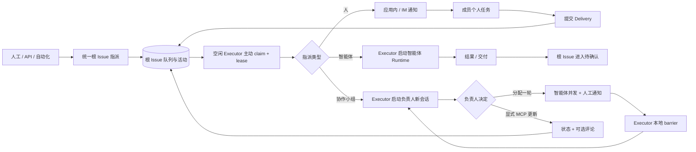
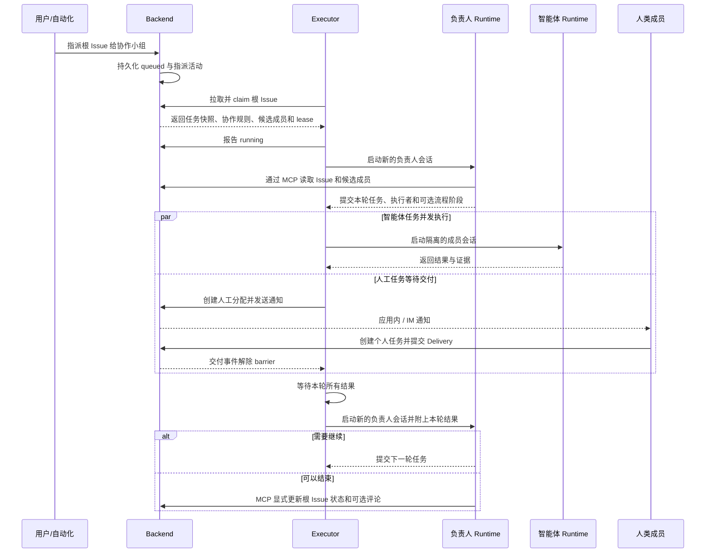
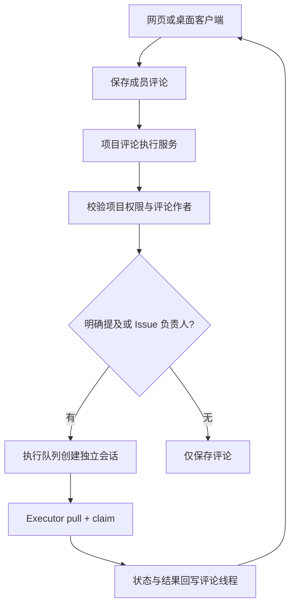
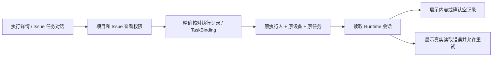

# 云项目协作架构

> UI 与交互实现以 `/Users/hongyu9/Downloads/wework-delivery-v4-TODO.pen` 为当前 V4 设计源，不根据本文重新推导页面布局。

## 目标

云项目是多人共享的协作与存储边界。成员可以在自己的本地项目中选择默认云项目，在 Wework 中执行任务，并把选定的聊天记录、文件和 Markdown 说明作为不可变交付快照提交到云端。

云项目不等同于现有 `Project`：

- `Project` 是单个用户拥有的本地执行工作区，保存设备、路径、Git 和执行配置。
- `CloudProject` 是多人共享的协作聚合根，拥有成员权限、TODO、共享文件和 MinIO 空间。
- 多个成员的本地项目可以分别把同一个云项目保存为默认目标；云项目不保存反向关联。
- 一个 TODO 可以关联多个 Wework Task，但一个 Task 同时最多处理一个活跃 TODO。

## 客户端复用边界

### 执行配置与等待状态

项目设置把协作组织和运行资源分开管理：

- 「协作成员」按“智能体 → 项目成员 → 协作小组”的顺序统一展示可参与项目的人和智能体。协作小组是可复用的协作组织，成员可以是人或智能体，负责人也可以是人或智能体；流程步骤属于协作小组。
- 「自动处理」只定义触发规则：Issue 创建、添加 Tag、外部事件或定时条件发生后，将工作交给指定的项目成员、智能体或协作小组。规则不绑定设备。
- 「执行环境」管理项目可用的设备授权池。智能体创建时不选择设备；空闲 Executor 主动领取与自身项目、智能体和协作小组权限匹配的 Run。

评论中的 Mention 不改变负责人；明确 @ 可用智能体可触发评论执行。Assignment、Mention、Subscription 和 Run 使用独立语义。直接使用“分配”操作才会改变负责人，并在目标为智能体或协作小组时创建对应 Run。

模型身份与提供方参数作为不透明字典传递，不参与接口字段的大小写转换。设备在线状态以连接心跳为准。运行缺少模型或工作区配置时，执行保持 `waiting_runtime`，并通过统一的运行配置入口补齐；设备只在 Executor 成功领取 Run 时绑定。

负责人完成拆分和分派不代表 Issue 已完成。父任务步骤和子任务详情会显示实际子任务的等待状态；缺少模型或工作区时，执行保持 `waiting_runtime`，通过「配置并继续执行」为原执行记录补齐配置。没有授权 Executor 可领取时，Run 保持排队。Backend 不根据容量推送任务，也不要求用户回到智能体中绑定机器。补齐运行配置不会修改项目或智能体默认配置，并保留人工审批要求。步骤通过验收后才计入工作流完成进度。

Wegent Web 将原“待办”入口替换为“协作”，并直接复用云项目、看板 Issue、评论、附件、共享文件、成员和执行记录的 Backend API。Web 与 Wework 不维护第二套领域模型或接口。

跨端通用的类型、API 客户端、文案、测试契约和无宿主依赖的 React 组件位于 `packages/collaboration`。`CollaborationApp` 是 Web 与 Wework 云项目的唯一主界面，统一提供项目首页、看板、Issue 详情、评论、附件、文件、成员、运行记录和项目设置；两端不得再维护并行的云协作页面。

Web 通过宿主适配器提供 Next.js 路由、通知和外链能力。Wework 通过同一适配器注入本地项目存储和“桌面能力”入口；只有本地项目、终端、设备执行、AI 编排等依赖 Electron、本机文件系统或本地执行器的能力可以进入桌面专属工作空间。新增通用能力必须先进入共享包，不能先复制到两个宿主后再同步。

共享包负责业务状态、字段结构和交互契约，但不得复制宿主已经提供的基础设计系统。弹窗、页签、选择器、输入框和主按钮等控件应通过显式 host adapter 注入；共享包仅保留无宿主场景使用的中性默认实现。宿主主题色必须通过语义化 CSS 变量传入，不能在共享组件中硬编码 Web 或 Wework 的品牌色。共享看板的尺寸链必须保持 `min-width: 0`、`min-height: 0` 和纵向 flex 约束，使横向溢出留在看板内部滚动容器，而不是把页面级滚动条顶到内容上方。

「协作成员」设置页需要容纳智能体、项目成员和协作小组的多列表单，因此使用宽内容容器；普通设置页继续使用默认窄容器。协作小组详情中的成员与职责列必须使用可收缩的 `minmax(0, ...)` 网格，并在文本节点上保留 `min-width: 0` 和截断规则，不能通过固定最小列宽把输入框推出面板边界。标题区的操作按钮保持单行显示。

聊天消息进入协作空间时，Backend 根据用户有权访问的源 Task 生成不可变消息快照。目标可以是新建 Issue，也可以是已有 Issue 的评论；客户端不得把聊天正文当作可信快照直接写入目标空间。

## 领域关系

```text
CloudProject
├── ResourceMember(resource_type=CloudProject)
├── ShareLink(resource_type=CloudProject)
└── LoopItem
    ├── LoopItemTaskBinding
    │   └── TaskResource
    │       └── Project (local execution workspace)
    └── Delivery
        └── DeliveryAsset
```

## 数据归属

| 数据                                            | 事实来源             |
| ----------------------------------------------- | -------------------- |
| 云项目、成员、TODO、任务关联、交付元数据        | Backend MySQL        |
| 本地路径、设备、Git、执行配置和默认项目空间引用 | 本地 Codex 项目状态  |
| 共享文件、Markdown、聊天记录、交付快照          | MinIO/S3             |
| AI 对云空间的访问                               | Backend 鉴权后的 MCP |

MinIO 对象使用云项目公开 ID 隔离：

```text
projects/{cloud-project-public-id}/
  shared/
  loop-items/{loop-item-id}/
    deliveries/{delivery-id}/
      markdown.md
      chat.json
      manifest.json
      files/
```

交付完成后，其对象前缀不可覆盖。后续任务只能读取或复制交付物。

## 数据模型

### CloudProject

`cloud_projects` 保存共享项目本身，不保存任何本地执行配置。

```text
id, public_id, project_key, name, description
created_by_user_id, storage_prefix, next_item_number
status, version, created_at, updated_at
```

### 本地项目默认空间

本地 Codex 项目可以保存一个 `{ projectStore, projectId }` 默认项目空间引用。该引用属于设备上的本地项目状态，不进入 Backend，也不向项目空间建立反向索引。新对话发送前可以覆盖或清除这个默认值。

### LoopItem

现有 `loop_items` 作为云 TODO 使用。它通过 `cloud_project_id` 指向 `cloud_projects`，并使用 `sequence_number` 生成 `WEG-18` 形式的展示编号。

固定状态如下：

```text
inbox → pending → in_progress → in_review → completed
```

已完成 TODO 可以重新进入 `in_progress`。更新操作必须携带 `version`，服务端使用乐观锁拒绝静默覆盖。

### Issue 调度与 Executor 所有权

看板 Issue 可以指派给项目成员、智能体或协作小组。人工操作、API、自动化和 AI 管理员只生成同一种根 Issue 调度意图，不直接启动 Runtime，也不维护设备容量。

Backend 只负责持久化和展示根 Issue 的负责人、队列、claim、lease、状态、活动、评论、附件与交付。它校验项目、智能体、协作小组和设备权限，为 Runtime 提供任务范围内的看板 MCP，并接受 Executor 或人类显式提交的状态、评论和交付。Backend 不选择空闲设备、不向设备推送任务、不维护 Executor 容量，也不运行协作小组的负责人循环、成员分配、并发批次或 barrier。

本地与云端 Executor 使用同一个领取协议和同一份看板数据模型。Executor 有空闲执行槽时，主动拉取当前设备有权运行的根 Issue，原子 claim 后启动 Runtime，并在执行期间续租。项目授权多个设备时，各设备竞争领取不同 Run；同一 Run 在有效 lease 内只能被一个 Executor 持有。lease 超时后其他 Executor 可以恢复领取，失去 lease 的旧 Executor 不得继续回写。

#### 三种指派闭环

指派给人时，Backend 发送应用内和已连接 IM 通知。成员从通知创建个人任务并提交 Delivery；Delivery 回写根 Issue。若该人工任务属于协作小组的一轮，交付同时解除该轮 barrier，并唤醒负责人继续评估。

指派给智能体时，Executor 领取根 Issue，按所分配智能体创建 Runtime 会话并执行。结果写入活动与交付，成功后进入 `in_review` 等待用户确认；Backend 不创建或接管内部执行会话。

指派给协作小组时，Executor 领取的仍然只有一个根 Issue。之后的全部协调留在该 Executor 内：

1. Executor 启动一次新的负责人会话。项目协作规则和可选流程作为本轮可见上下文提供，负责人通过看板 MCP 读取 Issue 与候选成员。
2. 负责人可以直接通过 MCP 更新根 Issue 状态并附加评论，也可以提交一轮任务分配。每个分配必须包含任务标题、执行者，以及项目配置流程时对应的流程阶段。
3. Executor 为同一轮中的多个智能体创建彼此隔离的 Runtime 会话并并发执行；人工任务发送通知并等待 Delivery。
4. Executor 在本地维护该轮 barrier。只有本轮所有智能体结果和人工交付都到齐后，才启动新的负责人会话，并把这一轮结果完整交给负责人。
5. 负责人根据结果决定再分配一轮，或通过 MCP 显式把根 Issue 更新为 `in_review`、`completed` 等目标状态，并可同时写评论。成员完成本身不能自动推进根 Issue。

每一轮负责人会话都是新的 Runtime 会话，成员会话也彼此隔离。上一轮只通过结构化任务、结果和交付进入下一轮，不能复用某个成员的对话上下文，也不能由 Backend 猜测负责人下一步。



#### 协作小组执行时序



实现与评审必须满足以下不变量：

1. Backend 只持有根 Issue 的队列、claim、lease、状态和展示投影；不存在 Backend 负责人 loop、成员 fan-out、barrier 或完成后自动续跑。
2. 本地和云端运行使用相同的 claim 协议。设备由 Executor 拉取成功这一事实确定，不能由 Backend 预选或按上报容量推送。
3. 协作小组的负责人和成员会话全部由领取该根 Issue 的 Executor 创建；Backend 只提供 MCP 领域操作和持久化。
4. 同一轮的智能体任务可以并发，不同任务使用不同 Runtime 会话。下一轮负责人必须等待本轮全部智能体结果和人工 Delivery。
5. 负责人每次只分配一轮工作。成员完成只形成结果，不自动修改根 Issue 状态；只有负责人通过 MCP 显式更新状态，且评论文本可选。
6. 人工 Delivery 是正式的轮次结果。协作小组中的人工成员完成交付后必须唤醒负责人，不能要求 Backend 启动或维护负责人循环。
7. 活动流记录真实事件：谁把哪个任务分配给哪个智能体或成员、执行结果、Delivery 和负责人状态变更。展示文本不能用 Issue 标题替代子任务标题。
8. Backend 看板 MCP 与 Wework 本地 Space MCP 共用领域语义，但认证和传输边界独立；远程 MCP 不接受 Runtime 本地文件路径。

### LoopItemTaskBinding

`loop_item_task_bindings` 表达 TODO 与实际 Wework Task 的多对多历史关系。运行时 Task 使用 `task_user_id + device_id + task_id` 标识，因为本地执行 Task 不一定存在于 Backend `tasks` 表；`backend_task_id` 仅作为可选索引。解绑使用 `unlinked_at` 软删除，以保留执行来源审计。

Wework 本地运行时把绑定区分为 `system` 和 `user`。每个运行任务必须保留一个指向 `default-work-items` 的 `system` 绑定；当前交互最多维护一个额外的 `user` 绑定，但存储模型允许后续扩展为多个。读取任务对应 Issue 时优先返回 `user`，没有用户绑定时返回 `system`。运行状态、标题和归档同步只写系统绑定；用户解绑只能软删除用户绑定，不能删除系统绑定。**我的任务** 看板只读取当前未归档运行任务对应的系统 Issue，不聚合其他项目空间的 Issue，也不展示已经离开任务列表的历史系统 Issue。

### Delivery

`deliveries` 和 `delivery_assets` 保存不可变快照元数据。`Delivery.source_task_binding_id` 是可空外键：云端直接完成 TODO 时为空，本地任务交付时指向已经验证的 TODO/Task 关联。

## 权限

复用 `resource_members` 和 `share_links`，新增 `CloudProject` 资源类型。

| 角色       | 读取 | 编辑 TODO/文件 | 管理成员 | 归档项目 |
| ---------- | ---- | -------------- | -------- | -------- |
| Reporter   | 是   | 否             | 否       | 否       |
| Developer  | 是   | 是             | 否       | 否       |
| Maintainer | 是   | 是             | 是       | 否       |
| Owner      | 是   | 是             | 是       | 是       |

所有 TODO、交付、文件和 MCP 请求都必须先解析云项目角色。无权限资源统一返回 404，避免泄露资源是否存在。

## 服务边界

```text
cloud_projects/  项目和成员
loop_items/      TODO、状态机和 Task 关联
delivery/        不可变交付快照
cloud_files/     可变共享文件
mcp_server/tools/delivery.py  AI 按权限读取云空间与交付引用
```

Delivery 服务不负责 TODO CRUD；LoopItem 服务不直接访问 MinIO；MCP 不持有或返回 S3 凭证。

## 交付事务

1. 创建 `draft` Delivery 并写入 Markdown/聊天对象。
2. 分批上传文件，记录 SHA-256 和大小。
3. `finalize` 锁定 Delivery 与 LoopItem，验证来源 Task 仍关联当前 TODO。
4. 写入 `manifest.json`。
5. 在一个数据库事务中将 Delivery 置为 `delivered`、TODO 置为 `completed`，并更新 `current_delivery_id`。
6. 数据库提交失败时删除新写入的 manifest，草稿仍可重试。

## API

```text
/v1/cloud-projects
/v1/cloud-projects/{id}/members
/v1/cloud-projects/{id}/members/{user_id}
/v1/cloud-projects/{id}/files
/v1/cloud-projects/{id}/folders
/v1/cloud-projects/files/{file_id}
/v1/cloud-projects/{id}/loop-items
/v1/loop-items/{id}
/v1/loop-items/{id}/tasks
/v1/loop-items/{id}/start-task
/v1/loop-items/{id}/deliveries
/v1/deliveries/{id}
/v1/cloud-work-items/my-work
/v1/runtime-tasks/loop-item
```

### 通过个人 API Key 创建看板和任务

用户可以在保持原有权限和状态规则不变的前提下，通过个人 API Key 调用两个创建接口。支持 `X-API-Key: wg-...`，也支持 `Authorization: Bearer wg-...`；网页登录使用的 JWT 仍然有效。Service Key 不能以用户身份创建看板或任务。

创建看板：

```bash
curl -X POST 'https://<host>/api/v1/cloud-projects' \
  -H 'Content-Type: application/json' \
  -H 'X-API-Key: wg-<personal-api-key>' \
  -d '{
    "project_key": "OPS",
    "name": "运维看板",
    "description": "通过 API 创建"
  }'
```

创建任务时使用上一步响应中的看板 `id`：

```bash
curl -X POST 'https://<host>/api/v1/cloud-projects/<project-id>/loop-items' \
  -H 'Content-Type: application/json' \
  -H 'Authorization: Bearer wg-<personal-api-key>' \
  -d '{
    "title": "检查云端运行状态",
    "description": "保持看板状态为真实状态源",
    "priority": "high",
    "tags": ["api"]
  }'
```

任务创建仍经过看板成员权限、状态定义、Provider 路由和自动化规则校验。未指定 `status` 时进入看板的 `inbox` 状态；指定不存在的状态会返回 `422`，无权访问的私有看板按资源不可见规则返回 `404`。这两个接口是创建语义，不提供 PUT upsert；调用方重试 POST 前应确认前一次请求结果，避免重复资源。

创建与更新使用不同端点，不提供 PUT upsert。共享文件支持创建目录、上传、重命名/移动、短期授权访问和递归删除；移动对象时先复制 MinIO 对象、提交元数据，再删除旧对象，失败时清理新对象。

Wework 把新运行任务加入云项目空间时，使用已有的基础能力组合完成：先创建 `LoopItem`，再绑定运行任务；运行状态变化时先读取任务上下文，再更新对应 TODO。Backend 不提供仅为这条编排流程设计的聚合追踪接口，因此桌面端和 Backend 可以独立发布，同时仍由 TODO 创建、任务绑定和乐观锁更新这三类稳定 API 保证行为一致。桌面端会对同一运行任务的并发关联请求去重；如果绑定临时失败，会复用已创建的 TODO 后重试，避免产生重复卡片。

Wework Composer 把云项目、目录、文件、TODO 和交付编码为 `cloud://` 原子引用。任务携带云项目上下文时注入 Delivery MCP；`resolve_cloud_reference` 在 Backend 再次鉴权并解析引用，客户端和 AI 均不接触 S3 凭证。TODO 看板在窗口可见时周期刷新，写操作仍依赖 `version` 乐观锁处理多人并发。

## 实施顺序

1. CloudProject、成员权限与本地项目关联。
2. LoopItem 迁移到 CloudProject，并补充状态机和乐观锁。
3. Task 关联与从 TODO 开启任务。
4. Delivery 的权限、来源任务和 MinIO 路径迁移。
5. 共享文件与云空间 MCP。

## 项目成员与评论执行

智能体的配置可见性决定成员能否主动选择该智能体，不决定成员能否继续参与已经授权的 Issue 工作。具有评论权限的 Developer 成员可以回复项目内 AI 评论，无须取得执行者的设备或模型权限。

- 回复已有 AI 评论线程：保存回复并引用原活动，但不要求 Backend 续跑原 Runtime 会话。需要执行时，创建新的根 Issue Run，由 Executor 领取。
- 新增顶层评论：明确 @ 的可用智能体优先，否则使用 Issue 当前负责的智能体；通过根 Issue 队列创建独立 Run，保留审批与等待配置状态。
- 没有负责智能体且没有 @ 智能体：仅保存评论。评论重试不会因随后更换负责人而意外触发执行。
- 明确 @ 其他智能体仍须检查配置可见性；评论不会修改 Issue 的负责人。



客户端通过 `wework:project_chat:comment:execute` 提交项目、Issue、已保存评论 ID 和附件 ID，不提交设备配置。后端使用评论锁和已有响应记录避免重复创建 Run；失败需回显，已保存评论不重复提交。Backend 只持久化可领取的执行意图，Executor 领取后创建 Runtime 会话。

针对性验证覆盖成员看不到管理员智能体时的新 Run、新评论独立会话、负责人变化、重复请求、普通评论，以及跨项目、只读成员、他人评论等拒绝路径。桌面回归纳入现有 `collaboration-shared-core` 场景；E2E 仅在明确要求时运行。

### 项目执行会话的读取权限

执行详情和 Issue 任务对话通过 `projectSession: { projectId, issueId }` 声明读取上下文。HTTP transcript 与 Socket.IO transcript 使用同一校验：项目 Reporter 及以上权限、Issue 存在、精确匹配设备和任务的执行记录或有效 TaskBinding，并解析唯一原执行人。请求中的工作区路径和 Runtime Handle 不能扩大读取范围。个人会话继续校验个人设备所有权；项目读取不开放执行人的设备目录、模型凭据或其他会话。



历史执行结果与会话读取状态独立。读取失败不得显示为“没有对话记录”，也不能据此宣称执行器确认未运行。首次读取展示骨架屏；设备实际离线时保留错误与重试入口，不切换到成员同名设备。自动化回归包含成员读取管理员会话；默认只执行针对性单元测试，E2E 需明确要求。

HTTP transcript 响应必须保留 Runtime 的 `turns`、`running`、`origin`、`historyUnavailable` 和 `turnNavigation`，与 Socket.IO 读取契约一致。缺少 `turns` 是协议错误，不能用空列表替代已有会话。
