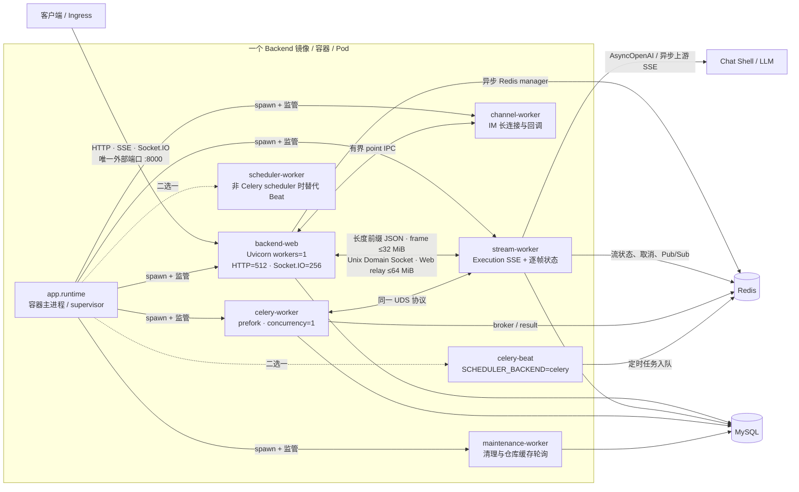
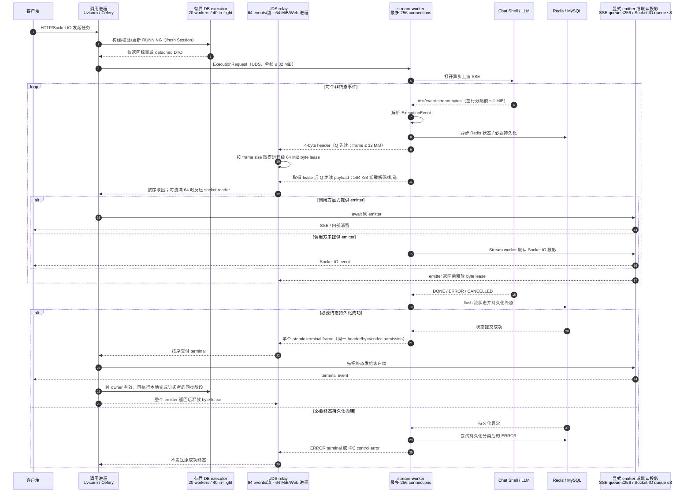

# Backend 单 Worker 隔离架构与风险评估

## 核心结论

Backend 仍然是一个镜像、一个容器、一个 Pod、一个分布式节点，对外仍只监听
`8000`。变化发生在容器内部：`app.runtime` 用 Python `multiprocessing` 的
`spawn` 模式监管不同职责的子进程，唯一 Uvicorn worker 不再执行上游 SSE
消费、逐帧状态持久化和定时轮询；本次已审计热路径中的同步
SDK/数据库调用进入具名有界执行器。FastAPI 的自动 JSON、请求/响应模型校验、
表单解析、同步依赖/端点、同步 background task 和同步响应迭代器也已纳入严格版本
锁定的有界执行器。本文仍将 Pod 级逐帧 events/s admission、用户在 `async def` 中
直接执行的未知同步代码，以及非终态状态延迟 flush 失败后的 batch 丢失列作残余风险。

验收标准不是“增加了一个 Stream 进程”，而是下面这条不变量：

> 唯一 Uvicorn 事件循环只执行成本有硬边界的路由、协议编排和异步转发；任何
> 可能变慢的同步数据库、Redis、第三方 SDK、文件/仓库 I/O、JSON 投影和流式
> 状态处理，都必须在独立进程、具名有界执行器或真正的异步 I/O 边界中运行。

“非阻塞”不等于“请求一定很快”。下游数据库或 SDK 卡住时，当前请求仍可能等待、
超时或因容量耗尽失败，但它不能占住 Uvicorn 事件循环，也不能进入无界的
`ThreadPoolExecutor` 队列。

## 范围与不变项

- HTTP、SSE、Socket.IO/WebSocket 的端口、URL 和客户端协议不变。
- Redis、MySQL、Celery broker/result backend 和现有取消/状态语义不变；流 block
  新增有 TTL 的用量计数 key，旧活跃流没有该 key 时会先做有界测量，首次新写入时
  原子补齐，因此不要求清 Redis 或停机迁移。
- 不新增 Deployment、Service、网关、Redis Streams、事件重放或第二套任务模型。
- 每个 Pod 的 Stream worker 只服务本 Pod；UDS 不跨 Pod，集群仍按 Backend Pod
  扩容。
- `ExecutionDispatcher` 的 `SSE`、`HTTP_CALLBACK`、`POLLING` 和 `INPROCESS`
  执行、取消、恢复和状态投影全部走本地 Stream worker；只有明确指定本地设备的
  `WEBSOCKET` 控制消息由 Web 转发，设备返回的逐帧事件立即送入 Stream worker。
- 保留原 emitter 契约：调用方未提供 emitter 时，Stream worker 执行默认
  Socket.IO 投影；调用方显式提供 SSE/订阅 emitter 时，只把事件中继给该 emitter，
  不额外广播 Socket.IO。
- 普通 HTTP 流式代理可以继续在 Web 进程中使用异步 `httpx` 原样转发；只有包含
  上游事件解析、逐帧状态和终态持久化的 Execution SSE 进入 Stream worker。

## 单镜像进程拓扑



默认 `SCHEDULER_BACKEND=celery` 时，supervisor 创建六个具名角色：Web、Stream、
Channel、Maintenance、Celery Worker、Celery Beat。Celery Worker 自身采用 `prefork` 且
`concurrency=1`，因此系统进程列表可能还会看到它的池子进程；“六个角色”不等于
严格只有六个 OS 子进程。非 Celery scheduler 只替换 Beat，普通 Celery Worker
仍然存在。

| 角色 | 负责 | 明确不负责 |
| --- | --- | --- |
| `backend-web` | 鉴权、路由、全局请求体 admission、已列入的 codec 解析、UDS relay、客户端 SSE/Socket.IO、Web 本地终态业务事件和具名执行器 | 上游 Execution SSE、逐帧 Redis 状态、Stream 终态数据库持久化；Uvicorn loop 不直接执行同步 SDK/DB/I/O |
| `stream-worker` | 上游 SSE/图片 SSE 路径、事件解析、取消检查、逐帧 Redis、终态数据库状态、UDS 事件返回 | 外部端口、客户端连接、Web 本地订阅者 |
| `channel-worker` | DingTalk/Telegram/Discord/Weibo 等持久 IM provider 生命周期与回调 | Uvicorn lifespan、外部 HTTP 端口 |
| `maintenance-worker` | `start_background_jobs()` 中的清理和仓库维护循环 | Uvicorn lifespan 内的轮询 |
| `celery-worker` | 原 Celery 队列任务，prefetch 1，soft/hard time limit | Uvicorn 内嵌线程 |
| `celery-beat` / `scheduler-worker` | 现有定时触发 | Uvicorn 内嵌线程 |
| `app.runtime` | 启动、故障联动、信号和分层退出 | 业务请求 |

## Execution SSE 逐帧数据流



`StatusUpdatingEmitter` 先 flush 流状态并持久化必要终态，只有这些调用成功返回，
终态才会进入 Stream worker 的暂存 emitter；上游 dispatch 和 close 路径返回后，
再用一个 `terminal` 帧交给 Web。这既消除了“普通终态帧 + 稍后 complete 帧”的
协议竞态，也使必要终态持久化 fail-closed：原 `DONE`/`ERROR`/`CANCELLED` 的持久化
抛错时不会转发该原终态，dispatcher 会尝试生成并持久化分类后的 `ERROR`；若这次
持久化也失败，只返回 IPC control error，不会伪造成功终态。atomic frame 仍不是
所有周边副作用的通用 durability ACK：context metrics 等明确的 best-effort 写入，
以及已经捕获终态后的 close 异常，仍按各自策略记录。Web 对有效终态的顺序是先
调用原 emitter，若能解析出合法 owner，再尝试发布一次本地 `TaskCompletedEvent`；
客户端转发不会被业务完成回调排在后面。

取消有三条路径：Web shutdown admission 拒绝新流；Redis 取消标记每秒轮询一次并
结合 Stream 进程本地 `asyncio.Event`；客户端/调用方关闭 UDS 时，Stream 立即取消
对应 execution task。取消标记的既有 TTL 为 300 秒。UDS disconnect 触发的
`CancelledError` 会先进入 status-owning dispatcher，等待 `emit_cancelled()` flush
流状态并持久化数据库 `CANCELLED`，然后才允许上游 task unwind 和 socket close。
因此正常断连已有明确状态收敛；若数据库/Redis 本身不可用或进程遭到 SIGKILL，
持久化仍可能失败，必须由告警和既有对账机制处理，不能宣称外部存储故障下也有
durability 保证。

进程隔离不代表调用进程从此“不看每一帧”。显式 emitter 路径的每个事件仍要在
Web 或 Celery 完成 IPC frame 解码、`ExecutionEvent` 构造、64 项/流 relay drain 和
原 emitter；默认 Socket.IO 路径由 Stream worker 直接投影，不重复广播。区别是逐帧状态 Redis/数据库已
归 Stream，Web 剩余 codec、队列和网络等待都有硬边界，不再执行已知同步 DB/SDK。
当前没有 Pod 级 events/s admission；大量小帧虽然单帧成本小且内存受反压约束，
累计调度、inline 小包 codec 和 client fan-out 仍可能耗尽唯一 Web loop 的 CPU。
Web 与 Stream 的本地传输使用 UDS，不为每帧新增 Redis 队列或 Pub/Sub；既有 Stream
状态写和 Socket.IO 跨 Pod publish 仍照常发生。因此拆分不改变 Redis key/业务语义，
也不会凭空消除原有 Redis ops/s；高事件率仍需按状态写、发布和各子进程独立连接池
计算 Redis 容量。

## 有界容量与背压

### 流与协议边界

| 边界 | 当前硬边界 | 满载行为 |
| --- | ---: | --- |
| Web HTTP/SSE 并发检查 | `WEB_MAX_CONCURRENCY=512` / Pod | Uvicorn 在普通 HTTP 请求路径超限返回 `503`；当前 WebSocket upgrade 发生在该检查之前，不受它硬限制 |
| Socket.IO session | `WEB_MAX_WEBSOCKET_CONNECTIONS=256` / Pod | Engine.IO 在创建 session 前返回 `503` + `Retry-After: 1`，为 HTTP 保留容量余量 |
| Stream 并发连接 | 256 / Pod | 返回 `stream_worker_overloaded`，不回退到 Web 执行 |
| Stream listener backlog | 256 | 由 Unix socket 排队，随后受连接 admission 限制 |
| 上游 SSE 未分隔事件 | 空行分隔前最多 1 MiB（1,048,576 bytes），跨 transport chunk 计数 | 超限在 OpenAI SDK 解析和 IPC 之前抛出 `SSEEventTooLargeError`，当前执行进入错误终态路径 |
| IPC 单帧 | 32 MiB，4 字节长度头 | 拒绝非法或超限帧 |
| IPC Web relay 数量 | 64 个事件 / 流 | `await queue.put()`，反压该流的 socket reader 和 Stream writer |
| IPC Web relay 字节 | 64 MiB / Web 进程，按 header 声明的 encoded frame size 预留 | 先读 4-byte header，取得 byte lease 后才读/解码 payload；所有流共享预算，emitter 完成后才释放 |
| 通用 `QueueBasedEmitter` | 256 个事件 / emitter | 生产者等待，不丢帧、不无限增长 |
| IPC codec | 4 workers / 8 in-flight / 256 waiters | 提交前异步等待；编码始终卸载，解码/`ExecutionEvent` 构造在 `>=64 KiB` 时卸载 |
| SSE client codec | 4 workers / 16 in-flight | SSE 序列化异步等待具名池容量 |
| Stream 文本状态缓冲 | 每流 262,144 个字符或 1 秒即 flush；activity touch 最快每秒一次 | 慢 Redis 反压当前流；边界/tool/terminal 强制 flush，不逐 token 写 Redis |
| 聚合逐帧 client delivery 速率 | 当前无 Pod 级 events/s admission | 每流 relay 64、emitter 256 及连接上限控制内存并逐级反压，但不能保证任意事件率下的 Web latency |
| Socket.IO 入站消息/解码 | 单消息 1,000,000 字节；payload codec 阈值 64 KiB | 大 Socket.IO packet JSON 在 codec 池解码，小包在严格大小边界内 inline；Engine.IO transport framing 仍受单消息上限约束 |
| Socket.IO 入站 handler | `async_handlers=False`；同连接顺序执行 | 接收路径等待 handler，不为每个事件创建 background task；跨连接并发最多来自 256 个已接纳 session |
| Engine.IO participant 出站队列 | 8 packets / client；put 最多等待 1 秒 | 队列持续满时主动断开慢客户端并清空队列 |
| Socket.IO 出站 packet / Redis envelope | 1,000,000 字节 / 2 MiB | 编码后超限即拒绝，不进入客户端队列或 Redis channel |
| Stream heartbeat | 每 5 秒；客户端 20 秒超时 | 无后续 frame/heartbeat 时当前流明确失败 |
| IPC connect / first frame / write | 3 秒 / 10 秒 / 20 秒（worker 首帧 5 秒） | 返回可分类的 unavailable/timeout 错误 |

256 个连接是 Stream 进程总额，Web、Celery 和 readiness ping 共享。已有流占满时，
`/api/ready` 的 ping 也会收到 overload 并返回 `503`，使该 Pod 停止接收新流量；这是
容量信号，不是 liveness 重启信号。

IPC 路径同时有每流事件数量、Web 进程 encoded bytes 总额和单帧大小上限，因此
不会形成逻辑上的无界队列；
通用 `QueueBasedEmitter` 只限制事件数，单项大小仍由上游协议边界约束。
旧的 `32 MiB × 64 × 256` 不再是 Web relay 可保留 encoded payload 的上界：Web
先读 4-byte header，再按声明的 frame size 从全进程 64 MiB 预算取得 lease，之后才
读取和解码 payload；lease 贯穿排队与 `await emitter.emit()`，只在客户端 emitter
返回或失败清理时释放。因此慢客户端和大事件会反压所有共享该预算的流，而不会把
encoded relay payload 无界留在内存。64 MiB 账本不包含 JSON 解码后的 Python 对象
放大、`asyncio`/kernel socket transport buffer 和客户端协议自身队列；32 MiB 也仍是
单帧兼容性上限而非正常事件预算。上线必须观察事件大小、lease 等待和 Pod RSS，
不能用“有上限”替代容量测量。
32 MiB IPC 上限约束 OpenAI SDK 解析后生成的内部事件帧；更早的
`BoundedSSEByteStream` 已在 `text/event-stream`
字节流上跨 chunk 计算当前事件，并在空行分隔前超过 1 MiB 时拒绝。因此未分隔的
上游事件不再能先于 IPC 无界增长，但 `1 MiB × 256 streams`、SDK 对象放大和 socket
buffer 仍需要纳入 Pod RSS 实测。

Socket.IO 的 `256 sessions × 8 packets × 1,000,000 bytes` 理论乘积也接近 2 GiB，
还未计 Python/Engine.IO 对象和 transport buffer。1 秒慢客户端断开策略限制持续
积压时间，却不能把瞬时最坏值当成可忽略；Pod memory limit 必须根据真实 packet
分布设置，而不是把“有限”理解成“足够小”。

### 进程内具名有界执行器

`BoundedExecutor` 在调用提交到 Python `ThreadPoolExecutor` 之前取得容量。容量用尽
时协程异步排队；默认 waiter 上限是 `max_in_flight × 4`，连 waiter 也满时明确
抛出 `BoundedExecutorOverloaded`，不继续增长。调用方被取消后，只要同步函数仍在
运行，容量就不会提前释放。因此不会出现“请求取消了，但后台线程仍运行，
同时槽位被重复使用”的超卖。这些 executor 是进程内实例，不是容器全局
共享池：Web、Stream 或 Celery 子进程只要 import 对应模块，就会拥有自己的容量账本和
惰性启动的线程。表中数字因此是“每个实例”而非“每 Pod 总量”。
唯一例外是 IPC codec 为了匹配 256 个 Stream 连接硬上限，显式把 waiter 设为 256，
而不是使用默认的 32。

| 职责池 | workers / max in-flight | 典型工作 |
| --- | ---: | --- |
| DB | 20 / 40 | SQLAlchemy、业务终态、fresh Session 事务 |
| 通用 payload codec | 2 / 8 | JSON/递归 payload 投影；`>=64 KiB` 或自定义对象卸载 |
| FastAPI 同步依赖/端点 | 32 / 32（waiters 128） | 普通同步 dependency、yield enter、同步 endpoint；yield cleanup 另有预留池 |
| FastAPI form | 4 / 4（waiters 8） | multipart/urlencoded parser、`UploadFile` I/O、Form DTO 校验；cleanup 4 / 4 |
| 同步 response background | 32 / 32（waiters 0） | Starlette `BackgroundTask(s)` 中的同步 callable |
| 同步 response iterator | 32 / 32（waiters 0） | `StreamingResponse` 的同步 iterable；cleanup 4 / 32 |
| Repository | 4 / 8 | GitHub/GitLab/Gitee/Gitea/Gerrit 同步 HTTP |
| Knowledge | 4 / 8 | 本地 RAG、存储、同步上游验证 |
| MCP tool | 4 / 8 | FastMCP 同步工具和显式同步准备阶段 |
| Execution I/O | 4 / 8 | 图片/视频持久化、broker 和执行副作用 |
| Device I/O | 2 / 4 | 同步设备控制网络调用 |
| Rate-limit I/O | 2 / 8 | 同步限流存储 |
| URL metadata I/O | 4 / 8 | DNS、同步缓存和 HTML 解析 |
| DingTalk SDK | 4 / 16 | 同步 SDK；同一 card/owner 由锁保持顺序 |
| Callback Redis event codec | 2 / 16 | callback event JSON 编码 |
| Attachment upload / blocking I/O | 2 / 4、4 / 8 | 上传、解析、存储和数据库阶段 |
| Archive storage | 4 / 8 | workspace archive 存储 |
| Schedule recovery / dispatch | 5 / 10、5 / 20 | 定时恢复和同步 dispatch 入口 |

职责池互相隔离：例如仓库服务变慢不会耗尽 DB 池，DingTalk SDK 卡住也不会占用
payload codec。同步线程不能被 Python 强杀；超时只停止等待，实际调用返回前仍占用
原槽位，这是保持真实容量账本的必要行为。

## Web 热路径隔离现状

### 请求体与 JSON

`RequestBodyLimitMiddleware` 在 FastAPI/Pydantic 自动解码之前覆盖所有带 body 的
HTTP 请求，同时校验 `Content-Length` 和 chunked body，超限返回 `413`。普通
non-multipart 请求默认最多 16 MiB，并在通用 payload codec 中合并；multipart 按
`max(DELIVERY_MAX_ASSET_SIZE_MB, MAX_UPLOAD_FILE_SIZE_MB) + 16 MiB` 限制且逐 chunk
转发，不由中间件预聚合，通用默认上限为 2064 MiB；附件两条上传路由使用更小的
exact limit，见下图和表格。

Web 进程还共享一层请求体 admission：最多 128 个已接纳请求；non-multipart 的
预留字节合计最多 64 MiB，缺少 `Content-Length` 时按该路由的完整上限预留；multipart
只占请求槽，不占这 64 MiB 字节账本，并额外受最多 4 个 streaming multipart 请求的
进程级 admission 约束。任一 admission 满时返回 `503` 和 `Retry-After: 1`。使用
所有 FastAPI API route 都由显式 `IsolatedAPIRoute` 适配器覆盖。自动 JSON 解码、
path/query/header/cookie 与 request/response model 校验编码进入 payload codec；同步
dependency、yield enter/exit 和同步 endpoint 进入具名 Web executor。适配器安装幂等，
并以 FastAPI 0.124.0、Starlette 0.50.0 及源码 SHA fail-fast；不是全局 monkeypatch。

```mermaid
flowchart LR
    Client[HTTP 客户端] --> Raw[ASGI raw body limit]
    Raw -->|Content-Length/chunked 超限| Reject413[413]
    Raw --> General[请求 admission<br/>最多 128 · non-multipart 64 MiB]

    General --> Json[non-multipart 有界聚合]
    Json --> Payload[Payload codec<br/>JSON + request DTO]

    General --> Multipart[multipart admission<br/>最多 4]
    Multipart --> Receive[Uvicorn loop<br/>只逐 chunk receive]
    Receive --> Form[Form executor 4 / 4<br/>parser.write/finalize]
    Form --> Spool[IsolatedUploadFile spool<br/>write/seek/read/close]
    Spool --> FormDTO[Form DTO 校验<br/>同一有界 form executor]

    Payload --> Business[async 业务编排<br/>或具名同步 endpoint executor]
    FormDTO --> Business
    Business -->|知识/RAG/Web scraper| AuthDB[wegent-db<br/>鉴权 + DB 准备 · 自有 Session]
    AuthDB --> AsyncIO[async 网络 I/O<br/>不持有 Session]
    AsyncIO --> KnowledgeIO[wegent-knowledge-io<br/>RAG/文档/同步 SDK]
    KnowledgeIO --> PersistDB[wegent-db<br/>结果持久化 · 新 Session]
    PersistDB --> ResultCodec[Payload codec<br/>响应 DTO]
    ResultCodec --> Response
    Business --> Response[响应发送]
    Response --> Background[同步 background<br/>32 槽预 admission]
    Response --> SyncIterator[同步 stream iterator<br/>32 槽预 admission]

    Multipart -->|满载：读 body 前| Reject503[503 · Retry-After 1]
    Form -->|executor/lease 满载| Reject503
```



| API | 单请求 raw body 上限 |
| --- | ---: |
| `/api/internal/callback` | 1 MiB |
| `/api/internal/callback/batch` | 4 MiB |
| `/api/tasks/{id}/prompt-drafts/generate/stream` | 512 KiB |
| `/api/v1/deep-research` 及其 status/stream | 512 KiB |
| `/api/wizard/test-prompt/stream` | 1 MiB |
| `/api/model-runtime/responses` | 16 MiB |
| `/api/runtime-work/llm-responses-proxy/responses` | 16 MiB |
| `/api/v1/responses` | 16 MiB |
| `/api/attachments/upload`、`/api/v1/attachments/upload` | `MAX_UPLOAD_FILE_SIZE_MB + 1 MiB` multipart envelope；默认 101 MiB，流式读取 |
| 其他 non-multipart HTTP body | 16 MiB |
| 其他 multipart HTTP body | 动态配置；当前默认 2064 MiB，流式读取 |

全局 raw-body 和聚合 admission 阻止请求数/预聚合字节无界增长；普通自动 JSON 与
Pydantic 路由也不再在 Web loop 解码或验证。multipart 不在中间件内预聚合，网络
receive 仍在 loop 逐 chunk 前进，但 python-multipart 的 `write/finalize`、spool 文件
`write/seek/read/close` 及 Form DTO 校验全部进入 4 槽专用执行器；它与 4 槽 streaming
multipart admission 对齐，并为异常/取消清理预留独立容量。最多 4 个 multipart 的
合计在途临时存储仍不计入 64 MiB non-multipart 账本，因此 Pod memory/disk 仍需预算。

附件路径的网络边界已经前移：`/api/attachments/upload` 和
`/api/v1/attachments/upload` 的 raw multipart 上限等于配置的 100 MiB 业务文件上限
加固定 1 MiB 表单 envelope。已知超限 `Content-Length` 在读取 body 和进入 Starlette
前直接 `413`；缺少/伪造长度的 chunked body 则由包装后的 `receive` 逐 chunk 累计，
超过同一上限时抛 `RequestBodyTooLargeError(413)`。只有取得 4 槽 multipart lease 的
请求才能进入 Starlette parser/`UploadFile` spool，lease 在整个 downstream 请求结束
后释放；业务 worker 仍保留 100 MiB 文件内容校验，形成网络 raw body 与实际文件的
两层边界。

### Socket.IO

- Engine.IO 入站消息硬上限为 `1,000,000` 字节。自定义
  `_BoundedAsyncServer._handle_eio_message()` 通过通用 payload codec 构造 Socket.IO
  packet 和拼装二进制附件：达到 64 KiB 阈值或含自定义对象时卸载，小包只在严格
  大小预算内 inline。依赖库更外层的 Engine.IO transport framing 仍在 Web loop，
  但不能越过单消息上限。
- 由应用控制的出站 JSON、Redis Pub/Sub 解码、跨 Pod 二进制拆装和 Engine.IO packet
  预编码也走通用 payload codec；单个出站 packet 最大 1,000,000 字节，Redis manager
  message 最大 2 MiB，本地每个 participant 的 packet 顺序保持不变。
- Chat namespace 的入站 Pydantic 校验强制进入 payload codec；Wework project-chat
  的 camelCase 归一化和校验也在同一有界边界执行。
- `socketio.AsyncServer` 明确设置 `async_handlers=False`。接收协程等待业务 handler
  完成，同一连接的事件按序处理，事件洪泛不会变成每事件一个 background task；
  不同连接仍可并发，但 Engine.IO `_handle_connect()` 在创建 session 前执行独立
  admission，`WEB_MAX_WEBSOCKET_CONNECTIONS` 默认最多接纳 256 个 Socket.IO session。
  超限返回 `503` 和 `Retry-After: 1`。这层检查补上了 Uvicorn 在
  `limit_concurrency` 检查之前执行 WebSocket upgrade 的缺口，并为普通 HTTP 留出
  相对默认 512 总配置的容量余量。Backend 的有界 Server 在不改变该入站调度策略的
  前提下实现出站 `call()` ACK 等待，Runtime RPC 因此不依赖 background handler。
- 单次本地 fan-out 最多并行 32 个 participant send task，完成一部分后再继续创建。
  每个 participant 的 Engine.IO queue 最多 8 个 packet；enqueue 等待超过 1 秒时，
  服务端以 transport error 主动关闭该 client 并清空队列。应用内队列因此有硬界限，
  代价是慢客户端会断线且可能漏掉实时推送，恢复仍依赖已有持久化状态。
- Redis manager 使用真正的异步 Redis；publish 最多等待 5 秒。超时会把连接标记为
  stale 并沿用 manager 的 best-effort 语义，不会同步卡住 Web loop。
- 跨 Pod Socket.IO 仍使用现有 Redis channel；没有增加新的流式 Redis 队列。

### Executor callback 与 IM callback

`/api/internal/callback` 还具有第二层业务 admission：

- 单批最多 100 个事件，全进程最多 128 个已接纳事件；超载返回 `503` 和
  `Retry-After: 1`。
- 64 条 task-order lock stripes 保证同一任务全处理链顺序，同时避免为历史 task
  永久保存 lock。
- 解析器有 4 个 shard，每 shard 1 个 worker、最多 8 个 in-flight；容量满立即
  `503`，不会进入无界解析队列。
- 非终态 callback 不打开数据库 Session；终态 owner 查询在 DB executor 的 fresh
  Session 中完成，Session 在任何异步 emit 之前关闭。
- Channel callback descriptor 最大 256 KiB；正/负查询缓存最多 4096 项，负缓存
  30 秒。
- 每种 channel 最多缓存 4096 个 active emitter，使用 64 条 lock stripes；emitter
  TTL 30 分钟，清理每 30 秒最多处理 32 个，逐帧路径不做全表扫描。

DingTalk 的同步 SDK 下载、回复和 AI Card 操作进入独立 4/16 池，并按 owner/card
串行；常用等待预算为 15 秒。Telegram 使用 SDK 的原生异步网络接口，并显式设置
connect/read/write/pool timeout；其数据库阶段仍使用 DB executor。IM 通用 handler
只在同步 worker 内创建 Session，返回 ID 或 detached DTO 后才恢复异步回复、Redis
和 dispatch，禁止跨 `await` 携带 ORM/Session。

### MCP、数据库及其他同步 I/O

FastMCP wrapper 对同步工具统一使用 4/8 的 MCP 池；异步工具中的数据库/Redis 同步
准备阶段也必须显式进入 MCP、DB 或 Execution I/O 池。结果 JSON 通过 payload codec
序列化。Repository、local RAG、图片/视频附件、设备版本检查、URL metadata、归档等
Web 可达路径按职责使用上表的独立池。

数据库 worker 自己创建、提交/回滚并关闭 Session，只把标量、dataclass 或普通 dict
带回事件循环。事件总线的同步 subscriber 也进入有界 DB executor；从同步上下文投递
到主循环最多保留 100 个 pending publish，容量耗尽时明确抛出
`EventBusOverloaded`。

静态架构测试扫描全部 `backend/app/**/*.py` 的 `async def`。当前语法规则禁止直接
构造 `SessionLocal`、`redis.Redis/from_url`，并禁止 `requests`、DNS、subprocess、
`time.sleep`、`asyncio.to_thread`、默认 executor 和 framework 隐式 threadpool 等已列
调用。Uvicorn 开始接流量前执行的 lifespan 初始化是唯一明确 allowlist。该 AST guard
是基于调用名的语法护栏，不能识别已注入同步对象的方法、动态调用或第三方函数内部的
隐藏阻塞，所以仍需故障注入和代码审查。

## 生命周期

1. `app.runtime` 以 `spawn` 创建所有角色；创建顺序先 Stream 再 Web/Maintenance/Celery，
   但 `Process.start()` 顺序本身不是 readiness barrier。
2. Stream worker 监听 `STREAM_WORKER_SOCKET_PATH`，删除合法的旧 socket，设置权限
   `0600`。
3. Web 子进程不是只检查文件存在，而是在 30 秒启动预算内完成真实 `ping/pong` IPC
   往返后才让 Uvicorn 绑定 `8000`。
4. Celery 子进程也在 30 秒启动预算内执行同一个真实 `ping/pong` barrier，成功后
   才调用 `worker_main()` 开始消费。即使 broker 在冷启动前已有会进入 SSE route 的
   任务，也不会在 Stream IPC ready 前被这个子进程消费；进程创建顺序不再承担该
   正确性职责。
5. `/api/ready` 是 async route：数据库 `SELECT 1` 进入有界 DB executor，然后在 1
   秒预算内执行真实异步 UDS ping；Stream 不响应时返回 `503`。`/api/health`
   是存活检查，不等价于数据库或 Stream readiness。
6. 任一必要角色异常退出，supervisor 返回非零并终止其余角色，Kubernetes 按原 Pod
   策略重启；不存在 Web-only 降级或在 Web 内执行 SSE 的 fallback。
7. SIGTERM 后 Web 先关闭新流 admission，等待已登记流至
   `GRACEFUL_SHUTDOWN_TIMEOUT`；超时则通过原 Redis 取消语义取消。
8. Supervisor 先终止并等待 Web/Celery/Maintenance/Scheduler 消费方，最后才终止
   Stream provider；全组共享一个关闭 deadline，超时后强杀仍存活进程。
9. 公共 `/shutdown/initiate|wait|reset` 已移除，关闭状态只能由进程生命周期改变。

Pod 重启时仍会断开当前本地流；本次没有实现跨 Pod 迁移或事件重放。

## 部署影响

### 必须变更

- 四组 Backend（预览、内测、正式、外网）都发布同一个新 Backend 镜像。
- 镜像默认命令已经是 `python -m app.runtime`。若 Deployment 显式覆盖了 `command`
  或 `args` 并直接启动 `uvicorn app.main:app`，必须删除覆盖或改为 runtime；否则所有
  隔离都会被绕过。
- 本地根目录 `start.sh`、`backend/start.sh`、standalone 脚本、E2E 和 CI 入口均以
  `app.runtime` 启动；根目录开发启动不再使用 Uvicorn `--reload`。

### 无需变更

- Frontend、Chat Shell、Executor、Knowledge Runtime 镜像和协议。
- Ingress、Service、外部端口、HTTP/SSE/WebSocket URL。
- 数据库 schema、现有 Redis key 的值格式、Celery broker/result backend。新增的
  `chat:streaming:blocks_usage:*` 只是 1 小时 TTL 的内部计数，不要求预建或迁移。

### 配置与探针

- 新增可选 `STREAM_WORKER_SOCKET_PATH`，默认
  `/tmp/wegent-stream-worker.sock`；通常无需配置，路径必须在容器内可写且不能跨 Pod
  共享。
- 新增可选 `CHANNEL_WORKER_SOCKET_PATH`，默认
  `/tmp/wegent-channel-worker.sock`，约束与 Stream UDS 相同。
- 删除 `EMBEDDED_CELERY_ENABLED`；Celery 生命周期不再由 Uvicorn lifespan 控制。
- 新增 `WEB_MAX_CONCURRENCY`，默认 `512`，作为 Uvicorn 普通 HTTP/SSE 请求路径的
  并发检查；容量不足时应扩 Pod 或调整这个显式值，不能通过移除上限隐藏过载。
  当前 Uvicorn WebSocket upgrade 先于该检查，所以 Socket.IO 另由新增的
  `WEB_MAX_WEBSOCKET_CONNECTIONS` 硬限制，默认 `256`。Settings 启动校验强制
  `0 < WEB_MAX_WEBSOCKET_CONNECTIONS < WEB_MAX_CONCURRENCY`，非法配置直接导致
  启动失败；部署仍需按预期 HTTP headroom 配置两者差额。
- 继续使用现有 `HOST`、`PORT`、`SCHEDULER_BACKEND` 和
  `GRACEFUL_SHUTDOWN_TIMEOUT`。Kubernetes
  `terminationGracePeriodSeconds` 应大于该 timeout，并预留 supervisor 收尾时间。
- Readiness 应使用 `/api/ready` 才能覆盖真实 Stream IPC；只探测 `/health` 不能发现
  启动后的 Stream hang。Readiness 失败只会摘流量，不会自动重启一个仍存活的 Pod。

### 资源变化

- 增加多个 Python 解释器、Celery prefork 子进程和各职责线程池的常驻内存；表中
  executor 容量按导入该模块的进程分别计算。
- Web、Stream、Maintenance 和 Celery 各自惰性创建数据库/Redis/HTTP 客户端，连接
  不能跨进程共享；数据库与 Redis 连接预算要按 Pod 数重新核算。
- 进程隔离消除了同一事件循环/GIL 热路径干扰，但所有角色仍共享 Pod cgroup。CPU
  limit 太小或发生内存压力时，内核节流/OOM 仍会同时影响 Web。
- 一个 Stream 进程服务本 Pod 全部 SSE。Stream 内出现未知同步阻塞会暂停该 Pod 的
  所有流，但 Web 探针和普通请求保持可用；这正是故障域从 Web 移到 Stream 的含义，
  不是对 Stream 吞吐的无限保证。

默认配置会在每个 Backend Pod 启动一个 Beat。当前代码使用 Celery
`PersistentScheduler`，并未由本次改动提供全局 Beat 单例；多 Pod 定时触发与原有
应用锁/幂等能力是独立的分布式调度问题，不是 Web-loop 隔离的 fallback，也不能在
文档中假定所有任务天然去重。

## 故障模式与风险清单

| 场景 | 当前行为 | 运维含义 |
| --- | --- | --- |
| Stream 启动失败/UDS 路径非法 | Web 不绑定端口；角色退出触发全 Pod 失败 | 明确重启，不提供错误的 Web-only 服务 |
| 启动时 broker 已有 SSE Celery 任务 | Celery 在调用 `worker_main()` 前完成真实 Stream `ping/pong`；30 秒内未 ready 则子进程启动失败并触发全 Pod 失败 | 不会在 UDS ready 前消费；仍需保留“ping 先于 consume”的顺序测试，不能退回仅检查 socket 文件或依赖 import 时序 |
| Web/Socket.IO admission 配置非法 | Settings 对非正数或 WebSocket 上限不小于 Web 总上限抛出启动错误 | 修正为 `0 < WEB_MAX_WEBSOCKET_CONNECTIONS < WEB_MAX_CONCURRENCY`；不带错误容量继续服务 |
| Stream 进程退出 | Supervisor 终止全组并非零退出 | Kubernetes 重启当前 Pod，其他 Pod 不受影响 |
| 滚动发布时 Redis 中仍有旧格式活跃流 | 新 Stream worker 在 128 blocks、单块/总字节硬上限内测量旧状态；首次写入在同一 WATCH 事务中建立用量计数 | 无需清 Redis；超出新硬上限的旧异常状态会明确失败，不能继续无界读取 |
| Stream 活着但事件循环 hang | 已有流在 heartbeat timeout 后失败；`/api/ready` 为 503，Web loop 仍可服务 | Readiness 只摘流量；若要求自动恢复需由现有平台重启策略处理 |
| 超过 256 个本地流 | 明确 overload 错误，无 Web fallback | 调整 Pod 数/上游并发，不能把压力重新塞回 Uvicorn |
| 大量已接纳流持续发送小帧 | Web 仍逐帧 decode、drain、client emit；队列会反压但没有总 events/s admission | 不会形成无界 backlog，却可能 CPU 饱和并抬高普通 HTTP 延迟；按实测 FPS 扩 Pod 或限制事件频率 |
| 少量大事件或慢 emitter 占满 64 MiB relay byte budget | frame lease 直到整个 emitter 返回才释放；其他流读完 4-byte header 后等待同一全局预算 | 内存有界但存在跨流反压；监控 lease 等待、客户端发送延迟与公平性，不能只观察每流 64 项队列 |
| Stream 后台状态 flush 的 Redis 写失败 | 延迟 flush 先移出当前 batch，异常只记录且不会把该 batch 放回缓冲；实时 client frame 可继续 | 页面刷新恢复内容可能缺段；必须告警并验证既有业务对账/重建能力，不能把实时可见等同于已持久化 |
| Socket.IO participant 很慢或断网 | fan-out task 窗口 32；每 client queue 最多 8 packet，enqueue 1 秒仍阻塞则断开并清空 | 内存不会因应用 packet queue 无界增长；客户端会丢失实时连接，恢复依赖持久化状态 |
| 并发大 Socket.IO 入站包 | 单包最多 1,000,000 字节；大 Socket.IO packet 解码进 codec，Engine.IO transport framing 仍在 loop 内但有硬界限 | 用真实协议压测确认上限内的最坏 loop 延迟，不能只测业务 Pydantic |
| Socket.IO 入站事件洪泛 | `async_handlers=False` 使同连接顺序执行并反压读取；不同连接最多 256 个 session 并发 | 不再每事件创建无界 task，但多连接仍能耗尽下游有界池；监控 handler 延迟与 overload |
| Socket.IO 连接洪峰 | Engine.IO 在第 257 个 session 前返回 `503` + `Retry-After: 1`，不依赖 Uvicorn upgrade 检查 | 连接/FD/应用 queue 有硬上限，并为 HTTP 留出默认 256 的配置差额；调用方必须退避或连其他 Pod |
| 合法大帧/大 body 并发 | 单项有上限，non-multipart 受 128 请求/64 MiB admission，codec 工作按策略卸载 | 仍需监控 frame/body 分布、RSS、OOM 和入口并发 |
| 上游 SSE 长时间不发事件分隔符 | `BoundedSSEByteStream` 跨 chunk 计数，并在当前事件超过 1 MiB 时于 SDK 解析和 IPC 前抛错 | 当前流进入错误处理而不会无界聚合；仍要按并发流、SDK 对象放大和共享 cgroup 压测 RSS |
| 普通 JSON route | raw body 默认最多 16 MiB 且受聚合 admission；自动 JSON/request/response Pydantic 阶段强制进入 payload codec | codec 满载 fail-fast `503`；仍需监控 DTO 对象放大和 CPU，而不是让工作回退到 loop |
| multipart 洪峰 | 每请求逐 chunk receive；最多 4 个 streaming multipart，parser/UploadFile/Form DTO 共用 4 槽专用池并有有限 waiters/清理预留 | 第 5 个并行 multipart 或 form 容量耗尽返回 `503`；仍按最多 4 个在途 body 的临时存储、内存、磁盘和连接做预算 |
| 同步 background/同步响应 iterator 洪峰 | 响应发送前分别取得 32 槽 lease；同步 callable/`next()` 只进入具名池，取消后等待已提交步骤并关闭 iterator | 容量耗尽可在 response start 前返回 `503`，不会发送半个响应后才发现默认池过载 |
| 附件上传超过配置文件上限 + 1 MiB envelope | `/api/attachments/upload` 与 `/api/v1/attachments/upload` 的 `Content-Length` 在下游前 `413`；chunked body 在 receive wrapper 累计超限时 `413` | 超限 raw body 不会完整进入 Starlette spool；后置 100 MiB 文件校验仍负责区分 multipart envelope 与实际文件内容 |
| DB/同步 SDK 永久卡住 | 线程槽位保持；新调用异步等待或超时，不阻塞 loop | 池可耗尽但不超卖；需依赖下游 timeout/告警恢复 |
| 必要终态数据库/Redis 持久化失败 | 原终态不会进入 IPC emitter；dispatcher 尝试持久化分类后的 `ERROR`，再次失败则只返回 IPC control error | 客户端不会收到伪成功终态；仍需告警并对账无法写入外部存储的任务 |
| Web/UDS 在终态前断开 | Stream 取消上游，并在 task unwind/socket close 前等待流状态 flush 和数据库 `CANCELLED` 持久化 | 正常断连会收敛状态；外部存储故障或 SIGKILL 仍需告警与对账，不能被协议顺序掩盖 |
| Socket.IO Redis publish 超过 5 秒 | 本地 emit 已执行；跨 Pod publish best-effort 失败并重连 | 远端客户端可能漏单次推送，状态恢复仍依赖既有持久化 |
| callback parser/admission 满 | `503` + `Retry-After: 1` | 上游必须尊重重试；不会无界堆积 |
| UDS/HTTP payload 超限 | IPC 明确错误或 HTTP `413` | 调用方修正 payload，不自动截断协议事件 |
| SIGKILL / termination grace 太短 | 无法完成分层 drain | 保证 Kubernetes grace 大于应用 timeout |
| 多 Pod Beat | 可能重复产生周期扫描消息 | 继续依赖明确的调度部署约束和任务级锁，不能归因于 Stream 拆分；这是次要调度风险，不改变 Web/Stream 隔离收益 |

## 验证清单

以下是交付门槛，不应以单个单元测试代替全量验证：

- [x] 静态 AST guard 对全部 Backend async 代码通过，且无默认 executor/
  `asyncio.to_thread` 回流。
- [x] UDS ping、request/event 往返、帧上限、过载、首帧/heartbeat/write timeout、
  client disconnect、终态原子性和取消竞态测试通过。
- [x] 在上游发送超过 1 MiB、且 delimiter 跨 chunk 或一直缺失的 SSE 数据时，验证
  transport 在 SDK 解析和 IPC 前抛出 `SSEEventTooLargeError`，边界内事件仍原样通过。
- [x] 真正 `spawn` 的 Stream 进程保持 30 个事件的数量、顺序和 offset。
- [x] 真正单 worker Uvicorn 在 100 路、每路 30 event/s 时，合成 `/probe` 的 p99
  小于 100 ms；该测试是实际进程/网络测试，但不是完整生产 Backend 压测。
- [ ] 从基线逐步提高流数和小帧 events/s，找出唯一 Web loop 的饱和点；证明 relay/
  emitter/Socket.IO 队列只反压、不无界增长，并把容量模型落到每 Pod 可承载 FPS。
- [ ] 以多个大 frame 和慢/失败 emitter 验证 Web 所有流的 encoded lease 合计不超过
  64 MiB：预算满后只读 header、不读 payload，整个 emitter 返回后才释放，取消或
  异常会释放当前及队列中全部 lease。
- [x] Stream 进程内故意 `time.sleep(1)` 时，单 worker Uvicorn `/probe` 最大延迟
  小于 100 ms。
- [x] DB、payload、Socket.IO、callback、IM/MCP、Redis session codec 的容量耗尽与
  阻塞故障注入证明 loop 仍可调度。
- [ ] 用不读取的真实 WebSocket 验证每 client Engine.IO queue 固定为 8，enqueue
  超过 1 秒后断开并清空，RSS 不随推送数无界增长。
- [ ] 用并发 1 MB Socket.IO JSON/二进制入站包压测唯一 Web loop，验证 Socket.IO
  packet codec 卸载和 Engine.IO transport framing 的最坏延迟，不只验证 handler
  内的 Pydantic。
- [ ] 用同连接和多连接事件洪泛验证 `async_handlers=False` 保持连接内顺序、不创建
  每事件 background task，并确定跨连接 handler 容量。
- [ ] 用真实 WebSocket/long-polling 连接洪峰验证第 257 个 Socket.IO session 收到
  `503` + `Retry-After: 1`、既有 256 个 session 不被误删，并记录 HTTP 探针、FD/RSS
  曲线以验证 headroom。
- [ ] 配置测试证明 Web/Socket.IO admission 任一非正或 WebSocket 上限大于等于 Web
  总上限时 Settings 启动失败，合法关系正常启动。
- [x] 验证所有 HTTP body 均受默认/路由/multipart 上限、128 请求/64 MiB non-multipart
  admission 和 4 槽 multipart admission；所有 FastAPI route 的自动 JSON、表单、
  request/response DTO、同步 dependency/endpoint/background/response iterator 均有具名
  有界执行器和版本/source contract 故障注入。
- [ ] 对 `/api/attachments/upload` 和 `/api/v1/attachments/upload` 从 socket 发送超限
  multipart（含 chunked、伪造/缺失 `Content-Length`），证明 raw 上限为
  `MAX_UPLOAD_FILE_SIZE_MB + 1 MiB`，并在完整进入 FastAPI/Starlette spool 前返回
  `413`；并行第 5 个 multipart 在读 body 前返回 `503` + `Retry-After: 1`。
- [ ] 注入 `DONE`/`ERROR`/`CANCELLED` 必要持久化失败，验证原终态不被转发；分类后
  `ERROR` 能持久化时只发送错误终态，再次失败时只发送 IPC control error，绝不伪造
  成功终态。
- [ ] 注入非终态 Stream 状态 flush 的 Redis 失败，验证丢失 batch 的告警、页面刷新
  语义和恢复机制，不将实时 client delivery 误当成 refresh state 已落盘。
- [ ] 在终态前强制断开 Web/UDS，验证上游被取消，且 `emit_cancelled()` 的 flush 与
  数据库 `CANCELLED` 提交先于 task unwind/socket close；另注入存储故障验证告警和
  对账路径。
- [ ] `/api/ready` 必须完成真实 Stream ping，Stream 不响应时返回 `503`；公共关闭
  mutation route 返回 `404`。
- [ ] 让 broker 在冷启动前预置 SSE Celery 任务，证明 Celery 在真实 Stream ping 成功
  前不消费；不能用通常较慢的 Celery import 时序代替 barrier 测试。
- [ ] Supervisor 角色异常退出、正常信号、消费方先于 Stream 退出和强杀 deadline
  测试通过。
- [ ] Backend 与 shared 全量测试、启动脚本语法、Compose 配置和单镜像构建通过。

```bash
cd backend
uv run pytest -q \
  tests/architecture/test_web_event_loop_isolation.py \
  tests/test_runtime.py \
  tests/test_runtime_entrypoints.py \
  tests/integration/test_stream_runtime_local.py \
  tests/services/execution/test_stream_client.py \
  tests/services/execution/test_sse_transport.py \
  tests/services/execution/test_status_updating_emitter.py \
  tests/core/test_blocking_work.py \
  tests/core/test_payload_codec.py \
  tests/core/test_request_body_limit.py \
  tests/core/test_request_json.py \
  tests/core/test_socketio.py \
  tests/api/endpoints/internal/test_internal_callback.py \
  tests/services/channels/test_callback_cache.py \
  tests/services/chat/storage/test_db_executor_capacity.py \
  tests/services/chat/storage/test_session_codec_boundaries.py \
  tests/mcp_server/test_mcp_tool_nonblocking.py

uv run pytest -q -rs
cd ../shared && uv run pytest -q
cd ..
bash -n start.sh backend/start.sh docker/standalone/start.sh
docker compose -f docker-compose.yml -f docker-compose.build.yml config --quiet
docker build -f docker/backend/Dockerfile \
  -t wegent-backend-stream-runtime:test .
```
