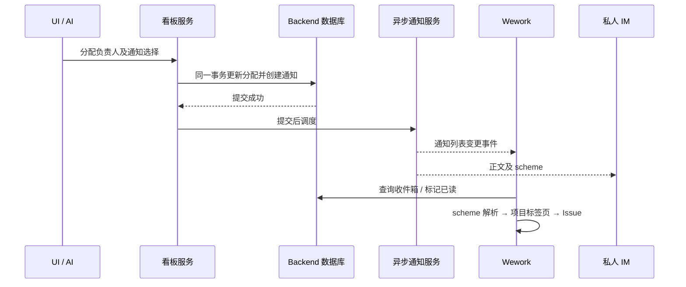

# Wework 通知与跳转

右上角反馈按钮旁的铃铛显示通知和未读数。点击通知会标为已读，并打开对应的看板 Issue。通知保存在 Backend，重新登录、切换设备或断线后仍可查看。

人工分配负责人时可以选择“通知对方”或“不通知”；保存分配后生效。按负责人分组拖动 Issue、新建 Issue 时指定负责人也使用此选择。重复分配给同一人不会重复通知。普通自分配不通知；AI 将任务交回当前用户时会通知。

通知会同时尝试推送到收件人已连接的私人 IM 会话。IM 不可用不影响已经保存的站内通知。通知不会改变 IM 当前正在继续的任务。

首批支持 Backend 看板。内置 `wework-notifications` 技能通过 `wework_space.send_notification` 发送通知；省略收件人表示通知当前认证用户，指定收件人时必须是同一项目成员。例如：“如果验收失败，就通过内置通知我”。AI 分配负责人默认通知，无须再单独发送一遍；明确要求不通知时使用 `notify_assignee: false`。

## Scheme 地址

| 地址                                          | 目标             |
| --------------------------------------------- | ---------------- |
| `wework://boards/{projectId}`                 | Backend 看板     |
| `wework://boards/{projectId}/issues/{itemId}` | 看板 Issue       |
| `wework://tasks/{deviceId}/{taskId}`          | 指定设备上的任务 |

每个地址段使用 URL 编码。应用内 Markdown 链接、通知入口和 Electron 外部唤起共用相同的目标解析。安装包注册 `wework` 协议；应用未启动时保留地址，待登录及工作台就绪后处理。访问目标仍需正常项目权限，链接不会执行命令、切换服务器或授予访问权限。

原生地址在 Electron 进程中排队，导航后才确认移除。界面重挂载或等待登录不会提前消费地址。

## 实现边界

通知读取和已读操作按收件人隔离。版本冲突回滚分配及通知，回滚事务不调度发送。WebSocket 和 IM 是提交后的独立投递；应用会在重新连接、打开通知及周期刷新时重新查询数据库。
