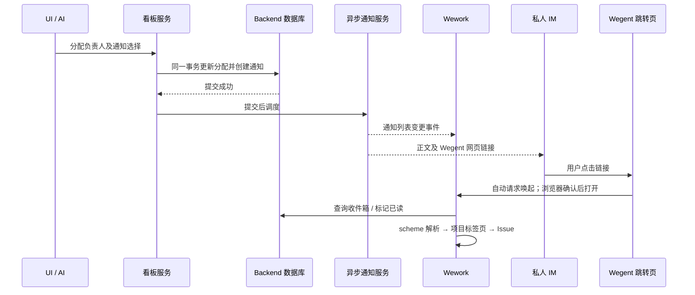

# Wework 通知与跳转

右上角反馈按钮旁的铃铛显示通知和未读数。点击通知会标为已读；有关联地址时打开对应目标，没有地址时保留当前页面及通知内容。通知保存在 Backend，重新登录、切换设备或断线后仍可查看。

人工分配负责人时可以选择“通知对方”或“不通知”；保存分配后生效。按负责人分组拖动 Issue、新建 Issue 时指定负责人也使用此选择。重复分配给同一人不会重复通知。普通自分配不通知；AI 将任务交回当前用户时会通知。

通知会同时尝试推送到收件人已连接的私人 IM 会话。IM 不可用不影响已经保存的站内通知。通知不会改变 IM 当前正在继续的任务。

通知是 Wework 用户级能力，不依赖项目或看板。连接 Backend 后，在普通对话中说“给我发个通知，说你好”即可通过内置 `wework-notifications` 技能调用 `wework_space.send_notification`，将“你好”保存到自己的收件箱。省略收件人表示通知当前认证用户，无须提供项目或 Issue。项目和 Issue 仅作为可选来源；有关联来源时校验项目权限并生成跳转地址。给其他用户发通知仍需指定双方所属的 Backend 项目，以校验收件权限。例如：“如果验收失败，就通过内置通知我”。AI 分配负责人默认通知，无须再单独发送一遍；明确要求不通知时使用 `notify_assignee: false`。

通知点击目标通过可选 `url` 指定，与项目来源独立。例如“给我发个你好的通知，然后点击打开看板页面”使用 `{ "title": "你好", "body": "你好", "url": "wework://boards" }`。收到通知时页面不变，点击后打开看板首页；不需要指定项目。显式地址优先于来源生成的地址。

## 从钉钉等 IM 打开 Wework

IM 通知中的链接指向 Wegent 网站的 `/launch/wework?destination=...` 页面；运行任务更新也携带对应任务的链接。网页校验目标后自动请求启动已安装的客户端，无需先点击页面按钮；在浏览器提示中确认即可。每个目标只自动请求一次，取消后可点击页面按钮再次打开。网页无需登录，目标资源的权限仍由客户端校验。如果钉钉限制唤起应用，请在系统浏览器打开该网页。

跳转页应用名称由前端运行时环境变量 `RUNTIME_WEWORK_APP_NAME` 配置，默认 `Wework`；例如内网可设为 `Weibo WeWork`，重启前端后生效。此变量只影响网页文案；浏览器确认框中的名称取决于本机 `wework://` 协议关联的应用。

部署时将 Backend 的 `FRONTEND_URL` 配置为收件人可访问的 Wegent 网站地址（生产环境使用 HTTPS）。`/launch/wework` 必须路由到 Wegent 前端；不要将它路由到独立 Wework 网站。通知原始目标仍保存为 `wework://...`，网页和客户端复用同一解析器，只接受下表中的目标。

## Scheme 地址

| 地址                                          | 目标                     |
| --------------------------------------------- | ------------------------ |
| `wework://boards`                             | 看板首页（无需绑定项目） |
| `wework://boards/{projectId}`                 | Backend 看板             |
| `wework://boards/{projectId}/issues/{itemId}` | 看板 Issue               |
| `wework://tasks/{deviceId}/{taskId}`          | 指定设备上的任务         |

每个地址段使用 URL 编码。应用内 Markdown 链接、通知入口和 Electron 外部唤起共用相同的目标解析。安装包注册 `wework` 协议；应用未启动时保留地址，待登录及工作台就绪后处理。访问目标仍需正常项目权限，链接不会执行命令、切换服务器或授予访问权限。

原生地址在 Electron 进程中排队，导航后才确认移除。界面重挂载或等待登录不会提前消费地址。

Issue 跳转在详情实际打开后才标记为已处理。等待项目数据期间或父组件重新渲染取消了待执行操作时，跳转请求会保留，避免点击通知后只显示看板而未打开详情。

## 实现边界

通知读取和已读操作按收件人隔离。版本冲突回滚分配及通知，回滚事务不调度发送。WebSocket 和 IM 是提交后的独立投递；应用会在重新连接、打开通知及周期刷新时重新查询数据库。

## 数据库存储

通知表所有字段均非空，字段带注释，索引采用 `idx_` 前缀。无跳转地址在数据库中保存为空字符串；`is_read` 表示已读状态，`read_status_changed_at` 记录状态变更时间。接口仍以 `url: null` 表示无跳转，以 `read_at: null` 表示未读。迁移保留已有通知、跳转地址和实际已读时间；重复标记已读不会覆盖首次已读时间。
