# 项目执行状态真实性重构

> 实现状态：代码、自动化回归与隔离桌面实机验证已完成，等待代码评审和人工验收。
>
> 硬约束：不新建数据库表。本次只扩展已有 MySQL/SQLite `loop_item_executions`，并继续使用已有 `loop_items`、`project_chat_messages` 和 Automation Run。

## 1. 目标与范围

本次解决的不是枚举命名，而是“用户能否拿到可证明的真实状态”。覆盖 project robot 和 automation manager 在 cloud/local Runtime 上的队列、启动、事件、取消、恢复、重试及其 UI 投影。

`TaskResource`/`Subtask` 运行仍以已有 `tasks`/`subtasks` 为自己的权威，不复制到 `loop_item_executions`；本文不声称将两类运行模型合并。

必须满足：

- claim 只证明控制面领取，不能证明 Runtime 已运行。
- Start 可能送达后，不能因超时把同一 Attempt 重新排队。
- 心跳只续控制 lease，不能单独证明进程仍在运行。
- 无法确认时显示 `unknown`，不能猜成失败、成功或可重试。
- Runtime 终态按 Attempt 身份和单调事件序号进行 CAS。
- 取消意图和“Runtime 已停止”是两个状态。
- 运行失败重试必须创建新的已有表行，旧 Attempt 永远保留。
- GET 只读；消息和缓存状态不能反向覆盖执行事实。

## 2. 权威、投影与连线

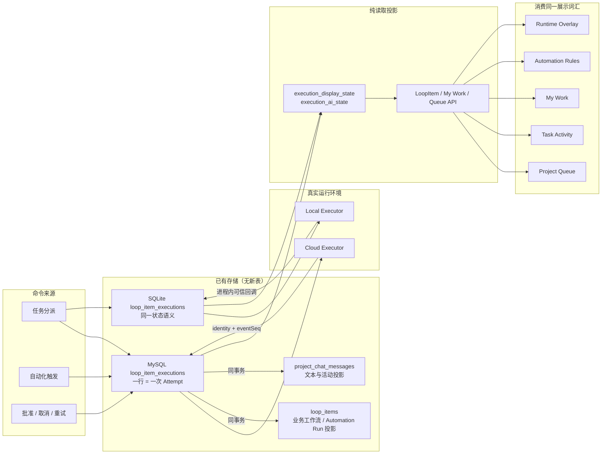

连接方向是单向的：Execution → Message/Automation/Workflow 投影。Message、`metadata.ai_state`、看板列和 UI 不能反向决定 Execution。

## 3. 零新表数据模型

已有 `loop_item_executions` 的一行就是一个 Attempt。迁移只增加列和普通索引 `idx_exec_scope_status`，没有 `CREATE TABLE`；本地 SQLite 在已有同名表上做 `ALTER TABLE`，schema version 升为 6。

| 维度 | 字段 | 语义 |
| --- | --- | --- |
| 控制状态 | `status` | `pending_approval`、`queued`、`claimed`、`running`、`cancel_requested`、`completed`、`failed`、`cancelled` |
| Runtime 观察 | `observed_state`、`observed_at` | `unconfirmed`、`accepted`、`running`、`succeeded`、`failed`、`cancelled` 及最后证据时间 |
| 同步健康 | `sync_state` | `pending`、`in_sync`、`stale`、`diverged` |
| Attempt 因果 | `attempt_no`、`previous_execution_id` | 第几次执行及其上一次 Attempt |
| 并发域 | `execution_scope` | project robot 按任务，manager 按 Automation Run 隔离 |
| Start 围栏 | `claimed_at`、`start_requested_at` | 区分“安全释放的领取”和“可能已送达 Runtime 的启动” |
| Runtime 身份 | `runtime_device_id`、`runtime_task_id` | task id 固定为 `codex-queue-{execution.id}`；服务层严格校验 |
| 事件围栏 | `last_event_seq` | 只接受更大的 Runtime 事件序号 |
| 取消/终止 | `cancel_requested_at`、`termination_reason` | 取消意图时间与已确认终止原因 |
| 控制租约 | `heartbeat_at`、`lease_expires_at` | dispatcher/claim 存活性，不等于 Runtime 进程证据 |

没有给 `runtime_task_id` 增加唯一索引：插入时 ID 尚未生成，历史默认空值也会产生错误冲突。身份由 `codex-queue-{id}` 确定性生成，并在所有写入口校验；并发占用由 `execution_scope`、agent、owner/device 锁和 CAS 共同控制。

## 4. 三个独立维度与展示状态

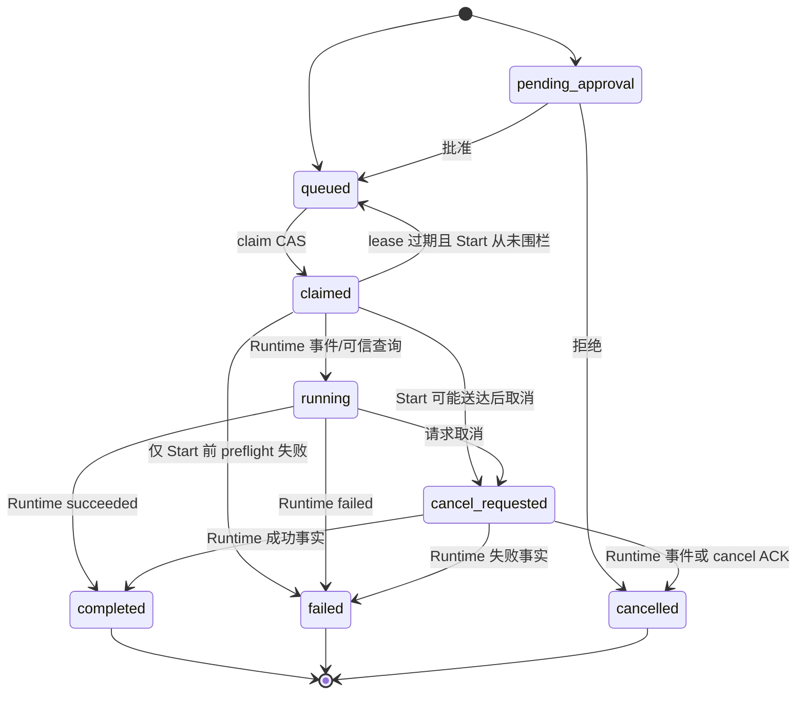

展示态由三个维度即时计算，优先级固定：

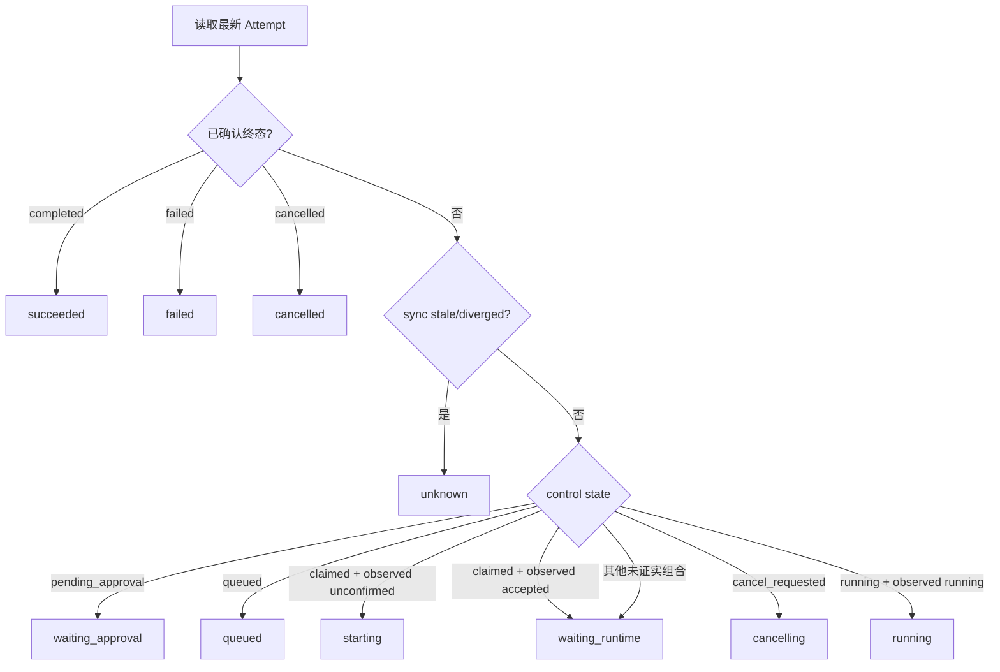

因此 `heartbeat_at` 更新不会把 `starting/unknown` 改成 `running`；终态也不会被 stale 覆盖成 unknown。

## 5. Cloud 正常启动时序

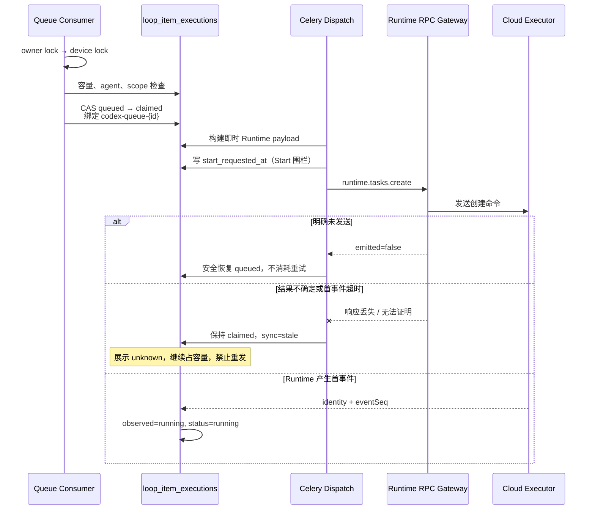

RPC 传输异常与明确 `emitted=false` 被区分；前者在 Start 围栏之后只能进入 unknown。

## 6. Local/App 正常启动时序

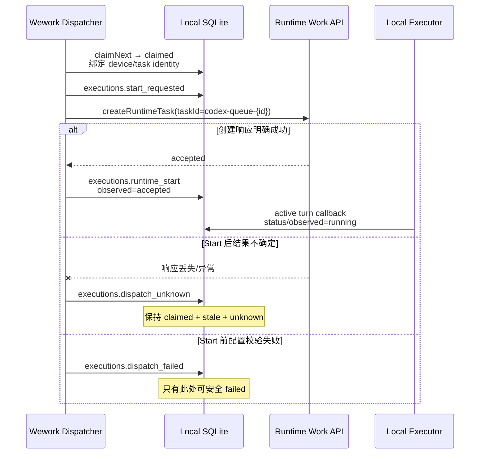

App IPC 不再提供 `executions.complete`/`executions.fail` 给调度器伪造终态。终态由 Local Executor 的 turn outcome 写回。

## 7. Runtime 事件、乱序与原子终态

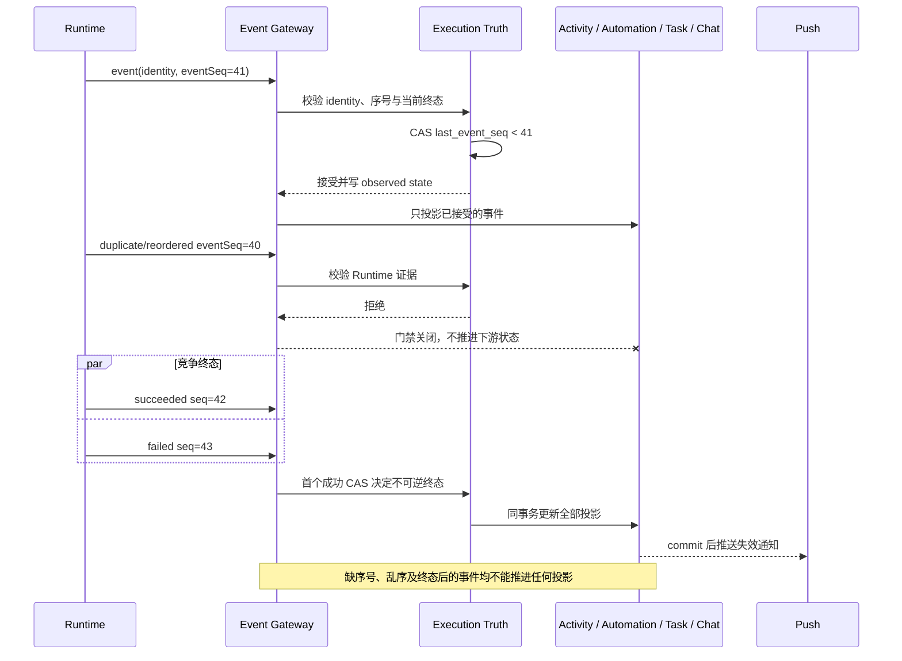

人工拒绝也遵守相同事务边界：Execution、Activity、Automation 投影与任务版本 CAS 一次提交，提交前不会由内部 helper 偷跑 `commit()`。

## 8. 取消时序

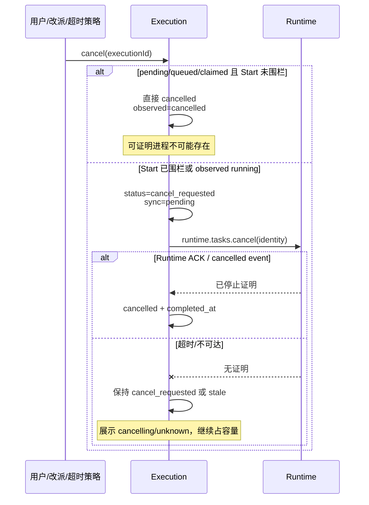

本地 Queue 停止按钮先调用本地 `executions.cancel`，再使用该执行行的 Runtime 地址调用 `cancelRuntimeTask`；不再误用 cloud stop API。

## 9. 失败重试与迟到事件隔离

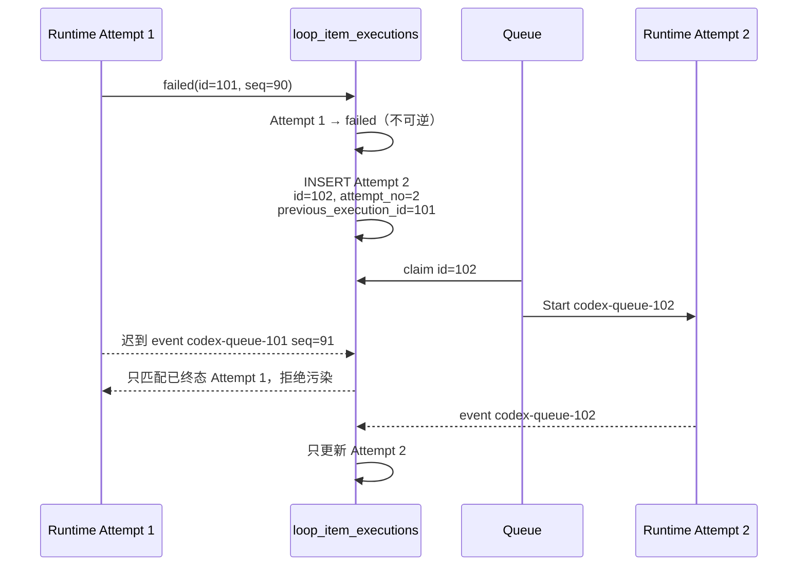

Runtime 已证明失败时才可自动重试并消耗 retry budget。Start 前明确失败可复用原行恢复 queued，因为可以证明 Runtime 进程不存在。

## 10. Lease 过期、unknown 与对账

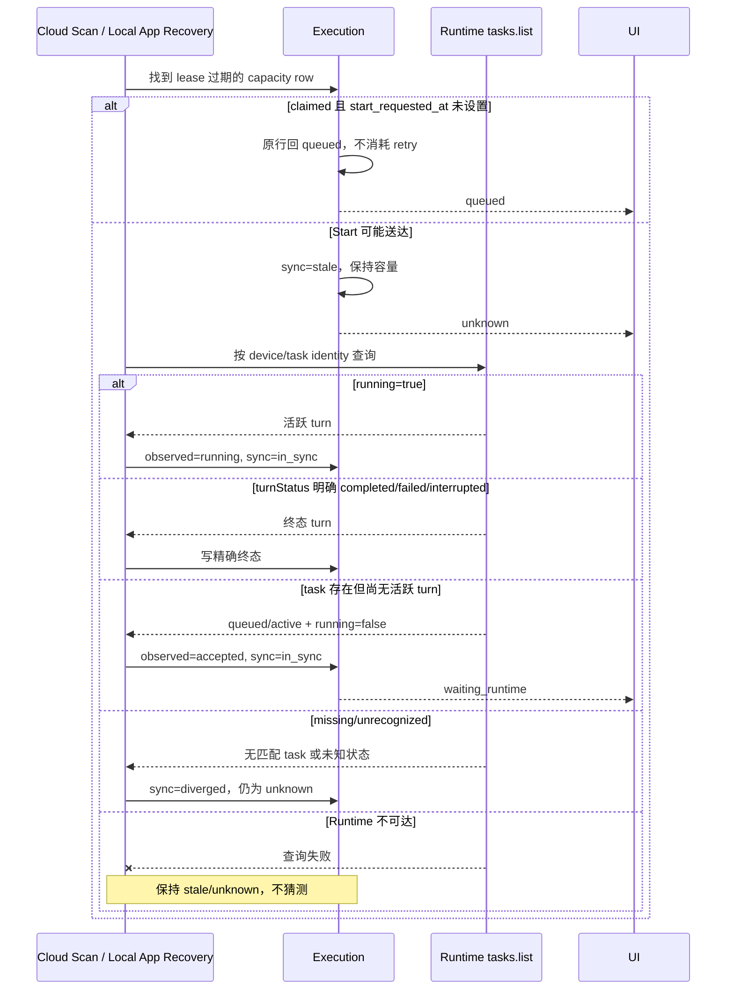

Cloud Scan 与 Local App 都按持久化的 device/task identity 对账；Local App 通过 `executions.list_stale` 与 `executions.reconcile` 补回重启期间丢失的事件。`task.status=active` 本身不是运行证明，必须结合 `running` 和 `turnStatus`。

“运行超过阈值且无文本”只触发 `cancel_requested` 和 Runtime cancel，不直接制造 `failed`。

## 11. 并发与容量连线

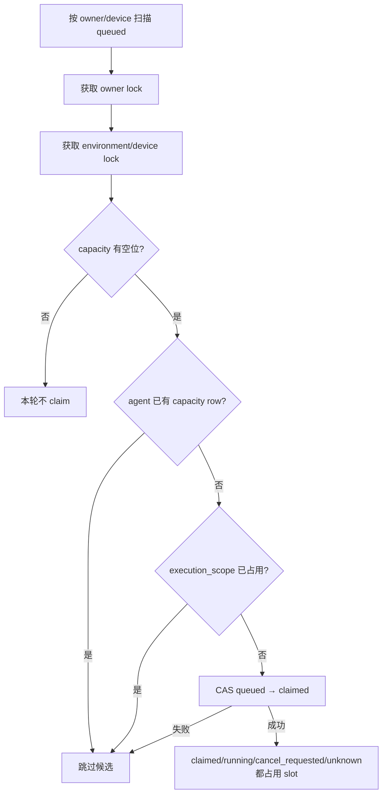

固定顺序是 owner lock → device lock → DB CAS。`unknown` 不释放 slot；否则同一真实进程可能与新 Attempt 并行。

## 12. 纯读取与 UI 一致性

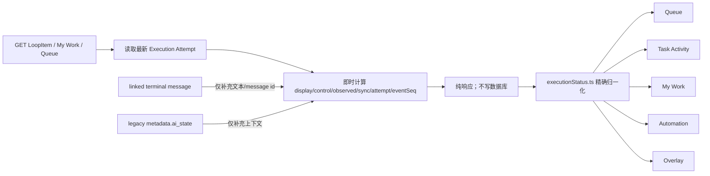

优先级为最新 Execution → 与其绑定的终态消息上下文 → legacy cache。过期 cache 只能在响应中变为 `unknown`，GET 不落库。`failed`、`cancelled`、`skipped` 和 `succeeded` 在 UI 中保持独立。

## 13. 已实现入口与删除的旧入口

Cloud/App 启动协议：

- `start-requested`：持久化 Start 围栏。
- `runtime-start`：只记录 Runtime accepted，不冒充 running。
- `dispatch-unknown`：Start 结果不确定，保持容量并显示 unknown。
- `dispatch-failed`：仅 Start 前 preflight 明确失败。
- Runtime events / trusted status query：唯一 running 与执行终态来源。

已删除 App 调度器可调用的直接 `complete`/`fail` 入口。Heartbeat 必须匹配 execution、device 和 task identity，并且只续 lease。

## 14. 验收矩阵

| 场景 | 必须看到 | 禁止出现 |
| --- | --- | --- |
| claim 成功、Start 未发 | `starting` | `running` |
| Runtime 已接受、尚无活跃 turn | `waiting_runtime` | `starting` 或 `running` |
| Start 响应丢失 | `unknown` 且占容量 | 原行重排、双跑 |
| Runtime 首事件 | `running`，写 `observed_at/eventSeq` | 用 heartbeat 冒充 |
| 缺序号、重复、乱序或终态后的事件 | Execution 与所有下游投影都忽略 | 消息/活动绕过门禁继续推进 |
| Start 前取消 | 直接 `cancelled` | 无意义 Runtime cancel |
| Start 后取消 | `cancelling` 到 ACK/event | 立即假 cancelled |
| lease 过期且未 Start | 原行 queued、retry 不变 | 新建重复 Attempt |
| lease 过期且可能 Start | `unknown`、对账、占容量 | 自动失败/重发 |
| Runtime failed + retry | 旧行 failed、新行 queued | 修改旧行为 queued |
| GET / 刷新页面 | 状态不改变 | 读取时写状态 |
| My Work/Queue/Detail/Automation | 同一精确展示态 | pending/claimed 被显示 running |
| Migration | 只 ALTER 现有表和建索引 | 任何新表 |

## 15. 自动化与人工验证

自动化必须至少覆盖：迁移无 `create_table`、claim/identity/start fence、事件序号、竞争终态、取消前后边界、ambiguous dispatch、cloud/local recovery/reconcile（含 `running` 与 `turnStatus`）、retry 新 Attempt、投影同事务、纯 GET、local IPC/store、UI 状态映射和 TypeScript/Rust 编译。

人工验收按以下顺序：

1. cloud 与 local 各跑一次正常任务，确认 `queued → starting →（可选 waiting_runtime）→ running → succeeded`。
2. Start 后断开设备，确认显示 unknown 且没有第二次启动。
3. 分别在 queued 和 running 阶段取消，确认前者立即终态，后者先 cancelling。
4. 制造 Runtime failure，确认旧 Attempt 保留且 retry 使用新 task id。
5. 同时打开 Queue、Task Activity、My Work、Automation 和 Overlay，确认状态一致。
6. 刷新和重复 GET，确认没有任何状态被读取动作改变。
