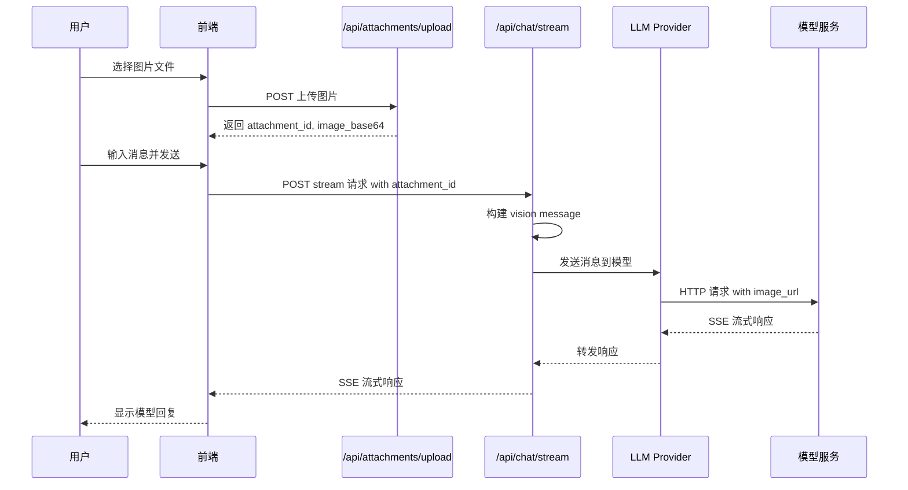

# Chat 图片上传 E2E 测试方案

## 1. 测试目标

测试 Chat Team 的图片上传和发送功能，确保：

1. 图片能够成功上传
2. 图片能够与消息一起发送给模型
3. 模型能够正确收到 `image_url` 格式的图片数据
4. 模型返回的响应能够正确显示

## 2. 系统架构分析

### 2.1 图片上传流程



### 2.2 Vision Message 格式

当用户上传图片时，系统会构建如下格式的消息：

```json
{
  "role": "user",
  "content": [
    {
      "type": "text",
      "text": "用户输入的消息"
    },
    {
      "type": "image_url",
      "image_url": {
        "url": "data:image/png;base64,iVBORw0KGgoAAAANSUhEUgAA..."
      }
    }
  ]
}
```

### 2.3 关键代码路径

1. **前端上传**: `POST /api/attachments/upload` → 返回 `attachment_id`
2. **前端发送**: `POST /api/chat/stream` with `attachment_id`
3. **后端处理**:
   - [`context_service.build_message_with_attachment()`](backend/app/services/context/context_service.py:337) 构建 vision dict
   - [`message_builder.build_vision_content()`](backend/app/services/chat/message_builder.py:15) 转换为 OpenAI 格式
4. **Provider 发送**: [`OpenAIProvider.stream_chat()`](backend/app/services/chat/providers/openai.py:66) 发送到模型

## 3. 测试方案设计

### 3.1 方案选择：Mock HTTP 服务器

**选择理由**：

- 可以完整验证请求格式，包括 `image_url` 的正确性
- 可以捕获并断言模型收到的实际请求内容
- 不依赖真实的 LLM API，测试稳定可靠
- 可以模拟各种响应场景

**实现方式**：
使用 Playwright 的 `page.route()` 拦截后端发往模型的请求，验证请求格式并返回 mock 响应。

### 3.2 测试文件结构

```
frontend/e2e/
├── fixtures/
│   └── test-image.png          # 测试用图片文件
├── utils/
│   └── api-mock.ts             # 扩展：添加图片消息 mock
└── tests/
    └── tasks/
        └── chat-image-upload.spec.ts  # 图片上传测试
```

## 4. 详细实现计划

### 4.1 创建测试图片文件

创建一个小型的 PNG 测试图片（约 1KB），用于测试上传功能。

**文件**: `frontend/e2e/fixtures/test-image.png`

### 4.2 扩展 API Mock 工具

在 `frontend/e2e/utils/api-mock.ts` 中添加：

```typescript
/**
 * Mock chat stream with image support
 * Captures the request to verify image_url format
 */
export async function mockChatStreamWithImageCapture(
  page: Page,
  onRequestCapture?: (request: any) => void
): Promise<void> {
  // Mock the chat stream endpoint
  await page.route('**/api/chat/stream', async (route: Route) => {
    const request = route.request()
    const postData = request.postDataJSON()

    // Capture request for verification
    if (onRequestCapture) {
      onRequestCapture(postData)
    }

    // Return mock SSE response
    await route.fulfill({
      status: 200,
      contentType: 'text/event-stream',
      body: generateMockSSEResponse('I can see the image you uploaded.'),
    })
  })
}

/**
 * Generate mock SSE response for chat
 */
function generateMockSSEResponse(content: string): string {
  return `data: {"task_id": 1, "subtask_id": 1, "content": "", "done": false}

data: {"content": "${content}", "done": false}

data: {"content": "", "done": true, "result": {"value": "${content}"}}

`
}
```

### 4.3 创建图片上传测试

**文件**: `frontend/e2e/tests/tasks/chat-image-upload.spec.ts`

```typescript
import { test, expect } from '@playwright/test'
import { createApiClient, ApiClient } from '../../utils/api-client'
import { ADMIN_USER } from '../../config/test-users'
import * as path from 'path'
import * as fs from 'fs'

test.describe('Chat Image Upload and Send', () => {
  let apiClient: ApiClient
  let capturedRequest: any = null

  test.beforeEach(async ({ page, request }) => {
    apiClient = createApiClient(request)
    await apiClient.login(ADMIN_USER.username, ADMIN_USER.password)
    capturedRequest = null
  })

  test('should upload image and send to model with correct image_url format', async ({ page }) => {
    // 1. Setup request capture
    await page.route('**/api/chat/stream', async route => {
      capturedRequest = route.request().postDataJSON()

      // Return mock response
      const mockResponse = `data: {"task_id": 1, "subtask_id": 1, "content": "", "done": false}

data: {"content": "I can see the image.", "done": false}

data: {"content": "", "done": true}

`
      await route.fulfill({
        status: 200,
        contentType: 'text/event-stream',
        body: mockResponse,
      })
    })

    // 2. Navigate to chat page
    await page.goto('/chat')
    await page.waitForLoadState('domcontentloaded')

    // 3. Upload image
    const testImagePath = path.join(__dirname, '../../fixtures/test-image.png')
    const fileInput = page.locator('input[type="file"]').first()
    await fileInput.setInputFiles(testImagePath)

    // Wait for upload to complete
    await page.waitForTimeout(2000)

    // 4. Type message and send
    const messageInput = page.locator('textarea').first()
    await messageInput.fill('What is in this image?')

    const sendButton = page.locator('button[type="submit"]').first()
    await sendButton.click()

    // 5. Wait for response
    await page.waitForTimeout(3000)

    // 6. Verify the request was captured
    expect(capturedRequest).not.toBeNull()
    expect(capturedRequest.attachment_id).toBeDefined()
  })

  test('should verify model receives correct image_url format via API', async ({ request }) => {
    // This test uses API directly to verify the image format

    // 1. Upload image via API
    const testImagePath = path.join(__dirname, '../../fixtures/test-image.png')
    const imageBuffer = fs.readFileSync(testImagePath)

    const uploadResponse = await apiClient.post('/api/attachments/upload', {
      // multipart form data
    })

    // 2. Verify attachment was created
    expect(uploadResponse.status).toBe(200)
    expect(uploadResponse.data.id).toBeDefined()

    // 3. The image_base64 should be populated
    const attachmentId = uploadResponse.data.id
    const attachmentDetail = await apiClient.get(`/api/attachments/${attachmentId}`)
    expect(attachmentDetail.status).toBe(200)
  })
})
```

### 4.4 API 级别测试（验证 image_url 格式）

创建一个专门的 API 测试来验证图片格式：

**文件**: `frontend/e2e/tests/api/chat-image-api.spec.ts`

```typescript
import { test, expect } from '@playwright/test'
import { createApiClient } from '../../utils/api-client'
import { ADMIN_USER } from '../../config/test-users'
import * as fs from 'fs'
import * as path from 'path'

test.describe('Chat Image API Tests', () => {
  test('should upload image and verify base64 encoding', async ({ request }) => {
    const apiClient = createApiClient(request)
    await apiClient.login(ADMIN_USER.username, ADMIN_USER.password)

    // Read test image
    const testImagePath = path.join(__dirname, '../../fixtures/test-image.png')
    const imageBuffer = fs.readFileSync(testImagePath)
    const base64Image = imageBuffer.toString('base64')

    // Upload via multipart form
    const response = await request.post('/api/attachments/upload', {
      headers: {
        Authorization: `Bearer ${apiClient.token}`,
      },
      multipart: {
        file: {
          name: 'test-image.png',
          mimeType: 'image/png',
          buffer: imageBuffer,
        },
      },
    })

    expect(response.status()).toBe(200)
    const data = await response.json()

    // Verify response
    expect(data.id).toBeDefined()
    expect(data.mime_type).toBe('image/png')
    expect(data.status).toBe('ready')
  })

  test('should build correct vision message format', async ({ request }) => {
    // This test verifies the message format that would be sent to the model
    // by checking the attachment service behavior

    const apiClient = createApiClient(request)
    await apiClient.login(ADMIN_USER.username, ADMIN_USER.password)

    // 1. Upload image
    const testImagePath = path.join(__dirname, '../../fixtures/test-image.png')
    const imageBuffer = fs.readFileSync(testImagePath)

    const uploadResponse = await request.post('/api/attachments/upload', {
      headers: {
        Authorization: `Bearer ${apiClient.token}`,
      },
      multipart: {
        file: {
          name: 'test-image.png',
          mimeType: 'image/png',
          buffer: imageBuffer,
        },
      },
    })

    const uploadData = await uploadResponse.json()
    const attachmentId = uploadData.id

    // 2. Get attachment details to verify image_base64 is populated
    const detailResponse = await request.get(`/api/attachments/${attachmentId}`, {
      headers: {
        Authorization: `Bearer ${apiClient.token}`,
      },
    })

    expect(detailResponse.status()).toBe(200)
    const detailData = await detailResponse.json()

    // Verify the attachment is ready and has the correct format
    expect(detailData.status).toBe('ready')
    expect(detailData.mime_type).toBe('image/png')
    expect(detailData.file_extension).toBe('.png')
  })
})
```

## 5. Mock 模型服务器方案（可选）

如果需要更完整地验证模型收到的请求格式，可以启动一个独立的 Mock HTTP 服务器：

### 5.1 Mock 服务器实现

**文件**: `frontend/e2e/utils/mock-model-server.ts`

```typescript
import http from 'http'

interface CapturedRequest {
  method: string
  url: string
  headers: Record<string, string>
  body: any
}

export class MockModelServer {
  private server: http.Server | null = null
  private capturedRequests: CapturedRequest[] = []
  private port: number

  constructor(port: number = 9999) {
    this.port = port
  }

  async start(): Promise<void> {
    return new Promise(resolve => {
      this.server = http.createServer((req, res) => {
        let body = ''
        req.on('data', chunk => (body += chunk))
        req.on('end', () => {
          // Capture request
          this.capturedRequests.push({
            method: req.method || 'GET',
            url: req.url || '/',
            headers: req.headers as Record<string, string>,
            body: body ? JSON.parse(body) : null,
          })

          // Return mock SSE response
          res.writeHead(200, {
            'Content-Type': 'text/event-stream',
            'Cache-Control': 'no-cache',
            Connection: 'keep-alive',
          })

          // Send mock streaming response
          const chunks = [
            'data: {"choices":[{"delta":{"content":"I"}}]}\n\n',
            'data: {"choices":[{"delta":{"content":" can"}}]}\n\n',
            'data: {"choices":[{"delta":{"content":" see"}}]}\n\n',
            'data: {"choices":[{"delta":{"content":" the"}}]}\n\n',
            'data: {"choices":[{"delta":{"content":" image"}}]}\n\n',
            'data: [DONE]\n\n',
          ]

          let i = 0
          const interval = setInterval(() => {
            if (i < chunks.length) {
              res.write(chunks[i])
              i++
            } else {
              clearInterval(interval)
              res.end()
            }
          }, 50)
        })
      })

      this.server.listen(this.port, () => {
        console.log(`Mock model server running on port ${this.port}`)
        resolve()
      })
    })
  }

  async stop(): Promise<void> {
    return new Promise(resolve => {
      if (this.server) {
        this.server.close(() => resolve())
      } else {
        resolve()
      }
    })
  }

  getCapturedRequests(): CapturedRequest[] {
    return this.capturedRequests
  }

  getLastRequest(): CapturedRequest | null {
    return this.capturedRequests[this.capturedRequests.length - 1] || null
  }

  clearRequests(): void {
    this.capturedRequests = []
  }

  /**
   * Verify that the last request contains a valid image_url
   */
  verifyImageUrlFormat(): boolean {
    const lastRequest = this.getLastRequest()
    if (!lastRequest || !lastRequest.body) return false

    const messages = lastRequest.body.messages
    if (!messages || !Array.isArray(messages)) return false

    // Find user message with image
    const userMessage = messages.find((m: any) => m.role === 'user' && Array.isArray(m.content))
    if (!userMessage) return false

    // Check for image_url content
    const imageContent = userMessage.content.find((c: any) => c.type === 'image_url')
    if (!imageContent) return false

    // Verify format
    const imageUrl = imageContent.image_url?.url
    return imageUrl && imageUrl.startsWith('data:image/')
  }
}
```

## 6. 测试用例清单

| 测试用例 | 描述                    | 优先级 |
| -------- | ----------------------- | ------ |
| TC01     | 上传 PNG 图片成功       | P0     |
| TC02     | 上传 JPEG 图片成功      | P1     |
| TC03     | 图片与消息一起发送      | P0     |
| TC04     | 验证 image_url 格式正确 | P0     |
| TC05     | 模型返回响应正确显示    | P0     |
| TC06     | 上传超大图片被拒绝      | P1     |
| TC07     | 上传非图片文件被拒绝    | P1     |
| TC08     | 删除未发送的图片附件    | P2     |

## 7. 预期的 image_url 格式验证

测试应验证发送给模型的消息格式如下：

```json
{
  "model": "gpt-4-vision-preview",
  "messages": [
    {
      "role": "system",
      "content": "You are a helpful assistant."
    },
    {
      "role": "user",
      "content": [
        {
          "type": "text",
          "text": "What is in this image?"
        },
        {
          "type": "image_url",
          "image_url": {
            "url": "data:image/png;base64,iVBORw0KGgoAAAANSUhEUgAAAAEAAAABCAYAAAAfFcSJAAAADUlEQVR42mNk+M9QDwADhgGAWjR9awAAAABJRU5ErkJggg=="
          }
        }
      ]
    }
  ],
  "stream": true
}
```

## 8. 实现步骤

1. **创建测试图片文件** - 生成一个小型 PNG 图片用于测试 ✅
2. **扩展 api-mock.ts** - 添加图片消息的 mock 支持 ✅
3. **创建 chat-image-upload.spec.ts** - 实现 UI 级别的图片上传测试 ✅
4. **创建 chat-image-api.spec.ts** - 实现 API 级别的格式验证测试 ✅
5. **创建 mock-model-server.ts** - 完整验证模型请求 ✅
6. **创建 chat-image-e2e.spec.ts** - 自动创建 Team 并验证 image_url 格式 ✅

## 9. 运行测试

### 9.1 运行单元测试（不需要 Mock 服务器）

```bash
cd frontend
npx playwright test chat-image-e2e.spec.ts --grep "Image URL Format Unit Tests"
```

### 9.2 运行完整 E2E 测试

**步骤 1：启动 Mock 模型服务器**

```bash
cd frontend
npx ts-node e2e/utils/mock-model-server.ts
```

服务器将在 `http://localhost:9999` 启动，提供以下端点：

- `POST /v1/chat/completions` - Mock OpenAI Chat API
- `GET /captured-requests` - 查看捕获的请求
- `POST /clear-requests` - 清除捕获的请求
- `GET /health` - 健康检查

**步骤 2：运行 E2E 测试**

在另一个终端中运行：

```bash
cd frontend
npx playwright test chat-image-e2e.spec.ts --grep "Chat Image E2E"
```

### 9.3 测试自动创建的资源

E2E 测试会自动创建以下资源：

1. **Model** - 指向 Mock 服务器 (`http://localhost:9999/v1`)
2. **Bot** - 使用 Chat Shell 和上述 Model
3. **Team** - 使用上述 Bot

测试完成后会自动清理这些资源。

### 9.4 验证 image_url 格式

测试会验证发送给模型的消息格式：

```json
{
  "role": "user",
  "content": [
    {
      "type": "text",
      "text": "What is in this image?"
    },
    {
      "type": "image_url",
      "image_url": {
        "url": "data:image/png;base64,iVBORw0KGgoAAAANSUhEUgAAAAoAAAAKCAIAAAACUFjqAAAAEklEQVR4nGP4z8CAB+GTG8HSALfKY52fTcuYAAAAAElFTkSuQmCC"
      }
    }
  ]
}
```

## 10. 注意事项

1. **测试环境要求**：需要后端服务运行在 `http://localhost:8000`
2. **Mock 服务器**：E2E 测试需要 Mock 服务器运行在 `http://localhost:9999`
3. **图片大小限制**：测试图片应小于 20MB
4. **Base64 编码**：验证 base64 编码的正确性
5. **MIME 类型**：验证 MIME 类型与文件扩展名匹配
6. **资源清理**：测试会自动清理创建的 Model、Bot、Team 资源

## 11. 测试文件清单

| 文件                                                 | 描述                            |
| ---------------------------------------------------- | ------------------------------- |
| `frontend/e2e/fixtures/test-image.png`               | 10x10 红色 PNG 测试图片         |
| `frontend/e2e/utils/mock-model-server.ts`            | Mock OpenAI 兼容服务器          |
| `frontend/e2e/utils/api-mock.ts`                     | API Mock 工具（扩展了图片支持） |
| `frontend/e2e/tests/api/chat-image-e2e.spec.ts`      | 完整 E2E 测试（自动创建 Team）  |
| `frontend/e2e/tests/api/chat-image-api.spec.ts`      | API 级别测试                    |
| `frontend/e2e/tests/tasks/chat-image-upload.spec.ts` | UI 级别测试                     |
