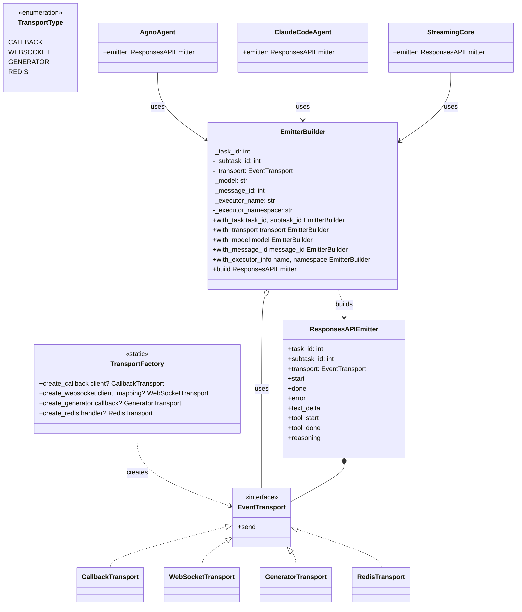

# AgnoAgent 与 ClaudeCodeAgent 可复用逻辑分析

## 概述

通过对比分析三个模块的事件发射机制，发现存在**三套不同的 Emitter 实现**。本文档提出统一方案，通过 **Builder 模式 + TransportFactory** 让所有模块依赖接口而非实现。

> **设计原则**:
> - 组合优于继承 (Composition over Inheritance)
> - 依赖接口而非实现 (Depend on abstractions, not concretions)
> - Builder 模式解决参数过多问题
> - Factory 模式封装 Transport 创建逻辑
> - HTTP Transport 内置节流策略，降低 QPS

---

## 1. 文件命名

将 `emitter.py` 重命名为 `responses_api_emitter.py`，更准确地反映其功能：这是一个专门用于发送 OpenAI Responses API 格式事件的发射器，而不是通用的事件发射器。

| 原文件名 | 新文件名 | 说明 |
|---------|---------|------|
| `shared/models/emitter.py` | `shared/models/responses_api_emitter.py` | Responses API 事件发射器 |
| `shared/models/emitter_factory.py` | `shared/models/responses_api_factory.py` | Responses API 发射器工厂 |

---

## 2. 核心设计：EmitterBuilder + TransportFactory

将创建逻辑拆分为：
- **TransportFactory** - 负责创建 Transport 实例（Factory 模式）
- **EmitterBuilder** - 负责构建 Emitter 实例（Builder 模式）

```python
# shared/models/responses_api_factory.py
from enum import Enum
from typing import Any, Optional
from .responses_api_emitter import (
    ResponsesAPIEmitter, 
    EventTransport, 
    CallbackTransport, 
    WebSocketTransport, 
    GeneratorTransport
)


class TransportType(Enum):
    """传输类型枚举"""
    CALLBACK = "callback"      # HTTP callback (executor Docker mode)
    WEBSOCKET = "websocket"    # WebSocket (executor local mode)
    GENERATOR = "generator"    # SSE generator (chat_shell)
    REDIS = "redis"            # Redis pub/sub (chat_shell bridge mode)


class TransportFactory:
    """
    Transport 工厂类 - 负责创建 EventTransport 实例
    
    职责单一：只负责根据类型创建对应的 Transport
    """
    
    @staticmethod
    def create_callback(client: Any = None) -> CallbackTransport:
        """创建 HTTP Callback Transport
        
        Args:
            client: HTTP callback 客户端，如果为 None 则使用默认客户端
        """
        if client is None:
            from executor.callback.callback_client import CallbackClient
            client = CallbackClient()
        return CallbackTransport(client)
    
    @staticmethod
    def create_websocket(client: Any, event_mapping: Optional[dict] = None) -> WebSocketTransport:
        """创建 WebSocket Transport
        
        Args:
            client: WebSocket 客户端（必需）
            event_mapping: 事件类型到 socket 事件名的映射
        """
        return WebSocketTransport(client, event_mapping)
    
    @staticmethod
    def create_generator(callback: Optional[callable] = None) -> GeneratorTransport:
        """创建 Generator Transport（用于 SSE）
        
        Args:
            callback: 可选的回调函数
        """
        return GeneratorTransport(callback)
    
    @staticmethod
    def create_redis(storage_handler: Any = None) -> "RedisTransport":
        """创建 Redis Transport
        
        Args:
            storage_handler: Redis 存储处理器
        """
        return RedisTransport(storage_handler)


class EmitterBuilder:
    """
    Emitter 构建器 - 使用 Builder 模式构建 ResponsesAPIEmitter
    
    解决参数过多问题，提供流畅的链式调用 API
    
    Usage:
        # Executor Docker mode
        emitter = EmitterBuilder() \\
            .with_task(task_id, subtask_id) \\
            .with_transport(TransportFactory.create_callback()) \\
            .with_executor_info(name="executor-1", namespace="default") \\
            .build()
        
        # Executor Local mode
        emitter = EmitterBuilder() \\
            .with_task(task_id, subtask_id) \\
            .with_transport(TransportFactory.create_websocket(ws_client)) \\
            .build()
        
        # Chat Shell SSE mode
        emitter = EmitterBuilder() \\
            .with_task(task_id, subtask_id) \\
            .with_transport(TransportFactory.create_generator()) \\
            .build()
    """
    
    def __init__(self):
        self._task_id: Optional[int] = None
        self._subtask_id: Optional[int] = None
        self._transport: Optional[EventTransport] = None
        self._model: str = ""
        self._message_id: Optional[int] = None
        self._executor_name: Optional[str] = None
        self._executor_namespace: Optional[str] = None
    
    def with_task(self, task_id: int, subtask_id: int) -> "EmitterBuilder":
        """设置任务信息（必需）"""
        self._task_id = task_id
        self._subtask_id = subtask_id
        return self
    
    def with_transport(self, transport: EventTransport) -> "EmitterBuilder":
        """设置传输层（必需）"""
        self._transport = transport
        return self
    
    def with_model(self, model: str) -> "EmitterBuilder":
        """设置模型标识（可选）"""
        self._model = model
        return self
    
    def with_message_id(self, message_id: int) -> "EmitterBuilder":
        """设置消息 ID（可选）"""
        self._message_id = message_id
        return self
    
    def with_executor_info(
        self, 
        name: Optional[str] = None, 
        namespace: Optional[str] = None
    ) -> "EmitterBuilder":
        """设置执行器信息（可选）"""
        self._executor_name = name
        self._executor_namespace = namespace
        return self
    
    def build(self) -> ResponsesAPIEmitter:
        """构建 ResponsesAPIEmitter 实例
        
        Raises:
            ValueError: 如果缺少必需参数
        """
        if self._task_id is None or self._subtask_id is None:
            raise ValueError("task_id and subtask_id are required. Use with_task() to set them.")
        if self._transport is None:
            raise ValueError("transport is required. Use with_transport() to set it.")
        
        return ResponsesAPIEmitter(
            task_id=self._task_id,
            subtask_id=self._subtask_id,
            transport=self._transport,
            model=self._model,
            message_id=self._message_id,
            executor_name=self._executor_name,
            executor_namespace=self._executor_namespace,
        )


class RedisTransport(EventTransport):
    """Redis pub/sub transport for chat_shell bridge mode"""
    
    def __init__(self, storage_handler: Any = None):
        self._storage = storage_handler
    
    def _get_storage(self):
        if self._storage is None:
            from app.services.chat.storage import session_manager
            self._storage = session_manager
        return self._storage
    
    async def send(
        self,
        event_type: str,
        task_id: int,
        subtask_id: int,
        data: dict,
        message_id: Optional[int] = None,
        executor_name: Optional[str] = None,
        executor_namespace: Optional[str] = None,
    ) -> None:
        """Publish event to Redis channel"""
        import json
        storage = self._get_storage()
        event = {
            "event_type": event_type,
            "task_id": task_id,
            "subtask_id": subtask_id,
            "data": data,
        }
        if message_id is not None:
            event["message_id"] = message_id
        await storage.publish_streaming_chunk(subtask_id, json.dumps(event))
```

---

## 3. 各模块使用方式

### 3.1 AgnoAgent

```python
# executor/agents/agno/agno_agent.py
import os
from shared.models.responses_api_factory import EmitterBuilder, TransportFactory

class AgnoAgent(Agent):
    def __init__(self, task_data: Dict[str, Any]):
        super().__init__(task_data)
        
        # 通过 Builder 构建 emitter
        self.emitter = EmitterBuilder() \
            .with_task(self.task_id, self.subtask_id) \
            .with_transport(TransportFactory.create_callback()) \
            .with_executor_info(
                name=os.getenv("EXECUTOR_NAME"),
                namespace=os.getenv("EXECUTOR_NAMESPACE"),
            ) \
            .build()
    
    async def _handle_agent_streaming_event(self, event, result_content: str):
        """处理流式事件 - 使用统一的 emitter"""
        if event.event == RunEvent.run_started:
            await self.emitter.start()
        
        if event.event == RunEvent.tool_call_started:
            await self.emitter.tool_start(
                call_id=event.tool.id or str(uuid.uuid4()),
                name=event.tool.tool_name,
                arguments=event.tool.tool_args,
            )
        
        if event.event == RunEvent.tool_call_completed:
            await self.emitter.tool_done(
                call_id=event.tool.id or str(uuid.uuid4()),
                name=event.tool.tool_name,
                arguments=event.tool.tool_args,
            )
        
        if event.event == RunEvent.run_content:
            if event.content:
                await self.emitter.text_delta(str(event.content))
            if getattr(event, "reasoning_content", None):
                await self.emitter.reasoning(event.reasoning_content)
        
        return result_content, False
    
    async def _handle_execution_result(self, result_content: str, execution_type: str):
        """处理执行结果"""
        if result_content:
            await self.emitter.done(
                content=result_content,
                silent_exit=self.is_silent_exit if self.is_silent_exit else None,
                silent_exit_reason=self.silent_exit_reason if self.silent_exit_reason else None,
            )
            return TaskStatus.COMPLETED
        else:
            await self.emitter.error(f"No content received from {execution_type}")
            return TaskStatus.FAILED
```

### 3.2 ClaudeCodeAgent

```python
# executor/agents/claude_code/claude_code_agent.py
import os
from shared.models.responses_api_factory import EmitterBuilder, TransportFactory

class ClaudeCodeAgent(Agent):
    def __init__(self, task_data: Dict[str, Any]):
        super().__init__(task_data)
        
        # 通过 Builder 构建 emitter
        self.emitter = EmitterBuilder() \
            .with_task(self.task_id, self.subtask_id) \
            .with_transport(TransportFactory.create_callback()) \
            .with_executor_info(
                name=os.getenv("EXECUTOR_NAME"),
                namespace=os.getenv("EXECUTOR_NAMESPACE"),
            ) \
            .build()
    
    async def _async_execute(self) -> TaskStatus:
        # ...
        # 将 emitter 传递给 response_processor
        result = await process_response(
            self.client,
            self.state_manager,
            self.emitter,  # 传递 emitter
            self.thinking_manager,
            self.task_state_manager,
            session_id=self.session_id,
        )
        return result
```

```python
# executor/agents/claude_code/response_processor.py
from shared.models.responses_api_emitter import ResponsesAPIEmitter

async def process_response(
    client: ClaudeSDKClient,
    state_manager,
    emitter: ResponsesAPIEmitter,  # 接收 emitter
    thinking_manager=None,
    task_state_manager=None,
    session_id: str = None,
) -> TaskStatus:
    # ...

async def _handle_assistant_message(
    msg: AssistantMessage,
    state_manager,
    emitter: ResponsesAPIEmitter,  # 接收 emitter
    thinking_manager=None,
):
    for block in msg.content:
        if isinstance(block, ToolUseBlock):
            await emitter.tool_start(
                call_id=block.id,
                name=block.name,
                arguments=block.input,
            )
        elif isinstance(block, TextBlock):
            await emitter.text_delta(block.text)
```

### 3.3 Chat Shell

```python
# chat_shell/chat_shell/services/streaming/core.py
from shared.models.responses_api_emitter import ResponsesAPIEmitter

class StreamingCore:
    def __init__(
        self,
        emitter: ResponsesAPIEmitter,  # 直接使用 ResponsesAPIEmitter
        state: StreamingState,
        config: StreamingConfig,
        storage_handler: Optional[Any] = None,
    ):
        self.emitter = emitter
        self.state = state
        # ...
    
    async def start_stream(self) -> bool:
        await self.emitter.start(shell_type="Chat")
        return True
    
    async def emit_token(self, token: str) -> bool:
        await self.emitter.text_delta(token)
        return True
    
    async def complete_stream(self, result: dict) -> None:
        content = result.get("value", "")
        await self.emitter.done(content=content)
    
    async def handle_error(self, error: Exception) -> None:
        await self.emitter.error(str(error))
```

```python
# chat_shell/chat_shell/services/chat_service.py
from shared.models.responses_api_factory import EmitterBuilder, TransportFactory

class ChatService:
    async def chat_stream(self, request: ChatRequest):
        # 根据模式选择传输类型
        if self._is_bridge_mode():
            transport = TransportFactory.create_redis()
        else:
            transport = TransportFactory.create_generator()
        
        # 通过 Builder 创建 emitter
        emitter = EmitterBuilder() \
            .with_task(request.task_id, request.subtask_id) \
            .with_transport(transport) \
            .build()
        
        state = StreamingState(...)
        core = StreamingCore(emitter=emitter, state=state, ...)
        
        # ...
```

### 3.4 Executor Local Mode

```python
# executor/modes/local/runner.py
from shared.models.responses_api_factory import EmitterBuilder, TransportFactory

class LocalModeRunner:
    def __init__(self, websocket_client):
        self.websocket_client = websocket_client
    
    def create_emitter(self, task_id: int, subtask_id: int) -> ResponsesAPIEmitter:
        """为 Local Mode 创建使用 WebSocket 的 emitter"""
        return EmitterBuilder() \
            .with_task(task_id, subtask_id) \
            .with_transport(TransportFactory.create_websocket(self.websocket_client)) \
            .build()
```

---

## 4. 架构图

```
┌─────────────────────────────────────────────────────────────────────┐
│                         EmitterBuilder                               │
│  ┌─────────────────────────────────────────────────────────────┐    │
│  │  with_task(task_id, subtask_id)                              │    │
│  │  with_transport(transport)                                   │    │
│  │  with_model(model)                                           │    │
│  │  with_message_id(message_id)                                 │    │
│  │  with_executor_info(name, namespace)                         │    │
│  │  build() -> ResponsesAPIEmitter                              │    │
│  └─────────────────────────────────────────────────────────────┘    │
│                              │                                       │
│                              ▼                                       │
│  ┌─────────────────────────────────────────────────────────────┐    │
│  │              ResponsesAPIEmitter (统一接口)                   │    │
│  │  - start(), done(), error(), incomplete()                    │    │
│  │  - text_delta(), text_done()                                 │    │
│  │  - tool_start(), tool_done()                                 │    │
│  │  - reasoning()                                               │    │
│  └─────────────────────────────────────────────────────────────┘    │
└─────────────────────────────────────────────────────────────────────┘

┌─────────────────────────────────────────────────────────────────────┐
│                        TransportFactory                              │
│  ┌─────────────────────────────────────────────────────────────┐    │
│  │  create_callback(client?) -> CallbackTransport               │    │
│  │  create_websocket(client, mapping?) -> WebSocketTransport    │    │
│  │  create_generator(callback?) -> GeneratorTransport           │    │
│  │  create_redis(handler?) -> RedisTransport                    │    │
│  └─────────────────────────────────────────────────────────────┘    │
│                              │                                       │
│                              ▼                                       │
│  ┌─────────────────────────────────────────────────────────────┐    │
│  │              EventTransport (传输层接口)                      │    │
│  └─────────────────────────────────────────────────────────────┘    │
│        │              │              │              │                │
│        ▼              ▼              ▼              ▼                │
│  ┌──────────┐  ┌──────────┐  ┌──────────┐  ┌──────────┐            │
│  │ Callback │  │WebSocket │  │Generator │  │  Redis   │            │
│  │Transport │  │Transport │  │Transport │  │Transport │            │
│  └──────────┘  └──────────┘  └──────────┘  └──────────┘            │
└─────────────────────────────────────────────────────────────────────┘
        │              │              │              │
        ▼              ▼              ▼              ▼
┌──────────────┐ ┌──────────────┐ ┌──────────────┐ ┌──────────────┐
│   Executor   │ │   Executor   │ │  Chat Shell  │ │  Chat Shell  │
│   Docker     │ │   Local      │ │   SSE Mode   │ │ Bridge Mode  │
└──────────────┘ └──────────────┘ └──────────────┘ └──────────────┘
```

---

## 5. 文件变更清单

### 5.1 新增文件

| 文件 | 描述 |
|------|------|
| `shared/models/responses_api_factory.py` | EmitterBuilder + TransportFactory + RedisTransport |

### 5.2 重命名文件

| 原文件 | 新文件 | 描述 |
|-------|-------|------|
| `shared/models/emitter.py` | `shared/models/responses_api_emitter.py` | Responses API 事件发射器 |

### 5.3 修改文件

| 文件 | 变更 |
|------|------|
| `shared/models/__init__.py` | 更新导出路径，导出 `EmitterBuilder`, `TransportFactory`, `TransportType` |
| `executor/agents/agno/agno_agent.py` | 使用 `EmitterBuilder` 构建 emitter |
| `executor/agents/claude_code/claude_code_agent.py` | 使用 `EmitterBuilder` 构建 emitter |
| `executor/agents/claude_code/response_processor.py` | 接收 `emitter` 参数 |
| `executor/callback/callback_handler.py` | 移除全局变量，简化为工具函数 |
| `chat_shell/services/streaming/core.py` | 使用 `ResponsesAPIEmitter` |
| `chat_shell/services/chat_service.py` | 使用 `EmitterBuilder` 构建 emitter |

### 5.4 可删除文件

| 文件 | 原因 |
|------|------|
| `chat_shell/services/streaming/emitters.py` | 被 `ResponsesAPIEmitter` 替代 |

---

## 6. 实施步骤

### 阶段 1: 重命名和创建文件

```bash
# 1. 重命名 emitter.py -> responses_api_emitter.py
mv shared/models/emitter.py shared/models/responses_api_emitter.py

# 2. 创建 responses_api_factory.py
touch shared/models/responses_api_factory.py

# 3. 更新 __init__.py 导出
```

### 阶段 2: 重构 Executor

```bash
# 1. 重构 AgnoAgent - 使用 EmitterBuilder
# 2. 重构 ClaudeCodeAgent - 使用 EmitterBuilder
# 3. 重构 response_processor - 接收 emitter 参数
# 4. 简化 callback_handler.py - 移除全局状态
```

### 阶段 3: 重构 Chat Shell

```bash
# 1. 重构 StreamingCore - 使用 ResponsesAPIEmitter
# 2. 重构 ChatService - 使用 EmitterBuilder
# 3. 删除旧的 emitters.py
```

### 阶段 4: 测试和文档

```bash
# 1. 添加单元测试
# 2. 更新 AGENTS.md
```

---

## 7. 收益总结

| 方面 | 当前 | 统一后 |
|------|------|--------|
| **依赖关系** | 依赖具体实现 | 依赖接口（`ResponsesAPIEmitter`） |
| **创建方式** | 分散的构造逻辑 + 全局状态 | 统一的 `EmitterBuilder` + `TransportFactory` |
| **传输切换** | 需要设置全局变量 | 创建时直接传入 Transport |
| **事件格式** | 可能不一致 | 统一的 OpenAI Responses API 格式 |
| **代码量** | ~300行分散调用 | ~80行统一调用 |
| **测试** | 难以 mock（全局状态） | 可以直接注入 mock Transport |
| **并发安全** | 全局变量有并发风险 | 无全局状态，线程安全 |

---

## 8. 类图



---

## 9. callback_handler.py 简化方案

重构后，`callback_handler.py` 将简化为纯工具函数，不再维护全局状态：

```python
# executor/callback/callback_handler.py
"""
Task callback handler module - 简化版

提供便捷函数用于发送事件，内部使用 EmitterBuilder + TransportFactory。
每次调用都创建新的 emitter，无全局状态。
"""

from typing import Any, Dict, Optional
from shared.models.responses_api_factory import EmitterBuilder, TransportFactory


async def send_start_event_async(
    task_id: int,
    subtask_id: int,
    executor_name: Optional[str] = None,
    executor_namespace: Optional[str] = None,
    message_id: Optional[int] = None,
    shell_type: Optional[str] = None,
) -> Dict[str, Any]:
    """Send task start event."""
    builder = EmitterBuilder() \
        .with_task(task_id, subtask_id) \
        .with_transport(TransportFactory.create_callback())
    
    if executor_name or executor_namespace:
        builder.with_executor_info(executor_name, executor_namespace)
    if message_id:
        builder.with_message_id(message_id)
    
    emitter = builder.build()
    return await emitter.start(shell_type)


async def send_chunk_event_async(
    task_id: int,
    subtask_id: int,
    content: str,
    message_id: Optional[int] = None,
) -> Dict[str, Any]:
    """Send chunk event."""
    builder = EmitterBuilder() \
        .with_task(task_id, subtask_id) \
        .with_transport(TransportFactory.create_callback())
    
    if message_id:
        builder.with_message_id(message_id)
    
    emitter = builder.build()
    return await emitter.text_delta(content)


async def send_done_event_async(
    task_id: int,
    subtask_id: int,
    result: Optional[Dict[str, Any]] = None,
    executor_name: Optional[str] = None,
    executor_namespace: Optional[str] = None,
    message_id: Optional[int] = None,
    usage: Optional[Dict[str, Any]] = None,
    sources: Optional[list] = None,
    stop_reason: str = "end_turn",
    silent_exit: Optional[bool] = None,
    silent_exit_reason: Optional[str] = None,
    **extra_fields,
) -> Dict[str, Any]:
    """Send done event."""
    builder = EmitterBuilder() \
        .with_task(task_id, subtask_id) \
        .with_transport(TransportFactory.create_callback())
    
    if executor_name or executor_namespace:
        builder.with_executor_info(executor_name, executor_namespace)
    if message_id:
        builder.with_message_id(message_id)
    
    emitter = builder.build()
    
    content = ""
    if result:
        content = result.get("value", "") or ""
    
    return await emitter.done(
        content=content,
        usage=usage,
        stop_reason=stop_reason,
        sources=sources,
        silent_exit=silent_exit,
        silent_exit_reason=silent_exit_reason,
        **extra_fields,
    )


async def send_error_event_async(
    task_id: int,
    subtask_id: int,
    error: str,
    error_code: Optional[str] = None,
    executor_name: Optional[str] = None,
    executor_namespace: Optional[str] = None,
    message_id: Optional[int] = None,
) -> Dict[str, Any]:
    """Send error event."""
    builder = EmitterBuilder() \
        .with_task(task_id, subtask_id) \
        .with_transport(TransportFactory.create_callback())
    
    if executor_name or executor_namespace:
        builder.with_executor_info(executor_name, executor_namespace)
    if message_id:
        builder.with_message_id(message_id)
    
    emitter = builder.build()
    return await emitter.error(error, error_code or "internal_error")


# ... 其他事件函数类似
```

**关键变化：**
1. 移除 `_transport_override` 全局变量
2. 移除 `set_transport()` 和 `clear_transport()` 函数
3. 每次调用都创建新的 emitter，无状态
4. Local Mode 不再通过全局变量切换，而是在 Agent 初始化时直接传入 WebSocket Transport

---

## 10. 通用节流器设计

### 10.1 问题背景

在流式输出场景下，LLM 每生成一个 token 就会触发一次 `text_delta` 事件。如果每个事件都立即发送，会导致：
- **QPS 过高**：一次对话可能产生数百甚至数千次调用
- **网络开销大**：每次请求都有连接建立、头部传输等开销
- **后端压力大**：需要处理大量请求

### 10.2 设计方案：ThrottledTransport 装饰器

使用**装饰器模式**设计通用节流器，可以包装任何 `EventTransport` 实现：

```python
# shared/models/throttled_transport.py

import asyncio
import time
from dataclasses import dataclass
from typing import Any, Dict, List, Optional, Set

from .responses_api_emitter import EventTransport


@dataclass
class ThrottleConfig:
    """节流配置"""
    # 默认聚合间隔（秒）
    default_interval: float = 0.3
    # 按事件类型自定义间隔
    event_intervals: Dict[str, float] = None
    # 最大缓冲区大小（字符数），超过此大小立即发送
    max_buffer_size: int = 4096
    # 需要节流的事件类型（None 表示全部节流）
    throttled_events: Optional[Set[str]] = None
    # 不需要节流的事件类型（优先级高于 throttled_events）
    bypass_events: Optional[Set[str]] = None
    
    def __post_init__(self):
        if self.event_intervals is None:
            self.event_intervals = {}
        if self.bypass_events is None:
            # 默认不节流的事件：生命周期事件和工具事件
            self.bypass_events = {
                "response.created",
                "response.completed",
                "response.incomplete",
                "error",
                "response.output_item.added",
                "response.output_item.done",
                "response.function_call_arguments.done",
            }
    
    def get_interval(self, event_type: str) -> float:
        """获取事件类型的节流间隔"""
        return self.event_intervals.get(event_type, self.default_interval)
    
    def should_throttle(self, event_type: str) -> bool:
        """判断事件是否需要节流"""
        # bypass_events 优先
        if self.bypass_events and event_type in self.bypass_events:
            return False
        # 如果指定了 throttled_events，只节流这些事件
        if self.throttled_events is not None:
            return event_type in self.throttled_events
        # 默认节流所有非 bypass 事件
        return True


class ThrottledTransport(EventTransport):
    """
    通用节流 Transport 装饰器
    
    使用装饰器模式包装任何 EventTransport，为高频事件提供节流功能。
    
    节流策略：
    - 在时间窗口内累积同类型事件的内容
    - 窗口结束时发送聚合后的内容
    - 如果缓冲区超过阈值，立即发送
    - 生命周期事件（start, done, error）和工具事件不节流
    
    Usage:
        # 包装 CallbackTransport
        base_transport = CallbackTransport(client)
        throttled = ThrottledTransport(base_transport)
        
        # 自定义配置
        config = ThrottleConfig(
            default_interval=0.5,
            event_intervals={"response.output_text.delta": 0.2},
        )
        throttled = ThrottledTransport(base_transport, config)
    """
    
    def __init__(
        self,
        transport: EventTransport,
        config: Optional[ThrottleConfig] = None,
    ):
        """
        Args:
            transport: 被包装的 Transport
            config: 节流配置
        """
        self._transport = transport
        self._config = config or ThrottleConfig()
        
        # 缓冲区：按 (task_id, subtask_id, event_type) 分组
        self._buffers: Dict[tuple, List[dict]] = {}
        self._last_send_times: Dict[tuple, float] = {}
        self._pending_tasks: Dict[tuple, asyncio.Task] = {}
        self._lock = asyncio.Lock()
    
    async def send(
        self,
        event_type: str,
        task_id: int,
        subtask_id: int,
        data: dict,
        message_id: Optional[int] = None,
        executor_name: Optional[str] = None,
        executor_namespace: Optional[str] = None,
    ) -> Any:
        """发送事件，对高频事件进行节流"""
        
        # 构建事件
        event = {
            "event_type": event_type,
            "task_id": task_id,
            "subtask_id": subtask_id,
            "data": data,
            "message_id": message_id,
            "executor_name": executor_name,
            "executor_namespace": executor_namespace,
        }
        
        # 判断是否需要节流
        if not self._config.should_throttle(event_type):
            # 不需要节流，直接发送
            return await self._transport.send(
                event_type, task_id, subtask_id, data,
                message_id, executor_name, executor_namespace,
            )
        
        # 需要节流
        return await self._throttled_send(event)
    
    async def _throttled_send(self, event: dict) -> Any:
        """节流发送"""
        key = (event["task_id"], event["subtask_id"], event["event_type"])
        
        async with self._lock:
            interval = self._config.get_interval(event["event_type"])
            
            # 初始化缓冲区
            if key not in self._buffers:
                self._buffers[key] = []
                self._last_send_times[key] = 0
            
            # 添加到缓冲区
            self._buffers[key].append(event)
            
            # 计算缓冲区大小
            buffer_size = self._calculate_buffer_size(self._buffers[key])
            
            current_time = time.time()
            time_since_last = current_time - self._last_send_times[key]
            
            # 判断是否需要立即发送
            should_send_now = (
                buffer_size >= self._config.max_buffer_size or
                time_since_last >= interval
            )
            
            if should_send_now:
                return await self._flush_buffer(key)
            else:
                # 设置延迟发送任务
                if key not in self._pending_tasks or self._pending_tasks[key].done():
                    delay = interval - time_since_last
                    self._pending_tasks[key] = asyncio.create_task(
                        self._delayed_flush(key, delay)
                    )
                return {"status": "buffered"}
    
    def _calculate_buffer_size(self, events: List[dict]) -> int:
        """计算缓冲区内容大小"""
        total = 0
        for e in events:
            data = e.get("data", {})
            # 尝试获取各种可能的内容字段
            total += len(str(data.get("delta", "")))
            total += len(str(data.get("text", "")))
            if "part" in data:
                total += len(str(data["part"].get("content", "")))
        return total
    
    async def _delayed_flush(self, key: tuple, delay: float) -> None:
        """延迟刷新缓冲区"""
        await asyncio.sleep(delay)
        async with self._lock:
            if key in self._buffers and self._buffers[key]:
                await self._flush_buffer(key)
    
    async def _flush_buffer(self, key: tuple) -> Any:
        """刷新缓冲区，发送聚合后的事件"""
        if key not in self._buffers or not self._buffers[key]:
            return {"status": "empty"}
        
        events = self._buffers[key]
        self._buffers[key] = []
        self._last_send_times[key] = time.time()
        
        # 取消待处理的延迟任务
        if key in self._pending_tasks and not self._pending_tasks[key].done():
            self._pending_tasks[key].cancel()
        
        # 聚合事件
        aggregated = self._aggregate_events(events)
        
        # 通过底层 transport 发送
        return await self._transport.send(
            aggregated["event_type"],
            aggregated["task_id"],
            aggregated["subtask_id"],
            aggregated["data"],
            aggregated.get("message_id"),
            aggregated.get("executor_name"),
            aggregated.get("executor_namespace"),
        )
    
    def _aggregate_events(self, events: List[dict]) -> dict:
        """聚合多个事件为一个事件"""
        if len(events) == 1:
            return events[0]
        
        base = events[0].copy()
        base["data"] = base.get("data", {}).copy()
        
        # 聚合 delta 字段
        if "delta" in base["data"]:
            base["data"]["delta"] = "".join(
                e.get("data", {}).get("delta", "") for e in events
            )
        
        # 聚合 text 字段
        if "text" in base["data"]:
            base["data"]["text"] = "".join(
                e.get("data", {}).get("text", "") for e in events
            )
        
        # 聚合 part.content 字段（reasoning）
        if "part" in base["data"] and "content" in base["data"]["part"]:
            base["data"]["part"] = base["data"]["part"].copy()
            base["data"]["part"]["content"] = "".join(
                e.get("data", {}).get("part", {}).get("content", "") for e in events
            )
        
        return base
    
    async def flush_all(self) -> None:
        """刷新所有缓冲区（在任务结束时调用）"""
        async with self._lock:
            for key in list(self._buffers.keys()):
                if self._buffers[key]:
                    await self._flush_buffer(key)
```

### 10.3 TransportFactory 更新

```python
class TransportFactory:
    """Transport 工厂类"""
    
    @staticmethod
    def create_callback(client: Any = None) -> CallbackTransport:
        """创建 HTTP Callback Transport（不带节流）"""
        if client is None:
            from executor.callback.callback_client import CallbackClient
            client = CallbackClient()
        return CallbackTransport(client)
    
    @staticmethod
    def create_callback_throttled(
        client: Any = None,
        config: Optional[ThrottleConfig] = None,
    ) -> ThrottledTransport:
        """创建带节流的 HTTP Callback Transport"""
        base = TransportFactory.create_callback(client)
        return ThrottledTransport(base, config)
    
    @staticmethod
    def create_websocket(
        client: Any,
        event_mapping: Optional[dict] = None
    ) -> WebSocketTransport:
        """创建 WebSocket Transport"""
        return WebSocketTransport(client, event_mapping)
    
    @staticmethod
    def create_websocket_throttled(
        client: Any,
        event_mapping: Optional[dict] = None,
        config: Optional[ThrottleConfig] = None,
    ) -> ThrottledTransport:
        """创建带节流的 WebSocket Transport"""
        base = TransportFactory.create_websocket(client, event_mapping)
        return ThrottledTransport(base, config)
    
    @staticmethod
    def with_throttle(
        transport: EventTransport,
        config: Optional[ThrottleConfig] = None,
    ) -> ThrottledTransport:
        """为任意 Transport 添加节流功能"""
        return ThrottledTransport(transport, config)
```

### 10.4 使用示例

```python
# 1. 使用默认节流配置
emitter = EmitterBuilder() \
    .with_task(task_id, subtask_id) \
    .with_transport(TransportFactory.create_callback_throttled()) \
    .build()

# 2. 自定义节流配置
config = ThrottleConfig(
    default_interval=0.5,
    event_intervals={
        "response.output_text.delta": 0.2,  # text 更频繁
        "response.part.added": 0.8,          # reasoning 更慢
    },
    max_buffer_size=2048,
)
emitter = EmitterBuilder() \
    .with_task(task_id, subtask_id) \
    .with_transport(TransportFactory.create_callback_throttled(config=config)) \
    .build()

# 3. 为任意 Transport 添加节流
redis_transport = TransportFactory.create_redis()
throttled_redis = TransportFactory.with_throttle(redis_transport)
emitter = EmitterBuilder() \
    .with_task(task_id, subtask_id) \
    .with_transport(throttled_redis) \
    .build()

# 4. 不使用节流（调试用）
emitter = EmitterBuilder() \
    .with_task(task_id, subtask_id) \
    .with_transport(TransportFactory.create_callback()) \
    .build()
```

### 10.5 架构图更新

```
┌─────────────────────────────────────────────────────────────────────┐
│                        TransportFactory                              │
│  ┌─────────────────────────────────────────────────────────────┐    │
│  │  create_callback() -> CallbackTransport                      │    │
│  │  create_callback_throttled() -> ThrottledTransport           │    │
│  │  create_websocket() -> WebSocketTransport                    │    │
│  │  create_websocket_throttled() -> ThrottledTransport          │    │
│  │  with_throttle(transport) -> ThrottledTransport              │    │
│  └─────────────────────────────────────────────────────────────┘    │
│                              │                                       │
│                              ▼                                       │
│  ┌─────────────────────────────────────────────────────────────┐    │
│  │              EventTransport (传输层接口)                      │    │
│  └─────────────────────────────────────────────────────────────┘    │
│        │              │              │              │                │
│        ▼              ▼              ▼              ▼                │
│  ┌──────────┐  ┌──────────┐  ┌──────────┐  ┌──────────┐            │
│  │ Callback │  │WebSocket │  │Generator │  │  Redis   │            │
│  │Transport │  │Transport │  │Transport │  │Transport │            │
│  └──────────┘  └──────────┘  └──────────┘  └──────────┘            │
│        │              │              │              │                │
│        └──────────────┴──────────────┴──────────────┘                │
│                              │                                       │
│                              ▼                                       │
│                    ┌──────────────────┐                              │
│                    │ ThrottledTransport│  (装饰器，可包装任意Transport) │
│                    └──────────────────┘                              │
└─────────────────────────────────────────────────────────────────────┘
```

### 10.6 节流效果

| 场景 | 无节流 | 有节流（默认配置） |
|------|--------|-------------------|
| 生成 1000 个 token | ~1000 次请求 | ~10-15 次请求 |
| 平均延迟 | 0ms | 150ms（半个窗口） |
| 网络开销 | 高 | 低 |
| 后端压力 | 高 | 低 |
