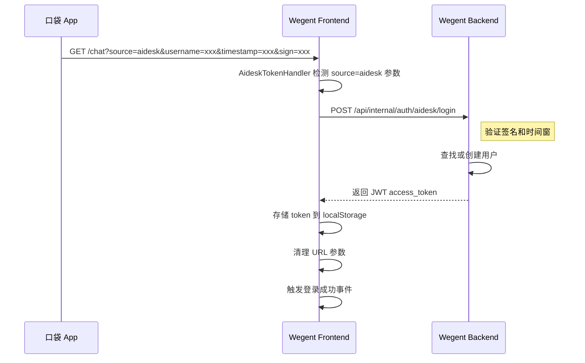

# Aidesk 认证集成实现计划

## 1. 需求概述

当口袋 App 内嵌 WebView 访问 `https://wegent.intra.weibo.com/chat` 时，需要通过 URL 查询参数进行签名验证，实现免登录直接认证。

### 1.1 请求参数

| 参数名 | 说明 |
|--------|------|
| `source` | 固定为 `aidesk`，表示来源为口袋 AI 桌面端 |
| `username` | 当前登录用户登录名 |
| `timestamp` | Unix 时间戳（秒） |
| `sign` | MD5 签名（32 位小写十六进制） |

### 1.2 签名算法

1. 参与签名的字段：`source`、`username`、`timestamp`（按字典序排序）
2. 拼接格式：`source=aidesk&timestamp=xxx&username=xxx&secret_key=<共享密钥>`
3. 对拼接字符串进行 UTF-8 编码后计算 MD5，转为 32 位小写十六进制

### 1.3 验证规则

1. 时间窗校验：timestamp 与服务器时间偏差不超过 300 秒
2. 签名验证：使用共享密钥重新计算签名并比对

---

## 2. 技术架构

### 2.1 认证流程（类似钉钉认证模式）



### 2.2 文件结构

```
backend/wecode/
├── api/
│   └── auth.py                        # 添加 aidesk_login 端点（已有 CAS 登录）
├── service/
│   └── aidesk_auth_service.py         # 新增：签名验证服务
└── config/
    └── aidesk_config.py               # 新增：aidesk 配置

frontend/wecode/
├── components/
│   └── aidesk/
│       └── AideskTokenHandler.tsx     # 新增：处理 aidesk 认证
└── hooks/
    └── useAideskAuth.ts               # 新增：aidesk 认证 hook

frontend/src/app/(tasks)/chat/
└── page.tsx                           # 集成 AideskTokenHandler
```

### 2.3 与钉钉认证的对比

| 特性 | 钉钉认证 | Aidesk 认证 |
|------|---------|-------------|
| 入口页面 | `/auth/dingtalk` | `/chat`（直接访问） |
| 认证方式 | OAuth（调用钉钉 SDK 获取 auth_code） | 签名验证（URL 参数带签名） |
| 后端端点 | `POST /auth/dingtalk/login` | `POST /api/internal/auth/aidesk/login` |
| 前端组件 | `useDingTalkAuth` hook | `AideskTokenHandler` 组件 |
| Token 存储 | `setToken()` | `localStorage.setItem()` |

---

## 3. 后端实现

### 3.1 配置项 - backend/wecode/config/aidesk_config.py

```python
from pydantic_settings import BaseSettings

class AideskConfig(BaseSettings):
    # 共享密钥（与口袋客户端约定一致）
    AIDESK_Secret_KEY: str = ""
    # 时间窗口（秒），默认 300 秒
    AIDESK_TIMESTAMP_WINDOW: int = 300
    # 是否启用 aidesk 认证
    AIDESK_AUTH_ENABLED: bool = True
    
    class Config:
        env_file = ".env"
        extra = "ignore"

aidesk_config = AideskConfig()
```

### 3.2 签名验证服务 - backend/wecode/service/aidesk_auth_service.py

```python
import hashlib
import time
import logging
from typing import Optional, Tuple
from wecode.config.aidesk_config import aidesk_config

logger = logging.getLogger(__name__)

class AideskAuthService:
    def __init__(self):
        self.secret_key = aidesk_config.AIDESK_Secret_KEY
        self.timestamp_window = aidesk_config.AIDESK_TIMESTAMP_WINDOW
    
    def verify_signature(
        self,
        source: str,
        username: str,
        timestamp: str,
        sign: str
    ) -> Tuple[bool, Optional[str]]:
        """
        验证 aidesk 签名
        
        Returns:
            Tuple[bool, Optional[str]]: (是否验证通过, 错误信息)
        """
        # 检查密钥是否配置
        if not self.secret_key:
            logger.error("[Aidesk] Secret key not configured")
            return False, "Aidesk authentication not configured"
        
        # 验证时间窗口
        try:
            ts = int(timestamp)
            current_time = int(time.time())
            if abs(current_time - ts) > self.timestamp_window:
                logger.warning(
                    f"[Aidesk] Timestamp out of window: "
                    f"request={ts}, server={current_time}, diff={abs(current_time - ts)}"
                )
                return False, "Timestamp expired"
        except ValueError:
            logger.error(f"[Aidesk] Invalid timestamp format: {timestamp}")
            return False, "Invalid timestamp format"
        
        # 计算签名
        expected_sign = self._calculate_signature(source, username, timestamp)
        
        # 常量时间比较（防止时序攻击）
        if not self._constant_time_compare(sign.lower(), expected_sign.lower()):
            logger.warning(
                f"[Aidesk] Signature mismatch for user={username}, "
                f"expected={expected_sign}, got={sign}"
            )
            return False, "Invalid signature"
        
        logger.info(f"[Aidesk] Signature verified for user={username}")
        return True, None
    
    def _calculate_signature(
        self,
        source: str,
        username: str,
        timestamp: str
    ) -> str:
        """
        计算签名
        
        签名规则：
        1. 参与签名的字段按字典序排序：source, timestamp, username
        2. 拼接格式：key1=value1&key2=value2&secret_key=<密钥>
        3. MD5 哈希，返回 32 位小写十六进制
        """
        # 去除首尾空格
        source = source.strip()
        username = username.strip()
        timestamp = timestamp.strip()
        
        # 按字典序排序拼接
        sign_str = f"source={source}&timestamp={timestamp}&username={username}&secret_key={self.secret_key}"
        
        # 计算 MD5
        md5_hash = hashlib.md5(sign_str.encode('utf-8')).hexdigest()
        return md5_hash.lower()
    
    def _constant_time_compare(self, a: str, b: str) -> bool:
        """常量时间字符串比较，防止时序攻击"""
        if len(a) != len(b):
            return False
        result = 0
        for x, y in zip(a, b):
            result |= ord(x) ^ ord(y)
        return result == 0

aidesk_auth_service = AideskAuthService()
```

### 3.3 API 端点 - 修改 backend/wecode/api/auth.py

在现有的 [`auth.py`](backend/wecode/api/auth.py) 中添加 aidesk 登录端点：

```python
from pydantic import BaseModel
from wecode.service.aidesk_auth_service import aidesk_auth_service
from wecode.config.aidesk_config import aidesk_config
from app.services.k_batch import apply_default_resources_sync

class AideskLoginRequest(BaseModel):
    """Aidesk login request body."""
    source: str
    username: str
    timestamp: str
    sign: str

class AideskLoginResponse(BaseModel):
    """Aidesk login response."""
    access_token: str
    token_type: str = "bearer"
    user: dict

@router.post("/aidesk/login")
async def aidesk_login(
    request: Request,
    body: AideskLoginRequest,
    db: Session = Depends(get_db),
) -> AideskLoginResponse:
    """
    Aidesk SSO login endpoint.
    
    Validates signature from 口袋 App and returns JWT token.
    """
    logger = logging.getLogger("aidesk_login")
    
    # Check if aidesk auth is enabled
    if not aidesk_config.AIDESK_AUTH_ENABLED:
        logger.warning("[Aidesk] Auth is disabled")
        raise HTTPException(status_code=403, detail="Aidesk authentication is disabled")
    
    # Verify source
    if body.source != "aidesk":
        logger.warning(f"[Aidesk] Invalid source: {body.source}")
        raise HTTPException(status_code=400, detail="Invalid source")
    
    # Verify signature
    is_valid, error_msg = aidesk_auth_service.verify_signature(
        source=body.source,
        username=body.username,
        timestamp=body.timestamp,
        sign=body.sign
    )
    
    if not is_valid:
        logger.warning(f"[Aidesk] Auth failed for user={body.username}: {error_msg}")
        raise HTTPException(status_code=401, detail=error_msg)
    
    # Find or create user
    user_name = body.username.strip()
    user = db.scalar(select(User).where(User.user_name == user_name))
    
    if not user:
        # Create new user
        logger.info(f"[Aidesk] Creating new user: {user_name}")
        new_user = User(
            user_name=user_name,
            email=f"{user_name}@aidesk.user",  # Placeholder email
            password_hash=get_password_hash(str(uuid.uuid4())),
            git_info=[],
            is_active=True,
            preferences=json.dumps({}),
            auth_source="aidesk",
        )
        db.add(new_user)
        db.commit()
        db.refresh(new_user)
        user = new_user
        
        # Apply default resources for new users
        try:
            apply_default_resources_sync(new_user.id)
        except Exception as e:
            logger.warning(
                f"[Aidesk] Failed to apply default resources for user {new_user.id}: {e}"
            )
    else:
        # Update auth_source if needed
        if user.auth_source == "unknown":
            logger.info(f"[Aidesk] Updating auth_source for user: {user_name}")
            user.auth_source = "aidesk"
            db.commit()
    
    # Check if user is active
    if not user.is_active:
        logger.warning(f"[Aidesk] User not active: {user_name}")
        raise HTTPException(status_code=400, detail="User is not active")
    
    # Generate JWT token
    access_token = security.create_access_token(data={"sub": user.user_name})
    
    logger.info(f"[Aidesk] User logged in successfully: {user.user_name}")
    
    return AideskLoginResponse(
        access_token=access_token,
        user={
            "id": user.id,
            "user_name": user.user_name,
            "email": user.email,
            "role": user.role,
            "auth_source": user.auth_source,
        },
    )
```

---

## 4. 前端实现

### 4.1 AideskTokenHandler 组件 - frontend/src/features/login/components/AideskTokenHandler.tsx

```typescript
'use client'

import { useEffect, useState } from 'react'
import { useRouter, useSearchParams } from 'next/navigation'
import { useTranslation } from '@/hooks/useTranslation'
import { useToast } from '@/hooks/use-toast'
import { apiClient } from '@/lib/api-client'

interface AideskLoginResponse {
  access_token: string
  token_type: string
  user: {
    id: number
    user_name: string
    email: string
    role: string
    auth_source: string
  }
}

/**
 * Aidesk Token Handler Component
 *
 * Handles authentication from 口袋 App WebView
 * When URL contains source=aidesk, extracts parameters and calls backend for authentication
 */
export default function AideskTokenHandler() {
  const { t } = useTranslation()
  const { toast } = useToast()
  const router = useRouter()
  const searchParams = useSearchParams()
  const [isProcessing, setIsProcessing] = useState(false)

  useEffect(() => {
    const source = searchParams.get('source')
    const username = searchParams.get('username')
    const timestamp = searchParams.get('timestamp')
    const sign = searchParams.get('sign')

    // Only process if source is aidesk and all params are present
    if (source !== 'aidesk' || !username || !timestamp || !sign) {
      return
    }

    // Prevent duplicate processing
    if (isProcessing) {
      return
    }

    const handleAideskLogin = async () => {
      setIsProcessing(true)
      
      try {
        console.log('[Aidesk] Processing login for user:', username)
        
        // Call backend to verify signature and get token
        const response = await apiClient.post<AideskLoginResponse>(
          '/api/internal/auth/aidesk/login',
          {
            source,
            username,
            timestamp,
            sign,
          }
        )

        if (response.access_token) {
          // Store token
          localStorage.setItem('auth_token', response.access_token)
          localStorage.setItem('token_type', response.token_type || 'bearer')

          console.log('[Aidesk] Login successful for user:', response.user.user_name)

          toast({
            title: t('common:auth.login_success'),
          })

          // Clean URL parameters
          const url = new URL(window.location.href)
          url.searchParams.delete('source')
          url.searchParams.delete('username')
          url.searchParams.delete('timestamp')
          url.searchParams.delete('sign')

          // Replace URL and trigger refresh
          router.replace(url.pathname + url.search)

          // Dispatch login success event
          setTimeout(() => {
            window.dispatchEvent(new Event('common:aidesk-login-success'))
          }, 100)
        }
      } catch (error: any) {
        console.error('[Aidesk] Login failed:', error)
        
        const errorMessage = error?.response?.data?.detail || error?.message || 'Authentication failed'
        
        toast({
          variant: 'destructive',
          title: t('common:auth.login_failed'),
          description: errorMessage,
        })

        // Clean URL parameters even on error
        const url = new URL(window.location.href)
        url.searchParams.delete('source')
        url.searchParams.delete('username')
        url.searchParams.delete('timestamp')
        url.searchParams.delete('sign')
        router.replace(url.pathname + url.search)
      } finally {
        setIsProcessing(false)
      }
    }

    handleAideskLogin()
  }, [searchParams, router, t, toast, isProcessing])

  return null
}
```

### 4.2 集成到 Chat 页面 - 修改 frontend/src/app/(tasks)/chat/page.tsx

在 [`page.tsx`](frontend/src/app/(tasks)/chat/page.tsx:1) 中添加 AideskTokenHandler：

```typescript
import AideskTokenHandler from '@/features/login/components/AideskTokenHandler'

// ... 在 return 中添加
return (
  <>
    {/* Handle Aidesk authentication from 口袋 App */}
    <AideskTokenHandler />
    {/* Handle OIDC token from URL parameters */}
    <OidcTokenHandler />
    {/* ... 其他组件 */}
  </>
)
```

---

## 5. 配置说明

### 5.1 环境变量

在 `.env` 文件中添加：

```bash
# Aidesk Authentication Configuration
AIDESK_Secret_KEY=your-shared-secret-key-here
AIDESK_TIMESTAMP_WINDOW=300
AIDESK_AUTH_ENABLED=true
```

### 5.2 安全注意事项

1. **HTTPS 必须**：生产环境必须使用 HTTPS
2. **密钥管理**：共享密钥需要安全存储，定期轮换时双端同时更新
3. **时间窗口**：默认 300 秒，可根据需要调整
4. **日志脱敏**：签名和密钥不应出现在日志中

---

## 6. 测试计划

### 6.1 单元测试

```python
# backend/wecode/tests/test_aidesk_auth.py

import pytest
import time
import hashlib
from wecode.service.aidesk_auth_service import AideskAuthService

class TestAideskAuthService:
    def setup_method(self):
        self.service = AideskAuthService()
        self.service.secret_key = "test-secret-key"
        self.service.timestamp_window = 300
    
    def test_calculate_signature(self):
        """Test signature calculation matches expected format"""
        source = "aidesk"
        username = "testuser"
        timestamp = "1730000000"
        
        expected_str = f"source={source}&timestamp={timestamp}&username={username}&secret_key=test-secret-key"
        expected_sign = hashlib.md5(expected_str.encode('utf-8')).hexdigest().lower()
        
        actual_sign = self.service._calculate_signature(source, username, timestamp)
        assert actual_sign == expected_sign
    
    def test_verify_signature_success(self):
        """Test successful signature verification"""
        source = "aidesk"
        username = "testuser"
        timestamp = str(int(time.time()))
        sign = self.service._calculate_signature(source, username, timestamp)
        
        is_valid, error = self.service.verify_signature(source, username, timestamp, sign)
        assert is_valid is True
        assert error is None
    
    def test_verify_signature_expired(self):
        """Test signature verification fails for expired timestamp"""
        source = "aidesk"
        username = "testuser"
        timestamp = str(int(time.time()) - 600)  # 10 minutes ago
        sign = self.service._calculate_signature(source, username, timestamp)
        
        is_valid, error = self.service.verify_signature(source, username, timestamp, sign)
        assert is_valid is False
        assert "expired" in error.lower()
    
    def test_verify_signature_invalid(self):
        """Test signature verification fails for invalid signature"""
        source = "aidesk"
        username = "testuser"
        timestamp = str(int(time.time()))
        sign = "invalid_signature"
        
        is_valid, error = self.service.verify_signature(source, username, timestamp, sign)
        assert is_valid is False
        assert "invalid" in error.lower()
```

### 6.2 集成测试

1. 使用 Postman 或 curl 测试 API 端点
2. 在浏览器中模拟带参数的 URL 访问
3. 验证用户创建和 token 生成

---

## 7. 实现步骤

1. **后端配置** - 创建 `aidesk_config.py`
2. **签名服务** - 创建 `aidesk_auth_service.py`
3. **API 端点** - 在 `auth.py` 中添加 `/aidesk/login` 端点
4. **前端组件** - 创建 `AideskTokenHandler.tsx`
5. **页面集成** - 在 `/chat` 页面添加组件
6. **单元测试** - 编写测试用例
7. **集成测试** - 端到端测试验证

---

## 8. 风险与注意事项

1. **重放攻击**：时间窗口限制可以缓解，但无法完全防止
2. **密钥泄露**：如果密钥泄露，需要立即更换
3. **用户名冲突**：如果 aidesk 用户名与现有用户名冲突，会复用现有用户
4. **网络延迟**：时间窗口需要考虑网络延迟，建议设置为 300 秒
