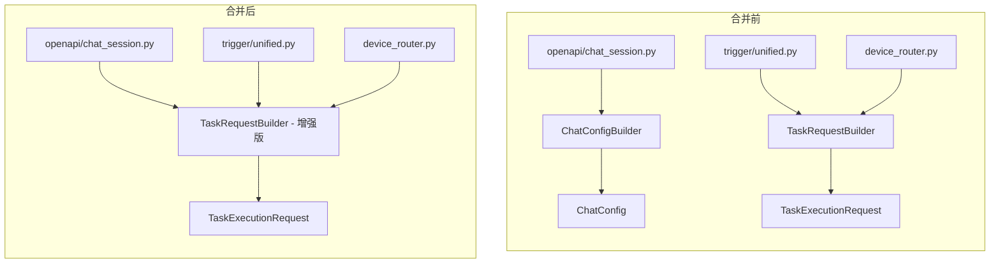

# Builder 合并计划：ChatConfigBuilder → TaskRequestBuilder

> **目标**：将 `ChatConfigBuilder` 的核心逻辑合并到 `TaskRequestBuilder`，删除 `ChatConfigBuilder` 和 `ChatConfig`，统一为单一的请求构建器。

---

## 1. 当前状态分析

### 1.1 两个 Builder 的对比

| 特性 | `ChatConfigBuilder` | `TaskRequestBuilder` |
|------|---------------------|---------------------|
| **位置** | `backend/app/services/chat/config/chat_config.py` | `backend/app/services/execution/request_builder.py` |
| **输出** | `ChatConfig` (dataclass) | `TaskExecutionRequest` (shared model) |
| **代码行数** | ~738 行 | ~362 行 |
| **主要用途** | OpenAPI `/v1/responses` 端点 | 统一执行架构 (Device, Executor) |

### 1.2 功能差异

| 功能 | ChatConfigBuilder | TaskRequestBuilder |
|------|-------------------|-------------------|
| CRD 解析 (Team→Bot→Ghost→Shell→Model) | ✅ 完整 | ❌ 简化 |
| Model 配置解密 | ✅ 支持 | ❌ 不支持 |
| Model 占位符替换 | ✅ 支持 | ❌ 不支持 |
| Skill 查询 (public/private/group) | ✅ 完整 | ❌ 简化 |
| Shell Type 解析 | ✅ 完整 | ❌ 简化 |
| 缓存优化 | ✅ 有 | ❌ 无 |

### 1.3 使用场景

**ChatConfigBuilder 使用位置**：
- `backend/app/services/openapi/chat_session.py` - OpenAPI `/v1/responses` 端点

**TaskRequestBuilder 使用位置**：
- `backend/app/services/chat/trigger/unified.py` - 统一触发器
- `backend/app/services/device_router.py` - Device 路由

---

## 2. 合并方案

### 2.1 核心思路

将 `ChatConfigBuilder` 的完整 CRD 解析逻辑移植到 `TaskRequestBuilder`，使其成为唯一的请求构建器。

### 2.2 合并后的 TaskRequestBuilder 结构

```python
class TaskRequestBuilder:
    """Unified task request builder.
    
    Builds TaskExecutionRequest from database models with full CRD resolution.
    """
    
    def __init__(self, db: Session):
        self.db = db
        self._cached_shell_type: str | None = None  # 从 ChatConfigBuilder 移植
    
    def build(
        self,
        subtask: Subtask,
        task: TaskResource,
        user: User,
        team: Kind,
        message: str,
        *,
        # 原有参数
        enable_tools: bool = True,
        enable_web_search: bool = False,
        enable_clarification: bool = False,
        enable_deep_thinking: bool = True,
        # ...
        # 新增参数（从 ChatConfigBuilder 移植）
        override_model_name: str | None = None,
        force_override: bool = False,
        team_member_prompt: str | None = None,
    ) -> TaskExecutionRequest:
        ...
    
    # === 从 ChatConfigBuilder 移植的方法 ===
    def _get_first_bot(self, team: Kind) -> Kind | None:
        """Get the first bot from team members."""
        ...
    
    def _get_model_config(
        self,
        bot: Kind,
        user_id: int,
        override_model_name: str | None,
        force_override: bool,
        task_id: int,
    ) -> dict:
        """Get model configuration with decryption and placeholder replacement."""
        ...
    
    def _get_base_system_prompt(
        self,
        bot: Kind,
        team: Kind,
        team_member_prompt: str | None,
    ) -> str:
        """Get base system prompt from Ghost."""
        ...
    
    def _resolve_shell_type(self, bot_crd: Bot) -> str:
        """Resolve shell_type from bot's shellRef."""
        ...
    
    def _get_bot_skills(
        self,
        bot: Kind,
        team: Kind,
        user_preload_skills: list | None = None,
    ) -> tuple[list[dict], list[str], list[str]]:
        """Get skills for the bot from Ghost."""
        ...
    
    def _find_skill(self, skill_name: str, team: Kind) -> Kind | None:
        """Find skill by name with priority search."""
        ...
    
    def _find_skill_by_ref(
        self,
        skill_name: str,
        namespace: str,
        is_public: bool,
        user_id: int,
    ) -> Kind | None:
        """Find skill by reference."""
        ...
    
    def _build_skill_data(self, skill: Kind) -> dict:
        """Build skill data dictionary."""
        ...
```

---

## 3. 实施步骤

### Phase 1: 增强 TaskRequestBuilder

1. **移植 CRD 解析逻辑**
   - 从 `ChatConfigBuilder` 复制 `_get_first_bot()` 方法
   - 复制 `_resolve_shell_type()` 方法（含缓存）
   - 复制 `_get_model_config()` 方法（含解密和占位符替换）
   - 复制 `_get_base_system_prompt()` 方法

2. **移植 Skill 处理逻辑**
   - 复制 `_get_bot_skills()` 方法
   - 复制 `_find_skill()` 方法
   - 复制 `_find_skill_by_ref()` 方法
   - 复制 `_build_skill_data()` 方法

3. **更新 build() 方法**
   - 添加新参数：`override_model_name`, `force_override`, `team_member_prompt`
   - 使用新的 CRD 解析方法替换简化版本

### Phase 2: 更新调用方

1. **更新 `openapi/chat_session.py`**
   - 将 `ChatConfigBuilder` 替换为 `TaskRequestBuilder`
   - 调整返回值处理（从 `ChatConfig` 改为 `TaskExecutionRequest`）

2. **更新 `ChatSessionSetup`**
   - 移除对 `ChatConfig` 的依赖
   - 直接使用 `TaskExecutionRequest` 的字段

### Phase 3: 清理

1. **删除文件**
   - 删除 `backend/app/services/chat/config/chat_config.py` 中的 `ChatConfig` 和 `ChatConfigBuilder`
   - 或者将整个文件删除（如果只包含这两个类）

2. **更新导出**
   - 更新 `backend/app/services/chat/config/__init__.py`
   - 移除 `ChatConfig` 和 `ChatConfigBuilder` 的导出

---

## 4. 文件变更清单

### 修改文件

```
backend/app/services/execution/request_builder.py
  - 添加 CRD 解析方法（从 ChatConfigBuilder 移植）
  - 添加 Skill 处理方法（从 ChatConfigBuilder 移植）
  - 更新 build() 方法签名和实现

backend/app/services/openapi/chat_session.py
  - 将 ChatConfigBuilder 替换为 TaskRequestBuilder
  - 更新 ChatSessionSetup 的字段来源

backend/app/services/chat/config/__init__.py
  - 移除 ChatConfig 和 ChatConfigBuilder 的导出
```

### 删除文件/代码

```
backend/app/services/chat/config/chat_config.py
  - 删除 ChatConfig dataclass
  - 删除 ChatConfigBuilder class
  - 保留其他内容（如果有）
```

---

## 5. 风险评估

### 5.1 低风险
- `TaskRequestBuilder` 已经在使用中，只是增强功能
- `ChatConfigBuilder` 只有一个调用点（`openapi/chat_session.py`）

### 5.2 需要注意
- Model 配置的解密逻辑需要正确移植
- Skill 查询的优先级逻辑需要保持一致
- 缓存机制需要正确实现

### 5.3 测试重点
- OpenAPI `/v1/responses` 端点的功能测试
- Model 配置解密测试
- Skill 加载测试
- Device 路由测试

---

## 6. 合并后的架构图



---

## 7. 代码示例

### 7.1 合并后的 build() 方法签名

```python
def build(
    self,
    subtask: Subtask,
    task: TaskResource,
    user: User,
    team: Kind,
    message: str,
    *,
    # Feature toggles
    enable_tools: bool = True,
    enable_web_search: bool = False,
    enable_clarification: bool = False,
    enable_deep_thinking: bool = True,
    # Skill configuration
    skill_names: Optional[List[str]] = None,
    preload_skills: Optional[List[str]] = None,
    user_selected_skills: Optional[List[str]] = None,
    # Knowledge base
    knowledge_base_ids: Optional[List[int]] = None,
    document_ids: Optional[List[int]] = None,
    is_user_selected_kb: bool = True,
    # Session
    history_limit: Optional[int] = None,
    new_session: bool = False,
    attachments: Optional[List[dict]] = None,
    # Subscription
    is_subscription: bool = False,
    system_mcp_config: Optional[dict] = None,
    # Tracing
    trace_context: Optional[dict] = None,
    # Model override (from ChatConfigBuilder)
    override_model_name: Optional[str] = None,
    force_override: bool = False,
    team_member_prompt: Optional[str] = None,
) -> TaskExecutionRequest:
```

### 7.2 openapi/chat_session.py 更新示例

```python
# Before
from app.services.chat.config import ChatConfigBuilder

config_builder = ChatConfigBuilder(db=db, team=team, user_id=user.id, user_name=user.user_name)
chat_config = config_builder.build(...)
model_config = chat_config.model_config
system_prompt = chat_config.system_prompt

# After
from app.services.execution import TaskRequestBuilder

builder = TaskRequestBuilder(db)
request = builder.build(
    subtask=assistant_subtask,
    task=task,
    user=user,
    team=team,
    message=input_text,
    override_model_name=model_info.get("model_id"),
    force_override=model_info.get("model_id") is not None,
    ...
)
model_config = request.model_config
system_prompt = request.system_prompt
```

---

## 8. 总结

本次重构将：
1. **消除重复**：合并两个功能重叠的 Builder
2. **统一接口**：所有场景使用同一个 `TaskRequestBuilder`
3. **完善功能**：`TaskRequestBuilder` 获得完整的 CRD 解析能力
4. **简化维护**：减少代码量，降低维护成本

预计影响范围小，风险可控。
