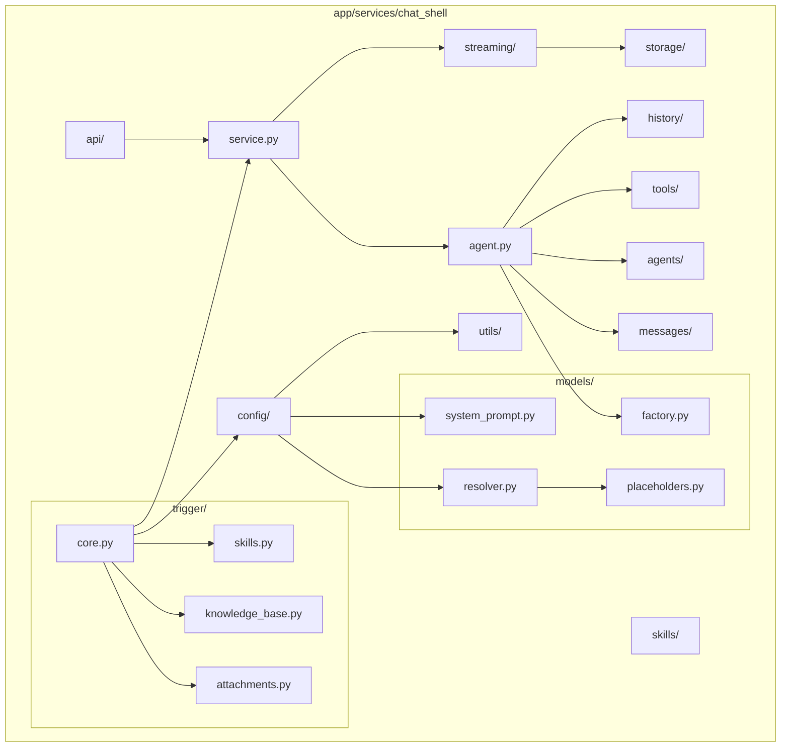
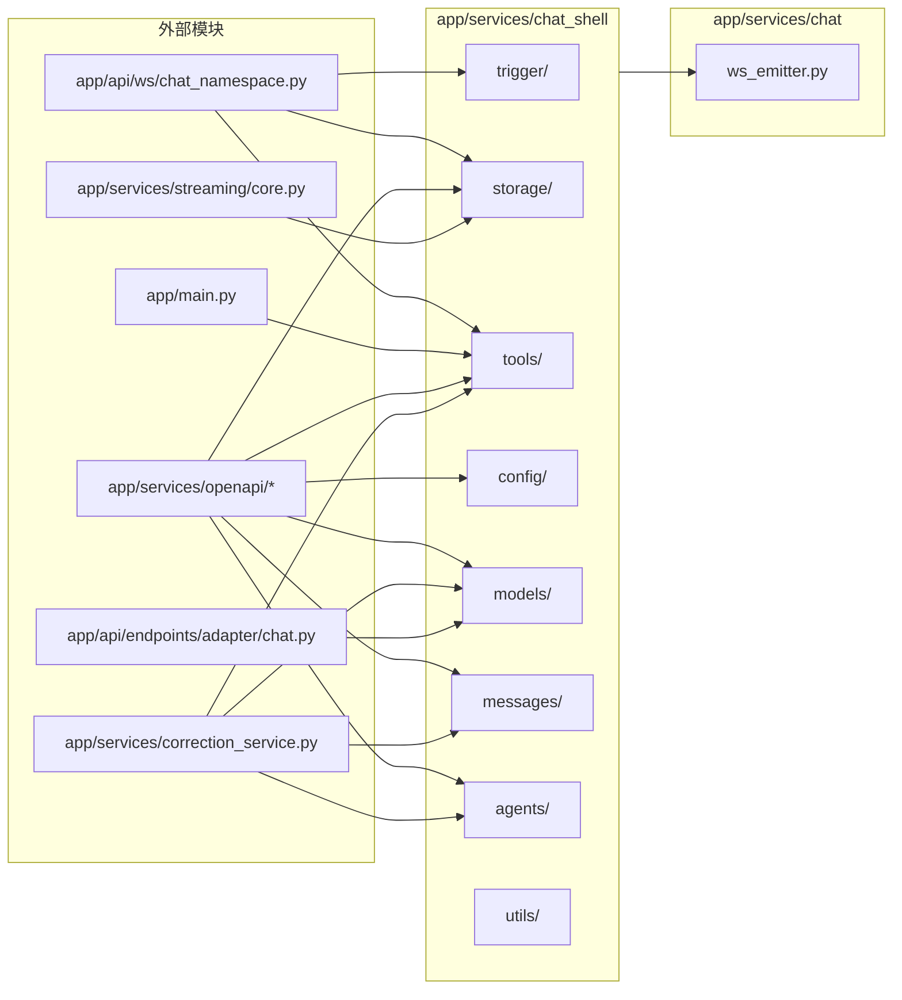

# chat_v2 → chat_shell 重构设计方案

## 1. 执行摘要

本文档提出将 `backend/app/services/chat_v2/` 包重构为 `chat_shell` 包。Chat Shell 是一种 Shell 类型，与 Claude Code、Agno、Dify 等 Shell 本质上是同一层级的概念，都是执行 AI 任务的运行环境。

### 核心目标

1. **重命名包**：`chat_v2` → `chat_shell`（与系统 Shell 概念对应）
2. **拆分大文件**：将 `ai_trigger.py`（905行）和 `models/resolver.py`（624行）拆分为更小的模块
3. **删除重复代码**：删除 `streaming/global_emitter.py`，统一使用 `app/services/chat/ws_emitter.py`
4. **统一入口设计**：定义 `ChatEvent` 作为统一输入，`StreamEvent` 作为统一输出
5. **独立部署能力**：Chat Shell 可以独立部署，有自己的 SSE/WebSocket 通道
6. **直接重构**：不需要兼容层，一次性完成迁移

---

## 2. Shell 类型对比

### 2.1 系统中的 Shell 类型

| Shell 类型 | 运行方式 | 特点 |
|-----------|---------|------|
| **Chat Shell** | 嵌入 Backend 或独立部署 | 直接调用 LLM API，支持工具调用 |
| **Claude Code** | Docker 容器 | Claude Code SDK，支持代码执行 |
| **Agno** | Docker 容器 | Agno 框架，支持团队协作模式 |
| **Dify** | 外部 API | 代理到 Dify 服务 |

### 2.2 Chat Shell 的职责

```
┌─────────────────────────────────────────────────────────────────┐
│                         Chat Shell                               │
├─────────────────────────────────────────────────────────────────┤
│  核心职责：                                                       │
│  • LLM 对话管理（直接调用 LLM API）                                │
│  • 流式响应处理（SSE / WebSocket）                                 │
│  • 工具调用执行（MCP、内置工具、技能工具）                           │
│  • 会话状态管理                                                   │
│  • 消息历史加载                                                   │
├─────────────────────────────────────────────────────────────────┤
│  输入：ChatEvent                                                  │
│  • 用户消息                                                       │
│  • 模型配置（已解析）                                              │
│  • 系统提示词（已构建）                                            │
│  • 工具配置                                                       │
├─────────────────────────────────────────────────────────────────┤
│  输出：AsyncIterator[StreamEvent]                                 │
│  • 流式响应                                                       │
│  • 工具调用结果                                                   │
│  • 完成/错误状态                                                  │
└─────────────────────────────────────────────────────────────────┘
```

### 2.3 边界外的职责（保留在 Backend）

```
┌─────────────────────────────────────────────────────────────────┐
│                           Backend                                │
├─────────────────────────────────────────────────────────────────┤
│  保留职责：                                                       │
│  • CRD 资源管理（Team, Bot, Ghost, Shell, Model）                 │
│  • 模型配置解析（从数据库读取、解密、占位符替换）                     │
│  • 系统提示词构建（从 Ghost 读取、技能注入）                         │
│  • 用户认证和授权                                                 │
│  • 任务/子任务状态管理                                            │
│  • WebSocket 连接管理                                            │
│  • 知识库管理                                                    │
└─────────────────────────────────────────────────────────────────┘
```

---

## 3. 边界划分：什么应该在 Chat Shell 内部

### 3.1 核心原则

Chat Shell 是一个**执行环境**，类似于 Claude Code 或 Agno。它的职责是：
- 接收已经准备好的配置（模型配置、系统提示词、工具列表）
- 执行 LLM 对话
- 返回流式响应

Chat Shell **不应该**负责：
- 从数据库读取 CRD 资源（Team, Bot, Ghost, Model, Shell）
- 解析和解密模型配置
- 构建系统提示词
- 管理 WebSocket 连接

### 3.2 边界划分详细分析

#### 3.2.1 应该在 Chat Shell 内部的模块

| 模块 | 职责 | 说明 |
|------|------|------|
| `agent.py` | LangGraph Agent 核心 | ✅ Chat Shell 的核心执行逻辑 |
| `service.py` | ChatShell 入口 | ✅ 接收 ChatEvent，返回 StreamEvent |
| `agents/graph_builder.py` | LangGraph 图构建 | ✅ 构建 Agent 执行图 |
| `messages/converter.py` | 消息格式转换 | ✅ 转换为 LangChain 消息格式 |
| `models/factory.py` | LangChain 模型工厂 | ✅ 根据配置创建 LLM 实例 |
| `streaming/base.py` | 流式处理基类 | ✅ 流式响应处理 |
| `streaming/sse_handler.py` | SSE 处理器 | ✅ SSE 流式输出 |
| `streaming/ws_handler.py` | WebSocket 处理器 | ✅ WebSocket 流式输出 |
| `tools/base.py` | 工具基类 | ✅ 工具执行框架 |
| `tools/events.py` | 工具事件 | ✅ 工具调用事件处理 |
| `tools/pending_requests.py` | 待处理请求 | ✅ 工具调用请求管理 |
| `tools/builtin/*` | 内置工具 | ✅ 知识库、文件读取、网页搜索等 |
| `tools/mcp/*` | MCP 工具 | ✅ MCP 协议工具支持 |
| `history/loader.py` | 历史消息加载 | ✅ 加载对话历史 |
| `skills/base.py` | 技能基类 | ✅ 技能执行框架 |
| `skills/context.py` | 技能上下文 | ✅ 技能执行上下文 |
| `skills/registry.py` | 技能注册表 | ✅ 技能工具注册 |
| `skills/provider.py` | 技能提供者 | ✅ 技能提供者接口 |

#### 3.2.2 应该移出 Chat Shell 的模块

| 模块 | 当前位置 | 建议移动到 | 原因 |
|------|----------|-----------|------|
| `ai_trigger.py` | chat_v2/ | `app/services/chat/` | 这是 Backend 的触发层，负责从 ORM 提取数据、准备配置、启动后台任务 |
| `config/chat_config.py` | chat_v2/config/ | `app/services/chat/` | ChatConfigBuilder 从数据库读取 CRD，这是 Backend 的职责 |
| `models/resolver.py` | chat_v2/models/ | `app/services/chat/` | 模型解析、占位符替换、解密都是 Backend 的职责 |
| `storage/db.py` | chat_v2/storage/ | `app/services/chat/` | 数据库操作是 Backend 的职责 |
| `storage/session.py` | chat_v2/storage/ | `app/services/chat/` | 会话管理是 Backend 的职责 |
| `streaming/global_emitter.py` | chat_v2/streaming/ | 删除 | 重复代码，使用 `app/services/chat/ws_emitter.py` |
| `utils/prompts.py` | chat_v2/utils/ | `app/services/chat/` | 系统提示词构建是 Backend 的职责 |

#### 3.2.3 边界示意图

```
┌─────────────────────────────────────────────────────────────────────────────┐
│                                 Backend                                      │
├─────────────────────────────────────────────────────────────────────────────┤
│                                                                              │
│  ┌─────────────────────────────────────────────────────────────────────┐    │
│  │                    app/services/chat/                                │    │
│  │                                                                      │    │
│  │  • ai_trigger.py        - 触发 AI 响应                               │    │
│  │  • chat_config.py       - 从 CRD 构建配置                            │    │
│  │  • model_resolver.py    - 解析模型配置、解密、占位符替换               │    │
│  │  • prompt_builder.py    - 构建系统提示词                              │    │
│  │  • session_manager.py   - 会话管理                                   │    │
│  │  • db_handler.py        - 数据库操作                                 │    │
│  │  • ws_emitter.py        - WebSocket 事件发射                         │    │
│  │                                                                      │    │
│  │  职责：                                                               │    │
│  │  1. 从数据库读取 Team, Bot, Ghost, Model, Shell                      │    │
│  │  2. 解析和解密模型配置                                                │    │
│  │  3. 构建系统提示词（包括技能注入）                                     │    │
│  │  4. 准备工具列表                                                      │    │
│  │  5. 构造 ChatEvent 发送给 Chat Shell                                 │    │
│  │  6. 消费 StreamEvent 推送到 WebSocket                                │    │
│  └──────────────────────────────┬──────────────────────────────────────┘    │
│                                 │                                            │
│                                 │ ChatEvent                                  │
│                                 ▼                                            │
│  ┌─────────────────────────────────────────────────────────────────────┐    │
│  │                    app/services/chat_shell/                          │    │
│  │                                                                      │    │
│  │  • service.py           - Chat Shell 入口                            │    │
│  │  • agent.py             - LangGraph Agent 核心                       │    │
│  │  • agents/              - Agent 图构建                               │    │
│  │  • messages/            - 消息格式转换                                │    │
│  │  • models/factory.py    - LLM 实例创建                               │    │
│  │  • streaming/           - 流式响应处理                                │    │
│  │  • tools/               - 工具执行                                   │    │
│  │  • skills/              - 技能执行                                   │    │
│  │  • history/             - 历史消息加载                                │    │
│  │                                                                      │    │
│  │  职责：                                                               │    │
│  │  1. 接收 ChatEvent（已准备好的配置）                                  │    │
│  │  2. 创建 LLM 实例                                                    │    │
│  │  3. 执行 LangGraph Agent                                             │    │
│  │  4. 处理工具调用                                                      │    │
│  │  5. 返回 AsyncIterator[StreamEvent]                                  │    │
│  └──────────────────────────────┬──────────────────────────────────────┘    │
│                                 │                                            │
│                                 │ AsyncIterator[StreamEvent]                 │
│                                 ▼                                            │
│  ┌─────────────────────────────────────────────────────────────────────┐    │
│  │                    LocalStreamAdapter                                │    │
│  │                                                                      │    │
│  │  消费 StreamEvent，推送到 WebSocket                                   │    │
│  └─────────────────────────────────────────────────────────────────────┘    │
│                                                                              │
└─────────────────────────────────────────────────────────────────────────────┘
```

### 3.3 ChatEvent 输入契约

Chat Shell 接收的 `ChatEvent` 应该包含**已经准备好的配置**，而不是原始的 CRD 引用：

```python
@dataclass
class ChatEvent:
    """Chat Shell 的统一输入。
    
    所有配置都应该由 Backend 准备好，Chat Shell 不需要访问数据库。
    """
    type: ChatEventType  # MESSAGE, CANCEL, FEEDBACK
    
    # 上下文标识
    task_id: int
    subtask_id: int
    user_id: int
    user_name: str = ""
    
    # 消息内容
    message: str | dict[str, Any] = ""  # 文本或视觉消息
    
    # 已解析的模型配置（由 Backend 准备）
    model_config: dict[str, Any] = field(default_factory=dict)
    # 包含: api_key, base_url, model_id, model, default_headers
    
    # 已构建的系统提示词（由 Backend 准备）
    system_prompt: str = ""
    
    # 历史消息（由 Backend 加载）
    history: list[dict] | None = None
    
    # 工具配置（由 Backend 准备）
    tools: list[dict] | None = None
    extra_tools: list[Any] | None = None
    
    # 功能开关
    enable_web_search: bool = False
    search_engine: str | None = None
    max_iterations: int = 10
    
    # 元数据
    message_id: int | None = None
    shell_type: str = "Chat"
```

### 3.4 与 Claude Code / Agno 的对比

| 方面 | Chat Shell | Claude Code | Agno |
|------|-----------|-------------|------|
| 运行位置 | 嵌入 Backend 或独立部署 | Docker 容器 | Docker 容器 |
| 输入 | ChatEvent | 任务配置 JSON | 任务配置 JSON |
| 输出 | AsyncIterator[StreamEvent] | 回调 API | 回调 API |
| 配置准备 | Backend 准备 | executor_manager 准备 | executor_manager 准备 |
| 数据库访问 | 不需要 | 不需要 | 不需要 |

---

## 4. Chat Shell 统一入口设计

### 4.1 设计原则

1. **统一入口**：外部只需要发送 `ChatEvent`，由 Chat Shell 自己决策是否应该回复
2. **独立部署能力**：Chat Shell 可以独立部署，有自己的 SSE/WebSocket 通道
3. **不绑定 Backend**：Chat Shell 不依赖 Backend 的 WebSocket 连接，通过 `AsyncIterator[StreamEvent]` 返回流式响应

### 3.2 架构图

**当前架构（嵌入 Backend）：**

```
┌─────────────────────────────────────────────────────────────────────────────┐
│                                 Backend                                      │
├─────────────────────────────────────────────────────────────────────────────┤
│                                                                              │
│  ┌──────────────────┐                                                        │
│  │  Chat Namespace  │     ChatEvent                                          │
│  │  (WebSocket)     │ ──────────────────┐                                    │
│  │                  │                   │                                    │
│  │  • 接收用户消息   │                   ▼                                    │
│  │  • 推送流式响应   │     ┌─────────────────────────────────────────────┐   │
│  │                  │     │              Chat Shell                      │   │
│  └────────▲─────────┘     │                                              │   │
│           │               │  ┌─────────────────────────────────────────┐ │   │
│           │               │  │  handle_event(event) -> Stream          │ │   │
│           │               │  │                                         │ │   │
│           │               │  │  • 接收 ChatEvent                       │ │   │
│           │               │  │  • 自主决策是否回复                       │ │   │
│           │               │  │  • 调用 LLM 生成响应                     │ │   │
│           │               │  │  • 执行工具调用                          │ │   │
│           │               │  │  • 返回流式响应                          │ │   │
│           │               │  └──────────────┬──────────────────────────┘ │   │
│           │               │                 │                            │   │
│           │               │                 ▼                            │   │
│           │               │  ┌─────────────────────────────────────────┐ │   │
│           │               │  │  AsyncIterator[StreamEvent]             │ │   │
│           │               │  │                                         │ │   │
│           │               │  │  yield StreamEvent(type, content, ...)  │ │   │
│           │               │  └──────────────┬──────────────────────────┘ │   │
│           │               │                 │                            │   │
│           │               └─────────────────┼────────────────────────────┘   │
│           │                                 │                                │
│           │                                 ▼                                │
│           │               ┌─────────────────────────────────────────────┐   │
│           │               │  LocalStreamAdapter                          │   │
│           └───────────────┤                                              │   │
│                           │  消费 StreamEvent，推送到 WebSocket           │   │
│                           └─────────────────────────────────────────────┘   │
│                                                                              │
└─────────────────────────────────────────────────────────────────────────────┘
```

**未来架构（独立部署）：**

```
┌──────────────────────────┐          ┌─────────────────────────────────────────┐
│         Backend          │          │         Chat Shell (独立部署)            │
├──────────────────────────┤          ├─────────────────────────────────────────┤
│                          │          │                                          │
│  ┌────────────────────┐  │  HTTP    │  ┌────────────────────────────────────┐ │
│  │  Chat Namespace    │  │  POST    │  │  POST /chat/stream                 │ │
│  │  (WebSocket)       │  │ ────────►│  │                                    │ │
│  │                    │  │          │  │  接收 ChatEvent                    │ │
│  │  • 接收用户消息     │  │          │  │  返回 SSE 流式响应                  │ │
│  │  • 转发到 Shell    │  │          │  └────────────────────────────────────┘ │
│  │  • 推送流式响应     │  │          │                                          │
│  │                    │  │  SSE     │  ┌────────────────────────────────────┐ │
│  │                    │◄─┼──────────┤  │  Chat Shell Core                   │ │
│  └────────────────────┘  │  Stream  │  │                                    │ │
│                          │          │  │  • 自主决策是否回复                  │ │
│                          │          │  │  • 调用 LLM 生成响应                │ │
│                          │          │  │  • 执行工具调用                     │ │
│                          │          │  └────────────────────────────────────┘ │
│                          │          │                                          │
│  或者：客户端直连        │          │  ┌────────────────────────────────────┐ │
│                          │          │  │  WebSocket /ws/chat                │ │
│  ┌────────────────────┐  │          │  │                                    │ │
│  │  Frontend Client   │  │  WS      │  │  双向通信，支持取消等               │ │
│  │                    │──┼──────────┼─►│                                    │ │
│  └────────────────────┘  │          │  └────────────────────────────────────┘ │
│                          │          │                                          │
└──────────────────────────┘          └─────────────────────────────────────────┘
```

### 3.3 核心接口定义

#### 3.3.1 ChatEvent - 统一输入事件

```python
# api/schemas.py
"""Chat Agent 服务的输入输出模型定义。

这是 Chat Agent 服务的边界契约。
外部系统只需要发送 ChatEvent，由 Chat Agent 自主决策如何处理。
"""

from dataclasses import dataclass, field
from enum import Enum
from typing import Any, AsyncIterator, Optional


class ChatEventType(str, Enum):
    """聊天事件类型。"""
    MESSAGE = "message"       # 用户发送消息
    CANCEL = "cancel"         # 取消当前响应
    FEEDBACK = "feedback"     # 用户反馈（点赞/点踩）


@dataclass
class ChatEvent:
    """聊天事件 - Chat Agent 的统一输入。
    
    外部系统（如 WebSocket Namespace）只需要构造 ChatEvent 发送给 Chat Agent，
    由 Chat Agent 自主决策是否应该回复、如何回复。
    
    这是微服务边界的输入契约。
    """
    type: ChatEventType
    
    # 上下文标识
    task_id: int
    subtask_id: int
    user_id: int
    user_name: str = ""
    
    # 消息内容（type=MESSAGE 时必填）
    message: str | dict[str, Any] = ""  # 文本消息或视觉消息
    
    # 模型配置（已解析，由调用方准备）
    model_config: dict[str, Any] = field(default_factory=dict)
    system_prompt: str = ""
    
    # 可选配置
    history: list[dict] | None = None
    tools: list[dict] | None = None
    extra_tools: list[Any] | None = None
    enable_web_search: bool = False
    search_engine: str | None = None
    max_iterations: int = 10
    
    # 元数据
    message_id: int | None = None
    shell_type: str = "Chat"


class StreamEventType(str, Enum):
    """流式输出事件类型。"""
    START = "start"           # 流开始
    CHUNK = "chunk"           # 内容块
    DONE = "done"             # 流完成
    ERROR = "error"           # 错误
    CANCELLED = "cancelled"   # 取消
    TOOL_CALL = "tool_call"   # 工具调用开始
    TOOL_RESULT = "tool_result"  # 工具调用结果


@dataclass
class StreamEvent:
    """流式输出事件 - Chat Agent 的统一输出。
    
    Chat Agent 通过 AsyncIterator[StreamEvent] 返回流式响应。
    调用方可以选择如何消费这些事件（推送到 WebSocket、SSE、或其他通道）。
    
    这是微服务边界的输出契约。
    """
    type: StreamEventType
    
    # 上下文标识
    task_id: int
    subtask_id: int
    
    # 内容
    content: str = ""
    offset: int = 0
    result: dict[str, Any] | None = None
    error: str | None = None
    
    # 元数据
    message_id: int | None = None
    shell_type: str = "Chat"
    
    # 工具调用相关
    tool_name: str | None = None
    tool_input: dict[str, Any] | None = None
    tool_output: str | None = None
    
    def to_dict(self) -> dict[str, Any]:
        """转换为字典，用于序列化。"""
        return {
            "type": self.type.value,
            "task_id": self.task_id,
            "subtask_id": self.subtask_id,
            "content": self.content,
            "offset": self.offset,
            "result": self.result,
            "error": self.error,
            "message_id": self.message_id,
            "shell_type": self.shell_type,
            "tool_name": self.tool_name,
            "tool_input": self.tool_input,
            "tool_output": self.tool_output,
        }
    
    def to_sse(self) -> str:
        """转换为 SSE 格式。"""
        import json
        return f"data: {json.dumps(self.to_dict())}\n\n"
```

#### 3.3.2 ChatAgentService - 核心服务接口

```python
# service.py
"""Chat Agent 服务 - 统一入口。

Chat Agent 接收 ChatEvent，自主决策是否回复，
并通过 AsyncIterator[StreamEvent] 返回流式响应。

作为独立服务时，可以直接暴露 HTTP/WebSocket 端点。
"""

from typing import AsyncIterator

from .api.schemas import ChatEvent, StreamEvent, ChatEventType, StreamEventType


class ChatAgentService:
    """Chat Agent 服务。
    
    统一入口：接收 ChatEvent，返回 StreamEvent 流。
    
    使用方式：
    1. 嵌入 Backend：直接调用 handle_event()
    2. 独立服务：通过 HTTP POST /chat/stream 或 WebSocket /ws/chat
    """
    
    async def handle_event(
        self,
        event: ChatEvent
    ) -> AsyncIterator[StreamEvent]:
        """处理聊天事件。
        
        这是 Chat Agent 的统一入口。
        外部系统只需要发送 ChatEvent，由 Chat Agent 自主决策如何处理。
        
        Args:
            event: 聊天事件
            
        Yields:
            StreamEvent: 流式响应事件
        """
        if event.type == ChatEventType.MESSAGE:
            # 处理用户消息，生成 AI 响应
            async for stream_event in self._handle_message(event):
                yield stream_event
        
        elif event.type == ChatEventType.CANCEL:
            # 处理取消请求
            yield StreamEvent(
                type=StreamEventType.CANCELLED,
                task_id=event.task_id,
                subtask_id=event.subtask_id,
            )
        
        elif event.type == ChatEventType.FEEDBACK:
            # 处理用户反馈（可选实现）
            pass
    
    async def _handle_message(
        self,
        event: ChatEvent
    ) -> AsyncIterator[StreamEvent]:
        """处理用户消息，生成 AI 响应。
        
        这里是 Chat Agent 的核心逻辑：
        1. 决策是否应该回复
        2. 调用 LLM 生成响应
        3. 执行工具调用
        4. 返回流式响应
        """
        # 发送开始事件
        yield StreamEvent(
            type=StreamEventType.START,
            task_id=event.task_id,
            subtask_id=event.subtask_id,
            shell_type=event.shell_type,
            message_id=event.message_id,
        )
        
        try:
            # 调用内部 Agent 处理
            offset = 0
            async for token in self._agent.stream_tokens(
                message=event.message,
                model_config=event.model_config,
                system_prompt=event.system_prompt,
                history=event.history,
                tools=event.tools,
                extra_tools=event.extra_tools,
                enable_web_search=event.enable_web_search,
                max_iterations=event.max_iterations,
            ):
                yield StreamEvent(
                    type=StreamEventType.CHUNK,
                    task_id=event.task_id,
                    subtask_id=event.subtask_id,
                    content=token,
                    offset=offset,
                )
                offset += len(token)
            
            # 发送完成事件
            yield StreamEvent(
                type=StreamEventType.DONE,
                task_id=event.task_id,
                subtask_id=event.subtask_id,
                offset=offset,
                result={"value": self._agent.get_full_response()},
                message_id=event.message_id,
            )
        
        except Exception as e:
            # 发送错误事件
            yield StreamEvent(
                type=StreamEventType.ERROR,
                task_id=event.task_id,
                subtask_id=event.subtask_id,
                error=str(e),
                message_id=event.message_id,
            )


# 全局服务实例
chat_agent_service = ChatAgentService()
```

### 3.4 本地流式适配器

当 Chat Agent 嵌入 Backend 时，需要一个适配器将 StreamEvent 推送到 WebSocket：

```python
# streaming/local_adapter.py
"""本地流式适配器。

消费 Chat Agent 的 StreamEvent 流，推送到 Backend 的 WebSocket。
这是当前架构（嵌入 Backend）的实现。
"""

import logging
from typing import AsyncIterator

from app.services.chat.ws_emitter import get_ws_emitter
from ..api.schemas import StreamEvent, StreamEventType

logger = logging.getLogger(__name__)


class LocalStreamAdapter:
    """本地流式适配器。
    
    消费 Chat Agent 的 StreamEvent 流，推送到 WebSocket。
    """
    
    async def consume_and_push(
        self,
        stream: AsyncIterator[StreamEvent]
    ) -> None:
        """消费流式事件并推送到 WebSocket。
        
        Args:
            stream: Chat Agent 返回的 StreamEvent 流
        """
        ws_emitter = get_ws_emitter()
        if ws_emitter is None:
            logger.error("[LocalAdapter] WebSocket emitter not initialized")
            return
        
        async for event in stream:
            await self._push_event(ws_emitter, event)
    
    async def _push_event(self, ws_emitter, event: StreamEvent) -> None:
        """推送单个事件到 WebSocket。"""
        if event.type == StreamEventType.START:
            await ws_emitter.emit_chat_start(
                task_id=event.task_id,
                subtask_id=event.subtask_id,
                shell_type=event.shell_type,
                message_id=event.message_id,
            )
        
        elif event.type == StreamEventType.CHUNK:
            await ws_emitter.emit_chat_chunk(
                task_id=event.task_id,
                subtask_id=event.subtask_id,
                content=event.content,
                offset=event.offset,
                result=event.result,
            )
        
        elif event.type == StreamEventType.DONE:
            await ws_emitter.emit_chat_done(
                task_id=event.task_id,
                subtask_id=event.subtask_id,
                offset=event.offset,
                result=event.result,
                message_id=event.message_id,
            )
        
        elif event.type == StreamEventType.ERROR:
            await ws_emitter.emit_chat_error(
                task_id=event.task_id,
                subtask_id=event.subtask_id,
                error=event.error or "Unknown error",
                message_id=event.message_id,
            )
        
        elif event.type == StreamEventType.CANCELLED:
            await ws_emitter.emit_chat_cancelled(
                task_id=event.task_id,
                subtask_id=event.subtask_id,
            )


# 全局适配器实例
local_stream_adapter = LocalStreamAdapter()
```

### 3.5 使用示例

#### 3.5.1 在 Backend 中使用（当前架构）

```python
# app/api/ws/chat_namespace.py
from app.chat_shell import chat_agent_service
from app.chat_shell.api.schemas import ChatEvent, ChatEventType
from app.chat_shell.streaming import local_stream_adapter

async def on_chat_send(self, sid, data):
    """处理用户发送消息。"""
    # 构造 ChatEvent
    event = ChatEvent(
        type=ChatEventType.MESSAGE,
        task_id=data["task_id"],
        subtask_id=data["subtask_id"],
        user_id=user.id,
        user_name=user.user_name,
        message=data["message"],
        model_config=resolved_model_config,  # 由 Backend 解析
        system_prompt=built_system_prompt,   # 由 Backend 构建
        # ... 其他配置
    )
    
    # 发送给 Chat Agent，获取流式响应
    stream = chat_agent_service.handle_event(event)
    
    # 使用本地适配器推送到 WebSocket
    await local_stream_adapter.consume_and_push(stream)
```

#### 3.5.2 作为独立服务（未来架构）

```python
# chat_shell_service/main.py
"""Chat Agent 独立服务入口。"""

from fastapi import FastAPI
from fastapi.responses import StreamingResponse
from sse_starlette.sse import EventSourceResponse

from app.chat_shell import chat_agent_service
from app.chat_shell.api.schemas import ChatEvent

app = FastAPI(title="Chat Agent Service")


@app.post("/chat/stream")
async def chat_stream(event: ChatEvent):
    """SSE 流式聊天端点。
    
    Chat Agent 作为独立服务时，直接暴露 SSE 端点。
    客户端或 Backend 可以直接调用此端点获取流式响应。
    """
    async def generate():
        async for stream_event in chat_agent_service.handle_event(event):
            yield stream_event.to_sse()
    
    return EventSourceResponse(generate())


@app.websocket("/ws/chat")
async def websocket_chat(websocket: WebSocket):
    """WebSocket 聊天端点。
    
    支持双向通信，可以接收取消请求等。
    """
    await websocket.accept()
    
    try:
        while True:
            data = await websocket.receive_json()
            event = ChatEvent(**data)
            
            async for stream_event in chat_agent_service.handle_event(event):
                await websocket.send_json(stream_event.to_dict())
    
    except WebSocketDisconnect:
        pass
```

### 3.6 关键设计决策

| 决策 | 说明 |
|------|------|
| **统一入口** | 外部只需要发送 `ChatEvent`，由 Chat Agent 自主决策是否回复 |
| **流式输出** | Chat Agent 返回 `AsyncIterator[StreamEvent]`，不绑定具体传输方式 |
| **适配器模式** | 当前使用 `LocalStreamAdapter` 推送到 WebSocket，未来可替换为其他实现 |
| **独立服务能力** | Chat Agent 可以直接暴露 SSE/WebSocket 端点，不依赖 Backend |
| **不使用 Pub/Sub** | 流式响应直接返回，不通过 Redis 等中间件，避免绑定 Backend |

---

## 5. 新的包结构设计

根据第 3 节的边界划分，重构后的包结构如下：

### 5.1 Chat Shell 包结构（app/services/chat_shell/）

Chat Shell 只包含执行环境相关的模块：

```
app/services/chat_shell/
├── __init__.py                    # 公共 API 导出
├── service.py                     # Chat Shell 入口
├── agent.py                       # LangGraph Agent 核心
│
├── api/                           # 【新】边界契约
│   ├── __init__.py
│   └── schemas.py                 # ChatEvent, StreamEvent
│
├── agents/                        # LangGraph 图构建
│   ├── __init__.py
│   └── graph_builder.py
│
├── messages/                      # 消息格式转换
│   ├── __init__.py
│   └── converter.py
│
├── models/                        # LLM 实例创建
│   ├── __init__.py
│   └── factory.py                # LangChainModelFactory
│
├── streaming/                     # 流式响应处理
│   ├── __init__.py
│   ├── base.py
│   ├── local_adapter.py          # 【新】本地流式适配器
│   ├── sse_handler.py
│   └── ws_handler.py
│   # 【删除】global_emitter.py（重复代码）
│
├── tools/                         # 工具执行
│   ├── __init__.py
│   ├── base.py
│   ├── events.py
│   ├── pending_requests.py
│   ├── builtin/
│   │   ├── __init__.py
│   │   ├── evaluation.py
│   │   ├── file_reader.py
│   │   ├── knowledge_base.py
│   │   ├── load_skill.py
│   │   └── web_search.py
│   └── mcp/
│       ├── __init__.py
│       ├── client.py
│       └── loader.py
│
├── skills/                        # 技能执行
│   ├── __init__.py
│   ├── base.py
│   ├── context.py
│   ├── provider.py
│   ├── registry.py
│   └── providers/
│       └── __init__.py
│
├── history/                       # 历史消息加载
│   ├── __init__.py
│   └── loader.py
│
└── utils/                         # 工具函数（仅 Chat Shell 内部使用）
    ├── __init__.py
    └── http.py
```

### 5.2 Backend Chat 包结构（app/services/chat/）

从 chat_v2 移出的模块，放到 Backend 的 chat 包中：

```
app/services/chat/
├── __init__.py
├── ws_emitter.py                  # WebSocket 事件发射（已存在）
│
├── trigger/                       # 【新】从 ai_trigger.py 拆分
│   ├── __init__.py
│   ├── core.py                   # trigger_ai_response, StreamTaskData
│   ├── attachments.py            # 附件处理
│   ├── knowledge_base.py         # 知识库工具准备
│   └── skills.py                 # 技能工具准备
│
├── config/                        # 【新】从 chat_v2/config 移动
│   ├── __init__.py
│   ├── chat_config.py            # ChatConfigBuilder
│   └── stream_config.py          # WebSocketStreamConfig
│
├── models/                        # 【新】从 chat_v2/models 移动
│   ├── __init__.py
│   ├── resolver.py               # 模型解析、查找
│   ├── placeholders.py           # 占位符处理
│   └── system_prompt.py          # 系统提示词获取
│
├── storage/                       # 【新】从 chat_v2/storage 移动
│   ├── __init__.py
│   ├── db.py                     # 数据库操作
│   ├── proxy.py                  # 存储代理
│   └── session.py                # 会话管理
│
└── prompts/                       # 【新】从 chat_v2/utils/prompts.py 移动
    ├── __init__.py
    └── builder.py                # 系统提示词构建
```

#### 5.3.1 Chat Shell 内部模块

| 模块 | 职责 |
|------|------|
| `api/schemas.py` | 定义 `ChatEvent` 和 `StreamEvent` 边界契约 |
| `service.py` | Chat Shell 入口，接收 `ChatEvent`，返回 `AsyncIterator[StreamEvent]` |
| `agent.py` | LangGraph Agent 核心执行逻辑 |
| `agents/graph_builder.py` | 构建 LangGraph 执行图 |
| `messages/converter.py` | 转换消息为 LangChain 格式 |
| `models/factory.py` | 根据配置创建 LLM 实例 |
| `streaming/local_adapter.py` | 消费 StreamEvent，推送到 WebSocket |
| `tools/*` | 工具执行框架和内置工具 |
| `skills/*` | 技能执行框架 |
| `history/loader.py` | 加载对话历史 |

#### 5.3.2 Backend Chat 模块（从 chat_v2 移出）

| 模块 | 职责 |
|------|------|
| `trigger/core.py` | 触发 AI 响应，从 ORM 提取数据，启动后台任务 |
| `trigger/attachments.py` | 处理用户上传的附件 |
| `trigger/knowledge_base.py` | 准备知识库工具 |
| `trigger/skills.py` | 准备技能工具 |
| `config/chat_config.py` | 从 CRD 构建 ChatConfig |
| `models/resolver.py` | 从数据库查找模型，解析配置 |
| `models/placeholders.py` | 处理占位符替换 |
| `models/system_prompt.py` | 从 Ghost 获取系统提示词 |
| `storage/*` | 数据库操作和会话管理 |
| `prompts/builder.py` | 构建系统提示词 |

---

## 6. 依赖关系图

### 4.1 包内依赖



### 4.2 外部依赖



---

## 5. 模块拆分详细设计

### 5.1 trigger/core.py

```python
"""AI 触发核心逻辑。

这是 Chat Shell 服务的入口点，负责：
1. 从 ORM 对象提取数据
2. 启动后台流式任务
3. 协调各个子模块
"""

from dataclasses import dataclass
from typing import Any, Optional

@dataclass
class StreamTaskData:
    """从 ORM 对象提取的流式任务数据。
    
    这个数据类用于在后台任务中传递数据，
    避免 DetachedInstanceError。
    """
    task_id: int
    team_id: int
    team_user_id: int
    team_name: str
    team_json: dict[str, Any]
    user_id: int
    user_name: str
    subtask_id: int
    assistant_message_id: int
    user_message_id: int

    @classmethod
    def from_orm(cls, task, team, user, assistant_subtask) -> "StreamTaskData":
        """从 ORM 对象提取数据。"""
        ...

async def trigger_ai_response(
    task: Kind,
    assistant_subtask: Subtask,
    team: Kind,
    user: User,
    message: str,
    payload: Any,
    task_room: str,
    supports_direct_chat: bool,
    namespace: Any,
    knowledge_base_ids: Optional[list[int]] = None,
) -> None:
    """触发 AI 响应的主入口。
    
    这是 Chat Shell 服务的主要入口点。
    对于直接聊天（Chat Shell），在本地处理流式响应。
    对于执行器任务（ClaudeCode, Agno），由 executor_manager 处理。
    """
    ...

async def _trigger_direct_chat(...) -> None:
    """触发直接聊天（Chat Shell）。"""
    ...

async def _stream_chat_response(...) -> None:
    """流式聊天响应。
    
    使用 ChatConfigBuilder 准备配置，
    然后委托给 ChatShellService 处理流式响应。
    """
    ...
```

### 5.2 trigger/attachments.py

```python
"""附件处理模块。

负责处理用户上传的附件，包括：
- 文本文档（PDF, DOCX, TXT 等）
- 图片（支持视觉模型）
"""

from typing import Any

async def process_attachments(
    db: Any,
    attachment_ids: list[int],
    user_id: int,
    message: str,
) -> str | dict[str, Any]:
    """处理多个附件并构建消息。
    
    Args:
        db: 数据库会话
        attachment_ids: 附件 ID 列表
        user_id: 用户 ID
        message: 原始消息
    
    Returns:
        处理后的消息（字符串或视觉消息结构）
    """
    ...
```

### 5.3 trigger/knowledge_base.py

```python
"""知识库工具准备模块。

负责创建知识库搜索工具并增强系统提示词。
"""

from typing import Any, Optional

def prepare_knowledge_base_tools(
    knowledge_base_ids: Optional[list[int]],
    user_id: int,
    db: Any,
    base_system_prompt: str,
) -> tuple[list[Any], str]:
    """准备知识库工具和增强的系统提示词。
    
    Args:
        knowledge_base_ids: 知识库 ID 列表
        user_id: 用户 ID
        db: 数据库会话
        base_system_prompt: 基础系统提示词
    
    Returns:
        (extra_tools, enhanced_system_prompt) 元组
    """
    ...
```

### 5.4 trigger/skills.py

```python
"""技能工具准备模块。

负责：
- 创建 LoadSkillTool
- 查询历史使用的技能
- 动态创建技能工具
"""

from typing import Any, Optional

def prepare_load_skill_tool(
    skill_names: list[str],
    user_id: int,
    db: Any,
    task_id: Optional[int] = None,
) -> Optional[Any]:
    """准备 LoadSkillTool。"""
    ...

def get_previously_used_skills(db: Any, task_id: int) -> list[str]:
    """获取之前使用过的技能列表。"""
    ...

def prepare_skill_tools(
    task_id: int,
    subtask_id: int,
    user_id: int,
    db_session: Any,
    skill_configs: list[dict[str, Any]],
) -> list[Any]:
    """使用 SkillToolRegistry 动态准备技能工具。"""
    ...
```

### 5.5 models/placeholders.py

```python
"""占位符处理模块。

负责解析和替换各种占位符：
- 环境变量占位符：${ENV_VAR}
- 数据源占位符：${source.path}
- 用户信息占位符：${user.name}
"""

import os
import re
from typing import Any, Dict

def resolve_env_placeholder(value: str) -> str:
    """解析环境变量占位符。
    
    支持格式：${ENV_VAR_NAME}
    """
    ...

def resolve_value_from_source(
    data_sources: Dict[str, Dict[str, Any]], 
    source_spec: str
) -> str:
    """从指定数据源解析值。
    
    支持格式：
    - "source_name.path"
    - "path"（使用默认源 agent_config）
    """
    ...

def replace_placeholders_with_sources(
    template: str, 
    data_sources: Dict[str, Dict[str, Any]]
) -> str:
    """替换模板中的所有占位符。"""
    ...

def get_default_headers_from_env() -> Dict[str, Any]:
    """从环境变量获取默认 Headers。
    
    读取 EXECUTOR_ENV 或 DEFAULT_HEADERS 环境变量。
    """
    ...

def build_default_headers_with_placeholders(
    default_headers: Dict[str, Any], 
    data_sources: Dict[str, Dict[str, Any]]
) -> Dict[str, Any]:
    """构建带占位符替换的默认 Headers。"""
    ...

def process_model_config_placeholders(
    model_config: Dict[str, Any],
    user_id: int,
    user_name: str,
    agent_config: Optional[Dict[str, Any]] = None,
    task_data: Optional[Dict[str, Any]] = None,
) -> Dict[str, Any]:
    """处理模型配置中的占位符。
    
    处理 api_key 和 default_headers 中的占位符。
    """
    ...
```

### 5.6 models/resolver.py（简化后）

```python
"""模型解析器核心逻辑。

负责：
- 从数据库查找模型
- 提取模型配置
- 获取 Bot 的模型配置
"""

from typing import Any, Dict, Optional
from sqlalchemy.orm import Session

from app.models.kind import Kind
from .placeholders import process_model_config_placeholders

def get_model_config_for_bot(
    db: Session,
    bot: Kind,
    user_id: int,
    override_model_name: Optional[str] = None,
    force_override: bool = False,
) -> Dict[str, Any]:
    """获取 Bot 的模型配置。
    
    解析优先级：
    1. force_override=True 时的 override_model_name
    2. bot.spec.agent_config.bind_model
    3. bot.spec.modelRef
    4. override_model_name（回退）
    """
    ...

def find_model(db: Session, model_name: str, user_id: int) -> Optional[Dict[str, Any]]:
    """按名称查找模型。
    
    搜索顺序：
    1. 用户私有模型
    2. 公共模型（user_id=0）
    """
    ...

def extract_model_config(model_spec: Dict[str, Any]) -> Dict[str, Any]:
    """从模型规格中提取 API 配置。
    
    Returns:
        {
            "api_key": "...",
            "base_url": "...",
            "model_id": "...",
            "model": "...",
            "default_headers": {...}
        }
    """
    ...

def extract_and_process_model_config(
    model_spec: Dict[str, Any],
    user_id: int,
    user_name: str,
    agent_config: Optional[Dict[str, Any]] = None,
    task_data: Optional[Dict[str, Any]] = None,
) -> Dict[str, Any]:
    """提取并处理模型配置（公共 API）。
    
    组合 extract_model_config 和 process_model_config_placeholders。
    """
    ...
```

### 5.7 models/system_prompt.py

```python
"""系统提示词获取模块。

负责从 Ghost 获取系统提示词并与团队成员提示词组合。
"""

from typing import Optional
from sqlalchemy.orm import Session

from app.models.kind import Kind

def get_bot_system_prompt(
    db: Session, 
    bot: Kind, 
    user_id: int, 
    team_member_prompt: Optional[str] = None
) -> str:
    """获取 Bot 的系统提示词。
    
    组合 Ghost 的系统提示词和团队成员的附加提示词。
    """
    ...
```

---

## 6. WebSocketEmitter 统一方案

### 6.1 当前状态

存在两个几乎相同的 `WebSocketEmitter` 实现：
- `app/services/chat/ws_emitter.py`（606行，功能更完整）
- `app/services/chat_v2/streaming/global_emitter.py`（549行，缺少 `emit_skill_request`）

### 6.2 统一方案

**决策**：删除 `chat_v2/streaming/global_emitter.py`，统一使用 `app/services/chat/ws_emitter.py`。

**需要更新的导入**：

| 文件 | 旧导入 | 新导入 |
|------|--------|--------|
| `chat_shell/streaming/ws_handler.py` | `from app.chat_shell.streaming import get_ws_emitter` | `from app.services.chat.ws_emitter import get_ws_emitter` |
| `chat_shell/storage/db.py` | `from app.chat_shell.streaming import get_ws_emitter, get_main_event_loop` | `from app.services.chat.ws_emitter import get_ws_emitter, get_main_event_loop` |
| `app/main.py` | `from app.chat_shell.streaming import init_ws_emitter as init_chat_v2_emitter` | 删除此导入，只保留 `init_chat_emitter` |

---

## 7. 迁移步骤

### 7.1 第一步：重命名包

```bash
# 重命名目录
mv backend/app/services/chat_v2 backend/app/services/chat_shell

# 全局替换导入路径
find backend -name "*.py" -exec sed -i '' 's/app\.services\.chat_v2/app.chat_shell/g' {} \;
```

### 7.2 第二步：创建 api/ 子包

创建 `api/schemas.py` 和 `api/client.py`，定义微服务边界。

### 7.3 第三步：拆分 ai_trigger.py

1. 创建 `trigger/` 目录
2. 将 `ai_trigger.py` 拆分为 `core.py`, `attachments.py`, `knowledge_base.py`, `skills.py`
3. 更新 `trigger/__init__.py` 导出 `trigger_ai_response`
4. 删除原 `ai_trigger.py`

### 7.4 第四步：拆分 models/resolver.py

1. 创建 `models/placeholders.py`
2. 创建 `models/system_prompt.py`
3. 简化 `models/resolver.py`
4. 更新 `models/__init__.py` 导出

### 7.5 第五步：统一 WebSocketEmitter

1. 更新所有导入路径
2. 删除 `streaming/global_emitter.py`
3. 更新 `streaming/__init__.py`

### 7.6 第六步：更新外部依赖

按以下顺序更新外部文件的导入：

1. `app/main.py`
2. `app/api/ws/chat_namespace.py`
3. `app/services/streaming/core.py`
4. `app/services/openapi/*`
5. `app/services/correction_service.py`
6. `app/api/endpoints/*`

### 7.7 第七步：运行测试

```bash
cd backend
pytest --cov=app/services/chat_shell
```

---

## 8. 公共 API 导出

### 8.1 chat_shell/__init__.py

```python
"""Chat Shell Service - LLM 直接对话服务。

这个包提供 Chat Shell 类型任务的核心功能：
- LLM 对话管理
- 流式响应处理
- 工具调用执行
- 会话状态管理

未来可能作为独立微服务部署。
"""

# 主服务
from .service import ChatShellService, chat_shell_service

# Agent
from .agent import ChatAgent, chat_agent, AgentConfig

# 流式处理
from .streaming import SSEStreamingHandler, WebSocketStreamingHandler

# 配置
from .config import ChatConfigBuilder, WebSocketStreamConfig

# AI 触发
from .trigger import trigger_ai_response

__all__ = [
    # 主服务
    "ChatShellService",
    "chat_shell_service",
    # Agent
    "ChatAgent",
    "chat_agent",
    "AgentConfig",
    # 流式处理
    "SSEStreamingHandler",
    "WebSocketStreamingHandler",
    # 配置
    "ChatConfigBuilder",
    "WebSocketStreamConfig",
    # AI 触发
    "trigger_ai_response",
]
```

---

## 9. 外部依赖更新清单

| 文件 | 需要更新的导入 |
|------|----------------|
| `app/main.py` | `chat_v2.streaming.init_ws_emitter` → 删除（使用 chat 的） |
| `app/main.py` | `chat_v2.tools.pending_requests` → `chat_shell.tools.pending_requests` |
| `app/api/ws/chat_namespace.py` | `chat_v2.ai_trigger` → `chat_shell.trigger` |
| `app/api/ws/chat_namespace.py` | `chat_v2.storage` → `chat_shell.storage` |
| `app/api/ws/chat_namespace.py` | `chat_v2.tools.pending_requests` → `chat_shell.tools.pending_requests` |
| `app/api/endpoints/openapi_responses.py` | `chat_v2.storage` → `chat_shell.storage` |
| `app/services/streaming/core.py` | `chat_v2.storage` → `chat_shell.storage` |
| `app/services/openapi/chat_response.py` | `chat_v2.*` → `chat_shell.*` |
| `app/services/openapi/chat_session.py` | `chat_v2.config` → `chat_shell.config` |
| `app/services/openapi/helpers.py` | `chat_v2.utils.http` → `chat_shell.utils.http` |
| `app/services/openapi/mcp.py` | `chat_v2.tools.mcp` → `chat_shell.tools.mcp` |
| `app/services/correction_service.py` | `chat_v2.*` → `chat_shell.*` |
| `app/api/endpoints/adapter/chat.py` | `chat_v2.models.resolver` → `chat_shell.models.resolver` |

---

## 10. 风险评估

| 风险 | 可能性 | 影响 | 缓解措施 |
|------|--------|------|----------|
| 导入路径遗漏 | 中 | 高 | 使用 grep 全面搜索，运行完整测试 |
| 循环依赖 | 低 | 中 | 保留必要的延迟导入 |
| 功能回归 | 低 | 高 | 运行 E2E 测试 |
| 性能影响 | 低 | 低 | 拆分不影响运行时性能 |

---

## 11. 未来微服务拆分路径

当需要将 Chat Shell 拆分为独立微服务时：

### 11.1 服务拆分

```
chat_shell_service/
├── main.py                    # FastAPI 应用入口
├── api/
│   ├── routes.py             # HTTP/WebSocket 路由
│   └── schemas.py            # API 模型（已定义）
├── core/                      # 从 chat_shell 包复制
│   ├── service.py
│   ├── agent.py
│   ├── streaming/
│   ├── tools/
│   └── ...
└── Dockerfile
```

### 11.2 通信方式

- **同步调用**：HTTP REST API
- **流式响应**：WebSocket 或 Server-Sent Events
- **异步通信**：Redis Pub/Sub 或消息队列

### 11.3 主服务改动

```python
# app/services/chat_shell/api/client.py
class ChatShellClient:
    def __init__(self, base_url: str | None = None):
        self.base_url = base_url or os.getenv("CHAT_SHELL_SERVICE_URL")
    
    async def stream_chat(self, request: ChatRequest, callback):
        if self.base_url:
            # 远程调用
            async with aiohttp.ClientSession() as session:
                async with session.ws_connect(f"{self.base_url}/ws/chat") as ws:
                    await ws.send_json(request.to_dict())
                    async for msg in ws:
                        event = StreamEvent.from_dict(msg.json())
                        await callback(event)
        else:
            # 本地调用
            await self._local_stream(request, callback)
```

---

## 12. 总结

本设计方案实现了以下目标：

1. **命名对应**：`chat_v2` → `chat_shell`，与系统概念一致
2. **代码拆分**：将大文件拆分为职责单一的小模块
3. **消除重复**：统一 WebSocketEmitter 实现
4. **微服务边界**：通过 `api/` 子包定义清晰的服务边界
5. **直接重构**：不需要兼容层，一次性完成迁移

重构后的代码结构更清晰，职责更明确，为未来的微服务拆分做好了准备。
