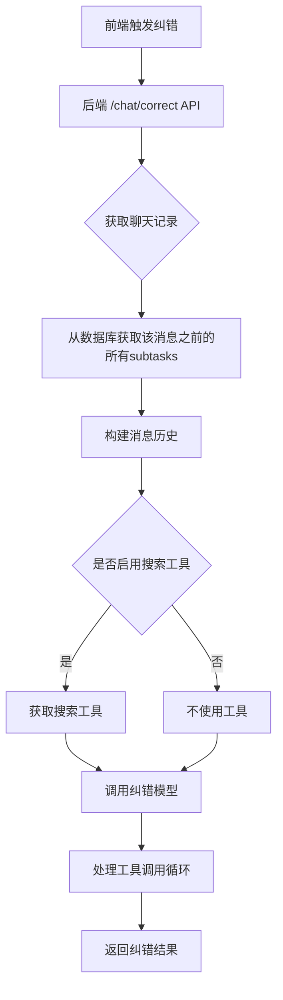
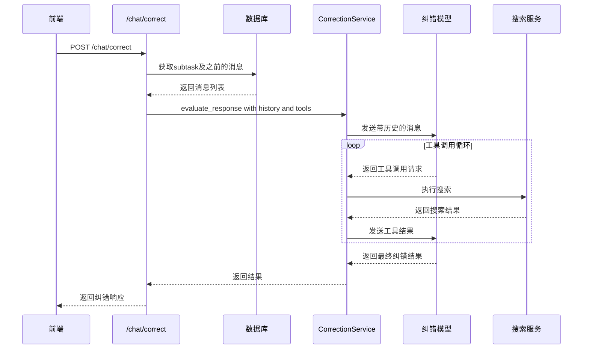

# AI纠错增强方案：引入聊天记录和搜索工具

## 1. 背景

当前AI纠错功能存在以下问题：
- **缺少上下文**：纠错模型只能看到单条用户问题和AI回答，无法理解完整的对话上下文
- **无法验证事实**：纠错模型无法使用搜索工具来验证AI回答中的事实性内容

## 2. 目标

增强AI纠错功能，使其能够：
1. **引入聊天记录**：将该AI消息之前的所有对话历史传递给纠错模型
2. **支持搜索工具**：允许纠错模型使用搜索工具来验证事实

## 3. 技术方案

### 3.1 架构概览



### 3.2 数据流



### 3.3 修改点

#### 3.3.1 后端API修改 - chat.py

**修改 `CorrectionRequest` 模型**：
```python
class CorrectionRequest(BaseModel):
    task_id: int
    message_id: int  # subtask_id of the AI message to correct
    original_question: str  # 保留用于兼容
    original_answer: str    # 保留用于兼容
    correction_model_id: str
    force_retry: bool = False
    enable_web_search: bool = False  # 新增：是否启用搜索工具
    search_engine: str | None = None  # 新增：搜索引擎名称
```

**修改 `correct_response` 函数**：
1. 根据 `message_id` 获取该subtask之前的所有消息
2. 构建聊天历史
3. 如果启用搜索，获取搜索工具
4. 调用增强版的 `correction_service.evaluate_response`

#### 3.3.2 CorrectionService修改 - correction_service.py

**修改 `evaluate_response` 方法签名**：
```python
async def evaluate_response(
    self,
    original_question: str,
    original_answer: str,
    model_config: dict[str, Any],
    history: list[dict[str, str]] | None = None,  # 新增：聊天历史
    tools: list[Tool] | None = None,  # 新增：工具列表
) -> dict[str, Any]:
```

**实现工具调用循环**：
- 参考 `chat_service.py` 中的 `_handle_tool_calling_flow` 方法
- 支持多轮工具调用
- 设置最大请求次数和时间限制

#### 3.3.3 前端修改 - MessagesArea.tsx

**修改纠错请求**：
```typescript
const result = await correctionApis.correctResponse({
  task_id: selectedTaskDetail.id,
  message_id: subtaskId,
  original_question: userMsg.content,
  original_answer: msg.content || '',
  correction_model_id: correctionModelId,
  force_retry: true,
  enable_web_search: true,  // 新增：启用搜索
});
```

### 3.4 详细实现

#### 3.4.1 获取聊天历史

在 `chat.py` 的 `correct_response` 函数中添加：

```python
# Get chat history before this message
history = []
if subtask.message_id > 1:
    # Get all subtasks before this message
    previous_subtasks = (
        db.query(Subtask)
        .filter(
            Subtask.task_id == request.task_id,
            Subtask.message_id < subtask.message_id,
            Subtask.status == SubtaskStatus.COMPLETED,
        )
        .order_by(Subtask.message_id.asc())
        .all()
    )
    
    for prev_subtask in previous_subtasks:
        if prev_subtask.role == SubtaskRole.USER:
            history.append({
                "role": "user",
                "content": prev_subtask.prompt or ""
            })
        elif prev_subtask.role == SubtaskRole.ASSISTANT:
            # Extract content from result
            content = ""
            if prev_subtask.result:
                if isinstance(prev_subtask.result, dict):
                    content = prev_subtask.result.get("value", "")
                elif isinstance(prev_subtask.result, str):
                    content = prev_subtask.result
            history.append({
                "role": "assistant",
                "content": content
            })
```

#### 3.4.2 修改CorrectionService

```python
async def evaluate_response(
    self,
    original_question: str,
    original_answer: str,
    model_config: dict[str, Any],
    history: list[dict[str, str]] | None = None,
    tools: list[Tool] | None = None,
) -> dict[str, Any]:
    # Build the correction prompt
    prompt = CORRECTION_PROMPT_TEMPLATE.format(
        original_question=original_question, 
        original_answer=original_answer
    )

    # Build messages with history
    messages = message_builder.build_messages(
        history=history or [],
        current_message=prompt,
        system_prompt="You are a professional AI response reviewer...",
    )

    # Get provider
    client = await get_http_client()
    provider = get_provider(model_config, client)
    if not provider:
        raise ValueError("Failed to create provider from model config")

    cancel_event = asyncio.Event()
    accumulated_content = ""

    # If tools are provided, use tool calling flow
    if tools:
        tool_handler = ToolHandler(tools)
        async for chunk in self._handle_tool_calling_flow(
            provider, messages, tool_handler, cancel_event
        ):
            if chunk.type == ChunkType.CONTENT and chunk.content:
                accumulated_content += chunk.content
            elif chunk.type == ChunkType.ERROR:
                raise ValueError(chunk.error or "Unknown error from LLM")
    else:
        # Simple streaming without tools
        async for chunk in provider.stream_chat(messages, cancel_event):
            if chunk.type == ChunkType.CONTENT and chunk.content:
                accumulated_content += chunk.content
            elif chunk.type == ChunkType.ERROR:
                raise ValueError(chunk.error or "Unknown error from LLM")

    return self._parse_correction_response(accumulated_content)
```

#### 3.4.3 更新提示词模板

```python
CORRECTION_PROMPT_TEMPLATE = """The user is not satisfied with the following AI response. Please analyze the reasons.

## Conversation Context
The above messages show the conversation history leading up to this response.

## User Question (Current)
{original_question}

## AI Response (User Not Satisfied)
{original_answer}

## Analysis Requirements
Please analyze from the following perspectives:

1. **Context Relevance**: Does the response properly address the conversation context?

2. **Why might the user be dissatisfied?** - Focus on **missing CRITICAL information** or **factual errors**.

3. **Fact verification**: Verify all factual claims. **Use the search tool if available** to verify facts.

4. **Logic errors**: Check for fallacies or contradictions.

5. **Missing considerations**: Identify truly important missing perspectives.

## Language Constraint (CRITICAL)
**You MUST detect the language of the `{original_question}`.** **ALL content within the JSON values MUST be written in that SAME detected language.**

## Output Format (JSON)
You MUST respond with ONLY a valid JSON object:
{{
  "scores": {{
    "accuracy": <1-10>,
    "logic": <1-10>,
    "completeness": <1-10>
  }},
  "corrections": [
    {{
      "issue": "Brief description of the problem in the detected language", 
      "category": "context_mismatch|fact_error|logic_error|missing_point", 
      "suggestion": "How to fix it in the detected language"
    }}
  ],
  "summary": "Summary of why user is dissatisfied (2-3 sentences) in the detected language",
  "improved_answer": "Provide the COMPLETE corrected answer in the detected language.",
  "is_correct": <true/false>
}}"""
```

### 3.5 前端UI增强（可选）

可以在纠错设置中添加选项：
- 启用/禁用搜索工具
- 选择搜索引擎

```typescript
interface CorrectionModeState {
  enabled: boolean;
  correctionModelId: string | null;
  correctionModelName: string | null;
  enableWebSearch: boolean;  // 新增
  searchEngine: string | null;  // 新增
}
```

## 4. 实现步骤

### 第一阶段：后端核心功能
1. [ ] 修改 `CorrectionRequest` 添加新字段
2. [ ] 修改 `correct_response` 获取聊天历史
3. [ ] 修改 `CorrectionService.evaluate_response` 支持历史和工具
4. [ ] 添加工具调用循环逻辑
5. [ ] 更新提示词模板

### 第二阶段：前端集成
6. [ ] 修改 `CorrectionRequest` 接口
7. [ ] 修改纠错API调用传递新参数
8. [ ] （可选）添加UI设置选项

### 第三阶段：测试和优化
9. [ ] 单元测试
10. [ ] 集成测试
11. [ ] 性能优化

## 5. 注意事项

1. **历史消息截断**：如果历史消息过长，需要截断以避免超出token限制
2. **工具调用限制**：设置最大工具调用次数和时间限制，避免无限循环
3. **错误处理**：搜索工具失败时应该优雅降级，继续纠错流程
4. **成本控制**：搜索工具会增加API调用成本，需要考虑是否默认启用

## 6. 配置项

可以添加以下配置项：

```python
# settings.py
CORRECTION_MAX_HISTORY_MESSAGES = 20  # 最大历史消息数
CORRECTION_ENABLE_WEB_SEARCH = True   # 是否默认启用搜索
CORRECTION_TOOL_MAX_REQUESTS = 3      # 最大工具调用次数
CORRECTION_TOOL_MAX_TIME_SECONDS = 30 # 最大工具调用时间
```
