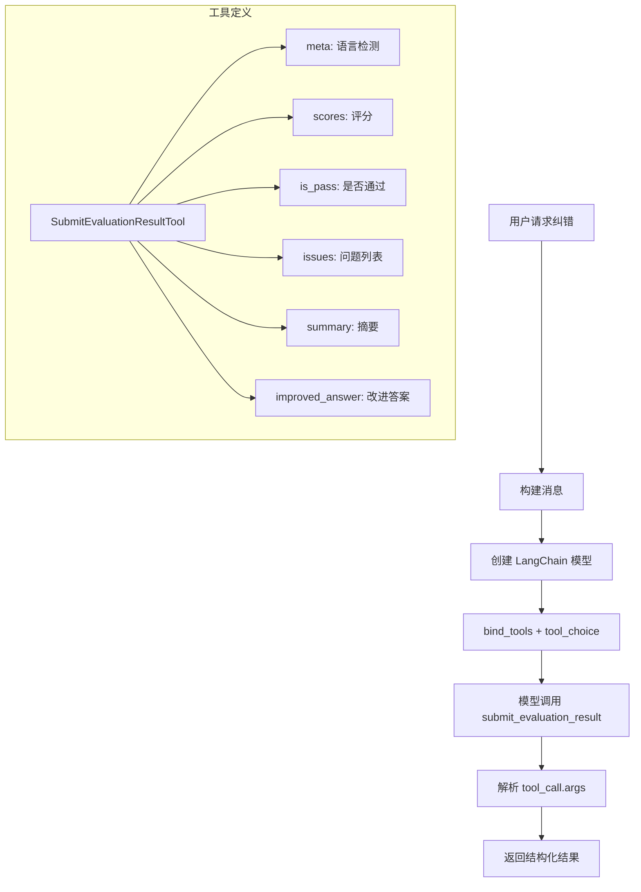

# Correction Service 工具调用重构计划

## 背景

当前的 `correction_service.py` 使用 JSON 解析方式获取 AI 评估结果，存在以下问题：
1. JSON 解析不稳定，LLM 可能输出格式不正确的 JSON
2. 需要复杂的正则表达式来提取 JSON
3. 解析失败时只能返回默认值

## 解决方案

采用 **Tool Calling（工具调用）** 方式，利用 LangChain 的 `bind_tools` 和 `tool_choice` 参数强制模型调用特定工具来返回结构化数据。

### 核心原理

```python
# 强制模型调用特定工具
model_with_tools = model.bind_tools(
    [submit_evaluation_result_tool], 
    tool_choice="submit_evaluation_result"  # 强制调用此工具
)
```

当设置 `tool_choice` 为特定工具名称时，模型**必须**调用该工具，工具的参数就是我们需要的结构化数据。

## 架构设计



## 实施步骤

### 1. 创建 SubmitEvaluationResultTool

**文件**: `backend/app/services/chat_v2/tools/builtin/evaluation.py`

```python
from langchain_core.tools import BaseTool
from pydantic import BaseModel, Field
from typing import Literal

class IssueItem(BaseModel):
    """单个问题项"""
    severity: Literal["critical", "major", "minor"] = Field(
        description="Critical=Fact error/Safety; Major=Missing key info; Minor=Style/Nitpick"
    )
    category: Literal["fact_error", "logic_error", "omission", "style", "safety"] = Field(
        description="Problem category"
    )
    description: str = Field(
        description="Brief description of the issue. MUST be in the SAME language as detected_language"
    )
    suggestion: str = Field(
        description="Actionable fix. MUST be in the SAME language as detected_language"
    )

class EvaluationMeta(BaseModel):
    """元数据"""
    detected_language: str = Field(
        description="ISO language code detected from User Question, e.g. zh-CN, en-US"
    )

class EvaluationScores(BaseModel):
    """评分"""
    accuracy: int = Field(ge=1, le=10, description="Factuality score")
    completeness: int = Field(ge=1, le=10, description="Did it answer all parts?")
    logic: int = Field(ge=1, le=10, description="Reasoning and consistency")

class SubmitEvaluationInput(BaseModel):
    """评估结果输入 Schema"""
    meta: EvaluationMeta
    scores: EvaluationScores
    is_pass: bool = Field(
        description="False if critical factual errors, safety issues, or major logic flaws. True if only minor style tweaks needed"
    )
    issues: list[IssueItem] = Field(
        default_factory=list,
        description="List of specific problems found. Empty if perfect"
    )
    summary: str = Field(
        description="2-3 sentence summary of why user might be dissatisfied. MUST be in detected_language"
    )
    improved_answer: str = Field(
        description="Corrected complete answer. Must match detected_language, fix all issues, and RETAIN all correct details from original - DO NOT summarize"
    )

class SubmitEvaluationResultTool(BaseTool):
    """提交评估结果的工具"""
    
    name: str = "submit_evaluation_result"
    description: str = (
        "Submit the evaluation critique and correction for an AI response. "
        "This function MUST be called to return the final analysis."
    )
    args_schema: type[BaseModel] = SubmitEvaluationInput
    
    def _run(self, **kwargs) -> str:
        """同步执行 - 实际上不会被调用，因为我们只需要参数"""
        return "Evaluation submitted"
    
    async def _arun(self, **kwargs) -> str:
        """异步执行 - 实际上不会被调用"""
        return "Evaluation submitted"
```

### 2. 修改 CorrectionService

**文件**: `backend/app/services/correction_service.py`

主要改动：
1. 使用 `LangChainModelFactory` 创建模型
2. 使用 `bind_tools` 绑定评估工具
3. 使用 `tool_choice` 强制调用工具
4. 从 `tool_calls` 中提取结构化参数

```python
from langchain_core.messages import HumanMessage, SystemMessage
from app.services.chat_v2.models import LangChainModelFactory
from app.services.chat_v2.tools.builtin.evaluation import SubmitEvaluationResultTool

class CorrectionService:
    async def evaluate_response(
        self,
        original_question: str,
        original_answer: str,
        model_config: dict[str, Any],
        history: list[dict[str, str]] | None = None,
        tools: list[Tool] | None = None,  # web_search 等辅助工具
    ) -> dict[str, Any]:
        # 1. 创建 LangChain 模型
        llm = LangChainModelFactory.create_from_config(model_config)
        
        # 2. 创建评估工具
        evaluation_tool = SubmitEvaluationResultTool()
        
        # 3. 绑定工具并强制调用
        llm_with_tool = llm.bind_tools(
            [evaluation_tool],
            tool_choice="submit_evaluation_result"
        )
        
        # 4. 构建消息
        messages = self._build_messages(original_question, original_answer, history)
        
        # 5. 调用模型
        response = await llm_with_tool.ainvoke(messages)
        
        # 6. 提取工具调用参数
        if response.tool_calls:
            tool_call = response.tool_calls[0]
            args = tool_call["args"]
            return self._format_result(args)
        
        # 7. 回退处理
        return self._default_result()
```

### 3. 更新 System Prompt

```python
CORRECTION_SYSTEM_PROMPT = """# Role
You are an expert AI Evaluator using the `submit_evaluation_result` tool.

# Task
Analyze the User Question and AI Response based on the provided Context/References.

# Workflow
1. **Analyze**: Check for factual errors, missing information, and logic flaws.
2. **Language Check**: Identify the language of the User Question. You MUST use this language for all text fields in the tool (description, suggestion, summary, improved_answer).
3. **Construct Output**:
   - If the original response is >90% good, do not invent issues.
   - For `improved_answer`: Apply the **Superset Rule**. Keep all good parts of the original text, only fix errors and add missing info. Do NOT output a shortened summary.
4. **Call Tool**: Execute `submit_evaluation_result` with your analysis.

# Important
- You MUST call the `submit_evaluation_result` tool to submit your evaluation.
- All text fields must be in the same language as the User Question.
"""
```

### 4. 处理 Web Search 工具（可选）

如果需要在评估前进行网络搜索验证事实，可以采用两阶段方式：

```python
async def evaluate_with_search(self, ...):
    # 阶段1: 使用 web_search 工具收集信息
    if enable_web_search:
        search_results = await self._search_for_facts(original_answer)
    
    # 阶段2: 强制调用评估工具
    return await self._evaluate_with_tool(
        original_question, 
        original_answer, 
        search_results
    )
```

## 数据结构映射

### 工具参数 → API 响应

| 工具参数 | API 响应字段 | 说明 |
|---------|-------------|------|
| `meta.detected_language` | - | 内部使用，不返回 |
| `scores.accuracy` | `scores.accuracy` | 准确性评分 |
| `scores.completeness` | `scores.completeness` | 完整性评分 |
| `scores.logic` | `scores.logic` | 逻辑性评分 |
| `is_pass` | `is_correct` | 是否通过 |
| `issues` | `corrections` | 问题列表 |
| `issues[].description` | `corrections[].issue` | 问题描述 |
| `issues[].suggestion` | `corrections[].suggestion` | 修复建议 |
| `summary` | `summary` | 摘要 |
| `improved_answer` | `improved_answer` | 改进后的答案 |

### 转换函数

```python
def _format_result(self, args: dict) -> dict[str, Any]:
    """将工具参数转换为 API 响应格式"""
    scores = args.get("scores", {})
    issues = args.get("issues", [])
    
    return {
        "scores": {
            "accuracy": self._clamp_score(scores.get("accuracy", 5)),
            "logic": self._clamp_score(scores.get("logic", 5)),
            "completeness": self._clamp_score(scores.get("completeness", 5)),
        },
        "corrections": [
            {
                "issue": issue.get("description", ""),
                "category": issue.get("category", ""),
                "suggestion": issue.get("suggestion", ""),
            }
            for issue in issues
        ],
        "summary": args.get("summary", ""),
        "improved_answer": args.get("improved_answer", ""),
        "is_correct": args.get("is_pass", False),
    }
```

## 优势

1. **结构化输出保证**: 工具调用的参数必须符合 JSON Schema，模型会自动生成正确格式
2. **无需 JSON 解析**: 直接从 `tool_calls[0]["args"]` 获取结构化数据
3. **类型安全**: Pydantic 模型提供类型验证
4. **错误处理简化**: 不再需要处理 JSON 解析错误
5. **与现有架构一致**: 复用 chat_v2 的 LangChain 基础设施

## 文件变更清单

| 文件 | 操作 | 说明 |
|-----|------|------|
| `backend/app/services/chat_v2/tools/builtin/evaluation.py` | 新建 | 评估工具定义 |
| `backend/app/services/chat_v2/tools/builtin/__init__.py` | 修改 | 导出新工具 |
| `backend/app/services/correction_service.py` | 重构 | 使用工具调用方式 |
| `backend/tests/services/test_correction_service.py` | 新建 | 单元测试 |

