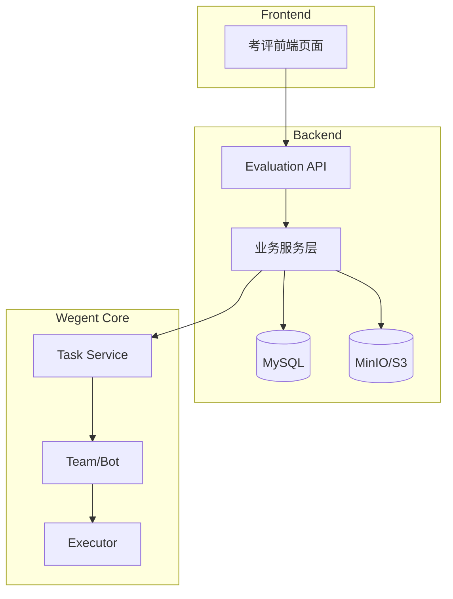
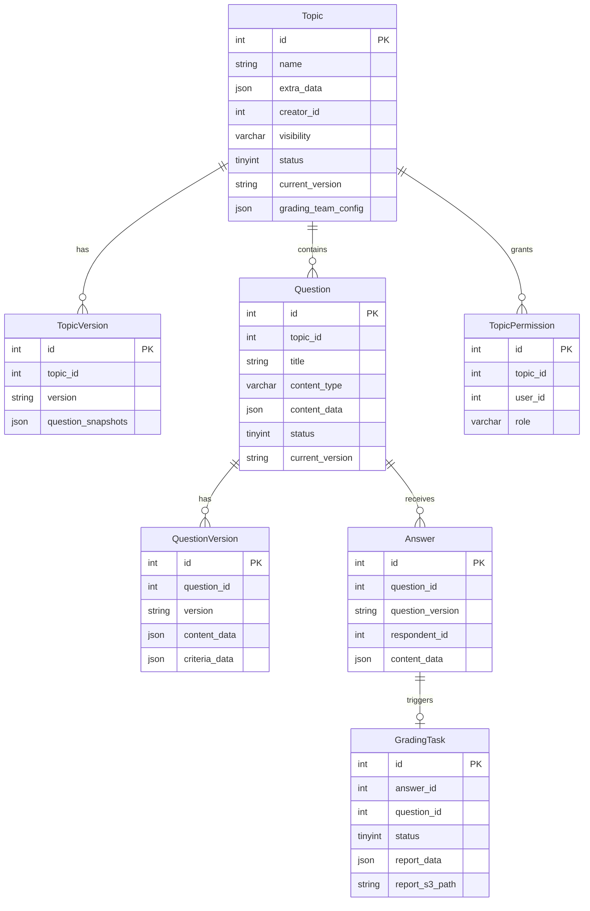
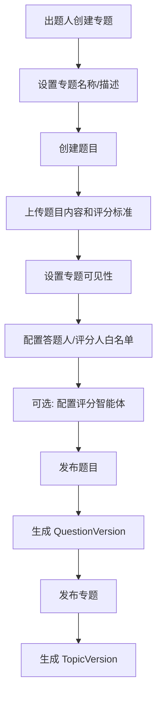
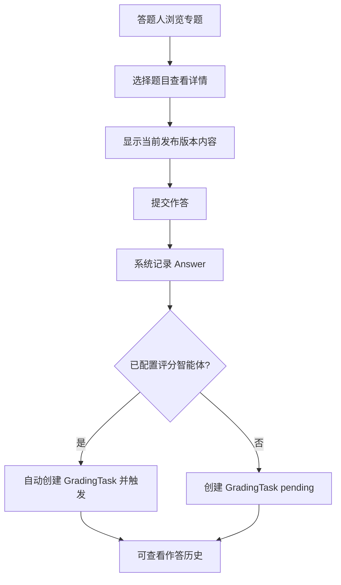
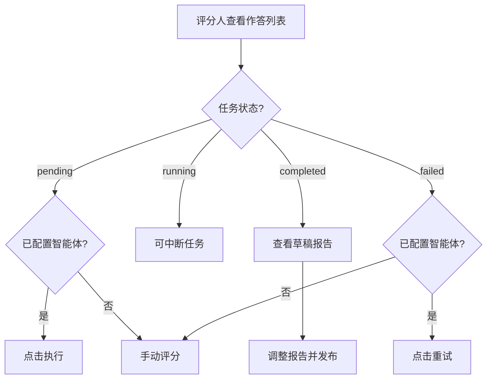
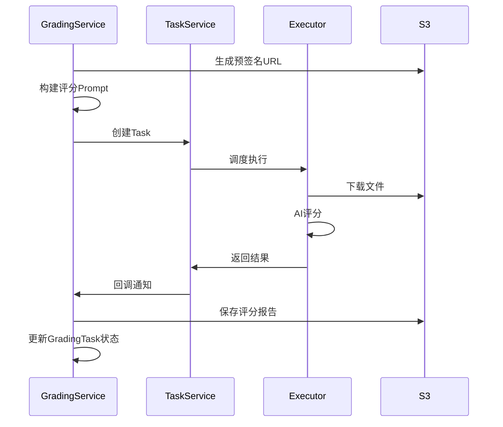

# 考评模块 (Evaluation Module) - 技术设计文档

---

## 1. 需求背景

### 1.1 业务目标

在 Wegent 系统中新增「考评」功能模块，支持企业内部的技能考核、培训评估等场景。

### 1.2 核心价值

- **标准化考核流程** - 统一的出题、作答、评分工作流
- **AI 辅助评分** - 复用 Wegent 智能体系统实现自动化评分
- **版本化管理** - 题目和专题支持版本控制
- **灵活的权限控制** - 支持公开/私有专题，精细化的角色权限管理

### 1.3 用户角色

| 角色       | 说明       | 核心能力                                                  |
| ---------- | ---------- | --------------------------------------------------------- |
| **出题人** | 专题创建者 | 创建专题/题目、管理权限、配置评分智能体、查看所有评分报告 |
| **答题人** | 作答用户   | 浏览专题、提交作答、查看自己的作答历史和评分报告          |
| **评分人** | 评分管理员 | 查看所有作答、执行/审核评分、发布评分报告                 |

---

## 2. 系统架构

### 2.1 模块位置

**代码目录规范：** 所有考评模块代码必须放在 `wecode/` 目录下，与开源基础代码隔离。

| 代码类型 | 正确位置                      | 说明              |
| -------- | ----------------------------- | ----------------- |
| 后端服务 | `backend/wecode/service/`     | 服务层代码        |
| 后端 API | `backend/wecode/api/`         | API 端点/Patch    |
| 后端模型 | `backend/wecode/models/`      | SQLAlchemy 模型   |
| 前端组件 | `frontend/wecode/components/` | React 组件        |
| 前端页面 | `frontend/wecode/pages/`      | Next.js 页面      |
| 测试文件 | `backend/wecode/tests/`       | 单元测试/集成测试 |

**例外情况（仅导航/路由集成）：**

- 导航栏集成：`frontend/src/components/layout/Navbar.tsx` 添加入口
- 路由集成：`frontend/src/app/` 添加路由挂载点
- API 路由注册：`backend/app/main.py` 注册路由

### 2.2 技术栈

**后端：** FastAPI + SQLAlchemy + MySQL + MinIO/S3

**前端：** Next.js 15 + React 19 + TypeScript + Tailwind CSS + shadcn/ui

### 2.3 系统架构图



---

## 3. 数据模型设计

### 3.1 ER 图



### 3.2 数据表定义

> **数据库设计规范要点：**
>
> - 使用 `idx_` 前缀命名索引
> - 禁止使用 ENUM、外键约束、表级排序规则
> - JSON 字段必须 NOT NULL
> - 时间戳使用 `DEFAULT CURRENT_TIMESTAMP`

#### 3.2.1 专题表 (wecode_eval_topics)

| 字段                | 类型         | 约束                        | 说明                       |
| ------------------- | ------------ | --------------------------- | -------------------------- |
| id                  | INT          | PK, AUTO_INCREMENT          | 主键                       |
| name                | VARCHAR(200) | NOT NULL                    | 专题名称                   |
| creator_id          | INT          | NOT NULL, INDEX             | 创建者用户ID               |
| visibility          | VARCHAR(20)  | NOT NULL, DEFAULT 'private' | 可见性: public/private     |
| status              | TINYINT      | NOT NULL, DEFAULT 0         | 状态: 0=draft, 1=published |
| current_version     | VARCHAR(25)  | NOT NULL, DEFAULT ''        | 当前发布版本号             |
| extra_data          | JSON         | NOT NULL                    | 扩展数据 (description 等)  |
| grading_team_config | JSON         | NOT NULL                    | 评分智能体配置             |
| created_at          | DATETIME     | DEFAULT CURRENT_TIMESTAMP   | 创建时间                   |
| updated_at          | DATETIME     | ON UPDATE CURRENT_TIMESTAMP | 更新时间                   |
| is_active           | BOOLEAN      | NOT NULL, DEFAULT TRUE      | 是否有效                   |

#### 3.2.2 专题版本表 (wecode_eval_topic_versions)

| 字段               | 类型        | 约束                      | 说明         |
| ------------------ | ----------- | ------------------------- | ------------ |
| id                 | INT         | PK, AUTO_INCREMENT        | 主键         |
| topic_id           | INT         | NOT NULL, INDEX           | 关联专题ID   |
| version            | VARCHAR(25) | NOT NULL                  | 版本号       |
| question_snapshots | JSON        | NOT NULL                  | 题目版本快照 |
| published_at       | DATETIME    | DEFAULT CURRENT_TIMESTAMP | 发布时间     |
| published_by       | INT         | NOT NULL, DEFAULT 0       | 发布人用户ID |

#### 3.2.3 题目表 (wecode_eval_questions)

| 字段            | 类型         | 约束                        | 说明                                |
| --------------- | ------------ | --------------------------- | ----------------------------------- |
| id              | INT          | PK, AUTO_INCREMENT          | 主键                                |
| topic_id        | INT          | NOT NULL, INDEX             | 所属专题ID                          |
| title           | VARCHAR(500) | NOT NULL                    | 题目标题                            |
| content_type    | VARCHAR(20)  | NOT NULL, DEFAULT 'text'    | 内容类型: text/url/attachment/mixed |
| content_data    | JSON         | NOT NULL                    | 内容数据                            |
| status          | TINYINT      | NOT NULL, DEFAULT 0         | 状态: 0=draft, 1=published          |
| current_version | VARCHAR(25)  | NOT NULL, DEFAULT ''        | 当前发布版本                        |
| order_index     | INT          | NOT NULL, DEFAULT 0         | 排序索引                            |
| creator_id      | INT          | NOT NULL, INDEX             | 创建者用户ID                        |
| created_at      | DATETIME     | DEFAULT CURRENT_TIMESTAMP   | 创建时间                            |
| updated_at      | DATETIME     | ON UPDATE CURRENT_TIMESTAMP | 更新时间                            |
| is_active       | BOOLEAN      | NOT NULL, DEFAULT TRUE      | 是否有效                            |

#### 3.2.4 题目版本表 (wecode_eval_question_versions)

| 字段          | 类型        | 约束                      | 说明         |
| ------------- | ----------- | ------------------------- | ------------ |
| id            | INT         | PK, AUTO_INCREMENT        | 主键         |
| question_id   | INT         | NOT NULL, INDEX           | 关联题目ID   |
| version       | VARCHAR(25) | NOT NULL                  | 版本号       |
| content_data  | JSON        | NOT NULL                  | 内容数据     |
| criteria_data | JSON        | NOT NULL                  | 评分标准数据 |
| published_at  | DATETIME    | DEFAULT CURRENT_TIMESTAMP | 发布时间     |
| published_by  | INT         | NOT NULL, DEFAULT 0       | 发布人用户ID |

#### 3.2.5 权限白名单表 (wecode_eval_permissions)

| 字段       | 类型        | 约束                           | 说明                    |
| ---------- | ----------- | ------------------------------ | ----------------------- |
| id         | INT         | PK, AUTO_INCREMENT             | 主键                    |
| topic_id   | INT         | NOT NULL, INDEX                | 关联专题ID              |
| user_id    | INT         | NOT NULL, INDEX                | 被授权用户ID            |
| role       | VARCHAR(20) | NOT NULL, DEFAULT 'respondent' | 角色: respondent/grader |
| granted_by | INT         | NOT NULL, DEFAULT 0            | 授权人用户ID            |
| granted_at | DATETIME    | DEFAULT CURRENT_TIMESTAMP      | 授权时间                |

#### 3.2.6 作答表 (wecode_eval_answers)

| 字段             | 类型        | 约束                     | 说明             |
| ---------------- | ----------- | ------------------------ | ---------------- |
| id               | INT         | PK, AUTO_INCREMENT       | 主键             |
| question_id      | INT         | NOT NULL, INDEX          | 关联题目ID       |
| question_version | VARCHAR(25) | NOT NULL                 | 作答时的题目版本 |
| respondent_id    | INT         | NOT NULL, INDEX          | 答题人用户ID     |
| content_type     | VARCHAR(20) | NOT NULL, DEFAULT 'text' | 内容类型         |
| content_data     | JSON        | NOT NULL                 | 内容数据         |
| submitted_at     | DATETIME    | NOT NULL                 | 提交时间         |
| is_latest        | BOOLEAN     | NOT NULL, DEFAULT TRUE   | 是否为最新作答   |

#### 3.2.7 评分任务表 (wecode_eval_grading_tasks)

| 字段             | 类型         | 约束                      | 说明                                                           |
| ---------------- | ------------ | ------------------------- | -------------------------------------------------------------- |
| id               | INT          | PK, AUTO_INCREMENT        | 主键                                                           |
| answer_id        | INT          | NOT NULL, INDEX           | 关联作答ID                                                     |
| question_id      | INT          | NOT NULL, INDEX           | 关联题目ID                                                     |
| question_version | VARCHAR(25)  | NOT NULL                  | 评分时的题目版本                                               |
| respondent_id    | INT          | NOT NULL, INDEX           | 答题人用户ID                                                   |
| grader_id        | INT          | NOT NULL, DEFAULT 0       | 评分人用户ID                                                   |
| team_id          | INT          | NOT NULL, DEFAULT 0       | 执行评分的智能体Team ID                                        |
| task_id          | INT          | NOT NULL, DEFAULT 0       | 关联的Wegent Task ID                                           |
| status           | TINYINT      | NOT NULL, DEFAULT 0       | 状态: 0=pending, 1=running, 2=completed, 3=failed, 4=published |
| report_data      | JSON         | NOT NULL                  | 评分报告数据                                                   |
| report_s3_path   | VARCHAR(500) | NOT NULL, DEFAULT ''      | 评分报告S3路径                                                 |
| created_at       | DATETIME     | DEFAULT CURRENT_TIMESTAMP | 创建时间                                                       |
| started_at       | DATETIME     | DEFAULT '1970-01-01'      | 开始时间                                                       |
| completed_at     | DATETIME     | DEFAULT '1970-01-01'      | 完成时间                                                       |
| published_at     | DATETIME     | DEFAULT '1970-01-01'      | 发布时间                                                       |

### 3.3 版本号生成规则

版本号格式：`YYYYMMDD_HHmmss_XXXX`

- `YYYYMMDD_HHmmss` - UTC 时间戳
- `XXXX` - UUID 前4位

示例：`20240115_143000_a1b2`

---

## 4. S3 存储设计

### 4.1 设计原则

复用现有的 `MinIOStorageBackend`，通过配置化的路径前缀实现环境隔离。

### 4.2 路径结构

通过 `EVAL_S3_PREFIX` 配置前缀，默认值为 `evaluation`：

```
{EVAL_S3_PREFIX}/                          # 默认: evaluation/
├── questions/                              # 题目内容
│   └── {topic_id}/{question_id}/{version}/
│       ├── content/{filename}
│       └── metadata.json
├── criteria/                               # 评分标准
│   └── {topic_id}/{question_id}/{version}/{filename}
├── answers/                                # 作答内容
│   └── {respondent_id}/{topic_id}/{question_id}/{submit_ts}/{filename}
└── reports/                                # 评分报告
    └── {respondent_id}/{topic_id}/{question_id}/{grading_ts}/{draft|final}.md
```

### 4.3 存储服务接口

核心方法：

- `upload_question_content()` - 上传题目附件
- `upload_criteria()` - 上传评分标准
- `upload_answer()` - 上传作答附件
- `save_grading_report()` - 保存评分报告
- `generate_presigned_url()` - 生成预签名 URL

---

## 5. 核心业务流程

### 5.1 出题流程



**流程说明：**

1. 出题人创建专题和题目 (draft 状态)
2. 上传题目内容和评分标准
3. 设置可见性，配置白名单
4. 可选配置评分智能体 (ClaudeCode 类型 Team)
5. 发布题目 → 生成 QuestionVersion
6. 发布专题 → 生成 TopicVersion (记录题目版本快照)

### 5.2 作答流程



### 5.3 评分流程



**评分任务状态：** `pending` → `running` → `completed` → `published`

### 5.4 评分智能体执行流程



---

## 6. 版本管理

### 6.1 题目版本管理

- **修改后需重新发布**：题目修改后需重新发布才能生效
- **版本记录**：每次发布生成新的 QuestionVersion
- **历史保留**：保留所有历史版本，支持回滚

### 6.2 专题版本管理

- **版本快照**：专题发布时记录所有题目的版本快照
- **答题人视角**：答题人看到的是专题发布时的题目版本

### 6.3 版本更新提示

- 当答题人最后一次作答后，题目有新版本发布时显示提示
- 答题人可选择基于新版本重新作答

---

## 7. API 设计

### 7.1 API 路由总览

| 方法   | 路径                         | 说明             | 权限          |
| ------ | ---------------------------- | ---------------- | ------------- |
| POST   | /topics                      | 创建专题         | 登录用户      |
| GET    | /topics                      | 获取专题列表     | 权限过滤      |
| GET    | /topics/{id}                 | 获取专题详情     | 有权限用户    |
| PUT    | /topics/{id}                 | 更新专题         | 出题人        |
| DELETE | /topics/{id}                 | 删除专题         | 出题人        |
| POST   | /topics/{id}/publish         | 发布专题         | 出题人        |
| POST   | /topics/{topic_id}/questions | 创建题目         | 出题人        |
| GET    | /topics/{topic_id}/questions | 获取题目列表     | 有权限用户    |
| PUT    | /questions/{id}              | 更新题目         | 出题人        |
| POST   | /questions/{id}/publish      | 发布题目         | 出题人        |
| POST   | /questions/{id}/answers      | 提交作答         | 答题人        |
| GET    | /questions/{id}/answers      | 获取作答列表     | 答题人/评分人 |
| GET    | /topics/{id}/grading-tasks   | 获取评分任务列表 | 评分人        |
| POST   | /grading-tasks/{id}/execute  | 执行评分任务     | 评分人        |
| POST   | /grading-tasks/{id}/publish  | 发布评分报告     | 评分人        |

### 7.2 核心接口示例

**创建专题：**

```http
POST /api/v1/wecode/evaluation/topics
{
  "name": "Python 基础考核",
  "description": "Python 编程基础知识考核",
  "visibility": "private",
  "grading_team_id": 123
}
```

**提交作答：**

```http
POST /api/v1/wecode/evaluation/questions/1/answers
{
  "content_type": "text",
  "content_text": "这是我的作答内容..."
}
```

---

## 8. 评分智能体集成

### 8.1 集成架构

复用现有 Wegent Team 系统，通过创建 Task 执行评分任务。

### 8.2 评分 Prompt 模板

```markdown
你是一个专业的评分助手。请根据以下信息进行评分：

## 题目内容

{题目文本内容}
附件下载链接: {预签名URL}

## 评分标准

{评分标准文本}
附件下载链接: {预签名URL}

## 学生作答

{作答文本内容}
附件下载链接: {预签名URL}

## 输出要求

请生成一份 Markdown 格式的评分报告，包含：

1. **评分总结** - 总体评价和得分
2. **详细分析** - 按评分标准逐项评价
3. **优点与不足**
4. **改进建议**
```

### 8.3 Team 配置要求

- Shell 类型必须为 `ClaudeCode`
- Team 必须属于专题创建者或为公共 Team

---

## 9. 权限控制

### 9.1 权限矩阵

| 操作           | 出题人 |  答题人  | 评分人 | 说明               |
| -------------- | :----: | :------: | :----: | ------------------ |
| 创建专题       |   ✅   |    -     |   -    | 任何登录用户可创建 |
| 编辑专题       |   ✅   |    ❌    |   ❌   | 仅创建者           |
| 查看专题       |   ✅   |    ✅    |   ✅   | 公开专题所有人可见 |
| 管理权限       |   ✅   |    ❌    |   ❌   | 仅创建者           |
| 查看评分标准   |   ✅   |    ❌    |   ✅   | 答题人不可见       |
| 提交作答       |   ✅   |    ✅    |   ✅   | 根据专题权限       |
| 查看所有作答   |   ✅   |    ❌    |   ✅   | 出题人和评分人     |
| 执行评分       |   ✅   |    ❌    |   ✅   | 出题人和评分人     |
| 发布评分报告   |   ✅   |    ❌    |   ✅   | 出题人和评分人     |
| 查看已发布报告 |   ✅   | ✅(自己) |   ✅   | 答题人仅看自己的   |

### 9.2 权限检查逻辑

```python
def can_view_topic(topic, user_id):
    if topic.visibility == "public":
        return True
    return topic.creator_id == user_id or has_permission(topic.id, user_id)

def can_answer(topic, user_id):
    if topic.visibility == "public":
        return True
    return has_permission(topic.id, user_id, "respondent")

def can_grade(topic, user_id):
    return topic.creator_id == user_id or has_permission(topic.id, user_id, "grader")
```

---

## 10. 前端设计

### 10.1 目录结构

```
frontend/wecode/
├── components/
│   ├── topic/           # 专题相关组件
│   ├── question/        # 题目相关组件
│   ├── answer/          # 作答相关组件
│   ├── grading/         # 评分相关组件
│   └── common/          # 通用组件
├── pages/               # 页面组件
├── hooks/               # 自定义 Hooks
├── api/                 # API 调用
├── types/               # TypeScript 类型
└── i18n/                # 国际化
```

### 10.2 页面路由

```
/evaluation
├── /topics                    # 专题列表
├── /topics/new                # 创建专题
├── /topics/{id}               # 专题详情
│   ├── /questions             # 题目列表
│   ├── /questions/new         # 创建题目
│   ├── /questions/{qid}       # 题目详情/作答
│   ├── /permissions           # 权限管理
│   └── /grading               # 评分管理
└── /my
    ├── /answers               # 我的作答历史
    └── /reports               # 我的评分报告
```

---

## 11. 测试验收要求

### 11.1 单元测试覆盖率

| 模块     | 覆盖率要求 |
| -------- | ---------- |
| 专题服务 | ≥80%       |
| 题目服务 | ≥80%       |
| 作答服务 | ≥80%       |
| 评分服务 | ≥80%       |
| 权限服务 | ≥90%       |

### 11.2 验收标准

**功能验收：**

- 专题创建：支持公开/私有专题
- 题目管理：支持文本/URL/附件类型，版本管理
- 权限管理：添加/移除答题人和评分人
- 作答提交：支持多次作答，记录版本
- 自动评分：配置智能体后自动触发
- 手动评分：支持不使用智能体的手动评分
- 报告发布：支持单个和批量发布

**性能验收：**

- 专题列表加载 < 500ms
- 题目详情加载 < 300ms
- 作答提交响应 < 1s
- 评分任务启动 < 2s

---

## 12. 实现计划

### Phase 1 - 基础架构 (Week 1-2)

- [ ] 数据库模型和迁移脚本
- [ ] S3 存储服务实现
- [ ] 权限检查服务
- [ ] 基础 API 框架

### Phase 2 - 专题和题目管理 (Week 3-4)

- [ ] 专题/题目 CRUD API
- [ ] 版本管理功能
- [ ] 文件上传/下载
- [ ] 前端专题/题目管理页面

### Phase 3 - 作答流程 (Week 5)

- [ ] 作答提交和历史 API
- [ ] 版本更新提示
- [ ] 前端作答页面

### Phase 4 - 评分流程 (Week 6-7)

- [ ] 评分任务 API
- [ ] Wegent Task 集成
- [ ] 手动评分功能
- [ ] 前端评分管理页面

### Phase 5 - 优化完善 (Week 8)

- [ ] 批量操作
- [ ] WebSocket 状态推送
- [ ] 性能优化和测试补充

---

## 附录

### A. 数据库迁移脚本

详见 `backend/alembic/versions/` 目录下的迁移文件。

### B. 环境配置

```bash
# S3/MinIO 配置 (复用现有附件存储配置)
ATTACHMENT_STORAGE_BACKEND=minio
ATTACHMENT_S3_ENDPOINT=minio:9000
ATTACHMENT_S3_ACCESS_KEY=minioadmin
ATTACHMENT_S3_SECRET_KEY=minioadmin
ATTACHMENT_S3_BUCKET=wegent

# 考评模块特定配置
EVAL_S3_PREFIX=evaluation              # S3 路径前缀
GRADING_TASK_TIMEOUT=3600              # 评分任务超时时间(秒)
GRADING_PRESIGNED_URL_EXPIRES=3600     # 预签名URL过期时间(秒)
```

### C. 错误码定义

| 错误码   | 说明                 |
| -------- | -------------------- |
| EVAL_001 | 专题不存在           |
| EVAL_002 | 题目不存在           |
| EVAL_003 | 无权限访问           |
| EVAL_004 | 专题未发布           |
| EVAL_005 | 题目未发布           |
| EVAL_006 | 评分智能体未配置     |
| EVAL_007 | 评分智能体类型不支持 |
| EVAL_008 | 评分任务执行失败     |
| EVAL_009 | 文件上传失败         |
| EVAL_010 | 版本冲突             |
