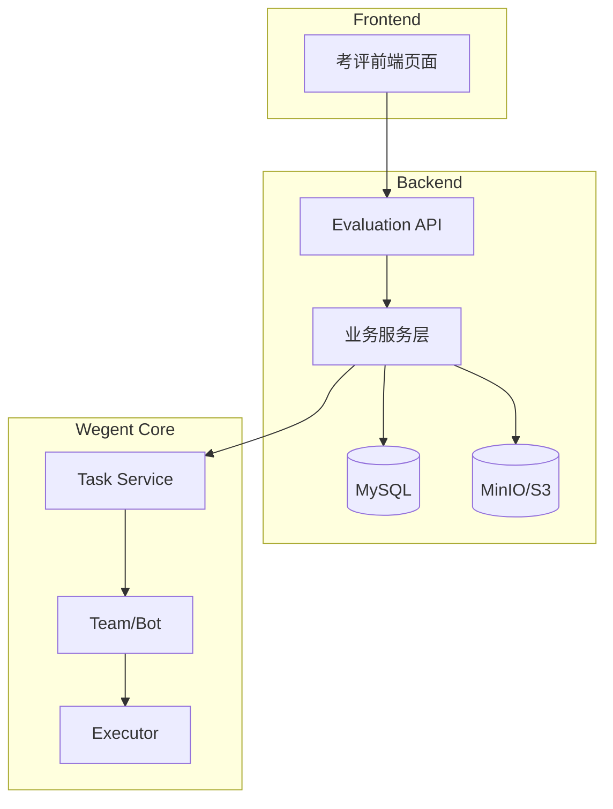
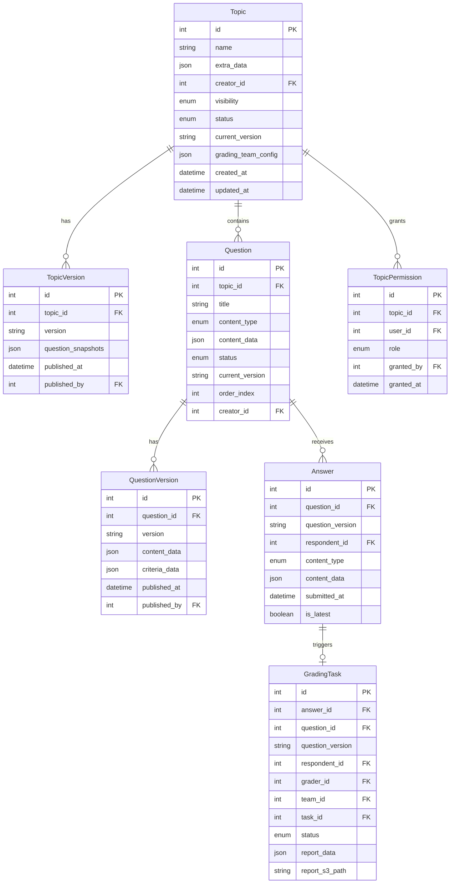
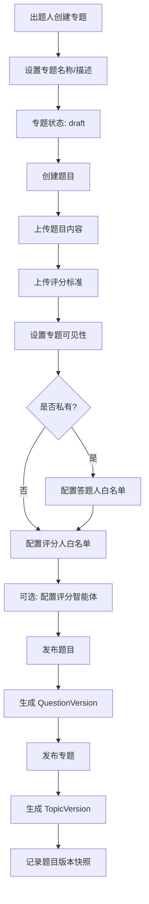
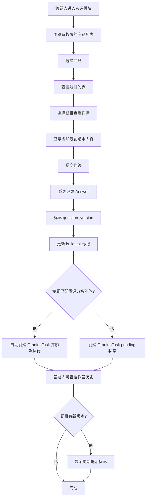
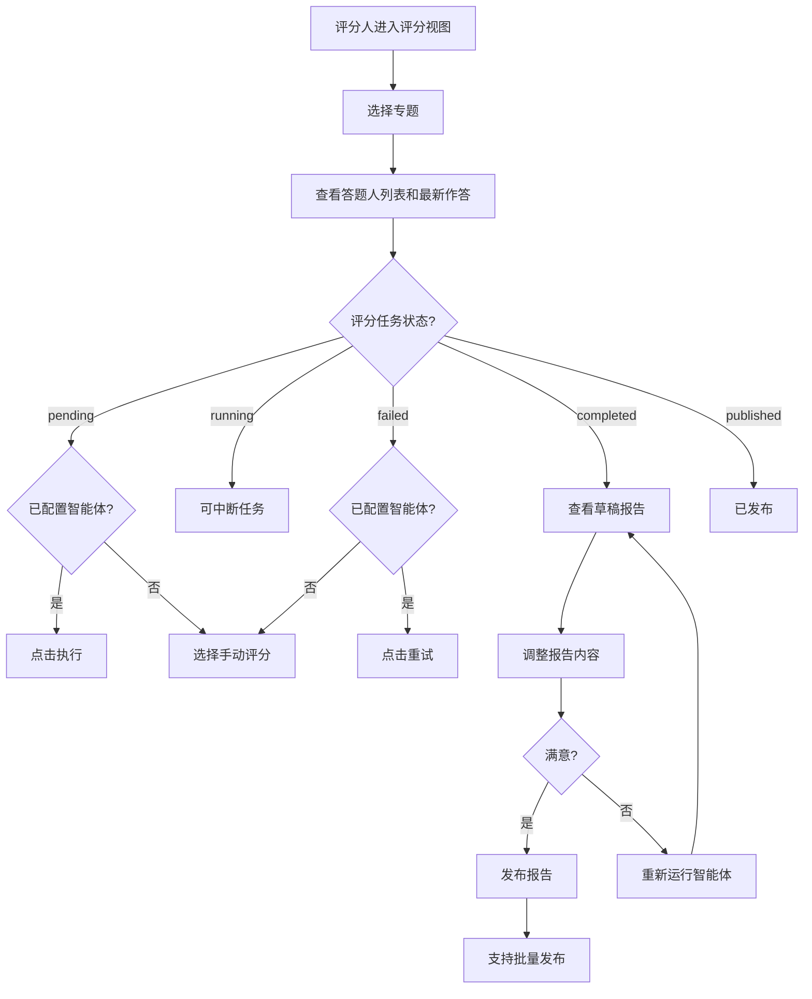
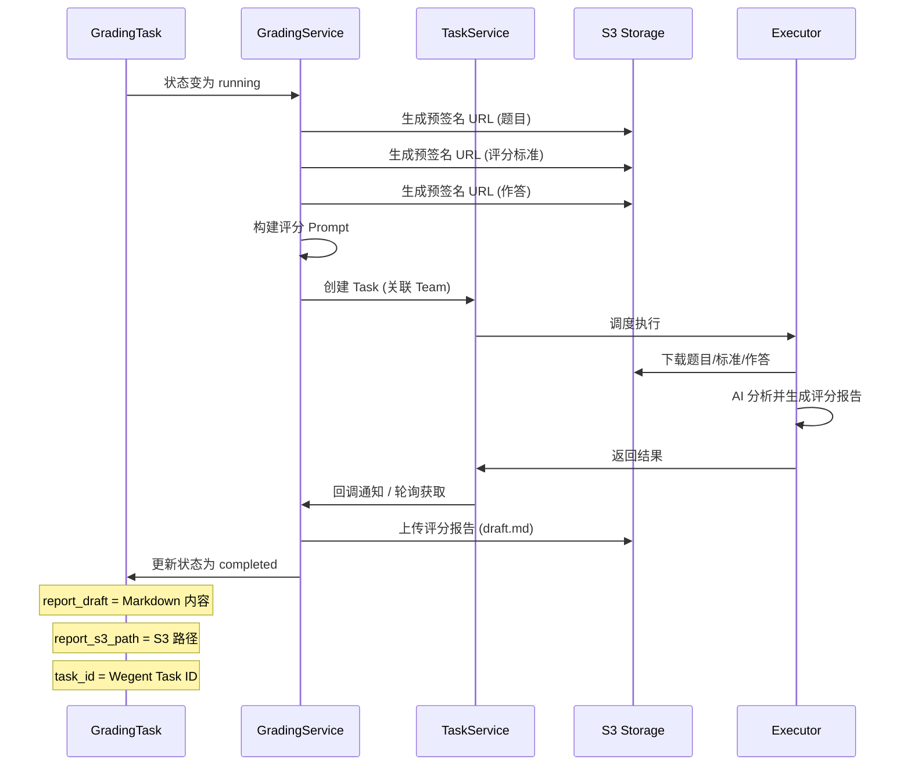
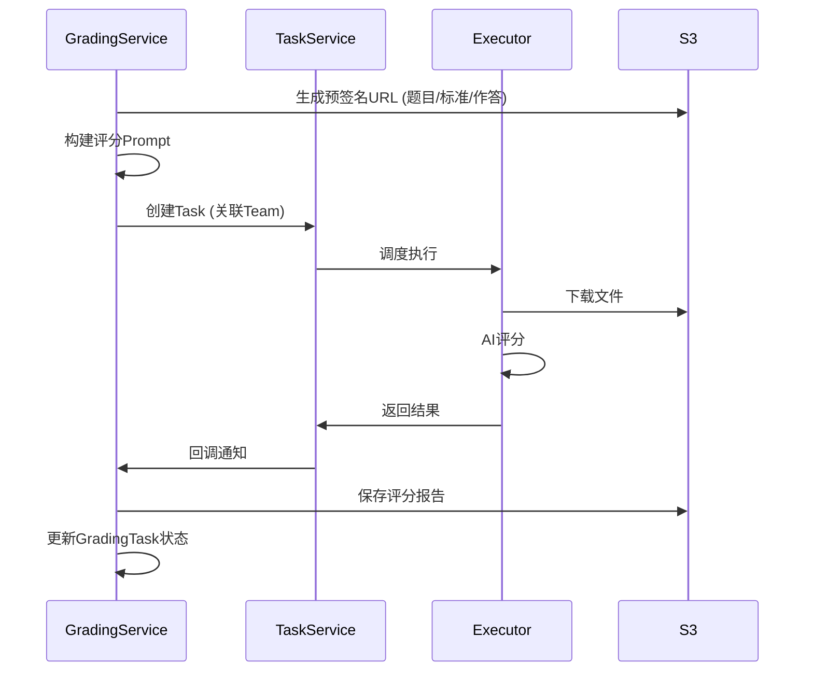
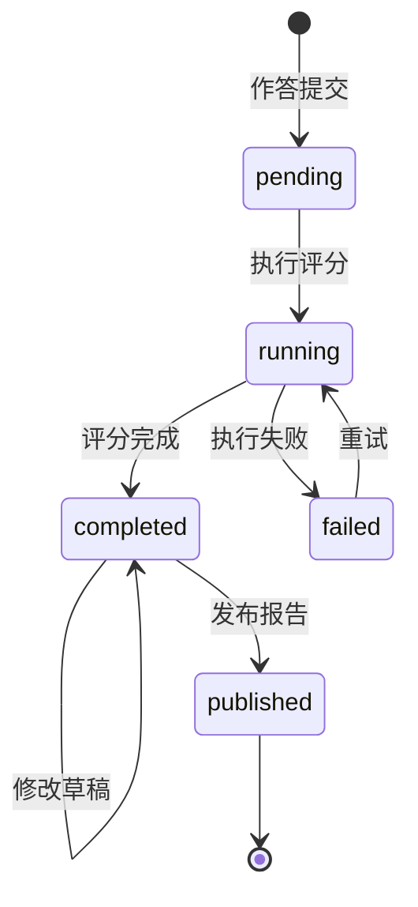

# 考评模块 (Evaluation Module) - 技术设计文档

---

## 1. 需求背景

### 1.1 业务目标

在 Wegent 系统中新增「考评」功能模块，支持企业内部的技能考核、培训评估等场景。该模块作为独立的功能入口，位于前端导航栏「关注、编码、知识、AI 设备」之后。

### 1.2 核心价值

- **标准化考核流程** - 统一的出题、作答、评分工作流
- **AI 辅助评分** - 复用 Wegent 智能体系统实现自动化评分
- **版本化管理** - 题目和专题支持版本控制，便于追溯和迭代
- **灵活的权限控制** - 支持公开/私有专题，精细化的角色权限管理

### 1.3 用户角色

| 角色 | 说明 | 核心能力 |
|------|------|----------|
| **出题人** | 专题创建者 | 创建专题/题目、管理权限、配置评分智能体、查看所有评分报告 |
| **答题人** | 作答用户 | 浏览专题、提交作答、查看自己的作答历史和评分报告 |
| **评分人** | 评分管理员 | 查看所有作答、执行/审核评分、发布评分报告 |

> 一个用户可同时拥有多种角色，例如：用户 A 是专题 X 的出题人，同时是专题 Y 的答题人。

---

## 2. 系统架构

### 2.1 模块位置

```
wegent/
├── backend/
│   └── wecode/
│       └── evaluation/          # 后端模块
│           ├── api/             # API 端点
│           ├── models/          # 数据模型
│           ├── schemas/         # Pydantic 模式
│           ├── services/        # 业务逻辑
│           └── utils/           # 工具函数
│
└── frontend/
    └── wecode/
        └── evaluation/          # 前端模块 (独立目录，最小化入侵)
            ├── components/      # 业务组件
            ├── hooks/           # 自定义 Hooks
            ├── api/             # API 调用
            ├── types/           # TypeScript 类型
            ├── pages/           # 页面组件
            ├── contexts/        # React Context
            └── i18n/            # 国际化文件
```

> **设计原则：** 前端代码集中放在 `frontend/wecode/evaluation/` 目录下，尽量减少对其他目录的入侵。仅需在导航栏和路由配置中添加少量引用代码。

### 2.2 技术栈

**后端：**
- FastAPI + SQLAlchemy + MySQL
- MinIO/S3 对象存储
- 复用 Wegent Task/Team 系统

**前端：**
- Next.js 15 + React 19 + TypeScript
- Tailwind CSS + shadcn/ui
- i18next 国际化

### 2.3 系统架构图



---

## 3. 数据模型设计

### 3.1 ER 图



### 3.2 数据表定义

#### 3.2.1 专题表 (wecode_eval_topics)

| 字段 | 类型 | 约束 | 说明 |
|------|------|------|------|
| id | INT | PK, AUTO_INCREMENT | 主键 |
| name | VARCHAR(200) | NOT NULL, DEFAULT '' | 专题名称 |
| creator_id | INT | NOT NULL, DEFAULT 0, INDEX | 创建者用户ID |
| visibility | ENUM | NOT NULL, DEFAULT 'private' | 可见性: public/private |
| status | ENUM | NOT NULL, DEFAULT 'draft' | 状态: draft/published |
| current_version | VARCHAR(25) | NOT NULL, DEFAULT '' | 当前发布版本号 |
| extra_data | JSON | | 扩展数据 (description 等) |
| grading_team_config | JSON | | 评分智能体配置 |
| created_at | DATETIME | NOT NULL | 创建时间 |
| updated_at | DATETIME | NOT NULL | 更新时间 |
| is_active | BOOLEAN | NOT NULL, DEFAULT TRUE | 是否有效 |

**索引：**
- `ix_creator_id` (creator_id)
- `uniq_creator_topic_name` (creator_id, name) UNIQUE

**extra_data 格式：**
```json
{
  "description": "专题描述内容"
}
```

**grading_team_config 格式：**
```json
{
  "team_id": 123,
  "name": "grading-team",
  "namespace": "default",
  "user_id": 100
}
```

#### 3.2.2 专题版本表 (wecode_eval_topic_versions)

| 字段 | 类型 | 约束 | 说明 |
|------|------|------|------|
| id | INT | PK, AUTO_INCREMENT | 主键 |
| topic_id | INT | NOT NULL, DEFAULT 0, FK, INDEX | 关联专题 |
| version | VARCHAR(25) | NOT NULL, DEFAULT '' | 版本号 |
| question_snapshots | JSON | | 题目版本快照 |
| published_at | DATETIME | NOT NULL | 发布时间 |
| published_by | INT | NOT NULL, DEFAULT 0 | 发布人用户ID |

**索引：**
- `uniq_topic_version` (topic_id, version) UNIQUE

**question_snapshots 格式：**
```json
[
  {"question_id": 1, "version": "20240115_143000_a1b2"},
  {"question_id": 2, "version": "20240115_150000_c3d4"}
]
```

#### 3.2.3 题目表 (wecode_eval_questions)

| 字段 | 类型 | 约束 | 说明 |
|------|------|------|------|
| id | INT | PK, AUTO_INCREMENT | 主键 |
| topic_id | INT | NOT NULL, DEFAULT 0, FK, INDEX | 所属专题 |
| title | VARCHAR(500) | NOT NULL, DEFAULT '' | 题目标题 |
| content_type | ENUM | NOT NULL, DEFAULT 'text' | 内容类型: text/url/attachment/mixed |
| content_data | JSON | | 内容数据 (content_text, content_url 等) |
| status | ENUM | NOT NULL, DEFAULT 'draft' | 状态: draft/published |
| current_version | VARCHAR(25) | NOT NULL, DEFAULT '' | 当前发布版本 |
| order_index | INT | NOT NULL, DEFAULT 0 | 排序索引 |
| creator_id | INT | NOT NULL, DEFAULT 0, INDEX | 创建者用户ID |
| source_type | VARCHAR(20) | NOT NULL, DEFAULT 'manual' | 来源: manual/imported |
| import_batch_id | VARCHAR(50) | NOT NULL, DEFAULT '' | 批量导入批次ID |
| created_at | DATETIME | NOT NULL | 创建时间 |
| updated_at | DATETIME | NOT NULL | 更新时间 |
| is_active | BOOLEAN | NOT NULL, DEFAULT TRUE | 是否有效 |

**content_data 格式：**
```json
{
  "content_text": "题目文本内容",
  "content_url": "https://example.com/content"
}
```

#### 3.2.4 题目版本表 (wecode_eval_question_versions)

| 字段 | 类型 | 约束 | 说明 |
|------|------|------|------|
| id | INT | PK, AUTO_INCREMENT | 主键 |
| question_id | INT | NOT NULL, DEFAULT 0, FK, INDEX | 关联题目 |
| version | VARCHAR(25) | NOT NULL, DEFAULT '' | 版本号 |
| content_data | JSON | | 内容数据 (content_text, content_url, attachments 等) |
| criteria_data | JSON | | 评分标准数据 (criteria_text, criteria_url, attachments 等) |
| published_at | DATETIME | NOT NULL | 发布时间 |
| published_by | INT | NOT NULL, DEFAULT 0 | 发布人用户ID |

**索引：**
- `uniq_question_version` (question_id, version) UNIQUE

**content_data 格式：**
```json
{
  "content_text": "该版本的题目文本内容",
  "content_url": "https://example.com/content",
  "attachments": ["s3://bucket/path/file1.pdf", "s3://bucket/path/file2.pdf"]
}
```

**criteria_data 格式：**
```json
{
  "criteria_text": "评分标准文本内容",
  "criteria_url": "https://example.com/criteria",
  "attachments": ["s3://bucket/path/criteria.pdf"]
}
```

#### 3.2.5 权限白名单表 (wecode_eval_permissions)

| 字段 | 类型 | 约束 | 说明 |
|------|------|------|------|
| id | INT | PK, AUTO_INCREMENT | 主键 |
| topic_id | INT | NOT NULL, DEFAULT 0, FK, INDEX | 关联专题 |
| user_id | INT | NOT NULL, DEFAULT 0, INDEX | 被授权用户ID |
| role | ENUM | NOT NULL, DEFAULT 'respondent' | 角色: respondent/grader |
| granted_by | INT | NOT NULL, DEFAULT 0 | 授权人用户ID |
| granted_at | DATETIME | NOT NULL | 授权时间 |

**索引：**
- `uniq_topic_user_role` (topic_id, user_id, role) UNIQUE

#### 3.2.6 作答表 (wecode_eval_answers)

| 字段 | 类型 | 约束 | 说明 |
|------|------|------|------|
| id | INT | PK, AUTO_INCREMENT | 主键 |
| question_id | INT | NOT NULL, DEFAULT 0, FK, INDEX | 关联题目 |
| question_version | VARCHAR(25) | NOT NULL, DEFAULT '' | 作答时的题目版本 |
| respondent_id | INT | NOT NULL, DEFAULT 0, INDEX | 答题人用户ID |
| content_type | ENUM | NOT NULL, DEFAULT 'text' | 内容类型 |
| content_data | JSON | | 内容数据 (content_text, content_url, attachments 等) |
| submitted_at | DATETIME | NOT NULL | 提交时间 |
| is_latest | BOOLEAN | NOT NULL, DEFAULT TRUE | 是否为最新作答 |

**索引：**
- `ix_respondent_question` (respondent_id, question_id)

**content_data 格式：**
```json
{
  "content_text": "作答文本内容",
  "content_url": "https://example.com/answer",
  "attachments": ["s3://bucket/path/answer1.pdf", "s3://bucket/path/answer2.pdf"]
}
```

#### 3.2.7 评分任务表 (wecode_eval_grading_tasks)

| 字段 | 类型 | 约束 | 说明 |
|------|------|------|------|
| id | INT | PK, AUTO_INCREMENT | 主键 |
| answer_id | INT | NOT NULL, DEFAULT 0, FK, INDEX | 关联作答 |
| question_id | INT | NOT NULL, DEFAULT 0, FK, INDEX | 关联题目 |
| question_version | VARCHAR(25) | NOT NULL, DEFAULT '' | 评分时的题目版本 |
| respondent_id | INT | NOT NULL, DEFAULT 0, INDEX | 答题人用户ID |
| grader_id | INT | NOT NULL, DEFAULT 0 | 评分人用户ID (手动评分时，0表示未指定) |
| team_id | INT | NOT NULL, DEFAULT 0 | 执行评分的智能体Team ID (0表示未指定) |
| task_id | INT | NOT NULL, DEFAULT 0 | 关联的Wegent Task ID (0表示未创建) |
| status | ENUM | NOT NULL, DEFAULT 'pending' | 状态 |
| report_data | JSON | | 评分报告数据 (draft/final/error) |
| report_s3_path | VARCHAR(500) | NOT NULL, DEFAULT '' | 评分报告S3路径 |
| created_at | DATETIME | NOT NULL | 创建时间 |
| started_at | DATETIME | NOT NULL, DEFAULT '1970-01-01 00:00:00' | 开始时间 |
| completed_at | DATETIME | NOT NULL, DEFAULT '1970-01-01 00:00:00' | 完成时间 |
| published_at | DATETIME | NOT NULL, DEFAULT '1970-01-01 00:00:00' | 发布时间 |
| published_by | INT | NOT NULL, DEFAULT 0 | 发布人用户ID |

**状态枚举值：**
- `pending` - 待执行
- `running` - 执行中
- `completed` - 已完成 (待审核)
- `failed` - 执行失败
- `published` - 已发布

**report_data 格式：**
```json
{
  "report_draft": "草稿评分报告 Markdown 内容",
  "report_final": "最终评分报告 Markdown 内容",
  "error_message": "执行失败时的错误信息"
}
```

### 3.3 版本号生成规则

版本号格式：`YYYYMMDD_HHmmss_XXXX`

- `YYYYMMDD_HHmmss` - UTC 时间戳
- `XXXX` - UUID 前4位，确保唯一性

示例：`20240115_143000_a1b2`

```python
import uuid
from datetime import datetime

def generate_version() -> str:
    timestamp = datetime.utcnow().strftime("%Y%m%d_%H%M%S")
    suffix = uuid.uuid4().hex[:4]
    return f"{timestamp}_{suffix}"
```

---

## 4. S3 存储设计

### 4.1 路径结构

```
evaluation/
├── questions/                              # 题目内容
│   └── {topic_id}/{question_id}/{version}/
│       ├── content/                        # 题目附件
│       │   └── {filename}
│       └── metadata.json                   # 题目元数据
│
├── criteria/                               # 评分标准 (仅评分人可访问)
│   └── {topic_id}/{question_id}/{version}/
│       └── {filename}
│
├── answers/                                # 作答内容
│   └── {respondent_id}/{topic_id}/{question_id}/{submit_ts}/
│       └── {filename}
│
└── reports/                                # 评分报告
    └── {respondent_id}/{topic_id}/{question_id}/{grading_ts}/
        ├── draft.md                        # 草稿报告
        └── final.md                        # 最终报告
```

### 4.2 存储服务接口

```python
class EvaluationS3Service:
    """考评模块 S3 存储服务"""
    
    def upload_question_content(
        self,
        topic_id: int,
        question_id: int,
        version: str,
        filename: str,
        data: bytes,
        mime_type: str
    ) -> str:
        """上传题目内容附件，返回 S3 路径"""
    
    def upload_criteria(
        self,
        topic_id: int,
        question_id: int,
        version: str,
        filename: str,
        data: bytes,
        mime_type: str
    ) -> str:
        """上传评分标准附件，返回 S3 路径"""
    
    def upload_answer(
        self,
        respondent_id: int,
        topic_id: int,
        question_id: int,
        submit_ts: str,
        filename: str,
        data: bytes,
        mime_type: str
    ) -> str:
        """上传作答附件，返回 S3 路径"""
    
    def save_grading_report(
        self,
        respondent_id: int,
        topic_id: int,
        question_id: int,
        grading_ts: str,
        content: str,
        is_final: bool = False
    ) -> str:
        """保存评分报告，返回 S3 路径"""
    
    def generate_presigned_url(
        self,
        key: str,
        expires: int = 3600
    ) -> Optional[str]:
        """生成预签名 URL，用于文件下载"""
    
    def download_file(self, key: str) -> Optional[bytes]:
        """下载文件内容"""
    
    def delete_file(self, key: str) -> bool:
        """删除文件"""
```

---

## 5. 核心业务流程

### 5.1 出题流程



**流程说明：**
1. 出题人创建专题 (draft 状态)
2. 在专题下创建题目 (draft 状态)
3. 上传题目内容 (文本/URL/附件)
4. 上传评分标准 (文本/URL/附件)
5. 设置专题可见性 (public/private)
6. 如 private，配置答题人白名单
7. 配置评分人白名单
8. (可选) 配置评分智能体 (选择现有 ClaudeCode 类型 Team)
9. 发布题目 → 生成 QuestionVersion (版本号为时间戳)
10. 发布专题 → 生成 TopicVersion (记录当前所有题目版本快照)

### 5.2 作答流程



**流程说明：**
1. 答题人进入考评模块
2. 浏览有权限的专题列表
3. 选择专题，查看题目列表
4. 选择题目查看详情 (显示当前发布版本内容)
5. 提交作答 (文本/URL/附件)
6. 系统记录 Answer，标记 question_version
7. 更新该用户该题目的 is_latest 标记
8. 如专题已配置评分智能体：自动创建 GradingTask (pending) 并触发执行
9. 如未配置评分智能体：创建 GradingTask (pending)，等待配置后执行
10. 答题人可查看作答历史
11. 如题目有新版本，显示更新提示标记

### 5.3 评分流程



**评分任务状态说明：**
- `pending`: 等待执行 (如已配置智能体则自动开始)
- `running`: 智能体执行中
- `completed`: 可审核草稿报告
- `failed`: 可重试或手动评分
- `published`: 已发布

### 5.4 评分智能体执行流程



**执行失败处理：**
- 状态更新为 `failed`
- 记录 `error_message`
- 评分人可选择重试或手动评分

---

## 6. 版本管理

### 6.1 版本号格式

版本号格式：`YYYYMMDD_HHmmss_XXXX`

- `YYYYMMDD_HHmmss` - UTC 时间戳
- `XXXX` - UUID 前4位，确保唯一性

示例：`20240115_143000_a1b2`

### 6.2 题目版本管理

- **修改后需重新发布**：题目修改后需重新发布才能生效
- **版本记录**：每次发布生成新的 QuestionVersion
- **历史保留**：保留所有历史版本，支持查看和下载
- **版本回滚**：支持回滚到历史版本 (创建新版本，内容复制自历史版本)

### 6.3 专题版本管理

- **版本快照**：专题发布时，记录当前所有题目的版本快照
- **快照存储**：TopicVersion.question_snapshots 存储版本映射
- **答题人视角**：答题人看到的是专题发布时的题目版本

### 6.4 版本更新提示

- **触发条件**：当答题人最后一次作答后，题目有新版本发布
- **提示方式**：在作答历史中显示提示标记："题目已更新"
- **用户操作**：答题人可选择基于新版本重新作答

---

## 7. API 设计

### 7.1 API 路由总览

| 方法 | 路径 | 说明 | 权限 |
|------|------|------|------|
| **专题管理** ||||
| POST | /topics | 创建专题 | 登录用户 |
| GET | /topics | 获取专题列表 | 根据权限过滤 |
| GET | /topics/{id} | 获取专题详情 | 有权限用户 |
| PUT | /topics/{id} | 更新专题 | 出题人 |
| DELETE | /topics/{id} | 删除专题 | 出题人 |
| POST | /topics/{id}/publish | 发布专题 | 出题人 |
| GET | /topics/{id}/versions | 获取版本列表 | 出题人 |
| POST | /topics/{id}/rollback | 回滚版本 | 出题人 |
| **题目管理** ||||
| POST | /topics/{topic_id}/questions | 创建题目 | 出题人 |
| GET | /topics/{topic_id}/questions | 获取题目列表 | 有权限用户 |
| GET | /questions/{id} | 获取题目详情 | 有权限用户 |
| PUT | /questions/{id} | 更新题目 | 出题人 |
| DELETE | /questions/{id} | 删除题目 | 出题人 |
| POST | /questions/{id}/publish | 发布题目 | 出题人 |
| GET | /questions/{id}/versions | 获取版本列表 | 出题人 |
| POST | /questions/{id}/rollback | 回滚题目版本 | 出题人 |
| POST | /questions/{id}/content/upload | 上传题目附件 | 出题人 |
| POST | /questions/{id}/criteria/upload | 上传评分标准 | 出题人 |
| GET | /questions/{id}/versions/{version}/download | 下载指定版本 | 有权限用户 |
| **权限管理** ||||
| GET | /topics/{id}/permissions | 获取权限列表 | 出题人 |
| POST | /topics/{id}/permissions | 添加权限 | 出题人 |
| DELETE | /topics/{id}/permissions/{pid} | 移除权限 | 出题人 |
| **作答管理** ||||
| POST | /questions/{id}/answers | 提交作答 | 答题人 |
| GET | /questions/{id}/answers | 获取作答列表 | 答题人(自己)/评分人(全部) |
| GET | /answers/{id} | 获取作答详情 | 答题人(自己)/评分人 |
| POST | /answers/{id}/upload | 上传作答附件 | 答题人 |
| GET | /my/answers | 获取我的所有作答 | 登录用户 |
| **评分任务管理** ||||
| GET | /topics/{id}/grading-tasks | 获取评分任务列表 | 评分人 |
| GET | /grading-tasks/{id} | 获取评分任务详情 | 评分人 |
| POST | /grading-tasks/{id}/execute | 执行评分任务 | 评分人 |
| POST | /grading-tasks/{id}/retry | 重试评分任务 | 评分人 |
| POST | /grading-tasks/{id}/cancel | 中断评分任务 | 评分人 |
| PUT | /grading-tasks/{id}/report | 更新评分报告草稿 | 评分人 |
| POST | /grading-tasks/{id}/publish | 发布评分报告 | 评分人 |
| POST | /grading-tasks/batch-publish | 批量发布 | 评分人 |
| GET | /grading-tasks/{id}/download | 下载评分相关文件 | 评分人 |
| **向前兼容 - 批量导入** ||||
| POST | /topics/{id}/questions/import | 批量导入题目 (预留) | 出题人 |

### 7.2 请求/响应格式

#### 7.2.1 创建专题

**请求：**
```http
POST /api/v1/wecode/evaluation/topics
Content-Type: application/json

{
  "name": "Python 基础考核",
  "description": "Python 编程基础知识考核",
  "visibility": "private",
  "grading_team_id": 123
}
```

**响应：**
```json
{
  "id": 1,
  "name": "Python 基础考核",
  "description": "Python 编程基础知识考核",
  "creator_id": 100,
  "visibility": "private",
  "status": "draft",
  "current_version": null,
  "grading_team_config": {
    "team_id": 123,
    "name": "grading-team",
    "namespace": "default",
    "user_id": 100
  },
  "created_at": "2024-01-15T14:30:00Z",
  "updated_at": "2024-01-15T14:30:00Z"
}
```

#### 7.2.2 获取专题列表

**请求：**
```http
GET /api/v1/wecode/evaluation/topics?role=creator&page=1&page_size=20
```

**响应：**
```json
{
  "items": [
    {
      "id": 1,
      "name": "Python 基础考核",
      "description": "Python 编程基础知识考核",
      "creator_id": 100,
      "visibility": "private",
      "status": "published",
      "current_version": "20240115_143000_a1b2",
      "question_count": 10,
      "created_at": "2024-01-15T14:30:00Z",
      "updated_at": "2024-01-15T14:30:00Z"
    }
  ],
  "total": 1,
  "page": 1,
  "page_size": 20
}
```

#### 7.2.3 提交作答

**请求：**
```http
POST /api/v1/wecode/evaluation/questions/1/answers
Content-Type: application/json

{
  "content_type": "text",
  "content_text": "这是我的作答内容..."
}
```

**响应：**
```json
{
  "id": 1,
  "question_id": 1,
  "question_version": "20240115_143000_a1b2",
  "respondent_id": 200,
  "content_type": "text",
  "content_text": "这是我的作答内容...",
  "submitted_at": "2024-01-16T10:00:00Z",
  "is_latest": true,
  "grading_task": {
    "id": 1,
    "status": "pending"
  }
}
```

#### 7.2.4 获取评分任务详情

**响应：**
```json
{
  "id": 1,
  "answer_id": 1,
  "question_id": 1,
  "question_version": "20240115_143000_a1b2",
  "respondent_id": 200,
  "respondent_name": "张三",
  "grader_id": null,
  "team_id": 123,
  "task_id": 456,
  "status": "completed",
  "report_draft": "## 评分报告\n\n### 评分总结\n...",
  "report_final": null,
  "error_message": null,
  "created_at": "2024-01-16T10:00:00Z",
  "started_at": "2024-01-16T10:00:05Z",
  "completed_at": "2024-01-16T10:01:00Z",
  "published_at": null,
  "question": {
    "id": 1,
    "title": "Python 变量类型",
    "topic_name": "Python 基础考核"
  },
  "answer": {
    "id": 1,
    "content_type": "text",
    "content_text": "这是我的作答内容...",
    "submitted_at": "2024-01-16T10:00:00Z"
  }
}
```

---

## 8. 评分智能体集成

### 8.1 集成架构

评分智能体复用现有 Wegent Team 系统，通过创建 Task 来执行评分任务。



### 8.2 评分 Prompt 模板

```markdown
你是一个专业的评分助手。请根据以下信息进行评分：

## 题目内容
{题目文本内容}
附件下载链接: {预签名URL}

## 评分标准
{评分标准文本}
附件下载链接: {预签名URL}

## 学生作答
{作答文本内容}
附件下载链接: {预签名URL}

## 输出要求
请生成一份 Markdown 格式的评分报告，包含：
1. **评分总结** - 总体评价和得分
2. **详细分析** - 按评分标准逐项评价
3. **优点与不足** - 作答的亮点和需要改进的地方
4. **改进建议** - 具体的改进方向和建议

请直接输出评分报告内容，使用 Markdown 格式。
```

### 8.3 Team 配置要求

- Shell 类型必须为 `ClaudeCode`
- Team 必须属于专题创建者或为公共 Team
- 建议配置专门用于评分的 Ghost (系统提示词)

### 8.4 任务状态流转



---

## 9. 权限控制

### 9.1 权限矩阵

| 操作 | 出题人 | 答题人 | 评分人 | 说明 |
|------|:------:|:------:|:------:|------|
| 创建专题 | ✅ | - | - | 任何登录用户可创建 |
| 编辑专题 | ✅ | ❌ | ❌ | 仅创建者 |
| 删除专题 | ✅ | ❌ | ❌ | 仅创建者 |
| 查看专题 | ✅ | ✅ | ✅ | 公开专题所有人可见 |
| 管理权限 | ✅ | ❌ | ❌ | 仅创建者 |
| 配置评分智能体 | ✅ | ❌ | ❌ | 仅创建者 |
| 查看题目 | ✅ | ✅ | ✅ | 根据专题权限 |
| 查看评分标准 | ✅ | ❌ | ✅ | 答题人不可见 |
| 提交作答 | ✅ | ✅ | ✅ | 根据专题权限 |
| 查看自己的作答 | ✅ | ✅ | ✅ | 所有人可查看自己的 |
| 查看所有作答 | ✅ | ❌ | ✅ | 出题人和评分人 |
| 执行评分 | ✅ | ❌ | ✅ | 出题人和评分人 |
| 发布评分报告 | ✅ | ❌ | ✅ | 出题人和评分人 |
| 查看已发布报告 | ✅ | ✅(自己) | ✅ | 答题人仅看自己的 |

### 9.2 权限检查逻辑

```python
class PermissionService:
    def can_view_topic(self, topic: Topic, user_id: int) -> bool:
        """公开专题所有人可见，私有专题需要权限"""
        if topic.visibility == "public":
            return True
        if topic.creator_id == user_id:
            return True
        return self._has_any_permission(topic.id, user_id)
    
    def can_answer(self, topic: Topic, user_id: int) -> bool:
        """公开专题所有人可作答，私有专题需要 respondent 权限"""
        if topic.visibility == "public":
            return True
        return self._has_permission(topic.id, user_id, "respondent")
    
    def can_grade(self, topic: Topic, user_id: int) -> bool:
        """出题人或有 grader 权限的用户可评分"""
        if topic.creator_id == user_id:
            return True
        return self._has_permission(topic.id, user_id, "grader")
    
    def can_view_criteria(self, topic: Topic, user_id: int) -> bool:
        """仅出题人和评分人可查看评分标准"""
        return topic.creator_id == user_id or self.can_grade(topic, user_id)
```

---

## 10. 前端设计

### 10.1 目录结构

所有前端代码集中放在 `frontend/wecode/evaluation/` 目录下，最小化对其他目录的入侵：

```
frontend/wecode/evaluation/
├── index.ts                         # 模块导出入口
├── components/
│   ├── topic/
│   │   ├── TopicList.tsx            # 专题列表
│   │   ├── TopicForm.tsx            # 专题表单
│   │   ├── TopicCard.tsx            # 专题卡片
│   │   └── TopicDetail.tsx          # 专题详情
│   ├── question/
│   │   ├── QuestionList.tsx         # 题目列表
│   │   ├── QuestionForm.tsx         # 题目表单
│   │   ├── QuestionDetail.tsx       # 题目详情
│   │   └── QuestionVersionHistory.tsx
│   ├── answer/
│   │   ├── AnswerForm.tsx           # 作答表单
│   │   ├── AnswerHistory.tsx        # 作答历史
│   │   └── AnswerDetail.tsx         # 作答详情
│   ├── grading/
│   │   ├── GradingTaskList.tsx      # 评分任务列表
│   │   ├── GradingTaskDetail.tsx    # 评分任务详情
│   │   ├── GradingReportEditor.tsx  # 报告编辑器
│   │   └── GradingReportPreview.tsx # 报告预览
│   ├── permission/
│   │   └── PermissionManager.tsx    # 权限管理
│   └── common/
│       ├── FileUploader.tsx         # 文件上传
│       ├── RoleSelector.tsx         # 角色选择
│       ├── TeamSelector.tsx         # Team选择器
│       └── VersionBadge.tsx         # 版本标签
├── pages/
│   ├── EvaluationLayout.tsx         # 考评模块布局
│   ├── TopicsPage.tsx               # 专题列表页
│   ├── TopicNewPage.tsx             # 创建专题页
│   ├── TopicDetailPage.tsx          # 专题详情页
│   ├── QuestionsPage.tsx            # 题目列表页
│   ├── QuestionNewPage.tsx          # 创建题目页
│   ├── QuestionDetailPage.tsx       # 题目详情/作答页
│   ├── QuestionEditPage.tsx         # 编辑题目页
│   ├── PermissionsPage.tsx          # 权限管理页
│   ├── VersionsPage.tsx             # 版本历史页
│   ├── GradingPage.tsx              # 评分任务列表页
│   ├── GradingTaskDetailPage.tsx    # 评分任务详情页
│   ├── MyAnswersPage.tsx            # 我的作答历史页
│   └── MyReportsPage.tsx            # 我的评分报告页
├── hooks/
│   ├── useTopics.ts
│   ├── useQuestions.ts
│   ├── useAnswers.ts
│   ├── useGradingTasks.ts
│   ├── usePermissions.ts
│   └── useEvaluationRole.ts
├── api/
│   ├── index.ts                     # API 导出
│   ├── topics.ts
│   ├── questions.ts
│   ├── answers.ts
│   ├── grading-tasks.ts
│   └── permissions.ts
├── types/
│   └── index.ts                     # TypeScript 类型定义
├── contexts/
│   └── EvaluationContext.tsx        # 考评模块上下文
├── utils/
│   └── index.ts                     # 工具函数
└── i18n/
    └── locales/
        ├── en/
        │   └── evaluation.json      # 英文翻译
        └── zh-CN/
            └── evaluation.json      # 中文翻译
```

### 10.2 页面路由

```
/evaluation                           # 入口 (重定向到 /topics)
├── /topics                           # 专题列表
│   ├── ?role=creator                 # 出题人视图
│   ├── ?role=respondent              # 答题人视图
│   └── ?role=grader                  # 评分人视图
├── /topics/new                       # 创建专题
├── /topics/{id}                      # 专题详情
│   ├── /questions                    # 题目列表
│   ├── /questions/new                # 创建题目
│   ├── /questions/{qid}              # 题目详情/作答
│   ├── /questions/{qid}/edit         # 编辑题目
│   ├── /permissions                  # 权限管理
│   ├── /versions                     # 版本历史
│   └── /grading                      # 评分管理
│       ├── /                         # 评分任务列表
│       └── /{taskId}                 # 评分任务详情
└── /my
    ├── /answers                      # 我的作答历史
    └── /reports                      # 我的评分报告
```

### 10.3 路由集成方式

在 `frontend/src/app/(main)/evaluation/` 目录下创建路由文件，引用 `frontend/wecode/evaluation/pages/` 中的页面组件：

```typescript
// frontend/src/app/(main)/evaluation/page.tsx
import { TopicsPage } from '@wecode/evaluation/pages/TopicsPage'

export default function EvaluationPage() {
  return <TopicsPage />
}
```

```typescript
// frontend/src/app/(main)/evaluation/topics/[id]/page.tsx
import { TopicDetailPage } from '@wecode/evaluation/pages/TopicDetailPage'

export default function TopicDetail({ params }: { params: { id: string } }) {
  return <TopicDetailPage topicId={params.id} />
}
```

### 10.4 导航栏集成

在侧边栏导航配置中添加考评入口（仅需修改一处配置文件）：

```typescript
// 在导航配置中添加
{
  name: t('evaluation:title'),
  href: '/evaluation',
  icon: ClipboardDocumentCheckIcon,
}
```

### 10.5 路径别名配置

在 `tsconfig.json` 中添加路径别名：

```json
{
  "compilerOptions": {
    "paths": {
      "@wecode/evaluation/*": ["./wecode/evaluation/*"]
    }
  }
}
```

### 10.6 i18n 集成

在 `frontend/wecode/evaluation/i18n/index.ts` 中导出翻译资源，并在应用初始化时注册：

```typescript
// frontend/wecode/evaluation/i18n/index.ts
import evaluationEn from './locales/en/evaluation.json'
import evaluationCN from './locales/zh-CN/evaluation.json'

export const evaluationI18nResources = {
  en: { evaluation: evaluationEn },
  'zh-CN': { evaluation: evaluationZhCN },
}
```

### 10.7 i18n 翻译文件

翻译文件位于 `frontend/wecode/evaluation/i18n/locales/` 目录下：

**zh-CN/evaluation.json:**
```json
{
    "title": "考评",
    "nav": {
      "topics": "专题",
      "myAnswers": "我的作答",
      "myReports": "我的报告"
    },
    "roles": {
      "creator": "出题人",
      "respondent": "答题人",
      "grader": "评分人"
    },
    "topic": {
      "create": "创建专题",
      "publish": "发布",
      "visibility": {
        "public": "公开",
        "private": "私有"
      },
      "gradingTeam": "评分智能体",
      "selectGradingTeam": "选择评分智能体"
    },
    "question": {
      "create": "创建题目",
      "publish": "发布题目",
      "versionUpdated": "题目已更新"
    },
    "answer": {
      "submit": "提交作答",
      "history": "作答历史"
    },
    "grading": {
      "tasks": "评分任务",
      "execute": "执行评分",
      "retry": "重试",
      "cancel": "中断",
      "publish": "发布报告",
      "batchPublish": "批量发布",
      "manualGrading": "手动评分",
      "status": {
        "pending": "待执行",
        "running": "执行中",
        "completed": "待审核",
        "failed": "执行失败",
        "published": "已发布"
      }
    }
  }
}
```

---

## 11. 测试验收要求

### 11.1 单元测试

#### 11.1.1 后端测试覆盖

| 模块 | 测试文件 | 覆盖率要求 |
|------|----------|------------|
| 专题服务 | test_topic_service.py | ≥80% |
| 题目服务 | test_question_service.py | ≥80% |
| 作答服务 | test_answer_service.py | ≥80% |
| 评分服务 | test_grading_service.py | ≥80% |
| 权限服务 | test_permission_service.py | ≥90% |
| S3服务 | test_s3_service.py | ≥70% |

#### 11.1.2 前端测试覆盖

| 组件 | 测试文件 | 覆盖率要求 |
|------|----------|------------|
| TopicList | TopicList.test.tsx | ≥70% |
| QuestionForm | QuestionForm.test.tsx | ≥70% |
| AnswerForm | AnswerForm.test.tsx | ≥70% |
| GradingTaskDetail | GradingTaskDetail.test.tsx | ≥70% |
| PermissionManager | PermissionManager.test.tsx | ≥70% |

### 11.2 集成测试

#### 11.2.1 API 集成测试

```python
# tests/integration/test_evaluation_api.py

class TestTopicAPI:
    def test_create_topic_success(self):
        """创建专题成功"""
    
    def test_create_topic_unauthorized(self):
        """未登录用户无法创建专题"""
    
    def test_publish_topic_with_questions(self):
        """发布包含题目的专题"""
    
    def test_publish_topic_without_questions(self):
        """发布空专题应失败"""

class TestQuestionAPI:
    def test_create_question_success(self):
        """创建题目成功"""
    
    def test_create_question_not_creator(self):
        """非出题人无法创建题目"""
    
    def test_publish_question_creates_version(self):
        """发布题目创建版本记录"""
    
    def test_upload_attachment_success(self):
        """上传附件成功"""

class TestAnswerAPI:
    def test_submit_answer_public_topic(self):
        """公开专题提交作答"""
    
    def test_submit_answer_private_topic_authorized(self):
        """私有专题授权用户提交作答"""
    
    def test_submit_answer_private_topic_unauthorized(self):
        """私有专题未授权用户无法提交"""
    
    def test_submit_answer_creates_grading_task(self):
        """提交作答自动创建评分任务"""

class TestGradingAPI:
    def test_execute_grading_task(self):
        """执行评分任务"""
    
    def test_retry_failed_task(self):
        """重试失败的评分任务"""
    
    def test_publish_grading_report(self):
        """发布评分报告"""
    
    def test_batch_publish_reports(self):
        """批量发布评分报告"""
```

#### 11.2.2 评分智能体集成测试

```python
class TestGradingIntegration:
    def test_grading_with_text_content(self):
        """纯文本内容评分"""
    
    def test_grading_with_attachments(self):
        """带附件内容评分"""
    
    def test_grading_task_timeout(self):
        """评分任务超时处理"""
    
    def test_grading_task_cancel(self):
        """中断评分任务"""
```

### 11.3 E2E 测试

#### 11.3.1 出题人流程

```typescript
describe('出题人流程', () => {
  it('创建专题 -> 添加题目 -> 发布专题', async () => {
    // 1. 登录
    // 2. 创建专题
    // 3. 添加题目
    // 4. 上传评分标准
    // 5. 配置评分智能体
    // 6. 发布专题
    // 7. 验证专题状态
  })
  
  it('管理权限 -> 添加答题人/评分人', async () => {
    // 1. 进入权限管理
    // 2. 添加答题人
    // 3. 添加评分人
    // 4. 验证权限列表
  })
})
```

#### 11.3.2 答题人流程

```typescript
describe('答题人流程', () => {
  it('浏览专题 -> 查看题目 -> 提交作答', async () => {
    // 1. 登录
    // 2. 浏览可作答的专题
    // 3. 进入专题查看题目
    // 4. 提交作答
    // 5. 验证作答记录
  })
  
  it('查看作答历史和评分报告', async () => {
    // 1. 进入我的作答
    // 2. 查看作答历史
    // 3. 查看已发布的评分报告
  })
})
```

#### 11.3.3 评分人流程

```typescript
describe('评分人流程', () => {
  it('查看作答 -> 执行评分 -> 发布报告', async () => {
    // 1. 登录
    // 2. 进入评分管理
    // 3. 查看待评分作答
    // 4. 执行评分任务
    // 5. 审核评分报告
    // 6. 发布报告
  })
  
  it('手动评分流程', async () => {
    // 1. 选择手动评分
    // 2. 编写评分报告
    // 3. 发布报告
  })
})
```

### 11.4 验收标准

#### 11.4.1 功能验收

| 功能点 | 验收标准 |
|--------|----------|
| 专题创建 | 能够创建公开/私有专题，设置名称和描述 |
| 题目管理 | 支持文本/URL/附件类型，支持版本管理 |
| 权限管理 | 能够添加/移除答题人和评分人 |
| 作答提交 | 支持多次作答，记录作答版本 |
| 自动评分 | 配置智能体后自动触发评分 |
| 手动评分 | 支持不使用智能体的手动评分 |
| 报告发布 | 支持单个和批量发布评分报告 |
| 版本提示 | 题目更新后答题人收到提示 |

#### 11.4.2 性能验收

| 指标 | 要求 |
|------|------|
| 专题列表加载 | < 500ms |
| 题目详情加载 | < 300ms |
| 作答提交响应 | < 1s |
| 文件上传 (10MB) | < 10s |
| 评分任务启动 | < 2s |

#### 11.4.3 安全验收

| 检查项 | 要求 |
|--------|------|
| 权限校验 | 所有 API 正确校验用户权限 |
| 数据隔离 | 用户只能访问有权限的数据 |
| 评分标准保护 | 答题人无法访问评分标准 |
| S3 访问控制 | 预签名 URL 正确设置过期时间 |

---

## 12. 实现计划

### Phase 1 - 基础架构 (Week 1-2)

- [ ] 数据库模型定义
- [ ] 数据库迁移脚本
- [ ] S3 存储服务实现
- [ ] 权限检查服务实现
- [ ] 基础 API 框架搭建

### Phase 2 - 专题和题目管理 (Week 3-4)

- [ ] 专题 CRUD API
- [ ] 题目 CRUD API
- [ ] 版本管理功能
- [ ] 文件上传/下载 API
- [ ] 前端专题管理页面
- [ ] 前端题目管理页面

### Phase 3 - 作答流程 (Week 5)

- [ ] 作答提交 API
- [ ] 作答历史 API
- [ ] 版本更新提示
- [ ] 前端作答页面
- [ ] 前端作答历史页面

### Phase 4 - 评分流程 (Week 6-7)

- [ ] 评分任务 API
- [ ] Wegent Task 集成
- [ ] 评分报告管理
- [ ] 手动评分功能
- [ ] 前端评分管理页面
- [ ] 前端报告编辑器

### Phase 5 - 优化完善 (Week 8)

- [ ] 批量操作功能
- [ ] WebSocket 状态推送
- [ ] 性能优化
- [ ] 单元测试补充
- [ ] E2E 测试
- [ ] 文档完善

---

## 附录

## 附录

### A. 数据库迁移脚本模板

```python
"""Add evaluation module tables

Revision ID: xxxx
Revises: yyyy
Create Date: 2024-xx-xx
"""

from alembic import op
import sqlalchemy as sa
from sqlalchemy.dialects import mysql

revision = 'xxxx'
down_revision = 'yyyy'

# 默认时间戳，用于 NOT NULL 的 DATETIME 字段
DEFAULT_DATETIME = '1970-01-01 00:00:00'

def upgrade():
    # Create wecode_eval_topics
    op.create_table(
        'wecode_eval_topics',
        sa.Column('id', sa.Integer(), nullable=False),
        sa.Column('name', sa.String(200), nullable=False, server_default=''),
        sa.Column('creator_id', sa.Integer(), nullable=False, server_default='0'),
        sa.Column('visibility', sa.Enum('public', 'private'), nullable=False, server_default='private'),
        sa.Column('status', sa.Enum('draft', 'published'), nullable=False, server_default='draft'),
        sa.Column('current_version', sa.String(25), nullable=False, server_default=''),
        sa.Column('extra_data', mysql.JSON()),  # 包含 description 等扩展字段
        sa.Column('grading_team_config', mysql.JSON()),
        sa.Column('created_at', sa.DateTime(), nullable=False),
        sa.Column('updated_at', sa.DateTime(), nullable=False),
        sa.Column('is_active', sa.Boolean(), nullable=False, server_default='1'),
        sa.PrimaryKeyConstraint('id'),
        mysql_charset='utf8mb4',
        mysql_collate='utf8mb4_unicode_ci'
    )
    op.create_index('ix_wecode_eval_topics_creator_id', 'wecode_eval_topics', ['creator_id'])
    
    # Create wecode_eval_questions
    op.create_table(
        'wecode_eval_questions',
        sa.Column('id', sa.Integer(), nullable=False),
        sa.Column('topic_id', sa.Integer(), nullable=False, server_default='0'),
        sa.Column('title', sa.String(500), nullable=False, server_default=''),
        sa.Column('content_type', sa.Enum('text', 'url', 'attachment', 'mixed'), nullable=False, server_default='text'),
        sa.Column('content_data', mysql.JSON()),  # 包含 content_text, content_url 等
        sa.Column('status', sa.Enum('draft', 'published'), nullable=False, server_default='draft'),
        sa.Column('current_version', sa.String(25), nullable=False, server_default=''),
        sa.Column('order_index', sa.Integer(), nullable=False, server_default='0'),
        sa.Column('creator_id', sa.Integer(), nullable=False, server_default='0'),
        sa.Column('source_type', sa.String(20), nullable=False, server_default='manual'),
        sa.Column('import_batch_id', sa.String(50), nullable=False, server_default=''),
        sa.Column('created_at', sa.DateTime(), nullable=False),
        sa.Column('updated_at', sa.DateTime(), nullable=False),
        sa.Column('is_active', sa.Boolean(), nullable=False, server_default='1'),
        sa.PrimaryKeyConstraint('id'),
        sa.ForeignKeyConstraint(['topic_id'], ['wecode_eval_topics.id']),
        mysql_charset='utf8mb4',
        mysql_collate='utf8mb4_unicode_ci'
    )
    op.create_index('ix_wecode_eval_questions_topic_id', 'wecode_eval_questions', ['topic_id'])
    op.create_index('ix_wecode_eval_questions_creator_id', 'wecode_eval_questions', ['creator_id'])
    
    # Create wecode_eval_question_versions
    op.create_table(
        'wecode_eval_question_versions',
        sa.Column('id', sa.Integer(), nullable=False),
        sa.Column('question_id', sa.Integer(), nullable=False, server_default='0'),
        sa.Column('version', sa.String(25), nullable=False, server_default=''),
        sa.Column('content_data', mysql.JSON()),  # 包含 content_text, content_url, attachments 等
        sa.Column('criteria_data', mysql.JSON()),  # 包含 criteria_text, criteria_url, attachments 等
        sa.Column('published_at', sa.DateTime(), nullable=False),
        sa.Column('published_by', sa.Integer(), nullable=False, server_default='0'),
        sa.PrimaryKeyConstraint('id'),
        sa.ForeignKeyConstraint(['question_id'], ['wecode_eval_questions.id']),
        sa.UniqueConstraint('question_id', 'version', name='uniq_question_version'),
        mysql_charset='utf8mb4',
        mysql_collate='utf8mb4_unicode_ci'
    )
    op.create_index('ix_wecode_eval_question_versions_question_id', 'wecode_eval_question_versions', ['question_id'])
    
    # Create wecode_eval_answers
    op.create_table(
        'wecode_eval_answers',
        sa.Column('id', sa.Integer(), nullable=False),
        sa.Column('question_id', sa.Integer(), nullable=False, server_default='0'),
        sa.Column('question_version', sa.String(25), nullable=False, server_default=''),
        sa.Column('respondent_id', sa.Integer(), nullable=False, server_default='0'),
        sa.Column('content_type', sa.Enum('text', 'url', 'attachment', 'mixed'), nullable=False, server_default='text'),
        sa.Column('content_data', mysql.JSON()),  # 包含 content_text, content_url, attachments 等
        sa.Column('submitted_at', sa.DateTime(), nullable=False),
        sa.Column('is_latest', sa.Boolean(), nullable=False, server_default='1'),
        sa.PrimaryKeyConstraint('id'),
        sa.ForeignKeyConstraint(['question_id'], ['wecode_eval_questions.id']),
        mysql_charset='utf8mb4',
        mysql_collate='utf8mb4_unicode_ci'
    )
    op.create_index('ix_wecode_eval_answers_question_id', 'wecode_eval_answers', ['question_id'])
    op.create_index('ix_wecode_eval_answers_respondent_id', 'wecode_eval_answers', ['respondent_id'])
    op.create_index('ix_wecode_eval_answers_respondent_question', 'wecode_eval_answers', ['respondent_id', 'question_id'])
    
    # Create wecode_eval_grading_tasks
    op.create_table(
        'wecode_eval_grading_tasks',
        sa.Column('id', sa.Integer(), nullable=False),
        sa.Column('answer_id', sa.Integer(), nullable=False, server_default='0'),
        sa.Column('question_id', sa.Integer(), nullable=False, server_default='0'),
        sa.Column('question_version', sa.String(25), nullable=False, server_default=''),
        sa.Column('respondent_id', sa.Integer(), nullable=False, server_default='0'),
        sa.Column('grader_id', sa.Integer(), nullable=False, server_default='0'),
        sa.Column('team_id', sa.Integer(), nullable=False, server_default='0'),
        sa.Column('task_id', sa.Integer(), nullable=False, server_default='0'),
        sa.Column('status', sa.Enum('pending', 'running', 'completed', 'failed', 'published'), nullable=False, server_default='pending'),
        sa.Column('report_data', mysql.JSON()),  # 包含 report_draft, report_final, error_message
        sa.Column('report_s3_path', sa.String(500), nullable=False, server_default=''),
        sa.Column('created_at', sa.DateTime(), nullable=False),
        sa.Column('started_at', sa.DateTime(), nullable=False, server_default=DEFAULT_DATETIME),
        sa.Column('completed_at', sa.DateTime(), nullable=False, server_default=DEFAULT_DATETIME),
        sa.Column('published_at', sa.DateTime(), nullable=False, server_default=DEFAULT_DATETIME),
        sa.Column('published_by', sa.Integer(), nullable=False, server_default='0'),
        sa.PrimaryKeyConstraint('id'),
        sa.ForeignKeyConstraint(['answer_id'], ['wecode_eval_answers.id']),
        sa.ForeignKeyConstraint(['question_id'], ['wecode_eval_questions.id']),
        mysql_charset='utf8mb4',
        mysql_collate='utf8mb4_unicode_ci'
    )
    op.create_index('ix_wecode_eval_grading_tasks_answer_id', 'wecode_eval_grading_tasks', ['answer_id'])
    op.create_index('ix_wecode_eval_grading_tasks_question_id', 'wecode_eval_grading_tasks', ['question_id'])
    op.create_index('ix_wecode_eval_grading_tasks_respondent_id', 'wecode_eval_grading_tasks', ['respondent_id'])
    
    # Create wecode_eval_topic_versions
    op.create_table(
        'wecode_eval_topic_versions',
        sa.Column('id', sa.Integer(), nullable=False),
        sa.Column('topic_id', sa.Integer(), nullable=False, server_default='0'),
        sa.Column('version', sa.String(25), nullable=False, server_default=''),
        sa.Column('question_snapshots', mysql.JSON()),  # 题目版本快照
        sa.Column('published_at', sa.DateTime(), nullable=False),
        sa.Column('published_by', sa.Integer(), nullable=False, server_default='0'),
        sa.PrimaryKeyConstraint('id'),
        sa.ForeignKeyConstraint(['topic_id'], ['wecode_eval_topics.id']),
        sa.UniqueConstraint('topic_id', 'version', name='uniq_topic_version'),
        mysql_charset='utf8mb4',
        mysql_collate='utf8mb4_unicode_ci'
    )
    op.create_index('ix_wecode_eval_topic_versions_topic_id', 'wecode_eval_topic_versions', ['topic_id'])
    
    # Create wecode_eval_permissions
    op.create_table(
        'wecode_eval_permissions',
        sa.Column('id', sa.Integer(), nullable=False),
        sa.Column('topic_id', sa.Integer(), nullable=False, server_default='0'),
        sa.Column('user_id', sa.Integer(), nullable=False, server_default='0'),
        sa.Column('role', sa.Enum('respondent', 'grader'), nullable=False, server_default='respondent'),
        sa.Column('granted_by', sa.Integer(), nullable=False, server_default='0'),
        sa.Column('granted_at', sa.DateTime(), nullable=False),
        sa.PrimaryKeyConstraint('id'),
        sa.ForeignKeyConstraint(['topic_id'], ['wecode_eval_topics.id']),
        sa.UniqueConstraint('topic_id', 'user_id', 'role', name='uniq_topic_user_role'),
        mysql_charset='utf8mb4',
        mysql_collate='utf8mb4_unicode_ci'
    )
    op.create_index('ix_wecode_eval_permissions_topic_id', 'wecode_eval_permissions', ['topic_id'])
    op.create_index('ix_wecode_eval_permissions_user_id', 'wecode_eval_permissions', ['user_id'])

def downgrade():
    op.drop_table('wecode_eval_permissions')
    op.drop_table('wecode_eval_topic_versions')
    op.drop_table('wecode_eval_grading_tasks')
    op.drop_table('wecode_eval_answers')
    op.drop_table('wecode_eval_question_versions')
    op.drop_table('wecode_eval_questions')
    op.drop_table('wecode_eval_topics')
```

```bash
# S3/MinIO 配置 (复用现有配置)
ATTACHMENT_STORAGE_BACKEND=minio
MINIO_ENDPOINT=minio:9000
MINIO_ACCESS_KEY=xxx
MINIO_SECRET_KEY=xxx
MINIO_BUCKET=wegent

# 评分任务配置
GRADING_TASK_TIMEOUT=3600  # 评分任务超时时间(秒)
GRADING_PRESIGNED_URL_EXPIRES=3600  # 预签名URL过期时间(秒)
```

### C. 错误码定义

| 错误码 | 说明 |
|--------|------|
| EVAL_001 | 专题不存在 |
| EVAL_002 | 题目不存在 |
| EVAL_003 | 无权限访问 |
| EVAL_004 | 专题未发布 |
| EVAL_005 | 题目未发布 |
| EVAL_006 | 评分智能体未配置 |
| EVAL_007 | 评分智能体类型不支持 |
| EVAL_008 | 评分任务执行失败 |
| EVAL_009 | 文件上传失败 |
| EVAL_010 | 版本冲突 |
