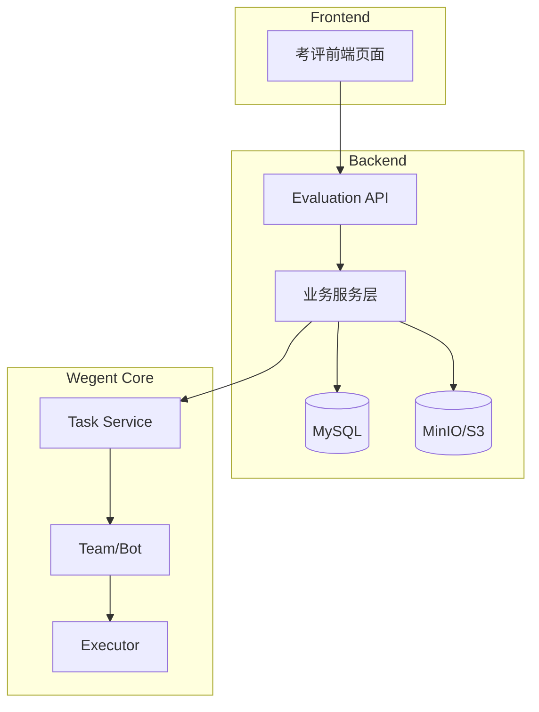
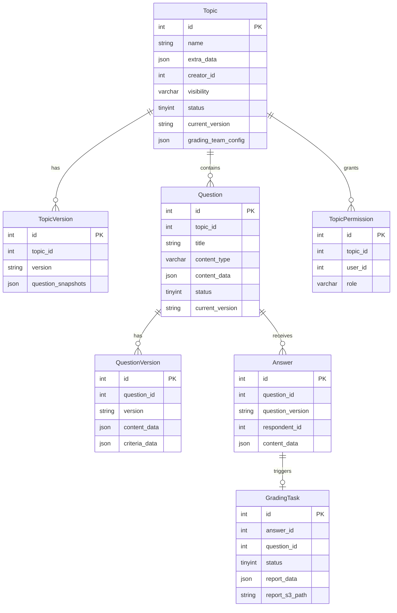
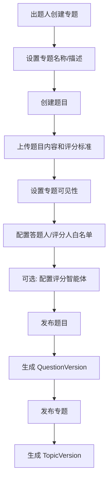
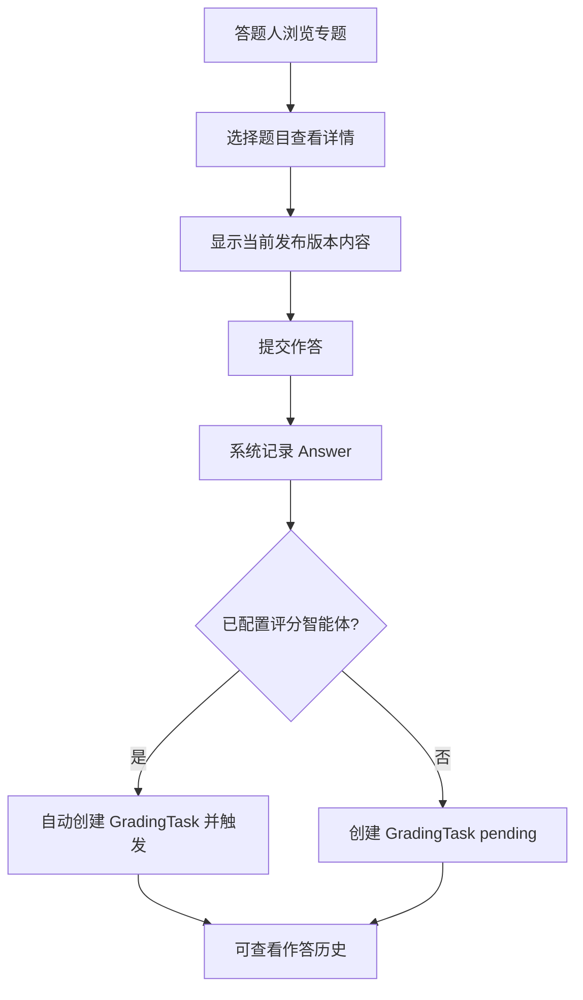
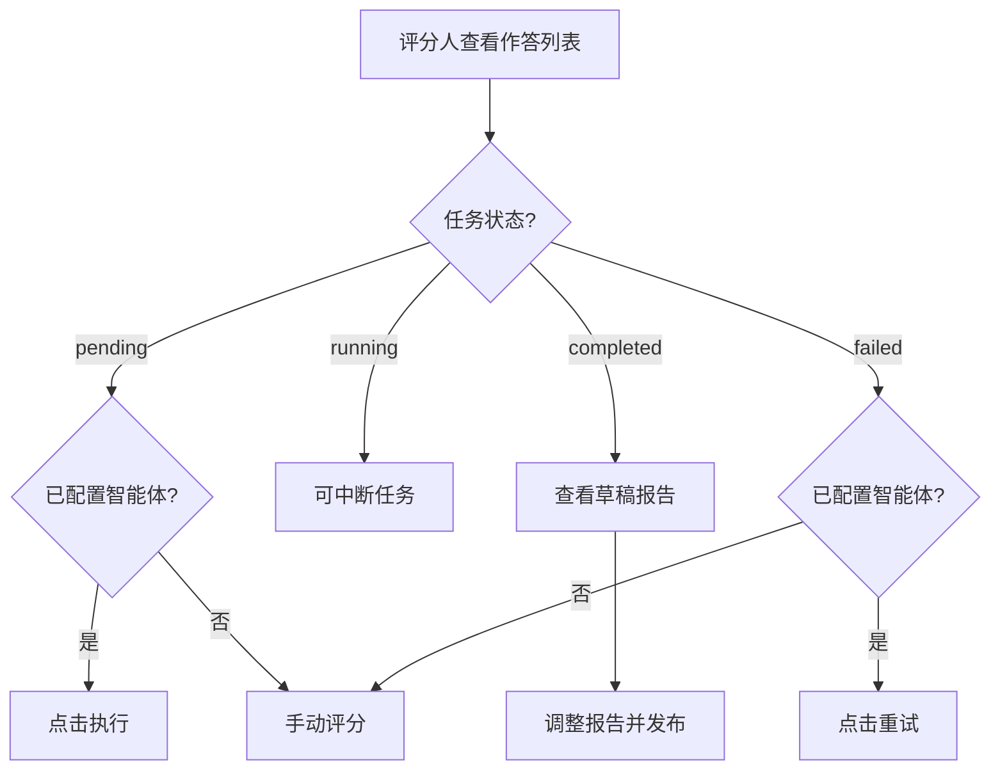
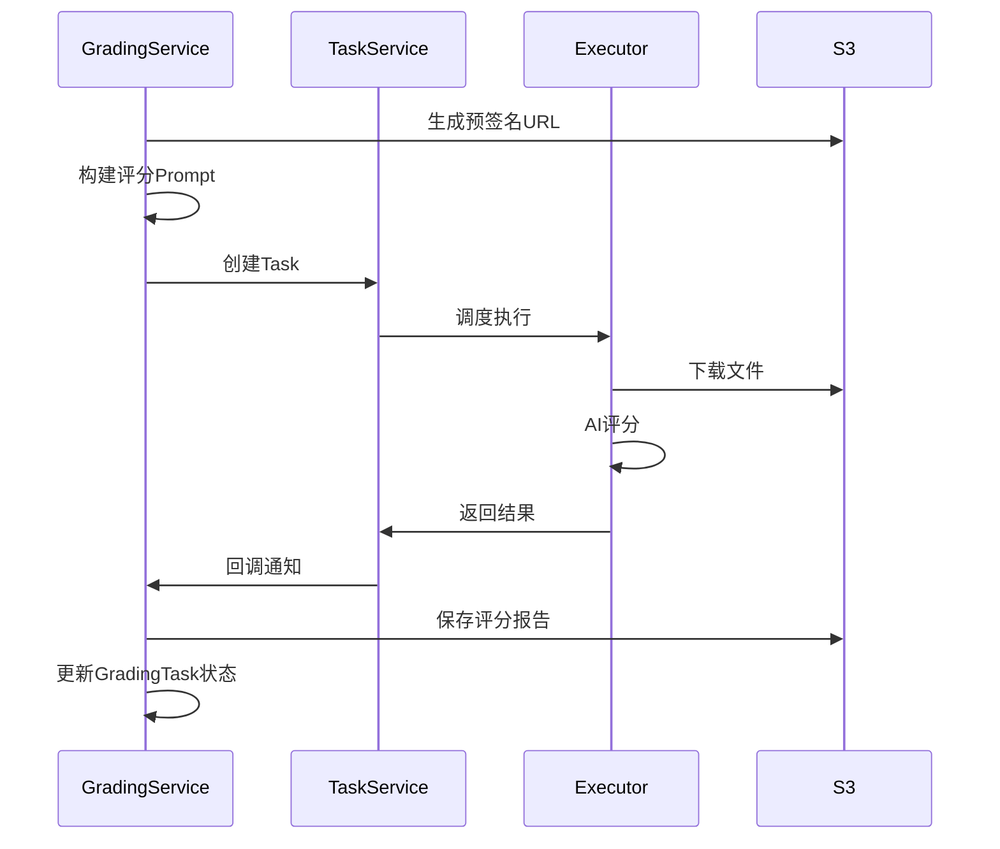
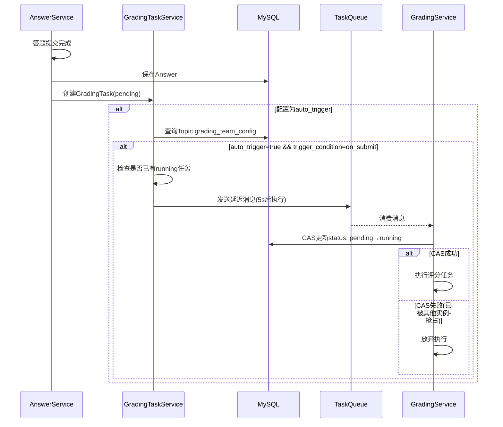

# 考评模块 (Evaluation Module) - 技术设计文档

---

## 1. 需求背景

### 1.1 业务目标

在 Wegent 系统中新增「考评」功能模块，支持企业内部的技能考核、培训评估等场景。

### 1.2 核心价值

- **标准化考核流程** - 统一的出题、作答、评分工作流
- **AI 辅助评分** - 复用 Wegent 智能体系统实现自动化评分
- **版本化管理** - 题目和专题支持版本控制
- **灵活的权限控制** - 支持公开/私有专题，精细化的角色权限管理

### 1.3 用户角色

| 角色       | 说明       | 核心能力                                                  |
| ---------- | ---------- | --------------------------------------------------------- |
| **出题人** | 专题创建者 | 创建专题/题目、管理权限、配置评分智能体、查看所有评分报告 |
| **答题人** | 作答用户   | 浏览专题、提交作答、查看自己的作答历史（不可见评分结果）  |
| **评分人** | 评分管理员 | 查看所有作答、执行/审核评分、发布评分报告                 |

> **⚠️ 重要权限说明：答题人不可见任何评分状态或评分结果**
>
> 答题人只能看到：
> - 可参与的专题列表
> - 题目内容（不含评分标准）
> - 自己提交的作答内容和提交时间
>
> 答题人**不可见**：
> - 评分标准
> - 任何评分状态（pending/running/completed/published）
> - 任何评分结果或评分报告
> - 评分人信息

---

## 2. 系统架构

### 2.1 模块位置

**代码目录规范：** 所有考评模块代码必须放在 `wecode/` 目录下，与开源基础代码隔离。

**⚠️ 重要：数据库迁移规则**

由于考评模块是**独立的内网功能**，其数据表的生命周期管理完全独立于开源主项目：

| 项目           | 迁移方式     | 说明                                |
| -------------- | ------------ | ----------------------------------- |
| **开源主项目** | Alembic 迁移 | 位于 `backend/alembic/versions/`    |
| **考评模块**   | **独立操作** | **禁止创建或修改任何 alembic 文件** |

- 考评模块的数据表由 DBA 或运维人员独立创建和维护
- 不允许在 `backend/alembic/versions/` 目录下创建任何与考评模块相关的迁移文件
- 数据表结构变更通过内部流程管理，不纳入开源项目的 Alembic 版本控制

| 代码类型 | 正确位置                      | 说明              |
| -------- | ----------------------------- | ----------------- |
| 后端服务 | `backend/wecode/service/`     | 服务层代码        |
| 后端 API | `backend/wecode/api/`         | API 端点/Patch    |
| 后端模型 | `backend/wecode/models/`      | SQLAlchemy 模型   |
| 前端组件 | `frontend/wecode/components/` | React 组件        |
| 前端页面 | `frontend/wecode/pages/`      | Next.js 页面      |
| 测试文件 | `backend/wecode/tests/`       | 单元测试/集成测试 |

**例外情况（仅导航/路由集成）：**

- 导航栏集成：`frontend/src/features/tasks/components/sidebar/TaskSidebar.tsx` 添加入口
  - 在 `navigationButtons` 数组中添加【AI考评】导航项，位于【AI设备】之后
  - 配置项：
    - `label`: `t('common:navigation.evaluation')`
    - `icon`: `ClipboardCheck` (来自 `lucide-react`)
    - `path`: `paths.evaluation.getHref()`
    - `isActive`: `pageType === 'evaluation'`
- 路由配置：`frontend/src/config/paths.ts` 添加路径
  ```typescript
  evaluation: {
    getHref: () => '/evaluation',
  },
  ```
- 路由集成：`frontend/src/app/` 添加路由挂载点 `(evaluation)/`
- API 路由注册：`backend/app/main.py` 注册路由 `/api/v1/wecode/evaluation`

**⚠️ 前端路由设计变更说明：**

本文档第 10 节已按**业务角色工作流**重新设计前端路由，替代了原 CRUD 思路：

| 维度     | 原设计（CRUD）                      | 新设计（角色工作流）             |
| -------- | ----------------------------------- | -------------------------------- |
| 出题人   | `/topics`, `/topics/{id}/questions` | `/author`, `/author/topics/{id}` |
| 答题人   | 混在 `/topics` 下                   | 独立 `/respondent` 入口          |
| 评分人   | `/topics/{id}/grading`              | 独立 `/grader` Dashboard         |
| 创建流程 | 分页面跳转                          | Wizard 一站式流程                |

此设计更符合业务场景，各角色有清晰独立的工作空间。

**导航栏入口位置：**

在【关注】、【编码】、【知识】、【AI设备】之后添加【AI考评】入口，导航顺序为：

1. 关注 (flow)
2. 编码 (code)
3. 知识 (wiki/knowledge)
4. AI设备 (devices)
5. **AI考评 (evaluation)** ← 新增

### 2.2 技术栈

**后端：** FastAPI + SQLAlchemy + MySQL + MinIO/S3

**前端：** Next.js 15 + React 19 + TypeScript + Tailwind CSS + shadcn/ui

### 2.3 系统架构图



---

## 3. 数据模型设计

### 3.1 ER 图



### 3.2 数据表定义

**DBA 数据库约束规范：**

| 约束类型           | 要求                         | 说明                                                                       |
| ------------------ | ---------------------------- | -------------------------------------------------------------------------- |
| **索引命名**       | 使用 `idx_` 前缀             | 如 `idx_wecode_eval_topics_creator`                                        |
| **禁止使用**       | ENUM、外键约束、表级排序规则 | 不得使用 `mysql_collate` 参数                                              |
| **JSON 字段**      | 必须 NOT NULL                | JSON 类型字段不能为 NULL                                                   |
| **id 列注释**      | 必须设置                     | 所有表的主键 id 列必须添加 `comment="Primary key ID"`                      |
| **列默认值**       | 必须设置                     | 所有非 JSON 类型列必须设置 `server_default`                                |
| **VARCHAR 字符集** | 禁止显式设置                 | VARCHAR 列不得设置 `charset` 或 `collation`，使用表默认字符集              |
| **DATETIME 列**    | NOT NULL + 默认值            | 使用 `DEFAULT CURRENT_TIMESTAMP` 或 `'1970-01-01 00:00:00'` 作为空值默认值 |

**SQLAlchemy/Alembic 示例：**

```python
# ✅ 正确
sa.Column("id", sa.Integer(), autoincrement=True, nullable=False, comment="Primary key ID")
sa.Column("name", sa.String(200), nullable=False, server_default="", comment="Topic name")
sa.Column("started_at", sa.DateTime(), nullable=False, server_default=sa.text("'1970-01-01 00:00:00'"))
# ...
mysql_charset="utf8mb4"  # 只允许设置 charset

# ❌ 错误
sa.Column("id", sa.Integer(), autoincrement=True, nullable=False)  # 缺少注释
sa.Column("name", sa.String(200), nullable=False)  # 缺少默认值
mysql_collate="utf8mb4_unicode_ci"  # 禁止设置 collate
```

#### 3.2.1 专题表 (wecode_eval_topics)

| 字段                | 类型         | 约束                                             | 说明                       |
| ------------------- | ------------ | ------------------------------------------------ | -------------------------- |
| id                  | INT          | PK, AUTO_INCREMENT, **COMMENT 'Primary key ID'** | 主键                       |
| name                | VARCHAR(200) | NOT NULL, **DEFAULT ''**                         | 专题名称                   |
| creator_id          | INT          | NOT NULL, **DEFAULT 0**, INDEX                   | 创建者用户ID               |
| visibility          | VARCHAR(20)  | NOT NULL, DEFAULT 'private'                      | 可见性: public/private     |
| status              | TINYINT      | NOT NULL, DEFAULT 0                              | 状态: 0=draft, 1=published |
| current_version     | VARCHAR(25)  | NOT NULL, DEFAULT ''                             | 当前发布版本号             |
| extra_data          | JSON         | NOT NULL                                         | 扩展数据 (description 等)  |
| grading_team_config | JSON         | NOT NULL                                         | 评分智能体配置             |
| created_at          | DATETIME     | NOT NULL, DEFAULT CURRENT_TIMESTAMP              | 创建时间                   |
| updated_at          | DATETIME     | NOT NULL, ON UPDATE CURRENT_TIMESTAMP            | 更新时间                   |
| is_active           | BOOLEAN      | NOT NULL, DEFAULT TRUE                           | 是否有效                   |

#### 3.2.2 专题版本表 (wecode_eval_topic_versions)

| 字段               | 类型        | 约束                                             | 说明         |
| ------------------ | ----------- | ------------------------------------------------ | ------------ |
| id                 | INT         | PK, AUTO_INCREMENT, **COMMENT 'Primary key ID'** | 主键         |
| topic_id           | INT         | NOT NULL, **DEFAULT 0**, INDEX                   | 关联专题ID   |
| version            | VARCHAR(25) | NOT NULL, **DEFAULT ''**                         | 版本号       |
| question_snapshots | JSON        | NOT NULL                                         | 题目版本快照 |
| published_at       | DATETIME    | NOT NULL, DEFAULT CURRENT_TIMESTAMP              | 发布时间     |
| published_by       | INT         | NOT NULL, DEFAULT 0                              | 发布人用户ID |

#### 3.2.3 题目表 (wecode_eval_questions)

| 字段            | 类型         | 约束                                             | 说明                                |
| --------------- | ------------ | ------------------------------------------------ | ----------------------------------- |
| id              | INT          | PK, AUTO_INCREMENT, **COMMENT 'Primary key ID'** | 主键                                |
| topic_id        | INT          | NOT NULL, **DEFAULT 0**, INDEX                   | 所属专题ID                          |
| title           | VARCHAR(500) | NOT NULL, **DEFAULT ''**                         | 题目标题                            |
| content_type    | VARCHAR(20)  | NOT NULL, DEFAULT 'text'                         | 内容类型: text/url/attachment/mixed |
| content_data    | JSON         | NOT NULL                                         | 内容数据                            |
| status          | TINYINT      | NOT NULL, DEFAULT 0                              | 状态: 0=draft, 1=published          |
| current_version | VARCHAR(25)  | NOT NULL, DEFAULT ''                             | 当前发布版本                        |
| order_index     | INT          | NOT NULL, DEFAULT 0                              | 排序索引                            |
| creator_id      | INT          | NOT NULL, **DEFAULT 0**, INDEX                   | 创建者用户ID                        |
| created_at      | DATETIME     | NOT NULL, DEFAULT CURRENT_TIMESTAMP              | 创建时间                            |
| updated_at      | DATETIME     | NOT NULL, ON UPDATE CURRENT_TIMESTAMP            | 更新时间                            |
| is_active       | BOOLEAN      | NOT NULL, DEFAULT TRUE                           | 是否有效                            |

#### 3.2.4 题目版本表 (wecode_eval_question_versions)

| 字段          | 类型        | 约束                                             | 说明         |
| ------------- | ----------- | ------------------------------------------------ | ------------ |
| id            | INT         | PK, AUTO_INCREMENT, **COMMENT 'Primary key ID'** | 主键         |
| question_id   | INT         | NOT NULL, **DEFAULT 0**, INDEX                   | 关联题目ID   |
| version       | VARCHAR(25) | NOT NULL, **DEFAULT ''**                         | 版本号       |
| content_data  | JSON        | NOT NULL                                         | 内容数据     |
| criteria_data | JSON        | NOT NULL                                         | 评分标准数据 |
| published_at  | DATETIME    | NOT NULL, DEFAULT CURRENT_TIMESTAMP              | 发布时间     |
| published_by  | INT         | NOT NULL, DEFAULT 0                              | 发布人用户ID |

#### 3.2.5 权限白名单表 (wecode_eval_permissions)

| 字段       | 类型        | 约束                                             | 说明                    |
| ---------- | ----------- | ------------------------------------------------ | ----------------------- |
| id         | INT         | PK, AUTO_INCREMENT, **COMMENT 'Primary key ID'** | 主键                    |
| topic_id   | INT         | NOT NULL, **DEFAULT 0**, INDEX                   | 关联专题ID              |
| user_id    | INT         | NOT NULL, **DEFAULT 0**, INDEX                   | 被授权用户ID            |
| role       | VARCHAR(20) | NOT NULL, DEFAULT 'respondent'                   | 角色: respondent/grader |
| granted_by | INT         | NOT NULL, DEFAULT 0                              | 授权人用户ID            |
| granted_at | DATETIME    | NOT NULL, DEFAULT CURRENT_TIMESTAMP              | 授权时间                |

#### 3.2.6 作答表 (wecode_eval_answers)

| 字段             | 类型        | 约束                                             | 说明             |
| ---------------- | ----------- | ------------------------------------------------ | ---------------- |
| id               | INT         | PK, AUTO_INCREMENT, **COMMENT 'Primary key ID'** | 主键             |
| question_id      | INT         | NOT NULL, **DEFAULT 0**, INDEX                   | 关联题目ID       |
| question_version | VARCHAR(25) | NOT NULL, **DEFAULT ''**                         | 作答时的题目版本 |
| respondent_id    | INT         | NOT NULL, **DEFAULT 0**, INDEX                   | 答题人用户ID     |
| content_type     | VARCHAR(20) | NOT NULL, DEFAULT 'text'                         | 内容类型         |
| content_data     | JSON        | NOT NULL                                         | 内容数据         |
| submitted_at     | DATETIME    | NOT NULL, DEFAULT CURRENT_TIMESTAMP              | 提交时间         |
| is_latest        | BOOLEAN     | NOT NULL, DEFAULT TRUE                           | 是否为最新作答   |

**唯一约束：** `UNIQUE KEY uk_respondent_question_latest (respondent_id, question_id, is_latest)`

- 确保每个用户每道题只有一个最新作答
- 旧作答自动更新 is_latest = FALSE

**触发逻辑：** 当用户提交新作答时，将同一用户同一题目的旧作答 is_latest 设为 FALSE

#### 3.2.7 评分任务表 (wecode_eval_grading_tasks)

| 字段             | 类型         | 约束                                             | 说明                                                           |
| ---------------- | ------------ | ------------------------------------------------ | -------------------------------------------------------------- |
| id               | INT          | PK, AUTO_INCREMENT, **COMMENT 'Primary key ID'** | 主键                                                           |
| answer_id        | INT          | NOT NULL, **DEFAULT 0**, INDEX                   | 关联作答ID                                                     |
| question_id      | INT          | NOT NULL, **DEFAULT 0**, INDEX                   | 关联题目ID                                                     |
| question_version | VARCHAR(25)  | NOT NULL, **DEFAULT ''**                         | 评分时的题目版本                                               |
| respondent_id    | INT          | NOT NULL, **DEFAULT 0**, INDEX                   | 答题人用户ID                                                   |
| grader_id        | INT          | NOT NULL, DEFAULT 0, INDEX                       | 评分人用户ID（执行评分的人）                                   |
| team_id          | INT          | NOT NULL, DEFAULT 0                              | 执行评分的智能体Team ID                                        |
| task_id          | INT          | NOT NULL, DEFAULT 0                              | 关联的Wegent Task ID                                           |
| status           | TINYINT      | NOT NULL, DEFAULT 0                              | 状态: 0=pending, 1=running, 2=completed, 3=failed, 4=published |
| executor_id      | VARCHAR(64)  | NOT NULL, DEFAULT ''                             | 执行实例ID（防竞态）                                           |
| report_data      | JSON         | NOT NULL                                         | 评分报告数据                                                   |
| report_s3_path   | VARCHAR(500) | NOT NULL, DEFAULT ''                             | 评分报告S3路径                                                 |
| attempt_count    | TINYINT      | NOT NULL, DEFAULT 0                              | 执行尝试次数（失败重试）                                       |
| error_message    | TEXT         | NOT NULL                                         | 错误信息（失败时）                                             |
| created_at       | DATETIME     | NOT NULL, DEFAULT CURRENT_TIMESTAMP              | 创建时间                                                       |
| started_at       | DATETIME     | **NOT NULL**, DEFAULT '1970-01-01 00:00:00'      | 开始时间                                                       |
| completed_at     | DATETIME     | **NOT NULL**, DEFAULT '1970-01-01 00:00:00'      | 完成时间                                                       |
| published_at     | DATETIME     | **NOT NULL**, DEFAULT '1970-01-01 00:00:00'      | 发布时间                                                       |

**唯一约束：** `UNIQUE KEY uk_answer_latest (answer_id, is_latest)` - 确保每个作答只有一个最新评分任务

**索引：**

- `idx_wecode_eval_grading_tasks_status` (status) - 按状态查询
- `idx_wecode_eval_grading_tasks_grader` (grader_id) - 评分人查询
- `idx_wecode_eval_grading_tasks_topic` (question_id) - 题目维度查询

### 3.3 版本号生成规则

版本号格式：`YYYYMMDD_HHmmss_XXXX`

- `YYYYMMDD_HHmmss` - UTC 时间戳
- `XXXX` - UUID 前4位

示例：`20240115_143000_a1b2`

---

## 4. S3 存储设计

### 4.1 设计原则

复用现有的 `MinIOStorageBackend`，通过配置化的路径前缀实现环境隔离。

### 4.2 路径结构

通过 `EVAL_S3_PREFIX` 配置前缀，默认值为 `evaluation`：

```
{EVAL_S3_PREFIX}/                          # 默认: evaluation/
├── questions/                              # 题目内容
│   └── {topic_id}/{question_id}/{version}/
│       ├── content/{filename}
│       └── metadata.json
├── criteria/                               # 评分标准
│   └── {topic_id}/{question_id}/{version}/{filename}
├── answers/                                # 作答内容
│   └── {respondent_id}/{topic_id}/{question_id}/{submit_ts}/{filename}
└── reports/                                # 评分报告
    └── {respondent_id}/{topic_id}/{question_id}/{grading_ts}/{draft|final}.md
```

### 4.3 存储服务接口

核心方法：

- `upload_question_content()` - 上传题目附件
- `upload_criteria()` - 上传评分标准
- `upload_answer()` - 上传作答附件
- `save_grading_report()` - 保存评分报告
- `generate_presigned_url()` - 生成预签名 URL

---

## 5. 核心业务流程

### 5.1 出题流程



**流程说明：**

1. 出题人创建专题和题目 (draft 状态)
2. 上传题目内容和评分标准
3. 设置可见性，配置白名单
4. 可选配置评分智能体 (ClaudeCode 类型 Team)
5. 发布题目 → 生成 QuestionVersion
6. 发布专题 → 生成 TopicVersion (记录题目版本快照)

### 5.2 作答流程



### 5.3 评分流程



**评分任务状态：** `pending` → `running` → `completed` → `published`

### 5.4 评分智能体执行流程



---

## 6. 版本管理

### 6.1 题目版本管理

- **修改后需重新发布**：题目修改后需重新发布才能生效
- **版本记录**：每次发布生成新的 QuestionVersion
- **历史保留**：保留所有历史版本，支持回滚

### 6.2 专题版本管理

- **版本快照**：专题发布时记录所有题目的版本快照
- **答题人视角**：答题人看到的是专题发布时的题目版本

### 6.3 版本更新提示

- 当答题人最后一次作答后，题目有新版本发布时显示提示
- 答题人可选择基于新版本重新作答

---

## 7. API 设计（按业务领域组织）

### 7.1 API 设计原则

**不按纯资源 CRUD 组织，而是按用户角色和业务领域划分：**

- `/author/*` - 出题人专属 API
- `/respondent/*` - 答题人专属 API
- `/grader/*` - 评分人专属 API
- `/shared/*` - 跨角色共享 API（如查看报告）

### 7.2 API 路由总览

#### 出题人 API (`/api/v1/wecode/evaluation/author/*`)

| 方法   | 路径                            | 说明                   |
| ------ | ------------------------------- | ---------------------- |
| GET    | /author/topics                  | 我创建的专题列表       |
| POST   | /author/topics                  | 创建专题               |
| GET    | /author/topics/{id}             | 专题详情               |
| PUT    | /author/topics/{id}             | 更新专题基础信息       |
| DELETE | /author/topics/{id}             | 删除专题               |
| POST   | /author/topics/{id}/publish     | 发布专题               |
| POST   | /author/topics/{id}/rollback    | 回滚到指定版本         |
| GET    | /author/topics/{id}/versions    | 获取版本历史           |
| GET    | /author/topics/{id}/statistics  | 统计数据（答题人数等） |
| POST   | /author/topics/{id}/questions   | 添加题目               |
| GET    | /author/topics/{id}/questions   | 题目列表               |
| PUT    | /author/questions/{id}          | 更新题目               |
| POST   | /author/questions/{id}/publish  | 发布题目               |
| GET    | /author/questions/{id}/versions | 题目版本历史           |
| PUT    | /author/topics/{id}/permissions | 设置权限白名单         |
| GET    | /author/topics/{id}/graders     | 获取评分人列表         |

#### 答题人 API (`/api/v1/wecode/evaluation/respondent/*`)

| 方法 | 路径                               | 说明                         |
| ---- | ---------------------------------- | ---------------------------- |
| GET  | /respondent/topics                 | 可参与的专题列表             |
| GET  | /respondent/topics/{id}            | 专题详情                     |
| GET  | /respondent/topics/{id}/questions  | 题目列表（答题人视角）       |
| GET  | /respondent/topics/{id}/progress   | 我的答题进度（只含答题统计） |
| GET  | /respondent/questions/{id}         | 题目详情                     |
| POST | /respondent/questions/{id}/answers | 提交作答                     |
| GET  | /respondent/history                | 我的作答历史                 |
| GET  | /respondent/answers/{id}           | 作答详情                     |

> **⚠️ 注意：答题人 API 不提供任何评分相关的端点**
>
> - 无 `/respondent/reports` 端点
> - 无评分状态字段返回
> - 作答历史只返回作答内容，不含评分信息

#### 评分人 API (`/api/v1/wecode/evaluation/grader/*`)

| 方法 | 路径                        | 说明                     |
| ---- | --------------------------- | ------------------------ |
| GET  | /grader/dashboard           | Dashboard 统计数据       |
| GET  | /grader/tasks               | 评分任务列表             |
| GET  | /grader/tasks/{id}          | 评分任务详情             |
| POST | /grader/tasks/{id}/execute  | 执行评分（触发AI）       |
| POST | /grader/tasks/{id}/retry    | 重新评分                 |
| POST | /grader/tasks/{id}/publish  | 发布评分报告             |
| GET  | /grader/answers             | 作答列表（可按专题筛选） |
| GET  | /grader/answers/{id}        | 作答详情+关联任务        |
| GET  | /grader/topics/{id}/answers | 专题下所有作答           |
| GET  | /grader/reports             | 已发布报告列表           |
| GET  | /grader/reports/{id}        | 评分报告详情             |

#### 共享 API (`/api/v1/wecode/evaluation/shared/*`)

| 方法 | 路径                   | 说明                       |
| ---- | ---------------------- | -------------------------- |
| GET  | /shared/reports/{id}   | 查看评分报告（需权限验证） |
| POST | /shared/files/upload   | 文件上传（获取预签名URL）  |
| GET  | /shared/files/download | 文件下载（生成预签名URL）  |

### 7.3 核心接口示例

**出题人创建专题：**

```http
POST /api/v1/wecode/evaluation/author/topics
{
  "name": "Python 基础考核",
  "description": "Python 编程基础知识考核",
  "visibility": "private",
  "grading_team_id": 123
}
```

**答题人提交作答：**

```http
POST /api/v1/wecode/evaluation/respondent/questions/1/answers
{
  "content_type": "text",
  "content_text": "这是我的作答内容..."
}
```

**评分人执行评分：**

```http
POST /api/v1/wecode/evaluation/grader/tasks/100/execute
{
  "grading_config": {
    "team_id": 123,
    "prompt_template": "default"
  }
}
```

**评分人发布报告：**

```http
POST /api/v1/wecode/evaluation/grader/tasks/100/publish
{
  "report_version": "final",
  "comments": "确认无误，正式发布"
}
```

---

## 8. 评分智能体集成

### 8.1 集成架构

复用现有 Wegent Team 系统，通过创建 Task 执行评分任务。

### 8.2 智能体绑定机制

#### 8.2.1 出题人配置评分智能体（专题级别）

出题人在创建/编辑专题时配置默认评分智能体：

```typescript
// POST /api/v1/wecode/evaluation/author/topics/{id}/grading-config
{
  "team_id": 123,                    // 绑定的Team ID
  "auto_trigger": true,              // 是否自动触发评分
  "trigger_condition": "on_submit",  // 触发条件: on_submit(提交后)/manual(手动)
  "prompt_template": "default",      // 评分Prompt模板
  "grading_timeout": 3600            // 评分超时时间(秒)
}
```

**配置存储：** 存储在 `Topic.grading_team_config` JSON字段中

**约束条件：**

- Team Shell 类型必须为 `ClaudeCode`
- Team 必须属于专题创建者或为公共 Team
- 每个专题只能配置一个默认评分智能体

#### 8.2.2 评分人选择/切换智能体（任务级别）

评分人在执行评分时可以选择：

1. **使用专题默认智能体**（推荐）
2. **选择其他可用智能体**（需有权限的Team）
3. **手动评分**（不启用智能体）

```typescript
// POST /api/v1/wecode/evaluation/grader/tasks/{id}/execute
{
  "team_id": 123,           // 可选，不传则使用专题默认
  "prompt_template": "custom",  // 可选，使用自定义Prompt
  "custom_prompt": "..."    // 当prompt_template为custom时必填
}
```

### 8.3 评分任务自动触发机制

#### 8.3.1 触发条件配置

| 触发模式           | 说明               | 适用场景             |
| ------------------ | ------------------ | -------------------- |
| `manual`           | 完全手动触发       | 需要人工审核后再评分 |
| `on_submit`        | 答题提交后自动触发 | 实时考试、快速反馈   |
| `scheduled`        | 定时批量触发       | 截止后统一评分       |
| `auto_with_review` | 自动评分+人工复核  | 高 stakes 考核       |

#### 8.3.2 自动触发流程



**关键设计：** 使用 **CAS(Compare-And-Swap)** 机制防止多实例竞态

### 8.4 多实例竞态问题解决

**核心策略：数据库CAS + 状态机**

| 场景           | 防护策略                                           |
| -------------- | -------------------------------------------------- |
| 重复创建任务   | 唯一约束 `uk_answer_latest` + 先查后插             |
| 多实例同时执行 | CAS更新 `status=pending→running` 带 `executor_id`  |
| 重复写报告     | 幂等设计：先检查`status==completed`，失败回滚      |
| 孤儿任务       | 定时任务检测`running>30min`的任务，重置为`pending` |

**状态机：**

```
pending → running → completed → published
   ↓         ↓          ↓
 (可抢占) (带锁执行)  (不可修改)
```

### 8.5 评分 Prompt 模板

```markdown
你是一个专业的评分助手。请根据以下信息进行评分：

## 题目内容

{题目文本内容}
附件下载链接: {预签名URL}

## 评分标准

{评分标准文本}
附件下载链接: {预签名URL}

## 学生作答

{作答文本内容}
附件下载链接: {预签名URL}

## 输出要求

请生成一份 Markdown 格式的评分报告，包含：

1. **评分总结** - 总体评价和得分
2. **详细分析** - 按评分标准逐项评价
3. **优点与不足**
4. **改进建议**
```

### 8.6 Team 配置要求

- Shell 类型必须为 `ClaudeCode`
- Team 必须属于专题创建者或为公共 Team

---

## 9. 权限控制

### 9.1 权限矩阵

| 操作             | 出题人 | 答题人 | 评分人 | 说明                     |
| ---------------- | :----: | :----: | :----: | ------------------------ |
| 创建专题         |   ✅   |   -    |   -    | 任何登录用户可创建       |
| 编辑专题         |   ✅   |   ❌   |   ❌   | 仅创建者                 |
| 查看专题         |   ✅   |   ✅   |   ✅   | 公开专题所有人可见       |
| 管理权限         |   ✅   |   ❌   |   ❌   | 仅创建者                 |
| 查看评分标准     |   ✅   |   ❌   |   ✅   | **答题人永远不可见**     |
| 提交作答         |   ✅   |   ✅   |   ✅   | 根据专题权限             |
| 查看所有作答     |   ✅   |   ❌   |   ✅   | 出题人和评分人           |
| 查看自己的作答   |   ✅   |   ✅   |   ✅   | 答题人只看到自己的作答   |
| 查看评分状态     |   ✅   |   ❌   |   ✅   | **答题人永远不可见**     |
| 执行评分         |   ✅   |   ❌   |   ✅   | 出题人和评分人           |
| 发布评分报告     |   ✅   |   ❌   |   ✅   | 出题人和评分人           |
| 查看评分报告     |   ✅   |   ❌   |   ✅   | **答题人永远不可见**     |
| 下载评分报告     |   ✅   |   ❌   |   ✅   | **答题人永远不可见**     |

> **⚠️ 重要：答题人权限限制**
>
> 答题人**完全不可见**以下信息，无论评分是否已发布：
> - 评分标准（criteria_data）
> - 评分任务状态（grading_status）
> - 评分报告（report_data、report_s3_path）
> - 评分人信息（grader_id）
>
> 这是业务安全要求，确保考评过程的公正性。

### 9.2 权限检查逻辑

```python
def can_view_topic(topic, user_id):
    if topic.visibility == "public":
        return True
    return topic.creator_id == user_id or has_permission(topic.id, user_id)

def can_answer(topic, user_id):
    if topic.visibility == "public":
        return True
    return has_permission(topic.id, user_id, "respondent")

def can_grade(topic, user_id):
    return topic.creator_id == user_id or has_permission(topic.id, user_id, "grader")
```

---

## 10. 前端设计

### 10.1 目录结构（按角色组织）

```
frontend/wecode/
├── components/
│   ├── author/              # 出题人组件
│   │   ├── TopicWizard/     # 创建专题 Wizard
│   │   ├── QuestionEditor/  # 题目编辑器
│   │   ├── PermissionPanel/ # 权限管理面板
│   │   └── VersionHistory/  # 版本历史
│   ├── respondent/          # 答题人组件
│   │   ├── TopicCard/       # 专题卡片（带版本提示）
│   │   ├── QuestionViewer/  # 题目展示
│   │   ├── AnswerEditor/    # 作答编辑器
│   │   └── HistoryList/     # 作答历史列表
│   ├── grader/              # 评分人组件
│   │   ├── DashboardStats/  # Dashboard 统计
│   │   ├── TaskList/        # 评分任务列表
│   │   ├── GradingWorkspace/# 评分工作区（核心）
│   │   ├── ReportViewer/    # 报告查看器
│   │   └── ReportEditor/    # 报告编辑器
│   └── common/              # 跨角色通用组件
│       ├── FileUploader/    # 文件上传
│       ├── FileDownloader/  # 文件下载
│       ├── VersionBadge/    # 版本标记
│       └── StatusBadge/     # 状态标记
├── app/
│   └── (evaluation)/        # Next.js App Router
│       ├── layout.tsx       # 考评模块布局
│       ├── page.tsx         # 角色分流入口
│       ├── author/          # 出题人路由组
│       │   ├── page.tsx
│       │   ├── topics/
│       │   │   ├── new/
│       │   │   └── [id]/
│       │   └── ...
│       ├── respondent/      # 答题人路由组
│       │   ├── page.tsx
│       │   ├── topics/
│       │   └── history/
│       ├── grader/          # 评分人路由组
│       │   ├── page.tsx
│       │   ├── tasks/
│       │   ├── answers/
│       │   └── reports/
│       └── reports/         # 共享报告查看
│           └── [id]/
├── hooks/                   # 自定义 Hooks
│   ├── useAuthorTopics.ts
│   ├── useRespondentTopics.ts
│   ├── useGradingTasks.ts
│   └── useEvaluationAuth.ts
├── api/                     # API 调用（按角色）
│   ├── author.ts
│   ├── respondent.ts
│   ├── grader.ts
│   └── shared.ts
├── types/                   # TypeScript 类型
│   ├── author.ts
│   ├── respondent.ts
│   ├── grader.ts
│   └── common.ts
└── i18n/                    # 国际化
    ├── author/
    ├── respondent/
    └── grader/
```

**关键改进：**

1. **组件按角色隔离** - 避免不同角色的组件混在一起
2. **路由按角色分组** - 清晰的三段式结构
3. **API/Hooks 按角色隔离** - 便于维护和权限控制

### 10.2 页面路由（按角色工作流组织）

**设计理念：** 不按资源 CRUD 组织，而是按用户角色和工作流程设计

```
/evaluation                          # 考评模块入口（根据角色重定向）

  # ========== 出题人工作台 ==========
  /author                            # 我创建的专题列表
  /author/topics/new                 # 创建专题（Wizard 流程）
  /author/topics/{id}                # 专题管理中心
  /author/topics/{id}/edit           # 编辑专题基础信息
  /author/topics/{id}/questions/new  # 添加/编辑题目
  /author/topics/{id}/permissions    # 权限白名单管理
  /author/topics/{id}/versions/{v}   # 历史版本查看

  # ========== 答题人工作台 ==========
  /respondent                        # 可参与的专题列表
  /respondent/topics/{id}            # 专题详情（题目列表）
  /respondent/topics/{id}/questions/{qid}  # 作答页面
  /respondent/history                # 我的作答历史

  # ========== 评分人工作台 ==========
  /grader                            # 评分 Dashboard（待评分任务）
  /grader/tasks                      # 所有评分任务列表
  /grader/topics/{id}                # 按专题查看作答
  /grader/answers/{id}               # 作答详情+评分操作（核心页面）
  /grader/reports                    # 已发布评分报告

  # ========== 共享查看 ==========
  /reports/{id}                      # 评分报告查看（出题人/答题人只读访问）
```

### 10.3 各角色页面详细设计

#### 出题人工作台 (`/evaluation/author/*`)

| 页面                                | 核心功能         | 设计要点                                                        |
| ----------------------------------- | ---------------- | --------------------------------------------------------------- |
| `/author`                           | 我创建的专题列表 | 卡片式展示，显示状态（草稿/已发布）、题目数、答题人数、最新版本 |
| `/author/topics/new`                | 创建专题 Wizard  | 步骤：①基础信息 ②添加题目 ③配置权限 ④预览发布                   |
| `/author/topics/{id}`               | 专题管理中心     | Tab 切换：题目管理 / 权限白名单 / 发布历史 / 统计数据           |
| `/author/topics/{id}/questions/new` | 添加/编辑题目    | 同页编辑题目内容和评分标准，支持多附件上传                      |
| `/author/topics/{id}/versions/{v}`  | 版本详情         | 版本对比、一键回滚、查看该版本所有作答                          |

**关键改进：** 创建专题采用 **Wizard 流程**，一站式完成，而非分页面跳转

#### 答题人工作台 (`/evaluation/respondent/*`)

| 页面                                      | 核心功能         | 设计要点                                               |
| ----------------------------------------- | ---------------- | ------------------------------------------------------ |
| `/respondent`                             | 可参与的专题列表 | 公开专题 + 被授权私有专题，显示是否有新版本提示        |
| `/respondent/topics/{id}`                 | 专题详情         | 题目列表，已作答的显示"已完成"标记，有新版本的显示提示 |
| `/respondent/topics/{id}/questions/{qid}` | 作答页面         | 左侧题目展示，右侧作答区，支持多次提交                 |
| `/respondent/history`                     | 我的作答历史     | 按时间倒序，只显示作答内容和提交时间（无评分信息）     |

> **⚠️ 答题人界面限制**
>
> 答题人界面**不显示任何评分相关信息**：
> - 不显示评分报告标签页
> - 不显示评分状态
> - 不显示评分人信息
> - 作答历史只显示提交的内容，不显示任何评分结果

**关键改进：** 答题人有独立入口，不和出题人混在一起，体验更清晰

#### 评分人工作台 (`/evaluation/grader/*`)

| 页面                   | 核心功能       | 设计要点                                                            |
| ---------------------- | -------------- | ------------------------------------------------------------------- |
| `/grader`              | 评分 Dashboard | 待评分任务数、进行中的评分、最近完成、快捷入口                      |
| `/grader/tasks`        | 评分任务列表   | 可按状态筛选（pending/running/completed/published）、按专题分组     |
| `/grader/answers/{id}` | 作答详情+评分  | **核心页面**：左侧三栏（题目/评分标准/作答），右侧评分报告+操作按钮 |
| `/grader/reports`      | 已发布报告列表 | 搜索、筛选、批量导出                                                |

**关键改进：** 评分人在单页面完成所有评分工作（查看内容→触发AI评分→审核报告→发布），无需跳转

### 10.4 角色权限路由守卫

```typescript
// /evaluation/layout.tsx 或中间件中实现
function EvaluationRouteGuard() {
  const { userRole } = useEvaluationContext()
  const pathname = usePathname()

  // 出题人只能访问 /author/*
  if (pathname.startsWith('/evaluation/author') && !userRole.isAuthor) {
    return <ForbiddenPage />
  }

  // 评分人只能访问 /grader/*
  if (pathname.startsWith('/evaluation/grader') && !userRole.isGrader) {
    return <ForbiddenPage />
  }

  // 答题人只能访问 /respondent/*
  if (pathname.startsWith('/evaluation/respondent') && !userRole.isRespondent) {
    return <ForbiddenPage />
  }
}
```

### 10.5 入口页面角色分流

```typescript
// /evaluation/page.tsx - 考评模块入口
export default function EvaluationEntryPage() {
  const { userRoles } = useUser()

  // 如果用户只有一个角色，直接跳转到对应工作台
  if (userRoles.isAuthor && !userRoles.isGrader && !userRoles.isRespondent) {
    redirect('/evaluation/author')
  }
  if (userRoles.isGrader) {
    redirect('/evaluation/grader')  // 评分人优先看 Dashboard
  }
  if (userRoles.isRespondent) {
    redirect('/evaluation/respondent')
  }

  // 多个角色的用户，显示角色选择或综合 Dashboard
  return <EvaluationRoleSelector />
}
```

---

## 11. 测试验收要求

### 11.1 单元测试覆盖率

| 模块     | 覆盖率要求 |
| -------- | ---------- |
| 专题服务 | ≥80%       |
| 题目服务 | ≥80%       |
| 作答服务 | ≥80%       |
| 评分服务 | ≥80%       |
| 权限服务 | ≥90%       |

### 11.2 验收标准

**功能验收：**

- 专题创建：支持公开/私有专题
- 题目管理：支持文本/URL/附件类型，版本管理
- 权限管理：添加/移除答题人和评分人
- 作答提交：支持多次作答，记录版本
- 自动评分：配置智能体后自动触发
- 手动评分：支持不使用智能体的手动评分
- 报告发布：支持单个和批量发布

**性能验收：**

- 专题列表加载 < 500ms
- 题目详情加载 < 300ms
- 作答提交响应 < 1s
- 评分任务启动 < 2s

---

## 12. 实现计划

### Phase 1 - 基础架构 (Week 1-2)

- [ ] 数据库模型和迁移脚本
- [ ] S3 存储服务实现
- [ ] 权限检查服务
- [ ] 基础 API 框架

### Phase 2 - 专题和题目管理 (Week 3-4)

- [ ] 专题/题目 CRUD API
- [ ] 版本管理功能
- [ ] 文件上传/下载
- [ ] 前端专题/题目管理页面

### Phase 3 - 作答流程 (Week 5)

- [ ] 作答提交和历史 API
- [ ] 版本更新提示
- [ ] 前端作答页面

### Phase 4 - 评分流程 (Week 6-7)

- [ ] 评分任务 API
- [ ] Wegent Task 集成
- [ ] 手动评分功能
- [ ] 前端评分管理页面

### Phase 5 - 优化完善 (Week 8)

- [ ] 批量操作
- [ ] WebSocket 状态推送
- [ ] 性能优化和测试补充

---

## 附录

### A. 数据库迁移说明

**⚠️ 考评模块数据表不由 Alembic 管理**

由于考评模块是独立的内网功能，其数据表通过以下方式管理：

- 数据表由 DBA 或运维人员独立创建和维护
- **禁止在 `backend/alembic/versions/` 目录下创建任何与考评模块相关的迁移文件**
- 数据表结构变更通过内部流程管理，不纳入开源项目的 Alembic 版本控制

数据表定义仅供参考，实际建表操作请遵循内部运维流程。

### B. 环境配置

```bash
# S3/MinIO 配置 (复用现有附件存储配置)
ATTACHMENT_STORAGE_BACKEND=minio
ATTACHMENT_S3_ENDPOINT=minio:9000
ATTACHMENT_S3_ACCESS_KEY=minioadmin
ATTACHMENT_S3_SECRET_KEY=minioadmin
ATTACHMENT_S3_BUCKET=wegent

# 考评模块特定配置
EVAL_S3_PREFIX=evaluation              # S3 路径前缀
GRADING_TASK_TIMEOUT=3600              # 评分任务超时时间(秒)
GRADING_PRESIGNED_URL_EXPIRES=3600     # 预签名URL过期时间(秒)
```

### C. 错误码定义

| 错误码   | 说明                       |
| -------- | -------------------------- |
| EVAL_001 | 专题不存在                 |
| EVAL_002 | 题目不存在                 |
| EVAL_003 | 无权限访问                 |
| EVAL_004 | 专题未发布                 |
| EVAL_005 | 题目未发布                 |
| EVAL_006 | 评分智能体未配置           |
| EVAL_007 | 评分智能体类型不支持       |
| EVAL_008 | 评分任务执行失败           |
| EVAL_009 | 文件上传失败               |
| EVAL_010 | 版本冲突                   |
| EVAL_011 | 评分任务已被其他实例执行   |
| EVAL_012 | 评分任务状态非法           |
| EVAL_013 | 作答已存在进行中的评分任务 |

### D. 并发控制要点

| 层级   | 策略     | 关键实现                                              |
| ------ | -------- | ----------------------------------------------------- |
| 数据库 | 唯一约束 | `uk_answer_latest` 防止重复创建任务                   |
| 数据库 | CAS更新  | `UPDATE ... WHERE status='pending'` 实现抢占          |
| 应用   | 状态机   | `pending→running→completed→published`，变更需满足条件 |
| 前端   | 防抖     | 500ms防抖防止重复点击                                 |

**核心接口行为：**

- 创建任务：先查是否已存在 pending/running 任务，存在则返回现有任务
- 执行任务：CAS更新 `status=pending→running` 并设置 `executor_id`，失败返回 EVAL_011
- 孤儿任务：定时检测 running>30min 的任务，重置为 pending
