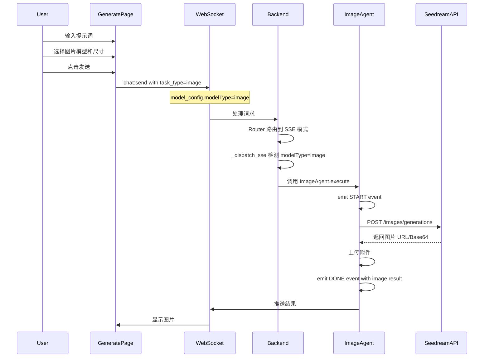
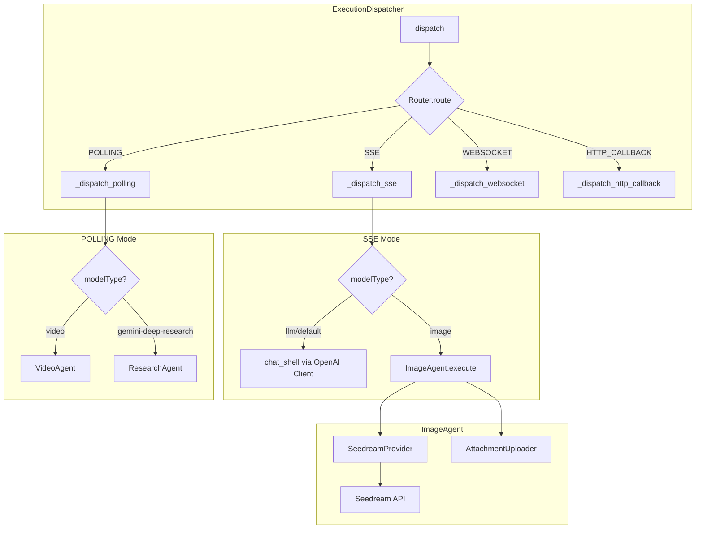

# 图片生成模式实现计划

## 1. 概述

本计划描述如何在 generate 页面增加图片生成模式支持，包括：
1. **后端架构** - 在 SSE 模式下区分 chat_shell 和 ImageAgent
2. **模型设置页面** - 支持创建和编辑图片类型模型（`modelType: image`）
3. **图片生成界面** - 允许用户选择图片生成模型和图片尺寸
4. **调用后端服务** - 对接火山引擎 Seedream API
5. **前端重构** - 统一使用 ModelSelector 组件，删除 VideoModelSelector

### 1.1 核心设计思路

**关键区别于视频生成：**
- 视频生成使用 **POLLING 模式**（异步任务 + 轮询状态）
- 图片生成使用 **SSE 模式**（同步调用，直接返回结果）

**SSE 模式内部路由：**
```
SSE Mode
├── modelType == "llm" (default) → chat_shell
└── modelType == "image"         → ImageAgent (Backend 内部)
```

### 1.2 Seedream API 特点

根据 [`plans/image-api.md`](./image-api.md)，Seedream 图片生成 API 是**同步返回**的：
- 直接返回图片 URL 或 Base64 编码
- 不需要创建任务和轮询状态
- 支持流式输出（组图场景）

**支持的模型：**
| 模型 | 能力 |
|------|------|
| doubao-seedream-5.0-lite | 文生图、单图生图、多图生图、组图生成 |
| doubao-seedream-4.5/4.0 | 文生图、单图生图、多图生图、组图生成 |
| doubao-seedream-3.0-t2i | 仅文生图 |
| doubao-seededit-3.0-i2i | 仅图生图 |

**关键参数：**
| 参数 | 类型 | 说明 |
|------|------|------|
| `model` | string | 模型 ID |
| `prompt` | string | 提示词（中英文） |
| `image` | string/array | 参考图片（URL 或 Base64） |
| `size` | string | 尺寸（如 `2K`、`3K` 或 `2048x2048`） |
| `response_format` | string | 返回格式（`url` 或 `b64_json`） |
| `stream` | boolean | 是否流式输出 |
| `watermark` | boolean | 是否添加水印 |

---

## 2. 系统架构

### 2.1 整体数据流



### 2.2 后端组件架构



---

## 3. 后端实现

### 3.1 Schema 变更

**文件：** `backend/app/schemas/kind.py`

#### 3.1.1 新增 IMAGE 到 ModelCategoryType

```python
class ModelCategoryType(str, Enum):
    LLM = "llm"
    TTS = "tts"
    STT = "stt"
    EMBEDDING = "embedding"
    RERANK = "rerank"
    VIDEO = "video"
    IMAGE = "image"  # 新增
```

#### 3.1.2 新增 ImageGenerationConfig

```python
class ImageGenerationConfig(BaseModel):
    """Image generation specific configuration"""
    
    # 尺寸配置
    size: Optional[str] = Field(
        "2048x2048",
        description="Image size. Can be resolution like '2K'/'3K' or pixel dimensions like '2048x2048'"
    )
    
    # 组图配置
    sequential_image_generation: Optional[str] = Field(
        "disabled",
        description="Sequential image generation mode: 'auto' for multi-image, 'disabled' for single image"
    )
    max_images: Optional[int] = Field(
        1,
        ge=1,
        le=15,
        description="Maximum number of images to generate (only when sequential_image_generation='auto')"
    )
    
    # 输出配置
    response_format: Optional[str] = Field(
        "url",
        description="Response format: 'url' for image URL, 'b64_json' for base64 encoded"
    )
    output_format: Optional[str] = Field(
        "jpeg",
        description="Output image format: 'jpeg' or 'png' (only for seedream-5.0-lite)"
    )
    
    # 其他配置
    watermark: Optional[bool] = Field(
        False,
        description="Whether to add watermark to generated images"
    )
    optimize_prompt_mode: Optional[str] = Field(
        "standard",
        description="Prompt optimization mode: 'standard' or 'fast'"
    )
```

#### 3.1.3 更新 ModelSpec

```python
class ModelSpec(BaseModel):
    # ... existing fields ...
    
    imageConfig: Optional[ImageGenerationConfig] = Field(
        None, description="Image generation configuration (when modelType='image')"
    )
```

### 3.2 Router 变更

**文件：** `backend/app/services/execution/router.py`

图片生成使用 SSE 模式，不需要修改 Router。Router 已经会将 `shellType == "Chat"` 路由到 SSE 模式。

关键是在 `_dispatch_sse` 内部根据 `modelType` 区分调用 chat_shell 还是 ImageAgent。

### 3.3 Dispatcher 变更

**文件：** `backend/app/services/execution/dispatcher.py`

修改 `_dispatch_sse` 方法，在调用 chat_shell 之前检查 modelType：

```python
async def _dispatch_sse(
    self,
    request: ExecutionRequest,
    target: ExecutionTarget,
    emitter: ResultEmitter,
) -> None:
    """Dispatch task via SSE.
    
    Routes based on modelType:
    - modelType == "image" -> ImageAgent (direct API call)
    - modelType == "llm" or default -> chat_shell via OpenAI client
    """
    # Check if this is an image generation request
    model_type = self._get_model_type(request)
    
    if model_type == "image":
        # Route to ImageAgent for direct image generation
        await self._dispatch_image_generation(request, emitter)
        return
    
    # Default: route to chat_shell via OpenAI client
    # ... existing chat_shell logic ...
```

新增 `_dispatch_image_generation` 方法：

```python
async def _dispatch_image_generation(
    self,
    request: ExecutionRequest,
    emitter: ResultEmitter,
) -> None:
    """Dispatch image generation task to ImageAgent.
    
    ImageAgent handles:
    1. Calling Seedream API directly
    2. Uploading result as attachment
    3. Emitting events via emitter
    """
    from .agents.image.image_agent import ImageAgent
    
    agent = ImageAgent()
    await agent.execute(request, emitter)
```

### 3.4 ImageAgent 实现

#### 3.4.1 目录结构

```
backend/app/services/execution/agents/
├── __init__.py
├── base.py
├── research_agent.py
├── video/
│   └── ...
└── image/                    # 新增
    ├── __init__.py
    ├── image_agent.py        # ImageAgent 主逻辑
    ├── attachment_uploader.py # 附件上传
    └── providers/
        ├── __init__.py
        ├── base.py           # ImageProvider 基类
        └── seedream.py       # Seedream 实现
```

#### 3.4.2 ImageProvider 基类

**文件：** `backend/app/services/execution/agents/image/providers/base.py`

```python
"""
Base class for image generation providers.
"""

from abc import ABC, abstractmethod
from dataclasses import dataclass
from typing import List, Optional


@dataclass
class ImageResult:
    """Single image result."""
    url: Optional[str] = None  # Image URL (when response_format='url')
    b64_json: Optional[str] = None  # Base64 encoded (when response_format='b64_json')
    size: Optional[str] = None  # Image dimensions (e.g., '2048x2048')


@dataclass
class ImageGenerationResult:
    """Image generation result."""
    images: List[ImageResult]
    model: str
    usage: Optional[dict] = None


class ImageProvider(ABC):
    """Base class for image generation providers."""
    
    @property
    @abstractmethod
    def name(self) -> str:
        """Provider name."""
        pass
    
    @abstractmethod
    async def generate(
        self,
        prompt: str,
        reference_images: Optional[List[str]] = None,
        **kwargs,
    ) -> ImageGenerationResult:
        """
        Generate images.
        
        Args:
            prompt: Text prompt for image generation
            reference_images: Optional list of reference images (URL or base64)
            **kwargs: Additional provider-specific parameters
            
        Returns:
            ImageGenerationResult with generated images
        """
        pass
```

#### 3.4.3 Seedream Provider 实现

**文件：** `backend/app/services/execution/agents/image/providers/seedream.py`

```python
"""
Seedream image generation provider.
"""

import logging
from typing import Any, Dict, List, Optional

import httpx

from .base import ImageGenerationResult, ImageProvider, ImageResult

logger = logging.getLogger(__name__)


class SeedreamProvider(ImageProvider):
    """Seedream image generation provider."""
    
    def __init__(
        self,
        base_url: str,
        api_key: str,
        image_config: Optional[Dict[str, Any]] = None,
    ):
        """Initialize Seedream provider.
        
        Args:
            base_url: Seedream API base URL
            api_key: API key for authentication
            image_config: Optional image configuration
        """
        self.base_url = base_url.rstrip("/") if base_url else ""
        self.api_key = api_key or ""
        self.image_config = image_config or {}
    
    @property
    def name(self) -> str:
        return "Seedream"
    
    async def generate(
        self,
        prompt: str,
        reference_images: Optional[List[str]] = None,
        **kwargs,
    ) -> ImageGenerationResult:
        """Generate images using Seedream API.
        
        Args:
            prompt: Text prompt
            reference_images: Optional reference images
            **kwargs: Additional parameters
            
        Returns:
            ImageGenerationResult
        """
        payload = {
            "model": self.image_config.get("model", "doubao-seedream-5.0-lite"),
            "prompt": prompt,
            "size": self.image_config.get("size", "2048x2048"),
            "response_format": self.image_config.get("response_format", "url"),
            "watermark": self.image_config.get("watermark", False),
        }
        
        # Add reference images if provided
        if reference_images:
            if len(reference_images) == 1:
                payload["image"] = reference_images[0]
            else:
                payload["image"] = reference_images
        
        # Add sequential image generation config
        seq_mode = self.image_config.get("sequential_image_generation", "disabled")
        if seq_mode == "auto":
            payload["sequential_image_generation"] = "auto"
            max_images = self.image_config.get("max_images", 1)
            if max_images > 1:
                payload["sequential_image_generation_options"] = {
                    "max_images": max_images
                }
        
        # Add output format for seedream-5.0-lite
        output_format = self.image_config.get("output_format")
        if output_format:
            payload["output_format"] = output_format
        
        # Add prompt optimization mode
        optimize_mode = self.image_config.get("optimize_prompt_mode")
        if optimize_mode:
            payload["optimize_prompt_options"] = {"mode": optimize_mode}
        
        logger.info(
            f"[SeedreamProvider] Generating image: model={payload['model']}, "
            f"size={payload['size']}"
        )
        
        async with httpx.AsyncClient(timeout=120.0) as client:
            response = await client.post(
                f"{self.base_url}/api/v3/images/generations",
                json=payload,
                headers={
                    "Authorization": f"Bearer {self.api_key}",
                    "Content-Type": "application/json",
                },
            )
            response.raise_for_status()
            data = response.json()
        
        # Parse response
        images = []
        for item in data.get("data", []):
            if "error" in item:
                logger.warning(f"[SeedreamProvider] Image generation error: {item['error']}")
                continue
            images.append(ImageResult(
                url=item.get("url"),
                b64_json=item.get("b64_json"),
                size=item.get("size"),
            ))
        
        return ImageGenerationResult(
            images=images,
            model=data.get("model", payload["model"]),
            usage=data.get("usage"),
        )
```

#### 3.4.4 Provider 工厂

**文件：** `backend/app/services/execution/agents/image/providers/__init__.py`

```python
"""
Image provider factory.
"""

from typing import Any, Dict

from .base import ImageProvider


def get_image_provider(protocol: str, model_config: Dict[str, Any]) -> ImageProvider:
    """
    Get image provider by protocol.
    
    Args:
        protocol: Provider protocol (e.g., 'seedream')
        model_config: Model configuration
        
    Returns:
        ImageProvider instance
    """
    if protocol in ("seedream", "openai"):
        # Seedream uses OpenAI-compatible API format
        from .seedream import SeedreamProvider
        return SeedreamProvider(
            base_url=model_config.get("base_url"),
            api_key=model_config.get("api_key"),
            image_config=model_config.get("imageConfig", {}),
        )
    
    raise ValueError(f"Unknown image provider: {protocol}")
```

#### 3.4.5 ImageAgent 主逻辑

**文件：** `backend/app/services/execution/agents/image/image_agent.py`

```python
"""
Image generation agent.

Handles image generation workflow:
1. Parse request and extract image config
2. Call image generation provider
3. Upload result as attachment
4. Emit events via emitter
"""

import asyncio
import logging
import uuid
from typing import Optional

from shared.models import EventType, ExecutionEvent, ExecutionRequest

from ...emitters import ResultEmitter
from ..base import PollingAgent
from .providers import get_image_provider

logger = logging.getLogger(__name__)


class ImageAgent(PollingAgent):
    """Image generation agent.
    
    Note: Although this inherits from PollingAgent, it doesn't actually poll.
    The Seedream API is synchronous, so we just wait for the response.
    We inherit from PollingAgent for interface consistency.
    """
    
    @property
    def name(self) -> str:
        return "ImageAgent"
    
    async def execute(
        self,
        request: ExecutionRequest,
        emitter: ResultEmitter,
    ) -> None:
        """
        Execute image generation task.
        
        Workflow:
        1. Emit START event
        2. Call image generation provider
        3. Upload result as attachment
        4. Emit DONE event with image result
        """
        from app.services.chat.storage.session import session_manager
        
        cancel_event = await session_manager.register_stream(request.subtask_id)
        
        task_id = request.task_id
        subtask_id = request.subtask_id
        message_id = request.message_id
        model_config = request.model_config or {}
        
        # Generate unique block ID for image block
        image_block_id = f"image-{uuid.uuid4().hex[:8]}"
        
        # Emit START event
        await emitter.emit_start(
            task_id=task_id,
            subtask_id=subtask_id,
            message_id=message_id,
            data={"shell_type": "Chat"},
        )
        
        # Emit placeholder image block
        await self._emit_image_block(
            emitter=emitter,
            task_id=task_id,
            subtask_id=subtask_id,
            message_id=message_id,
            block_id=image_block_id,
            is_placeholder=True,
            status="streaming",
            message="Generating image...",
        )
        
        try:
            # Check cancellation
            if cancel_event.is_set() or await session_manager.is_cancelled(subtask_id):
                logger.info(f"[{self.name}] Cancelled: task_id={task_id}")
                await emitter.emit(
                    ExecutionEvent(
                        type=EventType.CANCELLED,
                        task_id=task_id,
                        subtask_id=subtask_id,
                        message_id=message_id,
                    )
                )
                return
            
            # Get image provider
            protocol = model_config.get("protocol") or "seedream"
            provider = get_image_provider(protocol, model_config)
            
            # Extract prompt
            prompt = (
                request.prompt if isinstance(request.prompt, str)
                else str(request.prompt)
            )
            
            # Extract reference images from attachments if any
            reference_images = self._extract_reference_images(request)
            
            # Generate images
            logger.info(
                f"[{self.name}] Generating image: task_id={task_id}, "
                f"provider={provider.name}"
            )
            
            result = await provider.generate(
                prompt=prompt,
                reference_images=reference_images,
            )
            
            if not result.images:
                raise Exception("No images generated")
            
            # Upload images as attachments
            user_id = request.user.get("id") if request.user else None
            attachment_ids = []
            image_urls = []
            
            for i, image in enumerate(result.images):
                # Get image URL (either direct URL or convert from base64)
                image_url = image.url
                if not image_url and image.b64_json:
                    # For base64, we'll store it directly
                    image_url = f"data:image/jpeg;base64,{image.b64_json}"
                
                if image_url:
                    image_urls.append(image_url)
                    
                    # Upload as attachment
                    attachment_id = await self._upload_attachment(
                        image_url=image_url,
                        image_size=image.size,
                        user_id=user_id,
                        task_id=task_id,
                        subtask_id=subtask_id,
                        index=i,
                    )
                    attachment_ids.append(attachment_id)
            
            # Emit final image block with actual image data
            final_image_block = {
                "id": image_block_id,
                "type": "image",
                "status": "done",
                "is_placeholder": False,
                "image_urls": image_urls,
                "image_attachment_ids": attachment_ids,
                "image_count": len(image_urls),
                "timestamp": int(asyncio.get_event_loop().time() * 1000),
            }
            
            result_data = {
                "value": "Image generation completed",
                "blocks": [final_image_block],
                "usage": result.usage,
            }
            
            await emitter.emit(
                ExecutionEvent(
                    type=EventType.DONE,
                    task_id=task_id,
                    subtask_id=subtask_id,
                    result=result_data,
                    message_id=message_id,
                )
            )
            
            logger.info(
                f"[{self.name}] Completed: task_id={task_id}, "
                f"images={len(image_urls)}, attachments={attachment_ids}"
            )
        
        except Exception as e:
            logger.exception(f"[{self.name}] Error: task_id={task_id}, error={e}")
            await emitter.emit(
                ExecutionEvent(
                    type=EventType.ERROR,
                    task_id=task_id,
                    subtask_id=subtask_id,
                    error=str(e),
                    message_id=message_id,
                )
            )
        
        finally:
            await session_manager.unregister_stream(subtask_id)
    
    def _extract_reference_images(self, request: ExecutionRequest) -> list:
        """Extract reference images from request attachments."""
        reference_images = []
        
        # Check if there are attachments in the request
        if request.attachments:
            for att in request.attachments:
                # Check if it's an image attachment
                if att.get("mime_type", "").startswith("image/"):
                    url = att.get("url") or att.get("content")
                    if url:
                        reference_images.append(url)
        
        return reference_images
    
    async def _emit_image_block(
        self,
        emitter: ResultEmitter,
        task_id: int,
        subtask_id: int,
        message_id: Optional[int],
        block_id: str,
        is_placeholder: bool,
        status: str,
        message: str = "",
        image_urls: list = None,
        attachment_ids: list = None,
    ) -> None:
        """Emit image block update."""
        image_block = {
            "id": block_id,
            "type": "image",
            "status": status,
            "is_placeholder": is_placeholder,
            "image_urls": image_urls or [],
            "image_attachment_ids": attachment_ids or [],
            "content": message,
            "timestamp": int(asyncio.get_event_loop().time() * 1000),
        }
        
        await emitter.emit(
            ExecutionEvent(
                type=EventType.CHUNK,
                task_id=task_id,
                subtask_id=subtask_id,
                content="",
                offset=0,
                result={"blocks": [image_block]},
                message_id=message_id,
            )
        )
    
    async def _upload_attachment(
        self,
        image_url: str,
        image_size: Optional[str],
        user_id: int,
        task_id: int,
        subtask_id: int,
        index: int = 0,
    ) -> int:
        """Upload image as attachment."""
        from .attachment_uploader import upload_image_attachment
        
        return await upload_image_attachment(
            image_url=image_url,
            image_size=image_size,
            user_id=user_id,
            task_id=task_id,
            subtask_id=subtask_id,
            index=index,
        )
```

#### 3.4.6 附件上传

**文件：** `backend/app/services/execution/agents/image/attachment_uploader.py`

```python
"""
Upload generated image as attachment.
"""

import base64
import logging
from typing import Optional

import httpx

from app.db.session import SessionLocal
from app.models.subtask_context import SubtaskContext, SubtaskContextStatus

logger = logging.getLogger(__name__)


async def upload_image_attachment(
    image_url: str,
    image_size: Optional[str],
    user_id: int,
    task_id: int,
    subtask_id: int,
    index: int = 0,
) -> int:
    """
    Download image and create attachment record.
    
    Args:
        image_url: Image URL or base64 data URL
        image_size: Image dimensions (e.g., '2048x2048')
        user_id: User ID
        task_id: Task ID
        subtask_id: Subtask ID
        index: Image index (for multiple images)
    
    Returns:
        Attachment ID (SubtaskContext ID)
    """
    # Determine if it's a data URL or regular URL
    is_data_url = image_url.startswith("data:")
    
    if is_data_url:
        # Parse data URL
        # Format: data:image/jpeg;base64,<base64_data>
        header, b64_data = image_url.split(",", 1)
        mime_type = header.split(":")[1].split(";")[0]
        image_data = base64.b64decode(b64_data)
        image_size_bytes = len(image_data)
        file_extension = mime_type.split("/")[1]
    else:
        # Download from URL
        async with httpx.AsyncClient(timeout=60.0) as client:
            response = await client.get(image_url)
            response.raise_for_status()
            image_data = response.content
            image_size_bytes = len(image_data)
            
            # Determine file extension from content type
            content_type = response.headers.get("content-type", "image/jpeg")
            mime_type = content_type.split(";")[0]
            file_extension = mime_type.split("/")[1]
    
    db = SessionLocal()
    try:
        context = SubtaskContext(
            subtask_id=subtask_id,
            context_type="attachment",
            name=f"image_{task_id}_{subtask_id}_{index}.{file_extension}",
            status=SubtaskContextStatus.COMPLETED,
            type_data={
                "file_extension": file_extension,
                "file_size": image_size_bytes,
                "mime_type": mime_type,
                "image_metadata": {
                    "image_url": image_url if not is_data_url else None,
                    "image_size": image_size,
                },
            },
        )
        db.add(context)
        db.commit()
        db.refresh(context)
        
        logger.info(
            f"[ImageUploader] Created: id={context.id}, size={image_size_bytes}"
        )
        return context.id
    
    finally:
        db.close()
```

---

## 4. 前端实现

### 4.1 类型定义更新

**文件：** `frontend/src/types/api.ts`

```typescript
// 更新 TaskType 添加 image
export type TaskType = 'chat' | 'code' | 'knowledge' | 'task' | 'video' | 'image'

// 图片结果类型
export interface ImageResult {
  attachment_id: number
  image_url: string
  size?: string
}

// 扩展 SubtaskResult 支持图片
export interface SubtaskResult {
  // ... existing fields
  images?: ImageResult[]
}
```

**文件：** `frontend/src/apis/models.ts`

```typescript
// 更新 ModelCategoryType 添加 image
export type ModelCategoryType = 'llm' | 'tts' | 'stt' | 'embedding' | 'rerank' | 'video' | 'image'

// 新增 ImageGenerationConfig 类型
export interface ImageGenerationConfig {
  size?: string  // '2K', '3K', '2048x2048', etc.
  sequential_image_generation?: 'auto' | 'disabled'
  max_images?: number
  response_format?: 'url' | 'b64_json'
  output_format?: 'jpeg' | 'png'
  watermark?: boolean
  optimize_prompt_mode?: 'standard' | 'fast'
}

// 更新 ModelCRD.spec 添加 imageConfig
export interface ModelSpec {
  // ... existing fields
  imageConfig?: ImageGenerationConfig
}
```

### 4.2 Generate 页面更新

**文件：** `frontend/src/app/(tasks)/generate/GeneratePageDesktop.tsx`

需要支持在视频和图片模式之间切换：

```typescript
// 添加生成模式状态
const [generateMode, setGenerateMode] = useState<'video' | 'image'>('video')

// 根据模式筛选 Teams
const filteredTeams = teams.filter((team: Team) => {
  if (!team.bind_mode || team.bind_mode.length === 0) return true
  return (team.bind_mode as string[]).includes(generateMode)
})

// 传递给 ChatArea
<ChatArea
  teams={filteredTeams}
  isTeamsLoading={isTeamsLoading}
  taskType={generateMode}  // 'video' 或 'image'
  // ...
/>
```

### 4.3 图片模型选择 Hook

**新文件：** `frontend/src/features/tasks/hooks/useImageModelSelection.ts`

```typescript
import { useState, useEffect, useMemo } from 'react'
import { getModels } from '@/apis/models'

export interface ImageModel {
  name: string
  displayName?: string
  namespace: string
  type: 'public' | 'user'
  protocol: string
  imageConfig?: {
    size: string
    max_images?: number
  }
}

export function useImageModelSelection(options: { enabled?: boolean } = {}) {
  const { enabled = true } = options
  
  const [imageModels, setImageModels] = useState<ImageModel[]>([])
  const [selectedModel, setSelectedModel] = useState<ImageModel | null>(null)
  const [selectedSize, setSelectedSize] = useState<string>('2048x2048')
  const [isLoading, setIsLoading] = useState(false)
  const [error, setError] = useState<string | null>(null)
  
  useEffect(() => {
    if (!enabled) return
    
    const loadImageModels = async () => {
      setIsLoading(true)
      try {
        const response = await getModels({ modelType: 'image' })
        const models = response.items.map(item => ({
          name: item.metadata.name,
          displayName: item.metadata.displayName,
          namespace: item.metadata.namespace,
          type: item.metadata.labels?.type || 'public',
          protocol: item.spec.protocol || 'seedream',
          imageConfig: item.spec.imageConfig,
        }))
        setImageModels(models)
        
        if (models.length > 0 && !selectedModel) {
          setSelectedModel(models[0])
          if (models[0].imageConfig?.size) {
            setSelectedSize(models[0].imageConfig.size)
          }
        }
      } catch (err) {
        setError(err instanceof Error ? err.message : 'Failed to load image models')
      } finally {
        setIsLoading(false)
      }
    }
    
    loadImageModels()
  }, [enabled])
  
  const availableSizes = useMemo(() => {
    return [
      { value: '1024x1024', label: '1K (1024×1024)' },
      { value: '2048x2048', label: '2K (2048×2048)' },
      { value: '2K', label: '2K (自适应)' },
      { value: '3K', label: '3K (自适应)' },
      { value: '2304x1728', label: '2K 4:3 横屏' },
      { value: '1728x2304', label: '2K 3:4 竖屏' },
      { value: '2848x1600', label: '2K 16:9 横屏' },
      { value: '1600x2848', label: '2K 9:16 竖屏' },
    ]
  }, [])
  
  return {
    imageModels,
    selectedModel,
    setSelectedModel,
    selectedSize,
    setSelectedSize,
    availableSizes,
    isLoading,
    error,
  }
}
```

### 4.4 图片显示组件

**新文件：** `frontend/src/features/tasks/components/message/ImageGallery.tsx`

```typescript
'use client'

import React, { useState } from 'react'
import { Download, Maximize2, X } from 'lucide-react'
import { cn } from '@/lib/utils'

export interface ImageGalleryProps {
  images: Array<{
    url: string
    attachmentId?: number
    size?: string
  }>
  className?: string
}

export function ImageGallery({ images, className }: ImageGalleryProps) {
  const [selectedIndex, setSelectedIndex] = useState<number | null>(null)
  
  const handleDownload = (url: string, index: number) => {
    const link = document.createElement('a')
    link.href = url
    link.download = `image_${index + 1}.jpg`
    document.body.appendChild(link)
    link.click()
    document.body.removeChild(link)
  }
  
  return (
    <div className={cn('flex flex-wrap gap-2', className)}>
      {images.map((image, index) => (
        <div
          key={index}
          className="relative group rounded-lg overflow-hidden cursor-pointer"
          onClick={() => setSelectedIndex(index)}
        >
          
          <div className="absolute inset-0 bg-black/50 opacity-0 group-hover:opacity-100 transition-opacity flex items-center justify-center gap-2">
            <button
              onClick={(e) => {
                e.stopPropagation()
                handleDownload(image.url, index)
              }}
              className="p-2 rounded-full bg-white/20 hover:bg-white/30"
            >
              <Download className="h-4 w-4 text-white" />
            </button>
            <button className="p-2 rounded-full bg-white/20 hover:bg-white/30">
              <Maximize2 className="h-4 w-4 text-white" />
            </button>
          </div>
        </div>
      ))}
      
      {/* Lightbox */}
      {selectedIndex !== null && (
        <div
          className="fixed inset-0 z-50 bg-black/90 flex items-center justify-center"
          onClick={() => setSelectedIndex(null)}
        >
          <button
            className="absolute top-4 right-4 p-2 rounded-full bg-white/20 hover:bg-white/30"
            onClick={() => setSelectedIndex(null)}
          >
            <X className="h-6 w-6 text-white" />
          </button>
           e.stopPropagation()}
          />
        </div>
      )}
    </div>
  )
}
```

### 4.5 ChatArea 更新

**文件：** `frontend/src/features/tasks/components/chat/ChatArea.tsx`

添加图片模式支持：

```typescript
// 添加图片模型选择
const imageModelSelection = useImageModelSelection({
  enabled: taskType === 'image',
})

// 根据 taskType 选择模型
const effectiveSelectedModel = useMemo(() => {
  if (taskType === 'video') return videoModelSelection.selectedModel
  if (taskType === 'image') return imageModelSelection.selectedModel
  return chatState.selectedModel
}, [taskType, videoModelSelection.selectedModel, imageModelSelection.selectedModel, chatState.selectedModel])

// 构建 generate params
const generateParams = useMemo(() => {
  if (taskType === 'video') {
    return {
      resolution: videoModelSelection.selectedResolution,
      ratio: videoModelSelection.selectedRatio,
      // ...
    }
  }
  if (taskType === 'image') {
    return {
      size: imageModelSelection.selectedSize,
      // ...
    }
  }
  return undefined
}, [taskType, videoModelSelection, imageModelSelection])
```

### 4.6 MessageBubble 更新

**文件：** `frontend/src/features/tasks/components/message/MessageBubble.tsx`

添加图片结果渲染：

```typescript
import { ImageGallery } from './ImageGallery'

// 在渲染逻辑中添加
const renderContent = () => {
  // 检查是否有图片结果
  const imageBlock = message.result?.blocks?.find(b => b.type === 'image')
  if (imageBlock && !imageBlock.is_placeholder) {
    return (
      <ImageGallery
        images={imageBlock.image_urls.map((url, i) => ({
          url,
          attachmentId: imageBlock.image_attachment_ids?.[i],
        }))}
      />
    )
  }
  
  // 检查是否正在生成图片
  if (imageBlock?.is_placeholder) {
    return (
      <div className="flex items-center gap-2 p-4 bg-surface rounded-lg">
        <div className="animate-spin h-5 w-5 border-2 border-primary border-t-transparent rounded-full" />
        <span className="text-sm text-text-secondary">
          {imageBlock.content || 'Generating image...'}
        </span>
      </div>
    )
  }
  
  // ... 其他渲染逻辑
}
```

### 4.7 i18n 翻译

**文件：** `frontend/src/i18n/locales/zh-CN/common.json`

```json
{
  "models": {
    "model_category_type_image": "图片生成",
    "image_config_title": "图片生成配置",
    "image_size": "图片尺寸",
    "image_size_hint": "支持 2K/3K 或具体像素值如 2048x2048",
    "image_max_images": "最大图片数",
    "image_max_images_hint": "组图模式下最多生成的图片数量",
    "image_watermark": "添加水印",
    "image_output_format": "输出格式",
    "image_optimize_prompt": "提示词优化"
  },
  "image": {
    "title": "图片生成",
    "model_selector": "选择图片模型",
    "search_model": "搜索图片模型...",
    "size_selector": "选择尺寸",
    "generating": "正在生成图片...",
    "completed": "图片生成完成",
    "failed": "图片生成失败",
    "download": "下载图片",
    "no_models": "暂无可用的图片模型"
  }
}
```

---

## 5. 实现步骤

### Phase 1: 后端基础架构

- [ ] 更新 `backend/app/schemas/kind.py`：
  - [ ] 添加 `IMAGE` 到 `ModelCategoryType`
  - [ ] 添加 `ImageGenerationConfig` 类
  - [ ] 更新 `ModelSpec` 添加 `imageConfig`
- [ ] 创建 ImageAgent 目录结构：
  - [ ] `backend/app/services/execution/agents/image/__init__.py`
  - [ ] `backend/app/services/execution/agents/image/providers/__init__.py`
  - [ ] `backend/app/services/execution/agents/image/providers/base.py`
  - [ ] `backend/app/services/execution/agents/image/providers/seedream.py`
  - [ ] `backend/app/services/execution/agents/image/image_agent.py`
  - [ ] `backend/app/services/execution/agents/image/attachment_uploader.py`

### Phase 2: Dispatcher 集成

- [ ] 修改 `backend/app/services/execution/dispatcher.py`：
  - [ ] 在 `_dispatch_sse` 中添加 modelType 检查
  - [ ] 添加 `_dispatch_image_generation` 方法
- [ ] 添加单元测试

### Phase 3: 前端类型和 API

- [ ] 更新 `frontend/src/types/api.ts` 添加 `image` 到 `TaskType`
- [ ] 更新 `frontend/src/apis/models.ts` 添加 `ImageGenerationConfig`
- [ ] 添加 i18n 翻译

### Phase 4: 前端组件

- [ ] 创建 `useImageModelSelection` hook
- [ ] 创建 `ImageGallery` 组件
- [ ] 创建 `ImageSizeSelector` 组件
- [ ] 更新 `ChatInputControls` 支持图片模式

### Phase 5: 页面集成

- [ ] 更新 `GeneratePageDesktop.tsx` 支持模式切换
- [ ] 更新 `GeneratePageMobile.tsx` 支持模式切换
- [ ] 更新 `ChatArea` 支持 `taskType="image"`
- [ ] 更新 `MessageBubble` 渲染图片结果

### Phase 6: 测试和优化

- [ ] 端到端测试
- [ ] 错误处理完善
- [ ] 性能优化（图片加载、缓存）

---

## 6. 文件清单

### 需要新建的文件

| 文件路径 | 描述 |
|---------|------|
| `backend/app/services/execution/agents/image/__init__.py` | Image Agent 模块 |
| `backend/app/services/execution/agents/image/image_agent.py` | ImageAgent 主逻辑 |
| `backend/app/services/execution/agents/image/attachment_uploader.py` | 附件上传 |
| `backend/app/services/execution/agents/image/providers/__init__.py` | Provider 工厂 |
| `backend/app/services/execution/agents/image/providers/base.py` | ImageProvider 基类 |
| `backend/app/services/execution/agents/image/providers/seedream.py` | Seedream 实现 |
| `frontend/src/features/tasks/hooks/useImageModelSelection.ts` | 图片模型选择 hook |
| `frontend/src/features/tasks/components/message/ImageGallery.tsx` | 图片画廊组件 |
| `frontend/src/features/tasks/components/selector/ImageSizeSelector.tsx` | 尺寸选择器 |

### 需要修改的文件

| 文件路径 | 修改内容 |
|---------|---------|
| `backend/app/schemas/kind.py` | 添加 `IMAGE` 到 `ModelCategoryType`，添加 `ImageGenerationConfig` |
| `backend/app/services/execution/dispatcher.py` | 在 `_dispatch_sse` 中添加图片生成路由 |
| `frontend/src/types/api.ts` | 添加 `image` 到 `TaskType` |
| `frontend/src/apis/models.ts` | 添加 `ImageGenerationConfig` 类型 |
| `frontend/src/app/(tasks)/generate/GeneratePageDesktop.tsx` | 支持视频/图片模式切换 |
| `frontend/src/app/(tasks)/generate/GeneratePageMobile.tsx` | 支持视频/图片模式切换 |
| `frontend/src/features/tasks/components/chat/ChatArea.tsx` | 支持 `taskType="image"` |
| `frontend/src/features/tasks/components/input/ChatInputControls.tsx` | 添加图片模式控件 |
| `frontend/src/features/tasks/components/message/MessageBubble.tsx` | 渲染图片结果 |
| `frontend/src/i18n/locales/zh-CN/common.json` | 添加图片相关翻译 |
| `frontend/src/i18n/locales/en/common.json` | 添加图片相关翻译 |

---

## 7. 注意事项

### 7.1 与视频生成的区别

| 特性 | 视频生成 | 图片生成 |
|------|---------|---------|
| 通信模式 | POLLING | SSE |
| API 类型 | 异步（创建任务+轮询） | 同步（直接返回） |
| 进度显示 | 有进度百分比 | 无进度（等待中） |
| 结果类型 | 单个视频 | 单张或多张图片 |
| 参考输入 | 图片（首帧/尾帧/参考） | 图片（风格参考） |

### 7.2 Seedream API 限制

- 图片格式：jpeg、png（5.0-lite 还支持 webp、bmp、tiff、gif）
- 宽高比范围：[1/16, 16]
- 单张图片最大：10MB
- 总像素限制：不超过 6000x6000
- 组图最多：15 张（输入参考图 + 生成图）

### 7.3 错误处理

- API 调用超时：设置合理的超时时间（120秒）
- 图片下载失败：重试机制
- 审核不通过：显示友好错误信息
- 配额不足：提示用户检查账户

### 7.4 移动端适配

- 图片画廊需要支持触摸滑动
- 图片预览需要支持双指缩放
- 下载按钮需要足够大的触摸区域（至少 44px）

---

## 8. 前端重构：统一 ModelSelector

### 8.1 重构目标

根据用户反馈，Generate 页面的 `VideoModelSelector` 控件应该删除，统一使用 `ModelSelector` 组件。这样可以：
1. 减少重复代码
2. 统一用户体验
3. 简化维护

### 8.2 现有实现分析

**当前架构：**
```
useModelSelection (LLM 模型)
├── 调用 modelApis.getUnifiedModels(..., 'llm')
├── 支持 team/task 偏好存储
└── 支持 forceOverride 等高级功能

useVideoModelSelection (视频模型) - 待删除
├── 调用 modelApis.getUnifiedModels(..., 'video')
├── 管理 resolution/ratio 状态
└── 不支持偏好存储

VideoModelSelector 组件 - 待删除
├── 专门用于视频模型选择
└── 与 ModelSelector 功能重复
```

**目标架构：**
```
useModelSelection (统一)
├── 新增 modelCategoryType 参数
├── 调用 modelApis.getUnifiedModels(..., modelCategoryType)
├── 支持 'llm' | 'video' | 'image' 类型
└── 保留所有现有功能

ModelSelector 组件 (统一)
├── 通过 modelCategoryType 参数区分模型类型
├── 根据类型显示不同的图标和提示
└── 复用所有现有 UI 逻辑
```

### 8.3 useModelSelection 扩展

**文件：** `frontend/src/features/tasks/hooks/useModelSelection.ts`

```typescript
/** Options for useModelSelection hook */
export interface UseModelSelectionOptions {
  /** Current team ID for model preference storage */
  teamId: number | null
  /** Current task ID for session-level model preference storage (null for new chat) */
  taskId: number | null
  /** Task's model_id from backend - used as fallback when no session preference exists */
  taskModelId?: string | null
  /** Currently selected team with bot details */
  selectedTeam: TeamWithBotDetails | null
  /** Whether the selector is disabled (e.g., viewing existing task) */
  disabled?: boolean
  /** Model category type to filter models (default: 'llm') */
  modelCategoryType?: 'llm' | 'video' | 'image'  // 新增
}

// 在 fetchModels 中使用 modelCategoryType
const fetchModels = useCallback(async () => {
  setIsLoading(true)
  setError(null)
  try {
    // 使用 modelCategoryType 参数筛选模型
    const response = await modelApis.getUnifiedModels(
      undefined,
      false,
      'all',
      undefined,
      modelCategoryType || 'llm'  // 使用传入的类型
    )
    const modelList = (response.data || []).map(unifiedToModel)
    setModels(modelList)
  } catch (err) {
    console.error('Failed to fetch models:', err)
    setError(t('common:models.errors.load_models_failed'))
  } finally {
    setIsLoading(false)
  }
}, [t, modelCategoryType])  // 添加依赖
```

### 8.4 ModelSelector 扩展

**文件：** `frontend/src/features/tasks/components/selector/ModelSelector.tsx`

```typescript
export interface ModelSelectorProps {
  // ... existing props ...
  
  /** Model category type for filtering and display (default: 'llm') */
  modelCategoryType?: 'llm' | 'video' | 'image'
}

// 根据 modelCategoryType 选择图标
const getIcon = () => {
  switch (modelCategoryType) {
    case 'video':
      return <Video className="h-4 w-4 flex-shrink-0" />
    case 'image':
      return <Image className="h-4 w-4 flex-shrink-0" />
    default:
      return <Brain className="h-4 w-4 flex-shrink-0" />
  }
}

// 根据 modelCategoryType 选择 tooltip
const getTooltipContent = () => {
  switch (modelCategoryType) {
    case 'video':
      return t('common:task_submit.video_model_tooltip', '选择用于视频生成的模型')
    case 'image':
      return t('common:task_submit.image_model_tooltip', '选择用于图片生成的模型')
    default:
      return t('common:task_submit.model_tooltip', '选择用于对话的 AI 模型')
  }
}
```

### 8.5 需要删除的文件

| 文件路径 | 原因 |
|---------|------|
| `frontend/src/features/tasks/hooks/useVideoModelSelection.ts` | 功能合并到 useModelSelection |
| `frontend/src/features/tasks/components/selector/VideoModelSelector.tsx` | 功能合并到 ModelSelector |

### 8.6 需要修改的文件

| 文件路径 | 修改内容 |
|---------|---------|
| `frontend/src/features/tasks/hooks/useModelSelection.ts` | 添加 `modelCategoryType` 参数 |
| `frontend/src/features/tasks/components/selector/ModelSelector.tsx` | 添加 `modelCategoryType` 参数，根据类型显示不同图标 |
| `frontend/src/features/tasks/components/selector/index.ts` | 移除 VideoModelSelector 导出 |
| `frontend/src/features/tasks/components/input/ChatInputControls.tsx` | 使用统一的 ModelSelector |
| `frontend/src/features/tasks/components/input/VideoInputControls.tsx` | 使用统一的 ModelSelector |
| `frontend/src/features/tasks/components/chat/ChatArea.tsx` | 使用统一的 useModelSelection |

### 8.7 ChatArea 重构示例

**文件：** `frontend/src/features/tasks/components/chat/ChatArea.tsx`

```typescript
// Before: 使用独立的 useVideoModelSelection
const videoModelSelection = useVideoModelSelection({
  enabled: taskType === 'video',
})

// After: 使用统一的 useModelSelection
const modelSelection = useModelSelection({
  teamId: selectedTeam?.id ?? null,
  taskId: taskId ?? null,
  taskModelId,
  selectedTeam,
  disabled,
  modelCategoryType: taskType === 'video' ? 'video' : taskType === 'image' ? 'image' : 'llm',
})
```

### 8.8 ChatInputControls 重构示例

**文件：** `frontend/src/features/tasks/components/input/ChatInputControls.tsx`

```typescript
// Before: 条件渲染 VideoModelSelector
{onVideoModelChange && (
  <VideoModelSelector
    models={videoModels}
    selectedModel={selectedVideoModel}
    onModelChange={onVideoModelChange}
    disabled={disabled}
    isLoading={isVideoModelsLoading}
  />
)}

// After: 统一使用 ModelSelector
<ModelSelector
  selectedModel={selectedModel}
  setSelectedModel={setSelectedModel}
  forceOverride={forceOverride}
  setForceOverride={setForceOverride}
  selectedTeam={selectedTeam}
  disabled={disabled}
  isLoading={isLoading}
  modelCategoryType={taskType === 'video' ? 'video' : taskType === 'image' ? 'image' : 'llm'}
/>
```

### 8.9 视频/图片特有配置处理

视频和图片模式需要额外的配置（如分辨率、宽高比、尺寸），这些配置应该：
1. 保留 `ResolutionSelector` 和 `RatioSelector` 组件（用于视频）
2. 新增 `ImageSizeSelector` 组件（用于图片）
3. 这些配置选择器与 ModelSelector 并列显示，而不是集成到 ModelSelector 中

```typescript
// ChatInputControls 中的布局
<div className="flex items-center gap-2">
  {/* 统一的模型选择器 */}
  <ModelSelector
    modelCategoryType={taskType}
    // ... other props
  />
  
  {/* 视频特有配置 */}
  {taskType === 'video' && (
    <>
      <ResolutionSelector ... />
      <RatioSelector ... />
    </>
  )}
  
  {/* 图片特有配置 */}
  {taskType === 'image' && (
    <ImageSizeSelector ... />
  )}
</div>
```

---

## 9. 更新后的实现步骤

### Phase 1: 后端基础架构
- [ ] 更新 `backend/app/schemas/kind.py`：添加 `IMAGE` 到 `ModelCategoryType`，添加 `ImageGenerationConfig`
- [ ] 创建 ImageAgent 目录结构和实现
- [ ] 修改 `backend/app/services/execution/dispatcher.py`：在 `_dispatch_sse` 中添加图片生成路由

### Phase 2: 前端重构 - 统一 ModelSelector
- [ ] 扩展 `useModelSelection` hook：添加 `modelCategoryType` 参数
- [ ] 扩展 `ModelSelector` 组件：支持不同模型类型的图标和提示
- [ ] 删除 `useVideoModelSelection` hook
- [ ] 删除 `VideoModelSelector` 组件
- [ ] 更新 `ChatArea` 使用统一的 `useModelSelection`
- [ ] 更新 `ChatInputControls` 使用统一的 `ModelSelector`
- [ ] 更新 `VideoInputControls` 使用统一的 `ModelSelector`

### Phase 3: 图片生成前端组件
- [ ] 创建 `ImageSizeSelector` 组件
- [ ] 创建 `ImageGallery` 组件
- [ ] 更新 `MessageBubble` 渲染图片结果

### Phase 4: 页面集成
- [ ] 更新 `GeneratePageDesktop.tsx` 支持视频/图片模式切换
- [ ] 更新 `GeneratePageMobile.tsx` 支持视频/图片模式切换
- [ ] 添加 i18n 翻译

### Phase 5: 测试和优化
- [ ] 端到端测试
- [ ] 错误处理完善
- [ ] 性能优化

---

## 10. 更新后的文件清单

### 需要新建的文件

| 文件路径 | 描述 |
|---------|------|
| `backend/app/services/execution/agents/image/__init__.py` | Image Agent 模块 |
| `backend/app/services/execution/agents/image/image_agent.py` | ImageAgent 主逻辑 |
| `backend/app/services/execution/agents/image/attachment_uploader.py` | 附件上传 |
| `backend/app/services/execution/agents/image/providers/__init__.py` | Provider 工厂 |
| `backend/app/services/execution/agents/image/providers/base.py` | ImageProvider 基类 |
| `backend/app/services/execution/agents/image/providers/seedream.py` | Seedream 实现 |
| `frontend/src/features/tasks/components/selector/ImageSizeSelector.tsx` | 图片尺寸选择器 |
| `frontend/src/features/tasks/components/message/ImageGallery.tsx` | 图片画廊组件 |

### 需要删除的文件

| 文件路径 | 原因 |
|---------|------|
| `frontend/src/features/tasks/hooks/useVideoModelSelection.ts` | 功能合并到 useModelSelection |
| `frontend/src/features/tasks/components/selector/VideoModelSelector.tsx` | 功能合并到 ModelSelector |

### 需要修改的文件

| 文件路径 | 修改内容 |
|---------|---------|
| `backend/app/schemas/kind.py` | 添加 `IMAGE` 到 `ModelCategoryType`，添加 `ImageGenerationConfig` |
| `backend/app/services/execution/dispatcher.py` | 在 `_dispatch_sse` 中添加图片生成路由 |
| `frontend/src/features/tasks/hooks/useModelSelection.ts` | 添加 `modelCategoryType` 参数 |
| `frontend/src/features/tasks/components/selector/ModelSelector.tsx` | 添加 `modelCategoryType` 参数，根据类型显示不同图标 |
| `frontend/src/features/tasks/components/selector/index.ts` | 移除 VideoModelSelector 导出 |
| `frontend/src/features/tasks/components/input/ChatInputControls.tsx` | 使用统一的 ModelSelector |
| `frontend/src/features/tasks/components/input/VideoInputControls.tsx` | 使用统一的 ModelSelector |
| `frontend/src/features/tasks/components/chat/ChatArea.tsx` | 使用统一的 useModelSelection |
| `frontend/src/features/tasks/components/message/MessageBubble.tsx` | 渲染图片结果 |
| `frontend/src/app/(tasks)/generate/GeneratePageDesktop.tsx` | 支持视频/图片模式切换 |
| `frontend/src/app/(tasks)/generate/GeneratePageMobile.tsx` | 支持视频/图片模式切换 |
| `frontend/src/i18n/locales/zh-CN/common.json` | 添加图片相关翻译 |
| `frontend/src/i18n/locales/en/common.json` | 添加图片相关翻译 |
