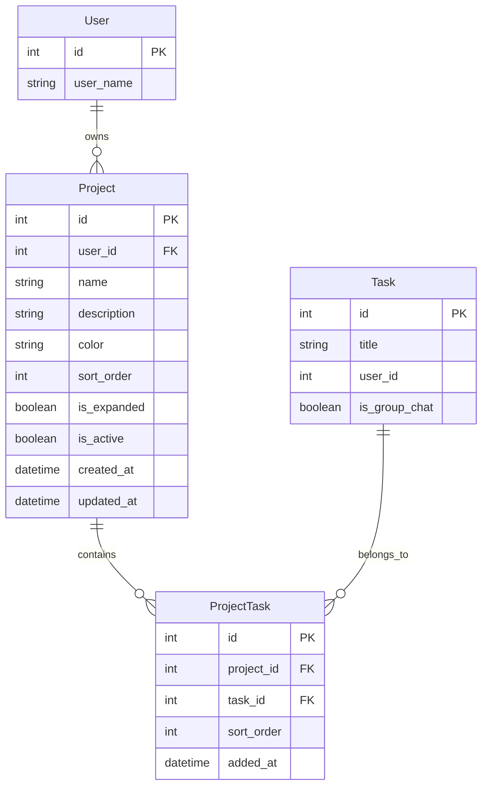
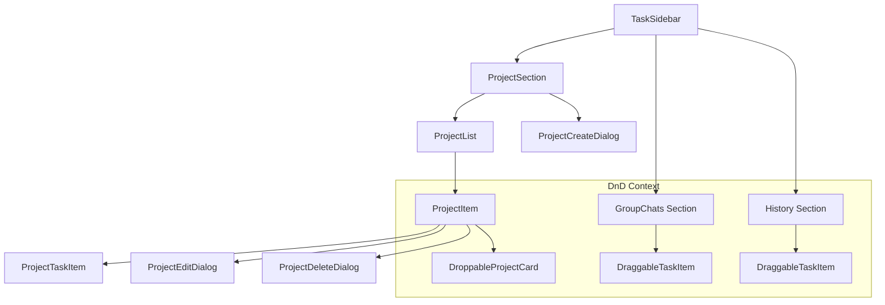

# 项目模块设计方案

## 1. 概述

### 1.1 功能描述
在左侧边栏中，与群聊模块平级，建立一个项目模块。项目是任务的容器，用于对任务进行分类管理。

### 1.2 核心功能
- **新建项目**：创建新的项目容器
- **删除项目**：删除项目（任务不会被删除，只是解除关联）
- **编辑项目名称**：修改项目的显示名称
- **拖拽任务到项目**：支持从历史记录区域拖拽任务（包括群聊）到项目中
- **展开/折叠项目**：项目可展开显示其中的任务列表

### 1.3 UI 位置
项目列表显示在左侧边栏中，位于群聊列表的**上方**。

---

## 2. 数据模型设计

### 2.1 数据库表结构

#### projects 表
```sql
CREATE TABLE projects (
    id INT PRIMARY KEY AUTO_INCREMENT,
    user_id INT NOT NULL,                    -- 项目所有者
    name VARCHAR(100) NOT NULL,              -- 项目名称
    description TEXT DEFAULT '',             -- 项目描述（可选）
    color VARCHAR(20) DEFAULT NULL,          -- 项目颜色标识（可选）
    sort_order INT DEFAULT 0,                -- 排序顺序
    is_expanded BOOLEAN DEFAULT TRUE,        -- 是否展开显示
    is_active BOOLEAN DEFAULT TRUE,          -- 是否激活
    created_at DATETIME NOT NULL,
    updated_at DATETIME NOT NULL,
    
    INDEX idx_user_id (user_id),
    INDEX idx_sort_order (sort_order)
);
```

#### project_tasks 表（关联表）
```sql
CREATE TABLE project_tasks (
    id INT PRIMARY KEY AUTO_INCREMENT,
    project_id INT NOT NULL,                 -- 项目 ID
    task_id INT NOT NULL,                    -- 任务 ID
    sort_order INT DEFAULT 0,                -- 任务在项目中的排序
    added_at DATETIME NOT NULL,              -- 添加时间
    
    UNIQUE KEY uniq_project_task (project_id, task_id),
    INDEX idx_project_id (project_id),
    INDEX idx_task_id (task_id),
    
    FOREIGN KEY (project_id) REFERENCES projects(id) ON DELETE CASCADE,
    FOREIGN KEY (task_id) REFERENCES tasks(id) ON DELETE CASCADE
);
```

### 2.2 数据模型关系



---

## 3. API 设计

### 3.1 项目 CRUD API

| 方法 | 路径 | 描述 |
|------|------|------|
| GET | `/api/projects` | 获取当前用户的项目列表 |
| POST | `/api/projects` | 创建新项目 |
| GET | `/api/projects/{id}` | 获取项目详情（含任务列表） |
| PUT | `/api/projects/{id}` | 更新项目信息 |
| DELETE | `/api/projects/{id}` | 删除项目 |

### 3.2 项目任务关联 API

| 方法 | 路径 | 描述 |
|------|------|------|
| POST | `/api/projects/{id}/tasks` | 添加任务到项目 |
| DELETE | `/api/projects/{id}/tasks/{task_id}` | 从项目移除任务 |
| PUT | `/api/projects/{id}/tasks/reorder` | 重新排序项目中的任务 |

### 3.3 API 请求/响应示例

#### 获取项目列表
```typescript
// GET /api/projects?include_tasks=true
interface ProjectListResponse {
  items: Project[]
  total: number
}

interface Project {
  id: number
  name: string
  description: string
  color: string | null
  sort_order: number
  is_expanded: boolean
  task_count: number
  tasks?: ProjectTask[]  // 当 include_tasks=true 时返回
  created_at: string
  updated_at: string
}

interface ProjectTask {
  id: number           // project_tasks.id
  task_id: number
  task_title: string
  task_status: TaskStatus
  is_group_chat: boolean
  sort_order: number
  added_at: string
}
```

#### 创建项目
```typescript
// POST /api/projects
interface CreateProjectRequest {
  name: string
  description?: string
  color?: string
}

// Response: Project
```

#### 添加任务到项目
```typescript
// POST /api/projects/{id}/tasks
interface AddTaskToProjectRequest {
  task_id: number
}

// Response: ProjectTask
```

---

## 4. 前端架构设计

### 4.1 目录结构

```
frontend/src/
├── apis/
│   └── projects.ts                    # 项目 API 调用
├── types/
│   └── api.ts                         # 添加 Project 类型定义
├── features/
│   └── projects/                      # 项目功能模块
│       ├── components/
│       │   ├── ProjectSection.tsx     # 项目区域容器
│       │   ├── ProjectList.tsx        # 项目列表
│       │   ├── ProjectItem.tsx        # 单个项目（可展开）
│       │   ├── ProjectTaskItem.tsx    # 项目中的任务项
│       │   ├── ProjectCreateDialog.tsx
│       │   ├── ProjectEditDialog.tsx
│       │   ├── ProjectDeleteDialog.tsx
│       │   └── index.ts
│       ├── contexts/
│       │   └── projectContext.tsx     # 项目状态管理
│       ├── hooks/
│       │   └── useProjects.ts         # 项目数据 Hook
│       └── index.ts
├── i18n/locales/
│   ├── zh-CN/
│   │   └── projects.json              # 中文翻译
│   └── en/
│       └── projects.json              # 英文翻译
```

### 4.2 组件层次结构



### 4.3 状态管理

```typescript
// projectContext.tsx
interface ProjectContextValue {
  // 数据
  projects: Project[]
  isLoading: boolean
  error: string | null
  
  // 操作
  refreshProjects: () => Promise<void>
  createProject: (data: CreateProjectRequest) => Promise<Project>
  updateProject: (id: number, data: UpdateProjectRequest) => Promise<Project>
  deleteProject: (id: number) => Promise<void>
  
  // 任务关联
  addTaskToProject: (projectId: number, taskId: number) => Promise<void>
  removeTaskFromProject: (projectId: number, taskId: number) => Promise<void>
  
  // UI 状态
  toggleProjectExpanded: (projectId: number) => void
  expandedProjects: Set<number>
}
```

### 4.4 拖拽实现

使用 `@dnd-kit/core` 实现拖拽功能：

```typescript
// 拖拽类型定义
type DragItemType = 'task' | 'project-task'

interface DragData {
  type: DragItemType
  taskId: number
  taskTitle: string
  isGroupChat: boolean
  sourceProjectId?: number  // 如果从项目中拖出
}

interface DropData {
  type: 'project'
  projectId: number
}
```

拖拽流程：
1. 用户从历史记录或群聊列表拖拽任务
2. 拖拽到项目卡片上时显示高亮效果
3. 释放时调用 `addTaskToProject` API
4. 刷新项目列表显示新添加的任务

---

## 5. UI 设计

### 5.1 侧边栏布局

```
┌─────────────────────────────┐
│  Logo + Collapse Button     │
├─────────────────────────────┤
│  + 新对话                    │
│  📝 代码                     │
│  📚 知识库                   │
├─────────────────────────────┤
│  📁 项目                     │  ← 新增区域
│  ├─ 📂 项目A (3)  ▼ ⋮       │
│  │   ├─ 任务1               │
│  │   ├─ 任务2               │
│  │   └─ 任务3               │
│  └─ 📂 项目B (2)  ▶ ⋮       │
│  + 新建项目                  │
├─────────────────────────────┤
│  💬 群聊                     │
│  ├─ 群聊1                   │
│  └─ 群聊2                   │
├─────────────────────────────┤
│  📋 历史记录  🔍             │
│  ├─ 任务A                   │
│  └─ 任务B                   │
├─────────────────────────────┤
│  👤 用户菜单                 │
└─────────────────────────────┘
```

### 5.2 交互设计

#### 项目操作菜单
- 点击项目名称：展开/折叠任务列表
- 点击 `⋮` 菜单：显示编辑、删除选项
- 点击 `+ 新建项目`：打开创建对话框

#### 拖拽交互
- 拖拽任务时：项目卡片显示可放置区域高亮
- 放置成功：显示成功提示，任务出现在项目中
- 任务可以从一个项目拖到另一个项目

#### 折叠模式
- 侧边栏折叠时：只显示项目图标，hover 显示项目名称
- 项目内任务不显示，点击项目图标展开侧边栏

---

## 6. 实施步骤

### Phase 1: 后端开发
1. 创建 `Project` 和 `ProjectTask` 数据模型
2. 创建数据库迁移脚本
3. 实现 Project Service 层
4. 实现 Project API 端点
5. 编写后端单元测试

### Phase 2: 前端基础
1. 添加 Project 类型定义到 `types/api.ts`
2. 创建 `apis/projects.ts` API 调用
3. 创建 `ProjectContext` 状态管理
4. 创建基础组件（ProjectList, ProjectItem）

### Phase 3: 前端交互
1. 实现项目 CRUD 对话框
2. 集成 `@dnd-kit/core` 拖拽库
3. 实现拖拽任务到项目功能
4. 集成到 TaskSidebar

### Phase 4: 完善
1. 添加 i18n 国际化支持
2. 处理边界情况和错误状态
3. 编写前端测试
4. 性能优化

---

## 7. 技术要点

### 7.1 拖拽库选择
推荐使用 `@dnd-kit/core`：
- 现代化的 React 拖拽库
- 支持触摸设备
- 良好的无障碍支持
- 灵活的自定义能力

### 7.2 性能考虑
- 项目列表使用虚拟滚动（如果项目数量多）
- 任务列表懒加载
- 拖拽时使用 `useMemo` 优化渲染

### 7.3 数据同步
- 使用 SWR 或 React Query 进行数据缓存
- 乐观更新提升用户体验
- WebSocket 实时同步（可选，后续增强）

---

## 8. 风险与注意事项

1. **任务归属**：一个任务可以属于多个项目吗？
   - 当前设计：一个任务可以属于多个项目（多对多关系）
   
2. **删除项目**：删除项目时任务如何处理？
   - 当前设计：只解除关联，任务本身不删除
   
3. **权限控制**：项目是否支持共享？
   - 当前设计：项目仅对创建者可见（个人项目）
   - 后续可扩展支持团队项目

4. **性能**：大量任务时的渲染性能
   - 使用虚拟列表
   - 分页加载项目中的任务
