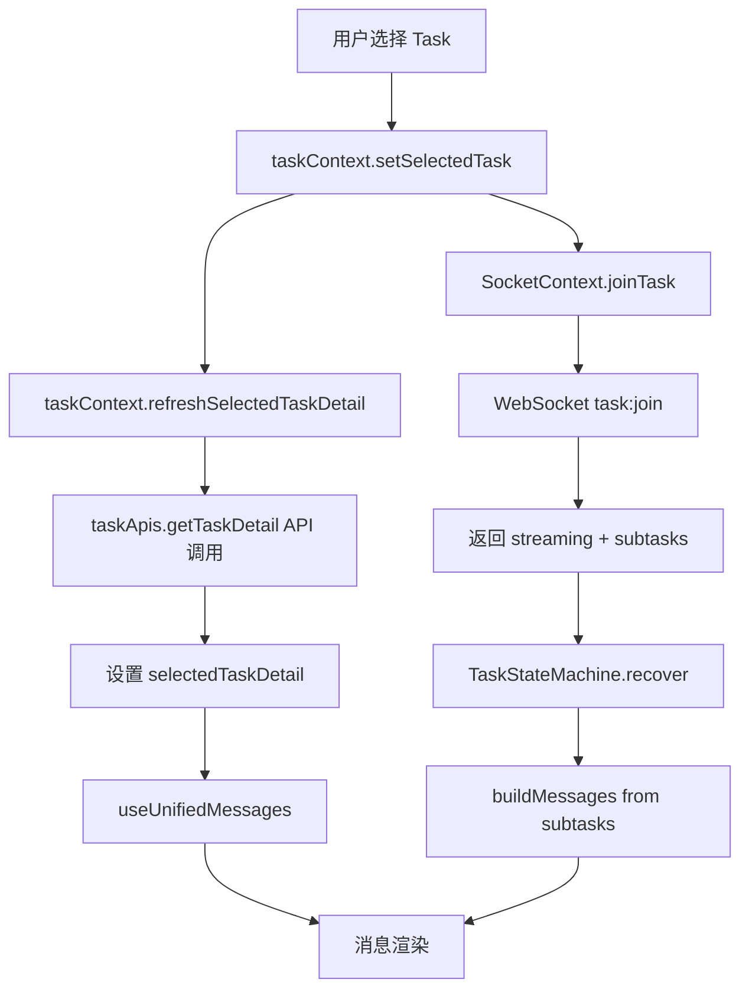
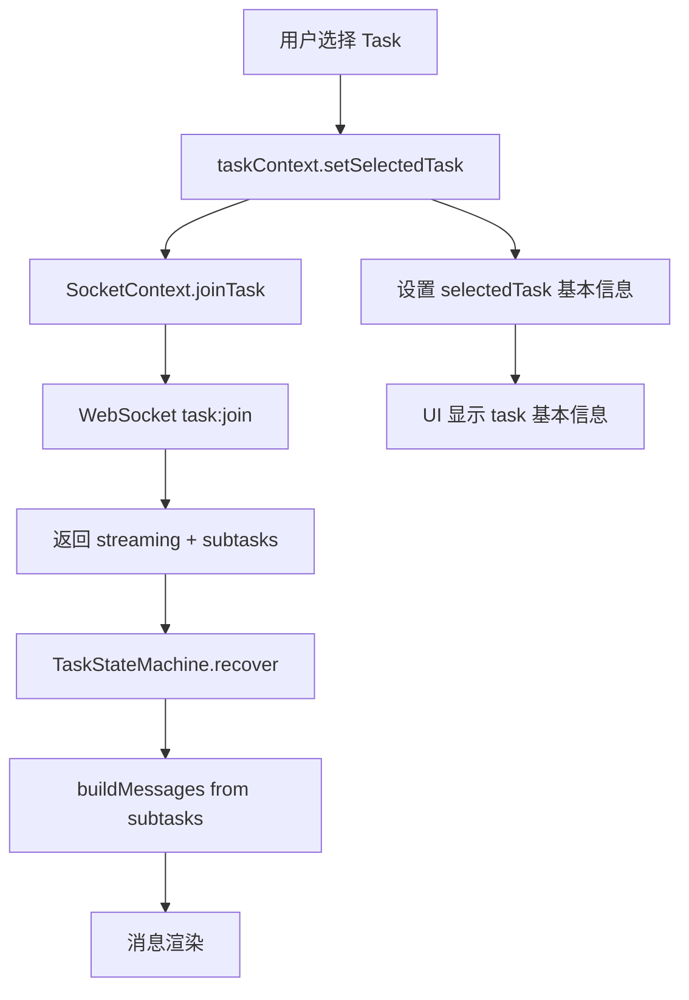
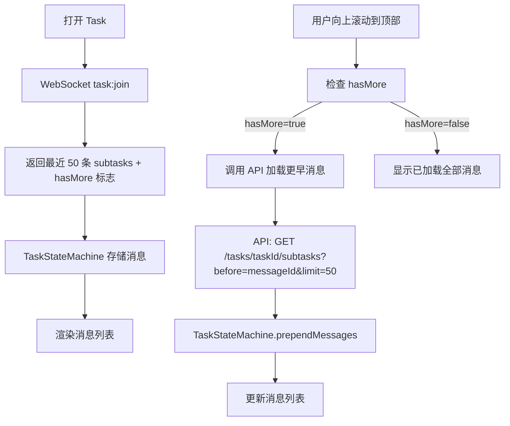

# 移除 Task Detail API 依赖 - 完全依赖 WebSocket Join 返回

## 目标

打开 task 时移除对 `taskApis.getTaskDetail()` 接口的依赖，完全依赖 WebSocket `task:join` 返回的 subtasks 数据来获取消息列表。

**注意：不需要向后兼容，直接重构。**

## 当前架构分析

### 数据流现状



### 问题

1. **重复请求**: 打开 task 时同时调用 API 和 WebSocket，获取相同的 subtasks 数据
2. **数据不一致**: API 返回和 WebSocket 返回可能存在时间差
3. **复杂性**: 需要处理两个数据源的同步和优先级

### 目标架构



## 需要修改的文件

### 1. 前端核心文件

#### 1.1 [`frontend/src/features/tasks/contexts/taskContext.tsx`](frontend/src/features/tasks/contexts/taskContext.tsx)

**修改内容**:
- 移除 `refreshSelectedTaskDetail` 函数中对 subtasks 的处理
- `selectedTaskDetail` 不再包含 subtasks 数据，只保留 task 元数据
- 移除 `taskApis.getTaskDetail()` 调用，改为使用轻量级 API 或直接从 task list 获取

**关键变更**:
```typescript
// 移除
const refreshSelectedTaskDetail = async () => {
  const updatedTaskDetail = await taskApis.getTaskDetail(selectedTask.id)
  // ... 处理 subtasks
}

// 改为
// selectedTaskDetail 只包含 task 元数据，不包含 subtasks
// subtasks 完全由 TaskStateMachine 通过 WebSocket join 获取
```

#### 1.2 [`frontend/src/features/tasks/state/TaskStateMachine.ts`](frontend/src/features/tasks/state/TaskStateMachine.ts)

**修改内容**:
- 确保 `recover()` 方法完全依赖 `joinTask` 返回的 subtasks
- 移除任何对外部 subtasks 参数的依赖
- 当前实现已经正确，只需确认

**当前实现已正确**:
```typescript
// handleRecover 已经从 joinTask response 获取 subtasks
const response = await this.deps.joinTask(this.state.taskId, true)
const subtasks = response.subtasks as TaskDetailSubtask[] | undefined
await this.dispatch({
  type: 'JOIN_SUCCESS',
  streamingInfo: response.streaming,
  subtasks,
})
```

#### 1.3 [`frontend/src/features/tasks/hooks/useUnifiedMessages.ts`](frontend/src/features/tasks/hooks/useUnifiedMessages.ts)

**修改内容**:
- 移除对 `selectedTaskDetail.subtasks` 的任何引用
- 完全依赖 `useTaskStateMachine` 返回的 messages

**当前实现已正确**: 该文件已经完全依赖 TaskStateMachine

#### 1.4 [`frontend/src/features/tasks/components/message/MessagesArea.tsx`](frontend/src/features/tasks/components/message/MessagesArea.tsx)

**修改内容**:
- 移除对 `selectedTaskDetail.subtasks` 的直接访问
- 使用 `useUnifiedMessages` 返回的 messages 进行所有消息相关操作
- 移除 `refreshSelectedTaskDetail` 调用（消息刷新改为触发 TaskStateMachine.recover）

**关键变更**:
```typescript
// 移除
selectedTaskDetail.subtasks.forEach(subtask => { ... })

// 改为使用 messages from useUnifiedMessages
messages.forEach(message => { ... })
```

#### 1.5 [`frontend/src/features/tasks/components/chat/useChatStreamHandlers.tsx`](frontend/src/features/tasks/components/chat/useChatStreamHandlers.tsx)

**修改内容**:
- 移除 `hasRunningSubtask` 对 `selectedTaskDetail.subtasks` 的依赖
- 改为使用 TaskStateMachine 的 streaming 状态
- 移除 `refreshSelectedTaskDetail` 调用

**关键变更**:
```typescript
// 移除
const hasRunningSubtask = useMemo(() => {
  if (!selectedTaskDetail?.subtasks) return false
  return selectedTaskDetail.subtasks.some(
    subtask => subtask.role === 'assistant' && subtask.status === 'RUNNING'
  )
}, [selectedTaskDetail?.subtasks])

// 改为
const hasRunningSubtask = isStreaming // 从 useUnifiedMessages 获取
```

#### 1.6 [`frontend/src/features/tasks/components/chat/ChatArea.tsx`](frontend/src/features/tasks/components/chat/ChatArea.tsx)

**修改内容**:
- 移除对 `selectedTaskDetail.subtasks` 的依赖
- 使用 `messages` 判断是否有消息

**关键变更**:
```typescript
// 移除
const hasSubtasks = selectedTaskDetail?.subtasks && selectedTaskDetail.subtasks.length > 0

// 改为
const hasMessages = messages.length > 0
```

#### 1.7 [`frontend/src/features/tasks/components/clarification/ClarificationForm.tsx`](frontend/src/features/tasks/components/clarification/ClarificationForm.tsx)

**修改内容**:
- 移除对 `selectedTaskDetail.subtasks` 的依赖
- 改为接收 messages 作为 props 或使用 context

### 2. 其他页面文件

以下文件中的 `refreshSelectedTaskDetail` 调用需要评估是否需要保留：

- [`frontend/src/app/(tasks)/chat/ChatPageDesktop.tsx`](frontend/src/app/(tasks)/chat/ChatPageDesktop.tsx)
- [`frontend/src/app/(tasks)/chat/ChatPageMobile.tsx`](frontend/src/app/(tasks)/chat/ChatPageMobile.tsx)
- [`frontend/src/app/(tasks)/code/CodePageDesktop.tsx`](frontend/src/app/(tasks)/code/CodePageDesktop.tsx)
- [`frontend/src/app/(tasks)/code/CodePageMobile.tsx`](frontend/src/app/(tasks)/code/CodePageMobile.tsx)
- [`frontend/src/app/(tasks)/devices/chat/page.tsx`](frontend/src/app/(tasks)/devices/chat/page.tsx)
- [`frontend/src/app/(tasks)/knowledge/document/[knowledgeBaseId]/KnowledgeBaseChatPageDesktop.tsx`](frontend/src/app/(tasks)/knowledge/document/[knowledgeBaseId]/KnowledgeBaseChatPageDesktop.tsx)
- [`frontend/src/app/(tasks)/knowledge/document/[knowledgeBaseId]/KnowledgeBaseChatPageMobile.tsx`](frontend/src/app/(tasks)/knowledge/document/[knowledgeBaseId]/KnowledgeBaseChatPageMobile.tsx)

**处理方式**: 这些文件中的 `refreshSelectedTaskDetail(false)` 调用主要用于刷新 task 状态，可以保留但不再获取 subtasks。

### 3. 后端文件（已完成）

[`backend/app/api/ws/chat_namespace.py`](backend/app/api/ws/chat_namespace.py) 中的 `on_task_join` 已经返回 subtasks：

```python
async def on_task_join(self, sid: str, data: dict) -> dict:
    # ... 
    task_detail = task_kinds_service.get_task_detail(db, task_id=payload.task_id, user_id=user_id)
    subtasks_dict = task_detail.get("subtasks")
    # ...
    return {
        "streaming": {...},
        "subtasks": subtasks_dict,
    }
```

## 实施步骤

### Phase 1: 核心重构

1. **修改 taskContext.tsx**
   - 简化 `refreshSelectedTaskDetail`，不再获取 subtasks
   - 或者完全移除该函数，改为只更新 task 元数据

2. **修改 MessagesArea.tsx**
   - 移除对 `selectedTaskDetail.subtasks` 的所有引用
   - 使用 `useUnifiedMessages` 的 messages

3. **修改 useChatStreamHandlers.tsx**
   - 移除 `hasRunningSubtask` 对 subtasks 的依赖
   - 使用 `isStreaming` 状态

4. **修改 ChatArea.tsx**
   - 移除对 `selectedTaskDetail.subtasks` 的依赖

5. **修改 ClarificationForm.tsx**
   - 适配新的消息来源

### Phase 2: 清理

1. 移除不再需要的 API 调用
2. 更新类型定义（如果需要）
3. 清理未使用的代码

## 分页支持设计

### 需求

WebSocket join 返回最近的 N 条消息（如最近 50 条），当用户向上滚动时，通过 API 加载更早的消息。

### 架构设计



### 后端修改

#### 1. 修改 WebSocket task:join 返回

```python
# backend/app/api/ws/chat_namespace.py
async def on_task_join(self, sid: str, data: dict) -> dict:
    # 获取最近 N 条 subtasks
    INITIAL_LIMIT = 50
    subtasks = get_recent_subtasks(task_id, limit=INITIAL_LIMIT)
    total_count = get_subtask_count(task_id)
    
    return {
        "streaming": {...},
        "subtasks": subtasks,
        "pagination": {
            "has_more": total_count > INITIAL_LIMIT,
            "oldest_message_id": subtasks[-1].message_id if subtasks else None,
            "total_count": total_count,
        }
    }
```

#### 2. 新增分页 API

```python
# backend/app/api/endpoints/tasks.py
@router.get("/tasks/{task_id}/subtasks")
async def get_task_subtasks(
    task_id: int,
    before_message_id: Optional[int] = None,  # 加载此 message_id 之前的消息
    limit: int = 50,
    db: Session = Depends(get_db),
    current_user: User = Depends(get_current_user),
):
    """
    分页获取 task 的 subtasks
    - 不传 before_message_id: 获取最新的 N 条
    - 传 before_message_id: 获取该 message_id 之前的 N 条
    """
    subtasks = get_subtasks_before(
        db, task_id, before_message_id, limit
    )
    has_more = check_has_more(db, task_id, subtasks)
    
    return {
        "subtasks": subtasks,
        "has_more": has_more,
    }
```

### 前端修改

#### 1. 更新 TaskStateMachine

```typescript
// frontend/src/features/tasks/state/TaskStateMachine.ts

interface TaskStateData {
  // ... 现有字段
  pagination: {
    hasMore: boolean
    oldestMessageId: number | null
    isLoadingMore: boolean
  }
}

// 新增方法
prependMessages(subtasks: TaskDetailSubtask[]): void {
  // 将更早的消息添加到列表前面
}

setLoadingMore(loading: boolean): void {
  // 设置加载更多状态
}

updatePagination(pagination: Partial<TaskStateData['pagination']>): void {
  // 更新分页状态
}
```

#### 2. 更新 useUnifiedMessages

```typescript
// frontend/src/features/tasks/hooks/useUnifiedMessages.ts

interface UseUnifiedMessagesResult {
  // ... 现有字段
  hasMore: boolean
  isLoadingMore: boolean
  loadMoreMessages: () => Promise<void>
}
```

#### 3. 更新 MessagesArea

```typescript
// frontend/src/features/tasks/components/message/MessagesArea.tsx

// 添加滚动到顶部检测
const handleScroll = useCallback(() => {
  if (scrollRef.current.scrollTop === 0 && hasMore && !isLoadingMore) {
    loadMoreMessages()
  }
}, [hasMore, isLoadingMore, loadMoreMessages])
```

### 类型定义更新

```typescript
// frontend/src/types/socket.ts

export interface TaskJoinAck {
  streaming?: {
    subtask_id: number
    offset: number
    cached_content: string
  }
  subtasks?: Array<Record<string, unknown>>
  pagination?: {
    has_more: boolean
    oldest_message_id: number | null
    total_count: number
  }
  error?: string
}
```

## 风险和注意事项

1. **消息同步**: 确保 WebSocket 返回的 subtasks 格式与 API 一致
2. **性能**: WebSocket join 返回大量 subtasks 时的性能影响，通过分页解决
3. **滚动位置**: 加载更多消息后需要保持滚动位置不跳动
4. **消息去重**: 分页加载时需要处理可能的重复消息

## 测试场景

1. 打开已有 task，验证消息正确加载
2. 发送新消息，验证消息正确显示
3. 页面刷新后重新打开 task
4. WebSocket 断开重连后的消息恢复
5. 群聊场景的消息同步
6. Clarification 表单的正确显示
7. **向上滚动加载更多历史消息**
8. **加载更多时的 loading 状态显示**
9. **所有消息加载完成后的提示**
