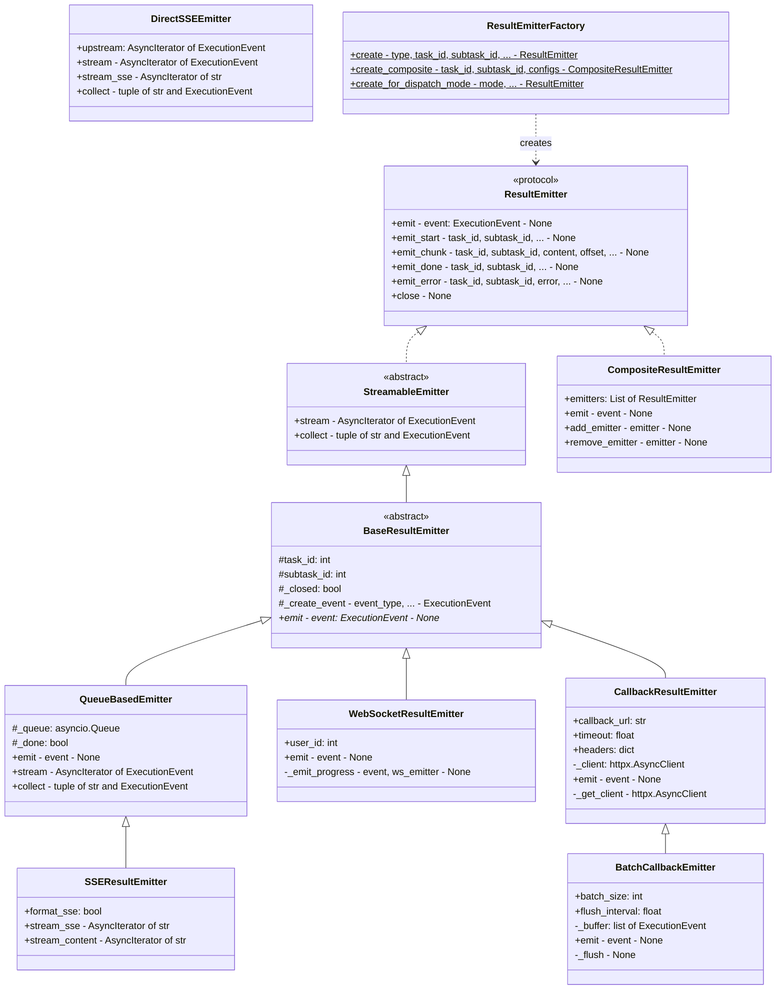
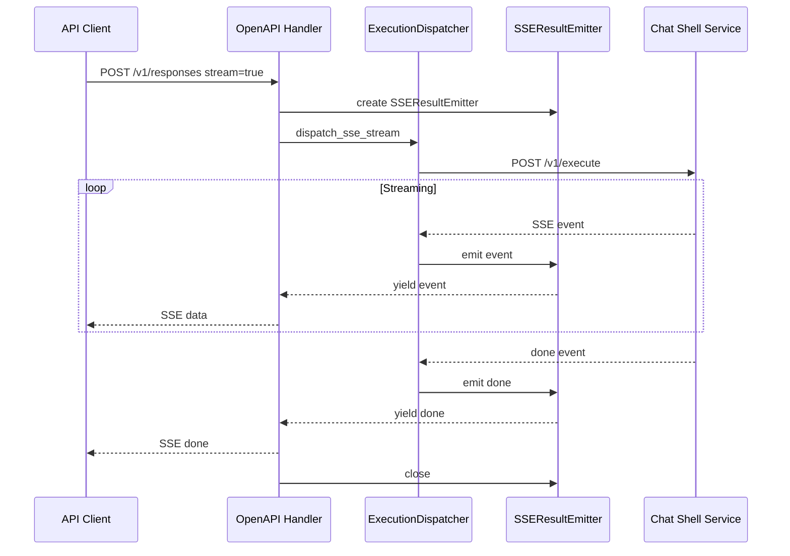
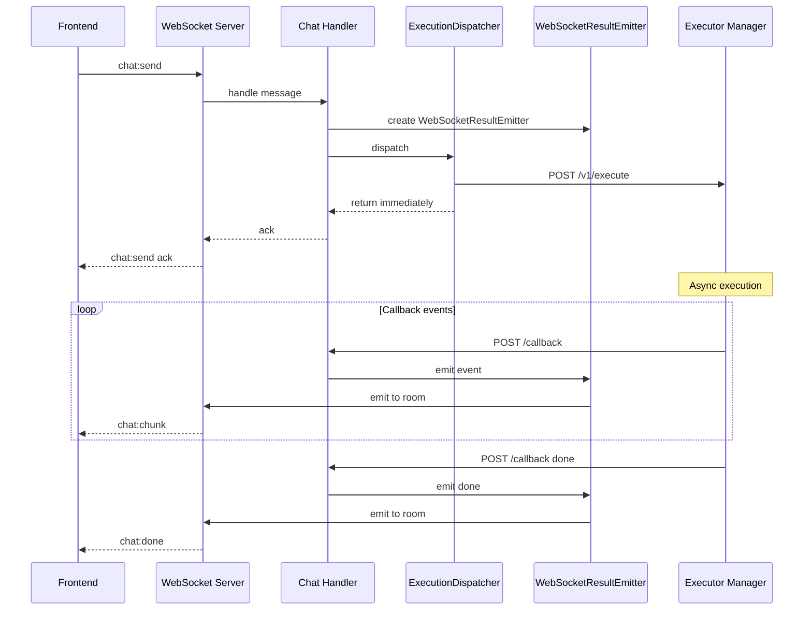
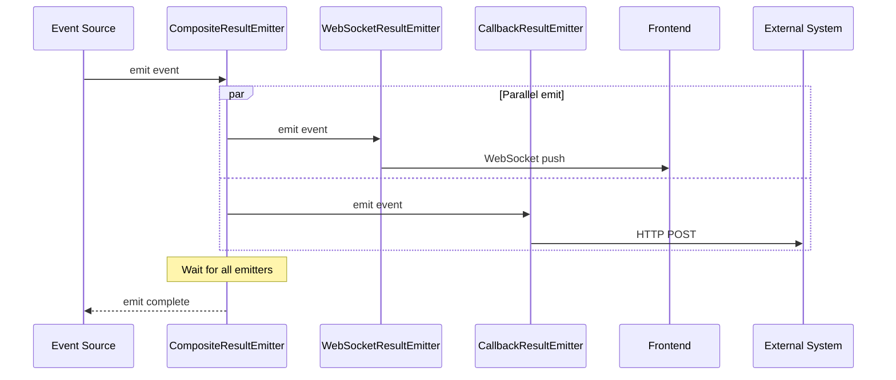

# ResultEmitter 统一接口设计文档

## 1. 背景分析

### 1.1 现有实现分析

当前系统有三种结果返回方式，各自独立实现：

| 方式 | 实现文件 | 使用场景 | 特点 |
|------|----------|----------|------|
| **WebSocket** | [`ws_emitter.py`](../backend/app/services/chat/ws_emitter.py) | 前端实时推送 | 双向通信，支持房间广播 |
| **SSE** | [`chat_response.py`](../backend/app/services/openapi/chat_response.py) | OpenAPI 流式响应 | 单向流式，HTTP 长连接 |
| **HTTP Callback** | [`event_emitter.py`](../backend/app/services/execution/event_emitter.py) | Executor 回调 | 异步推送，通过 HTTP POST |

### 1.2 现有架构问题

1. **代码重复**：三种方式各自处理 `ExecutionEvent`，存在重复逻辑
2. **耦合度高**：`EventEmitter` 直接依赖 `WebSocketEmitter`，无法灵活切换
3. **扩展困难**：新增返回方式需要修改多处代码
4. **测试困难**：无法独立测试各种返回方式

### 1.3 现有事件类型

根据 [`shared/models/execution.py`](../shared/models/execution.py:25)，系统使用统一的 `EventType`：

```python
class EventType(str, Enum):
    START = "start"
    CHUNK = "chunk"
    THINKING = "thinking"
    TOOL = "tool"
    TOOL_START = "tool_start"
    TOOL_RESULT = "tool_result"
    PROGRESS = "progress"
    DONE = "done"
    ERROR = "error"
    CANCEL = "cancel"
    CANCELLED = "cancelled"
```

## 2. 设计目标

### 2.1 核心目标

1. **统一接口**：定义 `ResultEmitter` 协议，所有返回方式实现同一接口
2. **灵活组合**：支持三种返回模式的自由组合
3. **一次性改造**：完整替换现有实现，不保留旧代码
4. **易于扩展**：新增返回方式只需实现接口

### 2.2 支持的返回模式

| 模式 | 描述 | 实现类 |
|------|------|--------|
| 同步流式 | SSE 实时流式返回 | `SSEResultEmitter` |
| 同步非流式 | 阻塞等待完整结果 | `SyncResultEmitter` |
| 异步 | 立即返回，通过 WebSocket/Callback 推送 | `WebSocketResultEmitter` / `CallbackResultEmitter` |

## 3. 接口设计

### 3.1 核心协议定义

```python
# backend/app/services/execution/emitters/protocol.py

from abc import ABC, abstractmethod
from typing import AsyncIterator, Optional, Protocol, runtime_checkable

from shared.models import ExecutionEvent


@runtime_checkable
class ResultEmitter(Protocol):
    """统一的结果发射器协议。
    
    所有结果返回方式都必须实现此协议。
    支持三种模式：
    - 同步流式：通过 stream 方法返回事件流
    - 同步非流式：通过 collect 方法等待完整结果
    - 异步：通过 emit 方法推送事件
    """
    
    async def emit(self, event: ExecutionEvent) -> None:
        """发射单个事件。
        
        用于异步模式，将事件推送到目标。
        
        Args:
            event: 要发射的执行事件
        """
        ...
    
    async def emit_start(
        self,
        task_id: int,
        subtask_id: int,
        message_id: Optional[int] = None,
        **kwargs,
    ) -> None:
        """发射开始事件。"""
        ...
    
    async def emit_chunk(
        self,
        task_id: int,
        subtask_id: int,
        content: str,
        offset: int,
        **kwargs,
    ) -> None:
        """发射内容块事件。"""
        ...
    
    async def emit_done(
        self,
        task_id: int,
        subtask_id: int,
        result: Optional[dict] = None,
        **kwargs,
    ) -> None:
        """发射完成事件。"""
        ...
    
    async def emit_error(
        self,
        task_id: int,
        subtask_id: int,
        error: str,
        **kwargs,
    ) -> None:
        """发射错误事件。"""
        ...
    
    async def close(self) -> None:
        """关闭发射器，释放资源。"""
        ...


class StreamableEmitter(ResultEmitter, ABC):
    """支持流式输出的发射器基类。
    
    除了基本的 emit 功能外，还支持作为异步迭代器使用。
    """
    
    @abstractmethod
    def stream(self) -> AsyncIterator[ExecutionEvent]:
        """返回事件流。
        
        用于同步流式模式，调用方可以迭代获取事件。
        
        Yields:
            ExecutionEvent: 执行事件
        """
        ...
    
    @abstractmethod
    async def collect(self) -> tuple[str, Optional[ExecutionEvent]]:
        """收集所有事件并返回完整结果。
        
        用于同步非流式模式，阻塞等待直到收到 DONE 或 ERROR 事件。
        
        Returns:
            tuple: 累积内容和最终事件
        """
        ...
```

### 3.2 基类实现

```python
# backend/app/services/execution/emitters/base.py

import asyncio
import logging
from abc import ABC, abstractmethod
from typing import AsyncIterator, Optional

from shared.models import EventType, ExecutionEvent

from .protocol import ResultEmitter, StreamableEmitter

logger = logging.getLogger(__name__)


class BaseResultEmitter(ABC):
    """结果发射器基类。
    
    提供通用的事件创建和日志记录功能。
    """
    
    def __init__(self, task_id: int, subtask_id: int):
        self.task_id = task_id
        self.subtask_id = subtask_id
        self._closed = False
    
    def _create_event(
        self,
        event_type: EventType,
        **kwargs,
    ) -> ExecutionEvent:
        """创建执行事件。"""
        return ExecutionEvent.create(
            event_type=event_type,
            task_id=self.task_id,
            subtask_id=self.subtask_id,
            **kwargs,
        )
    
    async def emit_start(
        self,
        task_id: int,
        subtask_id: int,
        message_id: Optional[int] = None,
        **kwargs,
    ) -> None:
        """发射开始事件。"""
        event = self._create_event(
            EventType.START,
            message_id=message_id,
            **kwargs,
        )
        await self.emit(event)
    
    async def emit_chunk(
        self,
        task_id: int,
        subtask_id: int,
        content: str,
        offset: int,
        **kwargs,
    ) -> None:
        """发射内容块事件。"""
        event = self._create_event(
            EventType.CHUNK,
            content=content,
            offset=offset,
            **kwargs,
        )
        await self.emit(event)
    
    async def emit_done(
        self,
        task_id: int,
        subtask_id: int,
        result: Optional[dict] = None,
        **kwargs,
    ) -> None:
        """发射完成事件。"""
        event = self._create_event(
            EventType.DONE,
            result=result,
            **kwargs,
        )
        await self.emit(event)
    
    async def emit_error(
        self,
        task_id: int,
        subtask_id: int,
        error: str,
        **kwargs,
    ) -> None:
        """发射错误事件。"""
        event = self._create_event(
            EventType.ERROR,
            error=error,
            **kwargs,
        )
        await self.emit(event)
    
    @abstractmethod
    async def emit(self, event: ExecutionEvent) -> None:
        """发射事件 - 子类必须实现。"""
        ...
    
    async def close(self) -> None:
        """关闭发射器。"""
        self._closed = True


class QueueBasedEmitter(BaseResultEmitter, StreamableEmitter):
    """基于队列的流式发射器。
    
    使用 asyncio.Queue 实现事件缓冲，支持流式输出。
    """
    
    def __init__(self, task_id: int, subtask_id: int, maxsize: int = 0):
        super().__init__(task_id, subtask_id)
        self._queue: asyncio.Queue[Optional[ExecutionEvent]] = asyncio.Queue(maxsize=maxsize)
        self._done = False
    
    async def emit(self, event: ExecutionEvent) -> None:
        """将事件放入队列。"""
        if self._closed:
            logger.warning(f"Emitter closed, dropping event: {event.type}")
            return
        
        await self._queue.put(event)
        
        # 检查是否是终止事件
        if event.type in (EventType.DONE, EventType.ERROR, EventType.CANCELLED):
            self._done = True
    
    async def stream(self) -> AsyncIterator[ExecutionEvent]:
        """从队列中流式获取事件。"""
        while not self._done or not self._queue.empty():
            try:
                event = await asyncio.wait_for(self._queue.get(), timeout=1.0)
                if event is not None:
                    yield event
                    if event.type in (EventType.DONE, EventType.ERROR, EventType.CANCELLED):
                        break
            except asyncio.TimeoutError:
                if self._closed:
                    break
                continue
    
    async def collect(self) -> tuple[str, Optional[ExecutionEvent]]:
        """收集所有事件并返回完整结果。"""
        accumulated_content = ""
        final_event = None
        
        async for event in self.stream():
            if event.type == EventType.CHUNK:
                accumulated_content += event.content or ""
            elif event.type in (EventType.DONE, EventType.ERROR):
                final_event = event
                break
        
        return accumulated_content, final_event
    
    async def close(self) -> None:
        """关闭发射器并发送终止信号。"""
        await super().close()
        await self._queue.put(None)  # 发送终止信号
```

### 3.3 WebSocket 实现

```python
# backend/app/services/execution/emitters/websocket.py

import logging
from typing import Optional

from shared.models import EventType, ExecutionEvent

from .base import BaseResultEmitter

logger = logging.getLogger(__name__)


class WebSocketResultEmitter(BaseResultEmitter):
    """WebSocket 结果发射器。
    
    通过 WebSocket 将事件推送到前端。
    支持房间广播和用户定向推送。
    """
    
    def __init__(
        self,
        task_id: int,
        subtask_id: int,
        user_id: Optional[int] = None,
    ):
        super().__init__(task_id, subtask_id)
        self.user_id = user_id
    
    async def emit(self, event: ExecutionEvent) -> None:
        """通过 WebSocket 发射事件。"""
        from app.services.chat.ws_emitter import get_ws_emitter
        
        ws_emitter = get_ws_emitter()
        if not ws_emitter:
            logger.warning("[WebSocketResultEmitter] WebSocket emitter not available")
            return
        
        logger.debug(
            f"[WebSocketResultEmitter] Emitting: type={event.type}, "
            f"task_id={event.task_id}, subtask_id={event.subtask_id}"
        )
        
        # 根据事件类型调用对应的 WebSocket 方法
        if event.type == EventType.START:
            await ws_emitter.emit_chat_start(
                task_id=event.task_id,
                subtask_id=event.subtask_id,
                message_id=event.message_id,
            )
        
        elif event.type == EventType.CHUNK:
            await ws_emitter.emit_chat_chunk(
                task_id=event.task_id,
                subtask_id=event.subtask_id,
                content=event.content,
                offset=event.offset,
                result=event.result,
            )
        
        elif event.type == EventType.DONE:
            await ws_emitter.emit_chat_done(
                task_id=event.task_id,
                subtask_id=event.subtask_id,
                offset=event.offset,
                result=event.result,
                message_id=event.message_id,
            )
        
        elif event.type == EventType.ERROR:
            await ws_emitter.emit_chat_error(
                task_id=event.task_id,
                subtask_id=event.subtask_id,
                error=event.error or "Unknown error",
                message_id=event.message_id,
            )
        
        elif event.type == EventType.PROGRESS:
            await self._emit_progress(event, ws_emitter)
        
        elif event.type == EventType.CANCELLED:
            await ws_emitter.emit_chat_cancelled(
                task_id=event.task_id,
                subtask_id=event.subtask_id,
            )
    
    async def _emit_progress(self, event: ExecutionEvent, ws_emitter) -> None:
        """发射进度事件。"""
        if self.user_id:
            await ws_emitter.emit_task_status(
                user_id=self.user_id,
                task_id=event.task_id,
                status=event.status or "RUNNING",
                progress=event.progress,
            )
        else:
            # 需要从数据库获取 user_id
            from app.db.session import SessionLocal
            from app.models.task import TaskResource
            
            db = SessionLocal()
            try:
                task = (
                    db.query(TaskResource)
                    .filter(
                        TaskResource.id == event.task_id,
                        TaskResource.kind == "Task",
                    )
                    .first()
                )
                if task:
                    await ws_emitter.emit_task_status(
                        user_id=task.user_id,
                        task_id=event.task_id,
                        status=event.status or "RUNNING",
                        progress=event.progress,
                    )
            finally:
                db.close()
```

### 3.4 SSE 实现

```python
# backend/app/services/execution/emitters/sse.py

import asyncio
import logging
from typing import AsyncIterator, Optional

from shared.models import EventType, ExecutionEvent

from .base import QueueBasedEmitter

logger = logging.getLogger(__name__)


class SSEResultEmitter(QueueBasedEmitter):
    """SSE 结果发射器。
    
    用于 OpenAPI 流式响应，将事件转换为 SSE 格式。
    """
    
    def __init__(
        self,
        task_id: int,
        subtask_id: int,
        format_sse: bool = True,
    ):
        super().__init__(task_id, subtask_id)
        self.format_sse = format_sse
    
    async def stream_sse(self) -> AsyncIterator[str]:
        """流式输出 SSE 格式的事件。
        
        Yields:
            str: SSE 格式的事件字符串
        """
        async for event in self.stream():
            if self.format_sse:
                yield event.to_sse()
            else:
                yield event.to_dict()
    
    async def stream_content(self) -> AsyncIterator[str]:
        """仅流式输出内容块。
        
        用于简单的文本流式输出场景。
        
        Yields:
            str: 内容文本
        """
        async for event in self.stream():
            if event.type == EventType.CHUNK and event.content:
                yield event.content
            elif event.type == EventType.ERROR:
                raise Exception(event.error or "Unknown error")


class DirectSSEEmitter:
    """直接 SSE 发射器。
    
    不使用队列，直接从上游源流式转发事件。
    用于 ExecutionDispatcher.dispatch_sse_stream 场景。
    """
    
    def __init__(
        self,
        task_id: int,
        subtask_id: int,
        upstream: AsyncIterator[ExecutionEvent],
    ):
        self.task_id = task_id
        self.subtask_id = subtask_id
        self.upstream = upstream
    
    async def stream(self) -> AsyncIterator[ExecutionEvent]:
        """直接转发上游事件。"""
        async for event in self.upstream:
            yield event
    
    async def stream_sse(self) -> AsyncIterator[str]:
        """流式输出 SSE 格式。"""
        async for event in self.stream():
            yield event.to_sse()
    
    async def collect(self) -> tuple[str, Optional[ExecutionEvent]]:
        """收集所有内容。"""
        accumulated_content = ""
        final_event = None
        
        async for event in self.stream():
            if event.type == EventType.CHUNK:
                accumulated_content += event.content or ""
            elif event.type in (EventType.DONE, EventType.ERROR):
                final_event = event
                if event.type == EventType.ERROR:
                    raise Exception(event.error or "Unknown error")
                break
        
        return accumulated_content, final_event
```

### 3.5 HTTP Callback 实现

```python
# backend/app/services/execution/emitters/callback.py

import logging
from typing import Optional

import httpx

from shared.models import ExecutionEvent

from .base import BaseResultEmitter

logger = logging.getLogger(__name__)


class CallbackResultEmitter(BaseResultEmitter):
    """HTTP Callback 结果发射器。
    
    通过 HTTP POST 将事件推送到指定的回调 URL。
    """
    
    def __init__(
        self,
        task_id: int,
        subtask_id: int,
        callback_url: str,
        timeout: float = 30.0,
        headers: Optional[dict] = None,
    ):
        super().__init__(task_id, subtask_id)
        self.callback_url = callback_url
        self.timeout = timeout
        self.headers = headers or {}
        self._client: Optional[httpx.AsyncClient] = None
    
    async def _get_client(self) -> httpx.AsyncClient:
        """获取或创建 HTTP 客户端。"""
        if self._client is None:
            self._client = httpx.AsyncClient(timeout=self.timeout)
        return self._client
    
    async def emit(self, event: ExecutionEvent) -> None:
        """通过 HTTP POST 发射事件。"""
        if self._closed:
            logger.warning("[CallbackResultEmitter] Emitter closed, dropping event")
            return
        
        client = await self._get_client()
        
        try:
            response = await client.post(
                self.callback_url,
                json=event.to_dict(),
                headers=self.headers,
            )
            
            if response.status_code != 200:
                logger.warning(
                    f"[CallbackResultEmitter] Callback failed: "
                    f"status={response.status_code}, url={self.callback_url}"
                )
        except Exception as e:
            logger.error(f"[CallbackResultEmitter] Callback error: {e}")
    
    async def close(self) -> None:
        """关闭发射器和 HTTP 客户端。"""
        await super().close()
        if self._client:
            await self._client.aclose()
            self._client = None


class BatchCallbackEmitter(CallbackResultEmitter):
    """批量 HTTP Callback 发射器。
    
    缓冲事件并批量发送，减少 HTTP 请求次数。
    """
    
    def __init__(
        self,
        task_id: int,
        subtask_id: int,
        callback_url: str,
        batch_size: int = 10,
        flush_interval: float = 1.0,
        **kwargs,
    ):
        super().__init__(task_id, subtask_id, callback_url, **kwargs)
        self.batch_size = batch_size
        self.flush_interval = flush_interval
        self._buffer: list[ExecutionEvent] = []
        self._last_flush = 0.0
    
    async def emit(self, event: ExecutionEvent) -> None:
        """缓冲事件，达到阈值时批量发送。"""
        self._buffer.append(event)
        
        # 终止事件立即刷新
        if event.type in ("done", "error", "cancelled"):
            await self._flush()
            return
        
        # 达到批量大小时刷新
        if len(self._buffer) >= self.batch_size:
            await self._flush()
    
    async def _flush(self) -> None:
        """刷新缓冲区，发送所有事件。"""
        if not self._buffer:
            return
        
        client = await self._get_client()
        events_to_send = self._buffer
        self._buffer = []
        
        try:
            # 使用批量接口
            batch_url = self.callback_url.rstrip("/") + "/batch"
            response = await client.post(
                batch_url,
                json=[e.to_dict() for e in events_to_send],
                headers=self.headers,
            )
            
            if response.status_code != 200:
                logger.warning(
                    f"[BatchCallbackEmitter] Batch callback failed: "
                    f"status={response.status_code}"
                )
        except Exception as e:
            logger.error(f"[BatchCallbackEmitter] Batch callback error: {e}")
    
    async def close(self) -> None:
        """关闭前刷新剩余事件。"""
        await self._flush()
        await super().close()
```

### 3.6 组合发射器

```python
# backend/app/services/execution/emitters/composite.py

import asyncio
import logging
from typing import List, Optional

from shared.models import ExecutionEvent

from .protocol import ResultEmitter

logger = logging.getLogger(__name__)


class CompositeResultEmitter:
    """组合结果发射器。
    
    将事件同时发送到多个发射器，支持灵活组合。
    例如：同时推送到 WebSocket 和 Callback。
    """
    
    def __init__(self, emitters: List[ResultEmitter]):
        self.emitters = emitters
    
    async def emit(self, event: ExecutionEvent) -> None:
        """向所有发射器发送事件。"""
        tasks = [emitter.emit(event) for emitter in self.emitters]
        results = await asyncio.gather(*tasks, return_exceptions=True)
        
        for i, result in enumerate(results):
            if isinstance(result, Exception):
                logger.error(
                    f"[CompositeResultEmitter] Emitter {i} failed: {result}"
                )
    
    async def emit_start(self, task_id: int, subtask_id: int, **kwargs) -> None:
        """向所有发射器发送开始事件。"""
        tasks = [
            emitter.emit_start(task_id, subtask_id, **kwargs)
            for emitter in self.emitters
        ]
        await asyncio.gather(*tasks, return_exceptions=True)
    
    async def emit_chunk(self, task_id: int, subtask_id: int, content: str, offset: int, **kwargs) -> None:
        """向所有发射器发送内容块事件。"""
        tasks = [
            emitter.emit_chunk(task_id, subtask_id, content, offset, **kwargs)
            for emitter in self.emitters
        ]
        await asyncio.gather(*tasks, return_exceptions=True)
    
    async def emit_done(self, task_id: int, subtask_id: int, **kwargs) -> None:
        """向所有发射器发送完成事件。"""
        tasks = [
            emitter.emit_done(task_id, subtask_id, **kwargs)
            for emitter in self.emitters
        ]
        await asyncio.gather(*tasks, return_exceptions=True)
    
    async def emit_error(self, task_id: int, subtask_id: int, error: str, **kwargs) -> None:
        """向所有发射器发送错误事件。"""
        tasks = [
            emitter.emit_error(task_id, subtask_id, error, **kwargs)
            for emitter in self.emitters
        ]
        await asyncio.gather(*tasks, return_exceptions=True)
    
    async def close(self) -> None:
        """关闭所有发射器。"""
        tasks = [emitter.close() for emitter in self.emitters]
        await asyncio.gather(*tasks, return_exceptions=True)
    
    def add_emitter(self, emitter: ResultEmitter) -> None:
        """添加发射器。"""
        self.emitters.append(emitter)
    
    def remove_emitter(self, emitter: ResultEmitter) -> None:
        """移除发射器。"""
        if emitter in self.emitters:
            self.emitters.remove(emitter)
```

### 3.7 工厂类

```python
# backend/app/services/execution/emitters/factory.py

import logging
from enum import Enum
from typing import List, Optional

from .callback import BatchCallbackEmitter, CallbackResultEmitter
from .composite import CompositeResultEmitter
from .protocol import ResultEmitter
from .sse import DirectSSEEmitter, SSEResultEmitter
from .websocket import WebSocketResultEmitter

logger = logging.getLogger(__name__)


class EmitterType(str, Enum):
    """发射器类型。"""
    WEBSOCKET = "websocket"
    SSE = "sse"
    CALLBACK = "callback"
    BATCH_CALLBACK = "batch_callback"


class ResultEmitterFactory:
    """结果发射器工厂。
    
    根据配置创建合适的发射器实例。
    """
    
    @staticmethod
    def create(
        emitter_type: EmitterType,
        task_id: int,
        subtask_id: int,
        **kwargs,
    ) -> ResultEmitter:
        """创建单个发射器。
        
        Args:
            emitter_type: 发射器类型
            task_id: 任务 ID
            subtask_id: 子任务 ID
            **kwargs: 额外参数
        
        Returns:
            ResultEmitter 实例
        """
        if emitter_type == EmitterType.WEBSOCKET:
            return WebSocketResultEmitter(
                task_id=task_id,
                subtask_id=subtask_id,
                user_id=kwargs.get("user_id"),
            )
        
        elif emitter_type == EmitterType.SSE:
            return SSEResultEmitter(
                task_id=task_id,
                subtask_id=subtask_id,
                format_sse=kwargs.get("format_sse", True),
            )
        
        elif emitter_type == EmitterType.CALLBACK:
            return CallbackResultEmitter(
                task_id=task_id,
                subtask_id=subtask_id,
                callback_url=kwargs["callback_url"],
                timeout=kwargs.get("timeout", 30.0),
                headers=kwargs.get("headers"),
            )
        
        elif emitter_type == EmitterType.BATCH_CALLBACK:
            return BatchCallbackEmitter(
                task_id=task_id,
                subtask_id=subtask_id,
                callback_url=kwargs["callback_url"],
                batch_size=kwargs.get("batch_size", 10),
                flush_interval=kwargs.get("flush_interval", 1.0),
                timeout=kwargs.get("timeout", 30.0),
                headers=kwargs.get("headers"),
            )
        
        else:
            raise ValueError(f"Unknown emitter type: {emitter_type}")
    
    @staticmethod
    def create_composite(
        task_id: int,
        subtask_id: int,
        emitter_configs: List[dict],
    ) -> CompositeResultEmitter:
        """创建组合发射器。
        
        Args:
            task_id: 任务 ID
            subtask_id: 子任务 ID
            emitter_configs: 发射器配置列表，每个配置包含 type 和其他参数
        
        Returns:
            CompositeResultEmitter 实例
        """
        emitters = []
        for config in emitter_configs:
            config_copy = config.copy()
            emitter_type = EmitterType(config_copy.pop("type"))
            emitter = ResultEmitterFactory.create(
                emitter_type=emitter_type,
                task_id=task_id,
                subtask_id=subtask_id,
                **config_copy,
            )
            emitters.append(emitter)
        
        return CompositeResultEmitter(emitters)
    
    @staticmethod
    def create_for_dispatch_mode(
        mode: str,
        task_id: int,
        subtask_id: int,
        **kwargs,
    ) -> ResultEmitter:
        """根据调度模式创建发射器。
        
        Args:
            mode: 调度模式 - sse, websocket, http_callback
            task_id: 任务 ID
            subtask_id: 子任务 ID
            **kwargs: 额外参数
        
        Returns:
            ResultEmitter 实例
        """
        mode_mapping = {
            "sse": EmitterType.SSE,
            "websocket": EmitterType.WEBSOCKET,
            "http_callback": EmitterType.CALLBACK,
        }
        
        emitter_type = mode_mapping.get(mode)
        if not emitter_type:
            raise ValueError(f"Unknown dispatch mode: {mode}")
        
        return ResultEmitterFactory.create(
            emitter_type=emitter_type,
            task_id=task_id,
            subtask_id=subtask_id,
            **kwargs,
        )
```

## 4. 类图



## 5. 时序图

### 5.1 SSE 流式响应



### 5.2 WebSocket 异步推送



### 5.3 组合发射器



## 6. 与 ExecutionDispatcher 集成

### 6.1 修改后的 ExecutionDispatcher

```python
# backend/app/services/execution/dispatcher.py

"""
Unified task dispatcher for execution.

Dispatches tasks to execution services based on routing configuration.
"""

import json
import logging
from typing import AsyncIterator, List, Optional

import httpx

from shared.models import EventType, ExecutionEvent, ExecutionRequest

from .emitters import (
    CompositeResultEmitter,
    ResultEmitter,
    ResultEmitterFactory,
    WebSocketResultEmitter,
)
from .router import CommunicationMode, ExecutionRouter, ExecutionTarget

logger = logging.getLogger(__name__)


class ExecutionDispatcher:
    """Unified task dispatcher.

    Core responsibilities:
    1. Use ExecutionRouter to determine target
    2. Send request based on communication mode
    3. Unified event handling via ResultEmitter

    Design principles:
    - Does not know what the execution service is
    - Only knows communication mode and target address
    - Uses ResultEmitter for all event emission
    """

    def __init__(self):
        """Initialize the execution dispatcher."""
        self.router = ExecutionRouter()
        self.http_client = httpx.AsyncClient(timeout=300.0)

    async def dispatch(
        self,
        request: ExecutionRequest,
        device_id: Optional[str] = None,
        emitter: Optional[ResultEmitter] = None,
    ) -> None:
        """Dispatch task.

        Args:
            request: Unified execution request
            device_id: Optional device ID - uses WebSocket mode when specified
            emitter: Optional custom emitter, defaults to WebSocketResultEmitter
        """
        # Route to execution target
        target = self.router.route(request, device_id)

        # Create default emitter if not provided
        if emitter is None:
            emitter = WebSocketResultEmitter(
                task_id=request.task_id,
                subtask_id=request.subtask_id,
                user_id=request.user.get("id") if request.user else None,
            )

        logger.info(
            f"[ExecutionDispatcher] Dispatching: task_id={request.task_id}, "
            f"subtask_id={request.subtask_id}, mode={target.mode.value}"
        )

        try:
            if target.mode == CommunicationMode.SSE:
                await self._dispatch_sse(request, target, emitter)
            elif target.mode == CommunicationMode.WEBSOCKET:
                await self._dispatch_websocket(request, target)
            else:
                await self._dispatch_http_callback(request, target, emitter)
        except Exception as e:
            logger.exception("[ExecutionDispatcher] Error")
            await emitter.emit_error(
                task_id=request.task_id,
                subtask_id=request.subtask_id,
                error=str(e),
            )
        finally:
            await emitter.close()

    async def dispatch_with_composite(
        self,
        request: ExecutionRequest,
        emitter_configs: List[dict],
        device_id: Optional[str] = None,
    ) -> None:
        """Dispatch task with composite emitter.

        Supports sending events to multiple targets simultaneously.

        Args:
            request: Execution request
            emitter_configs: List of emitter configurations
            device_id: Optional device ID
        """
        emitter = ResultEmitterFactory.create_composite(
            task_id=request.task_id,
            subtask_id=request.subtask_id,
            emitter_configs=emitter_configs,
        )

        await self.dispatch(request, device_id, emitter)

    async def _dispatch_sse(
        self,
        request: ExecutionRequest,
        target: ExecutionTarget,
        emitter: ResultEmitter,
    ) -> None:
        """Dispatch task via SSE - active request with long connection.

        Backend actively sends request to executor, executor returns SSE stream.

        Args:
            request: Execution request
            target: Execution target configuration
            emitter: Result emitter for event emission
        """
        url = f"{target.url}{target.endpoint}"

        logger.info(f"[ExecutionDispatcher] SSE dispatch: url={url}")

        # Send START event
        await emitter.emit_start(
            task_id=request.task_id,
            subtask_id=request.subtask_id,
            message_id=request.message_id,
        )

        # Send SSE request and process stream
        async with self.http_client.stream(
            "POST",
            url,
            json=request.to_dict(),
        ) as response:
            async for line in response.aiter_lines():
                if line.startswith("data: "):
                    data_str = line[6:]
                    if data_str == "[DONE]":
                        continue
                    try:
                        data = json.loads(data_str)
                        event = self._parse_sse_event(request, data)
                        await emitter.emit(event)
                    except json.JSONDecodeError:
                        logger.warning(
                            f"[ExecutionDispatcher] Invalid SSE data: {data_str}"
                        )

    async def _dispatch_websocket(
        self,
        request: ExecutionRequest,
        target: ExecutionTarget,
    ) -> None:
        """Dispatch task via WebSocket - passive request with long connection.

        Executor has already connected to Backend, Backend pushes task to specified room.

        Args:
            request: Execution request
            target: Execution target configuration
        """
        from app.core.socketio import get_sio

        sio = get_sio()

        # Send task to specified room
        await sio.emit(
            target.event,
            request.to_dict(),
            room=target.room,
            namespace=target.namespace,
        )

        logger.info(
            f"[ExecutionDispatcher] WebSocket dispatch: "
            f"namespace={target.namespace}, room={target.room}, event={target.event}"
        )

        # In WebSocket mode, events are handled by DeviceNamespace's
        # on_task_progress/on_task_complete
        # No need to wait for response here

    async def _dispatch_http_callback(
        self,
        request: ExecutionRequest,
        target: ExecutionTarget,
        emitter: ResultEmitter,
    ) -> None:
        """Dispatch task via HTTP+Callback.

        Backend sends HTTP request, executor executes asynchronously
        and returns result via callback.

        Args:
            request: Execution request
            target: Execution target configuration
            emitter: Result emitter for event emission
        """
        url = f"{target.url}{target.endpoint}"

        # Send request
        response = await self.http_client.post(
            url,
            json=request.to_dict(),
        )

        if response.status_code != 200:
            raise Exception(f"HTTP dispatch failed: {response.status_code}")

        logger.info(
            f"[ExecutionDispatcher] HTTP+Callback dispatch: "
            f"url={url}, status={response.status_code}"
        )

        # In HTTP+Callback mode, subsequent events are handled via /callback API
        # Only send START event here
        await emitter.emit_start(
            task_id=request.task_id,
            subtask_id=request.subtask_id,
            message_id=request.message_id,
        )

    def _parse_sse_event(
        self, request: ExecutionRequest, data: dict
    ) -> ExecutionEvent:
        """Parse SSE event data.

        Args:
            request: Original execution request
            data: SSE event data dictionary

        Returns:
            Parsed ExecutionEvent
        """
        event_type_str = data.get("type", "chunk")
        try:
            event_type = EventType(event_type_str)
        except ValueError:
            event_type = EventType.CHUNK

        return ExecutionEvent(
            type=event_type,
            task_id=request.task_id,
            subtask_id=request.subtask_id,
            content=data.get("content", ""),
            offset=data.get("offset", 0),
            result=data.get("result"),
            error=data.get("error"),
            message_id=request.message_id,
        )

    async def cancel(
        self,
        request: ExecutionRequest,
        device_id: Optional[str] = None,
    ) -> bool:
        """Cancel task.

        Args:
            request: Execution request
            device_id: Optional device ID

        Returns:
            True if cancel request was sent successfully
        """
        target = self.router.route(request, device_id)

        if target.mode == CommunicationMode.SSE:
            return await self._cancel_sse(request, target)
        elif target.mode == CommunicationMode.WEBSOCKET:
            return await self._cancel_websocket(request, target)
        else:
            return await self._cancel_http(request, target)

    async def _cancel_sse(
        self,
        request: ExecutionRequest,
        target: ExecutionTarget,
    ) -> bool:
        """Cancel SSE task."""
        url = f"{target.url}/v1/cancel"
        try:
            response = await self.http_client.post(
                url,
                json={"task_id": request.task_id, "subtask_id": request.subtask_id},
            )
            return response.status_code == 200
        except Exception:
            return False

    async def _cancel_websocket(
        self,
        request: ExecutionRequest,
        target: ExecutionTarget,
    ) -> bool:
        """Cancel task via WebSocket."""
        from app.core.socketio import get_sio

        sio = get_sio()
        await sio.emit(
            "task:cancel",
            {"task_id": request.task_id, "subtask_id": request.subtask_id},
            room=target.room,
            namespace=target.namespace,
        )
        return True

    async def _cancel_http(
        self,
        request: ExecutionRequest,
        target: ExecutionTarget,
    ) -> bool:
        """Cancel task via HTTP."""
        url = f"{target.url}/v1/cancel"
        try:
            response = await self.http_client.post(
                url,
                json={"task_id": request.task_id, "subtask_id": request.subtask_id},
            )
            return response.status_code == 200
        except Exception:
            return False

    async def dispatch_sse_stream(
        self,
        request: ExecutionRequest,
    ) -> AsyncIterator[ExecutionEvent]:
        """Dispatch task via SSE and yield events.

        Used for OpenAPI streaming responses. This method does NOT emit events
        to any emitter - it yields them directly to the caller.

        Args:
            request: Execution request

        Yields:
            ExecutionEvent for each SSE event

        Raises:
            ValueError: If the target mode is not SSE
        """
        target = self.router.route(request, device_id=None)

        if target.mode != CommunicationMode.SSE:
            raise ValueError(
                f"dispatch_sse_stream only supports SSE mode, got {target.mode}"
            )

        url = f"{target.url}{target.endpoint}"

        logger.info(
            f"[ExecutionDispatcher] SSE stream dispatch: url={url}, "
            f"task_id={request.task_id}, subtask_id={request.subtask_id}"
        )

        # Yield START event
        yield ExecutionEvent(
            type=EventType.START,
            task_id=request.task_id,
            subtask_id=request.subtask_id,
            message_id=request.message_id,
        )

        try:
            async with self.http_client.stream(
                "POST",
                url,
                json=request.to_dict(),
            ) as response:
                if response.status_code != 200:
                    error_text = await response.aread()
                    logger.error(
                        f"[ExecutionDispatcher] SSE stream failed: "
                        f"status={response.status_code}, error={error_text.decode()}"
                    )
                    yield ExecutionEvent(
                        type=EventType.ERROR,
                        task_id=request.task_id,
                        subtask_id=request.subtask_id,
                        error=f"HTTP {response.status_code}: {error_text.decode()}",
                    )
                    return

                async for line in response.aiter_lines():
                    if line.startswith("data: "):
                        data_str = line[6:]
                        if data_str == "[DONE]":
                            continue
                        try:
                            data = json.loads(data_str)
                            event = self._parse_sse_event(request, data)
                            yield event
                            # Stop iteration on terminal events
                            if event.type in (EventType.DONE, EventType.ERROR):
                                return
                        except json.JSONDecodeError:
                            logger.warning(
                                f"[ExecutionDispatcher] Invalid SSE data: {data_str}"
                            )

        except httpx.TimeoutException as e:
            logger.error(
                f"[ExecutionDispatcher] SSE stream timeout: "
                f"task_id={request.task_id}, error={e}"
            )
            yield ExecutionEvent(
                type=EventType.ERROR,
                task_id=request.task_id,
                subtask_id=request.subtask_id,
                error="Request timeout",
            )

        except httpx.RequestError as e:
            logger.error(
                f"[ExecutionDispatcher] SSE stream error: "
                f"task_id={request.task_id}, error={e}"
            )
            yield ExecutionEvent(
                type=EventType.ERROR,
                task_id=request.task_id,
                subtask_id=request.subtask_id,
                error=str(e),
            )

    async def dispatch_sse_sync(
        self,
        request: ExecutionRequest,
    ) -> tuple[str, Optional[ExecutionEvent]]:
        """Dispatch task via SSE and wait for complete response.

        Used for BackgroundChatExecutor and OpenAPI sync responses.
        Accumulates all CHUNK events and returns the complete content.

        Args:
            request: Execution request

        Returns:
            Tuple of accumulated_content and final_event
            - accumulated_content: All text content from CHUNK events
            - final_event: The final DONE or ERROR event or None if stream ended unexpectedly

        Raises:
            Exception: If an ERROR event is received
        """
        accumulated_content = ""
        final_event = None

        logger.info(
            f"[ExecutionDispatcher] SSE sync dispatch: "
            f"task_id={request.task_id}, subtask_id={request.subtask_id}"
        )

        async for event in self.dispatch_sse_stream(request):
            if event.type == EventType.CHUNK:
                accumulated_content += event.content or ""
            elif event.type == EventType.DONE:
                final_event = event
                logger.info(
                    f"[ExecutionDispatcher] SSE sync completed: "
                    f"task_id={request.task_id}, content_length={len(accumulated_content)}"
                )
            elif event.type == EventType.ERROR:
                logger.error(
                    f"[ExecutionDispatcher] SSE sync error: "
                    f"task_id={request.task_id}, error={event.error}"
                )
                raise Exception(event.error or "Unknown error")

        return accumulated_content, final_event


# Global instance
execution_dispatcher = ExecutionDispatcher()
```

### 6.2 修改 Callback API

```python
# backend/app/api/endpoints/internal/callback.py

"""
Unified callback API for execution events.

This module provides a unified callback endpoint for receiving execution events
from different sources - executor_manager, device, etc - and forwarding them
to the frontend via ResultEmitter.
"""

import logging
from typing import Optional

from fastapi import APIRouter, Depends, HTTPException
from pydantic import BaseModel, Field
from sqlalchemy.orm import Session

from app.api.dependencies import get_db
from app.services.execution.emitters import WebSocketResultEmitter
from shared.models import EventType, ExecutionEvent

logger = logging.getLogger(__name__)

router = APIRouter(prefix="/callback", tags=["execution-callback"])


class CallbackRequest(BaseModel):
    """Request model for execution callback."""

    type: str = Field(..., description="Event type - start, chunk, done, error, progress")
    task_id: int = Field(..., description="Task ID")
    subtask_id: int = Field(..., description="Subtask ID")
    content: Optional[str] = Field(None, description="Content for chunk events")
    offset: Optional[int] = Field(None, description="Offset for chunk events")
    result: Optional[dict] = Field(None, description="Result data for done events")
    error: Optional[str] = Field(None, description="Error message for error events")
    message_id: Optional[int] = Field(None, description="Message ID for ordering")
    progress: Optional[int] = Field(None, description="Progress percentage")
    status: Optional[str] = Field(None, description="Status for progress events")
    user_id: Optional[int] = Field(None, description="User ID for progress events")


class CallbackResponse(BaseModel):
    """Response model for execution callback."""

    status: str = "ok"
    message: Optional[str] = None


@router.post("", response_model=CallbackResponse)
async def handle_callback(
    request: CallbackRequest,
    db: Session = Depends(get_db),
) -> CallbackResponse:
    """Handle execution callback.

    This endpoint receives execution events from executors and forwards them
    to the frontend via WebSocketResultEmitter.

    Args:
        request: Callback request with event data
        db: Database session

    Returns:
        CallbackResponse indicating success
    """
    logger.info(
        f"[Callback] Received event: type={request.type}, "
        f"task_id={request.task_id}, subtask_id={request.subtask_id}"
    )

    try:
        # Parse event type
        try:
            event_type = EventType(request.type)
        except ValueError:
            logger.warning(f"[Callback] Unknown event type: {request.type}")
            raise HTTPException(status_code=400, detail=f"Unknown event type: {request.type}")

        # Create execution event
        event = ExecutionEvent(
            type=event_type,
            task_id=request.task_id,
            subtask_id=request.subtask_id,
            content=request.content or "",
            offset=request.offset or 0,
            result=request.result,
            error=request.error,
            message_id=request.message_id,
            progress=request.progress,
            status=request.status,
        )

        # Emit event via WebSocketResultEmitter
        emitter = WebSocketResultEmitter(
            task_id=request.task_id,
            subtask_id=request.subtask_id,
            user_id=request.user_id,
        )
        await emitter.emit(event)

        logger.info(
            f"[Callback] Event emitted: type={event_type.value}, "
            f"task_id={request.task_id}, subtask_id={request.subtask_id}"
        )

        return CallbackResponse(status="ok")

    except HTTPException:
        raise
    except Exception as e:
        logger.exception(f"[Callback] Error handling callback: {e}")
        raise HTTPException(status_code=500, detail=str(e))


@router.post("/batch", response_model=CallbackResponse)
async def handle_batch_callback(
    events: list[CallbackRequest],
    db: Session = Depends(get_db),
) -> CallbackResponse:
    """Handle batch execution callbacks.

    This endpoint receives multiple execution events and processes them in order.

    Args:
        events: List of callback requests
        db: Database session

    Returns:
        CallbackResponse indicating success
    """
    logger.info(f"[Callback] Received batch of {len(events)} events")

    processed = 0
    errors = []

    for request in events:
        try:
            # Parse event type
            try:
                event_type = EventType(request.type)
            except ValueError:
                errors.append(f"Unknown event type: {request.type}")
                continue

            # Create execution event
            event = ExecutionEvent(
                type=event_type,
                task_id=request.task_id,
                subtask_id=request.subtask_id,
                content=request.content or "",
                offset=request.offset or 0,
                result=request.result,
                error=request.error,
                message_id=request.message_id,
                progress=request.progress,
                status=request.status,
            )

            # Emit event
            emitter = WebSocketResultEmitter(
                task_id=request.task_id,
                subtask_id=request.subtask_id,
                user_id=request.user_id,
            )
            await emitter.emit(event)
            processed += 1

        except Exception as e:
            errors.append(f"Error processing event for subtask {request.subtask_id}: {str(e)}")

    logger.info(f"[Callback] Batch processed: {processed}/{len(events)} events")

    if errors:
        return CallbackResponse(
            status="partial",
            message=f"Processed {processed}/{len(events)} events. Errors: {'; '.join(errors[:5])}"
        )

    return CallbackResponse(status="ok", message=f"Processed {processed} events")
```

## 7. 文件结构

### 7.1 新增文件

```
backend/app/services/execution/emitters/
├── __init__.py              # 导出所有公共类
├── protocol.py              # 协议定义
├── base.py                  # 基类实现
├── websocket.py             # WebSocket 发射器
├── sse.py                   # SSE 发射器
├── callback.py              # HTTP Callback 发射器
├── composite.py             # 组合发射器
└── factory.py               # 工厂类
```

### 7.2 删除文件

```
backend/app/services/execution/event_emitter.py  # 完全删除，功能由 WebSocketResultEmitter 替代
```

### 7.3 修改文件

| 文件 | 修改内容 |
|------|----------|
| [`backend/app/services/execution/__init__.py`](../backend/app/services/execution/__init__.py) | 更新导出，移除 EventEmitter，添加 emitters 模块 |
| [`backend/app/services/execution/dispatcher.py`](../backend/app/services/execution/dispatcher.py) | 完全重写，使用 ResultEmitter |
| [`backend/app/api/endpoints/internal/callback.py`](../backend/app/api/endpoints/internal/callback.py) | 使用 WebSocketResultEmitter 替代 EventEmitter |
| [`backend/app/services/openapi/chat_response.py`](../backend/app/services/openapi/chat_response.py) | 可选：使用 SSEResultEmitter 简化代码 |

### 7.4 `__init__.py` 导出

```python
# backend/app/services/execution/emitters/__init__.py

from .base import BaseResultEmitter, QueueBasedEmitter
from .callback import BatchCallbackEmitter, CallbackResultEmitter
from .composite import CompositeResultEmitter
from .factory import EmitterType, ResultEmitterFactory
from .protocol import ResultEmitter, StreamableEmitter
from .sse import DirectSSEEmitter, SSEResultEmitter
from .websocket import WebSocketResultEmitter

__all__ = [
    # Protocol
    "ResultEmitter",
    "StreamableEmitter",
    # Base
    "BaseResultEmitter",
    "QueueBasedEmitter",
    # Implementations
    "WebSocketResultEmitter",
    "SSEResultEmitter",
    "DirectSSEEmitter",
    "CallbackResultEmitter",
    "BatchCallbackEmitter",
    "CompositeResultEmitter",
    # Factory
    "EmitterType",
    "ResultEmitterFactory",
]
```

```python
# backend/app/services/execution/__init__.py

from .dispatcher import ExecutionDispatcher, execution_dispatcher
from .emitters import (
    BatchCallbackEmitter,
    CallbackResultEmitter,
    CompositeResultEmitter,
    DirectSSEEmitter,
    EmitterType,
    ResultEmitter,
    ResultEmitterFactory,
    SSEResultEmitter,
    StreamableEmitter,
    WebSocketResultEmitter,
)
from .router import CommunicationMode, ExecutionRouter, ExecutionTarget

__all__ = [
    # Dispatcher
    "ExecutionDispatcher",
    "execution_dispatcher",
    # Router
    "ExecutionRouter",
    "ExecutionTarget",
    "CommunicationMode",
    # Emitters
    "ResultEmitter",
    "StreamableEmitter",
    "WebSocketResultEmitter",
    "SSEResultEmitter",
    "DirectSSEEmitter",
    "CallbackResultEmitter",
    "BatchCallbackEmitter",
    "CompositeResultEmitter",
    "EmitterType",
    "ResultEmitterFactory",
]
```

## 8. 使用示例

### 8.1 基本使用

```python
# WebSocket 推送
emitter = WebSocketResultEmitter(task_id=1, subtask_id=1, user_id=100)
await emitter.emit_start(task_id=1, subtask_id=1)
await emitter.emit_chunk(task_id=1, subtask_id=1, content="Hello", offset=0)
await emitter.emit_done(task_id=1, subtask_id=1, result={"value": "Hello"})
await emitter.close()

# SSE 流式
emitter = SSEResultEmitter(task_id=1, subtask_id=1)
# 在另一个协程中发送事件
async for sse_data in emitter.stream_sse():
    yield sse_data

# HTTP Callback
emitter = CallbackResultEmitter(
    task_id=1,
    subtask_id=1,
    callback_url="http://external-system/callback",
)
await emitter.emit(event)
```

### 8.2 组合使用

```python
# 同时推送到 WebSocket 和外部系统
emitter = ResultEmitterFactory.create_composite(
    task_id=1,
    subtask_id=1,
    emitter_configs=[
        {"type": "websocket", "user_id": 100},
        {"type": "callback", "callback_url": "http://external/callback"},
    ],
)

await emitter.emit(event)  # 同时发送到两个目标
```

### 8.3 与 ExecutionDispatcher 集成

```python
# 使用自定义发射器
custom_emitter = CompositeResultEmitter([
    WebSocketResultEmitter(task_id=1, subtask_id=1),
    CallbackResultEmitter(task_id=1, subtask_id=1, callback_url="..."),
])

await execution_dispatcher.dispatch(request, emitter=custom_emitter)

# 使用组合发射器配置
await execution_dispatcher.dispatch_with_composite(
    request,
    emitter_configs=[
        {"type": "websocket", "user_id": 100},
        {"type": "callback", "callback_url": "http://external/callback"},
    ],
)
```

## 9. 实现任务清单

以下是一次性完整改造需要完成的所有任务：

### 9.1 创建新文件

- [ ] 创建 `backend/app/services/execution/emitters/__init__.py`
- [ ] 创建 `backend/app/services/execution/emitters/protocol.py`
- [ ] 创建 `backend/app/services/execution/emitters/base.py`
- [ ] 创建 `backend/app/services/execution/emitters/websocket.py`
- [ ] 创建 `backend/app/services/execution/emitters/sse.py`
- [ ] 创建 `backend/app/services/execution/emitters/callback.py`
- [ ] 创建 `backend/app/services/execution/emitters/composite.py`
- [ ] 创建 `backend/app/services/execution/emitters/factory.py`

### 9.2 修改现有文件

- [ ] 修改 `backend/app/services/execution/__init__.py` - 更新导出
- [ ] 修改 `backend/app/services/execution/dispatcher.py` - 使用 ResultEmitter
- [ ] 修改 `backend/app/api/endpoints/internal/callback.py` - 使用 WebSocketResultEmitter

### 9.3 删除文件

- [ ] 删除 `backend/app/services/execution/event_emitter.py`

### 9.4 测试

- [ ] 创建 `backend/tests/services/execution/emitters/test_protocol.py`
- [ ] 创建 `backend/tests/services/execution/emitters/test_websocket.py`
- [ ] 创建 `backend/tests/services/execution/emitters/test_sse.py`
- [ ] 创建 `backend/tests/services/execution/emitters/test_callback.py`
- [ ] 创建 `backend/tests/services/execution/emitters/test_composite.py`
- [ ] 创建 `backend/tests/services/execution/emitters/test_factory.py`
- [ ] 更新 `backend/tests/services/execution/test_dispatcher.py`

## 10. 测试策略

### 10.1 单元测试

```python
# backend/tests/services/execution/emitters/test_websocket.py

import pytest
from unittest.mock import AsyncMock, patch

from app.services.execution.emitters import WebSocketResultEmitter
from shared.models import EventType, ExecutionEvent


@pytest.mark.asyncio
async def test_emit_start():
    with patch("app.services.chat.ws_emitter.get_ws_emitter") as mock_get:
        mock_ws = AsyncMock()
        mock_get.return_value = mock_ws
        
        emitter = WebSocketResultEmitter(task_id=1, subtask_id=1)
        await emitter.emit_start(task_id=1, subtask_id=1, message_id=100)
        
        mock_ws.emit_chat_start.assert_called_once_with(
            task_id=1,
            subtask_id=1,
            message_id=100,
        )


@pytest.mark.asyncio
async def test_emit_chunk():
    with patch("app.services.chat.ws_emitter.get_ws_emitter") as mock_get:
        mock_ws = AsyncMock()
        mock_get.return_value = mock_ws
        
        emitter = WebSocketResultEmitter(task_id=1, subtask_id=1)
        await emitter.emit_chunk(task_id=1, subtask_id=1, content="Hello", offset=0)
        
        mock_ws.emit_chat_chunk.assert_called_once()


@pytest.mark.asyncio
async def test_emit_done():
    with patch("app.services.chat.ws_emitter.get_ws_emitter") as mock_get:
        mock_ws = AsyncMock()
        mock_get.return_value = mock_ws
        
        emitter = WebSocketResultEmitter(task_id=1, subtask_id=1)
        await emitter.emit_done(task_id=1, subtask_id=1, result={"value": "test"})
        
        mock_ws.emit_chat_done.assert_called_once()


@pytest.mark.asyncio
async def test_emit_error():
    with patch("app.services.chat.ws_emitter.get_ws_emitter") as mock_get:
        mock_ws = AsyncMock()
        mock_get.return_value = mock_ws
        
        emitter = WebSocketResultEmitter(task_id=1, subtask_id=1)
        await emitter.emit_error(task_id=1, subtask_id=1, error="Test error")
        
        mock_ws.emit_chat_error.assert_called_once()
```

### 10.2 集成测试

```python
# backend/tests/services/execution/emitters/test_integration.py

import pytest
from unittest.mock import AsyncMock

from app.services.execution.emitters import (
    CompositeResultEmitter,
    WebSocketResultEmitter,
    CallbackResultEmitter,
)
from shared.models import EventType, ExecutionEvent


@pytest.mark.asyncio
async def test_composite_emitter():
    """测试组合发射器同时向多个目标发送。"""
    ws_emitter = AsyncMock(spec=WebSocketResultEmitter)
    callback_emitter = AsyncMock(spec=CallbackResultEmitter)
    
    composite = CompositeResultEmitter([ws_emitter, callback_emitter])
    
    event = ExecutionEvent.create(
        EventType.CHUNK,
        task_id=1,
        subtask_id=1,
        content="test",
    )
    
    await composite.emit(event)
    
    ws_emitter.emit.assert_called_once_with(event)
    callback_emitter.emit.assert_called_once_with(event)


@pytest.mark.asyncio
async def test_composite_emitter_partial_failure():
    """测试组合发射器部分失败时继续执行。"""
    ws_emitter = AsyncMock(spec=WebSocketResultEmitter)
    ws_emitter.emit.side_effect = Exception("WebSocket error")
    
    callback_emitter = AsyncMock(spec=CallbackResultEmitter)
    
    composite = CompositeResultEmitter([ws_emitter, callback_emitter])
    
    event = ExecutionEvent.create(
        EventType.CHUNK,
        task_id=1,
        subtask_id=1,
        content="test",
    )
    
    # Should not raise exception
    await composite.emit(event)
    
    # Callback should still be called
    callback_emitter.emit.assert_called_once_with(event)
```

## 11. 总结

本设计通过引入统一的 `ResultEmitter` 协议，实现了：

1. **接口统一**：所有返回方式实现同一协议
2. **灵活组合**：通过 `CompositeResultEmitter` 支持多目标推送
3. **一次性改造**：完全替换旧实现，不保留兼容代码
4. **易于扩展**：新增返回方式只需实现协议接口
5. **可测试性**：每个发射器可独立测试

设计遵循了 AGENTS.md 中的代码设计原则：
- 高内聚低耦合
- 使用设计模式（策略模式、工厂模式、组合模式）
- 提取公共逻辑到基类
- 删除旧代码，不保留兼容层
